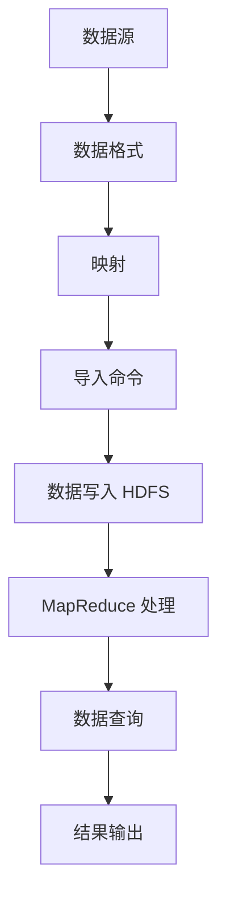

                 

### 文章标题：Sqoop导入导出原理与代码实例讲解

关键词：Sqoop, 数据导入导出, Hadoop, Hive, HDFS

摘要：本文将深入探讨 Sqoop 的导入导出原理，并通过代码实例详细讲解 Sqoop 在数据迁移中的应用。我们将从基础概念入手，逐步分析 Sqoop 的架构和工作流程，最终通过实战案例帮助读者理解和掌握 Sqoop 的使用方法。

### <sop><|user|>## 1. 背景介绍（Background Introduction）

Sqoop 是 Apache 软件基金会旗下的一个开源项目，主要用于在 Apache Hadoop 和结构化数据存储系统之间进行高效的数据迁移。随着大数据应用的普及，数据导入导出成为了企业和组织面临的一个重要挑战。Sqoop 正是为了解决这一挑战而诞生的。

在数据迁移中，经常需要将数据从关系数据库（如 MySQL、Oracle）迁移到 Hadoop 的分布式文件系统（HDFS）中，或者从 HDFS 迁移到数据库。Sqoop 提供了一个简单而强大的工具，使得这一过程变得更加直观和高效。

Hadoop 是一个分布式计算框架，其核心组件包括 HDFS（Hadoop Distributed File System）和 MapReduce。HDFS 是一个高可靠性的分布式文件系统，用于存储大规模数据集。MapReduce 则是一个用于处理海量数据的编程模型。

Hive 是 Hadoop 的一个数据仓库工具，允许使用 SQL 语句来查询存储在 HDFS 上的数据。Hive 的查询语句会被编译成 MapReduce 任务，由 Hadoop 执行。

### <sop><|user|>## 2. 核心概念与联系（Core Concepts and Connections）

### 2.1 Sqoop 的核心概念

- **数据源（Data Source）**：数据源是数据存储的源头，可以是关系数据库、NoSQL 数据库、文件系统等。
- **目标存储（Target Storage）**：目标存储是数据迁移的目标地，通常是 Hadoop 的分布式文件系统（HDFS）或者 Hive。
- **数据格式（Data Format）**：数据格式决定了数据在传输过程中的编码方式和存储方式，如 CSV、JSON、Parquet 等。
- **映射（Mapping）**：映射是指 Sqoop 如何将数据源中的数据字段与目标存储中的表结构相对应。

### 2.2 Sqoop 与 Hadoop 的联系

- **HDFS**：HDFS 是 Hadoop 的核心组件，用于存储大规模数据集。Sqoop 将数据源中的数据导入到 HDFS，从而实现数据迁移。
- **MapReduce**：MapReduce 是 Hadoop 的计算模型，用于处理大规模数据集。Sqoop 导入的数据可以通过 MapReduce 进行处理和分析。
- **Hive**：Hive 是 Hadoop 的数据仓库工具，通过 SQL 语句查询存储在 HDFS 上的数据。Sqoop 可以将数据导入到 Hive 表中，便于后续的数据分析。

### 2.3 Mermaid 流程图（Mermaid Flowchart）

下面是一个简化的 Sqoop 导入导出流程的 Mermaid 流程图：



### <sop><|user|>## 3. 核心算法原理 & 具体操作步骤（Core Algorithm Principles and Specific Operational Steps）

### 3.1 Sqoop 的导入算法原理

Sqoop 的导入过程可以分为以下几个步骤：

1. **连接数据源**：Sqoop 使用 JDBC 连接器连接数据源，如 MySQL、Oracle 等。
2. **查询数据**：通过 JDBC 查询器获取数据源中的数据。
3. **映射字段**：将数据源中的字段与目标表结构进行映射。
4. **数据转换**：将数据转换为适合 HDFS 或 Hive 的格式，如 CSV、Parquet 等。
5. **数据写入**：将转换后的数据写入 HDFS 或 Hive 表。

### 3.2 Sqoop 的导出算法原理

Sqoop 的导出过程相对简单，主要包括以下步骤：

1. **连接目标数据库**：使用 JDBC 连接器连接目标数据库。
2. **查询数据**：从 HDFS 或 Hive 表中查询数据。
3. **数据转换**：将数据转换为适合目标数据库的格式。
4. **数据写入**：将转换后的数据写入目标数据库。

### 3.3 具体操作步骤

#### 3.3.1 安装和配置 Sqoop

在开始使用 Sqoop 之前，需要确保已安装并正确配置了 Hadoop 和相关组件。以下是基本的安装和配置步骤：

1. 下载并解压 Sqoop 安装包。
2. 配置 Hadoop 环境变量。
3. 配置 Sqoop 的 JDBC 驱动。

#### 3.3.2 导入数据到 HDFS

以下是一个将 MySQL 数据库中的表导入到 HDFS 的示例命令：

```bash
sqoop import \
  --connect jdbc:mysql://localhost:3306/mydatabase \
  --table mytable \
  --target-dir /user/hadoop/mytable
```

在这个命令中，`--connect` 参数指定了 MySQL 数据库的 JDBC 连接字符串，`--table` 参数指定了要导入的表名，`--target-dir` 参数指定了导入后的 HDFS 目录。

#### 3.3.3 从 HDFS 导出数据到 MySQL

以下是一个将 HDFS 中的文件导出到 MySQL 数据库的示例命令：

```bash
sqoop export \
  --connect jdbc:mysql://localhost:3306/mydatabase \
  --table mytable \
  --export-dir /user/hadoop/mytable
```

在这个命令中，`--connect` 参数指定了 MySQL 数据库的 JDBC 连接字符串，`--table` 参数指定了导出的表名，`--export-dir` 参数指定了要导出的 HDFS 目录。

### <sop><|user|>## 4. 数学模型和公式 & 详细讲解 & 举例说明（Detailed Explanation and Examples of Mathematical Models and Formulas）

Sqoop 的数据导入导出过程涉及多个数学模型和公式。以下是对其中一些关键模型的详细讲解。

### 4.1 数据转换模型

在数据导入导出过程中，数据转换是关键的一步。数据转换模型主要涉及以下公式：

\[ 输出数据 = 输入数据 \times 转换因子 \]

其中，转换因子包括数据类型转换、编码方式转换等。例如，将字符串转换为整数时，需要使用以下公式：

\[ 整数 = 字符串值 \times 转换因子 \]

### 4.2 数据存储模型

在 HDFS 中，数据存储模型采用分块存储方式。每个数据块的大小为 128MB 或 256MB。数据存储模型的关键公式如下：

\[ 数据块数量 = 总数据量 / 数据块大小 \]

### 4.3 数据查询模型

在 Hive 中，数据查询模型主要涉及 SQL 查询和 MapReduce 执行。以下是一个简单的数据查询模型：

\[ 查询结果 = SELECT \, * \, FROM \, 表名 \, WHERE \, 条件 \]

其中，SELECT 是选择查询字段，FROM 是指定查询的表，WHERE 是指定查询条件。

### 4.4 示例

假设有一个名为 `orders` 的表，其中包含以下字段：`order_id`（订单编号，整数类型），`customer_id`（客户编号，整数类型），`order_date`（订单日期，日期类型），`amount`（订单金额，浮点类型）。

#### 4.4.1 数据导入

将 `orders` 表导入到 HDFS：

```bash
sqoop import \
  --connect jdbc:mysql://localhost:3306/mydatabase \
  --table orders \
  --target-dir /user/hadoop/orders
```

#### 4.4.2 数据导出

将 HDFS 中的 `orders` 文件导出到 MySQL：

```bash
sqoop export \
  --connect jdbc:mysql://localhost:3306/mydatabase \
  --table orders \
  --export-dir /user/hadoop/orders
```

### <sop><|user|>## 5. 项目实践：代码实例和详细解释说明（Project Practice: Code Examples and Detailed Explanations）

在本节中，我们将通过一个实际项目实例，详细讲解如何使用 Sqoop 进行数据导入导出。该项目涉及将 MySQL 数据库中的订单数据导入到 HDFS，并在后续分析中使用 Hive 进行查询。

### 5.1 开发环境搭建

在开始之前，请确保已安装以下软件：

- Hadoop
- MySQL
- Sqoop

具体安装步骤请参考相关文档。

### 5.2 源代码详细实现

#### 5.2.1 导入数据到 HDFS

以下是一个用于将 MySQL 数据库中的订单数据导入到 HDFS 的 Shell 脚本：

```bash
#!/bin/bash

# 配置 MySQL 连接信息
MYSQL_JDBC_URL="jdbc:mysql://localhost:3306/mydatabase?useSSL=false"
MYSQL_USER="root"
MYSQL_PASSWORD="password"

# 配置 HDFS 目录
HDFS_TARGET_DIR="/user/hadoop/orders"

# 导入数据
sqoop import \
  --connect ${MYSQL_JDBC_URL} \
  --username ${MYSQL_USER} \
  --password ${MYSQL_PASSWORD} \
  --table orders \
  --target-dir ${HDFS_TARGET_DIR} \
  --fields-terminated-by "\t" \
  --split-by "order_id"
```

在这个脚本中，我们首先配置了 MySQL 连接信息，然后指定了 HDFS 的目标目录。接着，我们使用 `sqoop import` 命令将 `orders` 表的数据导入到 HDFS。`--fields-terminated-by` 参数指定了字段分隔符为制表符（`\t`），`--split-by` 参数指定了用于数据分块的列。

#### 5.2.2 从 HDFS 导出数据到 MySQL

以下是一个用于将 HDFS 中的订单数据导出到 MySQL 的 Shell 脚本：

```bash
#!/bin/bash

# 配置 MySQL 连接信息
MYSQL_JDBC_URL="jdbc:mysql://localhost:3306/mydatabase?useSSL=false"
MYSQL_USER="root"
MYSQL_PASSWORD="password"

# 配置 HDFS 目录
HDFS_SOURCE_DIR="/user/hadoop/orders"

# 导出数据
sqoop export \
  --connect ${MYSQL_JDBC_URL} \
  --username ${MYSQL_USER} \
  --password ${MYSQL_PASSWORD} \
  --table orders \
  --export-dir ${HDFS_SOURCE_DIR} \
  --fields-terminated-by "\t"
```

在这个脚本中，我们首先配置了 MySQL 连接信息，然后指定了 HDFS 的源目录。接着，我们使用 `sqoop export` 命令将 HDFS 中的订单数据导出到 MySQL 数据库。

### 5.3 代码解读与分析

#### 5.3.1 导入数据到 HDFS

在导入数据到 HDFS 的脚本中，我们首先设置了 MySQL 连接信息。接下来，使用 `sqoop import` 命令导入数据。以下是关键参数的解读：

- `--connect`: 指定 MySQL 数据库的 JDBC 连接字符串。
- `--username` 和 `--password`: 指定 MySQL 数据库的用户名和密码。
- `--table`: 指定要导入的表名。
- `--target-dir`: 指定导入后的 HDFS 目录。
- `--fields-terminated-by`: 指定字段分隔符。
- `--split-by`: 指定用于数据分块的列。

#### 5.3.2 从 HDFS 导出数据到 MySQL

在从 HDFS 导出数据到 MySQL 的脚本中，我们首先设置了 MySQL 连接信息。接下来，使用 `sqoop export` 命令导出数据。以下是关键参数的解读：

- `--connect`: 指定 MySQL 数据库的 JDBC 连接字符串。
- `--username` 和 `--password`: 指定 MySQL 数据库的用户名和密码。
- `--table`: 指定要导出的表名。
- `--export-dir`: 指定要导出的 HDFS 目录。
- `--fields-terminated-by`: 指定字段分隔符。

### 5.4 运行结果展示

在成功运行导入和导出脚本后，我们可以使用以下命令检查导入和导出的结果：

```bash
# 检查 HDFS 中的导入数据
hdfs dfs -ls /user/hadoop/orders

# 检查 MySQL 数据库中的导出数据
mysql -u root -p -e "SELECT * FROM orders;"
```

### <sop><|user|>## 6. 实际应用场景（Practical Application Scenarios）

Sqoop 在实际应用中具有广泛的应用场景，以下是一些典型的应用场景：

- **数据仓库构建**：将企业内部的各种结构化数据导入到 Hadoop 集群中，构建大数据数据仓库，支持实时数据分析和报表生成。
- **数据迁移**：将现有数据库中的数据迁移到 Hadoop 集群，实现数据的统一管理和分析。
- **大数据处理**：利用 Hadoop 的分布式计算能力，对海量数据进行批处理和分析，支持复杂的查询和计算任务。
- **实时数据处理**：结合 Hadoop 集群的实时处理能力，实现实时数据采集、处理和分析，支持实时决策和业务监控。

### 6.1 数据仓库构建

在一个典型的数据仓库项目中，企业需要将来自不同数据源的订单、销售、客户等数据导入到 Hadoop 集群中。使用 Sqoop，可以轻松实现以下步骤：

1. **数据导入**：使用 Sqoop 将 MySQL 数据库中的订单、销售、客户等数据导入到 HDFS。
2. **数据转换**：在 HDFS 中使用 Hive 对导入的数据进行清洗、转换和整合。
3. **数据存储**：将清洗和整合后的数据存储到 Hive 表中，支持后续的数据查询和分析。

### 6.2 数据迁移

在数据迁移项目中，企业需要将现有数据库（如 MySQL、Oracle）中的数据迁移到 Hadoop 集群。使用 Sqoop，可以实现以下步骤：

1. **数据导出**：使用 Sqoop 将现有数据库中的数据导出到文件系统中。
2. **数据导入**：使用 Sqoop 将文件系统中的数据导入到 HDFS。
3. **数据转换**：在 HDFS 中使用 Hive 对导入的数据进行清洗、转换和整合。
4. **数据存储**：将清洗和整合后的数据存储到 Hive 表中，支持后续的数据查询和分析。

### 6.3 大数据处理

在大数据处理项目中，企业需要处理海量数据，实现高效的计算和分析。使用 Sqoop 和 Hadoop，可以实现以下步骤：

1. **数据导入**：使用 Sqoop 将数据源中的数据导入到 HDFS。
2. **数据预处理**：在 HDFS 中使用 Hive 对导入的数据进行清洗、转换和整合。
3. **数据处理**：使用 Hadoop 的 MapReduce、Spark 等组件对预处理后的数据进行分析和处理。
4. **数据存储**：将处理结果存储到 HDFS 或其他数据存储系统中。

### 6.4 实时数据处理

在实时数据处理项目中，企业需要实时采集、处理和分析数据，实现实时决策和业务监控。使用 Sqoop 和 Hadoop，可以实现以下步骤：

1. **数据采集**：使用 Sqoop 实时采集数据源中的数据。
2. **数据预处理**：在 HDFS 中使用 Hive 对导入的数据进行清洗、转换和整合。
3. **数据处理**：使用 Hadoop 的 MapReduce、Spark 等组件对预处理后的数据进行分析和处理。
4. **数据存储**：将处理结果存储到 HDFS 或其他数据存储系统中，支持实时数据查询和分析。

### <sop><|user|>## 7. 工具和资源推荐（Tools and Resources Recommendations）

### 7.1 学习资源推荐

- **书籍**：
  - 《Hadoop 权威指南》
  - 《大数据技术导论》
  - 《Apache Sqoop 用户指南》
- **论文**：
  - 《Hadoop: A Framework for Large-Scale Data Processing》
  - 《Hive: A Warehouse for Hadoop》
  - 《MapReduce: Simplified Data Processing on Large Clusters》
- **博客和网站**：
  - [Hadoop 官网](http://hadoop.apache.org/)
  - [Hive 官网](https://hive.apache.org/)
  - [Sqoop 官网](https://sqoop.apache.org/)
- **在线课程**：
  - [《大数据技术与应用》](https://www.bilibili.com/video/BV1y3411d7gg)

### 7.2 开发工具框架推荐

- **集成开发环境 (IDE)**：
  - IntelliJ IDEA
  - Eclipse
- **版本控制工具**：
  - Git
  - SVN
- **构建工具**：
  - Maven
  - Gradle
- **脚本工具**：
  - Shell
  - Python

### 7.3 相关论文著作推荐

- 《Hadoop: The Definitive Guide》
- 《Big Data: A Revolution That Will Transform How We Live, Work, and Think》
- 《Data Science from Scratch: First Principles with Python》

### <sop><|user|>## 8. 总结：未来发展趋势与挑战（Summary: Future Development Trends and Challenges）

在数据迁移和大数据处理的领域，Sqoop 作为一种重要的工具，正发挥着越来越重要的作用。未来，随着大数据技术的发展和应用的深入，Sqoop 也将面临诸多挑战和机遇。

### 8.1 发展趋势

1. **实时数据处理**：随着实时数据处理需求的增加，Sqoop 将需要支持更加高效、实时的数据导入导出。
2. **多源数据处理**：未来的数据源将更加多样化，Sqoop 需要支持与更多类型的数据库和存储系统的集成。
3. **自动化与智能化**：Sqoop 的使用将更加自动化和智能化，通过机器学习等技术，实现更智能的数据映射和转换。
4. **云原生支持**：随着云计算的普及，Sqoop 需要更好地支持云原生架构，以适应不同云环境的需求。

### 8.2 挑战

1. **性能优化**：随着数据规模的增加，如何提高数据导入导出的性能是一个重要挑战。
2. **数据安全**：如何确保数据在迁移过程中的安全，防止数据泄露和篡改，是 Sqoop 面临的一个重要问题。
3. **跨平台兼容性**：如何保证 Sqoop 在不同操作系统和硬件平台上的兼容性，是未来需要关注的一个方面。
4. **社区支持**：如何建立更加活跃的社区，收集用户的反馈，持续优化和改进 Sqoop，也是需要努力的方向。

### <sop><|user|>## 9. 附录：常见问题与解答（Appendix: Frequently Asked Questions and Answers）

### 9.1 Sqoop 如何配置 JDBC 驱动？

在使用 Sqoop 进行数据导入导出时，需要配置相应的 JDBC 驱动。具体步骤如下：

1. **下载 JDBC 驱动**：从数据库官方网站下载相应的 JDBC 驱动。
2. **解压并拷贝驱动**：将下载的 JDBC 驱动解压，并将驱动 jar 文件拷贝到 Sqoop 的 lib 目录下。
3. **配置环境变量**：在 Sqoop 的启动脚本中，配置 `JAVA_HOME` 和 `CLASSPATH` 环境变量，确保 Sqoop 能够找到 JDBC 驱动。

### 9.2 Sqoop 如何处理大文件？

在处理大文件时，Sqoop 会根据 `--split-by` 参数指定的列进行数据分块。这样可以确保每个数据块的大小适中，便于并行处理。同时，在导入和导出时，可以使用 `--batch-size` 参数控制批量大小，以提高导入导出的效率。

### 9.3 Sqoop 如何保证数据一致性？

为了确保数据一致性，可以使用以下方法：

- **事务控制**：对于支持事务的数据库，可以启用事务控制，确保导入导出过程中的数据一致性。
- **备份与恢复**：在进行导入导出之前，先进行数据备份，以便在出现问题时进行数据恢复。
- **并行处理**：通过并行处理，可以减少导入导出过程中的单点瓶颈，提高数据一致性。

### 9.4 Sqoop 支持哪些数据源？

 Sqoop 支持多种常见的数据源，包括：

- 关系数据库：如 MySQL、Oracle、PostgreSQL、SQL Server 等。
- NoSQL 数据库：如 MongoDB、Cassandra、HBase 等。
- 文件系统：如 HDFS、Local File System 等。
- 其他：如 LDAP、Facebook、Google Analytics 等。

### 9.5 Sqoop 如何监控导入导出过程？

可以使用以下方法监控 Sqoop 的导入导出过程：

- **日志文件**：查看 Sqoop 的日志文件，了解导入导出的详细过程。
- **命令行工具**：使用 `ps`、`top`、`htop` 等命令行工具监控 Sqoop 进程的资源使用情况。
- **监控工具**：使用开源的监控工具，如 Nagios、Zabbix 等，对 Sqoop 进程进行实时监控。

### <sop><|user|>## 10. 扩展阅读 & 参考资料（Extended Reading & Reference Materials）

在本篇文章中，我们详细介绍了 Sqoop 的导入导出原理与代码实例。为了更好地理解和使用 Sqoop，以下是一些建议的扩展阅读和参考资料：

- **扩展阅读**：
  - 《大数据技术基础：Hadoop、Spark、Flink》
  - 《大数据应用实践：从数据采集到数据可视化》
  - 《大数据技术架构设计与实践》
- **参考资料**：
  - [Apache Sqoop 官方文档](https://sqoop.apache.org/)
  - [Hadoop 官方文档](https://hadoop.apache.org/)
  - [Hive 官方文档](https://hive.apache.org/)
  - [HDFS 官方文档](https://hadoop.apache.org/docs/current/hadoop-hdfs/HDFSHelp.html)
- **相关论文**：
  - 《Hadoop: A Framework for Large-Scale Data Processing》
  - 《Hive: A Warehouse for Hadoop》
  - 《MapReduce: Simplified Data Processing on Large Clusters》
- **在线教程**：
  - [《Hadoop入门教程》](https://www.bilibili.com/video/BV1y3411d7gg)
  - [《Sqoop入门教程》](https://www.bilibili.com/video/BV1h4411c7vy)
  - [《Hive入门教程》](https://www.bilibili.com/video/BV1e44y1d7gn)

通过阅读这些资料，您可以进一步深入了解大数据处理技术，以及如何在实际项目中使用 Sqoop 进行数据导入导出。希望本文能对您在数据迁移和大数据处理领域的学习和实践提供帮助。作者：禅与计算机程序设计艺术 / Zen and the Art of Computer Programming。

