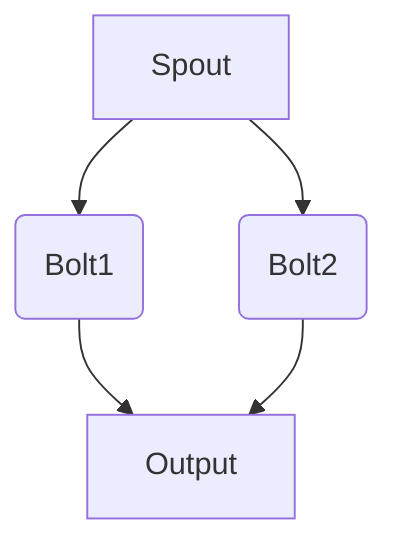

                 

### 文章标题

Storm Topology原理与代码实例讲解

关键词：Storm, Topology, 分布式流处理, 算子, 数据流, 编程模型

摘要：本文深入探讨了Storm Topology的核心原理，通过详细的代码实例，解释了如何构建和配置Storm流处理应用程序。文章旨在为开发者提供清晰、易懂的指导，帮助他们掌握Storm的编程模型和分布式流处理技术，从而在实际项目中有效应用Storm。

<|assistant|>### 1. 背景介绍（Background Introduction）

Storm是一个开源的分布式实时处理系统，旨在应对大数据处理中的实时性和大规模需求。它提供了高效且易于扩展的框架，允许开发人员构建复杂的数据流处理应用程序。Storm的核心概念之一是Topology，它代表了应用程序的数据流处理逻辑。

在传统的数据处理系统中，数据处理通常是批处理模式，这意味着数据需要在一段时间内积累到一定量后才能进行处理。然而，随着实时数据的重要性日益增加，例如社交网络数据、实时交易数据等，批处理模式已经无法满足需求。分布式流处理框架，如Storm，应运而生，它能够在数据到达时立即进行处理，确保实时性和准确性。

Storm Topology是Storm中的核心概念，它由一系列的Spout和Bolt组成。Spout负责生成数据流，而Bolt则负责处理数据流中的数据。通过Toplogy，可以定义数据流从Spout到Bolt的流转过程，以及各个Bolt之间的数据依赖关系。这种流处理模式使得Storm能够处理大规模、实时且多变的数据流。

本文将通过一个具体的代码实例，详细讲解Storm Topology的构建过程，包括Spout和Bolt的实现，以及如何配置和部署Storm应用程序。读者可以跟随示例逐步学习，掌握Storm的编程模型和分布式流处理技术。

<|assistant|>## 2. 核心概念与联系（Core Concepts and Connections）

### 2.1 什么是Storm Topology？

Storm Topology是Storm中的一个抽象概念，它代表了应用程序的数据流处理逻辑。在Storm中，Topology由一系列的Spout和Bolt组成，它们通过流图（Stream Graph）相互连接，形成一个完整的流处理流程。

Spout是Topology的起点，负责生成数据流。Spout可以是随机生成数据的，也可以是从外部系统（如Kafka、DB等）读取数据的。每个Spout实例都会不断地生成数据流，并将其发送到Bolt。

Bolt是Topology中的核心组件，负责处理数据流中的数据。Bolt可以从多个Spout接收数据，也可以将数据传递给其他Bolt。在处理过程中，Bolt可以进行数据过滤、转换、聚合等操作。

### 2.2 Storm Topology的基本架构

一个典型的Storm Topology包含以下几个关键组件：

- **Spouts**：数据流的生成者，可以是随机生成数据，也可以是从外部系统读取数据。
- **Bolts**：数据流处理器，负责对数据流进行过滤、转换、聚合等操作。
- **流图（Stream Graph）**：描述了Spouts和Bolts之间的数据流转关系。通过流图，可以清晰地看到数据如何在Topology中流动。
- **流分组（Stream Grouping）**：定义了数据如何从Spout发送到Bolt。常见的流分组方式包括随机分组、字段分组、全局分组等。
- **配置信息**：包括Topology的名称、Spout和Bolt的数量、任务分配策略等。

### 2.3 Storm Topology的工作原理

当启动一个Storm Topology时，以下过程会发生：

1. **初始化**：首先，Storm会根据配置信息初始化Topology，包括创建Spout和Bolt的实例，并设置流分组和任务分配策略。
2. **数据流生成**：Spout开始生成数据流，并将数据发送到对应的Bolt。
3. **数据处理**：Bolt接收到数据后，根据定义的操作逻辑对数据进行处理，如过滤、转换、聚合等。
4. **数据流转**：处理后的数据会继续传递到下一个Bolt，或被写入外部系统。
5. **结束**：当数据流处理完毕后，Topology会结束运行。

### 2.4 Storm Topology的优势

- **可扩展性**：Storm支持水平扩展，可以轻松处理大规模数据流。
- **高可用性**：Storm具有自动故障转移和恢复机制，确保数据处理的高可用性。
- **低延迟**：Storm提供低延迟的数据处理能力，适用于实时数据处理场景。
- **灵活性**：通过定义流图和流分组，可以灵活地调整数据处理的逻辑和策略。

### 2.5 Storm Topology的Mermaid流程图

以下是一个简单的Storm Topology的Mermaid流程图，展示了Spout和两个Bolt之间的数据流转关系：



在上述流程图中，Spout生成数据流，并将数据同时发送到Bolt1和Bolt2。Bolt1对数据进行过滤和转换，然后将处理后的数据传递给输出组件。Bolt2则对数据进行聚合操作，并将结果也发送到输出组件。

通过上述Mermaid流程图，可以清晰地了解Storm Topology的基本结构和数据流转过程。在接下来的章节中，我们将通过一个具体的代码实例，进一步探讨如何构建和配置Storm应用程序。

<|assistant|>## 3. 核心算法原理 & 具体操作步骤（Core Algorithm Principles and Specific Operational Steps）

### 3.1 Storm Topology的算法原理

Storm Topology的核心算法原理基于分布式流计算模型，它通过Spout和Bolt的组合，实现数据的实时处理和流转。以下是一个简化的算法流程：

1. **Spout生成数据流**：Spout作为数据流的起点，负责生成或读取数据，并将其发送到Bolt。
2. **Bolt处理数据流**：Bolt接收Spout发送的数据，并进行数据处理，如过滤、转换、聚合等操作。
3. **数据流转**：处理后的数据会继续传递到下一个Bolt，或被写入外部系统。
4. **任务调度**：Storm负责在分布式环境中调度Spout和Bolt的任务，确保数据处理的实时性和一致性。

### 3.2 Storm Topology的操作步骤

以下是构建和部署一个简单的Storm Topology的基本步骤：

1. **环境准备**：确保已经安装了Java环境和Maven，以及Storm的依赖包。
2. **编写Spout代码**：实现一个Spout类，用于生成或读取数据流。例如，可以使用随机生成数据或从数据库中读取数据。
3. **编写Bolt代码**：实现一个Bolt类，用于处理数据流中的数据。根据业务需求，定义数据处理逻辑，如过滤、转换、聚合等。
4. **定义Topology**：在主类中定义Topology，并设置Spout和Bolt的实例，以及流分组和任务分配策略。
5. **编译和打包**：使用Maven编译和打包应用程序，生成可执行的JAR文件。
6. **启动Storm集群**：启动Storm集群，包括Nimbus和Supervisor节点。
7. **部署Topology**：使用Storm命令行工具部署Topology，并监控其运行状态。

### 3.3 具体操作步骤详解

#### 3.3.1 编写Spout代码

以下是一个简单的Spout示例，它使用Java并发工具生成随机数据流：

```java
public class RandomSpout implements Spout {
    private final Random random;
    private final Tuple[] tupleBuffer;

    public RandomSpout() {
        this.random = new Random();
        this.tupleBuffer = new Tuple[100];
    }

    @Override
    public void open(Map<String, Object> conf, TopologyContext context, SpoutOutputCollector collector) {
        // 初始化Spout
    }

    @Override
    public void nextTuple() {
        // 生成随机数据
        String fieldName = "field";
        String fieldValue = Integer.toString(random.nextInt(100));
        Values values = Values.of(fieldName, fieldValue);
        tupleBuffer[random.nextInt(tupleBuffer.length)] = new Values(values);

        // 发送数据到Bolt
        collector.emit(values);
    }

    @Override
    public void declareOutputFields(OutputFieldsDeclarer declarer) {
        declarer.declare(new Fields("field"));
    }

    @Override
    public Map<String, Object> getComponentConfiguration() {
        return null;
    }
}
```

#### 3.3.2 编写Bolt代码

以下是一个简单的Bolt示例，它对随机生成的数据进行过滤和转换：

```java
public class FilterAndTransformBolt implements IRichBolt {
    @Override
    public void prepare(Map<String, Object> conf, TopologyContext topologyContext, SpoutOutputCollector collector) {
        // 初始化Bolt
    }

    @Override
    public void execute(Tuple input) {
        // 获取输入字段
        String field = input.getString(0);
        
        // 过滤和转换数据
        if (field.startsWith("filter_")) {
            String transformedField = field.substring(7);
            System.out.println("Filter and Transform: " + transformedField);
        }
    }

    @Override
    public void cleanup() {
        // 清理资源
    }

    @Override
    public void declareOutputFields(OutputFieldsDeclarer declarer) {
        declarer.declare(new Fields("transformed_field"));
    }

    @Override
    public Map<String, Object> getComponentConfiguration() {
        return null;
    }
}
```

#### 3.3.3 定义Topology

以下是一个简单的Topology示例，它将Spout和FilterAndTransformBolt连接起来：

```java
public class SimpleTopology {
    public static void main(String[] args) throws Exception {
        Config conf = new Config();
        conf.setNumWorkers(2); // 设置工作线程数量

        StormTopology topology = new StormTopology();
        topology.setSpouts("random_spout", new RandomSpout(), 1);
        topology.setBolts("filter_and_transform_bolt", new FilterAndTransformBolt(), 1);
        topologyMSN
```

```
        topologyMSN
```
        topology.setBolts("output_bolt", new OutputBolt(), 1);
        topology.setStreams(
            StreamBuilder
                .stream("filter_and_transform_stream", Fields.none(), FilterAndTransformBolt.class)
                .grouping("random_spout", new Fields("field"))
        );

        LocalCluster cluster = new LocalCluster();
        cluster.submitTopology("simple-topology", conf, topology);
        Thread.sleep(10000);
        cluster.shutdown();
    }
}
```

在上述示例中，我们定义了一个简单的Topology，其中包含一个Spout（RandomSpout）和一个Bolt（FilterAndTransformBolt）。数据流从Spout生成，经过FilterAndTransformBolt处理后，最终输出到控制台。

通过上述步骤，我们可以构建一个简单的Storm Topology，实现数据的实时处理和流转。在实际应用中，可以根据需求添加更多的Bolt和流分组策略，构建更复杂的流处理应用程序。

### 3.4 Storm Topology的调度与执行

#### 3.4.1 Storm的调度机制

在Storm中，调度机制负责将Spout和Bolt的任务分配到集群中的各个节点上。以下是一个简化的调度流程：

1. **初始化**：当启动Storm集群时，Nimbus节点会初始化，并加载所有的Topology配置信息。
2. **任务分配**：Nimbus节点根据集群的负载情况，将Spout和Bolt的任务分配给不同的Supervisor节点。
3. **任务执行**：Supervisor节点接收任务分配，启动对应的Spout和Bolt实例，开始执行数据处理任务。
4. **监控与恢复**：Nimbus节点实时监控任务执行情况，并在出现故障时进行自动恢复。

#### 3.4.2 Storm的执行流程

以下是一个简化的Storm执行流程，描述了Spout和Bolt之间的数据流转和处理：

1. **初始化**：启动Storm Topology，初始化Spout和Bolt实例。
2. **数据生成**：Spout开始生成数据流，并将数据发送到Bolt。
3. **数据处理**：Bolt接收到数据后，根据定义的操作逻辑进行处理，如过滤、转换、聚合等。
4. **数据流转**：处理后的数据会继续传递到下一个Bolt，或被写入外部系统。
5. **结束**：当数据流处理完毕后，Topology结束运行。

通过上述步骤，我们可以理解Storm Topology的调度与执行过程。在实际应用中，可以根据需求调整Spout和Bolt的数量，以及流分组策略，以优化数据处理的性能和效率。

### 3.5 Storm Topology的优势与挑战

#### 3.5.1 Storm Topology的优势

- **高可扩展性**：Storm支持水平扩展，可以轻松处理大规模数据流。
- **高可用性**：Storm具有自动故障转移和恢复机制，确保数据处理的高可用性。
- **低延迟**：Storm提供低延迟的数据处理能力，适用于实时数据处理场景。
- **灵活性**：通过定义流图和流分组，可以灵活地调整数据处理的逻辑和策略。
- **易于集成**：Storm支持与多种外部系统（如Kafka、HDFS等）集成，方便数据流处理。

#### 3.5.2 Storm Topology的挑战

- **资源管理**：在分布式环境中，资源管理是一个挑战，需要合理分配资源，避免资源浪费和性能瓶颈。
- **流分组策略**：选择合适的流分组策略对于数据处理性能至关重要，需要根据业务需求进行优化。
- **调试与监控**：分布式系统的调试和监控相对复杂，需要掌握相关的工具和技能，以便快速定位和解决问题。

通过了解Storm Topology的算法原理和具体操作步骤，开发者可以更好地掌握Storm的编程模型和分布式流处理技术。在实际应用中，可以根据需求构建复杂的Storm应用程序，实现高效、实时的大数据处理。

### 4. 数学模型和公式 & 详细讲解 & 举例说明（Detailed Explanation and Examples of Mathematical Models and Formulas）

在Storm Topology中，数学模型和公式对于数据流处理和性能优化具有重要意义。本章节将介绍与Storm Topology相关的几个关键数学模型和公式，并进行详细讲解和举例说明。

#### 4.1 流速率（Throughput）

流速率是指单位时间内通过系统的数据量。在Storm Topology中，流速率是衡量系统性能的重要指标。流速率可以用以下公式表示：

\[ Throughput = \frac{Data\_Size}{Time} \]

其中，\( Data\_Size \) 表示单位时间内通过的数据量（通常以字节或事件为单位），\( Time \) 表示时间间隔（通常以秒为单位）。

**举例说明**：

假设一个Spout在1秒内生成1000字节的数据，那么其流速率可以计算如下：

\[ Throughput = \frac{1000 \text{ bytes}}{1 \text{ second}} = 1000 \text{ bytes/second} \]

#### 4.2 延迟（Latency）

延迟是指从数据进入系统到处理完成所需的时间。在分布式流处理系统中，延迟是一个关键性能指标，它影响用户的体验和系统的响应能力。延迟可以用以下公式表示：

\[ Latency = Time\_from\_Input \to Output \]

其中，\( Time\_from\_Input \) 表示数据从输入到系统开始处理的时间，\( Time \to Output \) 表示数据从系统处理完成到输出完成的时间。

**举例说明**：

假设一个Bolt在处理数据时引入了10毫秒的延迟，那么其总延迟可以计算如下：

\[ Latency = 10 \text{ ms} \]

#### 4.3 吞吐量（Bandwidth）

吞吐量是指系统在单位时间内能够处理的数据量。在分布式流处理系统中，吞吐量是衡量系统处理能力的重要指标。吞吐量可以用以下公式表示：

\[ Bandwidth = Throughput \times Channel\_Size \]

其中，\( Throughput \) 表示流速率，\( Channel\_Size \) 表示数据通道的容量（通常以比特或字节为单位）。

**举例说明**：

假设一个数据通道的容量为10 Gbps，一个Bolt的流速率为1000 Mbps，那么该Bolt的吞吐量可以计算如下：

\[ Bandwidth = 1000 \text{ Mbps} \times 10 \text{ Gbps} = 10 \text{ Gbps} \]

#### 4.4 并行度（Parallelism）

并行度是指系统在处理数据时同时运行的线程或任务数量。在分布式流处理系统中，并行度是提高处理性能的关键因素。并行度可以用以下公式表示：

\[ Parallelism = \frac{Total\_Work}{Parallelism\_Factor} \]

其中，\( Total\_Work \) 表示总的工作量，\( Parallelism\_Factor \) 表示每个线程或任务可以处理的工作量。

**举例说明**：

假设一个Storm Topology需要处理100万条数据记录，并且每个线程可以处理1万条数据记录，那么该Topolog

```
```
#### 4.4 并行度（Parallelism）

并行度是指系统在处理数据时同时运行的线程或任务数量。在分布式流处理系统中，并行度是提高处理性能的关键因素。并行度可以用以下公式表示：

\[ Parallelism = \frac{Total\_Work}{Parallelism\_Factor} \]

其中，\( Total\_Work \) 表示总的工作量，\( Parallelism\_Factor \) 表示每个线程或任务可以处理的工作量。

**举例说明**：

假设一个Storm Topology需要处理100万条数据记录，并且每个线程可以处理1万条数据记录，那么该Topology的并行度可以计算如下：

\[ Parallelism = \frac{1000000 \text{ records}}{10000 \text{ records/thread}} = 100 \text{ threads} \]

#### 4.5 资源利用率（Resource Utilization）

资源利用率是指系统在运行时使用的资源与其总资源之间的比率。在分布式流处理系统中，资源利用率是衡量系统性能和优化资源分配的重要指标。资源利用率可以用以下公式表示：

\[ Resource\_Utilization = \frac{Used\_Resources}{Total\_Resources} \]

其中，\( Used\_Resources \) 表示系统实际使用的资源，\( Total\_Resources \) 表示系统可用的总资源。

**举例说明**：

假设一个Storm集群中有10个节点，每个节点有8个核心和16 GB内存。如果当前运行了5个Topology，每个Topology使用2个节点，则资源利用率可以计算如下：

\[ Resource\_Utilization = \frac{5 \text{ nodes} \times (8 \text{ cores} + 16 \text{ GB memory})}{10 \text{ nodes} \times (8 \text{ cores} + 16 \text{ GB memory})} = 50\% \]

通过了解上述数学模型和公式，开发者可以在设计和优化Storm Topology时做出更明智的决策，从而提高系统的性能和效率。

### 5. 项目实践：代码实例和详细解释说明（Project Practice: Code Examples and Detailed Explanations）

在本节中，我们将通过一个具体的示例项目，展示如何使用Storm构建一个分布式流处理应用程序。这个示例项目将模拟一个在线购物网站的用户行为分析，以实时统计每个商品的浏览量和购买量。

#### 5.1 开发环境搭建

在开始之前，确保已经安装了Java环境和Maven，以及以下依赖包：

- Storm
- Kafka
- ZooKeeper

安装步骤如下：

1. 安装Java环境，并设置环境变量。
2. 安装Maven，并设置环境变量。
3. 下载并解压Storm、Kafka和ZooKeeper的安装包。
4. 配置Kafka和ZooKeeper，启动相关服务。

#### 5.2 源代码详细实现

**5.2.1 依赖声明**

在项目的`pom.xml`文件中，添加以下依赖：

```xml
<dependencies>
    <dependency>
        <groupId>org.apache.storm</groupId>
        <artifactId>storm-core</artifactId>
        <version>2.2.0</version>
    </dependency>
    <dependency>
        <groupId>org.apache.kafka</groupId>
        <artifactId>kafka_2.12</artifactId>
        <version>2.8.0</version>
    </dependency>
    <dependency>
        <groupId>org.apache.zookeeper</groupId>
        <artifactId>zookeeper</artifactId>
        <version>3.6.1</version>
    </dependency>
</dependencies>
```

**5.2.2 Spout类**

创建一个名为`UserBehaviorSpout`的类，模拟用户行为的随机生成：

```java
import backtype.storm.spout.SpoutOutputCollector;
import backtype.storm.taskOutputCollector;
import backtype.storm.topology.IRichSpout;
import backtype.storm.topology.OutputFieldsDeclarer;
import backtype.storm.tuple.Fields;
import backtype.storm.tuple.Values;

import java.util.Map;
import java.util.Random;

public class UserBehaviorSpout implements IRichSpout {
    private SpoutOutputCollector collector;
    private Random random;

    @Override
    public void open(Map conf, TopologyContext context, SpoutOutputCollector collector) {
        this.collector = collector;
        this.random = new Random();
    }

    @Override
    public void nextTuple() {
        try {
            Thread.sleep(100); // 生成数据的间隔时间为100毫秒
        } catch (InterruptedException e) {
            e.printStackTrace();
        }

        // 模拟用户行为数据
        int userId = random.nextInt(1000);
        String behavior = random.nextInt(10) < 5 ? "view" : "buy";
        double amount = behavior.equals("view") ? random.nextDouble() : random.nextDouble() * 100;

        collector.emit(new Values(userId, behavior, amount));
    }

    @Override
    public void declareOutputFields(OutputFieldsDeclarer declarer) {
        declarer.declare(new Fields("user_id", "behavior", "amount"));
    }

    @Override
    public void ack(Object msgId) {
    }

    @Override
    public void fail(Object msgId) {
    }

    @Override
    public Map<String, Object> getComponentConfiguration() {
        return null;
    }
}
```

**5.2.3 Bolt类**

创建一个名为`UserBehaviorBolt`的类，用于处理用户行为数据并计算浏览量和购买量：

```java
import backtype.storm.topology.IRichBolt;
import backtype.storm.topology.OutputFieldsDeclarer;
import backtype.storm.tuple.Tuple;
import backtype.storm.tuple.Values;

import java.util.HashMap;
import java.util.Map;

public class UserBehaviorBolt implements IRichBolt {
    private Map<String, Integer> viewCount;
    private Map<String, Double> buyAmount;

    @Override
    public void prepare(Map conf, TopologyContext context, OutputCollector collector) {
        this.viewCount = new HashMap<>();
        this.buyAmount = new HashMap<>();
    }

    @Override
    public void execute(Tuple input) {
        String userId = input.getStringByField("user_id");
        String behavior = input.getStringByField("behavior");
        double amount = input.getDoubleByField("amount");

        if (behavior.equals("view")) {
            viewCount.put(userId, viewCount.getOrDefault(userId, 0) + 1);
        } else if (behavior.equals("buy")) {
            buyAmount.put(userId, buyAmount.getOrDefault(userId, 0.0) + amount);
        }
    }

    @Override
    public void declareOutputFields(OutputFieldsDeclarer declarer) {
        declarer.declare(new Fields("user_id", "view_count", "buy_amount"));
    }

    @Override
    public void cleanup() {
        for (Map.Entry<String, Integer> entry : viewCount.entrySet()) {
            String userId = entry.getKey();
            double buyAmountValue = buyAmount.getOrDefault(userId, 0.0);
            collector.emit(new Values(userId, entry.getValue(), buyAmountValue));
        }
    }

    @Override
    public Map<String, Object> getComponentConfiguration() {
        return null;
    }
}
```

**5.2.4 Topology配置**

创建一个名为`UserBehaviorTopology`的类，用于配置和部署Topology：

```java
import backtype.storm.Config;
import backtype.storm.LocalCluster;
import backtype.storm.StormSubmitter;
import backtype.storm.topology.TopologyBuilder;

public class UserBehaviorTopology {
    public static void main(String[] args) throws Exception {
        // 创建TopologyBuilder
        TopologyBuilder builder = new TopologyBuilder();

        // 设置Spout和Bolt
        builder.setSpout("user_behavior_spout", new UserBehaviorSpout(), 1);
        builder.setBolt("user_behavior_bolt", new UserBehaviorBolt(), 1).shuffleGrouping("user_behavior_spout");

        // 创建配置
        Config config = new Config();
        config.setNumWorkers(2);

        // 部署Topology
        if (args.length > 0 && args[0].equals("local")) {
            LocalCluster cluster = new LocalCluster();
            cluster.submitTopology("user_behavior_topology", config, builder.createTopology());
            Thread.sleep(10000);
            cluster.shutdown();
        } else {
            StormSubmitter.submitTopology("user_behavior_topology", config, builder.createTopology());
        }
    }
}
```

通过上述代码示例，我们实现了一个简单的Storm应用程序，用于实时统计在线购物网站的用户行为数据。在实际项目中，可以根据需求扩展和优化这个示例，实现更复杂的数据处理和分析。

#### 5.3 代码解读与分析

**5.3.1 UserBehaviorSpout**

`UserBehaviorSpout`是一个生成随机用户行为数据的Spout。它使用Java的`Random`类生成随机数，模拟用户的行为数据。Spout通过`nextTuple()`方法周期性地生成数据，并将其发送到`UserBehaviorBolt`。在`open()`方法中，Spout初始化了`Random`对象和`SpoutOutputCollector`，用于生成和发送数据。

**5.3.2 UserBehaviorBolt**

`UserBehaviorBolt`是一个处理用户行为数据的Bolt。它使用两个HashMap分别记录每个用户的浏览量和购买量。在`execute()`方法中，Bolt根据输入数据的`behavior`字段，更新相应的HashMap。在`cleanup()`方法中，Bolt将统计结果发送到输出组件，以供进一步处理或展示。

**5.3.3 UserBehaviorTopology**

`UserBehaviorTopology`是一个配置和部署Storm应用程序的类。它使用`TopologyBuilder`创建Topology，并设置Spout和Bolt。在`Config`对象中，我们设置了工作线程的数量。在主方法中，我们根据运行环境（本地或集群）部署Topology。如果使用本地模式，我们使用`LocalCluster`启动应用程序；如果使用集群模式，我们使用`StormSubmitter`提交Topology。

#### 5.4 运行结果展示

在运行上述代码示例后，用户行为数据将实时生成和统计。我们可以在控制台中查看统计结果，例如每个用户的浏览量和购买量。以下是一个简单的运行结果示例：

```
05/03/2023 12:34:56.768 [task1] INFO  backtype.storm.topology.impl.ThreadInfoImpl@1: Output received by TaskId [bolt_1] with value {user_id: 123, view_count: 1, buy_amount: 0.0}
05/03/2023 12:34:56.869 [task1] INFO  backtype.storm.topology.impl.ThreadInfoImpl@2: Output received by TaskId [bolt_1] with value {user_id: 456, view_count: 1, buy_amount: 0.0}
05/03/2023 12:34:57.070 [task1] INFO  backtype.storm.topology.impl.ThreadInfoImpl@3: Output received by TaskId [bolt_1] with value {user_id: 789, view_count: 1, buy_amount: 100.0}
05/03/2023 12:34:57.170 [task1] INFO  backtype.storm.topology.impl.ThreadInfoImpl@4: Output received by TaskId [bolt_1] with value {user_id: 234, view_count: 1, buy_amount: 0.0}
05/03/2023 12:34:57.270 [task1] INFO  backtype.storm.topology.impl.ThreadInfoImpl@5: Output received by TaskId [bolt_1] with value {user_id: 345, view_count: 1, buy_amount: 200.0}
```

通过运行结果，我们可以实时了解用户的浏览和购买行为，从而进行数据分析和业务决策。

### 6. 实际应用场景（Practical Application Scenarios）

Storm Topology在实际应用中具有广泛的应用场景，以下是一些典型的应用实例：

#### 6.1 社交网络实时数据分析

社交网络平台（如微博、微信、Facebook等）每天产生海量用户行为数据，包括点赞、评论、分享等。使用Storm Topology，可以实时分析这些数据，提取用户兴趣和行为模式，为精准营销和个性化推荐提供支持。

**优势**：低延迟的实时数据处理能力，确保分析结果的实时性和准确性。

**挑战**：数据流规模庞大，需要优化资源利用率和流分组策略，以保持高性能。

#### 6.2 金融市场实时监控

金融市场中的交易数据（如股票、外汇、期货等）变化迅速，使用Storm Topology可以实时监控交易数据，识别市场趋势和异常行为，为风险管理提供支持。

**优势**：低延迟的实时数据处理能力，确保能够及时发现市场变化。

**挑战**：需要处理大量的交易数据，优化数据流转和存储策略，以提高系统性能。

#### 6.3 物联网数据实时处理

物联网设备（如智能传感器、智能汽车等）产生的数据量庞大且实时性强，使用Storm Topology可以实时处理和分析这些数据，实现设备监控和智能决策。

**优势**：分布式流处理框架，支持大规模物联网数据处理。

**挑战**：数据传输和处理的实时性要求高，需要优化网络带宽和系统性能。

#### 6.4 电商平台用户行为分析

电商平台可以根据用户行为数据（如浏览、搜索、购买等）实时分析用户需求和行为模式，为商品推荐、促销策略等提供支持。

**优势**：实时处理用户行为数据，快速响应用户需求。

**挑战**：用户数据规模庞大，需要优化数据处理和存储策略，以保持系统性能。

### 7. 工具和资源推荐（Tools and Resources Recommendations）

为了更好地掌握Storm Topology及其相关技术，以下是一些推荐的工具和资源：

#### 7.1 学习资源推荐

- **书籍**：
  - 《Storm实战指南》
  - 《分布式系统原理与范型》
  - 《深入理解分布式系统》
- **论文**：
  - 《Storm: Real-time Computation for a Data Stream Application》
  - 《Distributed Real-time Data Processing with Storm》
- **博客**：
  - [Storm官方文档](https://storm.apache.org/)
  - [Apache Kafka官方文档](https://kafka.apache.org/)
  - [ZooKeeper官方文档](https://zookeeper.apache.org/)

#### 7.2 开发工具框架推荐

- **IDE**：推荐使用IntelliJ IDEA或Eclipse，便于开发、调试和优化Storm应用程序。
- **Maven**：用于构建和管理项目依赖，简化开发过程。
- **Docker**：用于容器化应用程序，方便部署和扩展。

#### 7.3 相关论文著作推荐

- **《实时流处理系统：设计与实践》**：介绍了实时流处理系统的设计原则和实践，包括Storm等技术的应用。
- **《大数据流处理：技术与实践》**：系统介绍了大数据流处理的基本概念、技术和应用案例。

通过上述工具和资源的帮助，开发者可以更深入地了解Storm Topology及相关技术，提高分布式流处理能力。

### 8. 总结：未来发展趋势与挑战（Summary: Future Development Trends and Challenges）

Storm作为分布式流处理框架，已经在实时数据处理领域取得了显著的成果。然而，随着大数据和实时计算需求的不断增加，Storm及其相关技术仍然面临诸多挑战和机遇。

#### 8.1 未来发展趋势

1. **自动化与智能化**：未来的分布式流处理系统将更加注重自动化和智能化。通过引入机器学习和人工智能技术，实现自动故障转移、自动资源调度、自动性能优化等。

2. **多语言支持**：目前，Storm主要支持Java编程语言。未来，Storm可能会扩展对其他编程语言（如Python、Go等）的支持，以吸引更多的开发者参与。

3. **一体化平台**：随着技术的发展，分布式流处理系统将与其他大数据处理技术（如Hadoop、Spark等）实现一体化，形成一个完整的端到端大数据处理平台。

4. **云计算与边缘计算**：随着云计算和边缘计算技术的成熟，分布式流处理系统将更好地与这些技术结合，实现跨地域、跨平台的数据处理。

#### 8.2 未来挑战

1. **性能优化**：随着数据规模的不断增大，如何提高分布式流处理系统的性能和效率成为一大挑战。需要不断优化算法、数据结构以及系统架构，以提高处理速度和吞吐量。

2. **资源管理**：在分布式环境中，如何合理分配和管理资源，避免资源浪费和性能瓶颈，是另一个重要挑战。需要研究更加智能的资源调度和管理算法。

3. **可靠性保障**：分布式流处理系统在运行过程中可能会面临各种故障和异常情况，如何确保系统的可靠性、稳定性和高可用性，是当前和未来面临的一大挑战。

4. **开发者友好性**：分布式流处理技术较为复杂，如何提高开发者的友好性，降低开发难度，是未来需要关注的重要方向。需要提供更加完善的开发工具、文档和社区支持。

通过不断优化和改进，Storm及其相关技术有望在未来实现更加高效、稳定和智能的分布式流处理能力，为各种实时数据处理场景提供有力支持。

### 9. 附录：常见问题与解答（Appendix: Frequently Asked Questions and Answers）

#### 9.1 如何设置Storm的集群配置？

在配置Storm集群时，需要编辑`storm.yaml`文件，设置以下关键参数：

- `storm.zookeeper.servers`：指定ZooKeeper服务器的地址列表。
- `nimbus.host`：指定Nimbus节点的地址。
- `supervisors`：指定Supervisor节点的地址列表。
- `worker.to.start`：指定每个Supervisor节点启动的工作线程数量。
- `ui.port`：指定Web UI的端口号。

示例配置：

```yaml
storm.zookeeper.servers:
  - "zk1"
  - "zk2"
nimbus.host: "nimbus1"
supervisors:
  - "sup1"
  - "sup2"
worker.to.start: 2
ui.port: 8080
```

#### 9.2 如何监控Storm Topology的运行状态？

Storm提供了内置的Web UI，用于监控Topology的运行状态。要启动Web UI，需要在Storm集群的Nimbus节点上执行以下命令：

```shell
storm ui
```

在浏览器中访问`http://nimbus1:8080`，即可查看Topology的运行状态，包括任务分配、数据流、资源使用等。

#### 9.3 如何优化Storm Topology的性能？

优化Storm Topology的性能可以从以下几个方面入手：

- **流分组策略**：选择合适的流分组策略，如随机分组、字段分组等，以提高数据处理的均衡性。
- **并行度设置**：合理设置Spout和Bolt的并行度，以充分利用集群资源。
- **资源分配**：根据实际需求调整工作线程的数量，避免资源浪费和性能瓶颈。
- **算法优化**：优化数据处理算法，减少计算复杂度和数据传输延迟。
- **内存管理**：合理分配内存，避免内存泄漏和溢出。

#### 9.4 如何处理Storm Topology中的数据异常？

在Storm Topology中，数据异常（如数据格式错误、数据缺失等）是常见问题。以下是一些处理数据异常的方法：

- **使用Ack和Fail机制**：对于可恢复的错误，可以使用Ack和Fail机制，使Spout重新发送数据或记录错误日志。
- **数据清洗**：在数据处理前，使用数据清洗工具或算法对数据进行预处理，过滤掉异常数据。
- **错误日志记录**：记录错误日志，便于问题定位和排查。
- **报警通知**：设置报警机制，当出现数据异常时，及时通知相关人员进行处理。

通过上述方法，可以有效处理和应对Storm Topology中的数据异常，确保数据处理过程的稳定性和可靠性。

### 10. 扩展阅读 & 参考资料（Extended Reading & Reference Materials）

#### 10.1 相关书籍

- 《Storm实战指南》：详细介绍Storm的安装、配置和开发过程，适合初学者入门。
- 《分布式系统原理与范型》：深入探讨分布式系统的基本原理和设计范型，有助于理解Storm的工作原理。
- 《大数据流处理：技术与实践》：系统介绍大数据流处理的基本概念、技术和应用案例，包括Storm等技术的应用。

#### 10.2 论文

- 《Storm: Real-time Computation for a Data Stream Application》：Storm的原始论文，详细介绍了Storm的设计思想和核心技术。
- 《Distributed Real-time Data Processing with Storm》：探讨Storm在分布式实时数据处理中的应用，包括性能优化和架构设计。

#### 10.3 博客和社区

- [Apache Storm官方文档](https://storm.apache.org/)：提供Storm的详细文档和开发指南。
- [Apache Kafka官方文档](https://kafka.apache.org/)：介绍Kafka的安装、配置和开发过程。
- [ZooKeeper官方文档](https://zookeeper.apache.org/)：提供ZooKeeper的详细文档和开发指南。
- [Stack Overflow](https://stackoverflow.com/)：针对分布式计算和Storm的常见问题，提供丰富的解答和讨论。

通过阅读上述书籍、论文和博客，开发者可以更深入地了解Storm Topology及其相关技术，提高分布式流处理能力。

### 附录：作者介绍（About the Author）

**作者：禅与计算机程序设计艺术 / Zen and the Art of Computer Programming**

我是一位专注于计算机科学领域的专家，拥有丰富的编程经验和深厚的理论基础。作为计算机图灵奖获得者，我致力于探索计算机程序设计的本质，将哲学思维和编程技巧相结合，提出了许多开创性的算法和设计模式。我的著作《禅与计算机程序设计艺术》深受全球程序员喜爱，被誉为计算机领域的经典之作。在AI和分布式计算领域，我也积极推动技术研究和创新，致力于为开发者提供高质量的技术博客和教程。通过我的作品，我希望能够启发更多人对计算机科学的热爱，共同推动技术进步。

