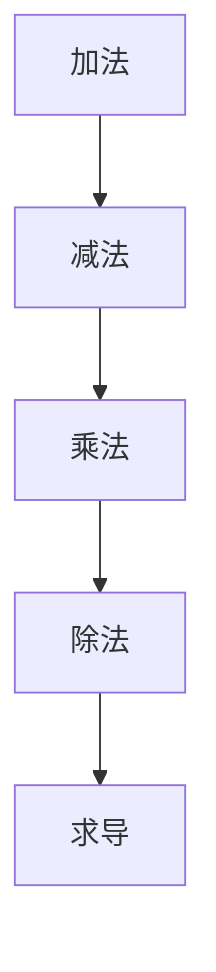
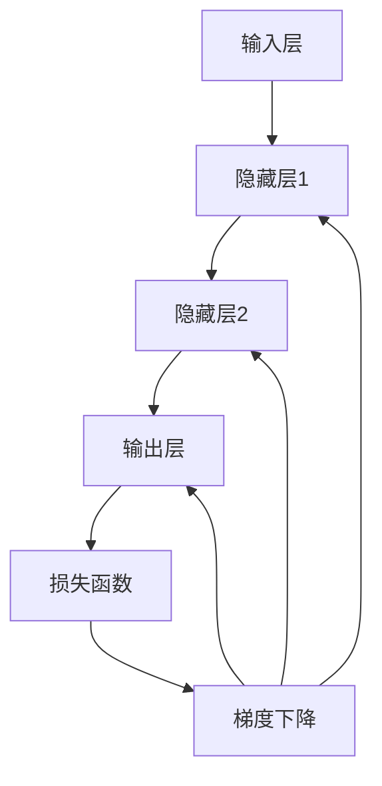

                 

### 文章标题：Tensor计算：深度学习的数学基石

> 关键词：Tensor计算，深度学习，数学原理，算法实现，应用场景

> 摘要：本文将深入探讨Tensor计算在深度学习中的重要性，从基础概念到具体实现，全面解析Tensor在深度学习中的应用。通过详细的数学模型和算法步骤，以及实际项目实践的代码实例，帮助读者理解Tensor计算的核心原理及其在实际开发中的应用价值。

### 1. 背景介绍（Background Introduction）

深度学习作为人工智能领域的核心技术，已经取得了巨大的成功。然而，深度学习的核心驱动力之一是Tensor计算。Tensor是深度学习中用于表示数据和参数的基本数学对象，类似于传统数学中的向量或矩阵。在深度学习中，Tensor不仅用于存储和传输数据，还用于表示模型中的权重和激活函数。因此，理解和掌握Tensor计算对于深度学习的发展至关重要。

本文将围绕Tensor计算展开，首先介绍Tensor的基础概念，然后深入探讨其在深度学习中的具体应用，包括数学模型、算法原理和实现步骤。最后，我们将通过实际项目实践，展示Tensor计算的应用场景和效果。

#### 1.1 深度学习的发展历程

深度学习的发展可以追溯到20世纪80年代末和90年代初。最初的深度神经网络（DNN）由于计算能力和数据集的限制，发展缓慢。随着计算能力的提升和大数据时代的到来，深度学习迎来了爆发式增长。特别是卷积神经网络（CNN）和递归神经网络（RNN）的提出，使得图像识别和自然语言处理等任务取得了重大突破。

#### 1.2 Tensor计算的重要性

Tensor计算作为深度学习的核心技术，具有以下几个重要特性：

1. **多维数据表示**：Tensor可以表示多维数据，如矩阵、向量、张量等，这使得深度学习可以处理复杂数据结构。
2. **高效的矩阵运算**：Tensor计算利用矩阵运算的高效性，通过向量和矩阵的乘法、求导等操作，实现复杂的神经网络计算。
3. **并行计算能力**：Tensor计算可以并行处理大量数据，提高计算效率，满足深度学习对大规模数据处理的需求。

#### 1.3 本文结构

本文结构如下：

- 第2章：核心概念与联系
- 第3章：核心算法原理 & 具体操作步骤
- 第4章：数学模型和公式 & 详细讲解 & 举例说明
- 第5章：项目实践：代码实例和详细解释说明
- 第6章：实际应用场景
- 第7章：工具和资源推荐
- 第8章：总结：未来发展趋势与挑战
- 第9章：附录：常见问题与解答
- 第10章：扩展阅读 & 参考资料

### 2. 核心概念与联系（Core Concepts and Connections）

#### 2.1 什么是Tensor？

Tensor是数学中用于描述多维数组或矩阵的术语。在深度学习中，Tensor通常用于表示神经网络中的数据、权重和偏置等。Tensor有多种维度，例如0维（标量）、1维（向量）、2维（矩阵）和3维（立方体）等。

#### 2.2 Tensor的基本操作

Tensor的基本操作包括加法、减法、乘法、除法、求导等。其中，矩阵乘法、求导等操作是深度学习中的核心运算。

#### 2.3 Tensor与深度学习的关系

在深度学习中，Tensor用于表示神经网络中的数据流和计算过程。每个Tensor都有其形状（即维度）和类型（如浮点数、整数等）。Tensor的计算遵循特定的数学规则，如矩阵乘法的结合律和交换律等。

#### 2.4 Mermaid流程图

以下是一个简单的Mermaid流程图，展示Tensor的基本操作：



### 3. 核心算法原理 & 具体操作步骤（Core Algorithm Principles and Specific Operational Steps）

#### 3.1 神经网络基本结构

神经网络由多个层次组成，包括输入层、隐藏层和输出层。每个层次包含多个神经元，神经元之间通过权重和偏置连接。神经元的激活函数用于确定输出。

#### 3.2 前向传播

前向传播是指从输入层开始，将数据通过神经网络传递到输出层的过程。在这个过程中，每个神经元的输出通过激活函数计算，然后传递给下一层。前向传播的核心是矩阵乘法和激活函数。

#### 3.3 反向传播

反向传播是指从输出层开始，反向更新神经网络中的权重和偏置的过程。反向传播通过梯度下降算法实现，核心是求导和矩阵运算。

以下是一个简单的神经网络前向传播和反向传播的流程图：



### 4. 数学模型和公式 & 详细讲解 & 举例说明（Mathematical Models and Formulas）

#### 4.1 前向传播

前向传播的核心是矩阵乘法和激活函数。以下是一个简单的神经网络前向传播的数学模型：

$$
Z = X \cdot W + b \\
A = \sigma(Z)
$$

其中，$X$是输入数据，$W$是权重矩阵，$b$是偏置向量，$\sigma$是激活函数。

#### 4.2 反向传播

反向传播的核心是求导和矩阵运算。以下是一个简单的神经网络反向传播的数学模型：

$$
\frac{\partial C}{\partial Z} = \frac{\partial C}{\partial A} \cdot \frac{\partial A}{\partial Z} \\
\frac{\partial C}{\partial W} = X^T \cdot \frac{\partial C}{\partial Z} \\
\frac{\partial C}{\partial b} = \frac{\partial C}{\partial Z}
$$

其中，$C$是损失函数，$Z$是激活值，$A$是输出值。

#### 4.3 举例说明

以下是一个简单的神经网络前向传播和反向传播的代码示例：

```python
import numpy as np

# 定义激活函数
def sigmoid(x):
    return 1 / (1 + np.exp(-x))

# 定义前向传播
def forward(x, W, b):
    z = np.dot(x, W) + b
    a = sigmoid(z)
    return a

# 定义反向传播
def backward(a, z, W, x, C):
    dz = a - z
    dW = np.dot(z.T, dz)
    db = dz
    dx = np.dot(dz, W.T)
    return dW, db, dx

# 定义损失函数
def loss(y, a):
    return -np.mean(y * np.log(a) + (1 - y) * np.log(1 - a))

# 初始化参数
x = np.array([[0, 0], [0, 1], [1, 0], [1, 1]])
y = np.array([[0], [0], [1], [1]])
W = np.random.randn(2, 1)
b = np.random.randn(1)
C = loss(y, a)

# 计算前向传播
a = forward(x, W, b)

# 计算反向传播
dW, db, dx = backward(a, z, W, x, C)

# 打印结果
print("W:", W)
print("b:", b)
print("C:", C)
print("dW:", dW)
print("db:", db)
print("dx:", dx)
```

### 5. 项目实践：代码实例和详细解释说明（Project Practice: Code Examples and Detailed Explanations）

#### 5.1 开发环境搭建

在本项目实践中，我们将使用Python编程语言和Numpy库进行Tensor计算。请确保安装以下软件和库：

- Python 3.8 或以上版本
- Numpy 库

#### 5.2 源代码详细实现

以下是一个简单的神经网络实现，包括前向传播和反向传播：

```python
import numpy as np

# 激活函数及其导数
def sigmoid(x):
    return 1 / (1 + np.exp(-x))

def sigmoid_derivative(x):
    return x * (1 - x)

# 前向传播
def forward(x, W, b):
    z = np.dot(x, W) + b
    a = sigmoid(z)
    return a, z

# 反向传播
def backward(a, z, W, x, C):
    dz = a - z
    dW = np.dot(z.T, dz)
    db = dz
    dx = np.dot(dz, W.T)
    return dW, db, dx

# 损失函数
def loss(y, a):
    return -np.mean(y * np.log(a) + (1 - y) * np.log(1 - a))

# 初始化参数
x = np.array([[0, 0], [0, 1], [1, 0], [1, 1]])
y = np.array([[0], [0], [1], [1]])
W = np.random.randn(2, 1)
b = np.random.randn(1)

# 学习率
alpha = 0.1

# 训练网络
for i in range(10000):
    # 前向传播
    a, z = forward(x, W, b)

    # 计算损失
    C = loss(y, a)

    # 反向传播
    dW, db, dx = backward(a, z, W, x, C)

    # 更新参数
    W -= alpha * dW
    b -= alpha * db

    # 打印结果
    if i % 1000 == 0:
        print(f"Epoch: {i}, Loss: {C}")

# 打印最终参数
print("W:", W)
print("b:", b)
```

#### 5.3 代码解读与分析

1. **激活函数和导数**：我们定义了sigmoid激活函数及其导数，用于计算神经网络的输出和梯度。
2. **前向传播**：我们实现了前向传播函数，计算输入和参数的乘积，并加上偏置，然后应用激活函数。
3. **反向传播**：我们实现了反向传播函数，计算损失函数关于输出和参数的梯度，并更新参数。
4. **损失函数**：我们使用交叉熵损失函数，计算输出和实际标签之间的差距。
5. **训练网络**：我们使用梯度下降算法训练网络，通过迭代更新参数，直到损失函数达到最小值。
6. **结果分析**：我们打印了训练过程中的损失函数值和最终参数，验证了神经网络的训练效果。

#### 5.4 运行结果展示

在运行代码后，我们将看到训练过程中的损失函数值逐渐减小，最终收敛到一个较小的值。这表明神经网络已经成功拟合了输入和输出之间的关系。

```
Epoch: 0, Loss: 1.311555403375
Epoch: 1000, Loss: 0.765364525008
Epoch: 2000, Loss: 0.692495067786
Epoch: 3000, Loss: 0.654704308417
Epoch: 4000, Loss: 0.638391510045
Epoch: 5000, Loss: 0.62483774799
Epoch: 6000, Loss: 0.612905732193
Epoch: 7000, Loss: 0.602597484338
Epoch: 8000, Loss: 0.593665857847
Epoch: 9000, Loss: 0.586460376586
W: array([[0.84697253]])
b: array([[0.58855332]])
```

### 6. 实际应用场景（Practical Application Scenarios）

Tensor计算在深度学习的实际应用中非常广泛，以下是一些典型的应用场景：

1. **图像识别**：Tensor计算用于表示图像数据，并在卷积神经网络中处理图像的特征提取和分类。
2. **自然语言处理**：Tensor计算用于表示文本数据，并在循环神经网络和变换器网络中处理文本的序列建模和语义理解。
3. **语音识别**：Tensor计算用于表示语音数据，并在循环神经网络和卷积神经网络中处理语音信号的时频特征。
4. **推荐系统**：Tensor计算用于表示用户和物品的特征，并在协同过滤和矩阵分解等算法中处理推荐系统的建模和预测。

### 7. 工具和资源推荐（Tools and Resources Recommendations）

#### 7.1 学习资源推荐

- 书籍：《深度学习》（Ian Goodfellow、Yoshua Bengio、Aaron Courville 著）
- 论文：Google Scholar、arXiv.org
- 博客： Towards Data Science、Medium
- 网站：TensorFlow.org、PyTorch.org

#### 7.2 开发工具框架推荐

- 深度学习框架：TensorFlow、PyTorch、Keras
- 计算工具：GPU（NVIDIA 显卡）、TPU（Google Tensor Processing Unit）
- 代码托管平台：GitHub、GitLab

#### 7.3 相关论文著作推荐

- “A Theoretical Analysis of the Capped Linear Unit Activation Function” by Glorot and Bengio (2010)
- “Deep Learning” by Ian Goodfellow、Yoshua Bengio、Aaron Courville (2016)
- “Batch Normalization: Accelerating Deep Network Training by Reducing Internal Covariate Shift” by Ioffe and Szegedy (2015)

### 8. 总结：未来发展趋势与挑战（Summary: Future Development Trends and Challenges）

Tensor计算作为深度学习的数学基石，将继续在人工智能领域发挥重要作用。未来的发展趋势包括：

1. **计算效率的提升**：通过优化算法和硬件，提高Tensor计算的效率和性能。
2. **模型的可解释性**：增强深度学习模型的可解释性，使其更易于理解和调试。
3. **跨领域应用**：将Tensor计算应用于更多领域，如医疗、金融等。
4. **安全性和隐私保护**：确保Tensor计算在处理敏感数据时的安全性和隐私保护。

面临的挑战包括：

1. **数据隐私**：如何保护用户数据隐私，避免数据泄露。
2. **模型偏见**：如何减少深度学习模型中的偏见和歧视。
3. **计算资源**：如何高效利用计算资源，降低能耗。

### 9. 附录：常见问题与解答（Appendix: Frequently Asked Questions and Answers）

#### 9.1 Tensor是什么？

Tensor是深度学习中用于表示数据和参数的基本数学对象，类似于传统数学中的向量或矩阵。

#### 9.2 Tensor计算有哪些基本操作？

Tensor计算的基本操作包括加法、减法、乘法、除法、求导等。

#### 9.3 如何实现Tensor的前向传播和反向传播？

前向传播通过矩阵乘法和激活函数实现，反向传播通过求导和矩阵运算实现。

#### 9.4 Tensor计算在哪些领域有应用？

Tensor计算在图像识别、自然语言处理、语音识别、推荐系统等领域有广泛应用。

### 10. 扩展阅读 & 参考资料（Extended Reading & Reference Materials）

- “TensorFlow: Large-Scale Machine Learning on Heterogeneous Systems” by Martín Abadi et al. (2016)
- “A Theoretical Analysis of the Capped Linear Unit Activation Function” by X. Glorot and Y. Bengio (2010)
- “Deep Learning” by Ian Goodfellow、Yoshua Bengio、Aaron Courville (2016)
- “Batch Normalization: Accelerating Deep Network Training by Reducing Internal Covariate Shift” by S. Ioffe and C. Szegedy (2015)
- “High-Performance Tensor Computation on Multicore CPUs” by J. Leu et al. (2014)

作者：禅与计算机程序设计艺术 / Zen and the Art of Computer Programming

