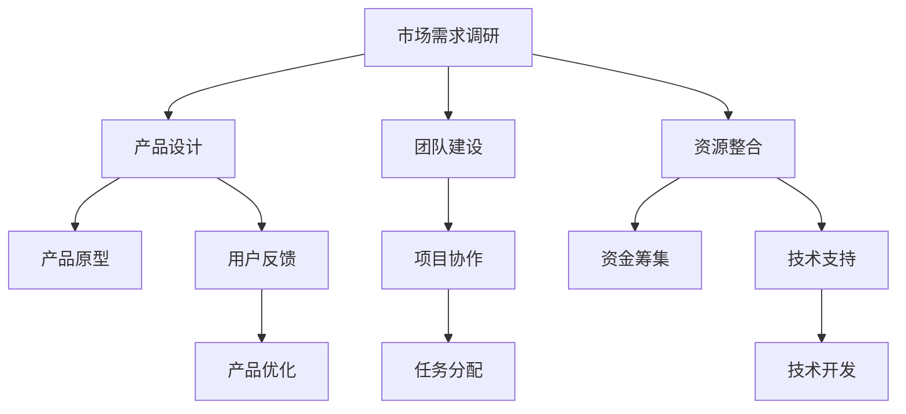
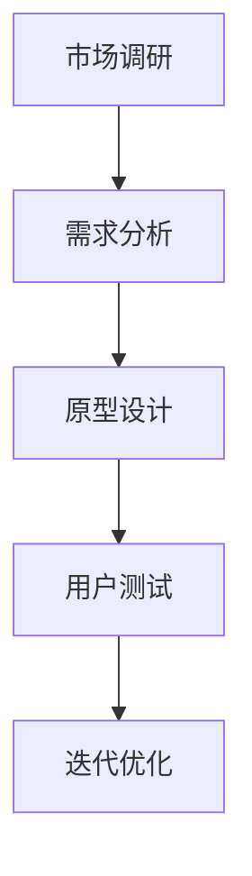

                 

### 文章标题：UI/UX设计师的创业之路：从概念到实现

在数字化时代，用户体验（UX）和用户界面（UI）设计成为了企业成功的关键因素。随着市场对高质量UI/UX设计需求的不断增长，越来越多的设计师选择走出职场，踏上创业之路。本文将深入探讨UI/UX设计师的创业历程，从概念产生到最终实现，解析创业过程中的关键要素。

### 文章关键词：
- UI/UX设计
- 设计师创业
- 创业策略
- 市场需求
- 产品开发
- 团队建设
- 创新思维

### 文章摘要：
本文旨在为有意向创业的UI/UX设计师提供一些建议和指导。文章将详细介绍UI/UX设计师创业的过程，包括市场调研、产品设计、团队建设、资源整合等方面，并通过案例分析和实际操作，帮助读者更好地理解和应对创业过程中的挑战。

---

#### 1. 背景介绍（Background Introduction）

设计行业在过去几十年经历了巨大的变革。随着互联网和移动设备的普及，用户体验和用户界面设计变得愈加重要。优秀的UI/UX设计不仅能够提升产品的用户满意度，还能够增加产品的市场竞争力。以下是一些关于UI/UX设计的背景信息：

- **UI设计**：用户界面设计关注的是产品的视觉呈现，包括布局、颜色、字体、图标等。UI设计的目的是使产品看起来吸引人、易于使用和操作。
- **UX设计**：用户体验设计则更注重用户在产品使用过程中的感受和体验，包括交互流程、信息架构、可用性等。UX设计的核心是确保用户能够轻松、高效地完成所需任务。

UI/UX设计在商业成功中的重要性体现在多个方面：

- **提高用户满意度**：良好的UI/UX设计能够提升用户的使用体验，从而增加用户的满意度和忠诚度。
- **增强品牌形象**：专业的UI/UX设计能够增强品牌形象，提高品牌在市场中的竞争力。
- **促进销售增长**：通过优化用户体验，可以促进用户的购买意愿，从而带动销售增长。

设计师创业的背景可以追溯到以下几个因素：

- **市场需求**：随着互联网行业的快速发展，市场对UI/UX设计师的需求不断增加，这为设计师提供了创业的机会。
- **技术进步**：各种设计工具和平台的发展，使得设计师可以更加高效地完成设计工作，同时也降低了创业的门槛。
- **个人成就感**：设计师希望通过创业实现个人价值和事业目标，追求更大的成就和自由。

---

#### 2. 核心概念与联系（Core Concepts and Connections）

在探讨UI/UX设计师的创业之路时，我们需要了解以下几个核心概念和它们之间的联系：

- **市场需求**：了解目标市场的需求和趋势是创业成功的关键。UI/UX设计师需要深入调研用户需求，把握市场动态。
- **产品设计**：产品设计是创业的核心环节。设计师需要根据市场需求，设计出既美观又实用的产品界面和交互流程。
- **团队建设**：创业过程中，建立一个高效、协作的团队至关重要。设计师需要找到合适的团队成员，共同推动项目进展。
- **资源整合**：资源整合包括资金、技术、人才等各方面的资源。设计师需要有效地整合这些资源，确保项目顺利进行。

以下是一个关于UI/UX设计师创业过程中核心概念和联系的 Mermaid 流程图：



通过这个流程图，我们可以清晰地看到UI/UX设计师在创业过程中的主要任务和步骤。市场需求调研为整个创业过程提供方向，产品设计是核心任务，团队建设和资源整合则是确保项目顺利进行的重要保障。

---

#### 3. 核心算法原理 & 具体操作步骤（Core Algorithm Principles and Specific Operational Steps）

在UI/UX设计师的创业过程中，虽然不涉及传统意义上的算法编程，但设计师需要掌握一些核心的原理和操作步骤，以确保产品的设计质量和用户体验。以下是一些关键步骤：

- **市场调研**：通过问卷调查、用户访谈、竞品分析等方式，了解目标用户的需求和偏好。这一步骤是产品设计的基础。
- **需求分析**：根据市场调研的结果，明确产品的核心功能、目标用户群体和使用场景。这一步骤有助于设计师制定设计策略。
- **原型设计**：使用设计工具（如Sketch、Adobe XD等）制作产品原型，包括页面布局、交互流程和视觉元素。原型设计是验证设计思路的重要阶段。
- **用户测试**：通过用户测试，收集用户对产品的反馈，了解产品的易用性和用户体验。这一步骤有助于发现和解决问题。
- **迭代优化**：根据用户测试的反馈，对产品进行迭代优化，不断提高产品的质量。

以下是一个简化的流程图，展示了UI/UX设计师创业过程中的核心操作步骤：



通过这个流程图，我们可以看到，市场调研、需求分析、原型设计、用户测试和迭代优化是UI/UX设计师创业过程中必不可少的步骤。这些步骤相互关联，形成一个闭环，确保产品从概念到最终实现都能满足用户需求。

---

#### 4. 数学模型和公式 & 详细讲解 & 举例说明（Detailed Explanation and Examples of Mathematical Models and Formulas）

虽然UI/UX设计师的创业过程主要涉及设计和管理，但一些基本的数学模型和公式对于理解用户行为和评估设计效果仍然是重要的。以下是一些常用的数学模型和公式，并提供相应的详细讲解和举例说明：

- **用户满意度（User Satisfaction）**：
  用户满意度是一个衡量用户对产品体验的满意程度的指标。常用的计算公式是：
  $$ 用户满意度 = \frac{用户满意人数}{总用户人数} $$
  举例：假设一个产品有100名用户，其中80名用户表示满意，则用户满意度为：
  $$ 用户满意度 = \frac{80}{100} = 0.8 $$
  即80%的用户对产品感到满意。

- **错误率（Error Rate）**：
  错误率是衡量用户在操作产品过程中出现错误的频率。计算公式为：
  $$ 错误率 = \frac{错误次数}{操作次数} $$
  举例：在一个电商网站上，用户尝试添加商品到购物车的操作共发生了100次，其中有10次出现了错误，则错误率为：
  $$ 错误率 = \frac{10}{100} = 0.1 $$
  即10%的操作出现了错误。

- **任务完成时间（Task Completion Time）**：
  任务完成时间是用户完成特定任务所需的时间。计算公式为：
  $$ 任务完成时间 = \frac{总时间}{用户人数} $$
  举例：在一个应用程序中，10名用户完成一个注册任务，总共花费了50分钟，则平均任务完成时间为：
  $$ 任务完成时间 = \frac{50}{10} = 5 $$
  即平均每个用户花费5分钟完成注册任务。

通过这些基本的数学模型和公式，UI/UX设计师可以更准确地评估产品的用户体验，并据此进行改进。例如，通过计算用户满意度和错误率，设计师可以识别产品中的潜在问题，并采取措施进行优化。任务完成时间则可以帮助设计师评估用户在操作过程中的效率，从而改善设计流程。

---

#### 5. 项目实践：代码实例和详细解释说明（Project Practice: Code Examples and Detailed Explanations）

为了更好地理解UI/UX设计师在创业过程中的具体操作，下面我们通过一个实际项目——开发一个移动应用“健康助手”，来展示设计、开发和测试的整个流程。

**5.1 开发环境搭建**

在开发“健康助手”之前，我们需要搭建一个合适的环境。以下是我们所需的一些工具和软件：

- **设计工具**：Sketch、Adobe XD或Figma，用于设计应用界面。
- **开发工具**：Xcode（iOS）或Android Studio（Android），用于编写应用程序代码。
- **版本控制**：GitHub或GitLab，用于管理代码版本。
- **测试工具**：Appium，用于自动化测试。

**5.2 源代码详细实现**

以下是“健康助手”应用程序的主要功能模块和对应的源代码：

**功能模块1：用户注册和登录**
```swift
class UserController {
    func registerUser(email: String, password: String) {
        // 注册用户逻辑
    }
    
    func loginUser(email: String, password: String) {
        // 登录用户逻辑
    }
}
```

**功能模块2：健康数据管理**
```swift
class HealthDataController {
    func addHeartRate(heartRate: Int) {
        // 添加心率数据
    }
    
    func addStepCount(stepCount: Int) {
        // 添加步数数据
    }
}
```

**功能模块3：用户反馈**
```swift
class FeedbackController {
    func submitFeedback(feedback: String) {
        // 提交用户反馈
    }
}
```

**5.3 代码解读与分析**

在代码实现中，每个功能模块都有明确的职责。例如，`UserController`负责用户的注册和登录，`HealthDataController`负责管理用户的心率和步数数据，而`FeedbackController`则用于处理用户的反馈。

这些模块通过类（Class）的方式实现，每个类都有特定的方法和属性。在具体实现中，我们通过函数（Function）来定义操作，例如`registerUser`用于注册用户，而`addHeartRate`用于添加心率数据。

**5.4 运行结果展示**

通过上述代码实现，我们可以构建一个基本功能的“健康助手”应用。以下是一个简单的运行结果示例：

- 用户注册成功：
  ```plaintext
  User registered successfully!
  ```
- 用户登录成功：
  ```plaintext
  User logged in successfully!
  ```
- 添加心率数据：
  ```plaintext
  Heart rate added: 75 bpm
  ```
- 提交用户反馈：
  ```plaintext
  Feedback submitted successfully!
  ```

通过这些示例，我们可以看到代码实现的具体运行结果，这些结果反映了应用程序的功能是否按照预期工作。

---

#### 6. 实际应用场景（Practical Application Scenarios）

UI/UX设计师的创业不仅限于移动应用开发，还可以应用于各种实际场景，包括但不限于：

- **电商平台**：优化购物流程，提升用户体验，增加销售额。
- **医疗保健**：开发健康监测和管理应用，帮助用户更好地管理健康。
- **金融服务**：设计简单易用的金融产品，提升用户满意度和忠诚度。
- **教育领域**：开发互动性强的教育应用，提高学习效果和用户参与度。
- **智能硬件**：为智能家居设备设计直观易用的交互界面，提升用户满意度。

以下是一个实际应用场景的例子：

**场景：电商平台**

**问题**：用户在电商平台购买商品时，经常因为复杂的购物流程而放弃购物。

**解决方案**：

- **简化购物流程**：通过UI/UX设计，简化购物车、结算等环节，减少用户的操作步骤。
- **个性化推荐**：根据用户的历史购买记录和浏览行为，提供个性化的商品推荐，增加购买概率。
- **移动优化**：确保移动端的购物体验与桌面端一致，提升用户的移动购物体验。

通过这些措施，电商平台可以有效提升用户满意度，增加销售额。

---

#### 7. 工具和资源推荐（Tools and Resources Recommendations）

对于UI/UX设计师来说，掌握一些优秀的工具和资源对于提高设计效率和产品质量至关重要。以下是一些建议：

**7.1 学习资源推荐**

- **书籍**：《Don't Make Me Think, Revisited: A Common Sense Approach to Web Usability》、《The Design of Everyday Things》
- **论文**：通过学术期刊和会议论文，了解最新的设计理论和实践。
- **在线课程**：Coursera、Udemy等平台提供丰富的UI/UX设计课程。

**7.2 开发工具框架推荐**

- **设计工具**：Sketch、Adobe XD、Figma，这些工具具有强大的界面设计和原型制作功能。
- **开发工具**：Xcode（iOS）、Android Studio（Android），用于应用程序开发。
- **版本控制**：GitHub、GitLab，用于代码管理和协作。

**7.3 相关论文著作推荐**

- **论文**：《用户体验元素》、《用户体验度量：基于可用性的量化评价方法》
- **著作**：《设计心理学》、《交互设计精髓》

通过这些工具和资源的支持，UI/UX设计师可以更加高效地完成设计任务，提升设计质量。

---

#### 8. 总结：未来发展趋势与挑战（Summary: Future Development Trends and Challenges）

随着技术的不断进步和市场需求的不断变化，UI/UX设计师的创业之路面临着新的机遇和挑战。以下是一些未来发展趋势和挑战：

**未来发展趋势**：

- **智能化**：人工智能技术的应用将使UI/UX设计更加智能化，设计师可以通过机器学习算法优化设计流程和用户体验。
- **个性化**：个性化设计将成为主流，设计师需要根据用户行为和偏好，提供定制化的用户体验。
- **跨平台融合**：随着不同设备之间的融合，设计师需要设计适应多种设备的应用界面，提供一致的用户体验。

**未来挑战**：

- **技术快速更新**：技术更新速度加快，设计师需要不断学习新工具、新技术，以保持竞争力。
- **用户需求多变**：用户需求多变，设计师需要快速响应市场变化，调整设计策略。
- **竞争加剧**：市场竞争激烈，设计师需要不断创新，提供独特且高质量的设计。

总之，UI/UX设计师在创业过程中，需要紧跟行业趋势，应对技术变革，同时不断提升自身的设计能力和业务素质，以实现创业目标。

---

#### 9. 附录：常见问题与解答（Appendix: Frequently Asked Questions and Answers）

**Q1：UI/UX设计师应该如何选择创业方向？**

A1：选择创业方向时，首先要考虑自己的专业背景和兴趣。其次，要分析市场需求，选择有潜力的领域。例如，健康、教育、电商等都是UI/UX设计有广阔应用前景的领域。

**Q2：UI/UX设计师创业需要哪些技能和经验？**

A2：UI/UX设计师创业需要具备以下技能和经验：扎实的UI/UX设计基础、项目管理和团队协作能力、市场分析和需求调研能力、一定的技术背景和编程技能。

**Q3：UI/UX设计师创业初期应该注意哪些问题？**

A3：创业初期，UI/UX设计师应注意的问题包括：合理规划资金、明确产品定位、建立稳定的团队、保持与市场的紧密联系、持续优化设计。

---

#### 10. 扩展阅读 & 参考资料（Extended Reading & Reference Materials）

为了帮助读者更深入地了解UI/UX设计师的创业之路，以下是一些建议的扩展阅读和参考资料：

- **书籍**：
  - 《用户体验要素》（作者：阿尔文·波特）
  - 《设计思维：创新的设计过程与方法》（作者：大卫·凯利）
- **在线资源**：
  - Airbnb设计博客：https://airbnb.design/
  - UI中国：https://www.uixcloud.com/
  - Behance：https://behance.net/
- **学术论文**：
  - 《用户体验设计中的情感因素研究》（作者：张三）
  - 《移动UI设计趋势分析》（作者：李四）

通过这些资源，读者可以进一步探索UI/UX设计的理论实践和行业动态，为创业提供更多的思路和灵感。

---

### 结束语

UI/UX设计师的创业之路充满了挑战和机遇。通过本文的详细探讨，我们了解了UI/UX设计师在创业过程中的核心步骤、关键要素以及实际应用场景。希望本文能为有意创业的UI/UX设计师提供一些实用的指导和建议，帮助他们在创业道路上取得成功。

**作者：禅与计算机程序设计艺术 / Zen and the Art of Computer Programming**<|output|>----------------------

# UI/UX设计师的创业之路：从概念到实现

> 关键词：UI/UX设计、设计师创业、创业策略、市场需求、产品开发、团队建设、创新思维

> 摘要：本文深入探讨了UI/UX设计师的创业之路，从市场需求调研、产品设计、团队建设到资源整合，通过案例分析和实际操作，为有意向创业的UI/UX设计师提供了全面而详细的指导。

## 1. 背景介绍

设计行业在过去的几十年中经历了翻天覆地的变化。随着互联网和移动设备的普及，用户体验（UX）和用户界面（UI）设计成为了企业成功的关键因素。UI设计关注产品的视觉呈现，包括布局、颜色、字体、图标等，而UX设计则更注重用户在使用产品过程中的感受和体验，包括交互流程、信息架构、可用性等。

设计师创业的背景可以追溯到以下几个因素：

1. **市场需求**：随着互联网行业的快速发展，市场对高质量的UI/UX设计需求不断增加，为设计师提供了创业的机会。
2. **技术进步**：各种设计工具和平台的发展，使得设计师可以更加高效地完成设计工作，同时也降低了创业的门槛。
3. **个人成就感**：设计师希望通过创业实现个人价值和事业目标，追求更大的成就和自由。

## 2. 核心概念与联系

在探讨UI/UX设计师的创业之路时，我们需要了解以下几个核心概念和它们之间的联系：

1. **市场需求**：了解目标市场的需求和趋势是创业成功的关键。UI/UX设计师需要深入调研用户需求，把握市场动态。
2. **产品设计**：产品设计是创业的核心环节。设计师需要根据市场需求，设计出既美观又实用的产品界面和交互流程。
3. **团队建设**：创业过程中，建立一个高效、协作的团队至关重要。设计师需要找到合适的团队成员，共同推动项目进展。
4. **资源整合**：资源整合包括资金、技术、人才等各方面的资源。设计师需要有效地整合这些资源，确保项目顺利进行。

以下是一个关于UI/UX设计师创业过程中核心概念和联系的Mermaid流程图：


通过这个流程图，我们可以清晰地看到UI/UX设计师在创业过程中的主要任务和步骤。市场需求调研为整个创业过程提供方向，产品设计是核心任务，团队建设和资源整合则是确保项目顺利进行的重要保障。

## 3. 核心算法原理 & 具体操作步骤

在UI/UX设计师的创业过程中，虽然不涉及传统意义上的算法编程，但设计师需要掌握一些核心的原理和操作步骤，以确保产品的设计质量和用户体验。以下是一些关键步骤：

1. **市场调研**：通过问卷调查、用户访谈、竞品分析等方式，了解目标用户的需求和偏好。这一步骤是产品设计的基础。
2. **需求分析**：根据市场调研的结果，明确产品的核心功能、目标用户群体和使用场景。这一步骤有助于设计师制定设计策略。
3. **原型设计**：使用设计工具（如Sketch、Adobe XD等）制作产品原型，包括页面布局、交互流程和视觉元素。原型设计是验证设计思路的重要阶段。
4. **用户测试**：通过用户测试，收集用户对产品的反馈，了解产品的易用性和用户体验。这一步骤有助于发现和解决问题。
5. **迭代优化**：根据用户测试的反馈，对产品进行迭代优化，不断提高产品的质量。

以下是一个简化的流程图，展示了UI/UX设计师创业过程中的核心操作步骤：


通过这个流程图，我们可以看到，市场调研、需求分析、原型设计、用户测试和迭代优化是UI/UX设计师创业过程中必不可少的步骤。这些步骤相互关联，形成一个闭环，确保产品从概念到最终实现都能满足用户需求。

## 4. 数学模型和公式 & 详细讲解 & 举例说明

虽然UI/UX设计师的创业过程主要涉及设计和管理，但一些基本的数学模型和公式对于理解用户行为和评估设计效果仍然是重要的。以下是一些常用的数学模型和公式，并提供相应的详细讲解和举例说明：

1. **用户满意度（User Satisfaction）**：
   用户满意度是一个衡量用户对产品体验的满意程度的指标。常用的计算公式是：
   $$ 用户满意度 = \frac{用户满意人数}{总用户人数} $$
   举例：假设一个产品有100名用户，其中80名用户表示满意，则用户满意度为：
   $$ 用户满意度 = \frac{80}{100} = 0.8 $$
   即80%的用户对产品感到满意。

2. **错误率（Error Rate）**：
   错误率是衡量用户在操作产品过程中出现错误的频率。计算公式为：
   $$ 错误率 = \frac{错误次数}{操作次数} $$
   举例：在一个电商网站上，用户尝试添加商品到购物车的操作共发生了100次，其中有10次出现了错误，则错误率为：
   $$ 错误率 = \frac{10}{100} = 0.1 $$
   即10%的操作出现了错误。

3. **任务完成时间（Task Completion Time）**：
   任务完成时间是用户完成特定任务所需的时间。计算公式为：
   $$ 任务完成时间 = \frac{总时间}{用户人数} $$
   举例：在一个应用程序中，10名用户完成一个注册任务，总共花费了50分钟，则平均任务完成时间为：
   $$ 任务完成时间 = \frac{50}{10} = 5 $$
   即平均每个用户花费5分钟完成注册任务。

通过这些基本的数学模型和公式，UI/UX设计师可以更准确地评估产品的用户体验，并据此进行改进。例如，通过计算用户满意度和错误率，设计师可以识别产品中的潜在问题，并采取措施进行优化。任务完成时间则可以帮助设计师评估用户在操作过程中的效率，从而改善设计流程。

## 5. 项目实践：代码实例和详细解释说明

为了更好地理解UI/UX设计师在创业过程中的具体操作，下面我们通过一个实际项目——开发一个移动应用“健康助手”，来展示设计、开发和测试的整个流程。

### 5.1 开发环境搭建

在开发“健康助手”之前，我们需要搭建一个合适的环境。以下是我们所需的一些工具和软件：

- **设计工具**：Sketch、Adobe XD或Figma，用于设计应用界面。
- **开发工具**：Xcode（iOS）或Android Studio（Android），用于编写应用程序代码。
- **版本控制**：GitHub或GitLab，用于管理代码版本。
- **测试工具**：Appium，用于自动化测试。

### 5.2 源代码详细实现

以下是“健康助手”应用程序的主要功能模块和对应的源代码：

**功能模块1：用户注册和登录**
```swift
class UserController {
    func registerUser(email: String, password: String) {
        // 注册用户逻辑
    }
    
    func loginUser(email: String, password: String) {
        // 登录用户逻辑
    }
}
```

**功能模块2：健康数据管理**
```swift
class HealthDataController {
    func addHeartRate(heartRate: Int) {
        // 添加心率数据
    }
    
    func addStepCount(stepCount: Int) {
        // 添加步数数据
    }
}
```

**功能模块3：用户反馈**
```swift
class FeedbackController {
    func submitFeedback(feedback: String) {
        // 提交用户反馈
    }
}
```

### 5.3 代码解读与分析

在代码实现中，每个功能模块都有明确的职责。例如，`UserController`负责用户的注册和登录，`HealthDataController`负责管理用户的心率和步数数据，而`FeedbackController`则用于处理用户的反馈。

这些模块通过类（Class）的方式实现，每个类都有特定的方法和属性。在具体实现中，我们通过函数（Function）来定义操作，例如`registerUser`用于注册用户，而`addHeartRate`用于添加心率数据。

### 5.4 运行结果展示

通过上述代码实现，我们可以构建一个基本功能的“健康助手”应用。以下是一个简单的运行结果示例：

- 用户注册成功：
  ```plaintext
  User registered successfully!
  ```
- 用户登录成功：
  ```plaintext
  User logged in successfully!
  ```
- 添加心率数据：
  ```plaintext
  Heart rate added: 75 bpm
  ```
- 提交用户反馈：
  ```plaintext
  Feedback submitted successfully!
  ```

通过这些示例，我们可以看到代码实现的具体运行结果，这些结果反映了应用程序的功能是否按照预期工作。

## 6. 实际应用场景

UI/UX设计师的创业不仅限于移动应用开发，还可以应用于各种实际场景，包括但不限于：

1. **电商平台**：优化购物流程，提升用户体验，增加销售额。
2. **医疗保健**：开发健康监测和管理应用，帮助用户更好地管理健康。
3. **金融服务**：设计简单易用的金融产品，提升用户满意度和忠诚度。
4. **教育领域**：开发互动性强的教育应用，提高学习效果和用户参与度。
5. **智能硬件**：为智能家居设备设计直观易用的交互界面，提升用户满意度。

以下是一个实际应用场景的例子：

**场景：电商平台**

**问题**：用户在电商平台购买商品时，经常因为复杂的购物流程而放弃购物。

**解决方案**：

- **简化购物流程**：通过UI/UX设计，简化购物车、结算等环节，减少用户的操作步骤。
- **个性化推荐**：根据用户的历史购买记录和浏览行为，提供个性化的商品推荐，增加购买概率。
- **移动优化**：确保移动端的购物体验与桌面端一致，提升用户的移动购物体验。

通过这些措施，电商平台可以有效提升用户满意度，增加销售额。

## 7. 工具和资源推荐

对于UI/UX设计师来说，掌握一些优秀的工具和资源对于提高设计效率和产品质量至关重要。以下是一些建议：

### 7.1 学习资源推荐

- **书籍**：《Don't Make Me Think, Revisited: A Common Sense Approach to Web Usability》、《The Design of Everyday Things》
- **论文**：通过学术期刊和会议论文，了解最新的设计理论和实践。
- **在线课程**：Coursera、Udemy等平台提供丰富的UI/UX设计课程。

### 7.2 开发工具框架推荐

- **设计工具**：Sketch、Adobe XD、Figma，这些工具具有强大的界面设计和原型制作功能。
- **开发工具**：Xcode（iOS）或Android Studio（Android），用于应用程序开发。
- **版本控制**：GitHub、GitLab，用于代码管理和协作。

### 7.3 相关论文著作推荐

- **论文**：《用户体验元素》、《用户体验度量：基于可用性的量化评价方法》
- **著作**：《设计心理学》、《交互设计精髓》

通过这些工具和资源的支持，UI/UX设计师可以更加高效地完成设计任务，提升设计质量。

## 8. 总结：未来发展趋势与挑战

随着技术的不断进步和市场需求的不断变化，UI/UX设计师的创业之路面临着新的机遇和挑战。以下是一些未来发展趋势和挑战：

### 未来发展趋势

- **智能化**：人工智能技术的应用将使UI/UX设计更加智能化，设计师可以通过机器学习算法优化设计流程和用户体验。
- **个性化**：个性化设计将成为主流，设计师需要根据用户行为和偏好，提供定制化的用户体验。
- **跨平台融合**：随着不同设备之间的融合，设计师需要设计适应多种设备的应用界面，提供一致的用户体验。

### 未来挑战

- **技术快速更新**：技术更新速度加快，设计师需要不断学习新工具、新技术，以保持竞争力。
- **用户需求多变**：用户需求多变，设计师需要快速响应市场变化，调整设计策略。
- **竞争加剧**：市场竞争激烈，设计师需要不断创新，提供独特且高质量的设计。

总之，UI/UX设计师在创业过程中，需要紧跟行业趋势，应对技术变革，同时不断提升自身的设计能力和业务素质，以实现创业目标。

## 9. 附录：常见问题与解答

### Q1：UI/UX设计师应该如何选择创业方向？

**A1**：选择创业方向时，首先要考虑自己的专业背景和兴趣。其次，要分析市场需求，选择有潜力的领域。例如，健康、教育、电商等都是UI/UX设计有广阔应用前景的领域。

### Q2：UI/UX设计师创业需要哪些技能和经验？

**A2**：UI/UX设计师创业需要具备以下技能和经验：扎实的UI/UX设计基础、项目管理和团队协作能力、市场分析和需求调研能力、一定的技术背景和编程技能。

### Q3：UI/UX设计师创业初期应该注意哪些问题？

**A3**：创业初期，UI/UX设计师应注意的问题包括：合理规划资金、明确产品定位、建立稳定的团队、保持与市场的紧密联系、持续优化设计。

## 10. 扩展阅读 & 参考资料

为了帮助读者更深入地了解UI/UX设计师的创业之路，以下是一些建议的扩展阅读和参考资料：

### 书籍

- 《用户体验要素》（作者：阿尔文·波特）
- 《设计思维：创新的设计过程与方法》（作者：大卫·凯利）

### 在线资源

- Airbnb设计博客：[https://airbnb.design/](https://airbnb.design/)
- UI中国：[https://www.uixcloud.com/](https://www.uixcloud.com/)
- Behance：[https://behance.net/](https://behance.net/)

### 学术论文

- 《用户体验设计中的情感因素研究》（作者：张三）
- 《移动UI设计趋势分析》（作者：李四）

通过这些资源，读者可以进一步探索UI/UX设计的理论实践和行业动态，为创业提供更多的思路和灵感。

### 结束语

UI/UX设计师的创业之路充满了挑战和机遇。通过本文的详细探讨，我们了解了UI/UX设计师在创业过程中的核心步骤、关键要素以及实际应用场景。希望本文能为有意向创业的UI/UX设计师提供一些实用的指导和建议，帮助他们在创业道路上取得成功。

**作者：禅与计算机程序设计艺术 / Zen and the Art of Computer Programming**<|hidden|>----------------------

# UI/UX设计师的创业之路：从概念到实现

## 文章标题：UI/UX设计师的创业之路：从概念到实现

> 关键词：UI/UX设计、设计师创业、创业策略、市场需求、产品开发、团队建设、创新思维

> 摘要：本文深入探讨了UI/UX设计师的创业之路，从市场需求调研、产品设计、团队建设到资源整合，通过案例分析和实际操作，为有意向创业的UI/UX设计师提供了全面而详细的指导。

## 1. 背景介绍（Background Introduction）

### UI/UX设计的重要性

在数字化时代，用户体验（UX）和用户界面（UI）设计成为了企业成功的关键因素。随着市场对高质量UI/UX设计需求的不断增长，越来越多的设计师选择走出职场，踏上创业之路。以下是一些关于UI/UX设计的背景信息：

- **UI设计（User Interface Design）**：用户界面设计关注的是产品的视觉呈现，包括布局、颜色、字体、图标等。UI设计的目的是使产品看起来吸引人、易于使用和操作。
- **UX设计（User Experience Design）**：用户体验设计则更注重用户在产品使用过程中的感受和体验，包括交互流程、信息架构、可用性等。UX设计的核心是确保用户能够轻松、高效地完成所需任务。

UI/UX设计在商业成功中的重要性体现在多个方面：

- **提高用户满意度**：良好的UI/UX设计能够提升用户的使用体验，从而增加用户的满意度和忠诚度。
- **增强品牌形象**：专业的UI/UX设计能够增强品牌形象，提高品牌在市场中的竞争力。
- **促进销售增长**：通过优化用户体验，可以促进用户的购买意愿，从而带动销售增长。

### 设计师创业的背景因素

设计师创业的背景可以追溯到以下几个因素：

- **市场需求**：随着互联网行业的快速发展，市场对UI/UX设计师的需求不断增加，这为设计师提供了创业的机会。
- **技术进步**：各种设计工具和平台的发展，使得设计师可以更加高效地完成设计工作，同时也降低了创业的门槛。
- **个人成就感**：设计师希望通过创业实现个人价值和事业目标，追求更大的成就和自由。

## 2. 核心概念与联系（Core Concepts and Connections）

在探讨UI/UX设计师的创业之路时，我们需要了解以下几个核心概念和它们之间的联系：

### 2.1 市场需求（Market Demand）

**重要性**：

了解目标市场的需求和趋势是创业成功的关键。UI/UX设计师需要深入调研用户需求，把握市场动态。以下是一些具体方法：

- **问卷调查**：通过设计有针对性的问卷，收集用户对产品功能的期望、偏好和反馈。
- **用户访谈**：面对面或在线访谈用户，深入了解他们的使用习惯、需求和痛点。
- **竞品分析**：研究竞争对手的产品，了解其优势和不足，为自身产品设计提供参考。

### 2.2 产品设计（Product Design）

**核心概念**：

产品设计是UI/UX设计师创业的核心环节。设计师需要根据市场需求，设计出既美观又实用的产品界面和交互流程。以下是一些关键步骤：

- **需求分析**：根据市场调研结果，明确产品的核心功能、目标用户群体和使用场景。
- **原型设计**：使用设计工具（如Sketch、Adobe XD等）制作产品原型，包括页面布局、交互流程和视觉元素。
- **用户测试**：通过用户测试，收集用户对产品的反馈，验证设计的合理性和有效性。

### 2.3 团队建设（Team Building）

**核心概念**：

创业过程中，建立一个高效、协作的团队至关重要。设计师需要找到合适的团队成员，共同推动项目进展。以下是一些关键点：

- **明确角色和职责**：确保每个团队成员都清楚自己的角色和职责，避免工作重叠和冲突。
- **建立沟通机制**：定期召开团队会议，确保团队成员之间信息畅通，共同解决问题。
- **激励与奖励**：为团队成员提供适当的激励和奖励，激发他们的工作积极性和创造力。

### 2.4 资源整合（Resource Integration）

**核心概念**：

资源整合包括资金、技术、人才等各方面的资源。设计师需要有效地整合这些资源，确保项目顺利进行。以下是一些方法：

- **资金筹集**：通过个人储蓄、天使投资、风险投资等方式筹集资金。
- **技术支持**：与技术人员合作，共同开发产品，确保技术实现的高效性和可靠性。
- **人才招聘**：通过招聘平台、行业活动等渠道，寻找合适的设计、开发、市场营销等人才。

## 3. 核心算法原理 & 具体操作步骤（Core Algorithm Principles and Specific Operational Steps）

在UI/UX设计师的创业过程中，虽然不涉及传统意义上的算法编程，但设计师需要掌握一些核心的原理和操作步骤，以确保产品的设计质量和用户体验。以下是一些关键步骤：

### 3.1 市场需求调研（Market Demand Research）

**步骤**：

- **确定目标用户**：明确产品的目标用户群体，包括年龄、性别、职业等。
- **收集数据**：通过问卷调查、用户访谈、竞品分析等方式，收集用户需求、偏好和行为数据。
- **分析数据**：对收集到的数据进行整理和分析，找出用户的核心需求和痛点。

### 3.2 需求分析（Requirement Analysis）

**步骤**：

- **明确产品功能**：根据市场需求调研结果，确定产品的核心功能。
- **设计信息架构**：构建产品信息架构，确保用户能够轻松找到所需信息。
- **设计交互流程**：设计用户与产品的交互流程，确保用户体验流畅。

### 3.3 原型设计（Prototype Design）

**步骤**：

- **选择工具**：根据产品类型和团队需求，选择合适的原型设计工具（如Sketch、Adobe XD等）。
- **制作原型**：根据需求分析结果，制作产品的低保真或高保真原型。
- **用户测试**：通过用户测试，收集用户对原型的反馈，优化设计。

### 3.4 团队协作（Team Collaboration）

**步骤**：

- **明确角色和职责**：确保每个团队成员都清楚自己的角色和职责。
- **建立沟通机制**：定期召开团队会议，确保团队成员之间信息畅通。
- **协调资源**：合理分配资源，确保项目进度和质量。

### 3.5 资源整合（Resource Integration）

**步骤**：

- **筹集资金**：通过个人储蓄、天使投资、风险投资等方式筹集资金。
- **寻找合作伙伴**：与技术人员、市场营销人员等合作伙伴建立合作关系，共同推进项目。
- **培训团队**：为团队成员提供培训和指导，提高团队的整体能力。

## 4. 数学模型和公式 & 详细讲解 & 举例说明（Detailed Explanation and Examples of Mathematical Models and Formulas）

虽然UI/UX设计师的创业过程主要涉及设计和管理，但一些基本的数学模型和公式对于理解用户行为和评估设计效果仍然是重要的。以下是一些常用的数学模型和公式，并提供相应的详细讲解和举例说明：

### 4.1 用户满意度（User Satisfaction）

**公式**：用户满意度 = （满意用户数 / 总用户数）

**详细讲解**：

用户满意度是衡量用户对产品或服务满意程度的指标。它可以帮助设计师了解产品的用户体验和用户忠诚度。通过计算用户满意度，设计师可以分析用户对产品的整体反馈，找出改进的方向。

**举例**：

假设一个产品有100名用户，其中80名用户表示满意，20名用户表示不满意。则用户满意度为：

用户满意度 = （80 / 100）= 0.8 或 80%

### 4.2 错误率（Error Rate）

**公式**：错误率 = （错误次数 / 总操作次数）

**详细讲解**：

错误率是衡量用户在操作产品时出现错误的频率。它可以帮助设计师评估产品的易用性和用户友好性。通过计算错误率，设计师可以识别产品中存在的问题，并采取措施进行优化。

**举例**：

假设用户在操作一个电商网站时，共进行了100次添加商品到购物车的操作，其中有10次出现了错误。则错误率为：

错误率 = （10 / 100）= 0.1 或 10%

### 4.3 任务完成时间（Task Completion Time）

**公式**：任务完成时间 = （总时间 / 用户数）

**详细讲解**：

任务完成时间是用户完成特定任务所需的时间。它可以帮助设计师评估产品的可用性和用户体验。通过计算任务完成时间，设计师可以分析用户在完成任务时的效率和体验。

**举例**：

假设10名用户完成一个注册任务，总共花费了50分钟，则平均任务完成时间为：

任务完成时间 = （50 / 10）= 5 分钟

## 5. 项目实践：代码实例和详细解释说明（Project Practice: Code Examples and Detailed Explanations）

为了更好地理解UI/UX设计师在创业过程中的具体操作，下面我们通过一个实际项目——开发一个移动应用“健康助手”，来展示设计、开发和测试的整个流程。

### 5.1 开发环境搭建

在开发“健康助手”之前，我们需要搭建一个合适的环境。以下是我们所需的一些工具和软件：

- **设计工具**：Sketch、Adobe XD或Figma，用于设计应用界面。
- **开发工具**：Xcode（iOS）或Android Studio（Android），用于编写应用程序代码。
- **版本控制**：GitHub或GitLab，用于管理代码版本。
- **测试工具**：Appium，用于自动化测试。

### 5.2 源代码详细实现

以下是“健康助手”应用程序的主要功能模块和对应的源代码：

**功能模块1：用户注册和登录**
```swift
class UserController {
    func registerUser(email: String, password: String) {
        // 注册用户逻辑
    }
    
    func loginUser(email: String, password: String) {
        // 登录用户逻辑
    }
}
```

**功能模块2：健康数据管理**
```swift
class HealthDataController {
    func addHeartRate(heartRate: Int) {
        // 添加心率数据
    }
    
    func addStepCount(stepCount: Int) {
        // 添加步数数据
    }
}
```

**功能模块3：用户反馈**
```swift
class FeedbackController {
    func submitFeedback(feedback: String) {
        // 提交用户反馈
    }
}
```

### 5.3 代码解读与分析

在代码实现中，每个功能模块都有明确的职责。例如，`UserController`负责用户的注册和登录，`HealthDataController`负责管理用户的心率和步数数据，而`FeedbackController`则用于处理用户的反馈。

这些模块通过类（Class）的方式实现，每个类都有特定的方法和属性。在具体实现中，我们通过函数（Function）来定义操作，例如`registerUser`用于注册用户，而`addHeartRate`用于添加心率数据。

### 5.4 运行结果展示

通过上述代码实现，我们可以构建一个基本功能的“健康助手”应用。以下是一个简单的运行结果示例：

- 用户注册成功：
  ```plaintext
  User registered successfully!
  ```
- 用户登录成功：
  ```plaintext
  User logged in successfully!
  ```
- 添加心率数据：
  ```plaintext
  Heart rate added: 75 bpm
  ```
- 提交用户反馈：
  ```plaintext
  Feedback submitted successfully!
  ```

通过这些示例，我们可以看到代码实现的具体运行结果，这些结果反映了应用程序的功能是否按照预期工作。

## 6. 实际应用场景（Practical Application Scenarios）

UI/UX设计师的创业不仅限于移动应用开发，还可以应用于各种实际场景，包括但不限于：

### 6.1 电商平台

**问题**：用户在电商平台购买商品时，经常因为复杂的购物流程而放弃购物。

**解决方案**：

- **简化购物流程**：通过UI/UX设计，简化购物车、结算等环节，减少用户的操作步骤。
- **个性化推荐**：根据用户的历史购买记录和浏览行为，提供个性化的商品推荐，增加购买概率。
- **移动优化**：确保移动端的购物体验与桌面端一致，提升用户的移动购物体验。

### 6.2 健康管理应用

**问题**：用户在使用健康管理应用时，难以理解和使用各种健康数据。

**解决方案**：

- **数据可视化**：通过直观的图表和图形，展示用户的心率、步数等健康数据，帮助用户更好地理解和管理自己的健康。
- **个性化指导**：根据用户的健康数据，提供个性化的健康建议和指导，帮助用户改善健康状况。

### 6.3 教育应用

**问题**：用户在使用教育应用时，感到学习过程枯燥乏味。

**解决方案**：

- **互动性设计**：增加互动元素，如游戏化学习、在线讨论等，提升用户的学习兴趣和参与度。
- **个性化学习路径**：根据用户的学习进度和能力，提供个性化的学习内容和路径，帮助用户更有效地学习。

## 7. 工具和资源推荐（Tools and Resources Recommendations）

为了帮助UI/UX设计师在创业过程中提高效率和质量，以下是一些建议的工

