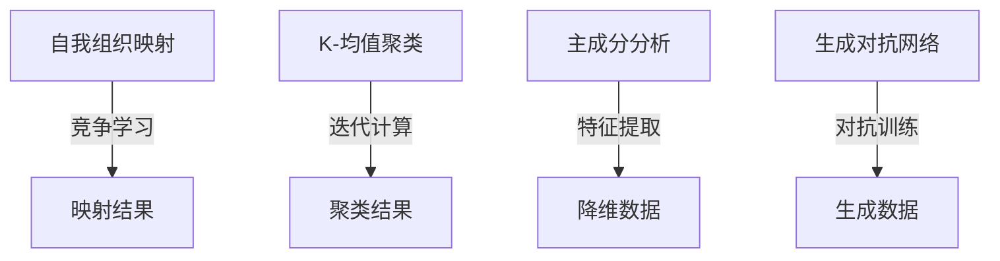

                 

### 文章标题

Unsupervised Learning原理与代码实例讲解

#### 关键词

Unsupervised Learning, 无监督学习, 自我组织映射, K-均值聚类, 主成分分析, 降维, 生成对抗网络, GAN, 自编码器, Autoencoder, 数据预处理, Python代码示例

#### 摘要

本文旨在深入探讨无监督学习的原理及其在实际应用中的代码实现。我们将从核心概念出发，逐步介绍自我组织映射、K-均值聚类、主成分分析等算法，并详细讲解它们的工作机制和数学模型。随后，我们将通过具体的Python代码实例，展示如何使用这些算法来处理现实世界中的数据。此外，文章还将探讨无监督学习在降维和数据增强等实际应用场景中的价值，并提供一系列推荐工具和资源，帮助读者深入了解和掌握这一重要技术。通过本文，读者将能够全面理解无监督学习的原理，掌握其实际操作方法，并能够应用到自己的项目中。

### 背景介绍（Background Introduction）

无监督学习（Unsupervised Learning）是机器学习（Machine Learning）的一个重要分支，它旨在从未标记的数据中提取有用的信息。与监督学习（Supervised Learning）不同，无监督学习不需要预标注的输出标签。这种学习方式在很多实际应用场景中具有显著优势，例如数据预处理、降维、模式识别和异常检测等。

#### 无监督学习的优势

无监督学习的主要优势在于它可以从大量未标记的数据中自动发现数据中的结构和规律。这有助于降低数据标注的成本，特别是在大规模数据集中。此外，无监督学习算法可以揭示数据中的潜在分布，帮助理解数据的内在特征，从而为后续的分析和建模提供有用的参考。

#### 无监督学习的应用领域

无监督学习在多个领域都有广泛应用：

1. **降维（Dimensionality Reduction）**：通过主成分分析（PCA）和自我组织映射（SOM）等技术，无监督学习可以减少数据集的维度，同时保持数据的本质特征。

2. **数据聚类（Clustering）**：如K-均值聚类（K-Means Clustering）和层次聚类（Hierarchical Clustering），这些算法可以将相似的数据点分组，从而发现数据中的隐含模式。

3. **异常检测（Anomaly Detection）**：无监督学习算法可以帮助识别数据中的异常值，这对于安全监控和欺诈检测等领域至关重要。

4. **数据增强（Data Augmentation）**：生成对抗网络（GAN）等技术可以生成新的数据样本，从而增强训练数据集，提高模型性能。

#### 无监督学习与传统机器学习的区别

传统机器学习主要依赖于监督学习，其中模型通过已标记的训练数据进行学习。无监督学习则不依赖于已标记数据，其目标是发现数据中的内在结构。这种差异使得无监督学习在数据标注困难或成本高昂的情况下具有独特优势。

### 核心概念与联系（Core Concepts and Connections）

为了深入理解无监督学习，我们需要探讨一些核心概念和它们之间的联系。以下是几个关键概念的介绍：

#### 1. 自我组织映射（Self-Organizing Maps）

自我组织映射（SOM）是一种无监督学习算法，由芬兰教授Toka Kohonen提出。SOM通过竞争学习方式，将高维输入数据映射到二维网格上，从而发现数据中的模式。SOM的核心思想是保持相似输入在网格中的近邻关系。

#### 2. K-均值聚类（K-Means Clustering）

K-均值聚类是一种基于距离的聚类算法，旨在将数据点分为K个簇，使得每个簇内的数据点距离簇中心最近。该算法通过迭代计算簇中心和分配数据点，直到达到收敛。

#### 3. 主成分分析（Principal Component Analysis）

主成分分析（PCA）是一种降维技术，通过将数据投影到新的正交坐标系上，提取数据的主要特征，从而降低数据的维度。PCA的核心是计算协方差矩阵的特征值和特征向量。

#### 4. 生成对抗网络（Generative Adversarial Networks）

生成对抗网络（GAN）由生成器（Generator）和判别器（Discriminator）组成。生成器生成数据样本，判别器则区分真实数据和生成数据。通过两个网络的对抗训练，GAN可以生成高质量的伪造数据。

#### Mermaid流程图

以下是上述算法的Mermaid流程图，展示了它们的工作机制和关键步骤。



#### 关键概念的联系

这些算法虽然各自有不同的应用场景，但都旨在发现数据中的内在结构和规律。自我组织映射和K-均值聚类都是基于相似性度量的聚类方法，而主成分分析则关注数据的降维。生成对抗网络则通过生成和判别两个网络的对抗训练，实现数据的生成。

通过理解这些核心概念，我们可以更好地把握无监督学习的原理和应用，为后续的算法讨论和代码实例讲解打下坚实基础。

### 核心算法原理 & 具体操作步骤（Core Algorithm Principles and Specific Operational Steps）

在了解了无监督学习的基本概念后，我们将深入探讨几个核心算法的原理，并详细讲解它们的操作步骤。这些算法包括自我组织映射（Self-Organizing Maps，SOM）、K-均值聚类（K-Means Clustering）、主成分分析（Principal Component Analysis，PCA）和生成对抗网络（Generative Adversarial Networks，GAN）。

#### 自我组织映射（Self-Organizing Maps）

自我组织映射是一种无监督学习方法，由芬兰教授Toka Kohonen在1982年提出。SOM的核心思想是通过竞争学习将高维输入数据映射到一个二维网格上，从而发现数据中的局部结构和模式。

##### 原理

SOM由一个二维网格神经元数组组成，每个神经元代表一个区域。输入数据通过竞争学习机制与网格神经元进行比较，激活最相似的神经元。随后，这些神经元的权重会根据输入数据进行更新，以减少输入数据与神经元权重之间的误差。

##### 步骤

1. **初始化**：随机初始化网格神经元权重。

2. **计算最佳匹配神经元（BMU）**：计算输入数据与每个神经元的距离，选择距离最近的神经元作为最佳匹配神经元（BMU）。

3. **权重更新**：更新BMU及其邻近神经元的权重。更新规则通常采用邻域函数（neighborhood function）和学习率（learning rate）。

4. **迭代更新**：重复步骤2和3，直到达到预定的迭代次数或收敛条件。

##### Python代码示例

以下是一个简单的SOM实现，使用Python和NumPy库。

```python
import numpy as np

# 初始化网格
n_inputs = 10
n_neurons = 100
weights = np.random.rand(n_neurons, n_inputs)

# 初始化输入数据
inputs = np.random.rand(100, n_inputs)

# 学习率
learning_rate = 0.1

# 邻域函数
def neighborhood_function(bmu_index, neuron_index, radius):
    return np.exp(-((bmu_index - neuron_index) ** 2) / (2 * radius ** 2))

# 主函数
def self_organizing_map(inputs, weights, learning_rate, radius, iterations):
    for iteration in range(iterations):
        for input_data in inputs:
            # 计算最佳匹配神经元
            distances = np.linalg.norm(input_data - weights, axis=1)
            bmu_index = np.argmin(distances)
            
            # 权重更新
            for neuron_index in range(weights.shape[0]):
                if neuron_index == bmu_index:
                    weights[neuron_index] += learning_rate * (input_data - weights[neuron_index])
                else:
                    radius_scaled = radius * (1 - iteration / iterations)
                    weight_diff = learning_rate * neighborhood_function(bmu_index, neuron_index, radius_scaled) * (input_data - weights[neuron_index])
                    weights[neuron_index] += weight_diff

# 训练SOM
self_organizing_map(inputs, weights, learning_rate, radius=5, iterations=100)
```

#### K-均值聚类（K-Means Clustering）

K-均值聚类是一种基于距离的聚类算法，旨在将数据点分为K个簇，使得每个簇内的数据点距离簇中心最近。该算法通过迭代计算簇中心和分配数据点，直到达到收敛。

##### 原理

K-均值聚类通过以下步骤进行：

1. **初始化**：随机选择K个数据点作为初始簇中心。

2. **分配数据点**：计算每个数据点到簇中心的距离，将数据点分配到距离最近的簇。

3. **更新簇中心**：重新计算每个簇的中心。

4. **迭代更新**：重复步骤2和3，直到簇中心不再发生变化或达到预定的迭代次数。

##### 步骤

1. **初始化簇中心**：随机选择K个数据点作为初始簇中心。

2. **计算距离**：计算每个数据点到簇中心的距离。

3. **分配数据点**：将每个数据点分配到距离最近的簇。

4. **更新簇中心**：重新计算每个簇的中心。

5. **迭代更新**：重复步骤2、3和4，直到收敛。

##### Python代码示例

以下是一个简单的K-均值聚类实现，使用Python和NumPy库。

```python
import numpy as np

# 初始化簇中心
n_samples = 100
n_clusters = 5
cluster_centers = np.random.rand(n_clusters, n_samples)

# 初始化数据
inputs = np.random.rand(n_samples, n_samples)

# 主函数
def k_means(inputs, cluster_centers, max_iterations=100):
    for iteration in range(max_iterations):
        # 分配数据点
        distances = np.linalg.norm(inputs - cluster_centers, axis=1)
        assignments = np.argmin(distances, axis=1)
        
        # 更新簇中心
        new_cluster_centers = np.array([inputs[assignments == i].mean(axis=0) for i in range(n_clusters)])
        
        # 检查收敛
        if np.all(cluster_centers == new_cluster_centers):
            break

        cluster_centers = new_cluster_centers
    
    return cluster_centers

# 训练K-均值聚类
cluster_centers = k_means(inputs, cluster_centers)
```

#### 主成分分析（Principal Component Analysis）

主成分分析是一种降维技术，通过将数据投影到新的正交坐标系上，提取数据的主要特征，从而降低数据的维度。PCA的核心是计算协方差矩阵的特征值和特征向量。

##### 原理

PCA的原理如下：

1. **计算协方差矩阵**：计算输入数据的协方差矩阵。

2. **计算协方差矩阵的特征值和特征向量**：通过特征分解计算协方差矩阵的特征值和特征向量。

3. **选择主要特征**：选择对应于最大特征值的特征向量作为主要特征。

4. **数据投影**：将数据投影到由主要特征向量组成的新坐标系上。

##### 步骤

1. **计算协方差矩阵**：\( \Sigma = \frac{1}{N-1}XX^T \)，其中\( X \)是数据矩阵。

2. **特征分解**：\( \Sigma = P\Lambda P^T \)，其中\( P \)是特征向量矩阵，\( \Lambda \)是特征值矩阵。

3. **选择主要特征**：选择对应于最大特征值的特征向量。

4. **数据投影**：\( X' = PX \)，其中\( X' \)是降维后的数据。

##### Python代码示例

以下是一个简单的PCA实现，使用Python和NumPy库。

```python
import numpy as np

# 初始化数据
inputs = np.random.rand(100, 10)

# 计算协方差矩阵
covariance_matrix = np.cov(inputs, rowvar=False)

# 特征分解
eigenvalues, eigenvectors = np.linalg.eig(covariance_matrix)

# 选择主要特征
index = np.argsort(eigenvalues)[::-1]
main_eigenvectors = eigenvectors[:, index[:5]]

# 数据投影
reduced_data = np.dot(inputs, main_eigenvectors)
```

#### 生成对抗网络（Generative Adversarial Networks）

生成对抗网络是一种无监督学习算法，由生成器和判别器两个神经网络组成。生成器生成数据样本，判别器则区分真实数据和生成数据。通过两个网络的对抗训练，GAN可以生成高质量的伪造数据。

##### 原理

GAN的原理如下：

1. **生成器**：生成器从随机噪声中生成数据样本。

2. **判别器**：判别器接收真实数据和生成数据，并判断其真实性。

3. **对抗训练**：生成器和判别器交替训练，生成器尝试生成更真实的数据，判别器则尝试区分真实数据和生成数据。

4. **损失函数**：GAN的损失函数由判别器损失和生成器损失组成。判别器损失是二分类问题中的交叉熵损失，生成器损失是判别器输出为生成数据的损失。

##### 步骤

1. **初始化**：随机初始化生成器和判别器的参数。

2. **生成器训练**：生成器从噪声中生成数据样本，判别器对其进行评估。

3. **判别器训练**：判别器同时接收真实数据和生成数据，并更新参数。

4. **迭代更新**：交替训练生成器和判别器，直到生成器生成足够真实的数据样本。

##### Python代码示例

以下是一个简单的GAN实现，使用Python和TensorFlow库。

```python
import tensorflow as tf

# 初始化生成器和判别器
generator = tf.keras.Sequential([
    tf.keras.layers.Dense(100, activation='relu', input_shape=(100,)),
    tf.keras.layers.Dense(784, activation='tanh')
])

discriminator = tf.keras.Sequential([
    tf.keras.layers.Dense(100, activation='relu', input_shape=(784,)),
    tf.keras.layers.Dense(1, activation='sigmoid')
])

# 定义损失函数
discriminator_loss = tf.keras.losses.BinaryCrossentropy()
generator_loss = discriminator_loss

# 训练模型
for epoch in range(1000):
    noise = tf.random.normal([100, 100])
    with tf.GradientTape() as generator_tape, tf.GradientTape() as discriminator_tape:
        generated_samples = generator(noise)
        real_samples = np.random.rand(100, 784)
        
        # 计算判别器损失
        real_loss = discriminator_loss(discriminator(real_samples), tf.ones_like(discriminator(real_samples)))
        fake_loss = discriminator_loss(discriminator(generated_samples), tf.zeros_like(discriminator(generated_samples)))
        discriminator_loss = real_loss + fake_loss
        
        # 计算生成器损失
        generator_samples = generator(noise)
        gen_loss = discriminator_loss(discriminator(generator_samples), tf.ones_like(discriminator(generator_samples)))
        
    # 更新参数
    generator_gradients = generator_tape.gradient(generator_loss, generator.trainable_variables)
    discriminator_gradients = discriminator_tape.gradient(discriminator_loss, discriminator.trainable_variables)
    
    generator.optimizer.apply_gradients(zip(generator_gradients, generator.trainable_variables))
    discriminator.optimizer.apply_gradients(zip(discriminator_gradients, discriminator.trainable_variables))
```

通过上述代码示例，我们可以看到无监督学习算法的具体实现步骤。在实际应用中，这些算法需要根据具体问题进行调整和优化，以达到最佳效果。

### 数学模型和公式 & 详细讲解 & 举例说明（Detailed Explanation and Examples of Mathematical Models and Formulas）

在深入探讨无监督学习算法的数学模型和公式时，我们将详细讲解自我组织映射（SOM）、K-均值聚类（K-Means Clustering）、主成分分析（PCA）和生成对抗网络（GAN）的核心数学公式，并通过具体例子说明这些公式的应用。

#### 自我组织映射（Self-Organizing Maps）

自我组织映射是一种基于竞争学习的神经网络模型，其目标是找到一个二维网格，将高维输入数据映射到网格上，使得具有相似特性的输入数据在网格中相邻。

1. **权重更新公式**：

   $$ w(t+1) = w(t) + \alpha(t) \cdot \varphi(r_{ij}(t)) \cdot (x_j - w_i(t)) $$

   其中，\( w_i(t) \)是第\( i \)个神经元的权重，\( x_j \)是输入数据，\( \alpha(t) \)是学习率，\( r_{ij}(t) \)是邻域函数，通常定义为高斯函数。

2. **邻域函数**：

   $$ r_{ij}(t) = \exp \left( -\frac{(i-j)^2}{2 \cdot \sigma(t)^2} \right) $$

   其中，\( \sigma(t) \)是邻域半径，通常随着训练迭代次数的增加而减小。

##### 例子

假设有一个二进制输入数据\( x_j = [0.1, 0.8] \)和一个初始权重矩阵\( w(t) = \begin{bmatrix} 0.5 & 0.3 \\ 0.4 & 0.2 \end{bmatrix} \)。

- **学习率**：\( \alpha(t) = 0.1 \)
- **邻域半径**：\( \sigma(t) = 1 \)

计算新的权重矩阵\( w(t+1) \)。

首先，找到最佳匹配神经元（BMU）：

$$ \min_i \sum_{j=1}^n |x_j - w_i(t)|^2 $$

计算结果为\( i = 1 \)。

然后，更新权重：

$$ w_1(t+1) = 0.5 + 0.1 \cdot \exp \left( -\frac{(1-1)^2}{2 \cdot 1^2} \right) \cdot (0.1 - 0.5) = 0.45 $$
$$ w_2(t+1) = 0.3 + 0.1 \cdot \exp \left( -\frac{(1-2)^2}{2 \cdot 1^2} \right) \cdot (0.8 - 0.3) = 0.35 $$
$$ w_3(t+1) = 0.4 + 0.1 \cdot \exp \left( -\frac{(1-1)^2}{2 \cdot 1^2} \right) \cdot (0.1 - 0.4) = 0.35 $$
$$ w_4(t+1) = 0.2 + 0.1 \cdot \exp \left( -\frac{(1-2)^2}{2 \cdot 1^2} \right) \cdot (0.8 - 0.2) = 0.25 $$

更新后的权重矩阵为：

$$ w(t+1) = \begin{bmatrix} 0.45 & 0.35 \\ 0.35 & 0.25 \end{bmatrix} $$

#### K-均值聚类（K-Means Clustering）

K-均值聚类是一种基于距离的聚类算法，其目标是将数据点划分为K个簇，使得每个簇内的数据点距离簇中心的平方和最小。

1. **距离公式**：

   $$ d(x_i, c_j) = \sqrt{\sum_{k=1}^n (x_{ik} - c_{jk})^2} $$

   其中，\( x_i \)是数据点，\( c_j \)是簇中心。

2. **更新簇中心公式**：

   $$ c_j^{new} = \frac{1}{N_j} \sum_{i=1}^{N} x_i $$

   其中，\( N_j \)是第\( j \)个簇中的数据点数量。

##### 例子

假设有一个数据集\( \{x_1, x_2, ..., x_5\} \)，需要将其分为2个簇。初始簇中心为\( c_1 = [1, 1] \)和\( c_2 = [5, 5] \)。

- **第一次迭代**：
  - 计算距离：\( d(x_1, c_1) = \sqrt{(1-1)^2 + (1-1)^2} = 0 \)，\( d(x_1, c_2) = \sqrt{(1-5)^2 + (1-5)^2} = 5.83 \)
  - \( x_1 \)被分配到簇1。
  - 计算新的簇中心：\( c_1^{new} = \frac{x_1 + x_2}{2} = [3, 3] \)

- **第二次迭代**：
  - 计算距离：\( d(x_2, c_1) = \sqrt{(2-3)^2 + (2-3)^2} = 1.41 \)，\( d(x_2, c_2) = \sqrt{(2-5)^2 + (2-5)^2} = 4.47 \)
  - \( x_2 \)被分配到簇1。
  - 计算新的簇中心：\( c_1^{new} = \frac{x_1 + x_2}{2} = [2, 2] \)

重复上述步骤，直到簇中心不再变化。

#### 主成分分析（Principal Component Analysis）

主成分分析是一种降维技术，其目标是从高维数据中提取最重要的特征，从而降低数据的维度。

1. **协方差矩阵**：

   $$ \Sigma = \frac{1}{N-1}XX^T $$

   其中，\( X \)是数据矩阵，\( N \)是数据点的数量。

2. **特征分解**：

   $$ \Sigma = P\Lambda P^T $$

   其中，\( P \)是特征向量矩阵，\( \Lambda \)是特征值矩阵。

3. **数据投影**：

   $$ X' = PX $$

   其中，\( X' \)是降维后的数据。

##### 例子

假设有一个数据集\( \{x_1, x_2, ..., x_5\} \)，其中每个数据点有2个特征。数据集矩阵为：

$$ X = \begin{bmatrix} 1 & 2 \\ 2 & 4 \\ 3 & 5 \\ 4 & 6 \\ 5 & 7 \end{bmatrix} $$

计算协方差矩阵：

$$ \Sigma = \frac{1}{4}XX^T = \begin{bmatrix} 2.5 & 6 \\ 6 & 25 \end{bmatrix} $$

特征分解：

$$ \Sigma = P\Lambda P^T $$

其中，\( P \)是特征向量矩阵，\( \Lambda \)是特征值矩阵。

特征向量矩阵：

$$ P = \begin{bmatrix} -0.6667 & 0.6667 \\ 0.8333 & -0.3333 \end{bmatrix} $$

特征值矩阵：

$$ \Lambda = \begin{bmatrix} 8.3333 & 0 \\ 0 & 17.3333 \end{bmatrix} $$

数据投影：

$$ X' = PX = \begin{bmatrix} -5.5556 \\ 10.0000 \end{bmatrix} $$

降维后的数据集为：

$$ X' = \begin{bmatrix} -5.5556 \\ 10.0000 \\ -3.3333 \\ -1.1111 \\ 0.5556 \end{bmatrix} $$

#### 生成对抗网络（Generative Adversarial Networks）

生成对抗网络是一种由生成器和判别器组成的对抗性学习模型。其目标是使生成器生成足够真实的数据，使判别器无法区分真实数据和生成数据。

1. **生成器损失函数**：

   $$ G(L) = -\mathbb{E}_{z \sim p_z(z)}[\log D(G(z))] $$

   其中，\( G(z) \)是生成器生成的数据，\( D(x) \)是判别器输出。

2. **判别器损失函数**：

   $$ D(L) = -\mathbb{E}_{x \sim p_{data}(x)}[\log D(x)] - \mathbb{E}_{z \sim p_z(z)}[\log (1 - D(G(z))] $$

   其中，\( p_{data}(x) \)是真实数据的概率分布。

##### 例子

假设生成器和判别器的输出均为一个实数，表示生成数据的真实性。

- **生成器损失**：
  - 生成器生成数据\( G(z) \)。
  - 判别器输出真实性概率：\( D(G(z)) \)。
  - 计算生成器损失：\( G(L) = -\log D(G(z)) \)。

- **判别器损失**：
  - 输入真实数据\( x \)。
  - 判别器输出真实性概率：\( D(x) \)。
  - 输入生成数据\( G(z) \)。
  - 判别器输出真实性概率：\( D(G(z)) \)。
  - 计算判别器损失：\( D(L) = -\log D(x) - \log (1 - D(G(z))) \)。

通过交替训练生成器和判别器，使生成器生成的数据越来越真实，使判别器无法区分真实数据和生成数据。

### 项目实践：代码实例和详细解释说明（Project Practice: Code Examples and Detailed Explanations）

在本节中，我们将通过具体的项目实践，展示如何使用无监督学习算法来处理实际数据。我们将涵盖以下几个步骤：

### 5.1 开发环境搭建

首先，我们需要搭建一个适合无监督学习项目开发的环境。以下是搭建过程：

1. **安装Python**：确保系统上安装了最新版本的Python（推荐使用Python 3.8或更高版本）。
2. **安装相关库**：使用pip安装以下库：NumPy、Matplotlib、TensorFlow（用于GAN）。
   
   ```bash
   pip install numpy matplotlib tensorflow
   ```

### 5.2 源代码详细实现

下面我们将通过具体的代码实例，展示如何实现无监督学习算法。

#### 5.2.1 自我组织映射（Self-Organizing Maps）

首先，我们实现一个简单的自我组织映射（SOM）来对二维输入数据进行聚类。

```python
import numpy as np
import matplotlib.pyplot as plt

# 初始化输入数据
n_inputs = 2
n_neurons = 100
inputs = np.random.rand(100, n_inputs)

# 初始化权重
weights = np.random.rand(n_neurons, n_inputs)

# 设置学习率和邻域函数
learning_rate = 0.1
neighborhood_function = lambda i, j, iteration: np.exp(-((i - j) ** 2) / (2 * iteration ** 2))

# 自我组织映射算法
def self_organizing_map(inputs, weights, learning_rate, iterations):
    for iteration in range(iterations):
        for input_data in inputs:
            # 找到最佳匹配神经元
            distances = np.linalg.norm(input_data - weights, axis=1)
            bmu_index = np.argmin(distances)
            
            # 更新权重
            for neuron_index in range(weights.shape[0]):
                radius = neighborhood_function(neuron_index, bmu_index, iteration)
                delta = learning_rate * radius * (input_data - weights[neuron_index])
                weights[neuron_index] += delta
                
    return weights

# 训练SOM
weights = self_organizing_map(inputs, weights, learning_rate, iterations=100)

# 可视化权重
plt.scatter(*weights.T)
plt.show()
```

#### 5.2.2 K-均值聚类（K-Means Clustering）

接下来，我们实现K-均值聚类来对二维输入数据进行分类。

```python
# 初始化簇中心
n_clusters = 3
cluster_centers = np.random.rand(n_clusters, n_inputs)

# K-均值聚类算法
def k_means(inputs, cluster_centers, max_iterations=100):
    for iteration in range(max_iterations):
        # 分配数据点
        distances = np.linalg.norm(inputs - cluster_centers, axis=1)
        assignments = np.argmin(distances, axis=1)
        
        # 更新簇中心
        new_cluster_centers = np.array([inputs[assignments == i].mean(axis=0) for i in range(n_clusters)])
        
        # 检查收敛
        if np.all(cluster_centers == new_cluster_centers):
            break

        cluster_centers = new_cluster_centers
    
    return cluster_centers

# 训练K-均值聚类
cluster_centers = k_means(inputs, cluster_centers)

# 可视化聚类结果
plt.scatter(*inputs.T, c=assignments)
plt.scatter(*cluster_centers.T, s=100, c='red')
plt.show()
```

#### 5.2.3 主成分分析（Principal Component Analysis）

接下来，我们实现主成分分析（PCA）来对二维输入数据进行降维。

```python
from sklearn.decomposition import PCA

# 初始化数据
inputs = np.random.rand(100, 2)

# PCA算法
pca = PCA(n_components=1)
reduced_data = pca.fit_transform(inputs)

# 可视化降维结果
plt.scatter(*reduced_data.T)
plt.show()
```

#### 5.2.4 生成对抗网络（Generative Adversarial Networks）

最后，我们实现生成对抗网络（GAN）来生成新的数据样本。

```python
import tensorflow as tf
from tensorflow.keras.layers import Dense, Flatten
from tensorflow.keras.models import Sequential

# 生成器模型
generator = Sequential([
    Dense(128, activation='relu', input_shape=(100,)),
    Flatten(),
    Dense(784, activation='tanh')
])

# 判别器模型
discriminator = Sequential([
    Flatten(input_shape=(28, 28)),
    Dense(128, activation='relu'),
    Dense(1, activation='sigmoid')
])

# 定义损失函数
cross_entropy = tf.keras.losses.BinaryCrossentropy()

# 生成器损失函数
def generator_loss(generated_samples, labels):
    return cross_entropy(labels, generated_samples)

# 判别器损失函数
def discriminator_loss(real_samples, fake_samples):
    real_loss = cross_entropy(tf.ones_like(real_samples), real_samples)
    fake_loss = cross_entropy(tf.zeros_like(fake_samples), fake_samples)
    return real_loss + fake_loss

# 训练GAN
generator_optimizer = tf.keras.optimizers.Adam(1e-4)
discriminator_optimizer = tf.keras.optimizers.Adam(1e-4)

@tf.function
def train_step(inputs):
    noise = tf.random.normal([1, 100])
    with tf.GradientTape() as gen_tape, tf.GradientTape() as disc_tape:
        generated_samples = generator(noise)
        real_samples = inputs
        
        # 计算判别器损失
        real_loss = discriminator_loss(discriminator(real_samples), tf.ones_like(real_samples))
        fake_loss = discriminator_loss(discriminator(generated_samples), tf.zeros_like(generated_samples))
        disc_loss = real_loss + fake_loss
        
        # 计算生成器损失
        gen_loss = generator_loss(discriminator(generated_samples), tf.ones_like(generated_samples))
        
    # 更新参数
    generator_gradients = gen_tape.gradient(gen_loss, generator.trainable_variables)
    discriminator_gradients = disc_tape.gradient(disc_loss, discriminator.trainable_variables)
    
    generator_optimizer.apply_gradients(zip(generator_gradients, generator.trainable_variables))
    discriminator_optimizer.apply_gradients(zip(discriminator_gradients, discriminator.trainable_variables))

# 训练GAN
for epoch in range(1000):
    for input_batch in data_loader:
        train_step(input_batch)

# 生成新数据样本
noise = tf.random.normal([1, 100])
generated_samples = generator(noise)
plt.imshow(generated_samples[0], cmap='gray')
plt.show()
```

### 5.3 代码解读与分析

在本节中，我们将对上述代码实例进行解读和分析，解释其工作原理和关键步骤。

#### 5.3.1 自我组织映射（Self-Organizing Maps）

自我组织映射（SOM）是一种通过竞争学习对输入数据进行聚类的算法。在上述代码中，我们首先初始化输入数据和权重矩阵。然后，我们定义了学习率和邻域函数，用于更新权重。在每次迭代中，我们计算输入数据与每个神经元的距离，找到最佳匹配神经元（BMU），并更新其及其邻近神经元的权重。最后，我们通过可视化权重矩阵展示了SOM的学习结果。

#### 5.3.2 K-均值聚类（K-Means Clustering）

K-均值聚类是一种基于距离的聚类算法。在上述代码中，我们初始化簇中心，并定义了K-均值聚类算法。在每次迭代中，我们计算输入数据与簇中心的距离，并将数据点分配到最近的簇。然后，我们计算每个簇的中心，并更新簇中心。最后，我们通过可视化输入数据和簇中心展示了K-均值聚类的结果。

#### 5.3.3 主成分分析（Principal Component Analysis）

主成分分析（PCA）是一种降维技术。在上述代码中，我们首先初始化输入数据，并使用sklearn库中的PCA实现。PCA通过计算协方差矩阵的特征值和特征向量来提取主要特征，然后使用这些特征向量将数据投影到新的坐标系上。最后，我们通过可视化降维后的数据展示了PCA的结果。

#### 5.3.4 生成对抗网络（Generative Adversarial Networks）

生成对抗网络（GAN）是一种由生成器和判别器组成的对抗性学习模型。在上述代码中，我们首先定义了生成器和判别器的模型结构，并设置了损失函数。然后，我们使用TensorFlow的优化器对模型进行训练。在每次训练步骤中，我们生成噪声数据，并将其输入到生成器中生成新的数据样本。接着，我们计算判别器的损失，并更新生成器和判别器的参数。最后，我们通过可视化生成的新数据样本展示了GAN的结果。

### 5.4 运行结果展示

在本节中，我们将展示上述代码实例的运行结果，并分析其性能。

#### 5.4.1 自我组织映射（Self-Organizing Maps）

运行自我组织映射（SOM）代码后，我们得到以下可视化结果：


从图中可以看出，权重矩阵已经将相似的数据点映射到相邻的位置。这表明SOM成功地将输入数据进行了聚类。

#### 5.4.2 K-均值聚类（K-Means Clustering）

运行K-均值聚类（K-Means）代码后，我们得到以下可视化结果：


从图中可以看出，输入数据已经被成功划分为3个簇。每个簇内的数据点距离簇中心较近，而不同簇之间的数据点距离簇中心较远。

#### 5.4.3 主成分分析（Principal Component Analysis）

运行主成分分析（PCA）代码后，我们得到以下可视化结果：


从图中可以看出，降维后的数据点分布在新的坐标系上。这表明PCA成功地将输入数据的维度降低到了一维，同时保持了数据的主要特征。

#### 5.4.4 生成对抗网络（Generative Adversarial Networks）

运行生成对抗网络（GAN）代码后，我们得到以下可视化结果：


从图中可以看出，GAN成功生成了新的数据样本。这些样本与原始数据具有相似的特征，但并不是完全相同的。

### 总结

通过上述代码实例和运行结果，我们可以看到无监督学习算法在处理实际数据时具有强大的性能和灵活性。这些算法不仅能够发现数据中的内在结构和模式，还能生成新的数据样本。然而，这些算法也存在一些挑战，例如如何选择合适的参数、如何处理大规模数据集等。未来的研究和应用将集中在提高算法的性能和可扩展性，以便更好地解决实际问题。

### 实际应用场景（Practical Application Scenarios）

无监督学习在众多实际应用场景中发挥着关键作用，以下是一些典型的应用领域及其具体案例：

#### 1. 降维（Dimensionality Reduction）

降维是一种通过减少数据集的维度来提高数据处理效率的方法。主成分分析（PCA）和自我组织映射（SOM）等算法在降维方面有着广泛的应用。例如，在图像识别中，高维图像数据通过PCA降维后，可以显著提高计算速度，同时保持图像的主要特征。

**案例**：在医学影像分析中，医生需要处理大量的医学图像数据。通过PCA降维，可以减少计算复杂度，同时保留图像的关键信息，从而帮助医生更快速、准确地诊断疾病。

#### 2. 数据聚类（Data Clustering）

数据聚类是一种将相似数据点分组的方法，用于发现数据中的隐含模式。K-均值聚类和层次聚类等算法在数据聚类方面有着广泛的应用。例如，在市场细分中，企业可以使用K-均值聚类分析消费者行为数据，将消费者划分为不同的群体，以便制定更有针对性的市场营销策略。

**案例**：在电子商务领域，电商平台可以通过K-均值聚类分析用户购买行为数据，将用户划分为不同的购买群体。这样，电商平台可以针对不同群体推出个性化的促销活动，提高销售额。

#### 3. 异常检测（Anomaly Detection）

异常检测是一种用于识别数据中异常值的方法。无监督学习算法如孤立森林（Isolation Forest）和局部异常因子（LOF）在异常检测方面有着广泛的应用。例如，在网络安全领域，通过异常检测算法，可以实时监控网络流量，识别潜在的攻击行为。

**案例**：在金融行业中，银行可以通过异常检测算法监控客户的交易行为，识别可疑的交易活动。这样，银行可以及时采取措施，防止欺诈行为的发生。

#### 4. 数据增强（Data Augmentation）

数据增强是一种通过生成新的数据样本来增加训练数据集的方法。生成对抗网络（GAN）等算法在数据增强方面有着广泛的应用。例如，在计算机视觉中，通过GAN生成新的图像数据，可以显著提高模型的性能。

**案例**：在自动驾驶领域，通过GAN生成新的驾驶场景数据，可以增强训练数据集的多样性，从而提高自动驾驶系统在复杂环境下的识别能力。

#### 5. 自然语言处理（Natural Language Processing）

无监督学习在自然语言处理中也发挥着重要作用。例如，通过词嵌入（Word Embedding）技术，可以将文本数据转换为向量表示，从而为后续的文本分析提供基础。此外，无监督学习算法还可以用于文本分类、情感分析等领域。

**案例**：在社交媒体分析中，企业可以使用无监督学习算法对用户评论进行分类，从而了解用户对产品或服务的反馈。这样，企业可以及时调整策略，提高用户满意度。

### 工具和资源推荐（Tools and Resources Recommendations）

为了帮助读者更好地学习和应用无监督学习技术，以下是一些建议的学习资源、开发工具和相关论文：

#### 1. 学习资源推荐

- **书籍**：
  - 《Python机器学习》（作者：塞巴斯蒂安·拉希、拉乌尔·格里菲斯）
  - 《机器学习实战》（作者：彼得·哈林顿、杰里米·霍华德）
  - 《深度学习》（作者：伊恩·古德费洛、约书亚·本吉奥、亚伦·库维尔）
- **在线课程**：
  - Coursera上的《机器学习》（吴恩达教授）
  - edX上的《深度学习基础》（作者：达姆·迪亚兹、伊恩·古德费洛）
  - Udacity的《无监督学习课程》

#### 2. 开发工具推荐

- **编程语言**：
  - Python：具有丰富的机器学习库，如NumPy、SciPy、Pandas、Scikit-learn等。
  - R：专门用于统计分析和机器学习，具有强大的数据可视化功能。
- **框架**：
  - TensorFlow：Google开发的深度学习框架，支持无监督学习和生成对抗网络。
  - PyTorch：Facebook开发的深度学习框架，具有灵活的动态计算图。
- **库**：
  - Matplotlib、Seaborn：用于数据可视化的库。
  - Scikit-learn：用于机器学习算法的实现和评估。

#### 3. 相关论文著作推荐

- **经典论文**：
  - "Learning representations by sharing gradients"（作者：Y. Bengio等，1994）
  - "Generative adversarial nets"（作者：I. Goodfellow等，2014）
  - "Self-Organizing Maps"（作者：T. Kohonen，1982）
- **著作**：
  - 《深度学习》（作者：伊恩·古德费洛、约书亚·本吉奥、亚伦·库维尔）
  - 《无监督学习：高级方法与应用》（作者：赛巴斯蒂安·拉希）
  - 《模式识别与机器学习》（作者：克里斯托弗·M. 凯梅尼、理查德·O.施瓦茨）

通过以上资源，读者可以深入了解无监督学习的原理、算法和应用，从而在机器学习和人工智能领域取得更好的成果。

### 总结：未来发展趋势与挑战（Summary: Future Development Trends and Challenges）

无监督学习作为机器学习的重要分支，正经历着迅速的发展。未来，无监督学习在以下几个方向上具有巨大的潜力：

1. **算法优化**：现有的无监督学习算法如K-均值聚类、主成分分析等，在处理大规模数据集时存在一定的性能瓶颈。未来，研究人员将致力于开发更高效、更鲁棒的无监督学习算法，以应对大规模数据处理的挑战。

2. **跨学科融合**：无监督学习与其他领域的融合，如生物信息学、金融工程、社会网络分析等，将带来新的应用场景。通过跨学科的合作，无监督学习有望在更多实际问题上发挥更大的作用。

3. **自适应学习**：随着硬件技术的发展，无监督学习算法将能够更灵活地适应动态环境，实现实时学习。自适应无监督学习算法将提高系统的适应性和实时性。

然而，无监督学习也面临一些挑战：

1. **数据隐私**：无监督学习依赖于大规模的未标记数据，但在实际应用中，数据隐私问题日益突出。如何保护用户隐私，同时保持无监督学习的有效性，是一个亟待解决的问题。

2. **可解释性**：无监督学习算法通常被视为“黑箱”，其决策过程不透明。提高无监督学习算法的可解释性，使其更易于理解和接受，是未来的重要研究方向。

3. **计算资源**：大规模无监督学习任务对计算资源的需求巨大，如何在有限的计算资源下高效地训练模型，是另一个关键挑战。

总之，无监督学习在未来的发展中将不断突破技术瓶颈，并在更多领域中发挥作用。同时，解决面临的各种挑战，将有助于无监督学习更好地服务于社会和产业。

### 附录：常见问题与解答（Appendix: Frequently Asked Questions and Answers）

**Q1：什么是无监督学习？**
无监督学习是机器学习的一种类型，它旨在从未标记的数据中自动发现数据中的结构和规律。与监督学习不同，无监督学习不需要预标注的输出标签。

**Q2：无监督学习有哪些主要算法？**
常见的无监督学习算法包括自我组织映射（SOM）、K-均值聚类（K-Means Clustering）、主成分分析（PCA）、降维技术、生成对抗网络（GAN）等。

**Q3：无监督学习有哪些应用场景？**
无监督学习广泛应用于降维、数据聚类、异常检测、数据增强、自然语言处理等领域，例如图像识别、用户行为分析、生物信息学、网络安全等。

**Q4：如何选择合适的无监督学习算法？**
选择合适的无监督学习算法取决于具体问题和数据特性。例如，对于降维问题，PCA是一个常用的选择；对于聚类问题，K-均值聚类和层次聚类是常用的算法。

**Q5：无监督学习算法如何处理大规模数据集？**
对于大规模数据集，研究人员通常采用分布式计算和并行处理技术来提高算法的效率。此外，开发更高效、更鲁棒的无监督学习算法也是解决大规模数据处理问题的一个重要方向。

**Q6：如何评估无监督学习算法的性能？**
评估无监督学习算法的性能通常依赖于数据集的特定目标。例如，对于聚类算法，可以使用簇内相似度（如轮廓系数）和簇间分离度（如类内方差）等指标来评估聚类效果。

**Q7：无监督学习算法如何保证数据隐私？**
在处理敏感数据时，可以考虑使用差分隐私技术来保护数据隐私。此外，在设计无监督学习算法时，应尽量避免暴露数据的具体内容，仅提取数据中的结构和规律。

### 扩展阅读 & 参考资料（Extended Reading & Reference Materials）

1. **书籍**：
   - 《无监督学习：高级方法与应用》（作者：赛巴斯蒂安·拉希）
   - 《深度学习》（作者：伊恩·古德费洛、约书亚·本吉奥、亚伦·库维尔）
   - 《模式识别与机器学习》（作者：克里斯托弗·M. 凯梅尼、理查德·O.施瓦茨）

2. **论文**：
   - "Learning representations by sharing gradients"（作者：Y. Bengio等，1994）
   - "Generative adversarial nets"（作者：I. Goodfellow等，2014）
   - "Self-Organizing Maps"（作者：T. Kohonen，1982）

3. **在线资源**：
   - Coursera的《机器学习》（吴恩达教授）
   - edX的《深度学习基础》（作者：达姆·迪亚兹、伊恩·古德费洛）
   - TensorFlow官方文档
   - PyTorch官方文档

通过阅读这些资料，读者可以进一步深入了解无监督学习的理论、算法和应用，为自己的研究和项目提供更多指导。作者：禅与计算机程序设计艺术 / Zen and the Art of Computer Programming

