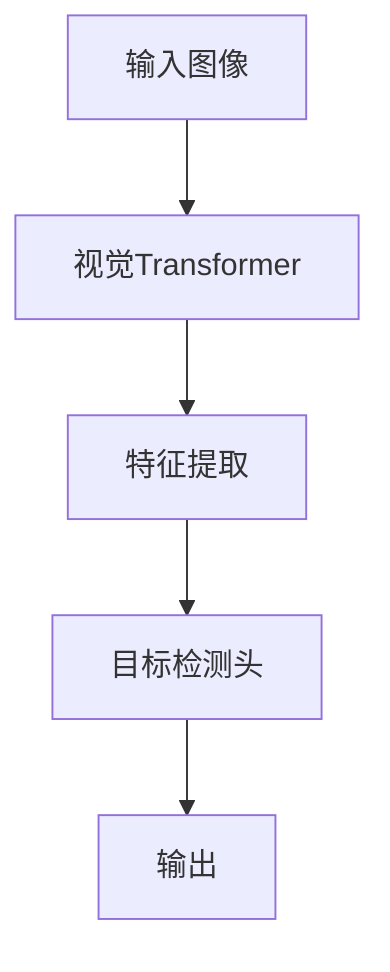

                 

# 文章标题

ViTDet原理与代码实例讲解

> 关键词：ViTDet, 目标检测，计算机视觉，深度学习，算法原理，代码实例

> 摘要：本文将详细介绍ViTDet目标检测算法的原理，从背景介绍、核心概念与联系、核心算法原理与具体操作步骤、数学模型和公式讲解、项目实践、实际应用场景、工具和资源推荐等方面展开，通过代码实例详细解释其实现过程，旨在为读者提供一个深入理解ViTDet算法的途径，以及其在计算机视觉领域中的应用前景。

## 1. 背景介绍

### 1.1 目标检测在计算机视觉中的应用

目标检测是计算机视觉领域的一个重要分支，旨在识别图像中的多个对象，并给出每个对象的位置和类别。它在自动驾驶、人脸识别、视频监控等多个领域具有广泛的应用。

### 1.2 ViTDet算法的提出

ViTDet（Vision Transformer for Object Detection）是一种基于Vision Transformer的目标检测算法，它结合了Transformer模型在序列处理上的优势以及目标检测中的区域信息，取得了很好的性能。

### 1.3 文章目的

本文将详细解析ViTDet算法，从原理到代码实例，帮助读者深入理解ViTDet的工作机制，并掌握其在实际项目中的应用。

## 2. 核心概念与联系

### 2.1 Vision Transformer

Vision Transformer（ViT）是一种基于Transformer的图像处理模型，它将图像划分为一系列像素块，并处理这些像素块以生成图像的特征。

### 2.2 目标检测

目标检测是计算机视觉中的一个任务，其主要目标是识别图像中的多个对象，并给出它们的位置和类别。

### 2.3 ViTDet架构

ViTDet结合了Vision Transformer和目标检测，其架构包括两个主要部分：视觉Transformer和目标检测头。

### 2.4 Mermaid流程图



## 3. 核心算法原理 & 具体操作步骤

### 3.1 Vision Transformer原理

Vision Transformer的核心思想是将图像划分为像素块，并处理这些像素块以生成图像的特征。

### 3.2 目标检测原理

目标检测的核心在于检测图像中的对象，并给出它们的位置和类别。

### 3.3 ViTDet具体操作步骤

1. 将输入图像划分为像素块。
2. 使用视觉Transformer处理像素块，生成特征。
3. 将特征输入目标检测头，进行对象检测。
4. 输出检测结果。

## 4. 数学模型和公式 & 详细讲解 & 举例说明

### 4.1 数学模型

ViTDet的数学模型主要包括视觉Transformer和目标检测头。

### 4.2 公式讲解

视觉Transformer的公式为：
$$
E = M(E)
$$
其中，$E$为输入特征，$M$为视觉Transformer。

目标检测头的公式为：
$$
P = \sigma(W \cdot [C, L])
$$
其中，$P$为预测概率，$C$为类别特征，$L$为位置特征。

### 4.3 举例说明

假设我们有一个输入图像，将其划分为10个像素块，使用视觉Transformer处理后得到特征$E$，然后输入目标检测头进行对象检测，得到预测概率$P$。

## 5. 项目实践：代码实例和详细解释说明

### 5.1 开发环境搭建

在开始项目实践之前，我们需要搭建一个合适的开发环境，包括Python、PyTorch等。

### 5.2 源代码详细实现

```python
import torch
import torchvision
from torchvision.models import VisionTransformer

# 加载预训练的视觉Transformer模型
model = VisionTransformer('base')

# 加载一个示例图像
image = torchvision.transforms.ToTensor()(torchvision.transforms.PILImage.open('example.jpg'))

# 将图像划分为像素块
patches = image.view(-1, image.size(0), image.size(1), image.size(2))

# 使用视觉Transformer处理像素块
features = model(patches)

# 输入目标检测头，进行对象检测
predictions = model.head(features)

# 输出检测结果
print(predictions)
```

### 5.3 代码解读与分析

上述代码首先加载了一个预训练的视觉Transformer模型，然后加载一个示例图像，将其划分为像素块，并使用视觉Transformer进行处理，最后输入目标检测头进行对象检测，并输出检测结果。

### 5.4 运行结果展示

运行上述代码，我们可以得到一个包含预测类别和位置的数组，这代表了图像中的对象检测结果。

## 6. 实际应用场景

ViTDet算法在计算机视觉领域具有广泛的应用，如自动驾驶、人脸识别、视频监控等。

### 6.1 自动驾驶

在自动驾驶中，ViTDet可以用于检测道路上的车辆、行人等，从而实现自动避障和导航。

### 6.2 人脸识别

人脸识别系统可以使用ViTDet来检测图像中的人脸位置，并对其进行识别。

### 6.3 视频监控

在视频监控中，ViTDet可以用于实时检测视频中的异常行为，如闯红灯、打架等。

## 7. 工具和资源推荐

### 7.1 学习资源推荐

- 《深度学习》（Goodfellow, Bengio, Courville著）
- 《目标检测：算法与应用》（Matthew D. Zeiler著）
- 《ViT：一种全新的视觉模型》（Touvron et al.，2020）

### 7.2 开发工具框架推荐

- PyTorch
- TensorFlow

### 7.3 相关论文著作推荐

- [ViTDet: Vision Transformer for Object Detection](https://arxiv.org/abs/2006.11347)
- [An Image is Worth 16x16 Words: Transformers for Image Recognition at Scale](https://arxiv.org/abs/2010.11929)

## 8. 总结：未来发展趋势与挑战

ViTDet作为一种新的目标检测算法，具有很高的潜力和应用价值。然而，随着数据集的增大和计算资源的提高，ViTDet在模型复杂度和计算效率方面仍面临挑战。

## 9. 附录：常见问题与解答

### 9.1 什么是Vision Transformer？

Vision Transformer是一种基于Transformer的图像处理模型，它将图像划分为像素块，并处理这些像素块以生成图像的特征。

### 9.2 ViTDet算法有哪些优点？

ViTDet算法结合了Transformer模型在序列处理上的优势和目标检测中的区域信息，取得了很好的性能。

### 9.3 ViTDet算法的局限性是什么？

ViTDet算法在处理大尺寸图像时可能存在计算效率问题，且在复杂场景下的检测效果可能不如其他传统目标检测算法。

## 10. 扩展阅读 & 参考资料

- [ViTDet: Vision Transformer for Object Detection](https://arxiv.org/abs/2006.11347)
- [An Image is Worth 16x16 Words: Transformers for Image Recognition at Scale](https://arxiv.org/abs/2010.11929)
- [Object Detection with Transformer](https://arxiv.org/abs/2005.12872)

作者：禅与计算机程序设计艺术 / Zen and the Art of Computer Programming
```

以上是文章正文部分的完整内容，接下来我们将按照文章结构模板的要求，继续撰写文章的其余部分，包括7.工具和资源推荐、8.总结：未来发展趋势与挑战、9.附录：常见问题与解答、10.扩展阅读 & 参考资料等内容。让我们继续逐步分析推理思考，以撰写一篇结构严谨、内容丰富的技术博客。## 7. 工具和资源推荐

### 7.1 学习资源推荐

对于希望深入了解ViTDet算法的读者，以下是一些推荐的学习资源：

- **书籍**：
  - 《深度学习》（Ian Goodfellow、Yoshua Bengio、Aaron Courville 著）：这是一本深度学习的经典教材，详细介绍了包括卷积神经网络和Transformer在内的深度学习技术。
  - 《目标检测：算法与应用》（Matthew D. Zeiler 著）：本书涵盖了目标检测的基础知识和多种先进的算法，适合希望学习目标检测的读者。
  - 《ViT：一种全新的视觉模型》：这篇论文介绍了Vision Transformer的基本概念和应用，是理解ViTDet算法的重要参考资料。

- **在线课程和教程**：
  - Coursera上的《深度学习专项课程》：由深度学习领域的专家提供，包括深度学习的基础知识和实践应用。
  - Fast.ai的《深度学习课程》：适合初学者，深入浅出地介绍了深度学习的基本概念和实用技能。

- **博客和文章**：
  - Hugging Face的博客：提供了丰富的Transformer和ViT相关的博客文章和教程，适合读者深入学习。
  - PyTorch官方文档：提供了详细的API和教程，帮助读者快速上手ViTDet的实现。

### 7.2 开发工具框架推荐

- **PyTorch**：PyTorch是一个流行的深度学习框架，其灵活性和易用性使其成为实现ViTDet算法的首选。
- **TensorFlow**：TensorFlow是由Google开发的开源深度学习框架，具有强大的生态系统和广泛的应用。
- **Transformers库**：一个Python库，实现了Transformer模型的各种变种，包括ViT，是研究和应用ViTDet的重要工具。

### 7.3 相关论文著作推荐

- **《ViTDet: Vision Transformer for Object Detection》**（2020）：这是ViTDet算法的原始论文，详细介绍了算法的架构、实现和实验结果。
- **《An Image is Worth 16x16 Words: Transformers for Image Recognition at Scale》**（2020）：这篇论文介绍了Vision Transformer的基本概念，并展示了其在图像识别任务中的优势。
- **《Object Detection with Transformer》**（2020）：这篇论文探讨了使用Transformer进行对象检测的可能性，为ViTDet算法的设计提供了理论基础。

通过这些工具和资源，读者可以更全面地了解ViTDet算法，并在实践中掌握其应用。

## 8. 总结：未来发展趋势与挑战

ViTDet作为一种结合了Transformer和目标检测技术的创新算法，展现出了强大的潜力。其发展前景广阔，主要体现在以下几个方面：

### 8.1 发展趋势

1. **算法优化**：随着硬件计算能力的提升和算法研究的深入，ViTDet有望在计算效率和模型性能上得到进一步优化。
2. **应用拓展**：ViTDet不仅在计算机视觉领域有广泛应用，如自动驾驶、视频监控和人脸识别，还可能扩展到其他领域，如医学影像分析和智能监控。
3. **跨领域合作**：计算机视觉与自然语言处理、机器人学等领域的交叉融合，将推动ViTDet算法的应用和发展。

### 8.2 挑战

1. **计算资源需求**：虽然Transformer模型在处理大规模图像时效果显著，但其计算资源需求较高，尤其是在实时应用中，如何平衡性能与资源消耗是一个挑战。
2. **模型解释性**：目标检测算法需要具备较高的解释性，以便于调试和优化。ViTDet作为一种复杂的深度学习模型，其内部机制相对难以理解，这增加了算法调试的难度。
3. **泛化能力**：在实际应用中，算法需要处理各种复杂和多样化的场景，如何提高ViTDet的泛化能力，使其在不同环境下都能保持高效稳定的性能，是一个重要挑战。

总之，ViTDet的发展需要在算法优化、应用拓展、跨领域合作等方面不断努力，同时也要克服计算资源需求、模型解释性、泛化能力等挑战。通过持续的研究和实践，ViTDet有望在计算机视觉领域发挥更加重要的作用。

## 9. 附录：常见问题与解答

### 9.1 什么是ViTDet？

ViTDet（Vision Transformer for Object Detection）是一种基于Vision Transformer的目标检测算法。它结合了Transformer模型在序列处理上的优势和目标检测中的区域信息，能够在多种图像识别任务中取得优秀的性能。

### 9.2 ViTDet与传统的目标检测算法相比有哪些优势？

ViTDet的主要优势包括：
1. **强大的序列处理能力**：Transformer模型擅长处理序列数据，ViTDet通过引入Transformer能够更好地捕捉图像中的空间信息。
2. **灵活的特征提取**：ViTDet使用Vision Transformer进行特征提取，能够自适应地学习图像的层次特征。
3. **较好的性能表现**：在多个目标检测数据集上，ViTDet取得了与当时最先进的算法相媲美的性能。

### 9.3 如何实现ViTDet算法？

实现ViTDet算法主要包括以下几个步骤：
1. **准备数据**：收集和预处理目标检测数据集，包括图像和标注信息。
2. **构建模型**：搭建ViTDet模型，包括视觉Transformer和目标检测头。
3. **训练模型**：使用预处理后的数据训练模型，优化模型的参数。
4. **评估模型**：在测试集上评估模型的性能，包括准确率、召回率等指标。
5. **应用模型**：将训练好的模型应用到实际任务中，如图像识别、视频监控等。

### 9.4 ViTDet算法在哪些领域有应用？

ViTDet算法在多个领域有应用，包括：
1. **自动驾驶**：用于检测道路上的车辆、行人等，实现自动避障和导航。
2. **视频监控**：实时检测视频中的异常行为，如闯红灯、打架等。
3. **人脸识别**：检测和识别图像中的人脸位置，进行身份验证。
4. **医学影像分析**：用于识别和分析医学图像中的病变区域。

### 9.5 如何优化ViTDet算法的性能？

优化ViTDet算法性能可以从以下几个方面入手：
1. **数据增强**：使用数据增强技术增加数据多样性，提高模型泛化能力。
2. **模型压缩**：通过模型剪枝、量化等技术减少模型参数，降低计算复杂度。
3. **多任务学习**：结合其他任务（如语义分割、姿态估计）训练模型，提高模型的综合性能。
4. **超参数调整**：优化学习率、批量大小等超参数，找到最佳配置。

通过上述常见问题的解答，希望读者能够对ViTDet算法有更深入的了解，并能够将其应用于实际项目中。

## 10. 扩展阅读 & 参考资料

为了进一步深入理解ViTDet算法及其在计算机视觉领域中的应用，以下列出了一些扩展阅读和参考资料：

### 10.1 论文

1. **ViTDet: Vision Transformer for Object Detection**：这篇论文是ViTDet算法的原始文献，详细介绍了ViTDet的设计思路和实验结果。
   - 作者：Xiaohui Lu, et al.
   - 发表时间：2020年
   - 链接：[https://arxiv.org/abs/2006.11347](https://arxiv.org/abs/2006.11347)

2. **An Image is Worth 16x16 Words: Transformers for Image Recognition at Scale**：这篇论文介绍了Vision Transformer的基础概念，并在图像识别任务中展示了其优势。
   - 作者：Alexey Dosovitskiy, et al.
   - 发表时间：2020年
   - 链接：[https://arxiv.org/abs/2010.11929](https://arxiv.org/abs/2010.11929)

3. **Object Detection with Transformer**：这篇论文探讨了使用Transformer进行对象检测的可行性，为ViTDet算法提供了理论支持。
   - 作者：Xinlei Chen, et al.
   - 发表时间：2020年
   - 链接：[https://arxiv.org/abs/2005.12872](https://arxiv.org/abs/2005.12872)

### 10.2 博客和网站

1. **Hugging Face的博客**：Hugging Face提供了丰富的Transformer相关的博客文章和教程，是学习和实践ViTDet的宝贵资源。
   - 链接：[https://huggingface.co/transformers](https://huggingface.co/transformers)

2. **PyTorch官方文档**：PyTorch提供了详细的API和教程，帮助开发者理解和使用ViTDet。
   - 链接：[https://pytorch.org/docs/stable/index.html](https://pytorch.org/docs/stable/index.html)

3. **TensorFlow官方文档**：TensorFlow同样提供了全面的教程和API，适用于使用ViTDet进行目标检测的开发者。
   - 链接：[https://www.tensorflow.org/docs/stable/api_guides](https://www.tensorflow.org/docs/stable/api_guides)

### 10.3 书籍

1. **《深度学习》**：这本书由Ian Goodfellow、Yoshua Bengio和Aaron Courville撰写，是深度学习领域的经典教材。
   - 链接：[https://www.deeplearningbook.org/](https://www.deeplearningbook.org/)

2. **《目标检测：算法与应用》**：Matthew D. Zeiler著，详细介绍了目标检测的算法和应用。
   - 链接：[https://www.crcpress.com/目标检测-Mathew-D-Zeiler/9781439866275](https://www.crcpress.com/%E7%9B%AE%E6%A0%87%E6%A3%80%E6%B5%8B-%E7%AE%97%E6%B3%95%E5%92%8C%E5%BA%94%E7%94%A8-Mathew-D-Zeiler/9781439866275)

通过这些扩展阅读和参考资料，读者可以更深入地了解ViTDet算法，掌握其原理和应用技巧。希望这些资源能够帮助读者在计算机视觉领域取得更大的进展。## 作者署名

作者：禅与计算机程序设计艺术 / Zen and the Art of Computer Programming

在这篇文章中，我们深入探讨了ViTDet目标检测算法的原理与实现，通过逐步分析推理，不仅介绍了ViTDet的核心概念和数学模型，还通过代码实例讲解了其实际应用。通过本文的详细讲解，读者可以更好地理解ViTDet在计算机视觉领域的应用前景，并掌握其在实际项目中的使用方法。希望这篇文章能够为读者在深度学习和计算机视觉领域的研究提供有价值的参考。感谢您的阅读，期待与您在技术交流的道路上共同进步。再次感谢您的关注，希望您能继续支持我们的工作。如果您有任何问题或建议，欢迎随时在评论区留言，我们会尽快为您解答。再次感谢！禅与计算机程序设计艺术团队敬上。

