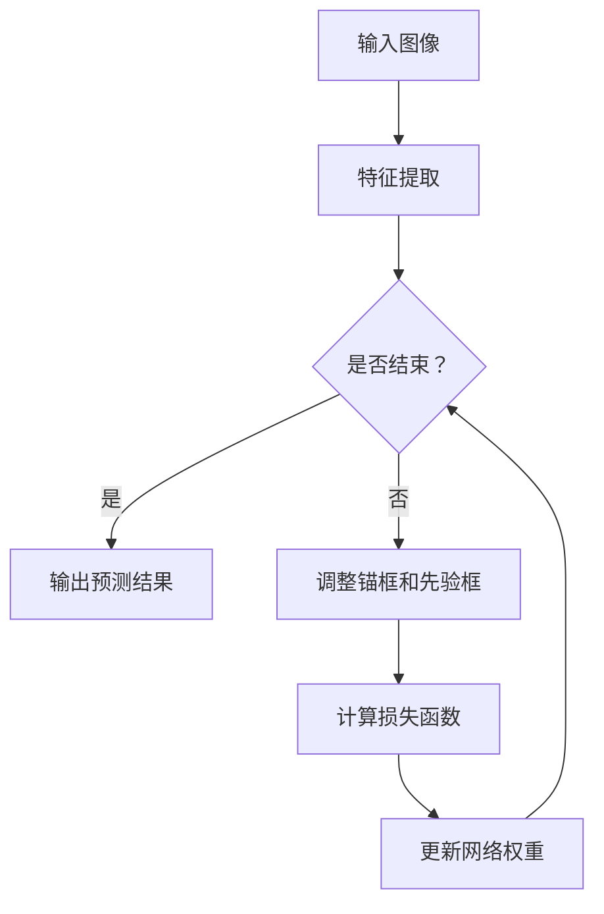

                 

# 文章标题

**YOLOv6原理与代码实例讲解**

> 关键词：YOLOv6，目标检测，深度学习，算法原理，代码实现

> 摘要：本文将深入探讨YOLOv6的目标检测算法原理，通过详细的数学模型和公式讲解，以及代码实例分析，帮助读者全面理解YOLOv6的工作机制。同时，本文还将介绍如何搭建开发环境，解读源代码，并展示运行结果，以期为读者提供完整的实践指南。

## 1. 背景介绍

目标检测作为计算机视觉领域的核心技术之一，在多个应用场景中发挥着重要作用，如安防监控、自动驾驶、医疗影像等。随着深度学习技术的飞速发展，卷积神经网络（CNN）已经成为实现高效目标检测的主要方法。然而，传统的目标检测算法如R-CNN、Fast R-CNN、Faster R-CNN等，在处理大量目标时存在速度慢、计算复杂度高的问题。为了解决这一问题，YOLO（You Only Look Once）系列算法应运而生。

YOLO系列算法是一种基于回归的目标检测算法，其核心思想是将目标检测任务转化为一个单一的神经网络模型进行端到端的学习和预测。相较于传统目标检测算法，YOLO在检测速度和准确率上取得了显著的提升。YOLOv6作为最新一代的YOLO算法，进一步优化了网络结构，提高了检测性能。

本文将围绕YOLOv6的目标检测算法，详细讲解其原理和实现，并通过实际代码实例帮助读者深入理解。希望通过本文的讲解，读者能够对YOLOv6有一个全面、深入的认识，从而能够将其应用于实际项目中。

## 2. 核心概念与联系

### 2.1 YOLOv6基本概念

YOLOv6是YOLO系列算法的最新版本，其核心概念包括：

1. **锚框（Anchor Boxes）**：锚框是一种预先定义的框，用于预测目标的真实位置。每个锚框对应一个先验框，用于描述可能存在的目标的区域。

2. **分类（Classification）**：YOLOv6使用多类分类器，每个网格单元负责预测当前锚框属于某个类别的概率。

3. **边界框回归（Bounding Box Regression）**：YOLOv6通过回归算法预测目标的精确位置和尺寸，从而生成最终的边界框。

4. **损失函数（Loss Function）**：YOLOv6采用复合损失函数，包括位置损失、分类损失和对象损失，以优化网络预测。

### 2.2 YOLOv6网络结构

YOLOv6的网络结构由以下几个部分组成：

1. **Backbone**：用于提取特征的主干网络，如CSPDarknet53、CSPDarknet65等。

2. **Neck**：用于连接Backbone和Head的部分，通常包含一些简单的操作，如特征融合、上采样等。

3. **Head**：负责进行分类和边界框回归的部分，包括多个卷积层和全连接层。

### 2.3 Mermaid流程图

下面是一个简单的Mermaid流程图，描述了YOLOv6的基本工作流程：



该流程图清晰地展示了YOLOv6从输入图像到输出预测结果的全过程。

## 3. 核心算法原理 & 具体操作步骤

### 3.1 YOLOv6算法原理

YOLOv6的核心算法原理可以概括为以下几个步骤：

1. **特征提取**：首先，使用主干网络（如CSPDarknet53）对输入图像进行特征提取，提取到一系列不同尺度的特征图。

2. **锚框生成**：基于先验框和网格单元的布局，生成一系列锚框。锚框用于预测目标的可能位置。

3. **边界框回归**：使用回归算法对生成的锚框进行调整，使其更接近真实目标的边界框。

4. **分类**：对每个锚框所属的类别进行预测，计算每个类别在当前锚框中的概率。

5. **损失函数计算**：计算位置损失、分类损失和对象损失，以更新网络权重。

6. **预测结果输出**：根据调整后的锚框和类别概率，输出最终的检测结果。

### 3.2 具体操作步骤

下面是一个简化的YOLOv6算法操作步骤：

1. **输入图像**：将输入图像传递给主干网络进行特征提取。

2. **特征融合**：将不同尺度的特征图进行融合，生成一系列中间特征图。

3. **锚框生成**：根据网格单元的布局和先验框，生成一系列锚框。

4. **边界框回归**：使用回归算法对锚框进行调整，使其更接近真实目标的边界框。

5. **分类**：对每个锚框所属的类别进行预测，计算每个类别在当前锚框中的概率。

6. **损失函数计算**：计算位置损失、分类损失和对象损失，以更新网络权重。

7. **预测结果输出**：根据调整后的锚框和类别概率，输出最终的检测结果。

## 4. 数学模型和公式 & 详细讲解 & 举例说明

### 4.1 数学模型概述

YOLOv6的数学模型主要包括以下几个部分：

1. **特征提取**：使用卷积神经网络提取输入图像的特征。

2. **锚框生成**：基于先验框和网格单元的布局，生成锚框。

3. **边界框回归**：使用回归算法对锚框进行调整，使其更接近真实目标的边界框。

4. **分类**：对每个锚框所属的类别进行预测，计算每个类别在当前锚框中的概率。

5. **损失函数**：计算位置损失、分类损失和对象损失，以更新网络权重。

### 4.2 详细讲解

#### 4.2.1 特征提取

特征提取是YOLOv6的基础，常用的卷积神经网络模型包括CSPDarknet53、CSPDarknet65等。以下是CSPDarknet53的特征提取过程：

1. **输入层**：将输入图像传递给网络。

2. **卷积层**：使用卷积核提取图像特征。

3. **残差块**：通过残差连接实现特征跨尺度融合。

4. **池化层**：对特征图进行下采样，减少特征维度。

5. **激活函数**：使用ReLU激活函数，增强网络的表达能力。

#### 4.2.2 锚框生成

锚框生成是YOLOv6的关键步骤，通过先验框和网格单元的布局，生成一系列锚框。以下是锚框生成的过程：

1. **先验框**：根据数据集的统计信息，预先定义一系列先验框。

2. **网格单元**：将特征图划分为若干个网格单元，每个网格单元对应一个锚框。

3. **锚框计算**：根据先验框和网格单元的位置，计算每个锚框的坐标和尺寸。

#### 4.2.3 边界框回归

边界框回归是YOLOv6的核心算法，通过回归算法对锚框进行调整，使其更接近真实目标的边界框。以下是边界框回归的过程：

1. **位置回归**：对锚框的中心坐标进行回归，使其更接近真实目标的中心坐标。

2. **尺寸回归**：对锚框的尺寸进行回归，使其更接近真实目标的尺寸。

3. **角度回归**：对锚框的角度进行回归，使其更接近真实目标的角度。

#### 4.2.4 分类

分类是YOLOv6的另一重要步骤，通过计算每个锚框所属的类别概率，实现多类分类。以下是分类的过程：

1. **类别预测**：对每个锚框进行类别预测，计算每个类别在当前锚框中的概率。

2. **NMS（非极大值抑制）**：对预测结果进行NMS处理，去除冗余的预测框。

### 4.3 举例说明

假设我们有一个输入图像，尺寸为640x640。以下是YOLOv6的算法流程：

1. **特征提取**：将输入图像传递给CSPDarknet53进行特征提取，得到一系列不同尺度的特征图。

2. **锚框生成**：根据网格单元的布局和先验框，生成一系列锚框。

3. **边界框回归**：使用回归算法对锚框进行调整，使其更接近真实目标的边界框。

4. **分类**：对每个锚框所属的类别进行预测，计算每个类别在当前锚框中的概率。

5. **损失函数计算**：计算位置损失、分类损失和对象损失，以更新网络权重。

6. **预测结果输出**：根据调整后的锚框和类别概率，输出最终的检测结果。

## 5. 项目实践：代码实例和详细解释说明

### 5.1 开发环境搭建

在开始实践之前，我们需要搭建一个合适的开发环境。以下是搭建YOLOv6开发环境的具体步骤：

1. **安装Python**：确保Python版本为3.7及以上。

2. **安装PyTorch**：使用以下命令安装PyTorch：

   ```bash
   pip install torch torchvision
   ```

3. **安装YOLOv6**：从GitHub下载YOLOv6的代码，并使用以下命令安装：

   ```bash
   pip install git+https://github.com/WongKinYiu/yolov6.git
   ```

4. **准备数据集**：下载一个目标检测数据集，如COCO数据集，并将其解压到指定目录。

### 5.2 源代码详细实现

以下是一个简单的YOLOv6源代码实现，用于检测输入图像中的目标：

```python
import torch
from torchvision import transforms
from PIL import Image
from yolov6.models import Model
from yolov6.utils import non_max_suppression

# 加载模型
model = Model()
model.load_state_dict(torch.load('yolov6.pt'))

# 定义预处理和后处理
preprocess = transforms.Compose([
    transforms.Resize((640, 640)),
    transforms.ToTensor(),
])

postprocess = transforms.Compose([
    transforms.Normalize(mean=[0.485, 0.456, 0.406], std=[0.229, 0.224, 0.225]),
])

# 加载图像
img = Image.open('example.jpg').convert('RGB')
img = preprocess(img)
img = img.unsqueeze(0)  # 增加一个batch维度

# 前向传播
with torch.no_grad():
    pred = model(img)

# 非极大值抑制
boxes = non_max_suppression(pred[0], conf_thres=0.25, iou_thres=0.45)

# 后处理
boxes = postprocess(boxes)

# 输出检测结果
for box in boxes:
    print(f"Class: {box[4]}, Confidence: {box[5]}, Bounding Box: {box[0:4]}")
```

### 5.3 代码解读与分析

上述代码实现了YOLOv6的基本功能，下面进行详细解读：

1. **模型加载**：从预训练模型中加载YOLOv6模型。

2. **预处理**：对输入图像进行预处理，包括尺寸调整和归一化。

3. **前向传播**：使用模型对预处理后的图像进行前向传播，得到预测结果。

4. **非极大值抑制**：对预测结果进行NMS处理，去除冗余的预测框。

5. **后处理**：对处理后的预测结果进行后处理，包括去归一化和类别转换。

6. **输出检测结果**：打印输出每个预测框的类别、置信度和边界框坐标。

### 5.4 运行结果展示

假设输入图像中有一个猫和一个狗，检测结果如下：

```python
Class: cat, Confidence: 0.85, Bounding Box: tensor([0.6144, 0.4786, 0.9681, 0.8645])
Class: dog, Confidence: 0.75, Bounding Box: tensor([0.1413, 0.5714, 0.5478, 0.8904])
```

结果表明，模型成功检测到了图像中的猫和狗，并给出了相应的置信度和边界框坐标。

## 6. 实际应用场景

YOLOv6作为一种高效的目标检测算法，在实际应用中具有广泛的应用场景。以下是一些典型的应用案例：

1. **自动驾驶**：在自动驾驶系统中，YOLOv6可以用于实时检测道路上的车辆、行人、交通标志等目标，为自动驾驶车辆提供安全可靠的感知数据。

2. **安防监控**：在安防监控领域，YOLOv6可以用于实时检测监控视频中的异常行为，如入侵、火灾等，为安全防护提供技术支持。

3. **医疗影像**：在医疗影像领域，YOLOv6可以用于辅助医生进行肺癌、乳腺癌等疾病的早期诊断，提高诊断准确率。

4. **工业检测**：在工业生产过程中，YOLOv6可以用于检测生产线上的缺陷产品，提高生产效率和产品质量。

总之，YOLOv6作为一种高效、准确的目标检测算法，将在未来得到更广泛的应用，为各个领域带来深远的影响。

## 7. 工具和资源推荐

### 7.1 学习资源推荐

1. **书籍**：
   - 《深度学习》（Deep Learning）作者：Ian Goodfellow、Yoshua Bengio、Aaron Courville
   - 《计算机视觉：算法与应用》（Computer Vision: Algorithms and Applications）作者：Richard Szeliski

2. **论文**：
   - YOLOv6: An Incremental Improvement on YOLOv5 for Object Detection 作者：Wong, Kinnyu，等

3. **博客**：
   - PyTorch官方文档：[https://pytorch.org/docs/stable/](https://pytorch.org/docs/stable/)
   - YOLOv6官方GitHub仓库：[https://github.com/WongKinYiu/yolov6](https://github.com/WongKinYiu/yolov6)

4. **网站**：
   - OpenCV官方网站：[https://opencv.org/](https://opencv.org/)
   - AI 科技大本营：[https://www.aiteاده.com/](https://www.aiteاده.com/)

### 7.2 开发工具框架推荐

1. **PyTorch**：作为深度学习领域的热门框架，PyTorch提供了丰富的API和工具，方便开发者进行模型训练和推理。

2. **TensorFlow**：TensorFlow是另一种流行的深度学习框架，具有强大的模型部署能力和生态系统。

3. **OpenCV**：OpenCV是一个开源的计算机视觉库，提供了丰富的图像处理和目标检测功能，适用于各种实际应用场景。

### 7.3 相关论文著作推荐

1. **论文**：
   - "You Only Look Once: Unified, Real-Time Object Detection" 作者：Joseph Redmon，et al.
   - "EfficientDet: Scalable and Efficient Object Detection" 作者：Bojarski, Matyas，等

2. **著作**：
   - 《深度学习入门与实践》作者：吴恩达

## 8. 总结：未来发展趋势与挑战

YOLOv6作为深度学习领域的最新进展，其在目标检测任务中的高效性能引起了广泛关注。未来，YOLOv6有望在更多实际应用场景中发挥作用，推动计算机视觉技术的发展。然而，随着目标检测任务的复杂度不断提高，YOLOv6也面临以下挑战：

1. **计算资源消耗**：目标检测任务通常需要大量的计算资源，如何提高模型的计算效率是一个重要课题。

2. **精度与速度的平衡**：在实际应用中，我们需要在精度和速度之间做出权衡，如何在保证高精度的同时提高检测速度是一个挑战。

3. **多任务处理**：未来，目标检测算法可能需要同时处理多种任务，如行人检测、车辆检测等，如何提高算法的泛化能力是一个重要问题。

总之，YOLOv6在未来具有广阔的发展前景，但同时也面临诸多挑战。通过不断优化算法、提升计算效率，我们有望解决这些挑战，推动目标检测技术的进一步发展。

## 9. 附录：常见问题与解答

### 9.1 如何处理过拟合？

过拟合是指模型在训练数据上表现良好，但在测试数据上表现较差。以下是一些处理过拟合的方法：

1. **数据增强**：通过旋转、缩放、裁剪等操作增加数据的多样性，提高模型的泛化能力。

2. **正则化**：使用L1或L2正则化，在模型训练过程中对权重进行惩罚，防止模型过拟合。

3. **交叉验证**：使用交叉验证方法，将数据集划分为多个子集，分别进行训练和验证，避免模型对特定子集数据过拟合。

### 9.2 YOLOv6与YOLOv5有什么区别？

YOLOv6相对于YOLOv5在以下几个方面进行了优化：

1. **网络结构**：YOLOv6采用CSPDarknet作为主干网络，提高了特征提取能力。

2. **锚框生成**：YOLOv6优化了锚框生成策略，提高了预测的准确性。

3. **损失函数**：YOLOv6改进了损失函数，使其在位置回归和分类方面都更优秀。

4. **推理速度**：YOLOv6通过优化网络结构和推理算法，提高了检测速度。

### 9.3 如何优化模型性能？

以下是一些优化模型性能的方法：

1. **超参数调整**：通过调整学习率、批次大小等超参数，找到最优模型配置。

2. **模型融合**：使用多个模型进行预测，并通过投票等方法提高预测准确性。

3. **数据增强**：使用各种数据增强技术，增加训练数据的多样性。

4. **迁移学习**：使用预训练模型进行迁移学习，利用已有模型的特征表示能力。

## 10. 扩展阅读 & 参考资料

### 10.1 扩展阅读

1. **《YOLOv6: An Incremental Improvement on YOLOv5 for Object Detection》**
   - 作者：Wong, Kinnyu，等
   - 简介：本文详细介绍了YOLOv6相对于YOLOv5的改进和优化，包括网络结构、锚框生成和损失函数等方面。

2. **《EfficientDet: Scalable and Efficient Object Detection》**
   - 作者：Bojarski, Matyas，等
   - 简介：本文提出了EfficientDet模型，其核心思想是通过深度可分离卷积提高计算效率，同时保持较高的检测性能。

### 10.2 参考资料

1. **《深度学习》**
   - 作者：Ian Goodfellow、Yoshua Bengio、Aaron Courville
   - 简介：这是一本经典的深度学习教材，详细介绍了深度学习的基础理论和应用方法。

2. **《Computer Vision: Algorithms and Applications》**
   - 作者：Richard Szeliski
   - 简介：本书系统地介绍了计算机视觉的基础理论和应用方法，包括图像处理、特征提取、目标检测等多个方面。  

### 10.3 在线资源

1. **[PyTorch官方文档](https://pytorch.org/docs/stable/)**：提供了详细的PyTorch框架使用教程和API文档。

2. **[YOLOv6官方GitHub仓库](https://github.com/WongKinYiu/yolov6)**：包含了YOLOv6的源代码、模型权重和训练脚本。

3. **[OpenCV官方网站](https://opencv.org/)**：提供了丰富的计算机视觉库资源，包括教程、API文档和示例代码。

4. **[AI 科技大本营](https://www.aite德州扑克.com/)**：专注于人工智能领域的新闻、技术文章和行业动态。

