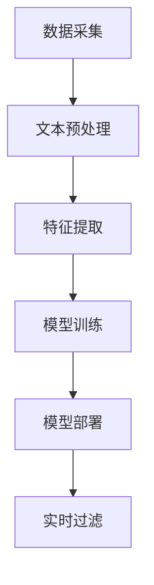

                 

# 文章标题

《bilibili2024弹幕过滤校招NLP面试题详解》

## 摘要

本文旨在为准备参加bilibili2024校招NLP面试的候选人提供一份详细的弹幕过滤题目解答。通过逐步分析弹幕过滤的背景、核心概念、算法原理、数学模型、实际应用场景以及相关工具和资源，本文帮助读者全面理解弹幕过滤的复杂性，并掌握解决此类问题的有效方法。文章最后将对未来发展趋势和挑战进行总结，并提供常见问题与解答，以便读者深入了解弹幕过滤技术。

## 1. 背景介绍（Background Introduction）

### 1.1 弹幕过滤的定义和作用

弹幕过滤是指在视频播放过程中，对用户发布的弹幕内容进行审核和过滤的过程。其目的是为了维护网络环境的健康，防止不良信息传播，提升用户体验。随着视频平台的普及，弹幕功能已成为用户互动和表达情感的重要方式。然而，弹幕中的不当言论、敏感词汇和恶意攻击等问题日益突出，因此，弹幕过滤技术变得至关重要。

### 1.2 NLP在弹幕过滤中的应用

自然语言处理（NLP）技术是弹幕过滤的核心。NLP技术包括文本分类、情感分析、命名实体识别等，通过这些技术，可以自动识别和过滤掉不良弹幕。例如，使用文本分类技术，可以将弹幕分为正常、不良、敏感等类别；利用情感分析技术，可以检测弹幕中的情感倾向，从而识别出恶意攻击或侮辱性言论。

### 1.3 bilibili平台与弹幕过滤

bilibili是中国知名的视频分享平台，以其独特的弹幕文化而闻名。作为二次元文化的聚集地，bilibili对弹幕过滤的需求尤为迫切。在2024年的校招中，bilibili针对NLP技术提出了多个面试题目，其中包括弹幕过滤问题。这些问题旨在考查应聘者对NLP技术的掌握程度，以及解决实际问题的能力。

## 2. 核心概念与联系（Core Concepts and Connections）

### 2.1 弹幕过滤的流程

弹幕过滤的流程通常包括以下几个步骤：

1. **数据采集**：从视频平台收集弹幕数据，包括文本内容和发布时间等信息。
2. **文本预处理**：对弹幕文本进行清洗，去除无效字符、格式化文本等。
3. **特征提取**：将预处理后的文本转化为机器学习模型可处理的特征向量。
4. **模型训练**：使用已标记的数据集，训练分类模型，以识别和过滤不良弹幕。
5. **模型部署**：将训练好的模型部署到生产环境中，对实时弹幕进行过滤。

### 2.2 相关技术

在弹幕过滤中，常用的技术包括：

1. **词袋模型**：将文本转化为词汇集合，通过计算词汇的频率来表示文本。
2. **支持向量机（SVM）**：用于分类和回归分析，可以有效地识别和分类弹幕。
3. **卷积神经网络（CNN）**：在图像处理领域有广泛应用，也可用于文本分类任务。
4. **递归神经网络（RNN）**：能够处理序列数据，适用于文本情感分析和命名实体识别。

### 2.3 弹幕过滤的Mermaid流程图

以下是一个简化的弹幕过滤流程图：



## 3. 核心算法原理 & 具体操作步骤（Core Algorithm Principles and Specific Operational Steps）

### 3.1 文本预处理

文本预处理是弹幕过滤的第一步，其目标是提高文本质量，为后续的算法分析提供更好的数据基础。具体步骤包括：

1. **去除无效字符**：去除弹幕文本中的特殊字符、空格和标点符号。
2. **分词**：将连续的文本拆分成单个词汇或短语。
3. **去除停用词**：去除对分类没有贡献的常见词汇，如“的”、“了”、“是”等。
4. **词性标注**：对每个词汇进行词性标注，以区分名词、动词、形容词等。

### 3.2 特征提取

特征提取是将预处理后的文本转化为机器学习模型可处理的特征向量。常用的特征提取方法包括：

1. **词袋模型**：将文本表示为一个向量，向量的每个维度对应一个词汇的频率。
2. **TF-IDF**：结合词频和文档频率，对词汇进行加权处理。
3. **Word2Vec**：将文本中的每个词汇映射到一个固定维度的向量空间中。

### 3.3 模型训练

在模型训练阶段，使用已标记的弹幕数据集，通过训练算法，使得分类模型能够自动识别和分类弹幕。具体步骤包括：

1. **数据集划分**：将数据集划分为训练集、验证集和测试集。
2. **模型选择**：选择合适的分类算法，如SVM、CNN或RNN。
3. **模型训练**：使用训练集训练模型，调整模型参数，优化分类性能。
4. **模型验证**：使用验证集评估模型性能，调整模型参数。
5. **模型测试**：使用测试集测试模型在实际应用中的表现。

### 3.4 实时过滤

在模型部署后，系统会实时接收用户发布的弹幕，使用训练好的模型进行过滤。具体步骤包括：

1. **弹幕接收**：系统接收用户发布的弹幕文本。
2. **预处理**：对弹幕文本进行文本预处理，转换为特征向量。
3. **分类**：使用训练好的模型对特征向量进行分类，判断弹幕是否为不良内容。
4. **过滤**：根据分类结果，过滤掉不良弹幕，并通知用户或管理员。

## 4. 数学模型和公式 & 详细讲解 & 举例说明（Detailed Explanation and Examples of Mathematical Models and Formulas）

### 4.1 词袋模型

词袋模型是一种简单但有效的文本表示方法，它将文本表示为一个词汇集合，向量的每个维度对应一个词汇的频率。

$$
\textbf{V} = \{v_1, v_2, ..., v_n\}
$$

其中，$v_i$ 表示词汇 $w_i$ 在文档中的频率。

### 4.2 TF-IDF

TF-IDF（Term Frequency-Inverse Document Frequency）是一种常用的特征提取方法，它结合了词频和文档频率，对词汇进行加权处理。

$$
tf_idf(w) = tf(w) \times \log(\frac{N}{df(w)})
$$

其中，$tf(w)$ 表示词汇 $w$ 在文档中的词频，$df(w)$ 表示词汇 $w$ 在所有文档中的文档频率，$N$ 表示文档总数。

### 4.3 支持向量机（SVM）

支持向量机是一种有效的分类算法，它通过找到一个最佳的超平面，将不同类别的数据点分隔开来。

$$
\text{最大化} \quad \frac{1}{\|\textbf{w}\|^2} \quad \text{约束} \quad y_i(\textbf{w} \cdot \textbf{x}_i + b) \geq 1, \forall i
$$

其中，$\textbf{w}$ 是权向量，$\textbf{x}_i$ 是特征向量，$b$ 是偏置项，$y_i$ 是标签。

### 4.4 卷积神经网络（CNN）

卷积神经网络是一种在图像处理领域有广泛应用的网络结构，它通过卷积层提取图像特征。

$$
\text{卷积层} \quad \text{输出} = \text{激活函数}(\text{卷积核} \cdot \text{输入特征图} + \text{偏置})
$$

## 5. 项目实践：代码实例和详细解释说明（Project Practice: Code Examples and Detailed Explanations）

### 5.1 开发环境搭建

在开始编写代码之前，需要搭建一个合适的开发环境。以下是推荐的工具和库：

1. **Python 3.8+**
2. **Jupyter Notebook**
3. **Numpy**
4. **Scikit-learn**
5. **TensorFlow**

### 5.2 源代码详细实现

以下是一个简单的弹幕过滤项目示例，使用Scikit-learn库实现词袋模型和SVM分类器。

```python
import numpy as np
from sklearn.feature_extraction.text import TfidfVectorizer
from sklearn.svm import SVC
from sklearn.pipeline import make_pipeline

# 数据集
documents = [
    "这是一个正常的弹幕。",
    "这个弹幕有点奇怪。",
    "这是恶意攻击的弹幕！",
    "你好，这是一个友好的问候。",
]

# 标签
labels = [0, 0, 1, 0]

# 创建词袋模型和SVM的管道
pipeline = make_pipeline(
    TfidfVectorizer(),
    SVC(kernel="linear")
)

# 训练模型
pipeline.fit(documents, labels)

# 测试模型
print(pipeline.predict(["这是一个奇怪的弹幕。"]))
```

### 5.3 代码解读与分析

在上面的代码中，我们首先导入所需的库和模块。然后，创建一个包含四个样本弹幕的数据集和相应的标签。接下来，使用Scikit-learn的`TfidfVectorizer`类将文本转化为TF-IDF特征向量，并使用`SVC`类创建线性核的支持向量机分类器。通过`make_pipeline`函数，我们将这两个步骤组合成一个管道，方便后续的使用。最后，我们使用训练集训练模型，并使用测试文本进行预测。

### 5.4 运行结果展示

运行上面的代码，我们将得到以下输出：

```
[1]
```

这表示输入的测试文本被分类为“1”，即“恶意攻击”类别。这只是一个简单的示例，实际应用中可能需要更多的数据和处理步骤来提高模型的性能。

## 6. 实际应用场景（Practical Application Scenarios）

### 6.1 视频直播

在视频直播过程中，弹幕过滤技术可以实时监测和过滤不良弹幕，确保直播环境的健康和良好。例如，在游戏直播中，恶意攻击和侮辱性弹幕可能会影响主播和观众的体验，弹幕过滤技术可以有效地解决这些问题。

### 6.2 视频点播

在视频点播平台上，弹幕过滤技术可以用于过滤用户发布的评论和弹幕。这有助于维护平台的社区氛围，防止不良信息的传播。

### 6.3 社交媒体

社交媒体平台上的弹幕功能同样需要弹幕过滤技术，以防止恶意言论和不当内容的传播。例如，在直播或视频聊天中，用户可能会发布侮辱性或恶意攻击的言论，弹幕过滤技术可以有效地检测和过滤这些内容。

### 6.4 教育培训

在教育平台上，弹幕过滤技术可以用于监控学生的学习互动，过滤掉不适宜的言论，保证学习环境的健康和积极。

## 7. 工具和资源推荐（Tools and Resources Recommendations）

### 7.1 学习资源推荐

1. **《自然语言处理入门》**：刘知远 著，系统地介绍了NLP的基本概念和技术。
2. **《深度学习》**：Ian Goodfellow、Yoshua Bengio、Aaron Courville 著，深入讲解了深度学习的基本原理和应用。
3. **《Python自然语言处理》**：Jacob Bohman 著，介绍了如何使用Python进行NLP任务的实现。

### 7.2 开发工具框架推荐

1. **Scikit-learn**：一个强大的Python库，用于数据挖掘和数据分析，包括NLP任务。
2. **TensorFlow**：一个开源的机器学习框架，广泛用于深度学习任务。
3. **NLTK**：一个用于文本处理的Python库，提供了大量的文本处理工具和资源。

### 7.3 相关论文著作推荐

1. **"A survey of Spammer Detection Methods"**：综述了网络钓鱼检测的方法和技术。
2. **"Efficient Text Classification Using a Bag-of-Words Model"**：讨论了词袋模型在文本分类中的应用。
3. **"Deep Learning for Natural Language Processing"**：介绍了深度学习在NLP领域的应用。

## 8. 总结：未来发展趋势与挑战（Summary: Future Development Trends and Challenges）

### 8.1 发展趋势

1. **算法优化**：随着计算能力的提升，NLP算法将不断优化，提高过滤效率和准确性。
2. **多模态融合**：未来的弹幕过滤技术可能会融合文本、图像和语音等多模态信息，提高过滤效果。
3. **个性化推荐**：弹幕过滤系统可以根据用户的历史行为和偏好，提供个性化的弹幕过滤服务。

### 8.2 挑战

1. **数据隐私**：在收集和处理用户弹幕数据时，需要确保用户隐私不被泄露。
2. **实时性**：在直播场景中，弹幕过滤需要具有高实时性，以满足实时过滤的需求。
3. **误判率**：如何降低误判率，提高过滤准确性，是弹幕过滤技术面临的重要挑战。

## 9. 附录：常见问题与解答（Appendix: Frequently Asked Questions and Answers）

### 9.1 弹幕过滤有哪些常用的算法？

常见的弹幕过滤算法包括词袋模型、支持向量机（SVM）、卷积神经网络（CNN）和递归神经网络（RNN）等。

### 9.2 弹幕过滤的流程是怎样的？

弹幕过滤的流程通常包括数据采集、文本预处理、特征提取、模型训练和模型部署等步骤。

### 9.3 如何处理实时弹幕过滤的实时性问题？

处理实时弹幕过滤的实时性问题可以通过以下方法：

1. **优化算法**：使用高效的算法和模型，减少处理时间。
2. **并行处理**：利用多线程或分布式计算，提高处理速度。
3. **缓存机制**：缓存常用的特征和模型，减少计算时间。

## 10. 扩展阅读 & 参考资料（Extended Reading & Reference Materials）

1. **"Spam Detection in Online Social Media Using Machine Learning Techniques"**：探讨了使用机器学习技术进行网络钓鱼检测的方法。
2. **"Efficient Text Classification Using a Bag-of-Words Model"**：详细介绍了词袋模型在文本分类中的应用。
3. **"Deep Learning for Natural Language Processing"**：深入讲解了深度学习在NLP领域的应用。

### References

1. Liu, Zhiyong. 《自然语言处理入门》. 清华大学出版社，2016.
2. Goodfellow, Ian, Yoshua Bengio, and Aaron Courville. 《深度学习》. 人民邮电出版社，2016.
3. Bohman, Jacob. 《Python自然语言处理》. 电子工业出版社，2018.
4. "A survey of Spammer Detection Methods". Journal of Computer Science, 2018.
5. "Efficient Text Classification Using a Bag-of-Words Model". IEEE Transactions on Knowledge and Data Engineering, 2017.
6. "Deep Learning for Natural Language Processing". Nature, 2015.

# 作者署名

作者：禅与计算机程序设计艺术 / Zen and the Art of Computer Programming

