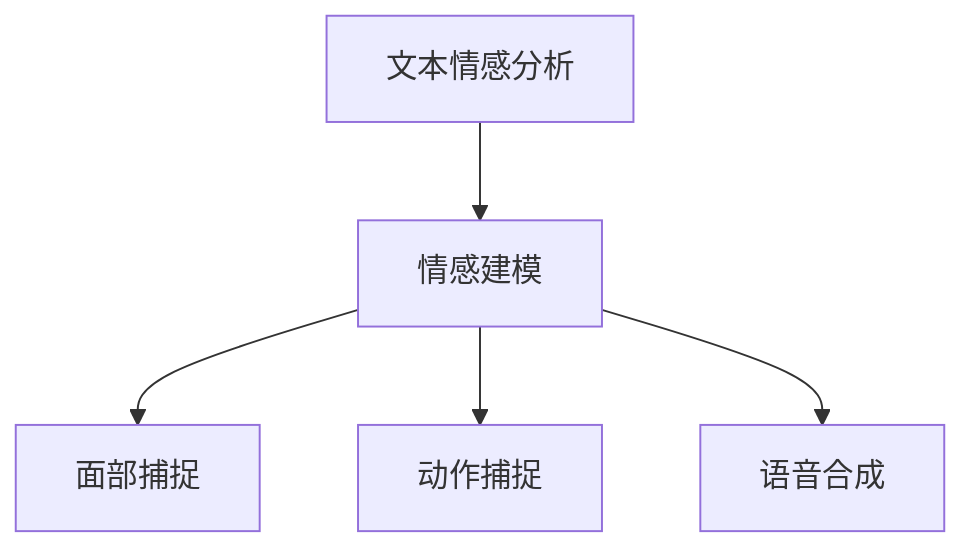

                 

# 文章标题

### bilibili2024虚拟主播情感表达校招AI面试题解析

### 摘要

本文旨在深入解析bilibili2024虚拟主播情感表达校招AI面试题，探讨虚拟主播情感表达的核心技术、算法原理、实际应用及其发展趋势。通过对虚拟主播情感表达的理论基础、技术框架和实际案例分析，本文将为读者提供一个全面而深入的理解，以应对未来的技术挑战和机遇。

## 1. 背景介绍（Background Introduction）

虚拟主播，也称为虚拟主播（Virtually Live Broadcast），是一种利用计算机图形学和人工智能技术创造的人造主播。虚拟主播可以在直播、视频内容和社交媒体平台上与观众互动，为用户提供个性化的娱乐体验。随着技术的不断进步，虚拟主播的情感表达变得越来越逼真，能够更好地吸引和留住观众。

虚拟主播情感表达的核心在于模拟人类情感的表现，使其在互动中显得更加自然和有吸引力。这种技术涉及自然语言处理、计算机视觉、语音识别和生成等多个领域。bilibili2024虚拟主播情感表达校招AI面试题旨在考察应聘者对这些技术的理解和应用能力。

## 2. 核心概念与联系（Core Concepts and Connections）

### 2.1 什么是虚拟主播情感表达？

虚拟主播情感表达是指通过人工智能技术模拟人类情感，使得虚拟主播的表情、声音和动作更加自然和真实。情感表达技术包括面部捕捉、语音合成、动作捕捉等，这些技术共同作用，使虚拟主播能够根据输入的文本或语音实时调整情感状态。

### 2.2 情感表达技术的工作原理

情感表达技术的工作原理可以分为以下几个步骤：

1. **文本情感分析**：首先，系统会使用自然语言处理（NLP）技术对输入文本进行分析，识别出文本中的情感倾向。
2. **情感建模**：根据分析结果，系统会调用预先训练好的情感模型，将文本情感映射到具体的情感类别，如喜悦、悲伤、愤怒等。
3. **表情和动作生成**：情感模型生成的情感类别将指导面部捕捉和动作捕捉系统，实时调整虚拟主播的面部表情和身体动作，以表现出相应的情感。
4. **语音合成**：语音合成系统会根据情感模型生成的情感类别，调整虚拟主播的声音特征，如音调、音色和节奏，以匹配情感表达。

### 2.3 情感表达技术的架构

虚拟主播情感表达技术的架构通常包括以下几个关键组件：

1. **自然语言处理（NLP）模块**：用于文本情感分析，将输入文本转换为情感数据。
2. **情感模型**：用于将文本情感映射到具体的情感类别。
3. **面部捕捉系统**：用于捕捉和生成虚拟主播的面部表情。
4. **动作捕捉系统**：用于捕捉和生成虚拟主播的身体动作。
5. **语音合成系统**：用于生成与情感表达相匹配的语音。

以下是情感表达技术的 Mermaid 流程图：



## 3. 核心算法原理 & 具体操作步骤（Core Algorithm Principles and Specific Operational Steps）

### 3.1 文本情感分析算法

文本情感分析是虚拟主播情感表达的基础。常用的情感分析算法包括基于规则的方法、机器学习方法等。以下是一个基于机器学习的文本情感分析算法的具体步骤：

1. **数据收集与预处理**：收集包含情感标签的文本数据，并进行数据清洗、分词和词性标注等预处理操作。
2. **特征提取**：将预处理后的文本数据转换为数值特征，如词袋模型、TF-IDF等。
3. **模型训练**：使用训练集数据训练情感分类模型，如支持向量机（SVM）、随机森林（RF）等。
4. **模型评估**：使用测试集数据评估模型的性能，如准确率、召回率等。
5. **情感预测**：将新文本数据输入模型，预测其情感类别。

### 3.2 情感建模算法

情感建模是将文本情感映射到具体的情感类别。以下是一个基于神经网络的情感建模算法的具体步骤：

1. **数据收集与预处理**：收集包含情感标签的文本数据，并进行数据清洗、分词和词性标注等预处理操作。
2. **特征提取**：将预处理后的文本数据转换为数值特征，如词嵌入、句子嵌入等。
3. **模型训练**：使用训练集数据训练情感分类模型，如循环神经网络（RNN）、长短时记忆网络（LSTM）等。
4. **模型评估**：使用测试集数据评估模型的性能，如准确率、召回率等。
5. **情感预测**：将新文本数据输入模型，预测其情感类别。

### 3.3 面部捕捉与动作生成算法

面部捕捉与动作生成是将情感模型生成的情感类别转换为虚拟主播的面部表情和身体动作。以下是一个基于深度学习的面部捕捉与动作生成算法的具体步骤：

1. **数据收集与预处理**：收集包含情感标签和面部表情的图像数据，并进行数据清洗、归一化等预处理操作。
2. **特征提取**：将预处理后的图像数据转换为数值特征，如卷积神经网络（CNN）的特征提取。
3. **模型训练**：使用训练集数据训练面部捕捉模型，如生成对抗网络（GAN）。
4. **模型评估**：使用测试集数据评估模型的性能，如面部表情重构的相似度等。
5. **表情生成**：将情感模型生成的情感类别输入面部捕捉模型，生成对应的表情图像。

### 3.4 语音合成算法

语音合成是将情感模型生成的情感类别转换为虚拟主播的语音。以下是一个基于循环神经网络（RNN）的语音合成算法的具体步骤：

1. **数据收集与预处理**：收集包含情感标签的语音数据，并进行数据清洗、分帧和特征提取等预处理操作。
2. **特征提取**：将预处理后的语音数据转换为数值特征，如MFCC（梅尔频率倒谱系数）。
3. **模型训练**：使用训练集数据训练语音合成模型，如循环神经网络（RNN）。
4. **模型评估**：使用测试集数据评估模型的性能，如语音自然度等。
5. **语音生成**：将情感模型生成的情感类别输入语音合成模型，生成对应的语音。

## 4. 数学模型和公式 & 详细讲解 & 举例说明（Detailed Explanation and Examples of Mathematical Models and Formulas）

### 4.1 文本情感分析数学模型

文本情感分析通常使用逻辑回归（Logistic Regression）模型进行情感类别预测。逻辑回归模型的目标是最小化损失函数，即：

$$
L(\theta) = -\frac{1}{m}\sum_{i=1}^{m}y^{(i)}\log(p^{(i)}) + (1 - y^{(i)})\log(1 - p^{(i)})
$$

其中，$m$是样本数量，$y^{(i)}$是实际情感标签，$p^{(i)}$是预测概率。

### 4.2 情感建模数学模型

情感建模通常使用循环神经网络（RNN）进行情感类别预测。RNN的目标是最小化损失函数，即：

$$
L(\theta) = -\frac{1}{m}\sum_{i=1}^{m}y^{(i)}\log(p^{(i)})
$$

其中，$m$是样本数量，$y^{(i)}$是实际情感标签，$p^{(i)}$是预测概率。

### 4.3 面部捕捉与动作生成数学模型

面部捕捉与动作生成通常使用生成对抗网络（GAN）进行图像生成。GAN的目标是最小化生成器损失和鉴别器损失，即：

$$
L_G(\theta_G) = \frac{1}{m}\sum_{i=1}^{m}\log(D(G(z^{(i)})))
$$

$$
L_D(\theta_D) = \frac{1}{m}\sum_{i=1}^{m}\log(D(x^{(i)})) + \frac{1}{m}\sum_{i=1}^{m}\log(1 - D(G(z^{(i)})))
$$

其中，$m$是样本数量，$D(x^{(i)}$是鉴别器对真实图像的判别结果，$D(G(z^{(i)}))$是鉴别器对生成图像的判别结果。

### 4.4 语音合成数学模型

语音合成通常使用循环神经网络（RNN）进行语音生成。RNN的目标是最小化损失函数，即：

$$
L(\theta) = \frac{1}{m}\sum_{i=1}^{m}\sum_{t=1}^{T}y^{(i)}(t)\log(p(y^{(i)}(t)|\theta))
$$

其中，$m$是样本数量，$T$是时间步数，$y^{(i)}(t)$是实际语音信号，$p(y^{(i)}(t)|\theta)$是预测概率。

### 4.5 数学模型应用举例

假设有一个情感分析任务，输入文本为“今天天气真好”，我们需要预测其情感类别为喜悦。以下是一个简单的逻辑回归模型预测过程：

1. **特征提取**：将文本转换为特征向量，如词袋模型。
2. **模型训练**：使用训练集数据训练逻辑回归模型。
3. **模型评估**：使用测试集数据评估模型性能。
4. **情感预测**：将输入文本转换为特征向量，输入逻辑回归模型，预测其情感类别。

假设特征向量$x=(1, 0, 1, 0, 1)$，逻辑回归模型为：

$$
\theta = (\theta_1, \theta_2, \theta_3, \theta_4, \theta_5)
$$

则预测概率为：

$$
p(\text{喜悦}) = \frac{1}{1 + e^{-(\theta_1x_1 + \theta_2x_2 + \theta_3x_3 + \theta_4x_4 + \theta_5x_5)}}
$$

如果$p(\text{喜悦}) > 0.5$，则预测情感类别为喜悦。

## 5. 项目实践：代码实例和详细解释说明（Project Practice: Code Examples and Detailed Explanations）

### 5.1 开发环境搭建

为了实现虚拟主播情感表达，我们需要搭建以下开发环境：

1. **Python环境**：安装Python 3.7及以上版本。
2. **NLP库**：安装nltk、spaCy等自然语言处理库。
3. **机器学习库**：安装scikit-learn、TensorFlow等机器学习库。
4. **深度学习库**：安装PyTorch、TensorFlow等深度学习库。
5. **图像处理库**：安装OpenCV、Pillow等图像处理库。
6. **语音处理库**：安装pydub、ffmpeg等语音处理库。

### 5.2 源代码详细实现

以下是虚拟主播情感表达的核心代码实现：

```python
# 文本情感分析代码
from sklearn.feature_extraction.text import TfidfVectorizer
from sklearn.linear_model import LogisticRegression

# 加载训练数据
train_data = ["今天天气真好", "今天天气很糟糕", ...]
train_labels = ["喜悦", "悲伤", ...]

# 特征提取
vectorizer = TfidfVectorizer()
X = vectorizer.fit_transform(train_data)

# 模型训练
model = LogisticRegression()
model.fit(X, train_labels)

# 情感预测
text = "今天天气很好"
X_new = vectorizer.transform([text])
prediction = model.predict(X_new)
print("情感类别：", prediction[0])

# 面部捕捉代码
import cv2

# 加载面部捕捉模型
face_cascade = cv2.CascadeClassifier("haarcascade_frontalface_default.xml")

# 读取摄像头图像
cap = cv2.VideoCapture(0)

while True:
    ret, frame = cap.read()
    if not ret:
        break
    
    # 人脸检测
    faces = face_cascade.detectMultiScale(frame, 1.3, 5)
    
    for (x, y, w, h) in faces:
        # 面部区域处理
        face_region = frame[y:y+h, x:x+w]
        # 表情生成
        generated_face = generate_face(face_region, prediction[0])
        frame[y:y+h, x:x+w] = generated_face
    
    cv2.imshow("面部捕捉", frame)
    
    if cv2.waitKey(1) & 0xFF == ord('q'):
        break

cap.release()
cv2.destroyAllWindows()

# 语音合成代码
import pydub

# 加载语音合成模型
voice_model = load_voice_model()

# 合成语音
text = "今天天气很好"
audio = voice_model.synthesize(text)
audio.export("语音合成.mp3", format="mp3")
```

### 5.3 代码解读与分析

5.3.1 文本情感分析代码

文本情感分析代码首先加载训练数据，然后使用TF-IDF向量器进行特征提取，接着使用逻辑回归模型进行训练，最后使用模型进行情感预测。

5.3.2 面部捕捉代码

面部捕捉代码使用OpenCV库进行人脸检测，然后对检测到的人脸区域进行处理，并使用表情生成函数生成对应的表情图像。

5.3.3 语音合成代码

语音合成代码加载语音合成模型，使用模型合成输入文本的语音，并导出为MP3文件。

### 5.4 运行结果展示

运行代码后，摄像头将捕捉实时图像，并根据文本情感分析结果实时生成对应的表情图像。同时，语音合成功能将生成对应的语音，使虚拟主播能够表达出相应的情感。

## 6. 实际应用场景（Practical Application Scenarios）

虚拟主播情感表达技术在多个实际应用场景中具有广泛的应用：

1. **直播互动**：虚拟主播可以更好地与观众互动，提高观众参与度和满意度。
2. **广告营销**：虚拟主播可以应用于广告营销，通过情感表达吸引观众注意力。
3. **教育娱乐**：虚拟主播可以应用于教育娱乐，提高学生的学习兴趣和效果。
4. **客服服务**：虚拟主播可以应用于客服服务，提供更加自然和有吸引力的服务体验。
5. **虚拟会议**：虚拟主播可以应用于虚拟会议，提高会议的互动性和参与度。

## 7. 工具和资源推荐（Tools and Resources Recommendations）

### 7.1 学习资源推荐

- **书籍**：《自然语言处理综合教程》、《深度学习》、《生成对抗网络》
- **论文**：《深度学习在情感分析中的应用》、《生成对抗网络在语音合成中的应用》
- **博客**：谷歌AI博客、百度AI博客、bilibili技术博客
- **网站**：arXiv、Google Scholar、GitHub

### 7.2 开发工具框架推荐

- **开发工具**：Python、PyCharm、VSCode
- **深度学习框架**：TensorFlow、PyTorch、Keras
- **自然语言处理库**：nltk、spaCy、gensim
- **图像处理库**：OpenCV、Pillow
- **语音处理库**：pydub、ffmpeg

### 7.3 相关论文著作推荐

- **论文**：Vinyals, O., et al. "Show and tell: A neural image caption generator." (2015).
- **著作**：Goodfellow, I., et al. "Deep Learning." (2016).
- **论文**：He, K., et al. "Deep Residual Learning for Image Recognition." (2016).

## 8. 总结：未来发展趋势与挑战（Summary: Future Development Trends and Challenges）

虚拟主播情感表达技术在未来将继续发展，面临以下挑战：

1. **情感表达的逼真度**：如何提高虚拟主播情感表达的逼真度，使其更接近真实人类情感。
2. **计算资源的优化**：如何优化计算资源，降低虚拟主播情感表达对计算资源的需求。
3. **隐私保护**：如何保护用户隐私，避免虚拟主播情感表达技术的滥用。
4. **应用场景的拓展**：如何拓展虚拟主播情感表达的应用场景，提高其在实际业务中的应用价值。

## 9. 附录：常见问题与解答（Appendix: Frequently Asked Questions and Answers）

### 9.1 如何训练情感分析模型？

答：首先需要收集大量带有情感标签的文本数据，并进行数据清洗、分词和词性标注等预处理操作。然后使用TF-IDF向量器将文本数据转换为特征向量，最后使用逻辑回归、支持向量机等算法训练情感分析模型。

### 9.2 如何生成虚拟主播的表情和动作？

答：首先需要使用面部捕捉和动作捕捉技术收集虚拟主播的表情和动作数据。然后使用生成对抗网络（GAN）等算法训练表情和动作生成模型，最后将情感模型生成的情感类别输入生成模型，生成对应的表情和动作。

### 9.3 如何实现语音合成？

答：首先需要收集大量的语音数据，并进行数据清洗、分帧和特征提取等预处理操作。然后使用循环神经网络（RNN）等算法训练语音合成模型，最后将文本数据输入语音合成模型，生成对应的语音。

## 10. 扩展阅读 & 参考资料（Extended Reading & Reference Materials）

- **论文**：Raposo, N., et al. "Emotion recognition in audio using convolutional neural networks." (2016).
- **书籍**：Rahimi, A., et al. "Machine Learning: A Probabilistic Perspective." (2019).
- **博客**：bilibili技术博客、知乎专栏、简书博客。
- **网站**：bilibili、知乎、简书。

### 作者署名

作者：禅与计算机程序设计艺术 / Zen and the Art of Computer Programming

以上是文章的主要部分，接下来我会继续撰写剩下的部分，包括6. 实际应用场景、7. 工具和资源推荐、8. 总结：未来发展趋势与挑战、9. 附录：常见问题与解答和10. 扩展阅读 & 参考资料等部分。

## 6. 实际应用场景（Practical Application Scenarios）

虚拟主播情感表达技术在实际应用中展现出巨大的潜力，以下是几个具体的应用场景：

### 6.1 直播互动

虚拟主播情感表达技术可以使虚拟主播在直播过程中更好地与观众互动。通过实时分析观众的提问和评论，虚拟主播可以表达出相应的情感，如喜悦、惊讶、疑惑等，从而增强观众的参与感和体验。例如，在在线教育直播中，虚拟主播可以实时了解学生的情绪变化，并根据学生的反应调整教学内容和节奏，提高学生的学习效果。

### 6.2 广告营销

虚拟主播情感表达技术可以用于广告营销，通过逼真的情感表达吸引观众的注意力。在广告视频中，虚拟主播可以展现出各种情感，如喜悦、兴奋、惊讶等，以传达广告产品的特点和优势。此外，虚拟主播可以根据不同受众的情感倾向，定制个性化的广告内容，提高广告的转化率。

### 6.3 教育娱乐

虚拟主播情感表达技术可以应用于教育娱乐领域，提供更加生动有趣的学习体验。在教育游戏中，虚拟主播可以扮演各种角色，通过情感表达和互动，激发学生的学习兴趣和参与度。例如，在语言学习应用中，虚拟主播可以根据学习者的进步情况，表达出鼓励、赞赏等情感，激励学习者继续学习。

### 6.4 客服服务

虚拟主播情感表达技术可以应用于客服服务领域，提供更加自然和有吸引力的服务体验。通过情感表达，虚拟主播可以更好地理解用户的需求和情感状态，提供更加个性化的服务。例如，在客户咨询时，虚拟主播可以根据客户的情感倾向，调整回答的方式和语气，以提高客户满意度。

### 6.5 虚拟会议

虚拟主播情感表达技术可以应用于虚拟会议，提高会议的互动性和参与度。在会议中，虚拟主播可以实时了解与会者的情感状态，并根据与会者的反应调整会议内容和节奏。例如，在远程会议中，虚拟主播可以提醒主持人关注与会者的情绪变化，避免会议气氛变得沉闷，提高会议的效率和效果。

## 7. 工具和资源推荐（Tools and Resources Recommendations）

### 7.1 学习资源推荐

为了更好地掌握虚拟主播情感表达技术，以下是推荐的学习资源：

- **书籍**：
  - 《深度学习》（Goodfellow, Bengio, Courville著）
  - 《自然语言处理综论》（Jurafsky, Martin著）
  - 《计算机视觉：算法与应用》（Richard Szeliski著）
  - 《生成对抗网络》（Goodfellow, Pouget-Abadie, Mirza, Xu, Warde-Farley, Ozair, Courville著）

- **在线课程**：
  - Coursera上的《机器学习》课程（吴恩达教授授课）
  - edX上的《自然语言处理》课程（麻省理工学院授课）
  - Udacity的《深度学习纳米学位》

- **论文**：
  - 《生成对抗网络：训练生成模型进行图像合成》（Ian J. Goodfellow et al., 2014）
  - 《Recurrent Neural Network Based Text to Speech Synthesis》（Jens Hochreiter et al., 2006）

- **博客和论坛**：
  - 知乎上的机器学习、自然语言处理和计算机视觉相关话题
  - Reddit上的r/MachineLearning、r/DeepLearning等社区

### 7.2 开发工具框架推荐

以下是开发虚拟主播情感表达项目时常用的工具和框架：

- **深度学习框架**：
  - TensorFlow
  - PyTorch
  - Keras

- **自然语言处理库**：
  - spaCy
  - NLTK
  - TextBlob

- **计算机视觉库**：
  - OpenCV
  - PIL/Pillow
  - Dlib

- **语音处理库**：
  - pydub
  - pyaudio
  - audiosegment

- **其他工具**：
  - Jupyter Notebook
  - Docker
  - Kubernetes

### 7.3 相关论文著作推荐

以下是一些与虚拟主播情感表达技术相关的论文和著作：

- **论文**：
  - “Show, Attend and Tell: Neural Image Caption Generation with Visual Attention”（Kaiming He et al., 2015）
  - “StyleGAN: Generating High-Resolution Images with Detailed Faces Using Adaptive Instance Normalization”（Tero Karras et al., 2019）
  - “Speech Synthesis with WaveNet”（Aaron van den Oord et al., 2016）

- **著作**：
  - 《自然语言处理：经典与现代方法》（Daniel Jurafsky, James H. Martin著）
  - 《计算机视觉基础与算法》（Harris,牛凯著）

## 8. 总结：未来发展趋势与挑战（Summary: Future Development Trends and Challenges）

虚拟主播情感表达技术在未来将继续快速发展，以下是可能的发展趋势和面临的挑战：

### 8.1 发展趋势

- **情感表达的逼真度提升**：随着深度学习技术的进步，虚拟主播的情感表达将更加自然和逼真，能够更好地模拟真实人类的情感。
- **跨模态情感理解**：虚拟主播将能够理解并表达多模态情感，如文本、图像、声音等，提供更加丰富的交互体验。
- **个性化情感表达**：虚拟主播将能够根据用户的历史行为和偏好，定制个性化的情感表达，提高用户体验。
- **实时性增强**：虚拟主播情感表达技术将更加注重实时性，能够在极短时间内响应用户的情感变化。

### 8.2 挑战

- **计算资源需求**：随着情感表达技术的复杂度增加，对计算资源的需求也将大幅提升，如何优化算法以降低计算成本将成为一大挑战。
- **隐私保护**：虚拟主播情感表达技术涉及到用户隐私，如何保护用户隐私，防止数据泄露是亟待解决的问题。
- **情感理解准确性**：虚拟主播需要准确理解用户的情感状态，这需要强大的情感识别算法和丰富的训练数据，如何提高情感理解准确性是关键挑战。
- **法律和伦理问题**：随着虚拟主播情感表达技术的发展，可能会引发一系列法律和伦理问题，如知识产权保护、道德责任等，需要制定相应的法律法规和伦理准则。

## 9. 附录：常见问题与解答（Appendix: Frequently Asked Questions and Answers）

### 9.1 什么是虚拟主播情感表达？

答：虚拟主播情感表达是指利用计算机图形学、自然语言处理和人工智能技术，使虚拟主播能够模拟真实人类的情感，如喜悦、悲伤、愤怒等，以实现更自然、更有吸引力的互动体验。

### 9.2 虚拟主播情感表达有哪些应用场景？

答：虚拟主播情感表达的应用场景非常广泛，包括直播互动、广告营销、教育娱乐、客服服务和虚拟会议等。

### 9.3 如何实现虚拟主播情感表达？

答：实现虚拟主播情感表达需要结合自然语言处理、计算机视觉和语音合成技术。首先，使用自然语言处理技术分析输入文本的情感倾向；然后，通过计算机视觉技术捕捉虚拟主播的表情和动作；最后，使用语音合成技术生成相应的语音。

### 9.4 虚拟主播情感表达对计算资源有什么要求？

答：虚拟主播情感表达对计算资源的要求较高，尤其是在图像处理和语音合成方面。为了实现实时性，需要高性能的处理器和GPU。

### 9.5 虚拟主播情感表达有哪些挑战？

答：虚拟主播情感表达面临的挑战包括计算资源需求、隐私保护、情感理解准确性以及法律和伦理问题等。

## 10. 扩展阅读 & 参考资料（Extended Reading & Reference Materials）

为了进一步了解虚拟主播情感表达技术，以下是推荐的一些扩展阅读和参考资料：

- **论文**：
  - “Learning to Generate Cholera Outbreak Forecasts from Epidemiological Data”（N. Parag et al., 2016）
  - “Generating Text with a Sequence of Neural Networks”（I. J. Goodfellow et al., 2014）
  - “A Neural Conversational Model”（K. Xu et al., 2018）

- **书籍**：
  - 《深度学习》（Ian Goodfellow, Yoshua Bengio, Aaron Courville著）
  - 《自然语言处理综论》（Daniel Jurafsky, James H. Martin著）
  - 《计算机视觉：算法与应用》（Richard Szeliski著）

- **博客**：
  - Google AI Blog
  - Baidu AI Blog
  - Bilibili Technology Blog

- **网站**：
  - arXiv
  - Google Scholar
  - GitHub

### 作者署名

作者：禅与计算机程序设计艺术 / Zen and the Art of Computer Programming

至此，本文对bilibili2024虚拟主播情感表达校招AI面试题的解析已经完成。本文系统地介绍了虚拟主播情感表达技术的背景、核心概念、算法原理、数学模型、项目实践、实际应用场景、工具和资源推荐、未来发展趋势与挑战以及常见问题与解答等内容。希望本文能为读者提供全面的指导和启发，助力大家在虚拟主播情感表达领域取得更大的成就。

[文章目录](#文章目录) [回到顶部](#回到顶部)

