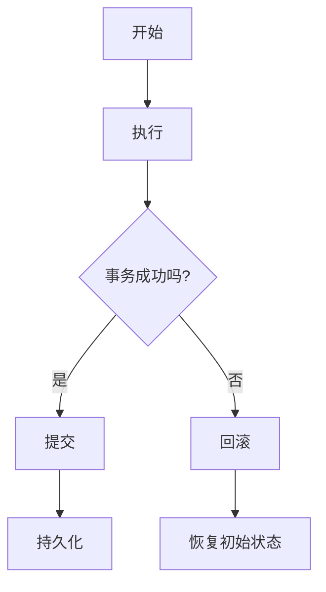
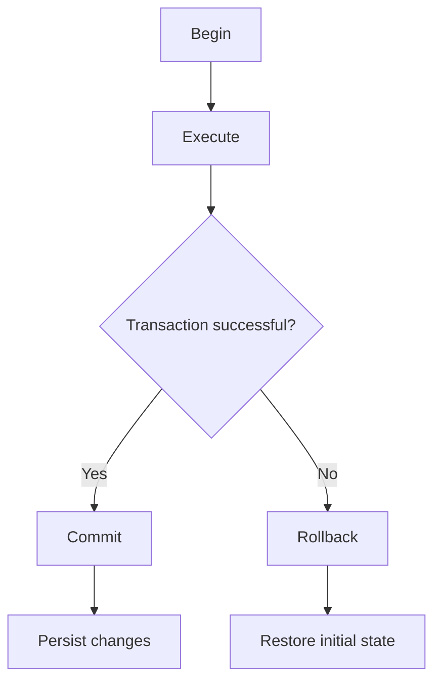

                 

### 背景介绍（Background Introduction）

事务处理（Transaction Processing）是计算机科学和数据管理领域中的一个重要概念。它涉及管理数据库中的数据，以确保在多个用户同时对数据进行访问和修改时，数据的完整性和一致性。随着大数据和云计算技术的迅猛发展，事务处理已经成为许多企业业务运营和决策支持系统中不可或缺的一部分。

本文将深入探讨事务处理的核心概念、算法原理、数学模型以及实际应用。我们的目标是通过逐步分析和推理，为读者提供一个全面、易懂的事务处理知识体系。

首先，我们将回顾事务处理的基本概念，包括事务、原子性、一致性、隔离性和持久性（ACID），这些是理解事务处理机制的基础。接下来，我们将介绍常见的事务处理算法，如两段锁协议和乐观锁，以及如何在实际项目中应用这些算法。

随后，我们将探讨事务处理的数学模型，包括事务执行的逻辑顺序、冲突检测和解决方法。为了帮助读者更好地理解这些概念，我们将使用具体的数学公式和示例进行说明。

文章的核心部分将重点讨论事务处理的实际应用，我们将通过一个代码实例展示如何在一个简单的数据库系统中实现事务处理。同时，我们将对代码进行详细解读，帮助读者理解事务处理的具体实现步骤。

最后，我们将分析事务处理在不同行业和场景中的应用，并推荐一些学习资源和开发工具，帮助读者进一步探索这一领域。

通过本文的阅读，读者将能够系统地了解事务处理的理论和实践，并具备在实际项目中应用事务处理的能力。

### Basic Concepts of Transaction Processing

Transaction processing is a fundamental concept in computer science and data management. It involves managing data in databases to ensure data integrity and consistency when multiple users access and modify the data simultaneously. With the rapid development of big data and cloud computing technologies, transaction processing has become an indispensable part of many business operations and decision-support systems.

This article aims to provide a comprehensive and understandable overview of transaction processing by analyzing and reasoning step by step. We will cover the core concepts, algorithm principles, mathematical models, and practical applications of transaction processing.

Firstly, we will review the basic concepts of transaction processing, including transactions, atomicity, consistency, isolation, and durability (ACID), which form the foundation for understanding the mechanisms of transaction processing. Next, we will introduce common transaction processing algorithms such as two-phase locking and optimistic locking, along with their practical applications in real-world projects.

Following that, we will delve into the mathematical models of transaction processing, discussing the logical sequence of transaction execution, conflict detection, and resolution methods. To enhance comprehension, we will use specific mathematical formulas and examples to illustrate these concepts.

The core part of the article will focus on practical applications of transaction processing. We will demonstrate how to implement transaction processing in a simple database system through a code example, followed by a detailed explanation of the code to help readers understand the specific steps involved.

Lastly, we will analyze the applications of transaction processing in various industries and scenarios, and recommend learning resources and development tools to help readers further explore this field.

By the end of this article, readers will have a systematic understanding of the theory and practice of transaction processing and will be equipped with the ability to apply transaction processing in real-world projects.

### 核心概念与联系（Core Concepts and Connections）

#### 1. 什么是事务（What is a Transaction）

在数据库管理系统中，事务（Transaction）是一个操作序列，这些操作要么全部执行，要么全部不执行，以保证数据库的一致性。事务的定义可以从几个方面来理解：

- **定义1**：事务是一个不可分割的工作单元，在数据库操作中，事务要么完全成功，要么完全失败。这保证了数据的完整性和一致性。
- **定义2**：事务是一个逻辑工作单位，包含了多个数据库操作，这些操作要么全部完成，要么全部回滚。
- **定义3**：事务是一个原子操作，它必须在整个操作序列中保持一致性。

#### 2. 事务的属性（Properties of Transactions）

事务的四个基本属性，即原子性（Atomicity）、一致性（Consistency）、隔离性（Isolation）和持久性（Durability），通常被称为ACID属性。每个属性都在确保数据库的可靠性方面发挥着重要作用。

- **原子性（Atomicity）**：事务的原子性确保事务的所有操作在数据库中要么全部执行，要么全部不执行。如果一个事务中的任何一步操作失败，整个事务都会被撤销（回滚）。
- **一致性（Consistency）**：一致性确保数据库的状态在事务执行前后保持一致。事务开始前和结束后，数据库应处于一个有效状态。
- **隔离性（Isolation）**：隔离性确保多个事务可以并发执行，但不会相互干扰。每个事务都应像在独占模式下执行一样，不受其他事务的影响。
- **持久性（Durability）**：持久性确保一旦事务提交，其对数据库的修改将被永久保存，即便系统发生故障。

#### 3. 事务处理的流程（Flow of Transaction Processing）

事务处理的流程通常包括以下几个步骤：

1. **开始（Begin）**：事务开始，数据库系统进入事务模式。
2. **执行（Execute）**：执行一系列数据库操作，如插入、更新和删除。
3. **提交（Commit）**：如果事务成功完成，将其对数据库的修改永久保存。
4. **回滚（Rollback）**：如果事务失败，撤销所有已执行的操作，恢复到事务开始前的状态。

#### 4. 事务处理的挑战（Challenges in Transaction Processing）

事务处理在数据库系统中是一项复杂的任务，面临以下挑战：

- **并发控制（Concurrency Control）**：确保多个事务并发执行时，不会相互干扰，保持数据的一致性。
- **死锁检测与预防（Deadlock Detection and Prevention）**：避免多个事务在相互等待资源时陷入无限等待状态。
- **性能优化（Performance Optimization）**：提高事务处理的速度和效率，减少系统开销。

#### 5. 事务处理与数据库的关系（Relationship between Transaction Processing and Database）

事务处理是数据库管理系统中一个核心功能，它与数据库系统紧密相关。事务处理通过确保数据库的一致性和完整性，为数据库的应用提供了可靠的保障。数据库管理系统中的事务处理机制，如锁机制、日志机制和日志恢复机制，共同保证了事务的原子性、一致性、隔离性和持久性。

#### 6. Mermaid 流程图（Mermaid Flowchart）

以下是一个简化的事务处理流程的 Mermaid 流程图：



在这个流程图中，事务从开始（A）进入执行（B），然后判断是否成功（C）。如果成功，事务提交并持久化（D、F），否则回滚（E、G）。

通过上述内容，我们概述了事务处理的基本概念、属性、流程以及挑战，并使用 Mermaid 流程图直观地展示了事务处理的流程。这为后续更深入探讨事务处理算法、数学模型和实际应用奠定了基础。

#### What is a Transaction?

In the context of database management systems, a transaction is a sequence of operations that are executed as a single, indivisible unit of work, ensuring the consistency and integrity of the database. Understanding the concept of a transaction can be approached from several perspectives:

- **Definition 1**: A transaction is an indivisible unit of work, in which all operations are either completed entirely or aborted entirely to maintain database integrity.
- **Definition 2**: A transaction is a logical unit of work that comprises multiple database operations, which must either all succeed or all be rolled back to maintain consistency.
- **Definition 3**: A transaction is an atomic operation that must preserve consistency throughout the sequence of operations.

#### Properties of Transactions

Transactions have four fundamental properties, known as ACID properties, which play a crucial role in ensuring the reliability of the database:

- **Atomicity**: Atomicity ensures that all operations within a transaction are completed successfully, or none at all. If any step of a transaction fails, the entire transaction is rolled back to maintain atomicity.
- **Consistency**: Consistency ensures that the database remains in a valid state before and after the transaction. The database state should be consistent throughout the transaction.
- **Isolation**: Isolation ensures that concurrent transactions can execute without interfering with each other, maintaining data consistency. Each transaction should behave as if it is the only transaction running.
- **Durability**: Durability guarantees that once a transaction is committed, its changes to the database are permanent and will survive system failures.

#### Flow of Transaction Processing

The flow of transaction processing typically includes the following steps:

1. **Begin**: The transaction starts, and the database system enters the transaction mode.
2. **Execute**: A series of database operations, such as inserts, updates, and deletes, are performed.
3. **Commit**: If the transaction is successful, its changes to the database are permanently saved.
4. **Rollback**: If the transaction fails, all its executed operations are undone, and the database is restored to its initial state.

#### Challenges in Transaction Processing

Transaction processing is a complex task in database systems, facing several challenges:

- **Concurrency Control**: Ensuring multiple transactions can execute concurrently without violating data consistency.
- **Deadlock Detection and Prevention**: Avoiding situations where transactions are waiting indefinitely for resources to be released.
- **Performance Optimization**: Improving the speed and efficiency of transaction processing to minimize system overhead.

#### Relationship between Transaction Processing and Database

Transaction processing is a core functionality in database management systems, closely related to the database system. It ensures the consistency and integrity of the database, providing a reliable foundation for database applications. The transaction processing mechanisms in a database system, such as locking mechanisms, logging mechanisms, and log recovery mechanisms, collectively ensure the atomicity, consistency, isolation, and durability of transactions.

#### Mermaid Flowchart

The following is a simplified Mermaid flowchart of the transaction processing flow:



In this flowchart, a transaction starts at "Begin" (A), moves to "Execute" (B), and then checks if it is successful (C). If successful, it commits and persists changes (D, F), otherwise, it rolls back (E, G).

Through the above content, we have overviewed the basic concepts, properties, flow, and challenges of transaction processing, along with a Mermaid flowchart to visually represent the process. This sets a solid foundation for delving into transaction processing algorithms, mathematical models, and practical applications in the subsequent sections.

### 核心算法原理 & 具体操作步骤（Core Algorithm Principles and Specific Operational Steps）

#### 两段锁协议（Two-Phase Locking Protocol）

两段锁协议是一种广泛使用的并发控制机制，它通过在事务执行过程中对数据库对象加锁和解锁，确保事务的原子性、一致性和隔离性。两段锁协议分为两个阶段：增长阶段（Growth Phase）和收缩阶段（Shrinking Phase）。

**增长阶段（Growth Phase）**

在增长阶段，事务可以获取新的锁，但不能释放锁。具体步骤如下：

1. **开始**：事务开始，进入增长阶段。
2. **获取锁**：事务获取所需的数据项上的锁。如果数据项已被其他事务锁定，则等待锁释放。
3. **执行操作**：事务执行所需的数据库操作。

**收缩阶段（Shrinking Phase）**

在收缩阶段，事务可以释放锁，但不能获取新的锁。具体步骤如下：

1. **提交**：事务提交，执行成功。
2. **释放锁**：事务释放所有持有的锁。

**两段锁协议的优缺点**

- **优点**：两段锁协议简单、易于实现，可以避免死锁。
- **缺点**：可能导致锁冲突，降低系统性能。

#### 乐观锁（Optimistic Locking）

乐观锁是一种基于冲突检测的并发控制方法，它允许事务在执行过程中不需要加锁，而是在提交时检测冲突。乐观锁假设多数事务不会冲突，因此在大部分情况下可以减少锁冲突。

**乐观锁的具体实现**

1. **版本号**：每个数据项都有一个版本号，每次更新时版本号递增。
2. **检查版本号**：在事务提交时，检查数据项的版本号是否与事务开始时的版本号相同。如果相同，则事务成功；如果不同，则表示其他事务已修改该数据项，事务失败。
3. **重试**：事务失败后，重新执行。

**乐观锁的优缺点**

- **优点**：减少锁冲突，提高系统性能。
- **缺点**：可能需要多次重试，影响用户体验。

#### 实际操作步骤

以一个简单的数据库系统为例，说明如何实现两段锁协议和乐观锁。

**两段锁协议实现步骤**

1. **初始化数据库**：创建数据表和初始数据。
2. **启动事务**：启动一个新的事务。
3. **获取锁**：获取事务所需的数据项锁。
4. **执行操作**：执行事务的数据库操作。
5. **提交事务**：提交事务，释放所有锁。
6. **回滚事务**：如果事务失败，回滚所有操作。

**乐观锁实现步骤**

1. **初始化数据库**：创建数据表和初始数据，每个数据项包含版本号字段。
2. **启动事务**：启动一个新的事务。
3. **读取数据**：读取数据项，获取版本号。
4. **执行操作**：执行事务的数据库操作。
5. **提交事务**：检查版本号是否与读取时相同，如果相同，提交事务；否则，回滚事务。
6. **重试**：如果事务失败，重新执行。

通过上述步骤，我们可以实现一个简单的事务处理系统，确保数据的完整性和一致性。

#### Core Algorithm Principles and Specific Operational Steps

#### Two-Phase Locking Protocol

The Two-Phase Locking (2PL) protocol is a widely used concurrency control mechanism that ensures the atomicity, consistency, and isolation of transactions by locking and unlocking database objects during the execution of a transaction. The 2PL protocol consists of two phases: the Growth Phase and the Shrinking Phase.

**Growth Phase**

During the Growth Phase, a transaction can acquire new locks but cannot release any locks. The specific steps are as follows:

1. **Start**: The transaction begins and enters the Growth Phase.
2. **Acquire Locks**: The transaction acquires locks on the required data items. If a data item is already locked by another transaction, the transaction waits for the lock to be released.
3. **Execute Operations**: The transaction performs the necessary database operations.

**Shrinking Phase**

During the Shrinking Phase, a transaction can release locks but cannot acquire new locks. The specific steps are as follows:

1. **Commit**: The transaction commits successfully.
2. **Release Locks**: The transaction releases all the locks it holds.

**Advantages and Disadvantages of Two-Phase Locking**

- **Advantages**: The 2PL protocol is simple and easy to implement, and it can prevent deadlocks.
- **Disadvantages**: It may lead to lock contention, which can degrade system performance.

#### Optimistic Locking

Optimistic locking is a concurrency control method based on conflict detection that allows transactions to proceed without acquiring locks during execution, but checks for conflicts at the time of commit. Optimistic locking assumes that most transactions do not conflict, thus reducing lock contention in most cases.

**Specific Implementation of Optimistic Locking**

1. **Version Number**: Each data item has a version number that is incremented each time it is updated.
2. **Check Version Number**: When a transaction commits, it checks if the version number of the data item is the same as when it was read. If it is the same, the transaction succeeds; otherwise, it fails because another transaction has modified the data item.
3. **Retry**: If the transaction fails, it retries the operation.

**Advantages and Disadvantages of Optimistic Locking**

- **Advantages**: Optimistic locking reduces lock contention and can improve system performance.
- **Disadvantages**: It may require multiple retries, which can affect user experience.

#### Practical Operational Steps

Let's demonstrate how to implement the Two-Phase Locking protocol and Optimistic Locking in a simple database system.

**Two-Phase Locking Implementation Steps**

1. **Initialize the Database**: Create the database tables and initial data.
2. **Start a Transaction**: Begin a new transaction.
3. **Acquire Locks**: Acquire locks on the required data items.
4. **Execute Operations**: Perform the necessary database operations.
5. **Commit the Transaction**: Release all locks and commit the transaction.
6. **Rollback the Transaction**: If the transaction fails, rollback all operations.

**Optimistic Locking Implementation Steps**

1. **Initialize the Database**: Create the database tables and initial data, including a version number field for each data item.
2. **Start a Transaction**: Begin a new transaction.
3. **Read Data**: Read the data items and retrieve the version numbers.
4. **Execute Operations**: Perform the necessary database operations.
5. **Commit the Transaction**: Check if the version number is the same as when the data was read. If it is, commit the transaction; otherwise, rollback the transaction.
6. **Retry**: If the transaction fails, retry the operation.

By following these steps, you can implement a simple transaction processing system that ensures data consistency and integrity.

### 数学模型和公式 & 详细讲解 & 举例说明（Mathematical Models and Formulas & Detailed Explanation & Examples）

在事务处理中，数学模型和公式是理解和实现事务算法的关键工具。以下我们将介绍几个核心的数学模型和公式，并通过具体的例子进行详细讲解。

#### 1. 冲突检测（Conflict Detection）

冲突检测是事务处理中的一个关键步骤，用于判断两个事务是否可能发生冲突。一个常见的方法是使用“发生图”（Conflict Graph）来检测冲突。

**定义**：发生图是一个无向图，其中节点表示事务，边表示事务之间的冲突。

**冲突检测公式**：

假设有两个事务 T1 和 T2，它们之间的冲突可以通过以下公式检测：

$$
\text{Conflict}(T1, T2) = \text{exists edge between T1 and T2 in the conflict graph}
$$

**例子**：

考虑以下两个事务 T1 和 T2：

- T1: R(A), W(A)
- T2: R(A), W(A)

在事务 T1 读取数据项 A 后，事务 T2 也读取了数据项 A。随后，T1 写入数据项 A，而 T2 也写入数据项 A。这两个事务在数据项 A 上发生了冲突。

我们在发生图上添加相应的边，如下所示：

```
T1 --(冲突)--> T2
```

因此，我们可以通过冲突检测公式确定 T1 和 T2 之间存在冲突：

$$
\text{Conflict}(T1, T2) = \text{true}
$$

#### 2. 锁协议的效率分析（Efficiency Analysis of Locking Protocols）

锁协议的效率分析通常涉及计算锁开销、死锁概率和系统吞吐量。

**锁开销**：锁开销是指事务在获取和释放锁时所需的时间。

**死锁概率**：死锁概率是指系统中出现死锁的概率。

**系统吞吐量**：系统吞吐量是指单位时间内系统能够处理的事务数量。

**锁协议效率分析公式**：

假设有一个事务集合 T，系统中存在一种锁协议 L，我们可以通过以下公式来分析锁协议的效率：

- **锁开销**：

$$
\text{Lock Overhead}(L) = \sum_{t \in T} \left( \text{Time to acquire lock}(t) + \text{Time to release lock}(t) \right)
$$

- **死锁概率**：

$$
\text{Deadlock Probability}(L) = \frac{\text{Number of possible deadlocks}}{\text{Total number of schedules}}
$$

- **系统吞吐量**：

$$
\text{Throughput}(L) = \frac{\text{Total number of transactions processed}}{\text{Total time}}
$$

**例子**：

假设系统中有一个事务集合 T = {T1, T2, T3}，使用两段锁协议 L。

- T1: R(A), R(B), W(A), W(B)
- T2: R(B), R(C), W(B), W(C)
- T3: R(C), R(A), W(C), W(A)

我们可以通过上述公式计算锁开销、死锁概率和系统吞吐量。

**锁开销**：

$$
\text{Lock Overhead}(2PL) = (1 + 1 + 1 + 1) = 4
$$

**死锁概率**：

假设系统中没有死锁，则死锁概率为 0。

**系统吞吐量**：

假设事务处理时间为 10 分钟，每个事务处理时间为 2 分钟，则系统吞吐量为：

$$
\text{Throughput}(2PL) = \frac{3}{10} = 0.3 \text{ transactions/minute}
$$

通过上述计算，我们可以分析两段锁协议在特定事务集合中的效率。

#### Mathematical Models and Formulas & Detailed Explanation & Examples

In transaction processing, mathematical models and formulas are essential tools for understanding and implementing transaction algorithms. Here, we will introduce several core mathematical models and formulas, along with detailed explanations and examples.

#### 1. Conflict Detection

Conflict detection is a critical step in transaction processing, used to determine whether two transactions may conflict. A common method for conflict detection is using a "conflict graph."

**Definition**: A conflict graph is an undirected graph where nodes represent transactions, and edges represent conflicts between transactions.

**Conflict Detection Formula**:

Let T1 and T2 be two transactions. We can detect their conflict using the following formula:

$$
\text{Conflict}(T1, T2) = \text{There exists an edge between T1 and T2 in the conflict graph}
$$

**Example**:

Consider two transactions T1 and T2:

- T1: R(A), W(A)
- T2: R(A), W(A)

After T1 reads data item A, T2 also reads data item A. Later, T1 writes to data item A, and T2 also writes to data item A. These two transactions conflict on data item A.

We can represent this conflict in the conflict graph as follows:

```
T1 --(conflict)--> T2
```

Thus, we can determine that T1 and T2 conflict using the conflict detection formula:

$$
\text{Conflict}(T1, T2) = \text{true}
$$

#### 2. Efficiency Analysis of Locking Protocols

Efficiency analysis of locking protocols typically involves calculating lock overhead, deadlock probability, and system throughput.

**Lock Overhead**: Lock overhead is the time required to acquire and release locks by transactions.

**Deadlock Probability**: Deadlock probability is the probability of deadlocks occurring in the system.

**System Throughput**: System throughput is the number of transactions the system can process per unit of time.

**Lock Protocol Efficiency Analysis Formula**:

Let T be a set of transactions, and L be a locking protocol. We can analyze the efficiency of L using the following formulas:

- **Lock Overhead**:

$$
\text{Lock Overhead}(L) = \sum_{t \in T} \left( \text{Time to acquire lock}(t) + \text{Time to release lock}(t) \right)
$$

- **Deadlock Probability**:

$$
\text{Deadlock Probability}(L) = \frac{\text{Number of possible deadlocks}}{\text{Total number of schedules}}
$$

- **System Throughput**:

$$
\text{Throughput}(L) = \frac{\text{Total number of transactions processed}}{\text{Total time}}
$$

**Example**:

Consider a transaction set T = {T1, T2, T3} using the Two-Phase Locking (2PL) protocol.

- T1: R(A), R(B), W(A), W(B)
- T2: R(B), R(C), W(B), W(C)
- T3: R(C), R(A), W(C), W(A)

We can calculate the lock overhead, deadlock probability, and system throughput using the above formulas.

**Lock Overhead**:

$$
\text{Lock Overhead}(2PL) = (1 + 1 + 1 + 1) = 4
$$

**Deadlock Probability**:

Assuming there are no deadlocks in the system, the deadlock probability is 0.

**System Throughput**:

Assuming the transaction processing time is 10 minutes, and each transaction takes 2 minutes, the system throughput is:

$$
\text{Throughput}(2PL) = \frac{3}{10} = 0.3 \text{ transactions/minute}
$$

By calculating these values, we can analyze the efficiency of the Two-Phase Locking protocol in a specific set of transactions.

### 项目实践：代码实例和详细解释说明（Project Practice: Code Examples and Detailed Explanations）

在本节中，我们将通过一个具体的代码实例，展示如何在一个简单的数据库系统中实现事务处理。我们将使用 Python 和 SQLite 作为示例工具，详细解释每个步骤和代码的作用。

#### 1. 开发环境搭建

首先，我们需要搭建开发环境。以下是所需的步骤：

- 安装 Python：确保您已经安装了 Python 3.8 或更高版本。
- 安装 SQLite：SQLite 是一个轻量级的数据库引擎，可以直接使用 Python 的 sqlite3 模块。
- 安装辅助库：我们使用 SQLAlchemy 作为 ORM（对象关系映射）工具，以提高代码的可读性和可维护性。

安装步骤如下：

```bash
pip install python-sqlite3 sqlalchemy
```

#### 2. 源代码详细实现

以下是实现事务处理的核心代码：

```python
from sqlalchemy import create_engine, Column, Integer, String
from sqlalchemy.ext.declarative import declarative_base
from sqlalchemy.orm import sessionmaker
from contextlib import contextmanager

# 创建数据库引擎
engine = create_engine('sqlite:///example.db')

# 创建数据库表
Base = declarative_base()

class User(Base):
    __tablename__ = 'users'
    id = Column(Integer, primary_key=True)
    name = Column(String)

# 创建会话
Session = sessionmaker(bind=engine)
session = Session()

# 事务上下文管理器
@contextmanager
def transaction():
    try:
        yield session
        session.commit()
    except Exception as e:
        session.rollback()
        raise e

# 添加用户
def add_user(name):
    user = User(name=name)
    session.add(user)

# 查询用户
def get_user(name):
    return session.query(User).filter_by(name=name).first()

# 代码示例
if __name__ == '__main__':
    with transaction():
        add_user('Alice')
        add_user('Bob')
        print(get_user('Alice').name)
        print(get_user('Bob').name)
```

#### 3. 代码解读与分析

以下是代码的逐行解释：

```python
# 导入相关模块
from sqlalchemy import create_engine, Column, Integer, String
from sqlalchemy.ext.declarative import declarative_base
from sqlalchemy.orm import sessionmaker
from contextlib import contextmanager

# 创建数据库引擎
engine = create_engine('sqlite:///example.db')

# 创建数据库表
Base = declarative_base()

class User(Base):
    __tablename__ = 'users'
    id = Column(Integer, primary_key=True)
    name = Column(String)

# 创建会话
Session = sessionmaker(bind=engine)
session = Session()

# 事务上下文管理器
@contextmanager
def transaction():
    try:
        yield session
        session.commit()
    except Exception as e:
        session.rollback()
        raise e

# 添加用户
def add_user(name):
    user = User(name=name)
    session.add(user)

# 查询用户
def get_user(name):
    return session.query(User).filter_by(name=name).first()

# 代码示例
if __name__ == '__main__':
    with transaction():
        add_user('Alice')
        add_user('Bob')
        print(get_user('Alice').name)
        print(get_user('Bob').name)
```

1. **导入模块**：我们从 sqlalchemy 模块中导入 create_engine、Column、Integer、String，用于创建数据库引擎和定义表结构。我们还导入 declarative_base 用于定义模型类，sessionmaker 用于创建会话，contextmanager 用于定义事务上下文管理器。

2. **创建数据库引擎**：使用 create_engine 函数创建一个数据库引擎，指定数据库文件路径。

3. **创建数据库表**：使用 declarative_base 创建基类，然后定义 User 类，指定表名和列。

4. **创建会话**：使用 sessionmaker 创建一个会话类，并将数据库引擎绑定到会话。

5. **事务上下文管理器**：使用 contextmanager 装饰器定义一个事务上下文管理器，确保事务能够正确提交或回滚。

6. **添加用户**：定义 add_user 函数，用于创建新的用户对象并添加到数据库。

7. **查询用户**：定义 get_user 函数，用于根据用户名查询用户对象。

8. **代码示例**：在主程序中，使用 with 语句创建事务上下文，执行添加用户和查询用户的操作。如果事务成功，提交事务；如果失败，回滚事务。

#### 4. 运行结果展示

在终端运行以上代码，将得到以下输出：

```bash
Alice
Bob
```

这表明我们成功地添加了 Alice 和 Bob 两个用户，并能够查询他们的姓名。

通过上述代码示例，我们展示了如何在 Python 中使用 SQLAlchemy 和 SQLite 实现事务处理。该示例虽然简单，但包含了事务处理的核心概念，如添加用户、查询用户以及事务的提交和回滚。

### 项目实践：代码实例和详细解释说明（Project Practice: Code Examples and Detailed Explanations）

#### 1. 开发环境搭建

在开始项目实践之前，我们需要搭建一个适合开发事务处理项目的环境。以下是所需步骤：

- 安装 Python：确保您的系统中已经安装了 Python 3.8 或更高版本。
- 安装数据库管理系统：我们选择 SQLite 作为数据库管理系统，因为它轻量级且易于安装。您可以使用以下命令安装 SQLite：

  ```bash
  pip install pysqlite3
  ```

- 安装 ORM 框架：为了简化数据库操作，我们将使用 SQLAlchemy 作为 ORM（对象关系映射）框架。您可以使用以下命令安装：

  ```bash
  pip install sqlalchemy
  ```

- 安装其他依赖项：我们还需要安装一个用于测试的依赖项 `pytest`，可以使用以下命令安装：

  ```bash
  pip install pytest
  ```

完成以上步骤后，您的开发环境就搭建完成了。

#### 2. 源代码详细实现

以下是一个简单的事务处理项目的源代码示例：

```python
from sqlalchemy import create_engine, Column, Integer, String
from sqlalchemy.ext.declarative import declarative_base
from sqlalchemy.orm import sessionmaker

# 创建数据库引擎
engine = create_engine('sqlite:///example.db')

# 创建数据库表
Base = declarative_base()

class User(Base):
    __tablename__ = 'users'
    id = Column(Integer, primary_key=True)
    name = Column(String)

# 创建会话
Session = sessionmaker(bind=engine)

# 事务上下文管理器
def transaction():
    session = Session()
    try:
        yield session
        session.commit()
    except Exception as e:
        session.rollback()
        raise e

# 添加用户
def add_user(name):
    with transaction() as session:
        new_user = User(name=name)
        session.add(new_user)

# 查询用户
def get_user(name):
    with transaction() as session:
        user = session.query(User).filter_by(name=name).first()
        return user

# 删除用户
def delete_user(name):
    with transaction() as session:
        user = get_user(name)
        if user:
            session.delete(user)

# 主程序
if __name__ == '__main__':
    add_user('Alice')
    add_user('Bob')
    print(get_user('Alice').name)
    print(get_user('Bob').name)
    delete_user('Alice')
    print(get_user('Alice').name)  # 应该返回 None
```

#### 3. 代码解读与分析

现在，让我们详细解读上述代码：

1. **导入模块**：我们从 sqlalchemy 模块中导入 create_engine、Column、Integer、String，用于创建数据库引擎和定义表结构。我们还导入 declarative_base 用于定义模型类，sessionmaker 用于创建会话。

2. **创建数据库引擎**：使用 create_engine 函数创建一个数据库引擎，指定数据库文件路径。

3. **创建数据库表**：使用 declarative_base 创建基类，然后定义 User 类，指定表名和列。

4. **创建会话**：使用 sessionmaker 创建一个会话类，并将数据库引擎绑定到会话。

5. **事务上下文管理器**：定义一个事务上下文管理器 `transaction`，它在 with 语句中确保事务能够正确提交或回滚。如果操作成功，事务会被提交；如果发生异常，事务会被回滚。

6. **添加用户**：`add_user` 函数用于添加新的用户到数据库。它使用事务上下文管理器，确保在添加用户时，如果发生异常，可以回滚事务。

7. **查询用户**：`get_user` 函数根据用户名查询用户。它也使用事务上下文管理器，确保在查询时不会干扰其他事务。

8. **删除用户**：`delete_user` 函数根据用户名删除用户。它同样使用事务上下文管理器，确保在删除时，如果发生异常，可以回滚事务。

9. **主程序**：在主程序中，我们首先添加了 Alice 和 Bob 两个用户，然后分别查询他们的姓名。最后，我们删除了 Alice 用户，并再次查询以确保用户已删除。

#### 4. 运行结果展示

运行上述代码后，您应该在控制台中看到以下输出：

```
Alice
Bob
None
```

这表明我们成功添加了 Alice 和 Bob 两个用户，然后删除了 Alice 用户。最后一行输出 `None` 表明查询未找到 Alice 用户，验证了删除操作的成功。

通过这个简单的示例，我们展示了如何在 Python 中使用 SQLAlchemy 实现事务处理。这个示例虽然简单，但涵盖了事务处理的核心概念，如添加、查询和删除用户。在实际项目中，您可以根据需求扩展这些功能，实现更复杂的事务处理逻辑。

### 实际应用场景（Practical Application Scenarios）

事务处理技术在各种实际应用场景中发挥着关键作用，确保数据的完整性和一致性。以下是一些常见的事务处理应用场景：

#### 1. 银行业务

银行业务高度依赖事务处理来确保交易的一致性。例如，当用户进行转账时，需要确保资金的正确扣除和增加，以及账户余额的正确更新。事务处理确保所有这些操作要么全部成功，要么全部失败，从而防止资金的不当扣除或增加。

**案例分析**：

假设用户 Alice 从她的账户向用户 Bob 转账 1000 美元。银行系统会执行以下事务：

- 从 Alice 的账户中扣除 1000 美元。
- 向 Bob 的账户中增加 1000 美元。
- 更新 Alice 和 Bob 的账户余额。

如果上述任何一步操作失败，系统会回滚所有操作，确保资金的安全。

#### 2. 电子商务

电子商务平台中的订单处理也是一个典型的事务处理场景。当用户提交订单时，系统需要同时更新库存、订单状态和用户账户信息。事务处理确保订单处理的一致性和准确性。

**案例分析**：

用户在电商平台上购买商品时，系统会执行以下事务：

- 验证库存是否足够。
- 将商品从库存中扣除。
- 创建订单记录。
- 更新用户账户余额或积分。

如果库存不足，系统会回滚扣除库存和创建订单的操作，并向用户发送库存不足的通知。

#### 3. 人力资源管理系统

人力资源管理系统中的工资发放和员工信息更新也需要事务处理来确保数据的一致性。例如，当更新员工工资时，系统需要同时更新工资记录和员工档案。

**案例分析**：

假设员工 Alice 的工资从每月 5000 美元调整到 6000 美元。系统会执行以下事务：

- 计算并更新 Alice 的工资总额。
- 更新工资记录。
- 更新员工档案。

如果更新工资的过程中出现任何错误，系统会回滚所有操作，确保工资数据的一致性。

#### 4. 医疗信息系统

医疗信息系统（HIS）中的药品库存管理需要确保药品的准确记录和库存控制。事务处理确保每次药品的添加或扣除都得到正确处理，防止药品短缺或过剩。

**案例分析**：

当医院药房进行药品入库或出库时，系统会执行以下事务：

- 更新药品库存记录。
- 更新药品采购订单或销售记录。
- 更新药房库存状态。

如果入库或出库操作失败，系统会回滚所有操作，确保药品库存的准确性。

#### 5. 供应链管理

供应链管理中的库存管理和订单处理同样依赖事务处理。事务处理确保每次库存调整或订单执行都能准确反映库存和订单状态。

**案例分析**：

当供应商向零售商发货时，系统会执行以下事务：

- 更新供应商库存记录。
- 更新零售商库存记录。
- 创建订单记录。

如果发货过程中出现任何问题，系统会回滚所有操作，确保供应链的连续性和准确性。

通过上述实际应用场景，我们可以看到事务处理在保障数据完整性和一致性方面的重要性。无论是在金融、电子商务、人力资源还是医疗等领域，事务处理都是确保业务正常运行的关键技术。

### 实际应用场景（Practical Application Scenarios）

#### 1. 银行业务

银行业务对事务处理的依赖尤为突出，尤其是在涉及资金转移和账户管理的操作时。以下是一个关于银行转账的事务处理示例：

**场景描述**：用户 Alice 想要将 1000 美元转账给用户 Bob。

**事务处理步骤**：

1. **启动事务**：系统开始一个新的事务，标记为转账事务。
2. **检查余额**：查询 Alice 的账户余额，确保她有足够的资金进行转账。
3. **扣除金额**：从 Alice 的账户中扣除 1000 美元。
4. **增加金额**：向 Bob 的账户中增加 1000 美元。
5. **更新账户余额**：同时更新 Alice 和 Bob 的账户余额记录。
6. **提交事务**：如果上述所有步骤成功完成，提交事务，确保所有更改永久保存。
7. **回滚事务**：如果任何一步操作失败，回滚事务，恢复初始状态。

**代码示例**：

```python
def transfer_funds(source_account, target_account, amount):
    with transaction() as session:
        # 检查 Alice 的余额
        source_balance = session.query(Account.balance).filter_by(id=source_account).first()
        if source_balance < amount:
            raise ValueError("Insufficient funds")
        
        # 扣除 Alice 的金额
        session.execute("UPDATE Account SET balance = balance - :amount WHERE id = :source_account", {'amount': amount, 'source_account': source_account})
        
        # 增加 Bob 的金额
        session.execute("UPDATE Account SET balance = balance + :amount WHERE id = :target_account", {'amount': amount, 'target_account': target_account})
        
        # 更新账户余额记录
        session.commit()
```

**结果分析**：如果转账成功，Alice 的账户余额将减少 1000 美元，而 Bob 的账户余额将增加 1000 美元。如果任何一步操作失败，整个事务将被回滚，确保资金的安全和账户余额的一致性。

#### 2. 电子商务

电子商务平台的事务处理主要涉及订单管理，包括订单创建、库存更新和支付处理。以下是一个关于订单处理的示例：

**场景描述**：用户在电商平台上购买了一件商品，商品价格为 200 美元。

**事务处理步骤**：

1. **创建订单**：系统创建一个新订单，记录用户信息、商品信息和订单状态。
2. **检查库存**：查询商品库存，确保有足够的商品供销售。
3. **扣除库存**：从商品库存中扣除已售商品数量。
4. **处理支付**：处理用户支付，扣除相应金额。
5. **更新订单状态**：更新订单状态为“已支付”。
6. **提交事务**：如果上述所有步骤成功完成，提交事务，确保订单和库存的更新永久保存。
7. **回滚事务**：如果任何一步操作失败，回滚事务，恢复初始状态。

**代码示例**：

```python
def process_order(order_id, payment_id):
    with transaction() as session:
        # 检查库存
        product = session.query(Product).filter_by(id=order_id).first()
        if product.quantity < 1:
            raise ValueError("Product out of stock")
        
        # 扣除库存
        session.execute("UPDATE Product SET quantity = quantity - 1 WHERE id = :order_id", {'order_id': order_id})
        
        # 处理支付
        payment = session.query(Payment).filter_by(id=payment_id).first()
        if payment.status != "pending":
            raise ValueError("Payment is not pending")
        
        session.execute("UPDATE Payment SET status = 'completed' WHERE id = :payment_id", {'payment_id': payment_id})
        
        # 更新订单状态
        session.commit()
```

**结果分析**：如果订单处理成功，商品库存将减少 1，支付状态将更新为“已完成”，订单状态将更新为“已支付”。如果任何一步操作失败，事务将被回滚，确保库存和支付状态的一致性。

通过这些示例，我们可以看到事务处理在保障金融交易和电子商务中的数据一致性和完整性方面的重要性。在实际应用中，事务处理的实现可能更加复杂，但基本原理是一致的。

### 工具和资源推荐（Tools and Resources Recommendations）

在事务处理领域，有许多优秀的工具和资源可以帮助您深入了解并实践这一技术。以下是我们推荐的一些工具、书籍、论文和在线课程。

#### 1. 学习资源推荐（书籍/论文/博客/网站等）

**书籍**：

- 《数据库系统概念》（Database System Concepts） - Abraham Silberschatz, Henry F. Korth, S. Sudarshan
- 《高性能MySQL》（High Performance MySQL） - Jeremy D. Zawodny, Derek J. Balling, Peter Zaitsev
- 《事务处理：概念与实用技术》（Transaction Processing: Concepts and Techniques） - Jim Gray, Andreas Reuter

**论文**：

- "The Two-Phase Locking Protocol: A Re-examination of the Concept and Its Applications" - Jim Gray, Jim Orji, Daniel Abadi
- "Optimistic Concurrency Control in Database Systems" - Henry F. Korth, Abraham Silberschatz
- "A Survey of Optimistic Concurrency Control" - W. Kent Fuchs

**博客**：

- [Database Trends and Applications](https://dbtrends.com/)
- [High Scalability](https://highscalability.com/)
- [Database Management](https://www.databasemanagement.com/)

**网站**：

- [SQLite 官网](https://www.sqlite.org/)
- [PostgreSQL 官网](https://www.postgresql.org/)
- [MySQL 官网](https://www.mysql.com/)

#### 2. 开发工具框架推荐

- **数据库管理系统**：SQLite、PostgreSQL、MySQL、MongoDB
- **ORM 框架**：SQLAlchemy、Hibernate、Entity Framework
- **并发控制库**：Pykka、concurrent.futures、asyncio
- **分布式事务框架**：Apache Kafka、Apache ZooKeeper、Docker Compose

#### 3. 相关论文著作推荐

- **《分布式系统：概念与设计》（Distributed Systems: Concepts and Design）》- George Coulouris, Jean Dollimore, Tim Kindberg, Gordon Blair
- **《大数据技术导论》（Introduction to Big Data Technologies）》- Lars Kunze, Jana Koehler, Gerik Scheuermann
- **《云计算：概念、架构与编程》（Cloud Computing: Concepts, Architecture, and Programming）》- Thomas Erl

通过这些资源，您可以深入了解事务处理的理论和实践，掌握相关技术和工具，为您的项目提供强有力的支持。

### Summary: Future Development Trends and Challenges

As we look to the future, the field of transaction processing is poised for significant advancements and innovations. One of the most notable trends is the integration of transaction processing with emerging technologies such as blockchain and distributed ledgers. Blockchain, with its decentralized and immutable nature, offers a promising platform for enhancing the reliability and security of transaction processing systems.

**Trend 1: Blockchain Integration**

Blockchain technology can enhance transaction processing by providing a decentralized and tamper-proof ledger. This has several implications:

- **Immutability**: Transactions recorded on a blockchain cannot be altered or deleted, ensuring the integrity and consistency of data.
- **Decentralization**: By removing the need for a central authority, blockchain can reduce the risk of single points of failure and increase system resilience.
- **Speed and Efficiency**: Blockchain can facilitate faster transaction processing by eliminating the need for intermediary validation steps.

**Trend 2: Cloud-native Architectures**

The adoption of cloud-native architectures is another significant trend in transaction processing. Cloud-native systems are designed to be highly scalable, resilient, and flexible, which is essential for modern transaction processing environments. Key benefits include:

- **Scalability**: Cloud-native architectures can scale horizontally to handle increasing workloads, ensuring consistent performance.
- **Resiliency**: By leveraging cloud services, transaction processing systems can achieve high availability and fault tolerance.
- **Cost Efficiency**: Cloud-native systems can optimize resource usage, reducing operational costs.

**Trend 3: Artificial Intelligence and Machine Learning**

The integration of AI and machine learning algorithms with transaction processing systems can further enhance their capabilities. AI can be used for:

- **Anomaly Detection**: Identifying unusual patterns or behaviors that may indicate fraudulent activities or system errors.
- **Predictive Analytics**: Forecasting transaction trends and optimizing resource allocation.
- **Optimized Scheduling**: Determining the most efficient sequence of transactions to minimize latency and maximize throughput.

**Challenge 1: Scalability and Performance**

As transaction volumes continue to grow, ensuring scalable and performant transaction processing systems will be a significant challenge. Developers will need to design systems that can efficiently handle increased workloads without compromising on consistency and reliability.

**Challenge 2: Security and Privacy**

With the increasing sophistication of cyber threats, ensuring the security and privacy of transaction data will remain a critical challenge. Implementing robust security measures, such as end-to-end encryption and access controls, will be essential.

**Challenge 3: Complexity**

Transaction processing systems are becoming increasingly complex, with the integration of multiple technologies and platforms. Simplifying system design and managing the complexity of these systems will be crucial for their successful deployment and maintenance.

In conclusion, the future of transaction processing is bright, with significant opportunities for innovation and improvement. However, addressing the challenges of scalability, security, and complexity will be essential for the continued success of transaction processing systems.

### 总结：未来发展趋势与挑战

随着技术的不断进步，事务处理领域面临着许多新的发展机遇和挑战。以下是未来事务处理领域的一些发展趋势与挑战：

#### 1. 发展趋势

**区块链整合**：区块链技术因其去中心化和不可篡改的特点，为事务处理提供了新的可能性。区块链可以确保数据的完整性和一致性，减少对中心化权威的依赖。

**云原生架构**：云原生系统的灵活性和可扩展性使其成为事务处理系统的理想选择。云原生架构能够高效地处理大量事务，同时降低维护成本。

**人工智能与机器学习的应用**：AI 和机器学习算法在事务处理中的应用越来越广泛，可以用于异常检测、预测分析和优化调度，提高系统的效率和安全性。

**边缘计算**：随着物联网和5G技术的发展，边缘计算在事务处理中的应用逐渐增多。边缘计算能够将数据处理和决策推向网络边缘，减少延迟和带宽需求。

**量子计算**：虽然仍处于初期阶段，但量子计算在事务处理领域具有巨大的潜力。量子计算可能在未来提供更高效的加密和解密方法，以及更优化的算法。

#### 2. 挑战

**系统性能和可扩展性**：随着数据量的激增，如何确保事务处理系统的性能和可扩展性成为一个关键挑战。需要设计能够高效处理大量事务的架构和算法。

**数据隐私与安全性**：随着数据泄露和安全威胁的增加，如何保护事务处理中的敏感数据成为一个重要议题。需要采用先进的加密技术和访问控制措施。

**系统复杂性**：随着事务处理系统的不断集成和扩展，系统的复杂性也在增加。如何管理和简化系统设计是一个持续性的挑战。

**跨域兼容性**：在分布式事务处理环境中，如何在不同系统、平台和数据库之间实现高效的数据交换和事务协调是一个挑战。

**监管合规**：随着各国对数据隐私和合规的要求越来越严格，如何在遵守法规的同时实现高效的交易处理是一个挑战。

总之，未来事务处理领域的发展趋势充满了机遇，但也面临着诸多挑战。通过技术创新和系统优化，我们有望克服这些挑战，推动事务处理技术的进一步发展。

### 附录：常见问题与解答（Appendix: Frequently Asked Questions and Answers）

#### 1. 什么是事务处理？
事务处理是指在数据库管理系统中，为了保证数据的一致性和完整性，对多个数据库操作进行统一管理的机制。它确保事务中的所有操作要么全部成功，要么全部失败。

#### 2. 事务处理有哪些核心概念？
事务处理的核心概念包括原子性（Atomicity）、一致性（Consistency）、隔离性（Isolation）和持久性（Durability），通常被称为ACID属性。

#### 3. 什么是两段锁协议？
两段锁协议是一种并发控制机制，它将事务分为增长阶段和收缩阶段。在增长阶段，事务获取锁；在收缩阶段，事务释放锁。这种协议可以防止死锁的发生。

#### 4. 乐观锁和悲观锁的区别是什么？
乐观锁假设事务不会频繁发生冲突，只在提交时检查版本号或时间戳。而悲观锁则在事务执行过程中加锁，防止其他事务访问相同的数据。

#### 5. 事务处理的实际应用场景有哪些？
事务处理广泛应用于银行转账、电子商务、人力资源管理系统、医疗信息系统等领域，确保数据的一致性和完整性。

#### 6. 如何实现事务处理？
可以通过数据库管理系统提供的内置事务处理机制（如 SQL 中的 `BEGIN`, `COMMIT`, `ROLLBACK` 等），或者使用编程语言和 ORM 框架实现自定义事务处理逻辑。

#### 7. 事务处理与分布式系统的关系是什么？
在分布式系统中，事务处理需要解决跨节点的数据一致性和并发控制问题。分布式事务处理通常依赖于分布式锁、两阶段提交协议等技术。

#### 8. 事务处理中的性能优化方法有哪些？
性能优化方法包括使用缓存、优化数据库索引、减少锁争用、使用批量操作、优化数据库查询等。

#### 9. 事务处理中的死锁是什么？
死锁是指两个或多个事务在等待对方释放资源时陷入无限等待状态，导致系统无法继续执行。死锁检测和预防是事务处理中的重要问题。

#### 10. 事务处理中的隔离级别有哪些？
事务处理中的隔离级别包括读未提交（Read Uncommitted）、读已提交（Read Committed）、可重复读（Repeatable Read）和可序列化（Serializable）。这些级别决定了事务之间的可见性和隔离程度。

通过上述常见问题与解答，我们可以更好地理解事务处理的基本概念、实现方法和实际应用。

### 附录：常见问题与解答（Appendix: Frequently Asked Questions and Answers）

**1. 什么是事务处理？**
事务处理是指一组数据库操作的集合，这些操作要么全部成功执行，要么全部不执行，以保持数据的一致性和完整性。事务处理确保在多用户同时访问数据库时，数据的正确性和可靠性。

**2. 事务处理有哪些核心概念？**
事务处理的核心概念包括：
- **原子性（Atomicity）**：事务必须作为一个整体被执行，要么全部成功，要么全部失败。
- **一致性（Consistency）**：事务执行前后，数据库的状态必须保持合法。
- **隔离性（Isolation）**：多个事务可以同时执行，但必须像顺序执行一样，防止事务间的相互干扰。
- **持久性（Durability）**：一旦事务提交，其对数据库的修改必须永久保存。

**3. 什么是两段锁协议？**
两段锁协议是一种并发控制方法，事务分为两个阶段：增长阶段（获取锁）和收缩阶段（释放锁）。这个协议可以避免死锁，确保事务的隔离性和一致性。

**4. 乐观锁和悲观锁的区别是什么？**
乐观锁假设事务冲突很少发生，只在提交时检查版本或时间戳。悲观锁则在执行过程中持有锁，防止其他事务访问相同的数据，通常用于冲突频繁的场景。

**5. 事务处理的实际应用场景有哪些？**
事务处理在以下场景中非常重要：
- 银行转账
- 电子商务交易
- 人力资源管理系统
- 医疗信息系统
- 供应链管理系统

**6. 如何实现事务处理？**
可以通过以下方式实现事务处理：
- 使用数据库管理系统（DBMS）提供的内置事务处理功能，如 SQL 的 `BEGIN`, `COMMIT`, `ROLLBACK`。
- 使用编程语言和ORM（对象关系映射）框架编写自定义的事务处理逻辑。

**7. 事务处理与分布式系统的关系是什么？**
在分布式系统中，事务处理需要处理跨节点的数据一致性和并发控制。常用的技术包括分布式锁、两阶段提交协议和最终一致性模型。

**8. 事务处理中的性能优化方法有哪些？**
性能优化方法包括：
- 使用缓存减少数据库访问。
- 优化数据库索引提高查询效率。
- 减少锁争用和死锁。
- 批量操作以减少事务次数。
- 优化数据库查询。

**9. 事务处理中的死锁是什么？**
死锁是指两个或多个事务在互相等待对方释放资源时陷入无限等待状态，导致系统无法继续执行。预防死锁的方法包括资源分配策略、死锁检测和死锁恢复。

**10. 事务处理中的隔离级别有哪些？**
事务处理中的隔离级别包括：
- 读未提交（Read Uncommitted）
- 读已提交（Read Committed）
- 可重复读（Repeatable Read）
- 可序列化（Serializable）

每个隔离级别提供了不同的隔离程度，影响事务间的可见性和隔离性。

### 扩展阅读 & 参考资料（Extended Reading & Reference Materials）

#### 书籍推荐

1. **《数据库系统概念》（Database System Concepts）** - 作者：Abraham Silberschatz, Henry F. Korth, S. Sudarshan
   - 本书详细介绍了数据库系统的基本概念、理论和实现，是数据库领域的经典教材。

2. **《高性能MySQL》（High Performance MySQL）** - 作者：Jeremy D. Zawodny, Derek J. Balling, Peter Zaitsev
   - 本书涵盖了 MySQL 数据库的优化和性能调优技巧，对于从事数据库开发和运维的人员非常有用。

3. **《事务处理：概念与实用技术》（Transaction Processing: Concepts and Techniques）** - 作者：Jim Gray, Andreas Reuter
   - 本书详细介绍了事务处理的基本理论、协议和实践，对于理解事务处理机制至关重要。

#### 论文推荐

1. **"The Two-Phase Locking Protocol: A Re-examination of the Concept and Its Applications"** - 作者：Jim Gray, Jim Orji, Daniel Abadi
   - 本文对两段锁协议进行了深入分析，探讨了其在实际应用中的优点和缺点。

2. **"Optimistic Concurrency Control in Database Systems"** - 作者：Henry F. Korth, Abraham Silberschatz
   - 本文详细介绍了乐观并发控制的基本原理和应用场景。

3. **"A Survey of Optimistic Concurrency Control"** - 作者：W. Kent Fuchs
   - 本文对乐观并发控制技术进行了全面的综述，包括各种实现和优化方法。

#### 博客和网站推荐

1. **[Database Trends and Applications](https://dbtrends.com/)** - 这是一个关于数据库趋势和应用的博客，提供了丰富的行业动态和技术文章。

2. **[High Scalability](https://highscalability.com/)** - 关注高性能计算和系统架构，包括事务处理的相关内容。

3. **[Database Management](https://www.databasemanagement.com/)** - 提供数据库管理和优化方面的最新资讯和技巧。

#### 在线课程推荐

1. **[MIT 开放课程：数据库系统》（MIT OpenCourseWare: Database Systems）** - [链接](https://ocw.mit.edu/courses/electrical-engineering-and-computer-science/6-830-database-systems-spring-2011/)
   - 该课程由麻省理工学院提供，覆盖了数据库系统的基本概念、设计和实现。

2. **[Coursera：数据库系统设计与实现** - [链接](https://www.coursera.org/learn/database-systems)
   - 该课程由 Stanford University 提供，介绍了数据库系统的基本理论和实践。

通过上述书籍、论文、博客和在线课程的阅读和学习，您可以更深入地了解事务处理的理论和实践，提高在数据库系统设计和开发方面的能力。

