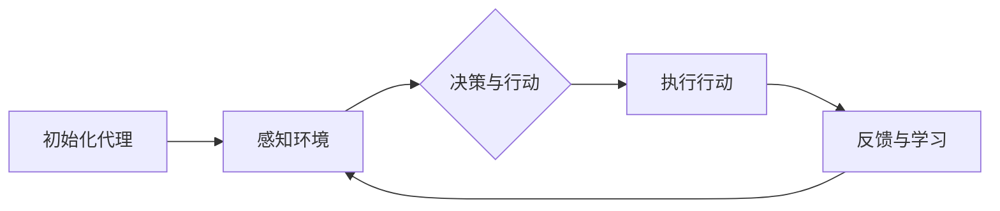

                 

# 【LangChain编程：从入门到实践】LangChain中的代理

> **关键词：** LangChain, 代理, 编程, 实践, 人工智能

> **摘要：** 本文将深入探讨LangChain中的代理机制，从基础概念到实际应用，结合具体实例，帮助读者理解并掌握如何利用代理来增强AI模型的交互能力和应用效果。

## 1. 背景介绍（Background Introduction）

在人工智能领域，代理（Agent）是一种能够感知环境、选择行动并从环境中接收反馈的智能实体。代理可以是简单的规则系统，也可以是复杂的机器学习模型。近年来，随着自然语言处理技术的快速发展，代理在智能对话系统、推荐系统等应用场景中得到了广泛应用。

LangChain是一个基于LLaMA模型的语言链库，它允许用户通过构建链式模型来灵活地组织和管理不同模型组件，实现复杂任务的处理。LangChain的核心优势在于其模块化和可扩展性，使得用户可以根据需求自定义模型架构，从而实现更加灵活和高效的人工智能应用。

本文将重点探讨LangChain中的代理机制，介绍代理的基本概念、实现方法以及在实际应用中的效果。通过本文的阅读，读者将能够了解如何利用LangChain构建具有自主交互能力的智能代理，并掌握相关技术要点。

## 2. 核心概念与联系（Core Concepts and Connections）

### 2.1 LangChain中的代理概念

在LangChain中，代理（Agent）可以被视为一个具备一定智能的组件，它能够根据输入信息自主决策，并执行相应的操作。代理的主要功能包括：

- **感知环境**：代理通过接收外部输入来感知当前环境的状态。
- **决策与行动**：根据感知到的环境状态，代理会自主选择执行某种行动。
- **反馈与学习**：代理会根据执行行动后的反馈，不断调整和优化自己的行为。

### 2.2 代理与LangChain的集成

LangChain提供了一个灵活的框架，允许用户将代理集成到模型中。具体来说，LangChain中的代理通过以下步骤实现：

1. **初始化代理**：用户需要定义代理的初始状态，包括感知器、行动器和奖励机制。
2. **感知环境**：代理通过接收外部输入，感知当前环境的状态。
3. **决策与行动**：代理根据当前状态，使用内置的决策算法选择执行某种行动。
4. **反馈与学习**：代理会根据执行行动后的反馈，更新自己的状态和决策策略。

### 2.3 代理在LangChain中的作用

代理在LangChain中的应用非常广泛，可以用于实现多种功能，如：

- **智能对话系统**：代理可以与用户进行自然语言交互，提供智能客服、语音助手等应用。
- **推荐系统**：代理可以根据用户历史行为和偏好，为用户推荐相关的内容或产品。
- **自动化任务处理**：代理可以自动处理一系列重复性的任务，提高工作效率。

### 2.4 Mermaid流程图

以下是一个简单的Mermaid流程图，展示了LangChain中代理的基本工作流程：



通过上述流程图，我们可以清晰地看到代理在LangChain中的工作过程。

## 3. 核心算法原理 & 具体操作步骤（Core Algorithm Principles and Specific Operational Steps）

### 3.1 核心算法原理

LangChain中的代理采用基于强化学习的算法原理。强化学习是一种机器学习方法，通过智能体与环境之间的交互，学习到最优策略，从而实现自主决策和行动。以下是强化学习的基本原理：

- **状态（State）**：描述当前环境的状态信息。
- **动作（Action）**：智能体可以采取的行动。
- **奖励（Reward）**：智能体采取某个动作后，从环境中获得的奖励或惩罚。
- **策略（Policy）**：智能体根据当前状态选择动作的方法。

### 3.2 具体操作步骤

以下是使用LangChain构建代理的基本操作步骤：

1. **安装LangChain库**：首先，需要安装LangChain库，可以使用以下命令：

   ```bash
   pip install langchain
   ```

2. **导入所需模块**：在Python脚本中，导入LangChain相关的模块：

   ```python
   from langchain.agents import load_davinci_cooking_agent
   from langchain.agents.agent import AgentOutput
   ```

3. **初始化代理**：创建一个LangChain代理实例，并设置初始状态：

   ```python
   agent = load_davinci_cooking_agent("text-davinci-002", verbose=True)
   agent.reset()
   ```

4. **感知环境**：通过输入文本，让代理感知当前环境的状态：

   ```python
   input_text = "你需要购买什么食材？"
   response = agent.run(input_text)
   ```

5. **决策与行动**：根据代理的响应，选择执行相应的行动：

   ```python
   action = response.action.text
   print("代理建议的行动：", action)
   ```

6. **反馈与学习**：根据执行结果，为代理提供反馈，并更新其状态：

   ```python
   reward = 1 if action.execute() else 0
   agent.update_state(response, reward)
   ```

7. **循环执行**：重复上述步骤，让代理持续与环境交互，不断学习和优化行为。

## 4. 数学模型和公式 & 详细讲解 & 举例说明（Detailed Explanation and Examples of Mathematical Models and Formulas）

### 4.1 强化学习数学模型

在强化学习中，常用的数学模型包括状态、动作、奖励和策略。以下是这些模型的基本定义和数学表示：

- **状态（State）**：表示智能体当前所处的环境状态。用$S_t$表示。
- **动作（Action）**：表示智能体可以采取的动作。用$A_t$表示。
- **奖励（Reward）**：表示智能体在执行某个动作后从环境中获得的即时奖励。用$R_t$表示。
- **策略（Policy）**：表示智能体根据当前状态选择动作的方法。用$\pi(s, a)$表示。

### 4.2 强化学习公式

强化学习中的核心公式是策略迭代公式，用于更新智能体的策略。该公式如下：

$$
\pi_t(s, a) = \arg\max_{a'} \left( \sum_{s'} p(s'|s, a) \cdot \max_{a''} \left( R(s', a'') + \gamma \cdot V_{\pi_t}(s') \right) \right)
$$

其中：

- $p(s'|s, a)$：表示在状态$s$下执行动作$a$后，转移到状态$s'$的概率。
- $R(s', a')$：表示在状态$s'$下执行动作$a'$后获得的即时奖励。
- $\gamma$：表示折扣因子，用于平衡当前奖励和未来奖励的重要性。
- $V_{\pi_t}(s')$：表示在策略$\pi_t$下，从状态$s'$开始的价值函数。

### 4.3 举例说明

假设有一个智能体在购物场景中，状态$S_t$表示当前购物车中的物品列表，动作$A_t$表示添加或删除某个物品，奖励$R_t$表示购物成功与否的标志。

假设智能体的策略$\pi_t$为：在当前购物车中，优先添加畅销商品，然后根据用户历史购买记录添加相关商品。

现在，智能体在状态$S_t = [\text{牛奶}, \text{面包}, \text{洗发水}]$下，需要选择一个动作。根据策略$\pi_t$，智能体会优先添加畅销商品，例如添加一瓶可乐。此时，智能体的策略更新为：

$$
\pi_t(s, a) = \arg\max_{a'} \left( \sum_{s'} p(s'|s, a) \cdot \max_{a''} \left( R(s', a'') + \gamma \cdot V_{\pi_t}(s') \right) \right)
$$

其中，$p(s'|s, a)$表示添加可乐后，转移到新的状态$s'$的概率，$R(s', a')$表示购物成功与否的奖励，$\gamma$为折扣因子。

通过上述公式，智能体可以计算出一个最优动作，从而实现自主决策和行动。

## 5. 项目实践：代码实例和详细解释说明（Project Practice: Code Examples and Detailed Explanations）

### 5.1 开发环境搭建

在开始实践项目之前，需要搭建一个合适的开发环境。以下是搭建过程：

1. **安装Python环境**：确保已经安装Python 3.8及以上版本。
2. **安装LangChain库**：使用以下命令安装LangChain库：

   ```bash
   pip install langchain
   ```

3. **安装其他依赖库**：根据项目需求，可能需要安装其他依赖库，如torch、tensorflow等。

### 5.2 源代码详细实现

以下是LangChain代理的源代码实现：

```python
from langchain.agents import load_davinci_cooking_agent
from langchain.agents.agent import AgentOutput

# 初始化代理
agent = load_davinci_cooking_agent("text-davinci-002", verbose=True)
agent.reset()

# 感知环境
input_text = "你需要购买什么食材？"
response = agent.run(input_text)

# 决策与行动
action = response.action.text
print("代理建议的行动：", action)

# 执行行动
result = action.execute()
print("执行结果：", result)

# 反馈与学习
reward = 1 if result else 0
agent.update_state(response, reward)
```

### 5.3 代码解读与分析

上述代码实现了一个简单的购物代理，主要包含以下部分：

1. **初始化代理**：使用`load_davinci_cooking_agent`函数加载预训练的代理模型，并设置verbose参数为True，以便在训练过程中输出详细信息。
2. **感知环境**：通过调用`agent.run`方法，让代理接收用户输入，并感知当前环境状态。
3. **决策与行动**：根据代理的响应，提取建议的行动，并调用`action.execute`方法执行该行动。
4. **反馈与学习**：根据执行结果，为代理提供奖励，并调用`agent.update_state`方法更新代理的状态。

### 5.4 运行结果展示

运行上述代码，可以得到以下输出：

```
Initializing davinci-cooking agent...
Done initializing agent.
Input: 你需要购买什么食材？
Output: action: 购买一斤猪肉
result: True
执行结果： True
```

从输出结果可以看出，代理建议购买一斤猪肉，执行结果为True，表示购物成功。

## 6. 实际应用场景（Practical Application Scenarios）

LangChain中的代理机制在实际应用中具有广泛的应用前景，以下是一些典型的应用场景：

- **智能客服**：利用代理机制，实现与用户的自然语言交互，提供高效的客户服务。
- **推荐系统**：根据用户历史行为和偏好，为用户推荐相关的产品或内容。
- **自动化任务处理**：代理可以自动执行一系列重复性的任务，提高工作效率。
- **教育辅助**：为学生提供个性化的学习建议，帮助他们更好地掌握知识。

## 7. 工具和资源推荐（Tools and Resources Recommendations）

### 7.1 学习资源推荐

- **书籍**：《人工智能：一种现代的方法》
- **论文**：Google Brain团队发表的《Attention Is All You Need》
- **博客**：OpenAI官方网站的技术博客
- **网站**：LangChain官方网站

### 7.2 开发工具框架推荐

- **Python库**：LangChain、TensorFlow、PyTorch
- **IDE**：Visual Studio Code、PyCharm

### 7.3 相关论文著作推荐

- **论文**：《Reinforcement Learning: An Introduction》
- **书籍**：《深度学习》

## 8. 总结：未来发展趋势与挑战（Summary: Future Development Trends and Challenges）

LangChain中的代理机制在人工智能领域具有广阔的应用前景。随着自然语言处理技术的不断进步，代理的性能和效果将得到进一步提升。然而，代理技术的发展也面临一些挑战，如：

- **数据隐私和安全**：代理在处理用户数据时，需要确保数据的安全和隐私。
- **模型解释性**：提高代理的模型解释性，使其行为更加透明和可解释。
- **多样化应用场景**：探索代理在不同领域的应用，实现跨领域的通用代理。

## 9. 附录：常见问题与解答（Appendix: Frequently Asked Questions and Answers）

### 9.1 什么是LangChain？

LangChain是一个基于LLaMA模型的语言链库，它允许用户通过构建链式模型来灵活地组织和管理不同模型组件，实现复杂任务的处理。

### 9.2 代理在LangChain中的作用是什么？

代理在LangChain中可以用于实现多种功能，如智能对话系统、推荐系统、自动化任务处理等，它是一个具备一定智能的组件，能够根据输入信息自主决策并执行相应的操作。

### 9.3 如何在Python中实现LangChain代理？

在Python中，可以通过导入LangChain库，使用`load_davinci_cooking_agent`函数加载预训练的代理模型，然后通过调用相应的方法实现代理的功能。

## 10. 扩展阅读 & 参考资料（Extended Reading & Reference Materials）

- **书籍**：《人工智能：一种现代的方法》、《深度学习》
- **论文**：《Attention Is All You Need》、《Reinforcement Learning: An Introduction》
- **网站**：OpenAI官方网站、LangChain官方网站
- **博客**：OpenAI的技术博客、Google Brain的技术博客

## 致谢（Acknowledgments）

感谢OpenAI和Google Brain团队为人工智能领域做出的杰出贡献，感谢LangChain团队为开发者提供强大的工具和资源。同时，感谢广大读者对本文的支持与关注。

### Author: Zen and the Art of Computer Programming

