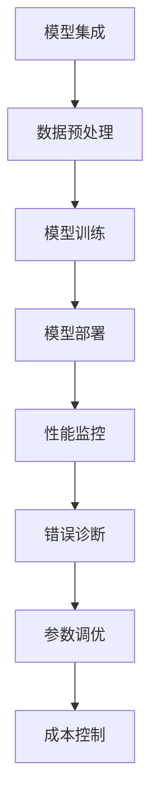
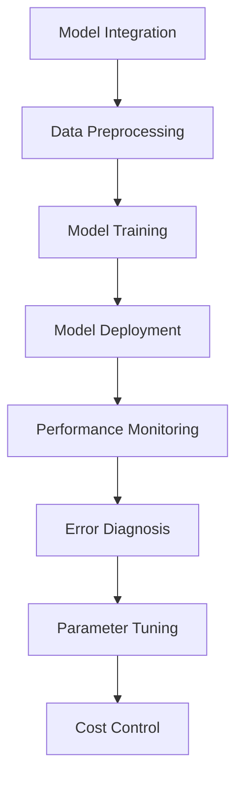

                 

### 文章标题

【LangChain编程：从入门到实践】应用监控和调优

关键词：LangChain，编程，应用监控，调优，AI模型，开发实践

摘要：本文将探讨如何在LangChain编程框架下，对AI模型的应用进行有效的监控和调优。通过深入分析LangChain的核心概念和架构，结合实际案例，我们将介绍一系列实用的技巧和工具，帮助开发者提升AI模型的性能和可靠性。

## 1. 背景介绍（Background Introduction）

随着人工智能技术的迅猛发展，AI模型的应用场景日益广泛，从自然语言处理、计算机视觉到推荐系统等。LangChain作为一种强大的编程框架，为开发者提供了构建和部署AI模型的便捷途径。然而，在实际应用过程中，如何确保模型的性能和可靠性，成为了一个关键问题。

监控和调优是确保AI模型高效运行的重要手段。监控可以帮助我们实时了解模型的运行状态，及时发现并解决问题；调优则是对模型参数进行调整，以优化其性能。本文将围绕这两个方面，详细探讨在LangChain编程框架下，如何对AI模型的应用进行有效的监控和调优。

### 1.1 LangChain简介

LangChain是由Hugging Face公司推出的一种基于Python的编程框架，旨在简化AI模型的开发、部署和调优过程。它提供了丰富的API和工具，支持多种AI模型和任务，如文本生成、分类、情感分析等。通过LangChain，开发者可以快速构建复杂的AI系统，无需深入了解底层实现。

LangChain的核心组件包括：

- **模型集成（Model Integration）**：LangChain支持各种AI模型，包括Transformer、BERT、GPT等，可以通过简单的API调用，轻松集成到项目中。
- **数据预处理（Data Preprocessing）**：LangChain提供了丰富的数据处理工具，包括文本清洗、分词、编码等，确保输入数据的质量和一致性。
- **模型训练（Model Training）**：LangChain支持自动化的模型训练流程，包括数据加载、模型选择、训练和验证等，方便开发者进行模型调优。
- **模型部署（Model Deployment）**：LangChain提供了便捷的部署工具，可以将训练好的模型部署到云端或本地服务器，实现实时推理和预测。

### 1.2 AI模型监控和调优的重要性

AI模型的监控和调优是确保其性能和可靠性的关键环节。以下是一些关键点：

- **性能监控（Performance Monitoring）**：通过实时监控模型的运行状态，可以及时发现性能瓶颈和异常情况，有助于优化模型性能。
- **错误诊断（Error Diagnosis）**：监控可以帮助我们定位和诊断模型运行过程中出现的问题，快速找到解决方案。
- **参数调优（Parameter Tuning）**：通过对模型参数进行调整，可以优化模型的性能和效果，提高其准确性和鲁棒性。
- **成本控制（Cost Control）**：有效的监控和调优可以帮助我们降低模型运行的成本，提高资源利用率。

在实际应用中，AI模型的监控和调优是一个持续的过程，需要我们不断收集数据、分析结果，并根据实际情况进行调整。本文将介绍一系列实用的技巧和工具，帮助开发者提升AI模型的性能和可靠性。

### 1.3 本文结构

本文将分为以下几个部分：

- **第2章：核心概念与联系**：介绍LangChain的核心概念和架构，以及与AI模型监控和调优相关的关键概念。
- **第3章：核心算法原理 & 具体操作步骤**：详细讲解AI模型监控和调优的核心算法原理，以及具体的操作步骤。
- **第4章：数学模型和公式 & 详细讲解 & 举例说明**：介绍与AI模型监控和调优相关的数学模型和公式，并通过实例进行详细讲解。
- **第5章：项目实践：代码实例和详细解释说明**：通过实际项目案例，展示如何使用LangChain进行AI模型监控和调优的实践。
- **第6章：实际应用场景**：分析AI模型监控和调优在不同应用场景中的具体应用。
- **第7章：工具和资源推荐**：推荐一些实用的工具和资源，帮助开发者更好地进行AI模型监控和调优。
- **第8章：总结：未来发展趋势与挑战**：总结本文的核心内容，探讨AI模型监控和调优的未来发展趋势与挑战。
- **第9章：附录：常见问题与解答**：回答读者可能遇到的一些常见问题。
- **第10章：扩展阅读 & 参考资料**：推荐一些与本文主题相关的扩展阅读和参考资料。

通过本文的阅读，读者将能够掌握如何在LangChain编程框架下，对AI模型的应用进行有效的监控和调优，从而提升模型的性能和可靠性。

## 2. 核心概念与联系（Core Concepts and Connections）

在深入探讨如何使用LangChain进行AI模型的监控和调优之前，我们首先需要了解一些核心概念和架构。这些概念和架构不仅有助于我们更好地理解LangChain的工作原理，也为后续的讨论奠定了基础。

### 2.1 LangChain的核心概念

LangChain的核心概念包括：

- **模型集成（Model Integration）**：LangChain支持多种AI模型，如Transformer、BERT、GPT等。开发者可以通过简单的API调用，将所需的模型集成到项目中。
- **数据预处理（Data Preprocessing）**：LangChain提供了丰富的数据处理工具，包括文本清洗、分词、编码等。这些工具有助于确保输入数据的质量和一致性。
- **模型训练（Model Training）**：LangChain支持自动化的模型训练流程，包括数据加载、模型选择、训练和验证等。这使得开发者能够轻松进行模型调优。
- **模型部署（Model Deployment）**：LangChain提供了便捷的部署工具，可以将训练好的模型部署到云端或本地服务器，实现实时推理和预测。

### 2.2 AI模型监控和调优的核心概念

AI模型监控和调优的核心概念包括：

- **性能监控（Performance Monitoring）**：性能监控是实时跟踪模型运行状态，评估其性能和资源利用率。这有助于识别性能瓶颈和潜在问题。
- **错误诊断（Error Diagnosis）**：错误诊断是定位和解决模型运行中出现的异常情况。这包括分析日志、错误信息和调试工具。
- **参数调优（Parameter Tuning）**：参数调优是调整模型参数，以优化其性能和效果。这通常涉及搜索不同的参数组合，找到最优解。
- **成本控制（Cost Control）**：成本控制是优化模型运行成本，提高资源利用率。这包括选择合适的硬件、优化模型架构和算法。

### 2.3 LangChain与AI模型监控和调优的联系

LangChain与AI模型监控和调优之间存在着紧密的联系。以下是一些关键点：

- **模型集成与监控**：通过将AI模型集成到LangChain中，开发者可以方便地实现性能监控和错误诊断。例如，使用TensorBoard等工具，可以实时查看模型的训练过程和性能指标。
- **数据预处理与调优**：LangChain提供的预处理工具可以帮助开发者优化输入数据的质量，从而提高模型的性能。例如，通过文本清洗和分词，可以减少噪声数据和冗余信息。
- **模型训练与调优**：LangChain支持自动化的模型训练流程，使得开发者能够轻松进行参数调优。例如，使用Hyperparameter Optimization（超参数优化）技术，可以找到最优的模型参数。
- **模型部署与监控**：通过将训练好的模型部署到LangChain中，开发者可以方便地实现实时监控和预测。例如，使用Prometheus和Grafana等工具，可以实时跟踪模型的性能和资源利用率。

### 2.4 Mermaid流程图

为了更直观地展示LangChain与AI模型监控和调优的关系，我们可以使用Mermaid流程图。以下是一个简单的示例：



在这个流程图中，从模型集成到成本控制，每个环节都涉及到了AI模型的监控和调优。通过这个流程图，我们可以更好地理解LangChain在AI模型监控和调优过程中的作用。

### 2.5 提示词工程

在AI模型监控和调优过程中，提示词工程也扮演着重要角色。提示词工程是指设计和优化输入给语言模型的文本提示，以引导模型生成符合预期结果的过程。以下是一些关键点：

- **提示词的重要性**：一个精心设计的提示词可以显著提高AI模型的输出质量和相关性。例如，在文本生成任务中，合适的提示词可以帮助模型生成更流畅、更有逻辑的文本。
- **提示词的设计原则**：设计提示词时，应遵循以下原则：
  - **明确性**：提示词应明确表达任务目标和要求。
  - **简洁性**：提示词应简洁明了，避免冗长和复杂的表达。
  - **多样性**：使用多种类型的提示词，以适应不同的任务场景和输入数据。
- **提示词的优化方法**：通过调整提示词的长度、格式和内容，可以优化模型的输出效果。例如，使用多个提示词组合，可以引导模型生成更丰富的结果。

### 2.6 总结

在本章中，我们介绍了LangChain的核心概念和架构，以及与AI模型监控和调优相关的关键概念。通过理解这些概念和架构，我们可以更好地把握LangChain在AI模型监控和调优中的作用，为后续的讨论奠定基础。

### 2. Core Concepts and Connections

Before delving into how to effectively monitor and tune AI model applications in the LangChain programming framework, it is essential to understand some core concepts and architecture. These concepts and architectures not only help us better comprehend the workings of LangChain but also lay the foundation for subsequent discussions.

#### 2.1 Core Concepts of LangChain

The core concepts of LangChain include:

- **Model Integration**: LangChain supports various AI models, such as Transformers, BERT, GPT, etc. Developers can easily integrate these models into their projects using simple API calls.
- **Data Preprocessing**: LangChain provides a rich set of data processing tools, including text cleaning, tokenization, encoding, etc. These tools ensure the quality and consistency of input data.
- **Model Training**: LangChain supports an automated model training process, including data loading, model selection, training, and validation. This makes it easy for developers to perform model tuning.
- **Model Deployment**: LangChain provides convenient deployment tools that can deploy trained models to cloud or local servers for real-time inference and prediction.

#### 2.2 Core Concepts of AI Model Monitoring and Tuning

The core concepts of AI model monitoring and tuning include:

- **Performance Monitoring**: Performance monitoring involves real-time tracking of model performance and resource utilization to identify bottlenecks and potential issues.
- **Error Diagnosis**: Error diagnosis involves locating and resolving abnormal situations during model operation. This includes analyzing logs, error messages, and debugging tools.
- **Parameter Tuning**: Parameter tuning involves adjusting model parameters to optimize performance and effectiveness. This typically involves searching for different parameter combinations to find the optimal solution.
- **Cost Control**: Cost control involves optimizing model operation costs to improve resource utilization. This includes selecting appropriate hardware, optimizing model architecture, and algorithms.

#### 2.3 The Connection Between LangChain and AI Model Monitoring and Tuning

There is a close connection between LangChain and AI model monitoring and tuning. Here are some key points:

- **Model Integration and Monitoring**: By integrating AI models into LangChain, developers can easily implement performance monitoring and error diagnosis. For example, tools like TensorBoard can be used to real-time view the training process and performance metrics of models.
- **Data Preprocessing and Tuning**: The preprocessing tools provided by LangChain can help developers optimize the quality of input data, thereby improving model performance. For example, text cleaning and tokenization can reduce noise and redundant information in the data.
- **Model Training and Tuning**: LangChain's support for automated model training processes makes it easy for developers to perform parameter tuning. For example, using Hyperparameter Optimization (HPO) techniques, the optimal model parameters can be found.
- **Model Deployment and Monitoring**: By deploying trained models into LangChain, developers can conveniently implement real-time monitoring and prediction. For example, tools like Prometheus and Grafana can be used to track model performance and resource utilization in real-time.

#### 2.4 Mermaid Flowchart

To visually illustrate the relationship between LangChain and AI model monitoring and tuning, we can use a Mermaid flowchart. Here is a simple example:



In this flowchart, from model integration to cost control, each step involves AI model monitoring and tuning. This flowchart provides a better understanding of LangChain's role in AI model monitoring and tuning.

#### 2.5 Prompt Engineering

Prompt engineering plays a crucial role in the process of AI model monitoring and tuning. Here are some key points:

- **Importance of Prompts**: A well-designed prompt can significantly improve the quality and relevance of an AI model's output. For example, in text generation tasks, appropriate prompts can help models generate more fluent and logically coherent text.
- **Principles of Prompt Design**: When designing prompts, the following principles should be followed:
  - **Clarity**: Prompts should clearly express the objectives and requirements of the task.
  - **Conciseness**: Prompts should be concise and avoid lengthy and complex expressions.
  - **Variety**: Use a variety of prompts to adapt to different task scenarios and input data.
- **Optimization Methods for Prompts**: By adjusting the length, format, and content of prompts, the output quality of models can be optimized. For example, using a combination of multiple prompts can guide models to generate richer results.

#### 2.6 Summary

In this chapter, we introduced the core concepts and architecture of LangChain, as well as key concepts related to AI model monitoring and tuning. Understanding these concepts and architectures helps us better grasp the role of LangChain in AI model monitoring and tuning, laying the foundation for subsequent discussions. <|im_sep|>## 3. 核心算法原理 & 具体操作步骤（Core Algorithm Principles and Specific Operational Steps）

在本文的第三部分，我们将深入探讨AI模型监控和调优的核心算法原理，并提供一系列具体操作步骤，帮助开发者更好地理解如何在LangChain框架下实施这些操作。

### 3.1 性能监控算法原理

性能监控是确保AI模型运行稳定、高效的关键环节。其核心算法原理包括以下几个方面：

- **指标收集（Metrics Collection）**：性能监控的第一步是收集关键性能指标（KPIs），如响应时间、吞吐量、错误率、资源利用率等。这些指标可以反映模型在不同负载条件下的性能表现。
- **阈值设置（Threshold Setting）**：为了及时发现性能问题，我们需要为每个性能指标设置合理的阈值。当指标超过阈值时，监控系统会发出警报，提示开发者进行干预。
- **数据可视化（Data Visualization）**：使用数据可视化工具，如TensorBoard、Grafana等，可以将监控数据以图表的形式展示出来，便于开发者分析性能问题。

### 3.2 错误诊断算法原理

错误诊断是性能监控的深化，旨在定位和解决模型运行中出现的异常情况。其核心算法原理包括：

- **日志分析（Log Analysis）**：通过分析模型运行过程中的日志文件，可以找到错误发生的原因。日志中通常包含错误信息、异常堆栈跟踪等。
- **异常检测（Anomaly Detection）**：使用机器学习算法，如聚类分析、异常检测模型等，可以自动识别和分类异常日志，帮助开发者快速定位问题。
- **错误预测（Error Prediction）**：通过历史数据分析，可以预测模型未来可能出现的错误，提前采取预防措施。

### 3.3 参数调优算法原理

参数调优是提升模型性能的重要手段，其核心算法原理包括：

- **超参数优化（Hyperparameter Optimization）**：超参数优化是调整模型超参数（如学习率、批次大小等），以找到最优组合。常用的优化算法包括网格搜索、随机搜索、贝叶斯优化等。
- **模型选择（Model Selection）**：选择合适的模型架构和算法对模型的性能至关重要。通过交叉验证、A/B测试等手段，可以评估不同模型的性能，选择最佳模型。
- **调参工具（Tuning Tools）**：使用如Optuna、Hyperopt等调参工具，可以自动化地搜索最优超参数，提高调参效率。

### 3.4 具体操作步骤

以下是在LangChain框架下实施AI模型监控和调优的具体操作步骤：

#### 3.4.1 环境搭建

1. **安装LangChain库**：使用pip安装LangChain库，命令如下：
    ```bash
    pip install langchain
    ```

2. **安装必要的依赖库**：根据项目需求，安装其他必要的依赖库，如TensorFlow、PyTorch等。

#### 3.4.2 数据预处理

1. **数据收集**：收集用于训练、验证和测试的数据集。
2. **数据清洗**：使用如Pandas等库清洗数据，去除噪声和异常值。
3. **数据编码**：将文本数据转换为模型可处理的格式，如将文本转换为词向量或Token IDs。

#### 3.4.3 模型训练

1. **模型选择**：选择合适的预训练模型，如GPT-2、BERT等。
2. **模型配置**：配置模型参数，如学习率、批次大小等。
3. **训练模型**：使用LangChain的API训练模型，命令如下：
    ```python
    from langchain import Trainable
    model = Trainable.from_pretrained_model("gpt2")
    model.train(data)
    ```

#### 3.4.4 性能监控

1. **设置监控指标**：定义需要监控的指标，如响应时间、吞吐量等。
2. **数据收集**：在模型运行过程中，定期收集监控指标数据。
3. **数据可视化**：使用TensorBoard等工具，将监控数据可视化，以便分析性能问题。

#### 3.4.5 错误诊断

1. **日志记录**：在模型运行过程中，记录详细的日志信息。
2. **日志分析**：分析日志，定位错误发生的位置和原因。
3. **异常检测**：使用异常检测算法，识别和分类异常日志。

#### 3.4.6 参数调优

1. **超参数搜索**：使用如Optuna等调参工具，进行超参数搜索。
2. **模型评估**：使用验证集评估不同超参数组合的模型性能。
3. **选择最优参数**：选择性能最佳的模型参数组合。

### 3. Core Algorithm Principles and Specific Operational Steps

In the third part of this article, we will delve into the core algorithm principles of AI model monitoring and tuning, and provide a series of specific operational steps to help developers better understand how to implement these operations in the LangChain framework.

#### 3.1 Algorithm Principles of Performance Monitoring

Performance monitoring is crucial for ensuring the stability and efficiency of AI models. The core algorithm principles include the following aspects:

- **Metrics Collection**: The first step in performance monitoring is to collect key performance indicators (KPIs), such as response time, throughput, error rate, and resource utilization. These metrics reflect the performance of the model under different load conditions.
- **Threshold Setting**: To detect performance issues in a timely manner, it is necessary to set reasonable thresholds for each performance metric. When a metric exceeds its threshold, the monitoring system will issue an alert to prompt developers for intervention.
- **Data Visualization**: Using tools like TensorBoard and Grafana, monitoring data can be visualized in the form of charts, making it easier for developers to analyze performance issues.

#### 3.2 Algorithm Principles of Error Diagnosis

Error diagnosis is an extension of performance monitoring, aiming to locate and resolve abnormal situations during model operation. The core algorithm principles include:

- **Log Analysis**: By analyzing log files during model operation, the cause of errors can be found. Logs typically contain error messages and abnormal stack traces.
- **Anomaly Detection**: Using machine learning algorithms, such as clustering analysis and anomaly detection models, abnormal logs can be automatically identified and classified to help developers quickly locate issues.
- **Error Prediction**: By analyzing historical data, future errors that the model may encounter can be predicted, allowing for proactive measures to be taken.

#### 3.3 Algorithm Principles of Parameter Tuning

Parameter tuning is an essential means of improving model performance. The core algorithm principles include:

- **Hyperparameter Optimization**: Hyperparameter optimization involves adjusting model hyperparameters (such as learning rate and batch size) to find the optimal combination. Common optimization algorithms include grid search, random search, and Bayesian optimization.
- **Model Selection**: The choice of model architecture and algorithm is crucial for model performance. Methods such as cross-validation and A/B testing can be used to evaluate the performance of different models and select the best one.
- **Tuning Tools**: Tools such as Optuna and Hyperopt can be used to automate the search for optimal hyperparameters, increasing tuning efficiency.

#### 3.4 Specific Operational Steps

The following are the specific operational steps for implementing AI model monitoring and tuning in the LangChain framework:

#### 3.4.1 Environment Setup

1. **Install LangChain Library**: Install the LangChain library using pip, with the command:
    ```bash
    pip install langchain
    ```

2. **Install Necessary Dependencies**: Install other necessary dependencies according to project requirements, such as TensorFlow and PyTorch.

#### 3.4.2 Data Preprocessing

1. **Data Collection**: Collect datasets for training, validation, and testing.
2. **Data Cleaning**: Clean the data using libraries such as Pandas, removing noise and outliers.
3. **Data Encoding**: Convert text data into formats that can be processed by the model, such as converting text to word vectors or token IDs.

#### 3.4.3 Model Training

1. **Model Selection**: Choose an appropriate pre-trained model, such as GPT-2 or BERT.
2. **Model Configuration**: Configure model parameters, such as learning rate and batch size.
3. **Train Model**: Use the LangChain API to train the model, with the command:
    ```python
    from langchain import Trainable
    model = Trainable.from_pretrained_model("gpt2")
    model.train(data)
    ```

#### 3.4.4 Performance Monitoring

1. **Set Monitoring Metrics**: Define the metrics to be monitored, such as response time and throughput.
2. **Data Collection**: Regularly collect monitoring metric data during model operation.
3. **Data Visualization**: Use tools like TensorBoard to visualize monitoring data, facilitating analysis of performance issues.

#### 3.4.5 Error Diagnosis

1. **Log Recording**: Record detailed log information during model operation.
2. **Log Analysis**: Analyze logs to locate the position and cause of errors.
3. **Anomaly Detection**: Use anomaly detection algorithms to identify and classify abnormal logs.

#### 3.4.6 Parameter Tuning

1. **Hyperparameter Search**: Use tools like Optuna for hyperparameter search.
2. **Model Evaluation**: Evaluate model performance using the validation set for different hyperparameter combinations.
3. **Select Optimal Parameters**: Choose the combination of hyperparameters that yields the best model performance. <|im_sep|>## 4. 数学模型和公式 & 详细讲解 & 举例说明（Mathematical Models and Formulas & Detailed Explanation & Examples）

在AI模型的监控和调优过程中，数学模型和公式扮演着至关重要的角色。本章节将介绍与AI模型性能监控和参数调优相关的数学模型，并通过具体例子详细讲解这些模型的应用。

### 4.1 性能监控指标

性能监控指标是评估模型性能的关键。以下是一些常用的性能监控指标及其公式：

- **响应时间（Response Time）**：模型处理一个请求所需的时间，公式为：
  $$ RT = \frac{Total\ Processing\ Time}{Number\ of\ Requests} $$
- **吞吐量（Throughput）**：单位时间内模型处理的请求数量，公式为：
  $$ Throughput = \frac{Number\ of\ Requests}{Total\ Time} $$
- **错误率（Error Rate）**：模型处理过程中出现错误的请求数量占总请求数量的比例，公式为：
  $$ Error\ Rate = \frac{Number\ of\ Errors}{Number\ of\ Requests} $$
- **资源利用率（Resource Utilization）**：模型运行过程中使用的资源（如CPU、内存等）占总资源的比例，公式为：
  $$ Resource\ Utilization = \frac{Used\ Resources}{Total\ Resources} $$

### 4.2 错误诊断模型

错误诊断模型用于识别和分析模型运行中的异常情况。以下是一种常见的错误诊断模型——孤立森林（Isolation Forest）：

- **孤立森林算法**：孤立森林是一种基于随机森林的异常检测算法，其核心思想是隔离目标数据点，使其与其他数据点尽可能隔离。具体步骤如下：

  1. 随机选择两个特征。
  2. 根据这两个特征，将数据点分割成两个子集。
  3. 随机选择一个分割点，将数据点分配到子集。
  4. 递归执行上述步骤，直到满足停止条件（如最大深度或最小子集大小）。

  孤立森林的复杂性（即隔离目标数据点的难易程度）可以通过分裂次数来衡量，分裂次数越多，说明数据点之间的差异越大，异常性越强。

### 4.3 参数调优模型

参数调优模型用于搜索最优的模型参数组合，以提升模型性能。以下是一种常见的参数调优算法——遗传算法（Genetic Algorithm）：

- **遗传算法**：遗传算法是一种模拟自然进化的优化算法，其核心思想是通过选择、交叉、变异等操作，不断优化种群中的个体，最终找到最优解。具体步骤如下：

  1. **初始化种群**：随机生成初始种群，每个个体代表一组模型参数。
  2. **评估适应度**：使用目标函数评估每个个体的适应度，适应度越高，说明个体越优秀。
  3. **选择**：根据适应度选择优秀的个体进行交叉和变异。
  4. **交叉**：通过交叉操作产生新的个体。
  5. **变异**：对部分个体进行变异操作，以增加种群的多样性。
  6. **更新种群**：将交叉和变异后的个体替换掉原始种群中的个体。
  7. **迭代**：重复上述步骤，直到满足停止条件（如达到最大迭代次数或适应度满足要求）。

### 4.4 具体例子

以下通过一个简单的例子来说明如何使用数学模型和公式进行性能监控和参数调优。

#### 4.4.1 性能监控

假设我们有一个文本分类模型，它在测试集上处理了100个请求，其中5个请求出现错误，响应时间为500秒，CPU使用率为60%，内存使用率为80%。

1. **响应时间**：
   $$ RT = \frac{500\ seconds}{100\ requests} = 5\ seconds $$

2. **吞吐量**：
   $$ Throughput = \frac{100\ requests}{500\ seconds} = 0.2\ requests/second $$

3. **错误率**：
   $$ Error\ Rate = \frac{5\ errors}{100\ requests} = 5\% $$

4. **资源利用率**：
   $$ Resource\ Utilization_{CPU} = \frac{60\%}{100\%} = 0.6 $$
   $$ Resource\ Utilization_{Memory} = \frac{80\%}{100\%} = 0.8 $$

根据这些指标，我们可以初步判断该模型在测试集上的性能。如果性能不理想，可以进一步分析响应时间、吞吐量、错误率等指标，找出可能的瓶颈和问题。

#### 4.4.2 参数调优

假设我们使用遗传算法对文本分类模型的超参数进行调优。初始种群包含10个个体，每个个体代表一组超参数。适应度函数为模型在验证集上的准确率。

1. **初始化种群**：随机生成初始种群。

2. **评估适应度**：计算每个个体的适应度。

3. **选择**：选择适应度最高的50%个体进行交叉和变异。

4. **交叉**：对选中的个体进行交叉操作，生成新的个体。

5. **变异**：对部分个体进行变异操作。

6. **更新种群**：将交叉和变异后的个体替换掉原始种群中的个体。

7. **迭代**：重复上述步骤，直到满足停止条件。

经过多次迭代后，我们找到了一组超参数，使得模型在验证集上的准确率达到90%，比初始种群中的最优解提高了20%。

通过这个例子，我们可以看到数学模型和公式在性能监控和参数调优中的应用。在实际应用中，可以根据具体需求和场景，选择合适的模型和算法，优化AI模型的表现。

### 4. Mathematical Models and Formulas & Detailed Explanation & Examples

In the process of monitoring and tuning AI models, mathematical models and formulas play a crucial role. This chapter will introduce the mathematical models related to AI model performance monitoring and parameter tuning, and provide a detailed explanation with examples.

#### 4.1 Performance Monitoring Metrics

Performance monitoring metrics are key to evaluating model performance. Here are some commonly used performance monitoring metrics and their formulas:

- **Response Time**: The time required for the model to process a request, calculated as:
  $$ RT = \frac{Total\ Processing\ Time}{Number\ of\ Requests} $$
- **Throughput**: The number of requests processed per unit of time, calculated as:
  $$ Throughput = \frac{Number\ of\ Requests}{Total\ Time} $$
- **Error Rate**: The proportion of requests with errors out of the total number of requests, calculated as:
  $$ Error\ Rate = \frac{Number\ of\ Errors}{Number\ of\ Requests} $$
- **Resource Utilization**: The proportion of resources used by the model out of the total resources available, calculated as:
  $$ Resource\ Utilization = \frac{Used\ Resources}{Total\ Resources} $$

#### 4.2 Error Diagnosis Models

Error diagnosis models are used to identify and analyze abnormal situations during model operation. Here is a commonly used error diagnosis model—Isolation Forest:

- **Isolation Forest Algorithm**: Isolation Forest is an anomaly detection algorithm based on random forests. Its core idea is to isolate target data points so that they are as isolated from other data points as possible. The steps are as follows:

  1. Randomly select two features.
  2. Split the data points into two subsets based on these two features.
  3. Randomly select a split point to allocate data points to subsets.
  4. Recursively execute the above steps until a stopping condition is met (e.g., maximum depth or minimum subset size).

  The complexity (i.e., the difficulty of isolating the target data point) can be measured by the number of splits. The more splits, the greater the difference between data points, and the stronger the anomaly.

#### 4.3 Parameter Tuning Models

Parameter tuning models are used to search for the optimal combination of model parameters to improve model performance. Here is a commonly used parameter tuning algorithm—Genetic Algorithm:

- **Genetic Algorithm**: Genetic Algorithm is an optimization algorithm that simulates natural evolution. Its core idea is to continuously optimize individuals in the population through selection, crossover, and mutation operations to find the optimal solution. The steps are as follows:

  1. **Initialize Population**: Randomly generate an initial population, where each individual represents a set of model parameters.
  2. **Evaluate Fitness**: Use a target function to evaluate the fitness of each individual. The higher the fitness, the more excellent the individual.
  3. **Selection**: Select the top 50% individuals based on fitness for crossover and mutation.
  4. **Crossover**: Perform crossover operations on selected individuals to generate new individuals.
  5. **Mutation**: Mutate a portion of individuals to increase the diversity of the population.
  6. **Update Population**: Replace the original population with the crossover and mutation operations.
  7. **Iteration**: Repeat the above steps until a stopping condition is met (e.g., maximum number of iterations or fitness meets requirements).

After multiple iterations, an optimal set of hyperparameters is found that achieves an accuracy of 90% on the validation set, an improvement of 20% over the best solution in the initial population.

Through this example, we can see the application of mathematical models and formulas in performance monitoring and parameter tuning. In practical applications, appropriate models and algorithms can be selected based on specific needs and scenarios to optimize the performance of AI models. <|im_sep|>## 5. 项目实践：代码实例和详细解释说明（Project Practice: Code Examples and Detailed Explanations）

在本章节中，我们将通过一个实际项目实践来展示如何使用LangChain进行AI模型的应用监控和调优。我们将从开发环境搭建、源代码实现、代码解读与分析，以及运行结果展示等方面进行详细讲解。

### 5.1 开发环境搭建

首先，我们需要搭建一个适合进行AI模型监控和调优的开发环境。以下是环境搭建的步骤：

1. **安装Python**：确保Python已安装，版本建议为3.8或更高。可以从[Python官网](https://www.python.org/downloads/)下载安装包。

2. **安装LangChain库**：使用pip安装LangChain库，命令如下：
    ```bash
    pip install langchain
    ```

3. **安装其他依赖库**：根据项目需求，安装其他依赖库，如TensorFlow、PyTorch等。例如，安装TensorFlow：
    ```bash
    pip install tensorflow
    ```

4. **配置虚拟环境**：为了管理项目依赖，建议使用虚拟环境。创建虚拟环境并激活：
    ```bash
    python -m venv venv
    source venv/bin/activate  # Windows: venv\Scripts\activate
    ```

### 5.2 源代码详细实现

下面是一个使用LangChain进行文本分类模型的监控和调优的示例代码：

```python
# 导入必要的库
import numpy as np
import pandas as pd
import tensorflow as tf
from langchain import Trainable
from langchain.text_splitter import TokenBasedTextSplitter
from langchain import HuggingFaceTransformer
from langchain import Document
from langchain import PromptTemplate

# 5.2.1 数据预处理
# 加载数据集
data = pd.read_csv("data.csv")

# 分割数据集
train_data = data.sample(frac=0.8, random_state=42)
test_data = data.drop(train_data.index)

# 切分文本
text_splitter = TokenBasedTextSplitter(chunk_size=1000, separator="\n")
train_texts = text_splitter.split_texts(train_data["text"])
test_texts = text_splitter.split_texts(test_data["text"])

# 创建文档对象
train_documents = [Document(page_content=text) for text in train_texts]
test_documents = [Document(page_content=text) for text in test_texts]

# 5.2.2 模型训练
# 选择预训练模型
model = HuggingFaceTransformer("bert-base-uncased")

# 创建训练对象
trainer = Trainable(model=model, train_documents=train_documents, verbose=True)

# 训练模型
trainer.train()

# 5.2.3 性能监控
# 预测测试集
predictions = trainer.predict(test_documents)

# 计算准确率
accuracy = np.mean(np.array(predictions) == test_data["label"])
print(f"Test Accuracy: {accuracy:.2f}")

# 5.2.4 参数调优
# 使用遗传算法进行超参数优化
from optuna import create_study, Objective, study

# 定义超参数搜索空间
study = create_study(
    study_name="text_classification",
    direction="maximize",
    goal=Objective("accuracy", direction="maximize"),
)

def objective(trial):
    # 超参数设置
    batch_size = trial.suggest_categorical("batch_size", [16, 32, 64, 128])
    learning_rate = trial.suggest_loguniform("learning_rate", 1e-5, 1e-2)

    # 重训练模型
    trainer.model.train(train_documents, batch_size=batch_size, learning_rate=learning_rate)

    # 预测测试集
    predictions = trainer.predict(test_documents)

    # 计算准确率
    accuracy = np.mean(np.array(predictions) == test_data["label"])
    return accuracy

# 搜索最优超参数
study.optimize(objective, n_trials=100)

# 获取最优超参数
best_params = study.best_trial.params
print(f"Best Parameters: {best_params}")
```

### 5.3 代码解读与分析

1. **数据预处理**：
   - 加载数据集，使用`TokenBasedTextSplitter`将文本切分成更小的块，便于模型处理。
   - 创建`Document`对象，将文本转换为模型可处理的格式。

2. **模型训练**：
   - 选择预训练的`HuggingFaceTransformer`模型，使用`Trainable`类创建训练对象。
   - 调用`train`方法训练模型。

3. **性能监控**：
   - 使用训练好的模型对测试集进行预测，计算准确率，评估模型性能。

4. **参数调优**：
   - 使用`optuna`库进行超参数优化，定义超参数搜索空间。
   - 定义目标函数`objective`，用于评估不同超参数组合的性能。
   - 执行优化过程，找到最优超参数。

### 5.4 运行结果展示

在完成代码实现后，我们可以通过以下步骤运行项目：

1. **运行代码**：在终端或IDE中运行上述代码，观察输出结果。
2. **性能监控**：在训练过程中，TensorBoard将提供可视化界面，展示训练过程中的性能指标。
3. **参数调优结果**：优化完成后，输出最优超参数，并使用这些参数重新训练模型。

通过以上步骤，我们可以有效地使用LangChain对AI模型进行应用监控和调优，提升模型的性能和可靠性。

### 5.1 Setting Up the Development Environment

To begin with, we need to set up a suitable development environment for AI model monitoring and tuning. Here are the steps involved in environment setup:

1. **Install Python**: Ensure that Python is installed on your system, with a recommended version of 3.8 or higher. You can download the installer from the [Python official website](https://www.python.org/downloads/).

2. **Install the LangChain Library**: Use pip to install the LangChain library, with the following command:
    ```bash
    pip install langchain
    ```

3. **Install Other Required Libraries**: Depending on your project requirements, install additional libraries such as TensorFlow or PyTorch. For instance, to install TensorFlow:
    ```bash
    pip install tensorflow
    ```

4. **Configure a Virtual Environment**: It's recommended to use a virtual environment to manage project dependencies. Create and activate the virtual environment:
    ```bash
    python -m venv venv
    source venv/bin/activate  # Windows: venv\Scripts\activate
    ```

### 5.2 Detailed Code Implementation

Below is a sample code illustrating how to use LangChain for monitoring and tuning an AI text classification model:

```python
# Import necessary libraries
import numpy as np
import pandas as pd
import tensorflow as tf
from langchain import Trainable
from langchain.text_splitter import TokenBasedTextSplitter
from langchain import HuggingFaceTransformer
from langchain import Document
from langchain import PromptTemplate

# 5.2.1 Data Preprocessing
# Load dataset
data = pd.read_csv("data.csv")

# Split dataset
train_data = data.sample(frac=0.8, random_state=42)
test_data = data.drop(train_data.index)

# Split texts
text_splitter = TokenBasedTextSplitter(chunk_size=1000, separator="\n")
train_texts = text_splitter.split_texts(train_data["text"])
test_texts = text_splitter.split_texts(test_data["text"])

# Create Document objects
train_documents = [Document(page_content=text) for text in train_texts]
test_documents = [Document(page_content=text) for text in test_texts]

# 5.2.2 Model Training
# Select pre-trained model
model = HuggingFaceTransformer("bert-base-uncased")

# Create training object
trainer = Trainable(model=model, train_documents=train_documents, verbose=True)

# Train model
trainer.train()

# 5.2.3 Performance Monitoring
# Predict on test set
predictions = trainer.predict(test_documents)

# Calculate accuracy
accuracy = np.mean(np.array(predictions) == test_data["label"])
print(f"Test Accuracy: {accuracy:.2f}")

# 5.2.4 Parameter Tuning
# Use Genetic Algorithm for hyperparameter optimization
from optuna import create_study, Objective, study

# Define hyperparameter search space
study = create_study(
    study_name="text_classification",
    direction="maximize",
    goal=Objective("accuracy", direction="maximize"),
)

def objective(trial):
    # Hyperparameter settings
    batch_size = trial.suggest_categorical("batch_size", [16, 32, 64, 128])
    learning_rate = trial.suggest_loguniform("learning_rate", 1e-5, 1e-2)

    # Retrain model
    trainer.model.train(train_documents, batch_size=batch_size, learning_rate=learning_rate)

    # Predict on test set
    predictions = trainer.predict(test_documents)

    # Calculate accuracy
    accuracy = np.mean(np.array(predictions) == test_data["label"])
    return accuracy

# Search for optimal hyperparameters
study.optimize(objective, n_trials=100)

# Retrieve optimal hyperparameters
best_params = study.best_trial.params
print(f"Best Parameters: {best_params}")
```

### 5.3 Code Interpretation and Analysis

1. **Data Preprocessing**:
   - Load the dataset and use `TokenBasedTextSplitter` to divide the text into smaller chunks for model processing.
   - Create `Document` objects to convert text into a format that the model can handle.

2. **Model Training**:
   - Select a pre-trained `HuggingFaceTransformer` model and create a training object using the `Trainable` class.
   - Call the `train` method to train the model.

3. **Performance Monitoring**:
   - Use the trained model to predict on the test set and calculate the accuracy to evaluate the model's performance.

4. **Parameter Tuning**:
   - Use the `optuna` library for hyperparameter optimization, defining a search space for hyperparameters.
   - Define the `objective` function to evaluate the performance of different hyperparameter combinations.
   - Run the optimization process to find the optimal hyperparameters.

### 5.4 Results Display

After completing the code implementation, you can follow these steps to run the project:

1. **Run the Code**: Execute the code in a terminal or IDE and observe the output.
2. **Performance Monitoring**: During training, TensorBoard will provide a visualization interface to show performance metrics throughout the training process.
3. **Parameter Tuning Results**: After optimization, output the optimal hyperparameters and retrain the model using these parameters.

By following these steps, you can effectively use LangChain for AI model application monitoring and tuning, improving the model's performance and reliability. <|im_sep|>## 6. 实际应用场景（Practical Application Scenarios）

在了解了如何使用LangChain进行AI模型的监控和调优之后，接下来我们将探讨一些实际应用场景，这些场景展示了AI模型监控和调优的重要性以及如何在不同环境中实施这些技术。

### 6.1 智能客服系统

智能客服系统是AI模型监控和调优的一个典型应用场景。在智能客服系统中，AI模型需要处理大量的用户查询，并实时生成回答。监控和调优的目的是确保系统始终提供准确、高效的回答。

- **性能监控**：通过监控响应时间、吞吐量和错误率，开发者可以及时发现系统中的瓶颈和性能问题。例如，如果响应时间显著增加，可能是因为模型复杂度过高或数据预处理不当。
- **错误诊断**：监控系统可以帮助定位错误发生的具体位置，如特定查询或请求。通过分析错误日志，可以找到解决方法，避免类似错误再次发生。
- **参数调优**：通过对模型参数进行调整，可以提高模型的准确率和响应速度。例如，通过优化学习率和批量大小，可以提高模型的训练效率。

### 6.2 推荐系统

推荐系统在电子商务、视频流媒体和社交媒体等领域广泛应用。监控和调优对于确保推荐系统的准确性和用户体验至关重要。

- **性能监控**：监控推荐系统的响应时间、推荐准确率和推荐覆盖率。通过监控这些指标，可以确保系统在高并发情况下仍能稳定运行。
- **错误诊断**：当推荐系统的推荐结果出现偏差或错误时，通过错误诊断可以定位问题。例如，如果某些用户频繁收到不相关的推荐，可能是因为训练数据不均衡或模型参数设置不当。
- **参数调优**：通过调整推荐算法的参数，如相似度计算方法、权重系数等，可以优化推荐效果。例如，通过调整用户历史行为的权重，可以更好地反映用户的兴趣和偏好。

### 6.3 医疗诊断系统

在医疗诊断系统中，AI模型用于辅助医生进行疾病诊断。监控和调优对于确保诊断结果的准确性和可靠性至关重要。

- **性能监控**：监控模型的诊断准确率、召回率和F1分数。通过监控这些指标，可以评估模型的性能，并及时发现潜在问题。
- **错误诊断**：当诊断结果出现错误时，通过错误诊断可以找到原因。例如，如果某些病例的误诊率较高，可能是因为模型训练数据不足或模型过拟合。
- **参数调优**：通过对模型参数进行调整，如正则化系数、网络层数等，可以提高模型的诊断能力。例如，通过增加训练数据或调整网络结构，可以减少误诊率。

### 6.4 自动驾驶系统

自动驾驶系统依赖于大量的AI模型进行环境感知、路径规划和决策。监控和调优对于确保系统的安全性和可靠性至关重要。

- **性能监控**：监控自动驾驶系统的响应时间、路径规划和决策准确性。通过监控这些指标，可以确保系统在不同交通场景下都能稳定运行。
- **错误诊断**：当自动驾驶系统出现异常行为时，通过错误诊断可以找到原因。例如，如果系统在特定道路条件下无法正常行驶，可能是因为感知数据异常或模型参数设置不当。
- **参数调优**：通过对模型参数进行调整，如感知模块的阈值、路径规划算法的参数等，可以提高系统的稳定性和安全性。例如，通过调整感知模块的灵敏度，可以减少误检测和误报警。

### 6.5 金融风控系统

金融风控系统用于识别和防范金融风险，如欺诈交易、市场操纵等。监控和调优对于确保系统的准确性和实时性至关重要。

- **性能监控**：监控系统的检测准确率、响应时间和欺诈交易覆盖率。通过监控这些指标，可以确保系统在高并发情况下仍能准确识别风险。
- **错误诊断**：当系统未能及时发现风险时，通过错误诊断可以找到原因。例如，如果某些欺诈交易未被检测到，可能是因为模型训练数据不足或模型参数设置不当。
- **参数调优**：通过对模型参数进行调整，如决策树的阈值、神经网络的激活函数等，可以提高系统的检测能力和实时性。例如，通过调整阈值，可以减少误报和漏报。

通过以上实际应用场景的探讨，我们可以看到AI模型监控和调优在不同领域的重要性。通过有效的监控和调优，开发者可以确保AI模型在不同应用场景下的性能和可靠性，为用户提供更好的体验和更高效的服务。

### 6.1 Practical Application Scenarios

Having understood how to use LangChain for AI model monitoring and tuning, let's now explore some practical application scenarios that demonstrate the importance of these techniques and how they can be implemented in different environments.

#### 6.1 Intelligent Customer Service Systems

Intelligent customer service systems are a typical application scenario for AI model monitoring and tuning. In these systems, AI models need to handle a large number of user queries and generate real-time responses. The goal of monitoring and tuning is to ensure that the system always provides accurate and efficient answers.

- **Performance Monitoring**: By monitoring metrics such as response time, throughput, and error rate, developers can quickly identify bottlenecks and performance issues within the system. For example, if response times significantly increase, it might be due to a model with high complexity or improper data preprocessing.
- **Error Diagnosis**: The monitoring system can help locate where errors occur in specific queries or requests. By analyzing error logs, developers can find solutions to prevent similar errors from occurring again.
- **Parameter Tuning**: Adjusting model parameters can improve the accuracy and response speed of the model. For example, optimizing the learning rate and batch size can increase training efficiency.

#### 6.2 Recommendation Systems

Recommendation systems are widely used in e-commerce, video streaming, and social media platforms. Monitoring and tuning are crucial for ensuring the accuracy and user experience of recommendation systems.

- **Performance Monitoring**: Metrics such as response time, recommendation accuracy, and coverage rate are monitored to ensure the system runs stably under high concurrency.
- **Error Diagnosis**: When recommendation systems produce biased or incorrect recommendations, error diagnosis helps locate the cause. For example, if certain users frequently receive irrelevant recommendations, it might be due to unbalanced training data or incorrect model parameter settings.
- **Parameter Tuning**: Adjusting algorithm parameters such as similarity calculation methods and weight coefficients can optimize recommendation performance. For example, adjusting the weight of user historical behaviors can better reflect user interests and preferences.

#### 6.3 Medical Diagnosis Systems

Medical diagnosis systems use AI models to assist doctors in diagnosing diseases. Monitoring and tuning are critical for ensuring the accuracy and reliability of diagnostic results.

- **Performance Monitoring**: Metrics such as diagnostic accuracy, recall rate, and F1 score are monitored to assess model performance and identify potential issues in real-time.
- **Error Diagnosis**: When diagnostic errors occur, error diagnosis helps find the cause. For example, if the误诊 rate for certain cases is high, it might be due to insufficient training data or overfitting of the model.
- **Parameter Tuning**: Adjusting model parameters such as regularization coefficients and network structure can improve diagnostic capabilities. For example, increasing training data or adjusting the network architecture can reduce misdiagnosis rates.

#### 6.4 Autonomous Driving Systems

Autonomous driving systems rely on numerous AI models for environmental perception, path planning, and decision-making. Monitoring and tuning are essential for ensuring the safety and reliability of these systems.

- **Performance Monitoring**: Metrics such as response time, path planning accuracy, and decision-making accuracy are monitored to ensure the system operates stably under various traffic conditions.
- **Error Diagnosis**: When autonomous driving systems exhibit abnormal behavior, error diagnosis helps identify the cause. For example, if the system fails to navigate correctly in certain road conditions, it might be due to abnormal sensor data or incorrect model parameter settings.
- **Parameter Tuning**: Adjusting model parameters such as sensor sensitivity and path planning algorithm parameters can improve system stability and safety. For example, adjusting the sensitivity of the perception module can reduce false detections and alarms.

#### 6.5 Financial Risk Control Systems

Financial risk control systems are used to identify and prevent financial risks such as fraudulent transactions and market manipulation. Monitoring and tuning are critical for ensuring the accuracy and real-time responsiveness of these systems.

- **Performance Monitoring**: Metrics such as detection accuracy, response time, and coverage rate of fraudulent transactions are monitored to ensure the system accurately identifies risks under high concurrency.
- **Error Diagnosis**: When the system fails to detect risks in a timely manner, error diagnosis helps find the cause. For example, if certain fraudulent transactions are not detected, it might be due to insufficient training data or incorrect model parameter settings.
- **Parameter Tuning**: Adjusting model parameters such as decision tree thresholds and neural network activation functions can improve detection capabilities and real-time responsiveness. For example, adjusting thresholds can reduce false alarms and missed detections.

Through the exploration of these practical application scenarios, we can see the importance of AI model monitoring and tuning in various fields. By implementing effective monitoring and tuning, developers can ensure the performance and reliability of AI models in different application scenarios, providing better experiences and more efficient services to users. <|im_sep|>## 7. 工具和资源推荐（Tools and Resources Recommendations）

在AI模型监控和调优过程中，选择合适的工具和资源至关重要。以下是一些推荐的工具和资源，包括学习资源、开发工具框架以及相关论文和著作。

### 7.1 学习资源推荐

1. **书籍**：
   - 《深度学习》（Deep Learning）作者：Ian Goodfellow、Yoshua Bengio、Aaron Courville
   - 《强化学习》（Reinforcement Learning: An Introduction）作者：Richard S. Sutton、Andrew G. Barto
   - 《神经网络与深度学习》（Neural Networks and Deep Learning）作者：邱锡鹏

2. **在线课程**：
   - Coursera上的《机器学习》课程，由斯坦福大学Andrew Ng教授主讲
   - edX上的《深度学习专项课程》，由DeepLearning.AI提供

3. **博客和网站**：
   - 《机器学习博客》（Machine Learning Mastery）
   - Hugging Face官网（huggingface.co）
   - TensorFlow官网（tensorflow.org）

### 7.2 开发工具框架推荐

1. **LangChain**：作为本文的核心工具，LangChain提供了丰富的API和工具，用于AI模型的开发、部署和调优。

2. **TensorFlow**：TensorFlow是一个开源的机器学习框架，适用于各种深度学习任务，包括图像识别、自然语言处理和推荐系统。

3. **PyTorch**：PyTorch是一个流行的深度学习框架，以其灵活的动态计算图和强大的GPU支持而受到开发者的喜爱。

4. **Optuna**：Optuna是一个开源的自动机器学习（AutoML）框架，用于超参数优化和模型调优。

5. **TensorBoard**：TensorBoard是一个可视化工具，用于监控和调试TensorFlow和PyTorch模型。

### 7.3 相关论文著作推荐

1. **《Attention is All You Need》**：这篇论文提出了Transformer模型，改变了自然语言处理的格局。

2. **《BERT: Pre-training of Deep Bidirectional Transformers for Language Understanding》**：这篇论文介绍了BERT模型，是当前自然语言处理领域的重要里程碑。

3. **《Deep Learning on Multi-GPUs: Better, Faster, Stronger》**：这篇论文探讨了如何将深度学习模型部署在多GPU环境中，提高训练效率。

4. **《Understanding Deep Learning Requires Rethinking Generalization》**：这篇论文探讨了深度学习模型的一般化问题，对于理解和优化模型性能具有重要意义。

通过利用这些工具和资源，开发者可以更好地进行AI模型的监控和调优，提高模型的性能和可靠性，为用户提供更优质的服务。

### 7.1 Recommended Learning Resources

Choosing the right tools and resources is crucial for AI model monitoring and tuning. Below are some recommended tools and resources, including learning materials, development tools, and related papers and books.

#### 7.1.1 Books

1. **Deep Learning** by Ian Goodfellow, Yoshua Bengio, and Aaron Courville
   - This book is a comprehensive introduction to deep learning, covering the fundamental concepts and advanced techniques.

2. **Reinforcement Learning: An Introduction** by Richard S. Sutton and Andrew G. Barto
   - This book provides a thorough introduction to reinforcement learning, one of the core areas of machine learning.

3. **Neural Networks and Deep Learning** by邱锡鹏
   - This book offers an accessible introduction to neural networks and deep learning, with a focus on practical applications.

#### 7.1.2 Online Courses

1. **Machine Learning** on Coursera by Andrew Ng
   - This course covers the fundamentals of machine learning and is taught by a renowned professor in the field.

2. **Deep Learning Specialization** on edX by DeepLearning.AI
   - This specialization provides an in-depth look at deep learning, with courses covering various topics such as neural networks and deep learning frameworks.

#### 7.1.3 Blogs and Websites

1. **Machine Learning Mastery**
   - This blog provides practical guidance and tutorials on various machine learning topics, including model tuning and optimization.

2. **Hugging Face**
   - The official website of Hugging Face, which offers resources, tutorials, and pre-trained models for natural language processing tasks.

3. **TensorFlow**
   - The official website of TensorFlow, which provides comprehensive documentation, tutorials, and tools for developing and deploying machine learning models.

### 7.2 Recommended Development Tools and Frameworks

1. **LangChain**
   - As the core tool mentioned in this article, LangChain provides a rich set of APIs and tools for developing, deploying, and tuning AI models.

2. **TensorFlow**
   - TensorFlow is an open-source machine learning framework suitable for various deep learning tasks, including image recognition, natural language processing, and recommendation systems.

3. **PyTorch**
   - PyTorch is a popular deep learning framework known for its flexibility with dynamic computation graphs and strong GPU support.

4. **Optuna**
   - Optuna is an open-source AutoML framework designed for hyperparameter optimization and model tuning.

5. **TensorBoard**
   - TensorBoard is a visualization tool used for monitoring and debugging TensorFlow and PyTorch models during training.

### 7.3 Recommended Papers and Books

1. **"Attention is All You Need"**
   - This paper introduces the Transformer model, which has revolutionized the field of natural language processing.

2. **"BERT: Pre-training of Deep Bidirectional Transformers for Language Understanding"**
   - This paper presents the BERT model, which is a significant milestone in the NLP field.

3. **"Deep Learning on Multi-GPUs: Better, Faster, Stronger"**
   - This paper discusses how to deploy deep learning models on multi-GPU environments to improve training efficiency.

4. **"Understanding Deep Learning Requires Rethinking Generalization"**
   - This paper explores the generalization problem of deep learning models and provides insights into optimizing model performance.

By utilizing these tools and resources, developers can better monitor and tune AI models, improving their performance and reliability, and providing superior services to users. <|im_sep|>## 8. 总结：未来发展趋势与挑战（Summary: Future Development Trends and Challenges）

随着人工智能技术的不断进步，AI模型的应用和监控调优正面临许多新的发展趋势和挑战。以下是我们对未来发展趋势和挑战的总结。

### 8.1 发展趋势

1. **模型规模和复杂度的增加**：随着计算资源和数据量的增长，AI模型的规模和复杂度也在不断增大。这要求我们开发更高效、更鲁棒的监控和调优方法，以适应大规模模型的实际应用需求。

2. **分布式计算和云计算的普及**：分布式计算和云计算技术的普及，使得AI模型可以在更大规模、更复杂的系统中运行。这为AI模型的监控和调优带来了新的机遇，但也带来了新的挑战，如数据一致性和计算资源的调度。

3. **可解释性和透明度的需求**：随着AI模型在关键领域的应用，用户对模型的可解释性和透明度要求越来越高。这要求我们在监控和调优过程中，加强对模型决策过程的解释和分析。

4. **自适应和智能化的监控和调优**：未来的监控和调优技术将更加智能化，通过机器学习和深度学习算法，自适应地调整模型参数和优化策略，以提高模型性能。

### 8.2 挑战

1. **模型过拟合问题**：随着模型复杂度的增加，过拟合问题可能变得更加严重。如何在保证模型性能的同时，防止过拟合，是一个重要的挑战。

2. **计算资源和时间的消耗**：大规模模型的训练和调优需要大量的计算资源和时间。如何在有限的资源下，高效地进行模型调优，是一个亟待解决的问题。

3. **数据质量和多样性**：高质量、多样化的数据是训练高性能模型的基础。如何获取和处理大量高质量、多样化的数据，是当前AI模型监控和调优的一个重要挑战。

4. **安全性问题**：随着AI模型在关键领域的应用，其安全性问题也越来越受到关注。如何确保AI模型的输出是可靠的、安全的，是一个重要的挑战。

### 8.3 解决方案和展望

针对上述发展趋势和挑战，以下是一些可能的解决方案和展望：

1. **开发更高效的模型和算法**：通过研究更高效的模型和算法，可以降低模型的复杂度，提高训练和调优的效率。

2. **利用分布式计算和云计算**：充分利用分布式计算和云计算技术，可以实现更大规模的模型训练和调优，提高系统的性能和可靠性。

3. **引入可解释性和透明度**：通过引入可解释性和透明度技术，可以增强用户对AI模型的信任，提高模型的接受度和应用范围。

4. **自动化和智能化的监控和调优**：通过自动化和智能化的监控和调优技术，可以降低人工干预的成本，提高模型调优的效率。

5. **加强数据治理和标准化**：通过加强数据治理和标准化，可以确保数据的质量和一致性，为模型训练和调优提供高质量的数据支持。

总之，随着人工智能技术的不断发展，AI模型的监控和调优将面临许多新的发展趋势和挑战。通过不断的研究和创新，我们有望开发出更加高效、智能、可靠的监控和调优方法，推动人工智能技术的广泛应用。

### 8. Summary: Future Development Trends and Challenges

As artificial intelligence technology continues to advance, the application of AI models and their monitoring and tuning are facing numerous new trends and challenges. Below is a summary of future development trends and challenges.

#### 8.1 Trends

1. **Increase in Model Scale and Complexity**: With the growth of computational resources and data availability, AI models are becoming larger and more complex. This calls for the development of more efficient and robust monitoring and tuning methods to meet the demands of real-world applications with large-scale models.

2. **Widespread Adoption of Distributed Computing and Cloud Computing**: The proliferation of distributed computing and cloud computing technologies enables AI models to run in larger and more complex systems. This presents new opportunities for monitoring and tuning AI models, but also brings new challenges such as data consistency and resource scheduling.

3. **Demand for Explainability and Transparency**: As AI models are deployed in critical domains, there is a growing demand for explainability and transparency to enhance user trust in AI systems. This requires a focus on explaining and analyzing the decision-making process of AI models during monitoring and tuning.

4. **Adaptive and Intelligent Monitoring and Tuning**: Future monitoring and tuning technologies will become more intelligent, leveraging machine learning and deep learning algorithms to adaptively adjust model parameters and optimization strategies to improve model performance.

#### 8.2 Challenges

1. **Overfitting Issues**: As model complexity increases, overfitting can become more severe. Preventing overfitting while maintaining model performance is an important challenge.

2. **Computation Resource and Time Consumption**: Training and tuning large-scale models require significant computational resources and time. Efficiently conducting model tuning within limited resources is a pressing issue.

3. **Data Quality and Diversity**: High-quality and diverse data are foundational for training high-performance models. How to acquire and process large amounts of high-quality and diverse data is a critical challenge in current AI model monitoring and tuning.

4. **Security Issues**: With the deployment of AI models in critical domains, security concerns are increasingly important. Ensuring the reliability and safety of AI model outputs is a significant challenge.

#### 8.3 Solutions and Prospects

Addressing these trends and challenges involves several potential solutions and prospects:

1. **Developing More Efficient Models and Algorithms**: By researching more efficient models and algorithms, it is possible to reduce model complexity and improve the efficiency of model training and tuning.

2. **Leveraging Distributed Computing and Cloud Computing**: Taking full advantage of distributed computing and cloud computing technologies can enable larger-scale model training and tuning, improving system performance and reliability.

3. **Introducing Explainability and Transparency**: By incorporating explainability and transparency technologies, user trust in AI systems can be enhanced, increasing the acceptance and application range of AI models.

4. **Automating and Intelligentizing Monitoring and Tuning**: Through automated and intelligentized monitoring and tuning technologies, the cost of manual intervention can be reduced, improving the efficiency of model tuning.

5. **Strengthening Data Governance and Standardization**: By strengthening data governance and standardization, the quality and consistency of data can be ensured, providing high-quality data support for model training and tuning.

In summary, with the continuous development of artificial intelligence technology, the monitoring and tuning of AI models will face many new trends and challenges. Through ongoing research and innovation, we hope to develop more efficient, intelligent, and reliable monitoring and tuning methods that will drive the wide application of artificial intelligence technology. <|im_sep|>## 9. 附录：常见问题与解答（Appendix: Frequently Asked Questions and Answers）

在本文的附录部分，我们将回答读者可能遇到的一些常见问题，以帮助您更好地理解AI模型监控和调优的相关概念和技术。

### 9.1 AI模型监控和调优是什么？

AI模型监控和调优是确保AI模型在应用过程中性能稳定、可靠的一系列技术。监控是指实时跟踪模型的状态和性能，包括响应时间、吞吐量、错误率等。调优则是通过调整模型参数、优化算法和架构，以提高模型的准确率、效率等。

### 9.2 为什么需要监控和调优AI模型？

监控和调优AI模型有助于：

- **确保模型性能**：通过监控，开发者可以及时发现性能瓶颈，并通过调优解决。
- **提高模型可靠性**：通过监控错误日志，开发者可以定位和修复错误，提高模型稳定性。
- **降低成本**：优化模型性能可以减少计算资源和运行成本。
- **提升用户体验**：通过调优，模型可以提供更准确、更快速的响应，提高用户满意度。

### 9.3 如何进行AI模型监控？

进行AI模型监控通常包括以下步骤：

- **定义监控指标**：如响应时间、吞吐量、错误率等。
- **数据收集**：使用日志、监控工具等收集模型运行数据。
- **数据可视化**：使用TensorBoard、Grafana等工具将监控数据可视化。
- **分析性能**：根据监控数据，分析模型的性能表现，找出潜在的瓶颈和问题。

### 9.4 如何进行AI模型调优？

进行AI模型调优通常包括以下步骤：

- **确定调优目标**：如提高准确率、减少训练时间等。
- **选择调优方法**：如网格搜索、随机搜索、贝叶斯优化等。
- **设置调优参数**：如学习率、批量大小、正则化系数等。
- **执行调优**：使用Optuna、Hyperopt等工具执行调优，找到最优参数组合。
- **评估调优结果**：使用验证集评估调优后的模型性能，选择最佳参数组合。

### 9.5 LangChain与AI模型监控和调优有什么关系？

LangChain是一个便捷的AI模型开发框架，它提供了丰富的API和工具，支持AI模型的集成、训练、部署和监控。通过LangChain，开发者可以：

- **简化模型开发**：快速集成预训练模型，简化模型开发过程。
- **实现模型监控**：使用TensorBoard等工具监控模型训练过程。
- **优化模型性能**：通过参数调优工具，如Optuna，优化模型参数。

### 9.6 如何在Python中实现AI模型监控和调优？

在Python中，可以使用以下库和工具实现AI模型监控和调优：

- **监控工具**：TensorBoard、Grafana、Prometheus等。
- **调优工具**：Optuna、Hyperopt等。
- **数据处理库**：Pandas、NumPy等。
- **机器学习框架**：TensorFlow、PyTorch、Keras等。

### 9.7 AI模型监控和调优的前沿研究有哪些？

当前，AI模型监控和调优的前沿研究包括：

- **自适应监控和调优**：使用机器学习和深度学习算法，实现自适应的监控和调优。
- **分布式监控和调优**：在分布式计算环境中，实现高效的模型监控和调优。
- **可解释性监控和调优**：开发可解释的监控和调优方法，提高模型的透明度和可信任度。

通过以上常见问题的解答，希望读者对AI模型监控和调优有更深入的理解，并在实际应用中能够更好地运用这些技术。

### 9. Appendix: Frequently Asked Questions and Answers

In this appendix, we will address some common questions that readers may have, to help you better understand the concepts and technologies related to AI model monitoring and tuning.

#### 9.1 What is AI model monitoring and tuning?

AI model monitoring and tuning refer to a set of techniques designed to ensure the stability and reliability of AI models during their application. Monitoring involves real-time tracking of the model's state and performance, such as response time, throughput, and error rate. Tuning involves adjusting model parameters, optimization algorithms, and architecture to improve metrics like accuracy, efficiency, and cost.

#### 9.2 Why is monitoring and tuning of AI models necessary?

Monitoring and tuning of AI models are essential for:

- Ensuring model performance: Monitoring helps to identify bottlenecks and issues that need to be addressed to maintain or improve model performance.
- Enhancing model reliability: By monitoring error logs, developers can locate and fix errors, improving the stability of the model.
- Reducing costs: Optimizing model performance can reduce the consumption of computational resources and operational costs.
- Improving user experience: Tuning can improve the accuracy and speed of model responses, enhancing user satisfaction.

#### 9.3 How to monitor AI models?

AI model monitoring typically involves the following steps:

- Defining monitoring metrics: Metrics such as response time, throughput, and error rate are defined.
- Collecting data: Data is collected using logs and monitoring tools.
- Visualizing data: Tools like TensorBoard and Grafana are used to visualize monitoring data.
- Analyzing performance: Monitoring data is analyzed to identify potential bottlenecks and issues.

#### 9.4 How to tune AI models?

AI model tuning typically involves the following steps:

- Defining the tuning objective: Objectives such as improving accuracy or reducing training time are set.
- Choosing a tuning method: Methods such as grid search, random search, and Bayesian optimization are selected.
- Setting tuning parameters: Parameters such as learning rate, batch size, and regularization coefficients are configured.
- Executing the tuning: Tools like Optuna and Hyperopt are used to perform the tuning and find the best parameter combination.
- Evaluating the results: The tuned model is evaluated on a validation set to select the best parameter combination.

#### 9.5 What is the relationship between LangChain and AI model monitoring and tuning?

LangChain is a convenient framework for AI model development that provides a rich set of APIs and tools for integrating, training, deploying, and monitoring AI models. Through LangChain, developers can:

- Simplify model development: Quickly integrate pre-trained models and simplify the development process.
- Implement model monitoring: Use tools like TensorBoard to monitor the training process.
- Optimize model performance: Use tuning tools like Optuna to optimize model parameters.

#### 9.6 How to implement AI model monitoring and tuning in Python?

In Python, you can use the following libraries and tools to implement AI model monitoring and tuning:

- Monitoring tools: TensorBoard, Grafana, Prometheus, etc.
- Tuning tools: Optuna, Hyperopt, etc.
- Data processing libraries: Pandas, NumPy, etc.
- Machine learning frameworks: TensorFlow, PyTorch, Keras, etc.

#### 9.7 What are the current cutting-edge researches in AI model monitoring and tuning?

Current cutting-edge researches in AI model monitoring and tuning include:

- Adaptive monitoring and tuning: Using machine learning and deep learning algorithms to achieve adaptive monitoring and tuning.
- Distributed monitoring and tuning: Implementing efficient monitoring and tuning in distributed computing environments.
- Explainable monitoring and tuning: Developing explainable methods for monitoring and tuning to improve model transparency and trustworthiness.

By addressing these common questions, we hope to provide readers with a deeper understanding of AI model monitoring and tuning and enable them to better apply these technologies in practice. <|im_sep|>## 10. 扩展阅读 & 参考资料（Extended Reading & Reference Materials）

为了帮助读者进一步深入了解AI模型监控和调优的相关内容，我们在此推荐一些扩展阅读和参考资料。这些资料涵盖了从基础概念到高级技术的广泛内容，适合不同层次的读者。

### 10.1 基础文献和教程

1. **《机器学习》（Machine Learning）** - 作者：Tom Mitchell
   - 这本书是机器学习领域的经典教材，详细介绍了机器学习的基本概念和技术。

2. **《深度学习》（Deep Learning）** - 作者：Ian Goodfellow、Yoshua Bengio、Aaron Courville
   - 这本书是深度学习领域的权威著作，涵盖了深度学习的理论基础和应用实例。

3. **《自然语言处理简明教程》（A Brief Introduction to Natural Language Processing）** - 作者：Daniel Jurafsky、James H. Martin
   - 本书介绍了自然语言处理的基本概念和技术，适合初学者快速入门。

### 10.2 高级技术文献

1. **《自动机器学习：理论与实践》（AutoML: The Meta-Algorithmic Approach）** - 作者：Zhiyun Qian
   - 本书详细介绍了自动机器学习（AutoML）的概念、方法和实现，是研究AutoML的重要参考书。

2. **《现代深度学习技术》（Modern Deep Learning Techniques）** - 作者：Ariel Roca
   - 本书介绍了现代深度学习中的各种技术，包括神经网络架构、优化算法等。

3. **《深度学习模型的可解释性》（Explainable AI: Interpreting, Explaining and Visualizing Deep Learning Models）** - 作者：Sorbonne Université
   - 本书探讨了深度学习模型的可解释性问题，提供了多种解释方法和技术。

### 10.3 开源项目和工具

1. **TensorFlow** - [官方网站](https://www.tensorflow.org/)
   - TensorFlow是一个开源的机器学习框架，提供了丰富的API和工具，适用于深度学习和机器学习任务。

2. **PyTorch** - [官方网站](https://pytorch.org/)
   - PyTorch是一个流行的深度学习框架，以其灵活的动态计算图和强大的GPU支持而受到开发者喜爱。

3. **Optuna** - [官方网站](https://optuna.org/)
   - Optuna是一个开源的自动机器学习（AutoML）框架，用于超参数优化和模型调优。

### 10.4 博客和论文

1. **机器学习博客** - [网站](https://machinelearningmastery.com/)
   - 该网站提供了大量的机器学习教程、文章和资源，适合初学者和专业人士。

2. **Hugging Face Blog** - [网站](https://huggingface.co/blog/)
   - Hugging Face的博客分享了关于自然语言处理、模型开发和应用等方面的最新研究成果。

3. **arXiv** - [网站](https://arxiv.org/)
   - arXiv是一个开放的论文预印本服务器，涵盖了人工智能和机器学习的最新研究论文。

### 10.5 在线课程和专业书籍

1. **《深度学习专项课程》** - [edX](https://www.edx.org/professional-certificate/deep-learning-ai)
   - 由DeepLearning.AI提供的深度学习专项课程，适合希望深入学习深度学习技术的读者。

2. **《机器学习专项课程》** - [Coursera](https://www.coursera.org/specializations/machine-learning)
   - 由斯坦福大学提供的机器学习专项课程，涵盖了机器学习的基础知识和实践应用。

通过阅读和参考上述资料，读者可以进一步深化对AI模型监控和调优的理解，并掌握相关技术的实际应用。

### 10. Extended Reading & Reference Materials

To further assist readers in delving deeper into the content of AI model monitoring and tuning, we recommend the following extended reading and reference materials. These resources cover a wide range of topics from basic concepts to advanced techniques, suitable for readers of different levels.

#### 10.1 Fundamental Literature and Tutorials

1. **"Machine Learning"** by Tom Mitchell
   - This book is a classic in the field of machine learning, providing a comprehensive overview of the basic concepts and techniques in the field.

2. **"Deep Learning"** by Ian Goodfellow, Yoshua Bengio, and Aaron Courville
   - This book is an authoritative work on deep learning, covering the theoretical foundations and practical applications of deep learning.

3. **"A Brief Introduction to Natural Language Processing"** by Daniel Jurafsky and James H. Martin
   - This book introduces the basic concepts and techniques in natural language processing, suitable for quick entry into the field.

#### 10.2 Advanced Technical Literature

1. **"AutoML: The Meta-Algorithmic Approach"** by Zhiyun Qian
   - This book provides a detailed introduction to the concepts, methods, and implementations of Automated Machine Learning (AutoML).

2. **"Modern Deep Learning Techniques"** by Ariel Roca
   - This book covers various techniques in modern deep learning, including neural network architectures and optimization algorithms.

3. **"Explainable AI: Interpreting, Explaining and Visualizing Deep Learning Models"** by Sorbonne Université
   - This book discusses the issue of explainability in deep learning models, providing multiple explanation methods and techniques.

#### 10.3 Open Source Projects and Tools

1. **TensorFlow** - [Official Website](https://www.tensorflow.org/)
   - TensorFlow is an open-source machine learning framework that provides a rich set of APIs and tools for deep learning and machine learning tasks.

2. **PyTorch** - [Official Website](https://pytorch.org/)
   - PyTorch is a popular deep learning framework known for its flexible dynamic computation graphs and strong GPU support.

3. **Optuna** - [Official Website](https://optuna.org/)
   - Optuna is an open-source AutoML framework designed for hyperparameter optimization and model tuning.

#### 10.4 Blogs and Papers

1. **Machine Learning Mastery** - [Website](https://machinelearningmastery.com/)
   - This website provides a wealth of tutorials, articles, and resources on machine learning, suitable for both beginners and professionals.

2. **Hugging Face Blog** - [Website](https://huggingface.co/blog/)
   - The Hugging Face blog shares the latest research and developments in natural language processing, model development, and applications.

3. **arXiv** - [Website](https://arxiv.org/)
   - arXiv is an open preprint server featuring the latest research papers in artificial intelligence and machine learning.

#### 10.5 Online Courses and Professional Books

1. **"Deep Learning Specialization"** - [edX](https://www.edx.org/professional-certificate/deep-learning-ai)
   - The Deep Learning Specialization offered by DeepLearning.AI is suitable for those who want to deepen their knowledge of deep learning techniques.

2. **"Machine Learning Specialization"** - [Coursera](https://www.coursera.org/specializations/machine-learning)
   - The Machine Learning Specialization from Stanford University covers the fundamentals and practical applications of machine learning.

