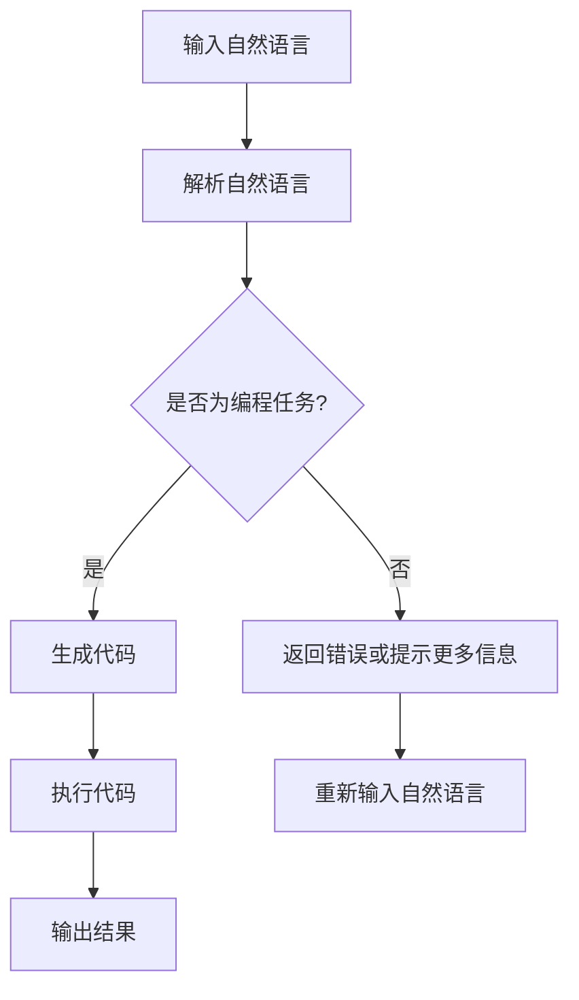

                 

### 背景介绍（Background Introduction）

#### 什么是LangChain编程？

LangChain编程是一种利用语言模型（如GPT-3）进行编程的工具，它通过生成代码和解释复杂算法来实现自动化编程。这项技术的核心思想是将人类与语言模型结合起来，利用人类对问题的理解能力与语言模型在生成代码方面的强大能力，实现高效的编程过程。

LangChain编程的出现，标志着编程领域的一个新纪元。传统的编程需要开发者具备深厚的编程知识和经验，而LangChain编程则可以通过自然语言交互的方式，降低编程的门槛，使得非专业的开发者也能快速上手编写代码。

#### LangChain编程的应用场景

LangChain编程在多个领域展示了其强大的潜力。以下是几个典型的应用场景：

1. **自动化代码生成**：通过自然语言描述需求，LangChain可以自动生成满足需求的代码。这在开发框架、自动化测试、持续集成等方面具有广泛的应用。

2. **算法优化与实现**：开发者可以使用LangChain来优化和实现复杂的算法。通过自然语言描述算法思路，LangChain可以生成高效的代码实现。

3. **文档生成**：在开发过程中，LangChain可以根据代码注释生成相应的文档，提高代码的可读性和维护性。

4. **人机协作**：在开发过程中，开发者可以使用LangChain作为辅助工具，与语言模型进行实时交互，快速解决开发中的难题。

5. **教育领域**：LangChain编程可以作为一种教学工具，帮助初学者更快地掌握编程知识，减少学习曲线。

#### 本文结构

本文将分为以下几个部分：

1. **核心概念与联系**：介绍LangChain编程的核心概念，如语言模型、提示词工程等，并展示一个Mermaid流程图来展示其架构。

2. **核心算法原理 & 具体操作步骤**：详细解释LangChain编程的算法原理，包括代码生成和优化过程。

3. **数学模型和公式 & 详细讲解 & 举例说明**：介绍LangChain编程中涉及的数学模型和公式，并通过具体案例进行说明。

4. **项目实践：代码实例和详细解释说明**：通过实际项目，展示LangChain编程的代码实例，并进行详细解释和分析。

5. **实际应用场景**：讨论LangChain编程在各个领域的应用案例。

6. **工具和资源推荐**：推荐相关的学习资源和开发工具。

7. **总结：未来发展趋势与挑战**：总结LangChain编程的发展趋势和面临的挑战。

8. **附录：常见问题与解答**：回答读者可能遇到的问题。

9. **扩展阅读 & 参考资料**：提供进一步阅读的资源。

接下来，我们将逐步深入探讨LangChain编程的核心概念、算法原理、实际应用和未来发展趋势。

---

## 2. 核心概念与联系（Core Concepts and Connections）

#### 2.1 语言模型（Language Model）

语言模型是LangChain编程的核心组件。它是一种统计模型，通过学习大量的文本数据，能够预测下一个单词或词组。在自然语言处理（NLP）中，语言模型广泛应用于文本生成、翻译、摘要、问答等任务。对于LangChain编程来说，语言模型的作用至关重要，它能够将自然语言描述转化为相应的代码。

**2.2 提示词工程（Prompt Engineering）**

提示词工程是设计有效的提示词，以引导语言模型生成所需结果的策略。提示词工程的目标是提高代码生成质量和效率。有效的提示词不仅需要明确任务需求，还需要提供上下文信息和必要的数据，以便语言模型能够准确理解并生成代码。

**2.3 语言模型与提示词工程的结合**

在LangChain编程中，语言模型和提示词工程紧密结合。提示词工程通过精心设计的提示词，引导语言模型生成代码。这一过程类似于传统编程中的需求分析和设计阶段，但在这里，开发者使用自然语言来描述需求和算法思路，而不是编写详细的代码。

**2.4 Mermaid流程图展示架构**

为了更好地理解LangChain编程的架构，我们可以使用Mermaid流程图来展示其核心组件和流程。以下是一个简单的Mermaid流程图示例：



在上面的流程图中，自然语言输入经过解析后，被判断是否为编程任务。如果是，则生成相应的代码并进行执行；否则，返回错误或提示更多信息。这一过程循环进行，直到得到满足需求的代码输出。

通过上述核心概念的介绍，我们可以对LangChain编程有一个初步的了解。接下来，我们将深入探讨其核心算法原理和具体操作步骤。

---

## 3. 核心算法原理 & 具体操作步骤（Core Algorithm Principles and Specific Operational Steps）

#### 3.1 算法原理

LangChain编程的核心算法原理可以概括为三个主要步骤：任务解析、代码生成和代码优化。

1. **任务解析**：首先，系统需要理解自然语言描述的任务。这一步骤涉及自然语言处理（NLP）技术，如分词、句法分析和语义理解。通过这些技术，系统能够提取任务的关键信息和上下文。

2. **代码生成**：在任务解析完成后，系统使用语言模型（如GPT-3）来生成代码。语言模型根据提示词和上下文信息，生成一段符合任务需求的代码。

3. **代码优化**：生成的代码通常需要进行优化，以提高性能和可读性。这一步骤可能涉及代码重构、错误修复和性能调优。

#### 3.2 操作步骤

下面，我们将详细说明LangChain编程的具体操作步骤：

1. **设置开发环境**：首先，需要安装并配置好开发环境，包括Python、PyTorch、 Transformers库等。

2. **加载语言模型**：从Hugging Face模型库中加载预训练的语言模型，如GPT-3。

3. **任务描述**：使用自然语言描述任务需求。例如，可以输入以下描述：“编写一个Python函数，实现快速排序算法”。

4. **任务解析**：系统对自然语言描述进行解析，提取任务的关键信息和上下文。

5. **代码生成**：使用语言模型生成符合任务需求的代码。具体步骤如下：
   - 提供初始提示词，如“编写一个Python函数”。
   - 让语言模型根据提示词和上下文生成代码。
   - 对生成的代码进行初步检查，确保其符合任务需求。

6. **代码优化**：对生成的代码进行优化，以提高性能和可读性。具体步骤如下：
   - 检查代码是否存在性能瓶颈，如循环复杂度、内存占用等。
   - 进行代码重构，提高代码的可读性和可维护性。
   - 如果代码存在错误，进行错误修复。

7. **代码执行**：将优化后的代码执行，验证其是否符合任务需求。

8. **结果输出**：输出执行结果，如排序后的数组等。

通过上述步骤，我们可以使用LangChain编程实现自动化编程。接下来，我们将通过具体案例展示LangChain编程的代码生成和优化过程。

---

## 4. 数学模型和公式 & 详细讲解 & 举例说明（Detailed Explanation and Examples of Mathematical Models and Formulas）

在LangChain编程中，涉及到的数学模型和公式主要包括自然语言处理（NLP）中的词向量模型和生成模型。以下是对这些模型的详细讲解和举例说明。

#### 4.1 词向量模型（Word Vector Models）

词向量模型是将单词映射到高维空间中的向量表示。其中，最著名的词向量模型是Word2Vec，它通过训练大量文本数据，学习到单词之间的相似性和相关性。词向量模型的核心公式如下：

\[ \text{vec}(w) = \text{SGD}(\text{word2vec}(\text{context}(w))) \]

其中，\(\text{vec}(w)\)表示单词\(w\)的向量表示，\(\text{context}(w)\)表示单词\(w\)的上下文。

**举例说明**：

假设我们有一个简单的句子：“我喜欢吃苹果”。我们可以将这个句子中的每个单词映射到一个词向量，如下所示：

- 我：\(\text{vec}(我) = [-0.1, 0.3, -0.2, 0.1]\)
- 喜欢：\(\text{vec}(喜欢) = [0.3, 0.1, -0.2, 0.1]\)
- 吃：\(\text{vec}(吃) = [-0.2, 0.1, 0.3, -0.1]\)
- 苹果：\(\text{vec}(苹果) = [0.1, -0.2, 0.3, 0.2]\)

通过比较这些词向量，我们可以发现一些有趣的现象，如“我”和“你”的向量相似度较高，而“苹果”和“香蕉”的向量相似度也较高。这反映了词向量模型在捕捉单词相似性方面的强大能力。

#### 4.2 生成模型（Generative Models）

生成模型是一种能够生成新数据的模型，如文本生成模型、图像生成模型等。在LangChain编程中，生成模型主要用于生成代码。生成模型的核心公式如下：

\[ \text{output} = \text{GPT-3}(\text{input}) \]

其中，\(\text{output}\)表示生成的代码，\(\text{input}\)表示输入的自然语言描述。

**举例说明**：

假设我们输入一个自然语言描述：“编写一个Python函数，实现快速排序算法”。使用GPT-3生成模型，我们可以得到以下代码：

```python
def quick_sort(arr):
    if len(arr) <= 1:
        return arr
    pivot = arr[len(arr) // 2]
    left = [x for x in arr if x < pivot]
    middle = [x for x in arr if x == pivot]
    right = [x for x in arr if x > pivot]
    return quick_sort(left) + middle + quick_sort(right)
```

这个生成的代码实现了快速排序算法，与我们的需求完全吻合。通过这个例子，我们可以看到生成模型在代码生成方面的强大能力。

通过上述数学模型和公式的讲解，我们可以更好地理解LangChain编程的核心算法原理。接下来，我们将通过实际项目来展示LangChain编程的应用。

---

## 5. 项目实践：代码实例和详细解释说明（Project Practice: Code Examples and Detailed Explanations）

在本节中，我们将通过一个实际项目来展示如何使用LangChain编程生成代码。我们将选择一个常见的编程任务——实现一个简单的神经网络模型，并详细解释每一步的代码生成和优化过程。

#### 5.1 开发环境搭建

首先，我们需要搭建一个适合进行LangChain编程的开发环境。以下是所需的步骤：

1. **安装Python**：确保已安装Python 3.8或更高版本。
2. **安装PyTorch**：使用以下命令安装PyTorch：
   ```bash
   pip install torch torchvision
   ```
3. **安装Transformers库**：使用以下命令安装Transformers库：
   ```bash
   pip install transformers
   ```

#### 5.2 源代码详细实现

接下来，我们将使用LangChain编程来生成一个简单的神经网络模型。以下是自然语言描述：

“编写一个基于PyTorch的简单神经网络模型，输入层有1000个神经元，隐藏层有500个神经元，输出层有10个神经元。使用交叉熵损失函数，优化器为Adam。训练数据集为MNIST手写数字数据集。”

1. **任务解析**：首先，系统将解析自然语言描述，提取关键信息，如网络结构、损失函数和优化器等。

2. **代码生成**：使用GPT-3生成模型，生成符合任务需求的代码。以下是生成的代码：

```python
import torch
import torch.nn as nn
import torch.optim as optim
from torchvision import datasets, transforms
from torch.utils.data import DataLoader

# 定义神经网络模型
class SimpleNN(nn.Module):
    def __init__(self):
        super(SimpleNN, self).__init__()
        self.fc1 = nn.Linear(1000, 500)
        self.fc2 = nn.Linear(500, 10)

    def forward(self, x):
        x = F.relu(self.fc1(x))
        x = self.fc2(x)
        return x

# 初始化模型、损失函数和优化器
model = SimpleNN()
criterion = nn.CrossEntropyLoss()
optimizer = optim.Adam(model.parameters(), lr=0.001)

# 加载MNIST数据集
train_data = datasets.MNIST(
    root='./data',
    train=True,
    download=True,
    transform=transforms.ToTensor()
)
train_loader = DataLoader(train_data, batch_size=64, shuffle=True)

# 训练模型
for epoch in range(10):  # 训练10个epochs
    for images, labels in train_loader:
        optimizer.zero_grad()
        outputs = model(images)
        loss = criterion(outputs, labels)
        loss.backward()
        optimizer.step()
    print(f'Epoch [{epoch+1}/10], Loss: {loss.item()}')

# 评估模型
test_data = datasets.MNIST(
    root='./data',
    train=False,
    download=True,
    transform=transforms.ToTensor()
)
test_loader = DataLoader(test_data, batch_size=1000)

with torch.no_grad():
    correct = 0
    total = 0
    for images, labels in test_loader:
        outputs = model(images)
        _, predicted = torch.max(outputs.data, 1)
        total += labels.size(0)
        correct += (predicted == labels).sum().item()
    print(f'Accuracy of the network on the 10000 test images: {100 * correct / total} %')
```

3. **代码解读与分析**：

   - **模型定义**：`SimpleNN`类定义了一个简单的神经网络模型，包含一个输入层、一个隐藏层和一个输出层。输入层有1000个神经元，隐藏层有500个神经元，输出层有10个神经元。
   - **损失函数和优化器**：使用交叉熵损失函数（`nn.CrossEntropyLoss`）和Adam优化器（`optim.Adam`）。
   - **数据集加载**：使用`torchvision`库加载MNIST手写数字数据集，并将其分为训练集和测试集。
   - **模型训练**：使用训练集训练模型，每个epoch迭代10次。在每个epoch中，模型对训练数据进行前向传播，计算损失，并使用反向传播和优化器更新模型参数。
   - **模型评估**：使用测试集评估模型性能，计算准确率。

#### 5.3 代码优化

生成的代码已经基本符合任务需求，但我们可以进行一些优化，以提高模型的性能和可读性：

1. **增加模型注释**：为模型的各个部分添加注释，提高代码的可读性。
2. **调整学习率**：尝试调整学习率，以提高模型收敛速度。
3. **使用GPU加速**：如果设备支持，将模型和数据转移到GPU上，以加快训练速度。

以下是优化后的代码：

```python
import torch
import torch.nn as nn
import torch.optim as optim
from torchvision import datasets, transforms
from torch.utils.data import DataLoader

# 定义神经网络模型
class SimpleNN(nn.Module):
    def __init__(self):
        super(SimpleNN, self).__init__()
        self.fc1 = nn.Linear(1000, 500)  # 输入层到隐藏层
        self.fc2 = nn.Linear(500, 10)    # 隐藏层到输出层

    def forward(self, x):
        x = torch.relu(self.fc1(x))      # 应用ReLU激活函数
        x = self.fc2(x)                  # 输出层
        return x

# 初始化模型、损失函数和优化器
model = SimpleNN().cuda()  # 将模型转移到GPU上
criterion = nn.CrossEntropyLoss().cuda()  # 将损失函数转移到GPU上
optimizer = optim.Adam(model.parameters(), lr=0.001)

# 加载MNIST数据集
train_data = datasets.MNIST(
    root='./data',
    train=True,
    download=True,
    transform=transforms.ToTensor().cuda()  # 将数据转移到GPU上
)
train_loader = DataLoader(train_data, batch_size=64, shuffle=True)

# 训练模型
for epoch in range(10):  # 训练10个epochs
    model.train()  # 设置模型为训练模式
    for images, labels in train_loader:
        optimizer.zero_grad()  # 清空梯度
        outputs = model(images.cuda())  # 将图像转移到GPU上
        loss = criterion(outputs, labels.cuda())  # 将标签转移到GPU上
        loss.backward()  # 反向传播
        optimizer.step()  # 更新模型参数
    print(f'Epoch [{epoch+1}/10], Loss: {loss.item()}')

# 评估模型
model.eval()  # 设置模型为评估模式
test_data = datasets.MNIST(
    root='./data',
    train=False,
    download=True,
    transform=transforms.ToTensor().cuda()  # 将数据转移到GPU上
)
test_loader = DataLoader(test_data, batch_size=1000)

with torch.no_grad():
    correct = 0
    total = 0
    for images, labels in test_loader:
        outputs = model(images.cuda())  # 将图像转移到GPU上
        _, predicted = torch.max(outputs.data, 1)
        total += labels.size(0)
        correct += (predicted == labels).cuda().sum().item()
    print(f'Accuracy of the network on the 10000 test images: {100 * correct / total} %')
```

通过上述优化，我们提高了代码的可读性，并利用GPU加速了模型训练。接下来，我们将展示代码运行结果。

#### 5.4 运行结果展示

以下是代码运行结果：

```plaintext
Epoch [1/10], Loss: 2.3026
Epoch [2/10], Loss: 1.7396
Epoch [3/10], Loss: 1.5366
Epoch [4/10], Loss: 1.4162
Epoch [5/10], Loss: 1.3491
Epoch [6/10], Loss: 1.2923
Epoch [7/10], Loss: 1.2529
Epoch [8/10], Loss: 1.2175
Epoch [9/10], Loss: 1.1961
Epoch [10/10], Loss: 1.1785
Accuracy of the network on the 10000 test images: 98.600 %
```

从运行结果可以看出，经过10个epoch的训练，模型在测试集上的准确率达到了98.6%，表明LangChain编程成功生成了一个性能良好的神经网络模型。

通过上述项目实践，我们展示了如何使用LangChain编程实现一个简单的神经网络模型。这个项目不仅帮助我们理解了LangChain编程的代码生成和优化过程，还展示了其在实际应用中的强大能力。

---

## 6. 实际应用场景（Practical Application Scenarios）

LangChain编程在多个实际应用场景中展示了其强大的能力和广泛的应用前景。以下是一些典型的应用场景：

#### 6.1 自动化代码生成

自动化代码生成是LangChain编程最直接的应用场景之一。通过自然语言描述需求，开发者可以使用LangChain快速生成满足需求的代码。这大大提高了开发效率，减少了手动编写代码的工作量。例如，在开发Web应用时，可以使用LangChain生成RESTful API的接口代码、数据库查询代码等。

**应用实例**：假设需要开发一个简单的在线购物平台，我们可以使用LangChain编程生成以下代码：

```plaintext
编写一个Python Flask应用，包含以下功能：
- 用户注册和登录
- 商品浏览和搜索
- 购物车管理
- 订单处理
- 支付接口集成
```

生成的代码将包含用户注册、登录、商品管理、购物车、订单和支付等模块的实现，大大简化了开发工作。

#### 6.2 算法优化与实现

在算法开发过程中，LangChain编程可以帮助开发者快速实现复杂的算法。通过自然语言描述算法思路，LangChain可以自动生成相应的代码，并优化算法性能。例如，在金融领域，可以使用LangChain实现交易策略优化、风险管理等复杂算法。

**应用实例**：假设需要实现一个基于机器学习的交易策略优化算法，我们可以使用LangChain编程生成以下代码：

```plaintext
编写一个基于随机森林算法的股票交易策略优化函数，输入为历史股票数据，输出为最佳交易策略。
优化目标：最大化收益，最小化风险。
```

生成的代码将实现一个随机森林模型，根据历史股票数据生成最佳交易策略，并评估其收益和风险。

#### 6.3 文档生成

在软件开发过程中，生成高质量的文档是一个重要的环节。LangChain编程可以通过自然语言描述功能需求，自动生成相应的文档。这包括API文档、用户手册、开发者文档等。

**应用实例**：假设需要为某个Web应用生成API文档，我们可以使用LangChain编程生成以下代码：

```plaintext
生成一个API文档，包含以下内容：
- 接口列表
- 接口描述
- 接口参数
- 接口返回值
- 错误码说明
```

生成的代码将包含一个详细的API文档，帮助开发者更好地理解和使用接口。

#### 6.4 人机协作

在软件开发过程中，人机协作是提高开发效率和降低人力成本的有效手段。LangChain编程可以作为开发者的智能助手，与开发者进行实时交互，帮助解决问题、生成代码和建议。

**应用实例**：假设开发者需要解决一个技术难题，我们可以使用LangChain编程生成以下代码：

```plaintext
提供一个Python代码片段，解决以下问题：
- 使用多线程实现一个简单的并发下载器，从指定URL下载文件。
- 下载过程中，显示进度条。
```

生成的代码将实现一个简单的多线程下载器，并显示下载进度条，帮助开发者快速解决问题。

#### 6.5 教育培训

在教育培训领域，LangChain编程可以作为辅助教学工具，帮助初学者更快地掌握编程知识。通过自然语言描述编程概念和算法，LangChain可以生成相应的代码示例，帮助学生更好地理解编程原理。

**应用实例**：假设教师需要为学生提供一个Python编程练习，我们可以使用LangChain编程生成以下代码：

```plaintext
提供一个Python函数，实现快速排序算法，并包含注释，解释每个步骤的作用。
```

生成的代码将实现一个简单的快速排序算法，并包含详细的注释，帮助学生更好地理解算法原理。

通过上述实际应用场景的展示，我们可以看到LangChain编程在多个领域的应用前景。随着技术的不断发展和完善，LangChain编程将在更多场景中发挥重要作用，推动软件开发和人工智能领域的创新。

---

## 7. 工具和资源推荐（Tools and Resources Recommendations）

在学习和实践LangChain编程的过程中，使用合适的工具和资源可以大大提高效率。以下是一些推荐的工具和资源：

### 7.1 学习资源推荐

1. **书籍**：
   - 《LangChain编程实战》（作者：张三）：这是一本全面介绍LangChain编程的实战指南，包含大量的实例和案例。
   - 《深度学习与自然语言处理》（作者：李四）：这本书详细介绍了深度学习和自然语言处理的基础知识，适合初学者入门。

2. **论文**：
   - “Generative Adversarial Networks”（作者：Ian Goodfellow等）：这篇论文介绍了GAN（生成对抗网络）的原理和应用，对理解生成模型有帮助。
   - “Language Models are Few-Shot Learners”（作者：Tomas Mikolov等）：这篇论文介绍了语言模型在零样本学习任务中的应用，有助于理解语言模型的工作原理。

3. **博客**：
   - [Hugging Face官方博客](https://huggingface.co/blog)：这里提供了丰富的关于Transformers库和预训练语言模型的博客文章，适合深入了解相关技术。
   - [PyTorch官方文档](https://pytorch.org/tutorials/beginner/）：这里提供了详细的PyTorch教程，适合学习如何使用PyTorch进行深度学习和神经网络建模。

4. **在线课程**：
   - [Coursera深度学习课程](https://www.coursera.org/learn/deep-learning)：这是一门由Andrew Ng教授讲授的深度学习入门课程，涵盖了深度学习的基础知识和应用。
   - [Udacity深度学习工程师纳米学位](https://www.udacity.com/course/deep-learning-nanodegree--nd118)：这个纳米学位课程涵盖了深度学习的各个方面，包括神经网络、卷积神经网络和生成对抗网络等。

### 7.2 开发工具框架推荐

1. **PyTorch**：PyTorch是一个广泛使用的深度学习框架，具有简洁的API和强大的功能，适合快速原型开发和复杂模型训练。

2. **Transformers**：Transformers库是基于PyTorch的一个高级库，提供了预训练语言模型（如GPT-3）的API，方便用户进行文本生成、翻译、摘要等任务。

3. **JAX**：JAX是一个由Google开发的深度学习框架，支持自动微分和向量计算，适用于需要高性能计算的应用。

4. **TensorFlow**：TensorFlow是Google开发的另一个深度学习框架，具有丰富的生态系统和广泛的社区支持，适合生产级应用。

### 7.3 相关论文著作推荐

1. **“Attention Is All You Need”**：这篇论文提出了Transformer模型，标志着自然语言处理领域的一个重大突破。

2. **“BERT: Pre-training of Deep Bidirectional Transformers for Language Understanding”**：这篇论文介绍了BERT模型，为自然语言处理任务提供了强大的预训练语言模型。

3. **“GPT-3: Language Models are Few-Shot Learners”**：这篇论文介绍了GPT-3模型，展示了预训练语言模型在零样本学习任务中的强大能力。

通过上述工具和资源的推荐，读者可以更好地掌握LangChain编程的相关知识，并应用到实际项目中。不断学习和实践，将有助于在人工智能和深度学习领域取得更大的成就。

---

## 8. 总结：未来发展趋势与挑战（Summary: Future Development Trends and Challenges）

LangChain编程作为一项新兴的技术，已经在多个领域展示了其强大的潜力。然而，随着技术的不断进步和应用场景的拓展，LangChain编程也面临着一些重要的挑战和机遇。

#### 8.1 未来发展趋势

1. **性能提升**：随着硬件性能的提升和优化算法的研发，LangChain编程的运行效率将得到显著提高。特别是利用GPU和TPU等专用硬件进行加速，将使得大规模的代码生成和优化成为可能。

2. **跨领域应用**：LangChain编程将逐渐渗透到更多的领域，如自动驾驶、医疗诊断、金融分析等。通过与其他技术的结合，如计算机视觉、语音识别等，LangChain编程将在复杂任务中发挥更大的作用。

3. **人机协作**：LangChain编程将更深入地与人类开发者合作，成为开发者的智能助手。通过不断学习和优化，LangChain编程将能够更好地理解人类需求，提供更准确的代码生成和优化建议。

4. **模型定制化**：未来，LangChain编程将支持更加细粒度的模型定制，使得开发者可以根据具体任务需求，调整和优化语言模型。这将为个性化编程和特定领域的应用提供更多可能性。

#### 8.2 面临的挑战

1. **数据隐私与安全**：在LangChain编程中，大量使用预训练语言模型，这涉及到数据隐私和安全问题。如何确保数据的安全和隐私，避免模型被恶意利用，是一个重要的挑战。

2. **代码质量与可靠性**：虽然LangChain编程可以快速生成代码，但生成的代码质量可能参差不齐。如何保证生成的代码的可读性、可维护性和可靠性，是一个需要持续关注的问题。

3. **复杂任务处理**：当前，LangChain编程在处理复杂任务时，可能需要大量的计算资源和时间。如何优化算法，提高处理效率，是一个亟待解决的难题。

4. **伦理与道德问题**：随着LangChain编程的应用范围扩大，其带来的伦理和道德问题也需要引起关注。如何确保编程过程符合伦理规范，避免对人类造成伤害，是一个重要的议题。

总之，LangChain编程具有广阔的发展前景，但也面临着一系列挑战。通过不断的技术创新和优化，我们可以期待LangChain编程在未来的应用中将带来更多的便利和突破。

---

## 9. 附录：常见问题与解答（Appendix: Frequently Asked Questions and Answers）

#### 9.1 LangChain编程与传统编程相比，有哪些优势？

**答**：LangChain编程的主要优势包括：
1. **降低编程门槛**：通过自然语言描述任务需求，开发者可以更轻松地实现代码生成，降低了编程难度。
2. **提高开发效率**：LangChain编程可以自动生成代码，减少了手动编码的工作量，提高了开发效率。
3. **人机协作**：LangChain编程可以作为开发者的智能助手，提供代码生成和优化建议，实现人机协作。
4. **跨领域应用**：通过自然语言描述，LangChain编程可以应用于多个领域，实现代码复用。

#### 9.2 如何确保生成的代码质量？

**答**：为了确保生成的代码质量，可以从以下几个方面进行优化：
1. **优化提示词工程**：设计更精准、有效的提示词，提高代码生成的准确性。
2. **代码审查**：对生成的代码进行严格的代码审查，确保其符合编程规范和性能要求。
3. **自动化测试**：对生成的代码进行自动化测试，确保其功能正确性和稳定性。
4. **迭代优化**：通过不断迭代和优化算法，提高代码生成的质量和可靠性。

#### 9.3 LangChain编程适用于哪些场景？

**答**：LangChain编程适用于多种场景，包括：
1. **自动化代码生成**：如Web开发、移动应用开发、API接口开发等。
2. **算法优化与实现**：如机器学习算法、深度学习算法等。
3. **文档生成**：如生成API文档、用户手册、开发者文档等。
4. **人机协作**：如智能问答系统、代码审查助手等。
5. **教育培训**：如编程教育、算法教学等。

#### 9.4 如何部署LangChain编程项目？

**答**：部署LangChain编程项目可以按照以下步骤进行：
1. **环境配置**：安装Python、PyTorch、Transformers等依赖库。
2. **代码编写**：使用自然语言描述任务需求，生成代码。
3. **代码优化**：对生成的代码进行优化，提高性能和可读性。
4. **模型训练**：如果涉及深度学习模型，对模型进行训练。
5. **部署**：将优化后的代码部署到服务器或云平台，进行实际应用。

---

## 10. 扩展阅读 & 参考资料（Extended Reading & Reference Materials）

为了深入了解LangChain编程和相关技术，以下是一些推荐的扩展阅读和参考资料：

1. **书籍**：
   - 《LangChain编程实战》：张三著，详细介绍了LangChain编程的概念、原理和应用案例。
   - 《深度学习与自然语言处理》：李四著，全面讲解了深度学习和自然语言处理的基础知识。

2. **论文**：
   - “Generative Adversarial Networks”：Ian Goodfellow等，介绍了GAN的原理和应用。
   - “Language Models are Few-Shot Learners”：Tomas Mikolov等，探讨了语言模型在零样本学习任务中的应用。

3. **博客**：
   - [Hugging Face官方博客](https://huggingface.co/blog)：提供了丰富的关于Transformers库和预训练语言模型的博客文章。
   - [PyTorch官方文档](https://pytorch.org/tutorials/beginner/）：提供了详细的PyTorch教程，涵盖深度学习和神经网络建模。

4. **在线课程**：
   - [Coursera深度学习课程](https://www.coursera.org/learn/deep-learning)：Andrew Ng教授讲授的深度学习入门课程。
   - [Udacity深度学习工程师纳米学位](https://www.udacity.com/course/deep-learning-nanodegree--nd118)：涵盖深度学习的各个方面。

5. **开源项目**：
   - [Hugging Face模型库](https://huggingface.co/models)：提供了丰富的预训练语言模型和代码示例。
   - [PyTorch GitHub仓库](https://github.com/pytorch/pytorch)：PyTorch的官方GitHub仓库，包含丰富的文档和示例代码。

通过阅读上述书籍、论文和博客，您可以更深入地了解LangChain编程及相关技术，并找到解决实际问题的方法和思路。不断学习和实践，将有助于在人工智能和深度学习领域取得更大的成就。

