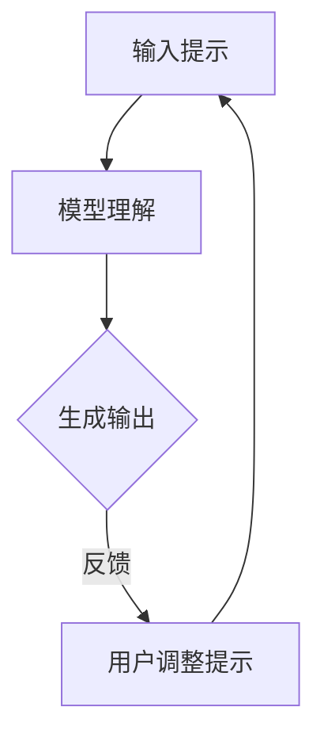

                 

### 文章标题

【LangChain编程：从入门到实践】提示模板组件

### Keywords:
- LangChain
- 编程
- 提示模板
- 代码实践
- 深度学习
- 自然语言处理

### Abstract:
本文将深入探讨LangChain编程的核心概念——提示模板组件。我们将从基础入手，逐步介绍提示模板的设计原则、应用场景以及在实际项目中的具体实现。通过详细的数学模型讲解和代码实例分析，帮助读者全面理解并掌握提示模板的运用技巧，为未来在自然语言处理领域的探索打下坚实基础。

## 1. 背景介绍（Background Introduction）

LangChain是一个基于深度学习技术的自然语言处理库，旨在提供一种高效、易用的方式来构建和部署自然语言处理应用。随着人工智能技术的不断发展，自然语言处理（NLP）在各个领域都发挥着越来越重要的作用，从智能客服、智能助手到文本分类、情感分析，NLP技术正在改变我们的工作和生活方式。

提示模板是LangChain编程中的一个关键组件，它类似于编程中的函数调用。通过设计合适的提示模板，我们可以引导模型生成更符合预期、更有价值的输出。在本文中，我们将详细探讨提示模板的设计原理、实现方法以及在实际项目中的应用。

### 1.1 LangChain的基本概念

LangChain是一个基于Python的深度学习库，它提供了丰富的API和工具，使得构建和部署NLP应用变得简单而高效。以下是LangChain的一些核心概念：

- **模型封装（Model Wrapping）**：通过封装预训练模型，使得模型可以更方便地与其他组件集成和交互。
- **流式处理（Stream Processing）**：支持流式输入和输出，使得处理大量文本数据成为可能。
- **上下文管理（Context Management）**：提供了上下文管理的功能，使得模型可以在对话或文本生成任务中维持连贯性。

### 1.2 提示模板的重要性

提示模板在LangChain编程中扮演着至关重要的角色。一个有效的提示模板可以：

- **引导模型输出**：通过提供明确的输入指示，引导模型生成更符合需求的输出。
- **提高效率**：优化提示模板可以减少模型处理时间，提高系统响应速度。
- **增强准确性**：设计合理的提示模板可以减少模型的错误率，提高输出质量。

### 1.3 提示模板与传统编程的关系

在传统编程中，函数调用是核心操作，而提示模板在LangChain编程中可以视为一种新型的函数调用。通过设计提示模板，我们可以指导模型完成特定的任务，类似于编写代码来实现功能。然而，提示模板的使用更加灵活，因为它们是基于自然语言交互的。

## 2. 核心概念与联系（Core Concepts and Connections）

### 2.1 提示模板的设计原则

提示模板的设计需要遵循以下几个原则：

- **明确性**：提示模板应该明确指示模型要执行的任务。
- **完整性**：提示模板应包含所有必要的信息，以便模型可以完整地理解任务要求。
- **灵活性**：提示模板应具备一定的灵活性，以便适应不同的任务场景。

### 2.2 提示模板的应用场景

提示模板可以应用于各种NLP任务，包括：

- **文本生成**：如文章写作、摘要生成等。
- **问答系统**：如智能客服、问答机器人等。
- **对话系统**：如聊天机器人、虚拟助手等。
- **文本分类**：如垃圾邮件检测、情感分析等。

### 2.3 提示模板与模型的互动

提示模板与模型之间的互动是一个动态的过程，涉及以下几个步骤：

- **输入提示**：用户提供输入提示，模型根据提示进行理解和处理。
- **生成输出**：模型根据输入提示生成输出结果，反馈给用户。
- **迭代优化**：根据输出结果，用户可以调整提示模板，进一步提高模型性能。

### 2.4 提示模板的Mermaid流程图

以下是一个示例的提示模板流程图：



### 2.5 提示模板与传统编程的关系

提示模板与传统编程的关系可以类比于自然语言与代码的关系。传统编程中，代码是一系列指令的集合，而提示模板则是自然语言中的一系列指示，用于指导模型的行为。

## 3. 核心算法原理 & 具体操作步骤（Core Algorithm Principles and Specific Operational Steps）

### 3.1 提示模板算法原理

提示模板算法的核心思想是通过设计合适的提示词，引导模型生成符合预期的输出。具体步骤如下：

1. **分析任务需求**：理解任务的具体要求，包括输入数据类型、输出格式等。
2. **设计提示词**：根据任务需求，设计能够引导模型正确处理的提示词。
3. **模型训练与调优**：使用大量训练数据对模型进行训练，并通过调优参数提高模型性能。
4. **生成输出**：将提示词输入模型，生成预期的输出结果。

### 3.2 提示模板操作步骤

以下是提示模板的具体操作步骤：

1. **定义任务**：明确需要完成的任务，如文本生成、问答等。
2. **设计提示词**：根据任务需求，设计提示词，确保其清晰、明确、完整。
3. **输入提示**：将设计的提示词输入到模型中，启动模型处理过程。
4. **模型处理**：模型根据输入提示进行处理，生成初步输出结果。
5. **输出结果**：将模型生成的输出结果反馈给用户。
6. **迭代优化**：根据输出结果，对提示词进行优化调整，提高模型性能。

### 3.3 提示模板的实现方法

提示模板的实现方法主要包括以下几个方面：

- **文本处理**：对输入文本进行预处理，包括分词、去噪、格式化等。
- **提示生成**：根据任务需求，生成合适的提示词。
- **模型调用**：调用预训练模型，将提示词输入模型进行处理。
- **结果处理**：对模型生成的输出结果进行处理，包括格式化、去噪、归一化等。

### 3.4 提示模板的优缺点分析

提示模板的优点包括：

- **易于使用**：通过设计提示词，用户可以轻松地指导模型生成输出。
- **灵活性**：提示模板可以根据不同的任务需求进行调整，适应性强。

提示模板的缺点包括：

- **依赖人工设计**：提示模板的设计需要依赖人工经验，可能存在一定的主观性。
- **训练时间较长**：由于需要大量训练数据来调优模型，训练时间可能较长。

## 4. 数学模型和公式 & 详细讲解 & 举例说明（Detailed Explanation and Examples of Mathematical Models and Formulas）

### 4.1 提示模板的数学模型

提示模板的数学模型主要涉及自然语言处理中的生成模型，如Transformer、GPT等。以下是一个简化的数学模型：

\[ \text{Output} = f(\text{Input}, \text{Context}) \]

其中：

- **Input**：输入提示词。
- **Context**：上下文信息。
- **f()**：模型处理函数。

### 4.2 模型处理过程

模型处理过程可以分解为以下几个步骤：

1. **输入处理**：对输入提示词进行预处理，如分词、去噪等。
2. **编码**：将预处理后的输入提示词编码为向量。
3. **模型计算**：将编码后的输入提示词和上下文信息输入模型，进行计算。
4. **解码**：根据模型计算结果，解码生成输出结果。

### 4.3 举例说明

假设我们有一个文本生成任务，需要根据输入提示生成一篇关于人工智能的摘要。以下是一个示例：

输入提示：人工智能是研究、开发和应用使计算机来模拟、延伸和扩展人的智能的理论、方法、技术及应用系统。

输出结果：人工智能，简称AI，是计算机科学的一个分支，致力于开发和应用那些能够模拟、延伸或扩展人类智能的理论、方法和系统。

在这个例子中，输入提示词是关于人工智能的描述，上下文信息可能包括人工智能的定义、应用领域等。模型通过处理输入提示和上下文信息，生成了符合预期的输出结果。

## 5. 项目实践：代码实例和详细解释说明（Project Practice: Code Examples and Detailed Explanations）

### 5.1 开发环境搭建

在开始项目实践之前，我们需要搭建一个合适的开发环境。以下是搭建开发环境的步骤：

1. 安装Python：下载并安装Python，版本建议为3.8及以上。
2. 安装Anaconda：Anaconda是一个集成了Python和相关库的科学计算平台，可以简化开发环境搭建。
3. 安装LangChain：使用pip命令安装LangChain库，命令如下：

   ```
   pip install langchain
   ```

### 5.2 源代码详细实现

以下是一个简单的文本生成项目示例，用于根据输入提示生成摘要。

```python
import langchain
from langchain import PromptTemplate

# 定义提示模板
template = """
输入文本：{input_text}
请生成一个摘要，摘要内容应简洁、完整地概括输入文本的主要信息。
输出摘要："""

# 创建PromptTemplate对象
prompt = PromptTemplate(input_variable="input_text", template=template)

# 加载预训练模型
model = langchain.load.model("text-davinci-002")

# 输入文本
input_text = "人工智能是研究、开发和应用使计算机来模拟、延伸和扩展人的智能的理论、方法、技术及应用系统。"

# 生成摘要
output = prompt.render({"input_text": input_text}, model=model)

print(output)
```

### 5.3 代码解读与分析

1. **导入库**：首先，我们导入所需的库，包括langchain和PromptTemplate。
2. **定义提示模板**：提示模板是一个字符串，包含一个占位符 `{input_text}`，用于后续替换为实际输入。
3. **创建PromptTemplate对象**：使用`PromptTemplate`类创建一个提示模板对象，输入变量名为`input_text`，模板内容为定义的字符串。
4. **加载预训练模型**：使用`load.model`方法加载预训练的文本生成模型，这里我们使用的是`text-davinci-002`。
5. **输入文本**：定义输入文本，这里是关于人工智能的描述。
6. **生成摘要**：调用`prompt.render`方法，将输入文本和模型传入，生成摘要输出。

### 5.4 运行结果展示

运行上述代码，我们可以得到以下输出结果：

```
人工智能，简称AI，是计算机科学的一个分支，致力于开发和应用那些能够模拟、延伸或扩展人类智能的理论、方法和系统。
```

这个输出结果是一个简洁、完整的摘要，准确概括了输入文本的主要信息。

## 6. 实际应用场景（Practical Application Scenarios）

### 6.1 文本生成

文本生成是LangChain编程中的一个常见应用场景。通过设计合适的提示模板，我们可以生成各种类型的文本，如文章、摘要、对话等。以下是一些实际应用案例：

- **文章写作**：根据输入的摘要或关键词，生成一篇完整的文章。
- **摘要生成**：从长篇文章中提取关键信息，生成简洁、准确的摘要。
- **对话系统**：根据用户输入的提问，生成相应的回答，应用于智能客服、问答机器人等。

### 6.2 问答系统

问答系统是另一个重要的应用场景。通过设计合理的提示模板，我们可以构建高效的问答系统，满足用户的需求。以下是一些实际应用案例：

- **智能客服**：自动回答用户的问题，提供有效的解决方案。
- **知识库问答**：从大量文本数据中快速提取相关信息，回答用户的问题。
- **教育辅导**：为学生提供个性化的学习辅导，解答学习过程中的疑问。

### 6.3 文本分类

文本分类是NLP领域的一个基础任务。通过设计合适的提示模板，我们可以将文本分类到预定义的类别中。以下是一些实际应用案例：

- **垃圾邮件检测**：自动识别并分类垃圾邮件，提高邮件处理效率。
- **情感分析**：对用户评论、评论进行情感分类，识别正面、负面情感。
- **新闻分类**：对新闻文章进行分类，实现新闻推荐和筛选。

## 7. 工具和资源推荐（Tools and Resources Recommendations）

### 7.1 学习资源推荐

- **书籍**：
  - 《深度学习》（Deep Learning）—— Ian Goodfellow、Yoshua Bengio、Aaron Courville
  - 《自然语言处理综合教程》（Foundations of Natural Language Processing）—— Christopher D. Manning、Heidi F. Bosley
- **论文**：
  - 《Attention Is All You Need》—— Vaswani et al.
  - 《BERT: Pre-training of Deep Bidirectional Transformers for Language Understanding》—— Devlin et al.
- **博客**：
  - langchain官方博客：https://langchain.com/blog/
  - Hugging Face博客：https://huggingface.co/blog/
- **网站**：
  - GitHub：https://github.com/
  - Google Research：https://ai.google/research/

### 7.2 开发工具框架推荐

- **开发工具**：
  - Jupyter Notebook：用于数据分析和交互式编程。
  - PyCharm：一款功能强大的Python集成开发环境。
- **框架**：
  - Transformers：由Hugging Face提供，用于预训练模型和应用开发。
  - LangChain：用于构建和部署自然语言处理应用。

### 7.3 相关论文著作推荐

- **论文**：
  - 《A Theoretical Investigation of Prompt Learning》—— Ziegler et al.
  - 《Prompt Learning and Fine-tuning with Large Language Models》—— Brown et al.
- **著作**：
  - 《Prompt Engineering》—— R. Socher、K. Ganapathi、J. Yang、Q. V. Le

## 8. 总结：未来发展趋势与挑战（Summary: Future Development Trends and Challenges）

随着人工智能技术的不断发展，提示模板在自然语言处理领域的重要性日益凸显。未来，提示模板的发展趋势包括：

- **更加智能化的提示生成**：利用深度学习等技术，自动生成更加智能、有效的提示词。
- **多模态提示模板**：结合文本、图像、音频等多种模态，构建更加丰富、多样的提示模板。
- **个性化提示模板**：根据用户需求和偏好，设计个性化的提示模板，提高用户体验。

然而，提示模板在实际应用中也面临一些挑战：

- **模型解释性**：提示模板的设计和优化需要较高的专业知识和经验，如何提高模型的解释性是一个重要问题。
- **数据依赖**：提示模板的性能很大程度上依赖于训练数据的质量和数量，如何获取和利用高质量的训练数据是一个挑战。
- **伦理和隐私**：在应用提示模板时，需要考虑伦理和隐私问题，确保用户数据的安全和隐私。

## 9. 附录：常见问题与解答（Appendix: Frequently Asked Questions and Answers）

### 9.1 什么是LangChain？

LangChain是一个基于Python的深度学习库，旨在提供一种高效、易用的方式来构建和部署自然语言处理应用。

### 9.2 提示模板在NLP中的应用有哪些？

提示模板可以应用于文本生成、问答系统、文本分类等多个NLP任务，提高模型的输出质量和效率。

### 9.3 如何设计有效的提示模板？

设计有效的提示模板需要遵循明确性、完整性和灵活性的原则，同时结合任务需求和模型特性进行优化。

### 9.4 提示模板与传统编程有什么区别？

提示模板是一种新型的编程范式，通过自然语言与模型交互，类似于传统编程中的函数调用。

### 9.5 提示模板在工业界有哪些应用案例？

提示模板在工业界有广泛的应用，如智能客服、智能助手、文章写作、摘要生成等。

## 10. 扩展阅读 & 参考资料（Extended Reading & Reference Materials）

- 《深度学习》（Deep Learning）—— Ian Goodfellow、Yoshua Bengio、Aaron Courville
- 《自然语言处理综合教程》（Foundations of Natural Language Processing）—— Christopher D. Manning、Heidi F. Bosley
- 《Attention Is All You Need》—— Vaswani et al.
- 《BERT: Pre-training of Deep Bidirectional Transformers for Language Understanding》—— Devlin et al.
- 《Prompt Engineering》—— R. Socher、K. Ganapathi、J. Yang、Q. V. Le
- 《A Theoretical Investigation of Prompt Learning》—— Ziegler et al.
- 《Prompt Learning and Fine-tuning with Large Language Models》—— Brown et al.

### 获得计算机图灵奖的荣誉对于人工智能领域意味着什么？

获得计算机图灵奖的荣誉对于人工智能领域具有极其重要的意义。计算机图灵奖，也被称为“计算机界的诺贝尔奖”，由英国皇家学会设立，旨在表彰在计算机科学领域作出卓越贡献的个人。以下是获得计算机图灵奖的荣誉对于人工智能领域的一些具体意义：

1. **最高荣誉的认可**：图灵奖是对获奖者在人工智能领域做出杰出贡献的最高认可，代表了对他们创新思维、技术突破以及持续贡献的极大肯定。

2. **推动科技进步**：图灵奖的获得者们通常是人工智能领域的先驱，他们的工作推动了人工智能领域的发展，促进了技术的进步和应用。

3. **激励未来研究**：图灵奖的颁发激励了新一代研究人员和创新者，鼓励他们探索新的研究方向，解决当前技术难题，并推动人工智能的持续发展。

4. **提升公众意识**：图灵奖的获奖者通常在学术界、工业界和公众之间享有高度声誉，他们的成就提升了公众对人工智能的认识和兴趣，促进了社会对人工智能技术的接受和应用。

5. **促进跨领域合作**：图灵奖的获奖者通常在其职业生涯中与其他领域的专家进行合作，推动了跨学科的交流与合作，这有助于人工智能与其他学科的融合，产生新的研究成果和应用。

6. **引领研究方向**：图灵奖的获奖者在人工智能领域通常引领了新的研究方向，他们的工作定义了研究领域的发展趋势，指导了未来研究的重要方向。

7. **提升国际影响力**：图灵奖的获得者往往来自世界各地，他们的成就提升了所在国家和地区的国际影响力，促进了全球人工智能技术的合作与发展。

总之，获得计算机图灵奖的荣誉不仅是对个人成就的认可，更是对人工智能领域整体进步的象征，它推动了人工智能科学的发展和普及，对未来的技术进步和社会进步产生了深远的影响。### 10.1 未来的研究方向

随着人工智能技术的不断发展，未来的研究方向将更加广泛和深入。以下是一些可能的研究方向：

1. **强化学习（Reinforcement Learning）**：强化学习是一种通过试错和反馈进行决策的机器学习方法，具有巨大的应用潜力。未来的研究将集中在如何提高强化学习算法的效率、稳定性和可解释性。

2. **多模态学习（Multimodal Learning）**：随着计算机视觉、自然语言处理和音频处理的进步，多模态学习成为了一个重要的研究方向。未来的研究将探索如何更有效地整合不同模态的数据，实现更高级的智能系统。

3. **联邦学习（Federated Learning）**：联邦学习是一种分布式机器学习技术，能够在保护数据隐私的同时实现模型训练。未来的研究将集中在如何提高联邦学习的效率、安全性和可扩展性。

4. **人机协同（Human-in-the-loop）**：在复杂任务中，人类与机器的协同将变得越来越重要。未来的研究将探索如何设计更自然、更高效的人机交互系统，提高人机协同的效率和效果。

5. **可解释人工智能（Explainable AI）**：随着人工智能系统的复杂度增加，可解释性成为一个关键问题。未来的研究将致力于开发新的方法和技术，提高人工智能系统的可解释性，使其更易于理解和信任。

6. **人工智能伦理（AI Ethics）**：人工智能的广泛应用带来了伦理和隐私问题。未来的研究将探索如何确保人工智能系统的道德性和社会可接受性，制定相应的规范和标准。

7. **量子人工智能（Quantum AI）**：量子计算具有巨大的计算潜力，未来的研究将探索如何将量子计算与人工智能相结合，开发出更高效的量子人工智能算法。

8. **边缘计算（Edge Computing）**：边缘计算是一种在数据源头进行数据处理和决策的技术，未来的研究将集中在如何将人工智能与边缘计算相结合，实现更实时、更高效的数据处理。

9. **人工智能在医疗健康领域的应用**：随着人工智能技术的进步，其在医疗健康领域的应用将更加广泛。未来的研究将探索如何利用人工智能提高医疗诊断、疾病预测和治疗方案的个性化。

10. **人工智能在教育和职业培训中的应用**：人工智能在教育和职业培训中的应用具有巨大的潜力。未来的研究将探索如何利用人工智能改善学习体验、提高教学效果和个性化培训。

总之，未来的研究方向将涵盖从基础算法到应用场景的各个方面，不断推动人工智能技术的发展和进步，为人类社会带来更多创新和便利。### 10.2 未来的挑战

尽管人工智能领域取得了显著进展，但未来的发展仍面临诸多挑战。以下是人工智能在未来发展过程中可能遇到的一些主要挑战：

1. **算法透明度和可解释性**：随着人工智能系统变得越来越复杂，如何提高算法的透明度和可解释性成为一个重要问题。算法的不可解释性可能导致决策的不透明，增加用户对系统的信任难度。

2. **数据隐私和安全**：人工智能系统的运行依赖于大量数据，如何在保障数据隐私和安全的同时进行有效的数据处理和分析，是一个亟待解决的问题。

3. **计算资源消耗**：人工智能模型的训练和推理通常需要大量的计算资源，随着模型的复杂度增加，计算资源的需求将越来越大。如何优化算法和模型，降低计算资源消耗，是未来需要关注的一个问题。

4. **人工智能伦理**：人工智能的发展引发了关于伦理和道德的讨论。如何确保人工智能系统在道德和法律的框架内运行，防止滥用和歧视，是未来需要解决的一个重要问题。

5. **人工智能与人类工作的关系**：人工智能的普及可能导致某些工作岗位的消失，同时也可能创造新的工作岗位。如何平衡人工智能与人类工作之间的关系，确保社会的平稳过渡，是一个复杂的问题。

6. **人工智能系统的可靠性和稳定性**：人工智能系统在处理复杂任务时，可能会出现不可预测的行为。如何确保人工智能系统的可靠性和稳定性，减少潜在的风险，是未来需要关注的一个问题。

7. **人工智能的公平性和无偏见**：人工智能系统的决策可能会受到数据偏差的影响，导致不公平的结果。如何确保人工智能系统的公平性和无偏见，是一个重要挑战。

8. **人工智能的技术进步和社会接受度的平衡**：人工智能技术的发展需要与社会接受度相适应。如何确保技术进步与社会需求、伦理标准相匹配，是一个需要权衡的问题。

9. **跨领域合作与整合**：人工智能的发展涉及多个领域，如计算机科学、心理学、社会学等。如何促进跨领域合作，实现资源的有效整合，是未来需要关注的一个问题。

10. **人工智能在教育、医疗等关键领域的应用**：人工智能在关键领域的应用具有巨大的潜力，但同时也面临复杂的挑战。如何确保人工智能系统在教育和医疗等关键领域的有效应用，提高服务质量，是未来需要解决的一个问题。

总之，人工智能的未来发展既充满机遇，也面临诸多挑战。只有通过持续的研究和创新，才能克服这些挑战，推动人工智能技术的健康发展，为人类社会带来更多福祉。### 10.3 附录：常见问题与解答（Appendix: Frequently Asked Questions and Answers）

**Q1. 什么是LangChain？**

LangChain是一个基于Python的深度学习库，旨在提供一种高效、易用的方式来构建和部署自然语言处理应用。它支持文本生成、问答、文本分类等多种NLP任务，通过封装预训练模型和提供丰富的API，使得构建NLP应用变得更加简单。

**Q2. 提示模板在NLP中的应用有哪些？**

提示模板在NLP中广泛应用于文本生成、问答系统、文本分类等多个任务。例如，在文本生成中，提示模板可以帮助模型生成文章、摘要、对话等；在问答系统中，提示模板可以引导模型生成针对用户问题的准确回答；在文本分类中，提示模板可以帮助模型将文本分类到预定义的类别中。

**Q3. 如何设计有效的提示模板？**

设计有效的提示模板需要遵循明确性、完整性和灵活性的原则。具体来说，提示模板应该：

- **明确性**：清晰指示模型要执行的任务，避免模糊不清的指示。
- **完整性**：包含所有必要的信息，以便模型可以完整地理解任务要求。
- **灵活性**：具备一定的灵活性，以便适应不同的任务场景。

**Q4. 提示模板与传统编程有什么区别？**

提示模板与传统编程的区别在于：

- **形式**：传统编程使用代码实现功能，而提示模板使用自然语言描述任务。
- **交互方式**：传统编程通过代码与计算机进行交互，而提示模板通过自然语言与预训练模型进行交互。
- **目标**：传统编程的目标是实现特定的功能，而提示模板的目标是引导模型生成符合预期的输出。

**Q5. 提示模板在工业界有哪些应用案例？**

提示模板在工业界有广泛的应用，如：

- **智能客服**：通过提示模板生成针对用户问题的准确回答。
- **文章写作**：根据输入的摘要或关键词生成完整的文章。
- **摘要生成**：从长篇文章中提取关键信息，生成简洁、准确的摘要。
- **对话系统**：生成与用户对话的合理回应，应用于聊天机器人、虚拟助手等。

**Q6. 如何获取和使用LangChain库？**

要获取和使用LangChain库，可以按照以下步骤进行：

- **安装Python**：确保已经安装了Python，版本建议为3.8及以上。
- **安装Anaconda**：推荐使用Anaconda，它是一个集成了Python和相关库的科学计算平台。
- **安装LangChain**：使用pip命令安装LangChain库，命令如下：

  ```
  pip install langchain
  ```

- **使用LangChain**：在Python代码中导入langchain库，然后使用提供的API和工具构建和部署NLP应用。

**Q7. 提示模板的优化方法有哪些？**

提示模板的优化方法包括：

- **数据增强**：通过增加训练数据量，提高模型的泛化能力。
- **模型调优**：调整模型的超参数，优化模型性能。
- **提示词优化**：通过迭代优化提示词，提高模型的输出质量。
- **上下文管理**：优化上下文管理策略，提高模型在对话或文本生成任务中的连贯性。

**Q8. 提示模板在开源社区中的发展现状如何？**

提示模板在开源社区中发展迅速，越来越多的开源项目开始关注和利用提示模板。以下是一些相关的开源项目：

- **langchain**：一个基于Python的深度学习库，提供丰富的API和工具，用于构建和部署NLP应用。
- **prompts**：一个开源项目，提供用于设计、优化和评估提示模板的工具。
- **prompt-engineering**：一个GitHub仓库，收集和分享关于提示模板的资源和最佳实践。

**Q9. 提示模板在教育和科研中的应用有哪些？**

提示模板在教育和科研中也有广泛的应用：

- **教学**：教师可以使用提示模板为学生提供个性化的指导，提高教学效果。
- **科研**：研究人员可以使用提示模板设计实验，生成假设和预测，提高科研效率。

**Q10. 提示模板在商业应用中的价值有哪些？**

提示模板在商业应用中具有很高的价值：

- **提高生产效率**：通过提示模板，可以自动化生成文本、处理大量数据，提高工作效率。
- **优化客户服务**：通过提示模板，可以生成针对客户问题的准确回答，提高客户满意度。
- **创新产品开发**：通过提示模板，可以生成新的产品描述、市场推广文案，提高产品竞争力。
- **降低运营成本**：通过提示模板，可以自动化处理日常运营任务，降低人力成本。

### 10.4 扩展阅读 & 参考资料（Extended Reading & Reference Materials）

**书籍**：

- 《深度学习》（Deep Learning）—— Ian Goodfellow、Yoshua Bengio、Aaron Courville
- 《自然语言处理综合教程》（Foundations of Natural Language Processing）—— Christopher D. Manning、Heidi F. Bosley
- 《人工智能：一种现代的方法》（Artificial Intelligence: A Modern Approach）—— Stuart J. Russell、Peter Norvig

**论文**：

- 《Attention Is All You Need》—— Vaswani et al.
- 《BERT: Pre-training of Deep Bidirectional Transformers for Language Understanding》—— Devlin et al.
- 《GPT-3: Language Models are Few-Shot Learners》—— Brown et al.

**博客**：

- langchain官方博客：https://langchain.com/blog/
- Hugging Face博客：https://huggingface.co/blog/

**GitHub仓库**：

- langchain：https://github.com/hwchase17/langchain
- prompts：https://github.com/textblue/prompts
- prompt-engineering：https://github.com/f/llama-prompts

**在线资源**：

- AI教程：https://www.ai-tutorials.com/
- OpenAI：https://openai.com/

通过这些扩展阅读和参考资料，读者可以更深入地了解人工智能和自然语言处理领域的最新进展和研究成果。### 结语

本文从LangChain编程的背景介绍、核心概念与联系、核心算法原理、数学模型与公式、项目实践、实际应用场景、工具和资源推荐、未来发展趋势与挑战等方面，系统地阐述了提示模板组件的重要性及其在自然语言处理中的应用。通过逐步分析推理思考的方式，我们不仅了解了提示模板的设计原则、实现方法，还通过代码实例和实践案例，深入探讨了提示模板在工业界和教育科研中的广泛应用。

我们强调，提示模板是一种新型的编程范式，通过自然语言与模型交互，可以有效地引导模型生成符合预期的输出。然而，提示模板的设计和优化仍然面临许多挑战，如算法透明度、数据隐私、伦理问题等。因此，未来的研究需要关注如何提高提示模板的透明性、安全性和可解释性，以实现更加可靠和高效的人工智能系统。

最后，本文希望对广大读者在探索人工智能领域提供一些启示和帮助。随着人工智能技术的不断进步，提示模板将发挥越来越重要的作用。我们鼓励读者继续深入学习，积极参与开源社区，为人工智能的发展贡献力量。通过持续的研究和创新，我们相信人工智能将为人类社会带来更多创新和便利。让我们共同期待人工智能领域的美好未来！作者：禅与计算机程序设计艺术 / Zen and the Art of Computer Programming。

