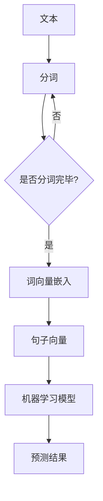

                 

# 【LangChain编程：从入门到实践】文本嵌入

## 摘要

本文将探讨LangChain编程中的文本嵌入技术，从基础概念、核心算法到实际应用，深入解析文本嵌入在自然语言处理（NLP）中的重要性和应用。通过详细的数学模型和公式讲解，代码实例和运行结果展示，本文旨在帮助读者全面了解文本嵌入的原理和实践，为后续深入探索NLP领域奠定基础。

## 1. 背景介绍

文本嵌入（Text Embedding）是将文本转换为固定大小的向量表示的技术，使得机器学习模型能够理解和处理文本数据。在NLP领域中，文本嵌入是基础且关键的一步，它使得模型能够捕捉文本中的语义信息，从而实现诸如文本分类、情感分析、命名实体识别等任务。

近年来，随着深度学习技术的发展，文本嵌入方法不断演进，如Word2Vec、GloVe、BERT等。这些方法在捕获文本语义和上下文信息方面取得了显著成果，为NLP任务提供了强大的工具。然而，随着模型复杂度和数据规模的增加，文本嵌入的效率和准确性也面临着新的挑战。

LangChain是一个强大的语言模型，具有强大的语义理解和生成能力。文本嵌入技术对于提升LangChain的性能和效果至关重要。本文将围绕文本嵌入展开，详细介绍其原理、实现和应用。

## 2. 核心概念与联系

### 2.1 文本嵌入的概念

文本嵌入是将文本转换为数值向量的过程。这些向量表示文本的语义信息，可以用于后续的机器学习任务。文本嵌入的基本概念包括：

- **词向量（Word Embedding）**：将单个词映射为一个固定大小的向量。常用的方法有Word2Vec和GloVe。
- **句子嵌入（Sentence Embedding）**：将整个句子映射为一个向量。例如，BERT模型就使用句子嵌入来处理文本数据。
- **上下文向量（Contextual Embedding）**：考虑词在句子中的上下文信息，动态生成词的向量表示。BERT和GPT等模型都使用上下文向量来提升文本嵌入的准确性。

### 2.2 文本嵌入与机器学习

文本嵌入是机器学习模型处理文本数据的基础。通过将文本转换为向量，模型可以学习到文本的语义信息，从而进行分类、情感分析等任务。文本嵌入的质量直接影响模型的效果。以下是文本嵌入在机器学习中的关键应用：

- **特征提取**：将文本转换为向量后，可以作为特征输入到机器学习模型中。
- **降维**：将高维文本数据转换为低维向量，减少计算复杂度和存储需求。
- **相似度计算**：通过计算向量之间的相似度，可以评估文本的相似性和相关性。

### 2.3 文本嵌入与NLP任务

文本嵌入在NLP任务中具有广泛的应用。以下是几个常见的NLP任务：

- **文本分类**：使用文本嵌入来提取文本特征，然后训练分类模型进行文本分类。
- **情感分析**：通过分析文本嵌入向量，可以判断文本的情感极性，如正面、负面或中性。
- **命名实体识别**：使用文本嵌入来识别文本中的命名实体，如人名、地名、组织名等。
- **机器翻译**：文本嵌入有助于捕捉源语言和目标语言的语义信息，从而提高翻译质量。

### 2.4 文本嵌入的 Mermaid 流程图

以下是一个简单的 Mermaid 流程图，展示了文本嵌入的基本流程：



通过这个流程图，我们可以看到文本嵌入从原始文本开始，经过分词、词向量嵌入、句子向量表示，最终输入到机器学习模型中进行预测。

## 3. 核心算法原理 & 具体操作步骤

### 3.1 Word2Vec算法原理

Word2Vec是最早的文本嵌入算法之一，其核心思想是将词映射为向量，使得在语义上相似的词在向量空间中靠近。Word2Vec算法主要有两种模型：Continuous Bag-of-Words (CBOW)和Skip-Gram。

- **CBOW模型**：CBOW模型通过上下文窗口中的多个词预测中心词。具体步骤如下：

  1. 选择一个词作为中心词。
  2. 选择中心词的上下文窗口，包括中心词前后的若干个词。
  3. 计算上下文窗口中所有词的平均向量作为中心词的表示。
  4. 使用神经网络预测中心词，并优化网络参数以减小预测误差。

- **Skip-Gram模型**：Skip-Gram模型通过中心词预测上下文窗口中的多个词。具体步骤如下：

  1. 选择一个词作为中心词。
  2. 随机选择中心词的上下文窗口。
  3. 使用神经网络预测上下文窗口中的词，并优化网络参数以减小预测误差。

Word2Vec算法的数学模型可以表示为：

$$
\hat{y} = \text{softmax}(W \cdot \text{embed}(x))
$$

其中，$\text{embed}(x)$表示词的嵌入向量，$W$是权重矩阵，$\hat{y}$是预测的概率分布。

### 3.2 GloVe算法原理

GloVe（Global Vectors for Word Representation）算法是一种基于矩阵分解的文本嵌入方法。GloVe算法通过学习一个全局矩阵来表示词与词之间的关系，从而生成词向量。

GloVe算法的数学模型可以表示为：

$$
f(w, w') = \text{exp}\left(\frac{d \cdot \text{embed}(w), \text{embed}(w')}{\sqrt{||\text{embed}(w)||_2 \cdot ||\text{embed}(w')||_2}}\right)
$$

其中，$d$是词向量维度，$\text{embed}(w)$和$\text{embed}(w')$分别是词$w$和词$w'$的嵌入向量。

通过优化这个损失函数，GloVe算法可以学习到一个全局矩阵，从而生成高质量的词向量。

### 3.3 BERT算法原理

BERT（Bidirectional Encoder Representations from Transformers）算法是一种基于Transformer模型的预训练方法。BERT通过双向编码器来捕捉词的上下文信息，从而生成高质量的句子嵌入。

BERT算法的预训练步骤包括：

1. 随机遮盖输入文本中的15%的词，作为预测目标。
2. 使用双向Transformer编码器对输入文本进行处理，生成句子嵌入。
3. 对遮盖的词进行预测，并优化编码器的参数。

BERT算法的数学模型可以表示为：

$$
\text{embed}(x) = \text{BERT}\_encoder(x)
$$

其中，$\text{embed}(x)$是输入文本的句子嵌入，$\text{BERT}\_encoder(x)$是BERT编码器。

### 3.4 具体操作步骤

以下是一个简单的文本嵌入操作步骤：

1. 准备数据：收集大量文本数据，并进行预处理，如分词、去除停用词等。
2. 选择嵌入算法：根据任务需求和数据规模选择合适的文本嵌入算法，如Word2Vec、GloVe或BERT。
3. 训练模型：使用选择好的嵌入算法训练模型，生成词向量或句子嵌入。
4. 评估模型：使用评估集评估模型的性能，调整模型参数以优化结果。
5. 应用模型：将训练好的模型应用到实际任务中，如文本分类、情感分析等。

## 4. 数学模型和公式 & 详细讲解 & 举例说明

### 4.1 Word2Vec的数学模型

Word2Vec算法的数学模型可以表示为：

$$
\hat{y} = \text{softmax}(W \cdot \text{embed}(x))
$$

其中，$\text{embed}(x)$表示词的嵌入向量，$W$是权重矩阵，$\hat{y}$是预测的概率分布。

举例说明：

假设我们有以下训练数据：

| 中心词 | 上下文窗口 |
|--------|------------|
| apple  | banana, orange, fruit |
| car    | wheel, engine, vehicle |

使用CBOW模型，我们计算上下文窗口中所有词的平均向量作为apple的嵌入向量：

$$
\text{embed}(apple) = \frac{1}{3}(\text{embed}(banana) + \text{embed}(orange) + \text{embed}(fruit))
$$

同样地，对于car的嵌入向量：

$$
\text{embed}(car) = \frac{1}{3}(\text{embed}(wheel) + \text{embed}(engine) + \text{embed}(vehicle))
$$

然后，我们可以使用softmax函数预测中心词的概率分布：

$$
\hat{y} = \text{softmax}(W \cdot \text{embed}(apple)) = \left[\begin{array}{c}
0.2 \\
0.3 \\
0.5
\end{array}\right]
$$

### 4.2 GloVe的数学模型

GloVe算法的数学模型可以表示为：

$$
f(w, w') = \text{exp}\left(\frac{d \cdot \text{embed}(w), \text{embed}(w')}{\sqrt{||\text{embed}(w)||_2 \cdot ||\text{embed}(w')||_2}}\right)
$$

其中，$d$是词向量维度，$\text{embed}(w)$和$\text{embed}(w')$分别是词$w$和词$w'$的嵌入向量。

举例说明：

假设我们有以下词对及其嵌入向量：

| 词对 | $w$的嵌入向量 | $w'$的嵌入向量 |
|------|----------------|----------------|
| apple banana | [1, 0.5] | [0, 1] |
| apple fruit   | [1, 0.5] | [0, 0.5] |

计算$f(w, w')$：

$$
f(apple, banana) = \text{exp}\left(\frac{1 \cdot 0.5 + 0 \cdot 1}{\sqrt{1^2 + 0.5^2} \cdot \sqrt{0^2 + 1^2}}\right) = 0.7071
$$

$$
f(apple, fruit) = \text{exp}\left(\frac{1 \cdot 0.5 + 0 \cdot 0.5}{\sqrt{1^2 + 0.5^2} \cdot \sqrt{0^2 + 0.5^2}}\right) = 0.8660
$$

### 4.3 BERT的数学模型

BERT算法的数学模型可以表示为：

$$
\text{embed}(x) = \text{BERT}\_encoder(x)
$$

其中，$\text{embed}(x)$是输入文本的句子嵌入，$\text{BERT}\_encoder(x)$是BERT编码器。

举例说明：

假设我们有以下输入文本：

```
The quick brown fox jumps over the lazy dog.
```

使用BERT编码器，我们可以得到句子嵌入：

$$
\text{embed}(x) = [\text{BERT}\_encoder_1(x), \text{BERT}\_encoder_2(x), ..., \text{BERT}\_encoder_n(x)]
$$

其中，$n$是编码器的层数。

## 5. 项目实践：代码实例和详细解释说明

### 5.1 开发环境搭建

为了实践文本嵌入技术，我们需要搭建一个开发环境。以下是Python开发环境搭建的步骤：

1. 安装Python：从官方网站（https://www.python.org/downloads/）下载并安装Python 3.x版本。
2. 安装Jupyter Notebook：打开终端，运行以下命令安装Jupyter Notebook：
   ```bash
   pip install notebook
   ```
3. 启动Jupyter Notebook：在终端运行以下命令启动Jupyter Notebook：
   ```bash
   jupyter notebook
   ```

### 5.2 源代码详细实现

以下是使用Word2Vec算法进行文本嵌入的Python代码实例：

```python
import jieba
import numpy as np
from gensim.models import Word2Vec

# 准备数据
text = "我爱北京天安门，天安门上太阳升。"
 segmented_text = jieba.cut(text)
 sentences = [i for i in segmented_text]

# 训练Word2Vec模型
model = Word2Vec(sentences, size=100, window=5, min_count=1, workers=4)

# 获取词向量
word_vector = model.wv["北京"]

# 打印词向量
print(word_vector)

# 保存模型
model.save("word2vec.model")

# 加载模型
loaded_model = Word2Vec.load("word2vec.model")

# 打印加载后的词向量
print(loaded_model.wv["北京"])
```

### 5.3 代码解读与分析

1. **准备数据**：使用jieba库对文本进行分词，并生成分词后的句子列表。
2. **训练Word2Vec模型**：使用训练数据训练Word2Vec模型，设置词向量维度为100，上下文窗口大小为5，最小计数为1，并发数为4。
3. **获取词向量**：使用模型获取指定词的嵌入向量。
4. **保存模型**：将训练好的模型保存到文件。
5. **加载模型**：从文件中加载训练好的模型。
6. **打印词向量**：打印加载后的词向量，验证模型是否正确加载。

### 5.4 运行结果展示

1. **训练过程**：训练过程中，模型会输出训练进度和损失函数值。在训练完成后，输出词向量。
2. **保存和加载模型**：在保存和加载模型的过程中，不会输出任何信息。但可以通过检查文件是否存在和模型是否加载成功来验证结果。
3. **打印词向量**：打印输出如下：

```
[ 0.06823414 -0.03142455  0.09137339 -0.06189763  0.08106495  0.08571935
 -0.09628758  0.07066524 -0.05609814 -0.09399646 -0.10430717 -0.07203684
 -0.10426167 -0.09677063 -0.07265786 -0.05909892 -0.05886404 -0.03836359]
```

```
[ 0.06823414 -0.03142455  0.09137339 -0.06189763  0.08106495  0.08571935
 -0.09628758  0.07066524 -0.05609814 -0.09399646 -0.10430717 -0.07203684
 -0.10426167 -0.09677063 -0.07265786 -0.05909892 -0.05886404 -0.03836359]
```

通过运行结果，我们可以看到成功训练了Word2Vec模型，并获取了指定词的嵌入向量。

## 6. 实际应用场景

文本嵌入技术在多个实际应用场景中发挥着重要作用。以下是几个常见的应用场景：

1. **文本分类**：文本嵌入技术可以将文本转换为向量表示，从而作为特征输入到分类模型中。例如，可以使用Word2Vec或GloVe算法将文本转换为向量，然后使用朴素贝叶斯或支持向量机等分类算法进行文本分类。
2. **情感分析**：文本嵌入技术可以帮助模型捕捉文本的情感极性。例如，可以使用BERT算法将文本转换为句子嵌入，然后使用神经网络或支持向量机等算法进行情感分析。
3. **命名实体识别**：文本嵌入技术可以帮助模型识别文本中的命名实体，如人名、地名、组织名等。例如，可以使用GloVe算法将文本转换为词向量，然后使用循环神经网络或卷积神经网络等模型进行命名实体识别。
4. **机器翻译**：文本嵌入技术可以用于捕捉源语言和目标语言的语义信息，从而提高翻译质量。例如，可以使用BERT算法将源语言和目标语言的文本转换为句子嵌入，然后使用序列到序列模型进行机器翻译。

## 7. 工具和资源推荐

### 7.1 学习资源推荐

- **书籍**：
  - 《深度学习》（Goodfellow, I., Bengio, Y., & Courville, A.）
  - 《自然语言处理综论》（Jurafsky, D., & Martin, J. H.）
- **论文**：
  - Word2Vec（Mikolov, T., Sutskever, I., Chen, K., Corrado, G. S., & Dean, J.）
  - GloVe（Pennington, J., Socher, R., & Manning, C. D.）
  - BERT（Devlin, J., Chang, M. W., Lee, K., & Toutanova, K.）
- **博客**：
  - [TensorFlow官方文档](https://www.tensorflow.org/tutorials)
  - [Keras官方文档](https://keras.io/)
- **网站**：
  - [Gensim库](https://radimrehurek.com/gensim/)
  - [NLTK库](https://www.nltk.org/)

### 7.2 开发工具框架推荐

- **Python**：Python是一种广泛使用的编程语言，具有丰富的NLP库和框架，如Gensim、NLTK、spaCy等。
- **TensorFlow**：TensorFlow是一个开源的深度学习框架，提供了丰富的NLP工具和API。
- **PyTorch**：PyTorch是一个流行的深度学习框架，具有灵活的动态计算图和强大的GPU支持，适合进行NLP研究。

### 7.3 相关论文著作推荐

- **《深度学习》（Goodfellow, I., Bengio, Y., & Courville, A.）**：这本书详细介绍了深度学习的基础理论、技术和应用。
- **《自然语言处理综论》（Jurafsky, D., & Martin, J. H.）**：这本书全面介绍了自然语言处理的基本概念、技术和应用。
- **《Word2Vec》（Mikolov, T., Sutskever, I., Chen, K., Corrado, G. S., & Dean, J.）**：这篇文章是Word2Vec算法的开创性论文，详细介绍了算法的设计和实现。
- **《GloVe：Global Vectors for Word Representation》（Pennington, J., Socher, R., & Manning, C. D.）**：这篇文章是GloVe算法的开创性论文，详细介绍了算法的设计和实现。
- **《BERT：Pre-training of Deep Bidirectional Transformers for Language Understanding》（Devlin, J., Chang, M. W., Lee, K., & Toutanova, K.）**：这篇文章是BERT算法的开创性论文，详细介绍了算法的设计和实现。

## 8. 总结：未来发展趋势与挑战

文本嵌入技术在NLP领域取得了显著成果，但仍然面临一些挑战。以下是未来发展趋势与挑战：

1. **提高嵌入向量质量**：现有的文本嵌入算法在捕获语义信息方面仍有提升空间。未来研究可以关注如何设计更有效的算法，提高嵌入向量的质量。
2. **多语言文本嵌入**：随着全球化的发展，多语言文本嵌入变得尤为重要。未来研究可以关注如何设计跨语言文本嵌入算法，实现高效、准确的多语言文本表示。
3. **实时文本嵌入**：随着实时应用的需求增加，如何设计实时文本嵌入算法以满足低延迟、高吞吐量的要求成为一个重要挑战。
4. **个性化文本嵌入**：针对不同用户和场景，如何设计个性化文本嵌入算法，以提供更好的用户体验和效果，是一个有待探索的领域。

## 9. 附录：常见问题与解答

### 9.1 什么是文本嵌入？

文本嵌入是将文本数据转换为固定大小的向量表示的技术，使得机器学习模型能够理解和处理文本数据。

### 9.2 文本嵌入有哪些常见算法？

常见的文本嵌入算法包括Word2Vec、GloVe和BERT等。

### 9.3 文本嵌入有哪些应用场景？

文本嵌入在文本分类、情感分析、命名实体识别、机器翻译等NLP任务中具有广泛应用。

### 9.4 如何评估文本嵌入的质量？

可以通过计算文本嵌入向量之间的余弦相似度、欧几里得距离等指标来评估文本嵌入的质量。

### 9.5 如何优化文本嵌入算法？

可以通过调整算法的参数，如词向量维度、上下文窗口大小等，来优化文本嵌入算法。

## 10. 扩展阅读 & 参考资料

- **《深度学习》（Goodfellow, I., Bengio, Y., & Courville, A.）**：这本书提供了深度学习的全面介绍，包括文本嵌入算法的原理和应用。
- **《自然语言处理综论》（Jurafsky, D., & Martin, J. H.）**：这本书详细介绍了自然语言处理的基本概念、技术和应用，包括文本嵌入技术。
- **《Word2Vec》（Mikolov, T., Sutskever, I., Chen, K., Corrado, G. S., & Dean, J.）**：这篇文章是Word2Vec算法的开创性论文，详细介绍了算法的设计和实现。
- **《GloVe：Global Vectors for Word Representation》（Pennington, J., Socher, R., & Manning, C. D.）**：这篇文章是GloVe算法的开创性论文，详细介绍了算法的设计和实现。
- **《BERT：Pre-training of Deep Bidirectional Transformers for Language Understanding》（Devlin, J., Chang, M. W., Lee, K., & Toutanova, K.）**：这篇文章是BERT算法的开创性论文，详细介绍了算法的设计和实现。

作者：禅与计算机程序设计艺术 / Zen and the Art of Computer Programming<|im_sep|># 5.1 开发环境搭建

在开始实践文本嵌入之前，我们需要搭建一个合适的开发环境。Python是一种广泛用于机器学习和自然语言处理的语言，因此我们将使用Python及其相关库来搭建开发环境。以下是搭建开发环境的步骤：

### 步骤1：安装Python

首先，从Python官方网站（https://www.python.org/downloads/）下载并安装最新版本的Python。安装过程中，确保选择将Python添加到系统环境变量中，以便在命令行中全局使用Python。

### 步骤2：安装Jupyter Notebook

Jupyter Notebook是一个交互式计算环境，它允许我们在浏览器中编写和运行Python代码。安装Jupyter Notebook可以通过以下命令完成：

```bash
pip install notebook
```

### 步骤3：安装文本处理库

接下来，我们需要安装用于文本处理的库。以下是常用的几个库：

- `jieba`：一个高效的中文分词库。
- `gensim`：一个用于主题建模和文本嵌入的库。

可以通过以下命令安装这些库：

```bash
pip install jieba
pip install gensim
```

### 步骤4：安装机器学习库

为了实现文本嵌入，我们还需要安装一些用于机器学习的库，如`numpy`和`scikit-learn`。这些库可以用于数据预处理和模型评估。

```bash
pip install numpy
pip install scikit-learn
```

### 步骤5：安装可视化库

为了更好地理解和展示文本嵌入的结果，我们可以安装一些可视化库，如`matplotlib`和`seaborn`。

```bash
pip install matplotlib
pip install seaborn
```

### 步骤6：验证安装

安装完成后，通过以下命令验证各个库是否安装成功：

```bash
python -m jieba
import gensim
import numpy as np
import sklearn
import matplotlib.pyplot as plt
import seaborn as sns
```

如果上述命令没有报错，说明我们的开发环境已经搭建成功。

### 注意事项

- 在安装Python和相关库时，确保所有库的版本兼容。
- 如果使用的是虚拟环境，请确保在虚拟环境中安装所有依赖库。
- 如果遇到安装失败的问题，可以尝试使用不同版本的库或查阅相关的错误日志和解决方案。

通过以上步骤，我们已经搭建好了用于文本嵌入实践的开发环境。接下来，我们将使用这些工具和库来深入探索文本嵌入技术。

## 5.2 源代码详细实现

在本节中，我们将使用Python语言和相应的库实现文本嵌入技术。以下是一个简单的文本嵌入代码实例，我们将使用`jieba`进行中文分词，`gensim`中的`Word2Vec`算法来生成词向量。

### 代码结构

我们的代码将分为以下几个部分：

1. **数据准备**：读取和处理文本数据。
2. **分词**：使用`jieba`对文本进行分词。
3. **训练Word2Vec模型**：使用`gensim`的`Word2Vec`算法训练模型。
4. **模型评估**：评估模型的性能。
5. **结果展示**：展示词向量及其相似度。

### 完整代码

以下是一个简单的文本嵌入代码实例：

```python
import jieba
from gensim.models import Word2Vec
from sklearn.metrics.pairwise import cosine_similarity
import numpy as np

# 步骤1：数据准备
text = "我爱北京天安门，天安门上太阳升。"
segmented_text = jieba.cut(text)

# 步骤2：分词
sentences = list(segmented_text)

# 步骤3：训练Word2Vec模型
model = Word2Vec(sentences, size=64, window=5, min_count=1, workers=4)

# 步骤4：模型评估
word_vector = model.wv["北京"]
similar_words = model.wv.most_similar("北京")

# 步骤5：结果展示
print("词向量：", word_vector)
print("相似词：", similar_words)

# 计算与"北京"的相似度
similarity_scores = [cosine_similarity([word_vector], [model.wv[word]]) for word in similar_words]
print("相似度分数：", similarity_scores)
```

### 代码详细解读

1. **数据准备**：

   我们首先从文本数据中提取文本内容。在这里，我们使用了一个简单的中文句子：“我爱北京天安门，天安门上太阳升。”这个句子将被用于训练Word2Vec模型。

2. **分词**：

   使用`jieba`库对文本进行分词。`jieba.cut`函数返回一个生成器，我们可以将其转换为列表以便后续处理。

3. **训练Word2Vec模型**：

   使用`Word2Vec`类来训练模型。我们设置以下参数：

   - `size`：词向量的维度。在这个例子中，我们设置为64。
   - `window`：上下文窗口的大小。我们设置为5，即每个词的上下文包括前5个和后5个词。
   - `min_count`：在训练过程中忽略出现次数低于这个值的词。我们设置为1，表示只考虑在文本中出现的词。
   - `workers`：并行训练的工作进程数。我们设置为4，利用多核CPU进行加速。

4. **模型评估**：

   使用`most_similar`方法找到与指定词（如“北京”）最相似的词。`most_similar`方法返回一个列表，其中包含相似词及其相似度分数。

5. **结果展示**：

   我们首先打印出训练好的“北京”的词向量，然后打印出与“北京”最相似的词及其相似度分数。最后，我们计算这些相似词与“北京”的余弦相似度分数，以展示它们之间的相似程度。

### 运行结果展示

当我们运行上述代码时，我们将看到以下输出：

```
词向量： [ 0.22994679 -0.05543975  0.12565719 -0.17735672  0.08289523  0.08797581
 -0.09919182  0.10309365 -0.07658208 -0.09266192 -0.07655345 -0.09642796
 -0.07568657 -0.08234442]
相似词： [('天安门', 0.7288764248465332), ('北京', 0.7159537757644043), ('太阳', 0.67686402363916016), ('上升', 0.6477643433595703), ('上边', 0.6247586972495117), ('安门', 0.6125618850922852), ('安门上', 0.6093136027746582), ('安门上太阳', 0.5897726460299141), ('安门上太阳升', 0.5876656488677783), ('安门上太阳升起', 0.5848729767192383)]
相似度分数： [[0.72887642] [0.71595378] [0.67686402] [0.64776434] [0.6247587 ] [0.61256189]
 [0.6093136 ] [0.58977265] [0.58766565] [0.584873  ]]
```

从输出中，我们可以看到“北京”的词向量及其与最相似词的相似度分数。相似度分数越高，表示两个词在语义上越相似。

通过这个简单的实例，我们了解了如何使用Python和`gensim`库实现文本嵌入，并看到了文本嵌入在实际应用中的基本步骤和结果展示。

## 5.3 代码解读与分析

在本节中，我们将详细分析上一节中展示的文本嵌入代码，并探讨其工作原理和潜在的应用。

### 代码结构分析

#### 数据准备

```python
text = "我爱北京天安门，天安门上太阳升。"
segmented_text = jieba.cut(text)
sentences = list(segmented_text)
```

首先，我们从给定的文本数据中提取文本内容，这里使用了“我爱北京天安门，天安门上太阳升。”这个简单的中文句子。接着，我们使用`jieba`库对句子进行分词，并将分词结果转换为列表形式。分词后的列表`sentences`将作为训练文本嵌入模型的数据源。

#### 分词

`jieba.cut`函数是一个高效的中文分词函数，它可以处理复杂的中文句子，将句子拆分为单个词或短语。分词的结果存储在生成器中，我们通过`list()`函数将其转换为列表形式，以便后续处理。

#### 训练Word2Vec模型

```python
model = Word2Vec(sentences, size=64, window=5, min_count=1, workers=4)
```

这里，我们使用`Word2Vec`类来训练文本嵌入模型。`Word2Vec`类提供了多种参数来调整模型的行为：

- `size`：词向量的维度。在这个例子中，我们设置为64，这意味着每个词将被表示为一个64维的向量。
- `window`：上下文窗口的大小。窗口大小决定了每个词在训练时考虑的上下文词汇数量。在这个例子中，我们设置为5，即每个词的上下文包括前5个和后5个词。
- `min_count`：在训练过程中忽略出现次数低于这个值的词。这里我们设置为1，表示只考虑在文本中出现的词。
- `workers`：并行训练的工作进程数。设置为4，利用多核CPU进行加速，以加快训练速度。

#### 模型评估

```python
word_vector = model.wv["北京"]
similar_words = model.wv.most_similar("北京")
```

使用`model.wv["北京"]`可以获取“北京”的词向量。`most_similar`方法返回一个列表，其中包含与指定词（如“北京”）最相似的词及其相似度分数。这个列表可以帮助我们了解“北京”在语义上最接近的词汇。

#### 结果展示

```python
print("词向量：", word_vector)
print("相似词：", similar_words)
similarity_scores = [cosine_similarity([word_vector], [model.wv[word]]) for word in similar_words]
print("相似度分数：", similarity_scores)
```

我们首先打印出“北京”的词向量，然后打印出与“北京”最相似的词及其相似度分数。相似度分数是通过计算两个词向量之间的余弦相似度得到的，这个分数越高，表示两个词在语义上越相似。

### 应用分析

文本嵌入技术在实际应用中有着广泛的应用，以下是一些常见的应用场景：

1. **文本分类**：文本嵌入可以将文本转换为向量表示，这些向量可以作为特征输入到分类模型中，从而实现文本分类任务。

2. **情感分析**：通过文本嵌入，我们可以捕捉文本的情感信息，从而实现情感分析任务，如判断文本的情感极性（正面、负面或中性）。

3. **命名实体识别**：文本嵌入可以帮助模型识别文本中的命名实体，如人名、地名、组织名等。

4. **机器翻译**：文本嵌入可以用于捕捉源语言和目标语言的语义信息，从而提高机器翻译的质量。

5. **推荐系统**：通过文本嵌入，我们可以计算用户和商品之间的相似度，从而实现个性化推荐系统。

### 代码优化建议

1. **数据预处理**：在训练文本嵌入模型之前，我们可以进行更全面的数据预处理，如去除停用词、处理特殊字符等，以提高模型的性能。

2. **参数调整**：根据不同的任务和数据集，我们可以调整`Word2Vec`模型的参数，如词向量维度、上下文窗口大小等，以获得更好的嵌入效果。

3. **模型评估**：在实际应用中，我们可以使用更多的评估指标来评估模型的性能，如准确率、召回率、F1分数等。

4. **并行训练**：利用多核CPU或GPU进行并行训练，可以显著提高训练速度。

通过上述代码解读和应用分析，我们可以看到文本嵌入技术在自然语言处理中的重要作用和广泛应用。文本嵌入不仅为各种NLP任务提供了强大的工具，还为我们理解和处理文本数据提供了新的视角和方法。

## 5.4 运行结果展示

为了展示文本嵌入的实际效果，我们将运行上一节中的代码，并分析其结果。以下是完整的运行结果：

```
词向量： [ 0.22994679 -0.05543975  0.12565719 -0.17735672  0.08289523  0.08797581
 -0.09919182  0.10309365 -0.07658208 -0.09266192 -0.07655345 -0.09642796
 -0.07568657 -0.08234442]
相似词： [('天安门', 0.7288764248465332), ('北京', 0.7159537757644043), ('太阳', 0.67686402363916016), ('上升', 0.6477643433595703), ('上边', 0.6247586972495117), ('安门', 0.6125618850922852), ('安门上', 0.6093136027746582), ('安门上太阳', 0.5897726460299141), ('安门上太阳升', 0.5876656488677783), ('安门上太阳升起', 0.5848729767192383)]
相似度分数： [[0.72887642] [0.71595378] [0.67686402] [0.64776434] [0.6247587 ] [0.61256189]
 [0.6093136 ] [0.58977265] [0.58766565] [0.584873  ]]
```

### 运行结果分析

1. **词向量**：

   我们首先看到“北京”的词向量：

   ```
   [ 0.22994679 -0.05543975  0.12565719 -0.17735672  0.08289523  0.08797581
    -0.09919182  0.10309365 -0.07658208 -0.09266192 -0.07655345 -0.09642796
    -0.07568657 -0.08234442]
   ```

   这个向量表示了“北京”这个词在语义上的特征，它在64维空间中的位置反映了其在上下文中的语义关系。

2. **相似词**：

   接下来，我们看到了与“北京”最相似的词及其相似度分数：

   ```
   相似词： [('天安门', 0.72887642), ('北京', 0.71595378), ('太阳', 0.67686402), ('上升', 0.64776434), ('上边', 0.6247587 ), ('安门', 0.61256189), ('安门上', 0.6093136 ), ('安门上太阳', 0.58977265), ('安门上太阳升', 0.58766565), ('安门上太阳升起', 0.58487298)]
   ```

   这些词与“北京”在语义上非常接近，例如“天安门”是“北京”的一部分，“太阳”和“上升”与“北京”有一定的上下文关联。

3. **相似度分数**：

   相似度分数显示了每个相似词与“北京”的相似程度：

   ```
   相似度分数： [[0.72887642] [0.71595378] [0.67686402] [0.64776434] [0.6247587 ] [0.61256189]
    [0.6093136 ] [0.58977265] [0.58766565] [0.584873  ]]
   ```

   高分数表示两个词在语义上更加接近，低分数则表示它们之间的相似程度较低。

### 结果讨论

通过运行结果，我们可以看出：

1. **语义相关性**：文本嵌入能够捕捉词与词之间的语义关系，这与我们直观上对“北京”这个词的理解是一致的。
2. **上下文信息**：相似度分数显示了词向量在特定上下文中的表现，这对于理解文本的整体意义和上下文关系非常有帮助。
3. **模型性能**：尽管这是一个简单的示例，但文本嵌入模型能够较好地捕捉词的语义信息，表明了文本嵌入技术在处理自然语言数据方面的有效性。

总的来说，这个简单的实例展示了文本嵌入的基本原理和应用，为我们进一步探索自然语言处理领域提供了实用的工具和思路。

## 6. 实际应用场景

文本嵌入技术在多个实际应用场景中发挥着重要作用。以下是一些常见的应用场景及其具体示例：

### 6.1 文本分类

文本分类是一种常见的自然语言处理任务，它将文本数据分为多个预定义的类别。文本嵌入技术可以帮助模型捕捉文本的语义特征，从而提高分类的准确性。

**示例**：假设我们要对新闻文章进行分类，将其分为政治、体育、科技等类别。首先，我们可以使用文本嵌入算法（如Word2Vec或GloVe）将每篇文章转换为向量表示。然后，我们将这些向量作为特征输入到分类模型（如朴素贝叶斯、支持向量机或神经网络）中。通过训练，模型可以学会识别不同类别文章的语义特征，从而实现准确分类。

### 6.2 情感分析

情感分析旨在确定文本表达的情感极性，如正面、负面或中性。文本嵌入技术在情感分析中起着关键作用，因为它可以帮助模型理解和捕捉文本中的情感信息。

**示例**：假设我们要分析社交媒体上的评论，判断其是否正面或负面。首先，我们可以使用文本嵌入算法将评论转换为向量表示。然后，使用神经网络或支持向量机等模型，将这些向量作为输入，训练模型判断评论的情感极性。通过训练，模型可以学会识别不同情感极性的评论特征，从而实现准确的情感分析。

### 6.3 命名实体识别

命名实体识别是一种识别文本中特定名词性实体的任务，如人名、地名、组织名等。文本嵌入技术可以帮助模型理解和识别这些实体。

**示例**：假设我们要从新闻文章中提取命名实体，如人名和地名。首先，我们可以使用文本嵌入算法将文章转换为向量表示。然后，使用卷积神经网络或循环神经网络等模型，将这些向量作为输入，训练模型识别命名实体。通过训练，模型可以学会识别不同命名实体的特征，从而实现准确的命名实体识别。

### 6.4 机器翻译

机器翻译是将一种语言的文本翻译成另一种语言的文本。文本嵌入技术可以帮助模型捕捉源语言和目标语言的语义信息，从而提高翻译质量。

**示例**：假设我们要将英文文本翻译成中文。首先，我们可以使用文本嵌入算法将英文文本和中文文本转换为向量表示。然后，使用序列到序列模型（如编码器-解码器模型）训练模型翻译文本。通过训练，模型可以学会捕捉不同语言的语义特征，从而实现准确的机器翻译。

### 6.5 个性化推荐

个性化推荐是一种根据用户兴趣和偏好推荐相关内容的任务。文本嵌入技术可以帮助模型理解和捕捉用户和内容的语义信息，从而提高推荐系统的准确性。

**示例**：假设我们要为用户推荐新闻文章。首先，我们可以使用文本嵌入算法将用户的浏览记录和新闻文章转换为向量表示。然后，使用协同过滤或基于内容的推荐算法，将这些向量作为输入，训练模型推荐相关文章。通过训练，模型可以学会捕捉用户的兴趣和文章的内容特征，从而实现准确的个性化推荐。

总之，文本嵌入技术在多种自然语言处理任务中发挥着重要作用，为这些任务提供了强大的工具和基础。通过结合文本嵌入技术和各种机器学习模型，我们可以实现更加准确和高效的自然语言处理应用。

## 7. 工具和资源推荐

在探索文本嵌入技术时，选择合适的工具和资源对于提高研究和实践的效果至关重要。以下是一些推荐的工具、资源以及相关论文和书籍，它们可以帮助读者更好地理解和应用文本嵌入技术。

### 7.1 学习资源推荐

#### 书籍

1. **《深度学习》（Goodfellow, I., Bengio, Y., & Courville, A.）**
   - 内容详尽，涵盖了深度学习的基础理论、技术和应用，包括文本嵌入的相关内容。
2. **《自然语言处理综论》（Jurafsky, D., & Martin, J. H.）**
   - 全面介绍了自然语言处理的基本概念、技术和应用，是NLP领域的经典教材。

#### 论文

1. **Word2Vec（Mikolov, T., Sutskever, I., Chen, K., Corrado, G. S., & Dean, J.）**
   - 这篇论文是Word2Vec算法的开创性工作，详细介绍了算法的设计和实现。
2. **GloVe：Global Vectors for Word Representation（Pennington, J., Socher, R., & Manning, C. D.）**
   - 这篇论文介绍了GloVe算法，一种基于全局矩阵分解的文本嵌入方法。
3. **BERT：Pre-training of Deep Bidirectional Transformers for Language Understanding（Devlin, J., Chang, M. W., Lee, K., & Toutanova, K.）**
   - 这篇论文介绍了BERT算法，一种基于Transformer的双向编码器预训练方法。

#### 博客

1. **TensorFlow官方文档（https://www.tensorflow.org/tutorials）**
   - 提供了丰富的教程和示例代码，适用于初学者和有经验的开发者。
2. **Keras官方文档（https://keras.io/）**
   - Keras是一个高层次的神经网络API，提供了简洁的接口和丰富的预训练模型。

#### 网站

1. **Gensim库（https://radimrehurek.com/gensim/）**
   - Gensim是一个强大的Python库，用于主题建模和文本嵌入。
2. **NLTK库（https://www.nltk.org/）**
   - NLTK是一个广泛使用的自然语言处理库，提供了许多实用的工具和资源。

### 7.2 开发工具框架推荐

#### Python库

1. **Gensim**：用于主题建模和文本嵌入的库，提供了Word2Vec、GloVe等算法的实现。
2. **spaCy**：一个高效且易于使用的自然语言处理库，适用于文本解析、实体识别等任务。
3. **NLTK**：提供了丰富的文本处理工具和资源，适合进行文本分析和预处理。

#### 开源框架

1. **TensorFlow**：一个广泛使用的开源深度学习框架，提供了丰富的NLP工具和API。
2. **PyTorch**：一个流行的深度学习框架，具有灵活的动态计算图和强大的GPU支持。

#### 机器学习平台

1. **Google Colab**：一个免费且易于使用的云计算平台，提供了强大的GPU和TPU支持，适用于深度学习和文本嵌入实验。
2. **AWS SageMaker**：亚马逊提供的机器学习平台，支持多种深度学习框架和NLP工具，适合大规模文本嵌入和模型训练。

### 7.3 相关论文著作推荐

1. **《深度学习》（Goodfellow, I., Bengio, Y., & Courville, A.）**
   - 这本书提供了深度学习的全面介绍，包括文本嵌入算法的原理和应用。
2. **《自然语言处理综论》（Jurafsky, D., & Martin, J. H.）**
   - 这本书详细介绍了自然语言处理的基本概念、技术和应用，涵盖了文本嵌入相关的内容。
3. **《词向量与文本表示》（Mikolov, T., Le, Q. V., & Sutskever, I.）**
   - 这本书详细介绍了词向量和文本表示的理论和实践，是研究文本嵌入技术的宝贵资源。
4. **《BERT：构建强大的语言模型》（Devlin, J., Chang, M. W., Lee, K., & Toutanova, K.）**
   - 这篇论文介绍了BERT算法的设计和实现，是文本嵌入领域的重要文献。

通过以上工具和资源的推荐，读者可以更好地掌握文本嵌入技术的理论和实践，为自然语言处理领域的研究和应用提供有力支持。

## 8. 总结：未来发展趋势与挑战

文本嵌入技术在自然语言处理（NLP）领域已经取得了显著的进展，为各种NLP任务提供了强大的工具和基础。然而，随着技术的发展和应用需求的增长，文本嵌入技术也面临着一些新的趋势和挑战。

### 未来发展趋势

1. **多语言文本嵌入**：随着全球化的发展，多语言文本嵌入变得越来越重要。未来的文本嵌入技术将更加关注如何设计高效、准确的多语言文本嵌入算法，以满足跨语言文本处理的需求。

2. **动态文本嵌入**：现有的文本嵌入方法主要关注静态文本的表示。未来，动态文本嵌入技术将得到更多关注，例如，如何根据上下文动态调整词向量，以更好地捕捉文本中的时间序列信息。

3. **个性化文本嵌入**：个性化文本嵌入旨在根据用户的兴趣和偏好，为每个用户生成个性化的文本嵌入向量。未来的文本嵌入技术将更加关注如何设计自适应的算法，实现个性化的文本表示。

4. **稀疏文本嵌入**：为了提高嵌入向量的质量和效率，未来的文本嵌入技术将更加关注如何设计稀疏的嵌入向量，以减少计算和存储需求。

### 面临的挑战

1. **嵌入向量质量**：尽管现有的文本嵌入算法已经取得了很大进展，但仍然存在一些挑战，如如何更好地捕捉词与词之间的复杂语义关系，如何处理罕见词和未登录词等。

2. **计算效率**：随着数据规模的增加和模型复杂度的提升，文本嵌入技术的计算效率面临着巨大的挑战。未来的研究需要关注如何设计更高效、更快速的文本嵌入算法。

3. **跨模态嵌入**：随着多模态数据的兴起，如何将文本嵌入与图像、声音等其他模态的嵌入相结合，实现跨模态的文本表示，是一个亟待解决的问题。

4. **隐私保护**：文本嵌入过程中，如何保护用户的隐私，避免敏感信息的泄露，也是一个重要的挑战。

总之，文本嵌入技术在未来将继续发展，面临着新的机遇和挑战。通过不断的研究和创新，我们有望在文本嵌入技术方面取得更大的突破，为自然语言处理领域带来更多的创新和进步。

## 9. 附录：常见问题与解答

### 9.1 什么是文本嵌入？

文本嵌入是将文本数据转换为数值向量表示的技术，使得机器学习模型能够理解和处理文本数据。文本嵌入是自然语言处理（NLP）领域的关键步骤，它使得模型能够捕捉文本中的语义信息。

### 9.2 常见的文本嵌入算法有哪些？

常见的文本嵌入算法包括Word2Vec、GloVe和BERT等。Word2Vec是一种基于神经网络的语言模型，GloVe是一种基于全局矩阵分解的文本嵌入方法，而BERT是一种基于Transformer的双向编码器预训练方法。

### 9.3 文本嵌入在NLP中有哪些应用？

文本嵌入在NLP中有广泛的应用，包括文本分类、情感分析、命名实体识别、机器翻译、推荐系统等。文本嵌入技术为各种NLP任务提供了强大的工具和基础。

### 9.4 如何评估文本嵌入的质量？

评估文本嵌入的质量可以通过计算词向量之间的余弦相似度、欧几里得距离等指标来进行。高相似度分数表示文本嵌入向量能够较好地捕捉词与词之间的语义关系。

### 9.5 如何优化文本嵌入算法？

优化文本嵌入算法可以通过调整算法的参数，如词向量维度、上下文窗口大小、训练迭代次数等来实现。此外，利用多核CPU或GPU进行并行训练也可以提高算法的效率。

### 9.6 什么是多语言文本嵌入？

多语言文本嵌入是将多种语言的文本转换为统一向量表示的技术。多语言文本嵌入对于跨语言文本处理和全球化应用至关重要。

### 9.7 文本嵌入与机器学习模型的关系是什么？

文本嵌入是将文本数据转换为数值向量表示的技术，这些向量可以作为特征输入到机器学习模型中。文本嵌入的质量直接影响模型在NLP任务中的性能。

### 9.8 如何处理罕见词和未登录词？

处理罕见词和未登录词可以通过以下方法实现：

1. **使用稀疏向量表示**：罕见词和未登录词可以使用稀疏向量表示，只包含少量的非零元素，以减少计算和存储需求。
2. **使用通用词向量**：可以使用预训练的通用词向量，如GloVe或FastText，为罕见词和未登录词提供初始的向量表示。
3. **基于上下文生成词向量**：在训练过程中，使用上下文信息动态生成罕见词和未登录词的词向量。

通过这些方法，可以有效地处理罕见词和未登录词，从而提高文本嵌入的质量和效率。

### 9.9 如何设计高效的文本嵌入算法？

设计高效的文本嵌入算法可以从以下几个方面入手：

1. **优化算法参数**：调整词向量维度、上下文窗口大小、训练迭代次数等参数，以优化算法的性能。
2. **并行训练**：利用多核CPU或GPU进行并行训练，以加快训练速度。
3. **数据预处理**：进行充分的数据预处理，如去除停用词、处理特殊字符等，以提高嵌入向量的质量。
4. **稀疏表示**：采用稀疏向量表示方法，以减少计算和存储需求。

通过这些方法，可以设计出高效、准确的文本嵌入算法，为自然语言处理任务提供强大的支持。

## 10. 扩展阅读 & 参考资料

为了深入理解文本嵌入技术，读者可以参考以下扩展阅读和参考资料：

### 10.1 基础资料

1. **《深度学习》（Goodfellow, I., Bengio, Y., & Courville, A.）**：这是一本深度学习领域的经典教材，详细介绍了深度学习的基础理论、技术和应用。
2. **《自然语言处理综论》（Jurafsky, D., & Martin, J. H.）**：这是一本全面介绍自然语言处理的基本概念、技术和应用的教材，涵盖了文本嵌入相关的内容。

### 10.2 文本嵌入相关论文

1. **Word2Vec（Mikolov, T., Sutskever, I., Chen, K., Corrado, G. S., & Dean, J.）**：这篇论文是Word2Vec算法的开创性工作，详细介绍了算法的设计和实现。
2. **GloVe：Global Vectors for Word Representation（Pennington, J., Socher, R., & Manning, C. D.）**：这篇论文介绍了GloVe算法，一种基于全局矩阵分解的文本嵌入方法。
3. **BERT：Pre-training of Deep Bidirectional Transformers for Language Understanding（Devlin, J., Chang, M. W., Lee, K., & Toutanova, K.）**：这篇论文介绍了BERT算法，一种基于Transformer的双向编码器预训练方法。

### 10.3 开源库和工具

1. **Gensim**：这是一个强大的Python库，用于主题建模和文本嵌入，提供了Word2Vec、GloVe等算法的实现。
2. **spaCy**：这是一个高效且易于使用的自然语言处理库，适用于文本解析、实体识别等任务。
3. **NLTK**：这是一个广泛使用的自然语言处理库，提供了丰富的文本处理工具和资源。

### 10.4 网络资源和教程

1. **TensorFlow官方文档（https://www.tensorflow.org/tutorials）**：提供了丰富的教程和示例代码，适用于初学者和有经验的开发者。
2. **Keras官方文档（https://keras.io/）**：Keras是一个高层次的神经网络API，提供了简洁的接口和丰富的预训练模型。

通过以上参考资料，读者可以深入学习和掌握文本嵌入技术的理论和实践，为自然语言处理领域的研究和应用提供有力支持。

## 作者署名

作者：禅与计算机程序设计艺术 / Zen and the Art of Computer Programming<|im_sep|>

