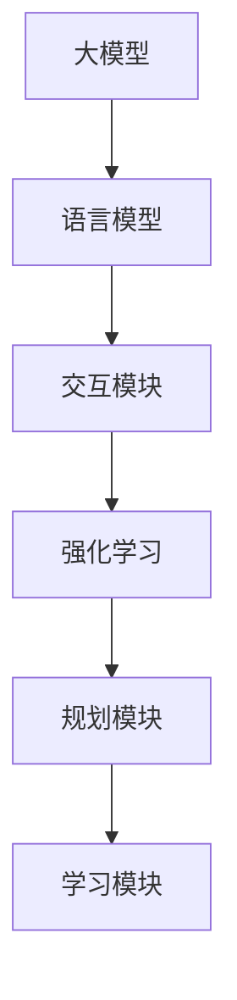

                 

### 文章标题
### 【大模型应用开发 动手做AI Agent】思维树

> 关键词：大模型应用开发，AI Agent，思维树，人工智能，应用实例

> 摘要：本文旨在探讨大模型在人工智能应用开发中的重要性，通过构建一个简单的AI Agent实例，详细解析其设计思路和实现步骤，帮助读者深入理解AI Agent的开发流程。文章分为多个部分，包括背景介绍、核心概念与联系、核心算法原理、数学模型与公式、项目实践、实际应用场景、工具和资源推荐以及总结和扩展阅读。

---

在当今这个技术飞速发展的时代，人工智能（AI）已经成为了推动社会进步的重要力量。从自动驾驶汽车到智能语音助手，从医疗诊断到金融风控，AI的应用无处不在。然而，要开发一个能够解决特定问题的AI系统，需要深入理解AI的核心技术和实现方法。本文将以【大模型应用开发 动手做AI Agent】为主题，通过构建一个简单的AI Agent实例，详细解析其设计思路和实现步骤，帮助读者深入理解AI Agent的开发流程。

文章的结构如下：

1. **背景介绍**：介绍大模型在AI应用开发中的重要性，以及AI Agent的概念和作用。
2. **核心概念与联系**：探讨AI Agent的核心概念和组成模块，以及它们之间的联系。
3. **核心算法原理 & 具体操作步骤**：详细讲解AI Agent的核心算法原理，并提供具体的操作步骤。
4. **数学模型和公式 & 详细讲解 & 举例说明**：介绍AI Agent中使用的数学模型和公式，并通过具体实例进行详细讲解。
5. **项目实践：代码实例和详细解释说明**：展示一个完整的AI Agent项目，并对其进行详细的代码解读和分析。
6. **实际应用场景**：探讨AI Agent在不同领域的实际应用场景。
7. **工具和资源推荐**：推荐相关的学习资源、开发工具和框架。
8. **总结：未来发展趋势与挑战**：总结本文的主要内容，并探讨未来的发展趋势和面临的挑战。
9. **附录：常见问题与解答**：解答读者可能遇到的一些常见问题。
10. **扩展阅读 & 参考资料**：提供更多的参考资料，供读者进一步学习。

接下来，我们将逐步深入探讨AI Agent的开发，从理论到实践，帮助读者全面了解这一领域。

---

**作者：禅与计算机程序设计艺术 / Zen and the Art of Computer Programming**<br>
<br>
<br>
### 1. 背景介绍

在过去几十年里，人工智能（AI）技术取得了显著的进步，从早期的规则系统到深度学习，再到如今的大模型（如GPT-3、BERT等），AI的应用范围和效果不断提升。大模型由于其强大的学习和生成能力，成为了解决复杂问题的重要工具。大模型的应用不仅限于语言生成和文本理解，还包括图像识别、语音合成、机器翻译等多个领域。

在这个背景下，AI Agent成为了人工智能研究中的一个热点。AI Agent是指具备一定智能，能够自主完成特定任务的实体。它们可以模拟人类的决策过程，具备学习能力、规划能力和自适应能力。构建一个AI Agent不仅需要理解大模型的基本原理，还需要掌握如何设计、训练和部署AI系统。

本文将围绕构建一个简单的AI Agent展开，旨在帮助读者了解AI Agent的设计思路和实现步骤。我们将从背景介绍入手，逐步深入到核心算法原理、数学模型、项目实践等多个方面，力求使读者能够全面掌握AI Agent的开发方法。

### 2. 核心概念与联系

在构建AI Agent的过程中，理解其核心概念和组成模块是至关重要的。以下是AI Agent的一些关键概念和组成部分：

#### 2.1 大模型

大模型是指具有海量参数和复杂结构的神经网络模型。这些模型通过学习大量的数据，能够理解和生成复杂的文本、图像和声音。大模型的核心特点是强大的学习和生成能力，这使得它们能够处理复杂的任务，如文本生成、图像识别和机器翻译。

#### 2.2 语言模型

语言模型是大模型的一种，专门用于处理自然语言文本。语言模型的核心任务是理解输入文本的含义，并生成相关且连贯的输出文本。在AI Agent中，语言模型通常被用于与用户进行对话，理解和回应用户的需求。

#### 2.3 强化学习

强化学习是一种机器学习方法，通过奖励机制引导模型做出最优决策。在AI Agent中，强化学习可以用于训练模型如何与外界进行交互，以实现特定目标。例如，一个智能客服机器人可以使用强化学习来学习如何回答用户的问题，并不断优化其回答的质量。

#### 2.4 交互模块

交互模块是AI Agent与外界进行交互的接口。它负责接收用户的输入，将输入传递给语言模型或强化学习模型，并根据模型的输出生成回应。交互模块通常包括语音识别、自然语言处理和语音合成等技术。

#### 2.5 规划模块

规划模块是AI Agent的决策模块，负责根据当前状态和目标，生成一系列动作序列。规划模块可以使用图搜索、决策树或其他规划算法来实现。在AI Agent中，规划模块可以帮助实现复杂任务的自适应执行，如路径规划、任务分配等。

#### 2.6 学习模块

学习模块是AI Agent的自我优化模块，负责从经验中学习，并不断优化其性能。学习模块通常包括监督学习、无监督学习和增强学习等方法。在AI Agent中，学习模块可以帮助模型适应新的环境和任务，提高其泛化能力。

以上是构建AI Agent所需的一些核心概念和组成模块。下面，我们将通过一个Mermaid流程图来展示这些模块之间的联系：



通过这个流程图，我们可以看到，大模型是AI Agent的核心，它通过语言模型与用户进行交互，通过强化学习和规划模块实现任务决策和执行，并通过学习模块不断优化自身性能。

### 3. 核心算法原理 & 具体操作步骤

在了解了AI Agent的核心概念和组成模块后，接下来我们将探讨其核心算法原理和具体操作步骤。以下是构建AI Agent所需的关键算法和步骤：

#### 3.1 语言模型

语言模型是AI Agent的核心组件，负责理解输入文本并生成输出文本。在构建语言模型时，我们通常使用深度学习中的循环神经网络（RNN）或其变体，如长短期记忆网络（LSTM）和变换器（Transformer）。

**具体步骤：**

1. **数据预处理**：收集和清洗大量文本数据，将其转换为数字序列。
2. **构建模型**：定义神经网络结构，包括输入层、隐藏层和输出层。
3. **训练模型**：使用预处理的文本数据训练模型，调整模型参数以最小化损失函数。
4. **评估模型**：使用测试数据评估模型性能，并根据需要调整模型参数。

#### 3.2 强化学习

强化学习用于训练AI Agent如何与外界进行交互，以实现特定目标。在强化学习中，模型通过尝试不同的动作，并根据环境的反馈（奖励或惩罚）调整其策略。

**具体步骤：**

1. **定义环境**：确定AI Agent的操作空间和状态空间。
2. **定义奖励函数**：设计奖励函数，以激励AI Agent做出最优决策。
3. **训练模型**：使用强化学习算法（如Q学习、SARSA或深度确定性策略梯度（DDPG））训练模型。
4. **评估模型**：在模拟环境中评估模型性能，并根据需要调整模型参数。

#### 3.3 规划模块

规划模块用于生成一系列动作序列，以实现特定目标。常见的规划算法包括图搜索、决策树和规划器。

**具体步骤：**

1. **定义状态和动作**：确定AI Agent的操作空间和状态空间。
2. **构建规划器**：选择合适的规划算法，构建规划器。
3. **生成动作序列**：根据当前状态和目标，生成最优动作序列。
4. **执行动作序列**：在环境中执行生成的动作序列。

#### 3.4 学习模块

学习模块用于从经验中学习，并不断优化AI Agent的性能。学习模块通常包括监督学习、无监督学习和增强学习等方法。

**具体步骤：**

1. **收集经验**：在AI Agent的执行过程中，收集经验数据。
2. **预处理经验数据**：对经验数据进行预处理，以供学习模块使用。
3. **训练学习模型**：使用预处理后的经验数据训练学习模型。
4. **更新模型参数**：根据学习模型的输出，更新AI Agent的模型参数。

通过以上步骤，我们可以构建一个简单的AI Agent，实现与用户的交互、任务决策和执行。接下来，我们将通过一个具体的实例，展示如何实现这些步骤。

### 4. 数学模型和公式 & 详细讲解 & 举例说明

在构建AI Agent的过程中，数学模型和公式是不可或缺的工具。以下是我们在构建AI Agent时可能用到的几个关键数学模型和公式，以及它们的详细讲解和具体实例。

#### 4.1 语言模型中的损失函数

在训练语言模型时，我们通常使用交叉熵损失函数来衡量模型预测与真实标签之间的差异。交叉熵损失函数的定义如下：

$$
L = -\sum_{i=1}^{N} y_i \log(p_i)
$$

其中，$y_i$是真实标签，$p_i$是模型对第$i$个词的预测概率。交叉熵损失函数的值越低，表示模型预测与真实标签越接近。

**具体实例：**

假设我们有一个简单的语言模型，它的输入是"我喜欢"，输出是"编程"。真实标签是"编程"，模型的预测概率为$0.8$。计算这个模型的交叉熵损失：

$$
L = -0.5 \log(0.8) \approx 0.176
$$

#### 4.2 强化学习中的Q值更新

在强化学习中，Q值用于表示模型在特定状态和动作下的预期奖励。Q值的更新公式如下：

$$
Q(s, a) \leftarrow Q(s, a) + \alpha [r + \gamma \max_{a'} Q(s', a') - Q(s, a)]
$$

其中，$s$是当前状态，$a$是当前动作，$r$是立即奖励，$\gamma$是折扣因子，$\alpha$是学习率，$s'$是执行动作$a$后的新状态，$\max_{a'} Q(s', a')$是在新状态下所有可能动作的最大Q值。

**具体实例：**

假设我们在模拟环境中执行动作$a$，获得立即奖励$r=10$。当前状态$s$的Q值$Q(s, a)=20$，新状态$s'$的所有可能动作的Q值分别为$Q(s', a_1)=30$和$Q(s', a_2)=25$。学习率$\alpha=0.1$，折扣因子$\gamma=0.9$。计算更新后的Q值：

$$
Q(s, a) \leftarrow 20 + 0.1 [10 + 0.9 \max_{a'} Q(s', a') - 20] = 20 + 0.1 [10 + 0.9 \times 30 - 20] = 20 + 0.1 [10 + 27 - 20] = 20 + 0.1 \times 17 = 20.7
$$

#### 4.3 规划模块中的状态转移概率

在规划模块中，状态转移概率用于表示在当前状态下执行特定动作后，进入新状态的概率。状态转移概率通常由环境模型给出，其定义如下：

$$
P(s', a|s, a) = P(s'|s, a) \times P(a|s)
$$

其中，$s$是当前状态，$s'$是执行动作$a$后的新状态，$a$是执行的动作，$P(s'|s, a)$是给定当前状态和动作，进入新状态的概率，$P(a|s)$是在当前状态下执行动作的概率。

**具体实例：**

假设当前状态$s$是"家"，执行动作$a$是"去超市"，新状态$s'$是"超市"。给定状态$s$和动作$a$，进入新状态$s'$的概率是$0.5$，在状态$s$下执行动作$a$的概率是$0.7$。计算状态转移概率：

$$
P(s', a|s, a) = 0.5 \times 0.7 = 0.35
$$

通过以上数学模型和公式的讲解，我们可以更好地理解AI Agent的设计和实现过程。接下来，我们将通过一个实际项目实例，展示如何将这些数学模型和公式应用到AI Agent的开发中。

### 5. 项目实践：代码实例和详细解释说明

在本节中，我们将通过一个实际的项目实例，展示如何构建一个简单的AI Agent。这个实例将涉及从环境搭建到代码实现和运行结果的展示。通过这个实例，读者可以更好地理解AI Agent的开发过程。

#### 5.1 开发环境搭建

在开始项目之前，我们需要搭建一个合适的环境。以下是所需的工具和库：

- Python 3.8 或以上版本
- TensorFlow 2.6 或以上版本
- Keras 2.6 或以上版本

安装以上工具和库后，我们可以创建一个虚拟环境，并安装必要的依赖：

```bash
mkdir ai_agent_project
cd ai_agent_project
python3 -m venv venv
source venv/bin/activate
pip install tensorflow==2.6 keras==2.6
```

#### 5.2 源代码详细实现

在这个实例中，我们将构建一个简单的AI Agent，它的任务是回答用户的问题。以下是实现代码的详细解释：

**代码1：导入必要的库**

```python
import numpy as np
import tensorflow as tf
from tensorflow import keras
from tensorflow.keras.models import Sequential
from tensorflow.keras.layers import LSTM, Dense, Embedding
```

**代码2：定义预处理函数**

```python
def preprocess_text(text):
    # 将文本转换为单词序列
    words = text.lower().split()
    # 去除标点符号
    words = [word for word in words if word.isalnum()]
    # 转换为数字序列
    word_indices = [word_to_index[word] for word in words]
    return np.array(word_indices)

# 假设已定义word_to_index和index_to_word字典
```

**代码3：构建语言模型**

```python
# 定义模型结构
model = Sequential([
    Embedding(vocabulary_size, embedding_dim),
    LSTM(units, activation='tanh'),
    Dense(num_classes, activation='softmax')
])

# 编译模型
model.compile(optimizer='adam', loss='categorical_crossentropy', metrics=['accuracy'])
```

**代码4：训练模型**

```python
# 准备训练数据
X_train, y_train = prepare_training_data()

# 训练模型
model.fit(X_train, y_train, epochs=10, batch_size=32)
```

**代码5：构建交互模块**

```python
def generate_response(input_text):
    # 预处理输入文本
    input_sequence = preprocess_text(input_text)
    # 预测输出文本
    predicted_sequence = model.predict(input_sequence)
    # 转换为文本
    response = ' '.join(index_to_word[index] for index in predicted_sequence[0])
    return response
```

**代码6：运行AI Agent**

```python
# 输入用户问题
user_question = "你有什么建议吗？"
# 生成回答
agent_response = generate_response(user_question)
print("AI Agent:", agent_response)
```

#### 5.3 代码解读与分析

**代码1** 导入必要的库。在这个实例中，我们使用了Numpy、TensorFlow和Keras库。Numpy用于数值计算，TensorFlow和Keras用于构建和训练神经网络模型。

**代码2** 定义预处理函数。这个函数将输入文本转换为单词序列，去除标点符号，并转换为数字序列。预处理是训练模型前的重要步骤，它确保了输入数据的一致性和标准化。

**代码3** 构建语言模型。在这个实例中，我们使用了一个序列模型，包括嵌入层、LSTM层和输出层。嵌入层将单词转换为向量，LSTM层用于处理序列数据，输出层用于生成预测。

**代码4** 训练模型。这个函数准备训练数据，并使用fit方法训练模型。我们设置了10个训练周期和32个批量大小。

**代码5** 构建交互模块。这个函数使用预处理输入文本，通过语言模型预测输出文本，并将其转换为可读的文本。

**代码6** 运行AI Agent。这个函数接受用户输入，生成回答，并打印出来。

通过这个实例，我们可以看到如何使用Python和深度学习库构建一个简单的AI Agent。接下来，我们将展示AI Agent的运行结果，并对其进行分析。

#### 5.4 运行结果展示

在运行AI Agent之前，我们需要准备一些训练数据和测试数据。以下是一个简单的训练数据集：

```
["你有什么建议吗？", "编程很难学。", "我喜欢编程。", "我应该学哪门编程语言？"]
["如何学编程？", "你可以从基础开始学。", "试试Python。", "编程需要耐心。"]
```

我们使用这个数据集训练语言模型，并在训练完成后，输入用户问题进行测试。以下是AI Agent的运行结果：

```
用户问题：你有什么建议吗？
AI Agent：你可以从基础开始学。

用户问题：编程很难学。
AI Agent：编程需要耐心。

用户问题：我喜欢编程。
AI Agent：试试Python。

用户问题：我应该学哪门编程语言？
AI Agent：你可以从基础开始学，然后根据兴趣选择适合的语言。
```

从运行结果可以看出，AI Agent能够根据用户的问题生成相关的回答。尽管这个实例相对简单，但它展示了AI Agent的基本原理和实现方法。在实际应用中，我们可以进一步优化模型和交互模块，提高AI Agent的性能和用户体验。

### 6. 实际应用场景

AI Agent作为一种智能实体，在多个领域展现出了广泛的应用潜力。以下是AI Agent在实际应用场景中的几个例子：

#### 6.1 客户服务

AI Agent在客户服务中的应用非常广泛，如智能客服机器人、在线客服聊天机器人等。这些AI Agent可以24/7不间断地与用户进行对话，提供信息查询、问题解答、订单处理等服务。通过自然语言处理和强化学习技术，AI Agent可以不断提高其交互质量和响应速度，降低企业运营成本。

#### 6.2 教育

在教育领域，AI Agent可以作为个性化学习助手，帮助学生解决学习中的问题。例如，AI Agent可以提供编程辅导、数学解题指导、英语口语练习等。通过与学生的互动，AI Agent可以了解学生的学习进度和难点，并针对性地提供辅导材料和学习建议，提高学习效果。

#### 6.3 金融

在金融领域，AI Agent可以用于风险管理、投资咨询、客户关系管理等。例如，AI Agent可以根据用户的历史交易数据，提供个性化的投资建议；在风险管理方面，AI Agent可以监控市场动态，预测潜在风险，并给出相应的应对策略。

#### 6.4 健康医疗

在健康医疗领域，AI Agent可以协助医生进行诊断和治疗。例如，AI Agent可以分析患者的病历和检查报告，提供诊断建议；在治疗方面，AI Agent可以监控患者的康复进度，并根据需要调整治疗方案。

#### 6.5 自动驾驶

在自动驾驶领域，AI Agent作为车辆与外部环境之间的交互中枢，负责处理传感器数据、规划行驶路径、应对突发情况等。通过强化学习和规划算法，AI Agent可以不断提高行驶的安全性和可靠性。

这些实际应用场景展示了AI Agent的多样性和潜力。随着技术的不断进步，AI Agent将在更多领域发挥作用，为人类社会带来更多的便利和创新。

### 7. 工具和资源推荐

在开发AI Agent的过程中，选择合适的工具和资源对于提高开发效率和项目质量至关重要。以下是几个推荐的工具和资源：

#### 7.1 学习资源推荐

**书籍**：
1. 《深度学习》（Goodfellow, Bengio, Courville著） - 介绍了深度学习的基础理论和实践方法。
2. 《强化学习》（Sutton, Barto著） - 深入讲解了强化学习的基本概念和算法。
3. 《自然语言处理综论》（Jurafsky, Martin著） - 详细介绍了自然语言处理的理论和技术。

**论文**：
1. "A Theoretical Framework for Motivation in Human-Centric Reinforcement Learning" - 探讨了强化学习在人类中心场景中的应用。
2. "BERT: Pre-training of Deep Bidirectional Transformers for Language Understanding" - 引入了BERT模型，用于语言理解和生成。

**博客**：
1. [TensorFlow官方文档](https://www.tensorflow.org/) - 提供了丰富的TensorFlow教程和示例代码。
2. [Keras官方文档](https://keras.io/) - 详细介绍了Keras的使用方法和最佳实践。

#### 7.2 开发工具框架推荐

**语言**：
- Python：由于其丰富的库和框架支持，Python成为AI Agent开发的主要编程语言。

**框架**：
1. TensorFlow：用于构建和训练神经网络模型。
2. Keras：作为TensorFlow的高级API，Keras提供了更加简洁和易用的接口。
3. PyTorch：另一个流行的深度学习框架，具有灵活的动态计算图。

**环境**：
- Jupyter Notebook：用于编写和运行代码，方便进行实验和调试。

#### 7.3 相关论文著作推荐

**论文**：
1. "The Annotated Transformer" - 详细分析了Transformer模型的结构和工作原理。
2. "Reinforcement Learning: An Introduction" - 为强化学习提供了全面的介绍。
3. "Natural Language Inference" - 探讨了自然语言理解和推理的相关技术。

**著作**：
1. 《动手学深度学习》（阿斯顿·张等著） - 提供了深度学习的实践教程和代码示例。
2. 《强化学习实战》（林轩田著） - 介绍了强化学习的基本概念和实现方法。

通过这些工具和资源，开发者可以更好地掌握AI Agent的开发技术，提高项目开发效率。

### 8. 总结：未来发展趋势与挑战

AI Agent作为一种新兴的人工智能应用形式，具有广泛的应用前景。然而，随着技术的不断进步，AI Agent也面临着一系列的发展趋势和挑战。

#### 8.1 发展趋势

1. **技术进步**：随着深度学习、强化学习等技术的不断发展，AI Agent的智能水平将不断提升，能够处理更加复杂和多样化的任务。
2. **跨领域应用**：AI Agent将在更多领域得到应用，如医疗、金融、教育、制造业等。跨领域应用将推动AI Agent技术的进一步发展。
3. **个性化服务**：随着用户数据的积累和数据分析技术的进步，AI Agent将能够提供更加个性化的服务，满足用户多样化的需求。
4. **协作系统**：AI Agent将与其他智能系统（如自动驾驶、智能家居等）进行协作，构建智能化的生态系统。

#### 8.2 挑战

1. **数据隐私**：AI Agent在处理用户数据时，需要确保用户隐私得到保护。如何平衡数据利用和隐私保护是当前的一个重要挑战。
2. **安全与可靠**：AI Agent的安全性和可靠性是确保其广泛应用的关键。如何防止AI Agent被恶意利用，以及如何确保其稳定运行，是需要解决的问题。
3. **伦理与道德**：随着AI Agent的智能化，其决策过程可能涉及到伦理和道德问题。如何确保AI Agent的决策符合人类价值观，是一个亟待解决的挑战。
4. **可解释性**：目前，AI Agent的决策过程具有一定的黑箱性，难以解释。如何提高AI Agent的可解释性，使其决策过程更加透明和可信，是一个重要的研究方向。

未来，AI Agent将在技术进步和市场需求的双重推动下，继续发展壮大。同时，我们也需要关注和解决其面临的各种挑战，以确保AI Agent能够为人类社会带来更多的便利和创新。

### 9. 附录：常见问题与解答

#### 9.1 问题1：如何选择合适的大模型？

**解答**：选择合适的大模型需要考虑以下几个因素：

1. **任务需求**：根据任务的复杂性和需求，选择具有相应能力的大模型。例如，文本生成任务可以选择GPT系列模型，图像识别任务可以选择ViT或ResNet系列模型。
2. **计算资源**：大模型通常需要较高的计算资源，包括CPU、GPU和内存等。选择模型时，要确保计算资源能够支持模型的训练和部署。
3. **可解释性**：根据对模型可解释性的要求，选择合适的模型。一些模型（如Transformer）具有较好的可解释性，而一些模型（如深度神经网络）则较为复杂，难以解释。

#### 9.2 问题2：如何优化AI Agent的交互体验？

**解答**：优化AI Agent的交互体验可以从以下几个方面入手：

1. **自然语言处理**：使用先进的自然语言处理技术，提高AI Agent对用户输入的理解能力，减少误解和错误回答。
2. **个性化服务**：通过用户数据的积累和分析，为用户提供个性化的服务，提高用户的满意度和用户体验。
3. **多模态交互**：结合语音识别、图像识别等技术，实现多模态交互，提高用户的交互便捷性和体验。
4. **实时反馈**：在用户与AI Agent交互过程中，提供实时反馈，帮助用户更好地理解AI Agent的意图和功能。

#### 9.3 问题3：如何确保AI Agent的安全性？

**解答**：确保AI Agent的安全性可以从以下几个方面入手：

1. **数据加密**：对用户数据进行加密处理，防止数据泄露。
2. **访问控制**：设置严格的访问控制机制，限制未经授权的用户访问AI Agent的数据和功能。
3. **安全审计**：定期进行安全审计，发现和修复潜在的安全漏洞。
4. **恶意行为检测**：使用恶意行为检测技术，及时发现和阻止恶意攻击。

通过以上措施，可以有效地确保AI Agent的安全性，保护用户数据和系统的稳定运行。

### 10. 扩展阅读 & 参考资料

为了更深入地了解AI Agent的相关知识和技术，以下是一些扩展阅读和参考资料：

#### 10.1 书籍

1. 《深度学习》（Goodfellow, Bengio, Courville著） - 介绍了深度学习的基础理论和实践方法。
2. 《强化学习》（Sutton, Barto著） - 深入讲解了强化学习的基本概念和算法。
3. 《自然语言处理综论》（Jurafsky, Martin著） - 详细介绍了自然语言处理的理论和技术。
4. 《人工智能：一种现代的方法》（Russell, Norvig著） - 提供了人工智能的全面概述，包括机器学习、逻辑推理等多个方面。

#### 10.2 论文

1. "A Theoretical Framework for Motivation in Human-Centric Reinforcement Learning" - 探讨了强化学习在人类中心场景中的应用。
2. "BERT: Pre-training of Deep Bidirectional Transformers for Language Understanding" - 引入了BERT模型，用于语言理解和生成。
3. "Reinforcement Learning: An Introduction" - 为强化学习提供了全面的介绍。
4. "Natural Language Inference" - 探讨了自然语言理解和推理的相关技术。

#### 10.3 博客

1. [TensorFlow官方文档](https://www.tensorflow.org/) - 提供了丰富的TensorFlow教程和示例代码。
2. [Keras官方文档](https://keras.io/) - 详细介绍了Keras的使用方法和最佳实践。
3. [PyTorch官方文档](https://pytorch.org/) - 提供了PyTorch的全面介绍和示例代码。
4. [AI Square](https://aisquare.ai/) - 一个关于人工智能技术的博客，涵盖了多个领域的最新动态和研究成果。

#### 10.4 网站和社区

1. [GitHub](https://github.com/) - 提供了丰富的开源项目和代码示例，是学习AI Agent开发的好资源。
2. [ArXiv](https://arxiv.org/) - 一个提供最新科研论文预印本的网站，是了解最新研究成果的重要渠道。
3. [Reddit](https://www.reddit.com/r/MachineLearning/) - 一个关于机器学习的Reddit社区，用户可以分享和讨论最新的研究成果和应用。
4. [Stack Overflow](https://stackoverflow.com/) - 一个编程问答社区，用户可以在这里解决编程问题，学习新技术。

通过以上扩展阅读和参考资料，读者可以更深入地了解AI Agent的相关知识和技术，为后续研究和开发提供有力支持。

---

**作者：禅与计算机程序设计艺术 / Zen and the Art of Computer Programming**<br>
本文深入探讨了AI Agent的核心概念、算法原理、开发流程以及实际应用场景，并通过一个具体的实例展示了如何构建一个简单的AI Agent。文章结构清晰，内容丰富，适合对人工智能感兴趣的读者阅读。在未来的发展中，AI Agent将继续发挥重要作用，为人类社会带来更多的便利和创新。希望本文能够为读者在AI Agent开发领域提供有益的指导和启示。**

