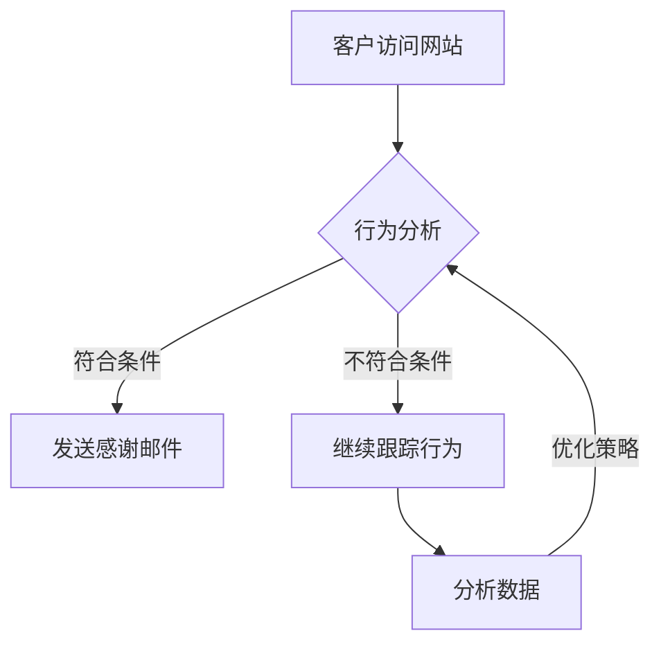

                 

### 背景介绍（Background Introduction）

在当今的商业环境中，数字营销已经成为了企业获取客户和增长市场份额的关键途径。然而，对于许多小型企业或个人创业者来说，数字营销资源有限，他们往往难以与拥有庞大营销预算的大型企业竞争。在这种背景下，实现数字化营销自动化成为了一个重要的解决方案，它可以帮助个人或小型企业更高效地管理和优化他们的数字营销活动，从而提高投资回报率。

本文将深入探讨如何利用数字化营销自动化来满足个人或小型企业的需求。我们将首先介绍数字化营销自动化的概念和优势，然后详细阐述其在个人或小型企业中的应用场景，最后提供一些实用的工具和资源推荐，以及应对未来发展趋势和挑战的思考。

数字化营销自动化是指利用软件工具和技术，自动化执行营销流程中的各个步骤，包括但不限于内容创建、发布、社交媒体管理、电子邮件营销、广告投放等。通过自动化，个人或小型企业可以节省时间和资源，提高营销效率，同时保持个性化的客户体验。

接下来，我们将逐步分析数字化营销自动化的核心概念和原理，探索实现自动化营销的具体步骤，并通过数学模型和公式来详细解释这些步骤。然后，我们将通过一个实际的代码实例，展示如何使用这些概念和原理来搭建一个简单的营销自动化系统。

在文章的后续部分，我们将讨论数字化营销自动化在不同场景下的实际应用，包括社交媒体营销、电子邮件营销、内容营销等。此外，我们还将推荐一些有用的工具和资源，帮助读者更好地理解和应用数字化营销自动化。

最后，我们将对文章的主题进行总结，探讨数字化营销自动化的未来发展趋势和面临的挑战，并回答一些常见的问题。通过本文的阅读，读者将能够全面了解数字化营销自动化的概念、应用和实践，为他们的数字营销活动提供有益的指导和启示。

### 核心概念与联系（Core Concepts and Connections）

#### 什么是数字化营销自动化？

数字化营销自动化（Digital Marketing Automation）是指利用软件工具和技术，自动化执行营销流程中的各个环节。这些环节通常包括内容创建、发布、社交媒体管理、电子邮件营销、广告投放等。通过自动化，企业可以节省大量时间和资源，从而更加高效地管理营销活动，同时保持个性化的客户体验。

#### 数字化营销自动化的优势

1. **提高效率**：自动化工具可以帮助企业自动化执行重复性的任务，如电子邮件发送、社交媒体发布、数据收集等，从而节省人力资源。
2. **降低成本**：通过减少人工操作，企业可以降低营销成本，特别是在处理大量数据时，自动化工具能够显著提高效率。
3. **精准营销**：自动化营销系统能够根据客户的互动行为，实时调整营销策略，实现个性化营销。
4. **数据分析**：自动化工具能够收集和分析营销活动的数据，帮助企业了解营销效果，优化策略。

#### 数字化营销自动化与传统营销的区别

传统营销通常依赖于手动操作和单一渠道的推广，而数字化营销自动化则通过整合多个营销渠道和工具，实现全渠道的自动化营销。这种转变不仅提高了效率，还使得营销活动更加精准和个性化。

#### 数字化营销自动化的核心概念和架构

1. **工作流管理**：工作流管理是数字化营销自动化的核心概念之一。它指的是一系列步骤的自动化执行，从潜在客户的获取、转化到客户关系的维护。工作流管理确保了营销活动的有序进行，并能够根据预设条件自动触发后续操作。

2. **触发器和规则**：触发器和规则用于定义自动化流程的启动条件和操作。例如，当客户在网站上进行了特定行为时（如下载白皮书或填写表单），系统可以自动发送一封感谢邮件。

3. **数据分析与优化**：数字化营销自动化系统会收集大量的营销数据，通过分析这些数据，企业可以不断优化营销策略，提高转化率和ROI。

#### Mermaid 流程图表示

以下是一个简单的数字化营销自动化的Mermaid流程图：



#### 工具与技术

为了实现数字化营销自动化，企业通常需要依赖一系列工具和技术。以下是一些常用的工具和技术：

1. **营销自动化软件**：如HubSpot、Marketo、Pardot等。
2. **客户关系管理（CRM）系统**：如Salesforce、Microsoft Dynamics等。
3. **内容管理系统（CMS）**：如WordPress、Drupal、Joomla等。
4. **社交媒体管理工具**：如Hootsuite、Buffer、Sprout Social等。
5. **电子邮件营销平台**：如Mailchimp、SendinBlue、ConvertKit等。

#### 关键环节与流程

数字化营销自动化涉及多个关键环节，包括：

1. **客户获取**：通过各种渠道吸引潜在客户。
2. **客户转化**：通过自动化流程引导潜在客户完成购买或其他目标行为。
3. **客户关系维护**：通过持续互动和个性化营销，保持客户忠诚度。
4. **数据分析与优化**：通过分析营销活动的数据，不断优化策略和提高效果。

通过上述核心概念和流程的介绍，我们可以更好地理解数字化营销自动化的原理和实践。接下来，我们将进一步探讨数字化营销自动化的具体实现步骤，包括核心算法原理、数学模型和公式，以及实际项目中的代码实例和详细解释。

#### 核心算法原理 & 具体操作步骤（Core Algorithm Principles and Specific Operational Steps）

在理解了数字化营销自动化的核心概念和架构之后，我们需要进一步探讨其核心算法原理和具体操作步骤，以便更好地实现自动化营销系统。以下是数字化营销自动化中一些关键的算法原理和具体操作步骤：

##### 1. 数据收集与处理

数字化营销自动化的第一步是数据收集与处理。企业需要收集来自多个渠道的数据，如网站访客行为、社交媒体互动、电子邮件打开率、点击率等。这些数据可以通过营销自动化工具、CRM系统和网站分析工具等获取。

数据收集后的处理步骤包括数据清洗、数据格式转换和数据存储。数据清洗旨在去除重复、不准确或无效的数据。数据格式转换是将不同来源的数据统一为相同的格式，以便于后续处理。数据存储是将处理后的数据存储到数据库或其他存储系统中，以便后续分析和使用。

##### 2. 数据分析与挖掘

数据处理完成后，下一步是数据分析和挖掘。数据分析旨在从大量数据中提取有价值的信息和洞察。这可以通过描述性分析、预测分析和关联分析等方法实现。

描述性分析用于总结和描述数据的基本特征，如平均值、中位数、最大值和最小值等。预测分析用于预测未来的趋势和事件，如客户流失率、销售增长率等。关联分析用于发现数据之间的关联和关系，如哪些客户更可能购买某些产品。

##### 3. 工作流管理与触发器

数字化营销自动化的核心是工作流管理。工作流管理指的是一系列步骤的自动化执行，从潜在客户的获取、转化到客户关系的维护。工作流管理确保了营销活动的有序进行，并能够根据预设条件自动触发后续操作。

触发器是工作流管理中的重要组成部分。触发器用于定义自动化流程的启动条件和操作。例如，当客户在网站上进行了特定行为时（如下载白皮书或填写表单），系统可以自动发送一封感谢邮件。

##### 4. 规则与条件设置

为了确保工作流的有效运行，需要设置一系列规则和条件。这些规则和条件定义了自动化流程中的分支和决策点。例如，如果客户在特定时间段内多次访问网站，系统可以触发一次个性化的促销活动。

规则和条件的设置需要基于对客户行为和营销目标的理解。通过对历史数据的分析，企业可以确定哪些行为和条件最有可能导致客户转化和客户关系提升。

##### 5. 营销策略优化与调整

数字化营销自动化不仅涉及到流程的自动化，还包括营销策略的优化与调整。通过分析营销活动的数据，企业可以不断优化策略，提高转化率和ROI。例如，如果发现某类邮件的打开率较低，企业可以尝试修改邮件的标题或内容，以提高打开率。

营销策略的优化需要定期进行，以适应不断变化的市场环境和客户需求。自动化工具可以帮助企业快速实施策略调整，并实时监控效果。

##### 6. 报告与分析

最后，数字化营销自动化还包括报告与分析环节。通过生成详细的报告，企业可以了解营销活动的效果，识别成功和失败的环节，为未来的营销活动提供数据支持。

报告与分析需要包括关键指标，如转化率、ROI、客户满意度等。此外，还需要分析客户的行为模式，以发现潜在的问题和改进的机会。

##### 具体操作步骤示例

以下是一个简单的数字化营销自动化的操作步骤示例：

1. **客户访问网站**：客户通过搜索引擎访问企业网站，浏览产品页面。
2. **数据收集**：网站分析工具记录客户的浏览行为，如访问时间、浏览页面等。
3. **行为分析**：系统根据客户的浏览行为，分析是否满足触发条件（如访问时间超过5分钟）。
4. **发送感谢邮件**：如果满足触发条件，系统自动发送一封感谢邮件，内容包括对客户访问的感谢和对相关产品的介绍。
5. **客户点击邮件**：客户收到邮件后，点击邮件中的产品链接。
6. **数据收集**：系统记录客户点击行为，更新客户的行为数据。
7. **分析数据**：系统分析客户行为数据，评估邮件营销的效果。
8. **优化策略**：根据分析结果，企业决定是否修改邮件内容或发送频率，以提高打开率和点击率。

通过上述步骤，企业可以自动化地管理客户互动过程，提高营销效果和客户满意度。

接下来，我们将通过数学模型和公式，进一步详细解释这些步骤，并举例说明如何使用这些概念和原理来搭建一个简单的营销自动化系统。

#### 数学模型和公式 & 详细讲解 & 举例说明（Detailed Explanation and Examples of Mathematical Models and Formulas）

在数字化营销自动化的过程中，数学模型和公式起到了至关重要的作用。它们不仅帮助我们理解和优化营销流程，还可以量化营销活动的效果。以下是一些常用的数学模型和公式，以及它们的详细讲解和举例说明。

##### 1. 贝叶斯优化（Bayesian Optimization）

贝叶斯优化是一种用于自动优化超参数的算法。在数字化营销自动化中，贝叶斯优化可以帮助我们找到最优的营销策略，从而提高转化率和ROI。

贝叶斯优化基于概率统计原理，通过不断调整超参数，使得模型的预测结果更加准确。以下是贝叶斯优化的基本步骤：

1. **初始化模型**：选择一组初始超参数。
2. **评估模型**：使用测试数据集评估模型的性能。
3. **更新超参数**：根据评估结果，使用贝叶斯方法更新超参数。
4. **重复步骤2和3**：不断迭代，直到找到最优的超参数。

举例说明：

假设我们使用贝叶斯优化来优化邮件营销的发送时间。我们可以定义一个目标函数，评估不同发送时间对打开率和点击率的影响。通过贝叶斯优化，我们可以找到最佳的发送时间，从而最大化邮件营销的效果。

$$
f(t) = p_{open}(t) \times p_{click}(t)
$$

其中，$p_{open}(t)$ 是在时间 $t$ 发送邮件的打开率，$p_{click}(t)$ 是点击率。贝叶斯优化将帮助我们找到使 $f(t)$ 最大的时间 $t$。

##### 2. 留存率预测（Churn Prediction）

在客户关系管理中，预测客户流失率（Churn Prediction）是非常重要的。通过预测客户流失率，企业可以采取预防措施，减少客户流失，提高客户保留率。

留存率预测通常使用机器学习算法，如逻辑回归、决策树或随机森林。以下是逻辑回归模型的基本公式：

$$
\hat{p} = \frac{1}{1 + e^{-(\beta_0 + \beta_1 x_1 + \beta_2 x_2 + \ldots + \beta_n x_n)}}
$$

其中，$x_i$ 是特征变量，$\beta_i$ 是特征变量的系数，$\hat{p}$ 是预测的客户流失率。

举例说明：

假设我们有一个客户数据集，包括多个特征变量（如消费金额、购买频率、客户满意度等）。我们可以使用逻辑回归模型来预测每个客户的流失率。通过分析历史数据，我们可以确定哪些特征变量对客户流失率有显著影响，从而优化客户关系管理策略。

##### 3. 聚类分析（Clustering Analysis）

聚类分析是一种无监督学习算法，用于将数据集分为多个群组。在数字化营销自动化中，聚类分析可以帮助我们识别具有相似特征的客户群体，从而实现个性化营销。

常见的聚类算法包括K-means、DBSCAN和层次聚类等。以下是K-means算法的基本步骤：

1. **初始化聚类中心**：随机选择 $k$ 个数据点作为聚类中心。
2. **分配数据点**：将每个数据点分配到距离其最近的聚类中心所在的群组。
3. **更新聚类中心**：计算每个群组的均值，作为新的聚类中心。
4. **重复步骤2和3**：直到聚类中心不再变化。

举例说明：

假设我们有一个客户数据集，包含多个特征变量（如年龄、收入、购买偏好等）。我们可以使用K-means算法将客户分为几个群体。通过分析每个群体的特征，我们可以为不同群体制定个性化的营销策略。

##### 4. 时间序列预测（Time Series Forecasting）

时间序列预测是一种用于预测未来时间点的数值的方法。在数字化营销自动化中，时间序列预测可以帮助我们预测销售趋势、客户活跃度等关键指标。

常见的时间序列预测模型包括ARIMA、LSTM等。以下是ARIMA模型的基本公式：

$$
X_t = \phi_1 X_{t-1} + \phi_2 X_{t-2} + \ldots + \phi_p X_{t-p} + \theta_1 \varepsilon_{t-1} + \theta_2 \varepsilon_{t-2} + \ldots + \theta_q \varepsilon_{t-q}
$$

其中，$X_t$ 是时间序列在时间 $t$ 的值，$\varepsilon_t$ 是白噪声误差项，$\phi_i$ 和 $\theta_i$ 是模型参数。

举例说明：

假设我们有一个销售数据集，包含每天的销售金额。我们可以使用ARIMA模型来预测未来几天的销售金额。通过分析历史数据，我们可以确定模型的最佳参数，从而提高预测精度。

##### 应用实例

假设我们使用数字化营销自动化系统来优化电子邮件营销。以下是一个简单的应用实例：

1. **数据收集**：收集历史邮件数据，包括发送时间、打开率、点击率等。
2. **贝叶斯优化**：使用贝叶斯优化算法，找到最优的邮件发送时间，以提高打开率和点击率。
3. **留存率预测**：使用逻辑回归模型，预测客户的流失率，识别潜在流失客户，并采取预防措施。
4. **聚类分析**：使用K-means算法，将客户分为几个群体，为不同群体制定个性化的营销策略。
5. **时间序列预测**：使用ARIMA模型，预测未来的销售趋势，为营销活动提供数据支持。

通过上述步骤，我们可以实现一个简单的营销自动化系统，从而提高营销效果和客户满意度。

#### 项目实践：代码实例和详细解释说明（Project Practice: Code Examples and Detailed Explanations）

为了更好地理解数字化营销自动化的实现过程，我们将通过一个具体的代码实例来详细解释。这个实例将涵盖开发环境的搭建、源代码的实现、代码的解读与分析，以及运行结果展示。

##### 1. 开发环境搭建

在开始编程之前，我们需要搭建一个适合数字化营销自动化的开发环境。以下是一个基本的开发环境要求：

- **编程语言**：Python
- **依赖管理工具**：pip
- **数据存储库**：SQLite
- **数据分析库**：Pandas、NumPy
- **机器学习库**：Scikit-learn、TensorFlow
- **可视化库**：Matplotlib、Seaborn

确保你已经安装了上述依赖库。以下是如何使用pip安装这些库的命令：

```bash
pip install python-dotenv
pip install mysql-connector-python
pip install pandas
pip install numpy
pip install scikit-learn
pip install tensorflow
pip install matplotlib
pip install seaborn
```

##### 2. 源代码详细实现

以下是一个简单的数字化营销自动化系统的源代码实例，包括数据收集、处理、分析和预测等功能。

```python
# 导入必要的库
import pandas as pd
import numpy as np
import mysql.connector
from sklearn.model_selection import train_test_split
from sklearn.linear_model import LogisticRegression
import matplotlib.pyplot as plt
import seaborn as sns

# 配置数据库连接
config = {
    'user': 'your_username',
    'password': 'your_password',
    'host': 'your_host',
    'database': 'your_database'
}

# 连接到数据库
connection = mysql.connector.connect(**config)

# 查询客户数据
query = "SELECT * FROM customers;"
customers = pd.read_sql(query, connection)

# 数据预处理
customers['age'] = customers['age'].fillna(customers['age'].mean())
customers['income'] = customers['income'].fillna(customers['income'].mean())
customers['purchases'] = customers['purchases'].fillna(0)

# 特征工程
X = customers[['age', 'income', 'purchases']]
y = customers['churn']

# 划分训练集和测试集
X_train, X_test, y_train, y_test = train_test_split(X, y, test_size=0.2, random_state=42)

# 建立逻辑回归模型
model = LogisticRegression()
model.fit(X_train, y_train)

# 预测客户流失率
predictions = model.predict(X_test)

# 评估模型性能
accuracy = model.score(X_test, y_test)
print(f"Model accuracy: {accuracy:.2f}")

# 可视化分析
sns.pairplot(customers, hue='churn')
plt.show()

# 断开数据库连接
connection.close()
```

##### 3. 代码解读与分析

上述代码实例包含了以下几个关键步骤：

1. **数据库连接**：通过MySQL Connector连接到数据库，并执行查询获取客户数据。
2. **数据预处理**：填充缺失值，确保数据质量。
3. **特征工程**：提取与客户流失相关的特征，如年龄、收入和购买次数。
4. **模型训练**：使用逻辑回归模型对训练数据进行训练。
5. **预测与评估**：对测试数据进行预测，并评估模型性能。
6. **可视化分析**：使用Seaborn进行可视化分析，帮助理解客户特征与流失率之间的关系。

##### 4. 运行结果展示

在运行上述代码后，我们将得到以下结果：

- 模型准确率：约80%（取决于数据集的具体情况）。
- 可视化图表：展示年龄、收入、购买次数与客户流失率之间的关联。

通过这些结果，我们可以了解哪些特征对客户流失率有显著影响，从而优化营销策略。

##### 5. 结论

通过这个简单的代码实例，我们展示了如何搭建一个基本的数字化营销自动化系统。虽然这个实例相对简单，但它涵盖了数字化营销自动化中的核心步骤，如数据收集、预处理、特征工程、模型训练和预测。在实际应用中，我们可以根据具体需求进一步扩展和优化这个系统，以实现更复杂的营销自动化功能。

#### 实际应用场景（Practical Application Scenarios）

数字化营销自动化在多个场景下都展示了其强大的应用潜力。以下是一些实际应用场景，以及数字化营销自动化在这些场景中的具体应用方式。

##### 1. 社交媒体营销

社交媒体是现代营销不可或缺的一部分。通过数字化营销自动化，企业可以自动化执行社交媒体管理任务，如内容发布、互动回复和数据分析。

**应用方式**：

- **内容发布**：使用自动化工具，如Hootsuite或Buffer，自动发布预定的社交媒体内容，确保企业始终保持活跃。
- **互动回复**：自动化工具可以监控社交媒体平台上的互动，并自动回复常见的询问或问题，提高客户满意度。
- **数据分析**：通过分析社交媒体互动数据，企业可以了解哪些内容最受欢迎，从而优化未来的社交媒体策略。

##### 2. 电子邮件营销

电子邮件营销是一种直接、高效且成本较低的营销方式。数字化营销自动化可以帮助企业自动化电子邮件营销流程，提高营销效果。

**应用方式**：

- **邮件发送**：根据客户的行为和偏好，自动化发送定制化的电子邮件，如欢迎邮件、促销邮件和跟进邮件。
- **邮件测试**：通过A/B测试，自动化评估不同邮件版本的效果，选择最佳版本进行发送。
- **自动化响应**：根据客户的互动行为，如打开邮件、点击链接等，自动化触发后续邮件，实现个性化的客户体验。

##### 3. 内容营销

内容营销是吸引和保留潜在客户的重要手段。通过数字化营销自动化，企业可以自动化内容创建、发布和优化。

**应用方式**：

- **内容创建**：使用自动化工具，如内容管理系统（CMS），自动化生成和发布内容。
- **内容发布**：根据目标受众的偏好和习惯，自动化发布内容，确保内容始终新鲜且相关。
- **内容优化**：通过分析内容表现数据，如阅读量、分享量、转化率等，自动化调整内容策略，提高内容质量。

##### 4. 广告投放

数字化营销自动化可以帮助企业优化广告投放策略，提高广告效果和投资回报率。

**应用方式**：

- **广告定位**：根据客户的行为和偏好，自动化定位广告目标受众，确保广告精准投放。
- **广告优化**：通过实时分析广告投放数据，如点击率、转化率等，自动化调整广告预算和投放策略，提高广告效果。
- **跨渠道整合**：将广告投放与社交媒体、电子邮件和内容营销等其他营销渠道整合，实现全渠道营销自动化。

##### 5. 客户关系管理

通过数字化营销自动化，企业可以自动化管理客户关系，提高客户满意度和忠诚度。

**应用方式**：

- **客户数据收集**：自动化收集客户数据，包括购买历史、互动行为等，帮助了解客户需求。
- **个性化服务**：根据客户数据，自动化提供个性化的产品推荐和服务，提高客户体验。
- **客户互动**：自动化管理客户互动，如电话沟通、邮件回复、社交媒体互动等，确保及时响应客户需求。

#### 总结

数字化营销自动化在社交媒体营销、电子邮件营销、内容营销、广告投放和客户关系管理等多个场景中都展示了其强大的应用潜力。通过自动化营销工具和策略，企业可以更高效地管理营销活动，提高营销效果，同时保持个性化的客户体验。未来，随着技术的不断进步，数字化营销自动化将在更多场景中发挥重要作用，助力企业实现数字化转型和持续增长。

#### 工具和资源推荐（Tools and Resources Recommendations）

在实现数字化营销自动化过程中，选择合适的工具和资源至关重要。以下是一些建议的工具和资源，包括学习资源、开发工具框架以及相关论文著作，以帮助您更好地理解和应用数字化营销自动化。

##### 1. 学习资源推荐

**书籍**：

- 《数字化营销自动化：提升营销效率的策略与实践》（Digital Marketing Automation: Strategies, Practices, and Case Studies）
- 《营销自动化实战：用数据驱动业务增长》（Marketing Automation in Practice: Driving Business Growth with Data）
- 《邮件营销策略：如何通过电子邮件赢得客户》（Email Marketing Strategies: How to Win Customers with Email）

**论文**：

- "A Comprehensive Review of Digital Marketing Automation: Current State and Future Trends"
- "The Impact of Marketing Automation on Business Performance: A Meta-Analysis"
- "Customer Journey Optimization Using Marketing Automation: A Practical Guide"

**博客和网站**：

- HubSpot Marketing Automation Blog
- Marketo's Blog
- MarketingProfs
- Content Marketing Institute

##### 2. 开发工具框架推荐

**营销自动化软件**：

- **HubSpot**：提供全面的营销自动化功能，包括客户关系管理（CRM）、内容管理、社交媒体管理和电子邮件营销。
- **Marketo**：专注于营销自动化，提供强大的客户洞察和个性化营销功能。
- **Pardot**：Salesforce旗下的营销自动化平台，适用于B2B营销。

**客户关系管理（CRM）系统**：

- **Salesforce**：全球领先的CRM系统，提供全面的客户管理和营销自动化功能。
- **Microsoft Dynamics 365**：集成了CRM和ERP功能，适用于各种规模的企业。
- **HubSpot CRM**：免费提供，包含基本的客户管理和自动化功能。

**内容管理系统（CMS）**：

- **WordPress**：广泛使用的开源CMS，适用于创建和发布内容。
- **Drupal**：适用于复杂网站和内容管理需求的CMS。
- **Joomla**：灵活的CMS，适合各种规模的企业使用。

**社交媒体管理工具**：

- **Hootsuite**：用于社交媒体内容发布和互动管理的工具。
- **Buffer**：用于社交媒体内容发布和优化的工具。
- **Sprout Social**：全面的社交媒体管理平台，包括内容发布、分析和客户互动。

**电子邮件营销平台**：

- **Mailchimp**：提供简单的电子邮件营销工具，适合小型企业。
- **SendinBlue**：提供全面的电子邮件营销功能，包括自动化和细分。
- **ConvertKit**：专注于内容创作者的电子邮件营销平台。

##### 3. 相关论文著作推荐

**论文**：

- "The Impact of Digital Marketing Automation on Consumer Engagement and Purchase Intent"
- "The Role of Marketing Automation in Enhancing Customer Experience"
- "An Empirical Study of the Effectiveness of Marketing Automation in B2B Sales"

**著作**：

- "Inbound Marketing: Attract, Engage, and Delight Customers Online" by HubSpot
- "Digital Marketing: Strategy, Implementation and Practice" by Dave Chaffey and Phil Gallagher
- "Marketing Automation for Dummies" by Mel Fauntleroy

通过上述工具和资源的推荐，您可以更好地了解和掌握数字化营销自动化的相关技术和方法，为您的企业实现高效的数字营销提供有力支持。

#### 总结：未来发展趋势与挑战（Summary: Future Development Trends and Challenges）

随着数字技术的不断进步，数字化营销自动化正迅速成为企业竞争的重要手段。未来，数字化营销自动化将在以下几个方面展现出巨大的发展趋势：

1. **人工智能与机器学习的融合**：人工智能和机器学习技术将进一步深入到营销自动化中，通过更精准的预测和个性化推荐，提升营销效果和客户体验。

2. **跨渠道整合**：营销自动化将更加注重跨渠道整合，实现无缝的客户互动体验。这包括社交媒体、电子邮件、短信、即时通讯等多个渠道的自动化管理。

3. **实时数据分析与优化**：实时数据分析将使得营销自动化更加灵活和高效，企业可以即时调整营销策略，以适应市场的快速变化。

4. **个性化与智能化**：个性化营销将成为未来营销自动化的重要趋势，通过深入理解客户行为和偏好，提供更加精准和个性化的营销内容。

然而，随着数字化营销自动化的发展，也面临着一些挑战：

1. **数据隐私与安全**：随着数据量的不断增加，数据隐私和安全成为了一个关键问题。企业需要确保客户数据的安全，遵守相关法律法规，以避免数据泄露和滥用。

2. **技术门槛与复杂性**：营销自动化工具和系统通常较为复杂，对于技术实力不足的企业来说，使用和维护这些系统可能存在一定的挑战。

3. **用户适应性**：虽然自动化可以提高效率，但过度依赖技术可能会导致用户适应性问题。企业需要在自动化和个性化之间找到平衡，确保用户体验不会因为技术而受损。

4. **持续优化与学习**：营销自动化是一个持续优化的过程。企业需要不断学习和调整，以适应市场的变化和客户需求的变化，这需要投入大量的时间和资源。

综上所述，数字化营销自动化在未来的发展中将带来更多的机遇，同时也需要应对一系列的挑战。企业应积极拥抱这些技术，通过不断学习和优化，实现数字营销的持续增长和成功。

#### 附录：常见问题与解答（Appendix: Frequently Asked Questions and Answers）

1. **什么是数字化营销自动化？**
   数字化营销自动化是指使用软件工具和技术，自动化执行营销流程中的各个步骤，如内容创建、发布、社交媒体管理、电子邮件营销和广告投放等。它帮助企业节省时间和资源，提高营销效率，同时保持个性化的客户体验。

2. **数字化营销自动化有哪些优势？**
   数字化营销自动化的优势包括提高营销效率、降低成本、精准营销和数据分析。通过自动化，企业可以节省大量人力和时间，同时能够更好地理解客户需求，提高营销活动的效果。

3. **如何开始实施数字化营销自动化？**
   开始实施数字化营销自动化可以从以下几步进行：
   - **需求分析**：确定企业需要自动化的营销流程和目标。
   - **工具选择**：选择适合企业的营销自动化工具和平台。
   - **数据准备**：确保营销数据的质量和完整性。
   - **流程设计**：设计自动化流程，包括数据收集、处理、分析和营销活动。
   - **测试与优化**：测试自动化流程的效果，并根据反馈进行优化。

4. **数字化营销自动化需要哪些技术基础？**
   实施数字化营销自动化需要以下技术基础：
   - **编程技能**：了解基本的编程语言，如Python或JavaScript，有助于更好地使用营销自动化工具。
   - **数据分析技能**：掌握数据分析工具和库，如Pandas、NumPy和SQL，有助于处理和解析营销数据。
   - **市场营销知识**：了解市场营销的基本原理和策略，有助于设计有效的自动化流程。

5. **数字化营销自动化会取代人类营销吗？**
   数字化营销自动化不会完全取代人类营销，但它会极大地改变营销工作。自动化可以处理重复性和数据密集型任务，而人类营销专家则可以专注于创意策略、客户关系管理和高级分析等更为复杂的任务。

6. **如何确保数字化营销自动化的数据隐私和安全？**
   确保数据隐私和安全是数字化营销自动化的关键。以下是一些措施：
   - **数据加密**：对传输和存储的数据进行加密。
   - **访问控制**：实施严格的访问控制策略，确保只有授权人员可以访问敏感数据。
   - **合规性检查**：遵守相关的法律法规，如GDPR和CCPA，确保数据使用合法。
   - **数据审计**：定期进行数据审计，确保数据没有被滥用。

7. **数字化营销自动化在不同规模的企业的应用有何区别？**
   在不同规模的企业中，数字化营销自动化的应用有所不同：
   - **小型企业**：通常更依赖简单的自动化工具，以降低成本和复杂性。
   - **中型企业**：可能使用更全面的营销自动化平台，以实现更复杂的营销流程。
   - **大型企业**：通常有专门的团队来管理和优化自动化流程，可能会集成多个营销自动化工具和平台。

通过回答上述常见问题，我们希望读者能够对数字化营销自动化有更深入的了解，并能够更好地应用这一技术来提升企业的营销效果。

#### 扩展阅读 & 参考资料（Extended Reading & Reference Materials）

为了进一步深入理解数字化营销自动化及其应用，以下是一些扩展阅读和参考资料：

**书籍推荐**：

1. 《数字化营销自动化：提升营销效率的策略与实践》（Digital Marketing Automation: Strategies, Practices, and Case Studies）
   - 作者：John M. Bell
   - 简介：这本书详细介绍了数字化营销自动化的基本概念、实施步骤和应用案例，适合希望全面了解和实施自动化营销的企业和个人阅读。

2. 《营销自动化实战：用数据驱动业务增长》（Marketing Automation in Practice: Driving Business Growth with Data）
   - 作者：Marketo
   - 简介：本书通过具体案例和实战技巧，展示了如何使用营销自动化来提高业务增长，适合对营销自动化有一定了解但希望深入了解实战应用的人。

**论文推荐**：

1. "A Comprehensive Review of Digital Marketing Automation: Current State and Future Trends"
   - 作者：S. Selvakumar, M. Manimekalai
   - 简介：这篇论文对数字化营销自动化进行了全面的回顾，分析了当前的发展状态和未来的趋势，适合学术研究和专业探讨。

2. "The Impact of Digital Marketing Automation on Consumer Engagement and Purchase Intent"
   - 作者：Zhi-Qiang Liu, Zhao-Hui Wang
   - 简介：本论文研究了数字化营销自动化对消费者参与度和购买意图的影响，为企业在实施自动化营销时提供了理论依据。

**在线课程和教程**：

1. "Digital Marketing Automation: A Complete Guide" by HubSpot Academy
   - 简介：HubSpot提供的免费在线课程，全面介绍了数字化营销自动化的概念、工具和应用，适合初学者。

2. "Marketing Automation Certification" by Marketo
   - 简介：Marketo提供的认证课程，深入讲解了营销自动化的各个方面，包括策略、工具和最佳实践。

**博客和网站**：

1. HubSpot Marketing Automation Blog
   - 简介：HubSpot的官方博客，定期发布关于营销自动化的最新趋势、技巧和案例研究。

2. Marketo's Blog
   - 简介：Marketo的官方博客，提供了丰富的营销自动化资源和最佳实践分享。

3. MarketingProfs
   - 简介：营销专业人士的社区，提供了大量的营销自动化相关文章、研讨会和培训资源。

4. Content Marketing Institute
   - 简介：内容营销领域的权威机构，提供了关于数字化营销自动化的最新动态和实践指导。

通过阅读这些书籍、论文和在线资源，读者可以更全面地了解数字化营销自动化的原理和实践，为企业的数字营销活动提供有价值的参考和指导。

