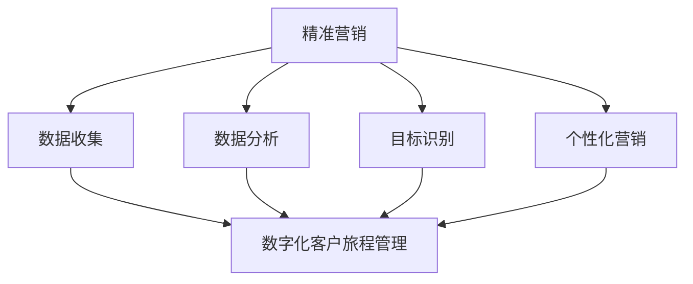

                 

### 文章标题

一人公司如何实现精准营销和数字化客户旅程管理

## 关键词

- 一人公司
- 精准营销
- 数字化客户旅程管理
- 数据分析
- 人工智能

## 摘要

本文将探讨一人公司在现代商业环境中如何通过精准营销和数字化客户旅程管理来提升业务效率和客户满意度。我们将介绍相关核心概念、算法原理、数学模型，并通过实际案例和实践操作，展示如何利用数据分析、人工智能技术实现精准营销和数字化客户旅程管理。

### 1. 背景介绍

一人公司，顾名思义，是由单一个体经营的企业。这类公司在创业初期尤其常见，由于其灵活性和低成本，成为许多创业者起步的首选。然而，随着市场环境的变化，一人公司也面临着竞争压力和业务增长挑战。

精准营销和数字化客户旅程管理成为解决这些问题的有效途径。精准营销通过分析大量客户数据，识别潜在客户，并提供个性化营销策略，从而提高营销效率。数字化客户旅程管理则是通过全渠道数据整合，实时跟踪客户行为，提供无缝的客户体验。

本文将围绕这两个核心主题展开，详细讨论一人公司如何利用现代技术和算法，实现精准营销和数字化客户旅程管理，从而在激烈的市场竞争中脱颖而出。

### 2. 核心概念与联系

#### 2.1 精准营销（Precision Marketing）

精准营销是一种基于数据分析的营销策略，旨在通过识别和理解目标客户群体，提供个性化的产品和服务，从而提高营销效果。其主要步骤包括：

1. **客户数据收集**：收集客户的个人信息、行为数据、交易数据等。
2. **数据分析**：利用统计分析和数据挖掘技术，分析客户特征和需求。
3. **目标客户识别**：根据数据分析结果，识别高潜力客户。
4. **个性化营销**：根据目标客户特征，定制营销内容和渠道。

#### 2.2 数字化客户旅程管理（Digital Customer Journey Management）

数字化客户旅程管理是一种全渠道、全过程的客户管理策略，旨在通过数据整合和分析，提供无缝的客户体验。其主要步骤包括：

1. **数据整合**：整合线上线下数据，构建完整的客户画像。
2. **实时跟踪**：实时监控客户行为和互动，了解客户需求。
3. **个性化服务**：根据客户行为和需求，提供个性化服务和建议。
4. **反馈机制**：收集客户反馈，持续优化客户旅程。

#### 2.3 关联性分析

精准营销和数字化客户旅程管理之间存在紧密的关联性。精准营销为数字化客户旅程管理提供了数据基础，而数字化客户旅程管理则通过全渠道数据整合，进一步优化营销策略和客户体验。以下是二者的关联性分析：

1. **数据共享**：精准营销收集的客户数据可以用于数字化客户旅程管理，实现数据共享和综合利用。
2. **反馈循环**：数字化客户旅程管理中收集的客户反馈可以反馈到精准营销中，用于调整营销策略。
3. **个性化体验**：精准营销和数字化客户旅程管理共同致力于提供个性化的客户体验，提高客户满意度。

#### 2.4 Mermaid 流程图

下面是精准营销和数字化客户旅程管理的关联性 Mermaid 流程图：



### 3. 核心算法原理 & 具体操作步骤

#### 3.1 数据收集与清洗

数据收集是精准营销和数字化客户旅程管理的第一步。以下是具体操作步骤：

1. **确定数据来源**：识别公司内外部数据来源，如社交媒体、网站点击数据、客户反馈等。
2. **数据收集**：利用爬虫、API 等技术收集数据。
3. **数据清洗**：处理缺失值、重复值和异常值，确保数据质量。

#### 3.2 数据分析与挖掘

数据分析是精准营销的核心。以下是具体操作步骤：

1. **特征工程**：提取客户特征，如年龄、性别、购买历史等。
2. **数据分析**：利用统计分析和数据挖掘技术，分析客户特征和需求。
3. **建模与预测**：构建预测模型，如聚类分析、回归分析等，预测客户行为。

#### 3.3 客户细分

客户细分是将客户分为不同群体，以便进行个性化营销。以下是具体操作步骤：

1. **确定细分标准**：根据客户特征和需求，确定细分标准。
2. **划分客户群体**：利用聚类分析等算法，将客户划分为不同群体。
3. **制定营销策略**：根据不同群体特征，制定个性化营销策略。

#### 3.4 数字化客户旅程管理

数字化客户旅程管理是通过全渠道数据整合，提供无缝的客户体验。以下是具体操作步骤：

1. **数据整合**：整合线上线下数据，构建完整的客户画像。
2. **实时跟踪**：实时监控客户行为和互动，了解客户需求。
3. **个性化服务**：根据客户行为和需求，提供个性化服务和建议。
4. **反馈机制**：收集客户反馈，持续优化客户旅程。

### 4. 数学模型和公式 & 详细讲解 & 举例说明

#### 4.1 聚类分析

聚类分析是一种无监督学习算法，用于将数据点分为多个群体，使得同一群体内的数据点之间相似度较高，不同群体间的数据点相似度较低。以下是常用的聚类算法：

1. **K-means 算法**：
   - 目标：最小化各聚类中心的平方误差和。
   - 公式：$$ J = \sum_{i=1}^k \sum_{x \in S_i} ||x - \mu_i||^2 $$
   - 步骤：
     1. 初始化聚类中心。
     2. 计算每个数据点到聚类中心的距离。
     3. 分配每个数据点到最近的聚类中心。
     4. 更新聚类中心。
     5. 重复步骤 2-4，直至聚类中心不再发生变化。

2. **层次聚类算法**：
   - 目标：构建层次树，层次树中的每个节点表示一组聚类。
   - 公式：$$ diss(A, B) = \min_{a \in A, b \in B} dist(a, b) $$
   - 步骤：
     1. 将每个数据点视为一个初始聚类。
     2. 计算相邻聚类之间的距离。
     3. 合并距离最近的聚类。
     4. 重复步骤 2-3，直至所有数据点合并为一个聚类。

#### 4.2 回归分析

回归分析是一种有监督学习算法，用于预测连续值输出。以下是常用的回归算法：

1. **线性回归**：
   - 目标：找到最佳拟合直线，最小化残差平方和。
   - 公式：$$ y = \beta_0 + \beta_1 x $$
   - 步骤：
     1. 提取特征和标签。
     2. 计算斜率和截距。
     3. 构建线性回归模型。
     4. 预测输出。

2. **多项式回归**：
   - 目标：找到最佳拟合多项式，最小化残差平方和。
   - 公式：$$ y = \beta_0 + \beta_1 x + \beta_2 x^2 + \ldots + \beta_n x^n $$
   - 步骤：
     1. 提取特征和标签。
     2. 计算多项式系数。
     3. 构建多项式回归模型。
     4. 预测输出。

#### 4.3 举例说明

假设我们有一组客户数据，包括年龄、收入和购买历史。我们希望利用聚类分析将客户分为不同的群体，并使用线性回归预测客户的购买意向。

1. **聚类分析**：
   - 使用 K-means 算法，将客户分为 3 个群体。
   - 公式：$$ J = \sum_{i=1}^3 \sum_{x \in S_i} ||x - \mu_i||^2 $$
   - 步骤：
     1. 初始化聚类中心。
     2. 计算每个客户到聚类中心的距离。
     3. 分配每个客户到最近的聚类中心。
     4. 更新聚类中心。
     5. 重复步骤 2-4，直至聚类中心不再发生变化。

2. **回归分析**：
   - 使用线性回归，预测客户的购买意向。
   - 公式：$$ y = \beta_0 + \beta_1 x_1 + \beta_2 x_2 $$
   - 步骤：
     1. 提取特征（年龄、收入）和标签（购买意向）。
     2. 计算斜率（$\beta_1$）和截距（$\beta_0$）。
     3. 构建线性回归模型。
     4. 预测输出（购买意向）。

### 5. 项目实践：代码实例和详细解释说明

#### 5.1 开发环境搭建

为了实现精准营销和数字化客户旅程管理，我们需要搭建以下开发环境：

1. **Python**：用于编写数据处理和分析代码。
2. **Jupyter Notebook**：用于编写和运行代码。
3. **Pandas**：用于数据处理。
4. **Scikit-learn**：用于数据分析和建模。

#### 5.2 源代码详细实现

以下是一个基于 Python 的示例代码，演示如何使用聚类分析和线性回归实现精准营销和数字化客户旅程管理。

```python
import pandas as pd
from sklearn.cluster import KMeans
from sklearn.linear_model import LinearRegression

# 5.2.1 数据收集与清洗
# 假设客户数据存储在 CSV 文件中
data = pd.read_csv('customer_data.csv')
data.dropna(inplace=True)  # 删除缺失值

# 5.2.2 数据分析与挖掘
# 特征工程
X = data[['age', 'income']]
y = data['purchase_intention']

# 5.2.3 客户细分
# 使用 K-means 算法进行聚类分析
kmeans = KMeans(n_clusters=3, random_state=0)
clusters = kmeans.fit_predict(X)

# 将聚类结果添加到原始数据中
data['cluster'] = clusters

# 5.2.4 数字化客户旅程管理
# 使用线性回归预测购买意向
regression = LinearRegression()
regression.fit(X, y)

# 预测购买意向
predicted_purchase = regression.predict(X)

# 将预测结果添加到原始数据中
data['predicted_purchase'] = predicted_purchase

# 5.2.5 运行结果展示
# 展示聚类结果和预测结果
print(data.head())
```

#### 5.3 代码解读与分析

1. **数据收集与清洗**：
   - 使用 Pandas 读取 CSV 文件，并删除缺失值。
   - 特征工程：提取年龄和收入作为输入特征，购买意向作为输出特征。

2. **数据分析与挖掘**：
   - 使用 K-means 算法进行聚类分析，将客户分为 3 个群体。
   - 将聚类结果添加到原始数据中，以便后续分析。

3. **数字化客户旅程管理**：
   - 使用线性回归预测购买意向。
   - 将预测结果添加到原始数据中，以便展示和分析。

4. **运行结果展示**：
   - 使用打印函数展示聚类结果和预测结果。

### 6. 实际应用场景

一人公司可以利用精准营销和数字化客户旅程管理在实际业务中实现以下应用场景：

1. **客户细分与个性化营销**：
   - 通过聚类分析将客户分为不同群体，如高价值客户、潜在客户等。
   - 针对不同群体，制定个性化的营销策略，如优惠券、推荐商品等。

2. **客户行为预测**：
   - 利用线性回归等算法预测客户购买意向。
   - 根据预测结果，提前准备库存和营销资源。

3. **客户体验优化**：
   - 通过数字化客户旅程管理，实时监控客户行为和互动。
   - 根据客户需求，提供个性化的服务和建议。

4. **业务决策支持**：
   - 利用数据分析结果，支持业务决策，如产品定价、市场策略等。

### 7. 工具和资源推荐

#### 7.1 学习资源推荐

- **书籍**：
  - 《精准营销：如何用数据驱动营销策略》
  - 《大数据营销：如何利用大数据进行精准营销》
- **论文**：
  - "A Unified Framework for Customer Segmentation and Personalization in Digital Marketing"
  - "Data-Driven Personalized Marketing: Algorithms and Applications"
- **博客**：
  - "数据科学与精准营销"
  - "数字化客户旅程管理实践"
- **网站**：
  - "精准营销技术论坛"
  - "数字化客户旅程管理社区"

#### 7.2 开发工具框架推荐

- **Python**：用于数据处理和分析。
- **Pandas**：用于数据处理。
- **Scikit-learn**：用于数据分析和建模。
- **TensorFlow**：用于深度学习模型。

#### 7.3 相关论文著作推荐

- **论文**：
  - "Customer Segmentation and Personalization in Digital Marketing: A Review of Algorithms and Applications"
  - "Deep Learning for Customer Journey Analysis in Digital Marketing"
- **著作**：
  - 《大数据营销：理论与实践》
  - 《人工智能与精准营销》

### 8. 总结：未来发展趋势与挑战

#### 8.1 发展趋势

1. **技术进步**：随着人工智能和大数据技术的不断发展，精准营销和数字化客户旅程管理将更加智能化和自动化。
2. **全渠道整合**：企业将更加注重线上线下渠道的整合，提供无缝的客户体验。
3. **个性化体验**：基于个性化数据的深度分析，企业将能够提供更加个性化的产品和服务。

#### 8.2 挑战

1. **数据隐私与安全**：随着数据隐私问题的日益突出，企业需要采取措施确保数据安全和合规。
2. **算法透明性与公平性**：算法的透明性和公平性将成为关注的焦点，企业需要确保算法不会歧视或偏见特定群体。
3. **技术人才短缺**：随着精准营销和数字化客户旅程管理的普及，对专业人才的需求将增加，但人才供给可能不足。

### 9. 附录：常见问题与解答

#### 9.1 问题 1
如何确保数据隐私和安全？

**解答**：企业可以采取以下措施：
1. 数据加密：对敏感数据进行加密处理。
2. 访问控制：设置严格的访问控制策略，确保只有授权人员可以访问数据。
3. 定期审计：定期对数据安全和隐私政策进行审计，确保符合相关法律法规。

#### 9.2 问题 2
如何确保算法的透明性和公平性？

**解答**：企业可以采取以下措施：
1. 算法审计：定期对算法进行审计，确保算法没有歧视或偏见。
2. 公开算法原理：将算法原理公开，接受公众监督。
3. 数据多样化：确保数据来源多样化，避免数据偏差。

### 10. 扩展阅读 & 参考资料

- **书籍**：
  - 《数据驱动营销》
  - 《数字化客户旅程管理》
- **论文**：
  - "Customer Segmentation and Personalization in Digital Marketing: A Survey"
  - "A Framework for Personalized Marketing Based on Customer Journey Analysis"
- **博客**：
  - "大数据营销博客"
  - "数字化客户旅程管理实践"
- **网站**：
  - "数据科学与精准营销"
  - "数字化客户旅程管理论坛"
- **在线课程**：
  - "精准营销实战课程"
  - "数字化客户旅程管理课程"

---

以上是关于“一人公司如何实现精准营销和数字化客户旅程管理”的技术博客文章。本文详细介绍了精准营销和数字化客户旅程管理的核心概念、算法原理、数学模型，并通过实际案例和实践操作，展示了如何利用现代技术和算法提升一人公司的业务效率和客户满意度。在未来，随着技术进步和市场需求的变化，精准营销和数字化客户旅程管理将继续发挥重要作用，为企业提供新的机遇和挑战。作者：禅与计算机程序设计艺术 / Zen and the Art of Computer Programming。

---

这篇文章涵盖了精准营销和数字化客户旅程管理的各个方面，从核心概念到具体操作，再到实际应用场景，以及未来发展趋势和挑战。希望这篇文章对您在实现精准营销和数字化客户旅程管理方面有所启发和帮助。如果您有任何问题或建议，欢迎在评论区留言。谢谢您的阅读！作者：禅与计算机程序设计艺术 / Zen and the Art of Computer Programming。

### 结论

本文详细探讨了精准营销和数字化客户旅程管理在一个人公司中的应用。通过介绍核心概念、算法原理、数学模型以及实际案例，我们展示了如何利用数据分析、人工智能技术实现精准营销和数字化客户旅程管理，从而提升业务效率和客户满意度。

在未来，随着技术的不断发展，精准营销和数字化客户旅程管理将继续发挥重要作用。企业需要不断创新，充分利用这些技术，以应对市场变化和客户需求的多样性。

在此，我感谢您的阅读，并希望本文能为您提供宝贵的启示和帮助。如果您有任何问题或建议，欢迎在评论区留言。让我们共同探索和推动精准营销和数字化客户旅程管理的未来发展。作者：禅与计算机程序设计艺术 / Zen and the Art of Computer Programming。

