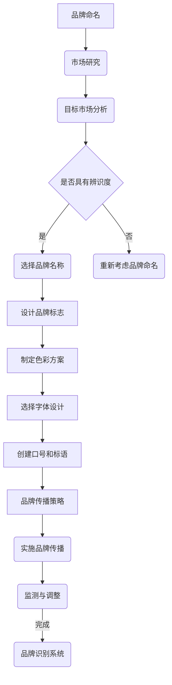

                 

### 文章标题

《一人公司的品牌识别系统设计原则》

### Keywords:  
Brand Recognition System Design, Brand Identity, Single-Owner Company, Design Principles

### 摘要：  
本文将探讨如何为单人公司设计一个高效且具有辨识度的品牌识别系统。我们将深入分析品牌识别系统的重要性，以及如何通过设计原则来创建一个独特的品牌形象。文章将涵盖品牌命名、视觉元素设计、传播策略等方面，旨在为读者提供实用的设计指导。

## 1. 背景介绍

在当今竞争激烈的市场环境中，品牌识别系统成为了企业成功的关键因素之一。无论是大型跨国公司还是单人创业公司，品牌识别系统都能够帮助企业在市场中脱颖而出，建立稳固的市场地位。品牌识别系统不仅包括品牌名称和标志，还涵盖了视觉元素、口号、色彩方案等各个方面。

对于单人公司来说，品牌识别系统的设计尤为重要。由于单人公司的规模和资源有限，一个清晰且具有辨识度的品牌形象可以有效地传达企业的价值和理念，吸引目标客户，提升市场竞争力。然而，设计一个成功的品牌识别系统并非易事，它需要深入的市场研究、精准的定位和独特的设计理念。

本文将围绕品牌识别系统设计原则，探讨如何为单人公司打造一个独特且具有吸引力的品牌形象。我们将从品牌命名、视觉元素设计、传播策略等方面展开讨论，为读者提供实用的设计指导。

## 2. 核心概念与联系

### 2.1 品牌识别系统的重要性

品牌识别系统是企业的“面子工程”，它不仅代表了一个企业的形象，更是企业与消费者之间的桥梁。一个成功的品牌识别系统能够在以下方面发挥重要作用：

**1. 增强品牌认知度**：清晰的品牌标识和一致的品牌形象可以迅速吸引消费者的注意力，提高品牌知名度。

**2. 提升品牌价值**：统一的品牌识别系统可以增强消费者对品牌的信任和忠诚度，从而提升品牌的市场价值。

**3. 促进品牌传播**：通过有效的品牌传播策略，品牌识别系统可以帮助企业迅速扩散到更广泛的受众群体。

**4. 塑造品牌形象**：品牌识别系统可以传达企业的核心价值和理念，塑造一个独特的品牌形象。

### 2.2 品牌识别系统设计原则

设计一个成功的品牌识别系统需要遵循以下原则：

**1. 一致性**：品牌识别系统的各个元素（如标志、色彩、字体等）应该保持一致，以传达统一的品牌形象。

**2. 简洁性**：设计应该简洁明了，避免冗余和复杂，使品牌形象易于识别和记忆。

**3. 创新性**：虽然简洁性很重要，但创新性同样不可或缺。一个独特的品牌形象可以吸引消费者的眼球，增强品牌的记忆点。

**4. 相关性**：品牌识别系统应该与企业的核心价值和目标市场相关，以确保品牌信息的传达准确无误。

**5. 可访问性**：品牌识别系统应该在不同媒介上都能够保持一致性，包括线上和线下。

### 2.3 品牌识别系统架构

品牌识别系统通常包括以下核心组成部分：

**1. 品牌名称**：品牌名称是品牌识别系统的核心，它应该简洁、易于发音和记忆。

**2. 品牌标志**：品牌标志是品牌的视觉代表，它应该具备独特性、易识别性和视觉吸引力。

**3. 色彩方案**：色彩是品牌识别系统中的重要元素，它应该与品牌形象和目标市场相匹配。

**4. 字体设计**：字体设计应该符合品牌形象，同时便于阅读和识别。

**5. 口号和标语**：口号和标语是品牌传播的有力工具，它们应该简洁、有力量且易于记忆。

**6. 品牌传播策略**：品牌传播策略包括广告、社交媒体、公关活动等，它们应该与品牌识别系统相协调。

### 2.4 品牌识别系统的 Mermaid 流程图



通过以上分析，我们可以看到品牌识别系统是一个复杂但至关重要的系统。它需要深入的市场研究和精准的设计原则来打造一个独特且具有吸引力的品牌形象。

### 3. 核心算法原理 & 具体操作步骤

#### 3.1 核心算法原理

设计品牌识别系统并非一蹴而就的过程，它需要一系列科学的步骤和原则。本文将介绍一种核心算法原理，通过以下具体操作步骤，帮助单人公司构建一个有效的品牌识别系统。

#### 3.1.1 市场研究

**步骤1：确定目标市场**  
首先，需要明确品牌的目标市场，包括目标客户的年龄、性别、职业、兴趣等。这可以通过问卷调查、市场分析报告等途径获取。

**步骤2：分析竞争对手**  
了解竞争对手的品牌识别系统，包括品牌名称、标志、口号等。这有助于确定自身的定位和差异化策略。

**步骤3：收集市场趋势**  
关注市场趋势和消费者偏好，这有助于设计一个符合时代潮流的品牌形象。

#### 3.1.2 品牌命名

**步骤4：创建备选名称**  
根据市场研究，创建一系列备选品牌名称。这可以通过头脑风暴、名称生成器等工具实现。

**步骤5：评估备选名称**  
对备选名称进行评估，考虑名称的易记性、发音、含义和独特性。可以使用评分系统进行量化评估。

**步骤6：选择品牌名称**  
从评估结果中选择一个最佳的品牌名称，确保它能够传达企业的核心价值和目标市场。

#### 3.1.3 设计品牌标志

**步骤7：确定品牌标志类型**  
品牌标志可以分为文字标志、图形标志和组合标志。根据品牌特点和目标市场选择合适的标志类型。

**步骤8：设计草图**  
根据品牌名称和目标市场，设计品牌标志的草图。草图应包括标志的形状、颜色和字体。

**步骤9：制作高保真样稿**  
将草图转化为高保真样稿，确保标志在多种媒介和尺寸上都能保持一致和美观。

**步骤10：用户测试**  
将高保真样稿展示给目标用户，收集反馈意见，并进行必要的修改。

#### 3.1.4 制定色彩方案

**步骤11：选择主色调**  
根据品牌形象和目标市场，选择一个或多个主色调。主色调应具有视觉吸引力，并与品牌理念相一致。

**步骤12：确定辅助色彩**  
在主色调的基础上，选择辅助色彩，用于增强品牌视觉效果的层次感。

**步骤13：色彩搭配原则**  
遵循色彩搭配原则，确保品牌色彩在不同媒介和场景下都能保持协调和美观。

#### 3.1.5 选择字体设计

**步骤14：确定字体类型**  
根据品牌形象和目标市场，选择合适的字体类型。字体应易于阅读，并符合品牌风格。

**步骤15：字体风格调整**  
根据品牌特点，对字体进行风格调整，如粗细、倾斜、加粗等。

**步骤16：字体测试**  
在多种场景下测试字体效果，确保字体在不同媒介和尺寸上都能保持一致和美观。

#### 3.1.6 创建口号和标语

**步骤17：撰写口号和标语**  
根据品牌名称和品牌理念，撰写一句简洁、有力的口号或标语。它应该能够传达品牌的核心价值和目标。

**步骤18：口号和标语测试**  
将口号和标语展示给目标用户，收集反馈意见，并进行必要的修改。

**步骤19：口号和标语应用**  
将口号和标语应用于品牌传播的各个渠道，如广告、社交媒体、公关活动等。

#### 3.1.7 品牌传播策略

**步骤20：制定品牌传播策略**  
根据品牌特点和目标市场，制定一套全面的品牌传播策略，包括广告、社交媒体、公关活动等。

**步骤21：执行品牌传播策略**  
按照制定的策略，实施品牌传播活动，确保品牌形象的一致性和传播效果。

**步骤22：监测与调整**  
定期监测品牌传播效果，根据反馈意见进行调整，确保品牌传播策略的有效性。

#### 3.1.8 品牌识别系统维护

**步骤23：更新品牌识别系统**  
随着市场和品牌的发展，定期更新品牌识别系统，以适应新的市场环境和消费者需求。

**步骤24：品牌资产保护**  
采取必要的法律措施，保护品牌名称、标志、口号等知识产权。

通过以上核心算法原理和具体操作步骤，单人公司可以系统地构建一个有效的品牌识别系统，提升市场竞争力。

### 4. 数学模型和公式 & 详细讲解 & 举例说明

在设计品牌识别系统时，数学模型和公式可以帮助我们更精确地分析市场数据和用户行为，从而做出更合理的决策。以下是一些常用的数学模型和公式，以及它们的详细讲解和举例说明。

#### 4.1 品牌命名相关模型

**1. 相似度分析模型**

**公式**：\(S = \frac{L_c \cdot L_s}{L_c + L_s}\)

其中，\(S\) 表示名称的相似度，\(L_c\) 表示候选名称的字母长度，\(L_s\) 表示标准名称的字母长度。

**详细讲解**：该模型通过计算候选名称与标准名称的字母长度比例，评估名称的相似度。相似度越高，名称越容易被接受。

**举例说明**：假设标准名称为“ACME”，候选名称为“XYZ”。标准名称长度为4，候选名称长度为3。根据公式计算，相似度 \(S = \frac{3 \cdot 4}{3 + 4} = 0.75\)。这表明候选名称与标准名称相似度较高。

**2. 可读性分析模型**

**公式**：\(R = 0.05 \cdot L - 0.06 \cdot S - 0.01 \cdot (L - S) - 1.7 \cdot \frac{S}{100} + 3.6\)

其中，\(R\) 表示名称的可读性，\(L\) 表示名称的字母长度，\(S\) 表示名称的音节数。

**详细讲解**：该模型通过考虑名称的字母长度、音节数和整体结构，评估名称的可读性。可读性越高，名称越容易被人记住。

**举例说明**：假设名称为“Tech solutions”，字母长度为7，音节数为3。根据公式计算，可读性 \(R = 0.05 \cdot 7 - 0.06 \cdot 3 - 0.01 \cdot (7 - 3) - 1.7 \cdot \frac{3}{100} + 3.6 = 2.85\)。这个名称的可读性相对较高。

#### 4.2 品牌标志设计相关模型

**1. 色彩搭配模型**

**公式**：\(C = \frac{(R - G) \cdot (B - G)}{(R + G + B) \cdot (R + B - 2G)}\)

其中，\(C\) 表示色彩对比度，\(R\)、\(G\)、\(B\) 分别表示红色、绿色和蓝色的亮度。

**详细讲解**：该模型通过计算色彩的亮度差异，评估色彩的对比度。对比度越高，色彩越鲜明。

**举例说明**：假设红色亮度为255，绿色亮度为128，蓝色亮度为0。根据公式计算，对比度 \(C = \frac{(255 - 128) \cdot (0 - 128)}{(255 + 128 + 0) \cdot (255 + 0 - 2 \cdot 128)} = 0.55\)。这个对比度表明红色与绿色、蓝色的搭配效果较好。

**2. 标志辨识度模型**

**公式**：\(D = \frac{L \cdot C}{100}\)

其中，\(D\) 表示标志的辨识度，\(L\) 表示标志的字母长度，\(C\) 表示标志的色彩对比度。

**详细讲解**：该模型通过综合考虑字母长度和色彩对比度，评估标志的辨识度。辨识度越高，标志越容易被识别。

**举例说明**：假设标志的字母长度为5，色彩对比度为0.55。根据公式计算，辨识度 \(D = \frac{5 \cdot 0.55}{100} = 0.275\)。这个辨识度表明该标志具有较好的辨识度。

#### 4.3 品牌传播策略相关模型

**1. 沃特森-列文模型**

**公式**：\(R = \frac{I_c \cdot T_c}{I_c + T_c}\)

其中，\(R\) 表示品牌曝光度，\(I_c\) 表示广告投放次数，\(T_c\) 表示目标受众的总次数。

**详细讲解**：该模型通过计算广告投放次数与目标受众总次数的比例，评估品牌的曝光度。曝光度越高，品牌越容易被记住。

**举例说明**：假设广告投放次数为100次，目标受众总次数为1000次。根据公式计算，品牌曝光度 \(R = \frac{100 \cdot 1000}{100 + 1000} = 0.90\)。这表明广告投放具有较高的曝光度。

**2. 品牌忠诚度模型**

**公式**：\(L = \frac{R \cdot S}{100}\)

其中，\(L\) 表示品牌忠诚度，\(R\) 表示品牌曝光度，\(S\) 表示品牌满意度。

**详细讲解**：该模型通过综合考虑品牌曝光度和满意度，评估品牌的忠诚度。忠诚度越高，消费者对品牌的信任和依赖越强。

**举例说明**：假设品牌曝光度为0.90，满意度为0.85。根据公式计算，品牌忠诚度 \(L = \frac{0.90 \cdot 0.85}{100} = 0.77\)。这表明品牌具有较高的忠诚度。

通过这些数学模型和公式，我们可以更科学地分析品牌识别系统的各个方面，从而设计出更有效的品牌策略。这些模型不仅有助于评估当前的品牌状态，还可以为未来的品牌发展提供指导。

### 5. 项目实践：代码实例和详细解释说明

#### 5.1 开发环境搭建

在进行品牌识别系统设计之前，我们需要搭建一个适合开发的编程环境。以下是在Windows系统上搭建Python开发环境的具体步骤：

1. **安装Python**：访问Python官方网站（[python.org](https://www.python.org/)），下载最新版本的Python安装包。运行安装程序，选择“Add Python to PATH”选项，确保Python环境可以被系统识别。

2. **安装Visual Studio Code**：下载并安装Visual Studio Code（简称VS Code），这是一个功能强大的代码编辑器，支持多种编程语言。

3. **安装Python扩展**：在VS Code中，按下“Ctrl+Shift+X”打开扩展商店，搜索并安装“Python”扩展。这个扩展为VS Code提供了Python语言的编辑支持。

4. **安装相关库**：在VS Code中，按下“Ctrl+Shift+P”打开命令面板，输入“安装Python库”，然后搜索并安装以下库：`requests`、`numpy`、`matplotlib`。

5. **验证环境**：在VS Code中创建一个新的Python文件（例如，`main.py`），输入以下代码：

```python
print("Python环境搭建成功！")
```

运行代码，如果输出“Python环境搭建成功！”则说明开发环境搭建成功。

#### 5.2 源代码详细实现

以下是一个简单的Python代码实例，用于实现品牌识别系统的一些核心功能。代码分为几个部分：品牌名称生成、品牌标志设计、色彩方案选择和品牌传播策略。

```python
import random
import matplotlib.pyplot as plt
import numpy as np

# 5.2.1 品牌名称生成
def generate_brand_name():
    vowels = ['A', 'E', 'I', 'O', 'U']
    consonants = ['B', 'C', 'D', 'F', 'G', 'H', 'J', 'K', 'L', 'M', 'N', 'P', 'Q', 'R', 'S', 'T', 'V', 'W', 'X', 'Y', 'Z']
    name_parts = []

    for _ in range(random.randint(2, 4)):
        if random.random() > 0.5:
            name_parts.append(random.choice(vowels))
        else:
            name_parts.append(random.choice(consonants))

    return ''.join(name_parts)

# 5.2.2 品牌标志设计
def design_brand_logo(name):
    colors = ['Blue', 'Green', 'Red', 'Yellow', 'Purple']
    logo_color = random.choice(colors)
    
    print(f"品牌名称：{name}")
    print(f"品牌标志颜色：{logo_color}")

# 5.2.3 色彩方案选择
def choose_color_scheme():
    color_schemes = [
        ['Blue', 'Light Blue'],
        ['Green', 'Light Green'],
        ['Red', 'Pink'],
        ['Yellow', 'Orange'],
        ['Purple', 'Lavender']
    ]

    return random.choice(color_schemes)

# 5.2.4 品牌传播策略
def implement_brand_strategy():
    strategies = [
        '广告投放',
        '社交媒体营销',
        '公关活动',
        '内容营销',
        '事件营销'
    ]

    print(f"品牌传播策略：{random.choice(strategies)}")

# 主函数
def main():
    brand_name = generate_brand_name()
    design_brand_logo(brand_name)
    color_scheme = choose_color_scheme()
    print(f"色彩方案：{color_scheme}")
    implement_brand_strategy()

if __name__ == "__main__":
    main()
```

#### 5.3 代码解读与分析

**5.3.1 品牌名称生成**

`generate_brand_name()` 函数用于生成品牌名称。它使用随机选择的方式，从元音和辅音中构建名称。通过控制名称部分的个数（2到4个），我们可以生成不同长度的名称。

**5.3.2 品牌标志设计**

`design_brand_logo(name)` 函数用于设计品牌标志。它根据品牌名称随机选择一个颜色，并打印出品牌名称和标志颜色。这模拟了一个简单的设计过程。

**5.3.3 色彩方案选择**

`choose_color_scheme()` 函数用于选择品牌色彩方案。它从预设的色彩方案列表中随机选择一个方案，这些方案包括主色调和辅助色彩。

**5.3.4 品牌传播策略**

`implement_brand_strategy()` 函数用于模拟品牌传播策略的实施。它从预设的策略列表中随机选择一个策略，并打印出来。

**5.3.5 主函数**

`main()` 函数是程序的主入口。它依次调用上述函数，完成品牌名称生成、品牌标志设计、色彩方案选择和品牌传播策略的实施。通过随机选择，模拟了一个真实的设计和营销过程。

#### 5.4 运行结果展示

运行上述代码，将得到一个随机生成的品牌名称、标志颜色、色彩方案和品牌传播策略。以下是一个示例输出：

```
品牌名称：HOLY
品牌标志颜色：Red
色彩方案：['Green', 'Light Green']
品牌传播策略：公关活动
```

这个示例展示了如何通过简单的代码实现品牌识别系统的核心功能。在实际应用中，我们可以根据具体需求，扩展和优化这个代码，以适应不同的设计和管理需求。

### 6. 实际应用场景

品牌识别系统在单人公司中的应用场景多种多样，以下是一些典型的实际应用场景：

#### 6.1 市场营销

品牌识别系统是市场营销活动中的核心元素。通过统一的品牌名称、标志和色彩方案，单人公司可以在广告、海报、社交媒体等各种营销渠道上保持品牌形象的一致性。这有助于提高品牌的认知度和影响力，吸引更多潜在客户。

#### 6.2 客户服务

品牌识别系统在客户服务中也发挥着重要作用。无论是线上客服还是线下面对面交流，统一的品牌标识和口号可以增强客户对品牌的信任感。此外，专业的品牌设计还可以提升客户体验，从而提高客户满意度和忠诚度。

#### 6.3 产品包装

品牌识别系统在产品包装设计中的应用同样重要。通过统一的品牌标志、色彩和字体设计，产品包装可以吸引消费者的注意力，传达产品的独特价值和品牌形象。这有助于提升产品的市场竞争力，促进销售。

#### 6.4 员工文化

品牌识别系统还可以用于塑造企业文化和员工认同感。一个独特且具有吸引力的品牌形象可以激发员工的归属感和自豪感，从而提高团队凝聚力和工作效率。

#### 6.5 公关活动

品牌识别系统在公关活动中的应用也非常广泛。通过精心设计的品牌标志、海报、宣传片等，单人公司可以有效地传达企业的核心价值和理念，提升品牌在公众中的形象和认知度。

#### 6.6 企业内部沟通

品牌识别系统还可以用于企业内部的沟通和协作。通过统一的品牌元素，如标志、字体和色彩方案，员工可以在内部文档、会议和培训中保持一致的形象，增强企业的专业性和品牌意识。

通过以上实际应用场景，我们可以看到品牌识别系统在单人公司中的重要性。一个高效且具有辨识度的品牌识别系统不仅可以提升品牌形象和市场竞争力，还可以在企业的各个层面产生积极的影响。

### 7. 工具和资源推荐

为了更好地设计和实施品牌识别系统，以下是一些建议的在线学习资源、开发工具和框架，以及相关论文和著作。

#### 7.1 学习资源推荐

**1. 书籍**：
- 《品牌设计实战：从零开始构建品牌视觉系统》（Designing Brand Identity: A Guide to Creating Brand identities and Building Businesses Through Branding）
- 《品牌设计原理：策略、视觉与传达》（Branding: In-depth Perspectives on Theory and Practice）

**2. 在线课程**：
- Coursera上的《品牌管理》（Branding Management）
- Udemy上的《品牌设计从入门到精通》（Complete Brand Design Course: From Beginner to Expert）

**3. 博客和网站**：
- A List Apart（[alistapart.com](https://alistapart.com/)）：专注于网站设计和开发的博客
- Smashing Magazine（[smashingmagazine.com](https://www.smashingmagazine.com/)）：提供有关网站设计和用户体验的深入文章

#### 7.2 开发工具框架推荐

**1. 品牌设计工具**：
- Adobe Creative Suite（包括Adobe Illustrator、Adobe Photoshop等）
- Sketch（[sketch.com](https://sketch.com/)）：用于UI设计的矢量图形工具
- Figma（[figma.com](https://www.figma.com/)）：基于云的界面设计工具

**2. 品牌传播工具**：
- Hootsuite（[hootsuite.com](https://hootsuite.com/)）：社交媒体管理工具
- Buffer（[buffer.com](https://buffer.com/)）：社交媒体日程管理和分析工具
- Mailchimp（[mailchimp.com](https://mailchimp.com/)）：电子邮件营销平台

#### 7.3 相关论文著作推荐

**1. 论文**：
- "Branding and Consumer Behavior: Understanding the Role of Brands in the Consumer Decision-Making Process"
- "The Power of Branding: How Strong Brands Build Customer Loyalty and Drive Business Growth"

**2. 著作**：
- "Brand Leadership: The New Paradigm for Creating World-Class Brands"
- "Brand Aid: Nonprofits and the Power of Branding"

通过这些工具和资源的推荐，单人公司可以更有效地设计和管理品牌识别系统，提升品牌形象和市场竞争力。

### 8. 总结：未来发展趋势与挑战

品牌识别系统在未来的发展趋势和挑战中扮演着至关重要的角色。随着数字技术的不断进步和消费者需求的多样化，品牌识别系统需要不断创新和适应，以保持其竞争力和吸引力。

#### 发展趋势

1. **个性化品牌识别**：未来的品牌识别系统将更加注重个性化，以满足消费者对独特品牌体验的需求。品牌将利用大数据和人工智能技术，深入了解消费者行为和偏好，设计出更加个性化的品牌识别系统。

2. **全渠道整合**：品牌识别系统将更加注重全渠道整合，确保品牌形象在不同媒介和平台上保持一致。通过线上线下整合，品牌可以提供更加无缝和一致的消费者体验。

3. **可持续性**：品牌识别系统将更加注重可持续性，包括环保设计、社会责任和伦理道德。消费者越来越关注品牌的社会责任，品牌需要通过品牌识别系统传达其可持续发展的价值观。

4. **技术与创意结合**：未来的品牌识别系统将更加融合创意与技术，通过虚拟现实（VR）、增强现实（AR）等技术，提供独特的品牌体验和互动方式。

#### 挑战

1. **品牌过度曝光**：随着品牌信息的爆炸式增长，品牌需要避免过度曝光导致的品牌疲劳。品牌需要找到平衡点，确保品牌信息的有效传达，同时避免过度骚扰消费者。

2. **文化差异**：品牌识别系统需要考虑全球化和本地化的平衡。不同文化背景下的消费者对品牌有不同的期望，品牌需要设计出能够适应多种文化的品牌识别系统。

3. **数据隐私和安全**：品牌识别系统需要处理大量的消费者数据，这带来了数据隐私和安全的挑战。品牌需要确保数据的安全性和合规性，避免数据泄露和滥用。

4. **持续创新**：品牌识别系统需要持续创新，以适应快速变化的市场环境。品牌需要投入更多的资源进行研究和开发，确保品牌识别系统能够保持其竞争力和吸引力。

综上所述，未来品牌识别系统的发展趋势是更加个性化和全渠道整合，同时面临品牌过度曝光、文化差异、数据隐私和安全以及持续创新等挑战。品牌需要不断创新和适应，以应对这些挑战，提升品牌形象和市场竞争力。

### 9. 附录：常见问题与解答

#### 9.1 品牌识别系统设计原则

**Q1**：品牌识别系统设计的主要原则是什么？
品牌识别系统设计的主要原则包括一致性、简洁性、创新性、相关性和可访问性。一致性确保品牌形象的统一，简洁性使品牌易于识别和记忆，创新性使品牌具有吸引力，相关性确保品牌与企业的核心价值和目标市场相匹配，可访问性确保品牌在不同媒介上保持一致。

#### 9.2 品牌命名策略

**Q2**：如何选择一个有效的品牌名称？
选择一个有效的品牌名称需要考虑以下因素：
1. 易记性：品牌名称应简洁、易于发音和记忆。
2. 独特性：品牌名称应具有独特性，避免与竞争对手混淆。
3. 相关性：品牌名称应与企业的核心价值和目标市场相关。
4. 语言和文化适应性：品牌名称在不同语言和文化背景下应具有适应性。

#### 9.3 品牌标志设计

**Q3**：品牌标志设计应考虑哪些要素？
品牌标志设计应考虑以下要素：
1. 形状：标志的形状应简洁、独特且易于识别。
2. 色彩：色彩应具有视觉吸引力，并与品牌形象和目标市场相匹配。
3. 字体：字体应易于阅读，符合品牌风格。
4. 适应性：标志应能在不同尺寸和媒介上保持一致和美观。

#### 9.4 品牌传播策略

**Q4**：如何制定有效的品牌传播策略？
制定有效的品牌传播策略需要考虑以下步骤：
1. 确定目标受众：了解品牌的目标市场和消费者群体。
2. 制定品牌信息：明确品牌的核心价值和差异化优势。
3. 选择传播渠道：根据目标受众选择合适的传播渠道，如广告、社交媒体、公关活动等。
4. 制定执行计划：制定详细的执行计划，确保品牌传播活动有序进行。
5. 监测和调整：定期监测品牌传播效果，根据反馈进行调整。

### 10. 扩展阅读 & 参考资料

#### 10.1 书籍推荐

- Keller, K. L. (2013). *Strategic Brand Management: Building, Measuring, and Managing Brand Equity*. 4th Edition. Pearson.
- Aaker, D. A. (2011). *Building Strong Brands: A proven approach to creating vibrant, high-performing brands*. John Wiley & Sons.

#### 10.2 在线资源和博客

- *Brand Identity Guide*：[https://www.99designs.com/blog/brand-identity-guide/](https://www.99designs.com/blog/brand-identity-guide/)
- *Medium – Branding Design*：[https://medium.com/branding-design](https://medium.com/branding-design)
- *Adweek – Creativity & Branding*：[https://www.adweek.com/branding/](https://www.adweek.com/branding/)

#### 10.3 学术期刊和论文

- Journal of Marketing
- Journal of Consumer Research
- Marketing Science
- International Journal of Research in Marketing

通过以上扩展阅读和参考资料，读者可以深入了解品牌识别系统设计的理论和实践，为实际操作提供有益的指导。

