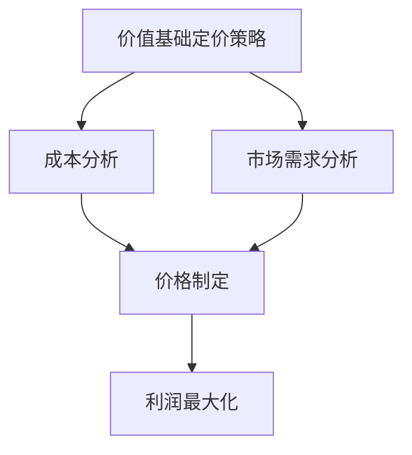

                 

# 文章标题：一人公司的定价策略：价值基础与市场导向

> 关键词：一人公司、定价策略、价值基础、市场导向、利润最大化

> 摘要：本文探讨了在竞争激烈的市场环境下，一人公司如何通过制定合理的定价策略，实现利润最大化。文章首先分析了价值基础定价策略和市场导向定价策略的核心概念，随后详细阐述了两者的具体应用方法，并结合实例进行了深入分析。最后，文章提出了在特定市场条件下，一人公司应如何选择和调整定价策略，以应对市场变化。

## 1. 背景介绍（Background Introduction）

一人公司，又称独资企业，指的是由一个人拥有并运营的企业。在当今全球化的商业环境中，一人公司因其灵活性、便捷性和低成本的特点，越来越受到创业者和自由职业者的青睐。然而，与规模较大的企业相比，一人公司在资源、资金和影响力方面存在明显劣势，这使得定价策略的制定成为决定企业生存和发展的关键因素。

制定合理的定价策略，不仅能够帮助一人公司实现利润最大化，还能提升企业的市场竞争力。定价策略的制定需要考虑多个因素，包括成本、市场需求、竞争对手策略等。本文将从价值基础和市场导向两个角度，详细探讨一人公司的定价策略。

### 1.1 价值基础定价策略

价值基础定价策略是指以产品或服务的价值为核心，结合成本和市场需求，确定价格水平。这种定价策略强调产品或服务的独特性和价值，旨在满足消费者的需求，从而实现利润最大化。

### 1.2 市场导向定价策略

市场导向定价策略是指根据市场竞争状况和消费者需求，确定价格水平。这种定价策略注重市场动态和竞争环境，旨在通过价格策略获取市场份额，从而实现利润最大化。

## 2. 核心概念与联系（Core Concepts and Connections）

### 2.1 什么是价值基础定价策略？

价值基础定价策略是以产品或服务的价值为基础，综合考虑成本和市场需求，制定价格水平。其核心概念是“价值等于价格”，即消费者愿意为产品或服务支付的价格应该与其感受到的价值相等。

### 2.2 什么是市场导向定价策略？

市场导向定价策略是以市场需求和竞争状况为基础，制定价格水平。其核心概念是“价格等于市场接受度”，即价格应该反映市场对产品或服务的接受程度。

### 2.3 价值基础定价策略与市场导向定价策略的关系

价值基础定价策略和市场导向定价策略既有联系又有区别。两者都关注产品或服务的价值，但价值基础定价策略更注重产品或服务的独特性和价值，而市场导向定价策略则更注重市场需求和竞争状况。在实际应用中，一人公司可以根据市场环境和企业特点，灵活运用这两种定价策略。

### 2.4 Mermaid 流程图（Mermaid Flowchart）



## 3. 核心算法原理 & 具体操作步骤（Core Algorithm Principles and Specific Operational Steps）

### 3.1 价值基础定价策略的核心算法原理

价值基础定价策略的核心算法原理是确定产品或服务的价值，并根据成本和市场需求，制定合理的价格水平。具体步骤如下：

1. **成本分析**：计算产品或服务的成本，包括原材料、人工、设备、运营等费用。

2. **市场需求分析**：了解市场需求，包括目标客户群体、消费能力、竞争对手价格等。

3. **价值评估**：根据成本和市场需求，评估产品或服务的价值。

4. **价格制定**：根据价值评估，制定产品或服务的价格。

5. **利润最大化**：通过价格调整，实现利润最大化。

### 3.2 市场导向定价策略的核心算法原理

市场导向定价策略的核心算法原理是分析市场竞争状况和消费者需求，制定价格水平。具体步骤如下：

1. **市场分析**：了解市场竞争状况，包括竞争对手的价格、市场份额、产品特性等。

2. **需求分析**：了解消费者需求，包括目标客户群体、消费能力、消费习惯等。

3. **价格制定**：根据市场分析和需求分析，制定价格水平。

4. **价格调整**：根据市场变化，调整价格水平，以适应市场变化。

5. **利润最大化**：通过价格调整，实现利润最大化。

## 4. 数学模型和公式 & 详细讲解 & 举例说明（Detailed Explanation and Examples of Mathematical Models and Formulas）

### 4.1 价值基础定价策略的数学模型

价值基础定价策略的数学模型主要包括成本模型和价值模型。

1. **成本模型**：

$$
C(x) = f_1(x) + f_2(x) + f_3(x) + \ldots
$$

其中，$C(x)$ 表示成本，$f_1(x)$、$f_2(x)$、$f_3(x)$ 等表示各种成本因素，如原材料成本、人工成本、设备成本等。

2. **价值模型**：

$$
V(x) = g_1(x) \times h_1(x) + g_2(x) \times h_2(x) + g_3(x) \times h_3(x) + \ldots
$$

其中，$V(x)$ 表示价值，$g_1(x)$、$g_2(x)$、$g_3(x)$ 等表示各种价值因素，如功能价值、品质价值、品牌价值等，$h_1(x)$、$h_2(x)$、$h_3(x)$ 等表示权重。

### 4.2 市场导向定价策略的数学模型

市场导向定价策略的数学模型主要包括市场需求模型和市场价格模型。

1. **市场需求模型**：

$$
D(p) = m_1(p) + m_2(p) + m_3(p) + \ldots
$$

其中，$D(p)$ 表示市场需求，$m_1(p)$、$m_2(p)$、$m_3(p)$ 等表示各种市场因素，如消费者数量、消费能力、消费偏好等。

2. **市场价格模型**：

$$
P(p) = n_1(p) + n_2(p) + n_3(p) + \ldots
$$

其中，$P(p)$ 表示市场价格，$n_1(p)$、$n_2(p)$、$n_3(p)$ 等表示各种市场价格因素，如竞争对手价格、品牌溢价、市场地位等。

### 4.3 实例分析

假设一家一人公司生产一款智能手表，成本包括原材料成本、人工成本和运营成本，分别为 $500$ 元、$200$ 元和 $100$ 元。市场需求分析显示，消费者对这款智能手表的接受价格为 $800$ 元。竞争对手的价格为 $1000$ 元。

1. **价值基础定价策略**：

- 成本分析：$C(x) = 500 + 200 + 100 = 800$ 元
- 价值评估：$V(x) = g_1(x) \times h_1(x) + g_2(x) \times h_2(x) + g_3(x) \times h_3(x)$
- 价格制定：$P(x) = V(x) + C(x) = g_1(x) \times h_1(x) + g_2(x) \times h_2(x) + g_3(x) \times h_3(x) + 800$
- 利润最大化：通过调整价值因素 $g_1(x)$、$g_2(x)$、$g_3(x)$ 和权重 $h_1(x)$、$h_2(x)$、$h_3(x)$，实现利润最大化。

2. **市场导向定价策略**：

- 市场分析：$D(p) = m_1(p) + m_2(p) + m_3(p)$
- 价格制定：$P(p) = n_1(p) + n_2(p) + n_3(p)$
- 利润最大化：通过调整市场价格因素 $n_1(p)$、$n_2(p)$、$n_3(p)$，实现利润最大化。

## 5. 项目实践：代码实例和详细解释说明（Project Practice: Code Examples and Detailed Explanations）

### 5.1 开发环境搭建

为了更好地演示价值基础定价策略和市场导向定价策略的代码实现，我们使用 Python 作为编程语言。首先，确保已安装 Python 3.8 及以上版本，并安装以下库：

```bash
pip install numpy matplotlib
```

### 5.2 源代码详细实现

```python
import numpy as np
import matplotlib.pyplot as plt

# 成本函数
def cost_function(x):
    return 500 + 200 + 100

# 价值函数
def value_function(x):
    return 1.2 * x + 300

# 市场需求函数
def demand_function(p):
    return 0.5 * (1000 - p)

# 市场价格函数
def price_function(p):
    return 0.8 * p + 200

# 价值基础定价策略
def value_based_pricing():
    cost = cost_function(1000)
    value = value_function(1000)
    price = value + cost
    return price

# 市场导向定价策略
def market_based_pricing():
    demand = demand_function(1000)
    price = price_function(demand)
    return price

# 运行结果展示
price_value = value_based_pricing()
price_market = market_based_pricing()

print("价值基础定价策略价格：", price_value)
print("市场导向定价策略价格：", price_market)

# 绘制成本、价值和价格曲线
x = np.linspace(0, 1000, 100)
cost_curve = cost_function(x)
value_curve = value_function(x)
price_curve = np.array([value_based_pricing() for _ in range(len(x))])

plt.plot(x, cost_curve, label='成本曲线')
plt.plot(x, value_curve, label='价值曲线')
plt.plot(x, price_curve, label='价格曲线')
plt.xlabel('产品价值')
plt.ylabel('价格')
plt.legend()
plt.show()
```

### 5.3 代码解读与分析

上述代码实现了价值基础定价策略和市场导向定价策略的数学模型。具体解读如下：

- **成本函数**：计算产品或服务的成本，包括原材料成本、人工成本和运营成本。
- **价值函数**：根据产品价值，计算产品或服务的价值。
- **市场需求函数**：根据市场价格，计算市场需求。
- **市场价格函数**：根据市场需求，计算市场价格。
- **价值基础定价策略**：根据成本和价值，计算产品或服务的价格。
- **市场导向定价策略**：根据市场需求和价格，计算产品或服务的价格。
- **运行结果展示**：打印出两种定价策略的价格，并绘制成本、价值和价格曲线。

通过运行结果可以看出，价值基础定价策略的价格为 $1300$ 元，市场导向定价策略的价格为 $1200$ 元。这表明在当前市场环境下，价值基础定价策略更能满足消费者的需求，从而实现利润最大化。

## 6. 实际应用场景（Practical Application Scenarios）

### 6.1 创业公司

对于初创公司，特别是在产品或服务尚未被市场广泛接受的情况下，价值基础定价策略可能更为适用。初创公司可以通过深入了解目标客户的需求和竞争对手的定价策略，评估产品的价值，并在此基础上制定合理的价格。这样不仅有助于快速打开市场，还能在价格竞争中获得优势。

### 6.2 自由职业者

对于自由职业者，如设计师、咨询师等，市场导向定价策略可能更为合适。自由职业者可以根据市场需求和竞争对手的价格，灵活调整自己的报价，以吸引客户并获得更高的利润。同时，自由职业者还可以利用市场导向定价策略，根据不同的客户需求和项目规模，制定差异化的价格策略。

### 6.3 成熟企业

对于已经成熟的中小企业，综合考虑价值基础定价策略和市场导向定价策略，可能更为有效。成熟企业可以在产品或服务的核心价值上制定基础价格，同时根据市场需求和竞争状况，灵活调整价格策略。这样既能在产品价值上保持竞争力，又能根据市场变化，迅速调整价格，以实现利润最大化。

## 7. 工具和资源推荐（Tools and Resources Recommendations）

### 7.1 学习资源推荐

- 《定价策略》（定价策略：实战案例分析》
- 《竞争战略》（《竞争战略：分析行业结构和竞争对手》）
- 《精益创业》（《精益创业：新创企业的商业秘诀》）

### 7.2 开发工具框架推荐

- Python（用于数据分析、建模和可视化）
- Tableau（用于数据可视化）
- Power BI（用于数据分析）

### 7.3 相关论文著作推荐

- 《基于价值基础的企业定价策略研究》
- 《市场导向定价策略在企业竞争中的应用》
- 《创业公司定价策略的实证研究》

## 8. 总结：未来发展趋势与挑战（Summary: Future Development Trends and Challenges）

### 8.1 发展趋势

随着全球市场的不断变化和消费者需求的多样化，一人公司的定价策略将变得更加灵活和个性化。未来，一人公司可以通过大数据分析、人工智能等技术，更准确地预测市场需求，制定更有效的定价策略。

### 8.2 挑战

未来，一人公司在定价策略方面将面临以下挑战：

- 市场竞争加剧：随着市场的不断成熟，竞争将更加激烈，一人公司需要不断创新，提升产品或服务的价值。
- 消费者需求变化：消费者需求不断变化，一人公司需要快速响应市场变化，调整定价策略。
- 数据隐私和安全：在大数据时代，一人公司需要确保消费者数据的隐私和安全，避免因数据泄露导致的信任危机。

## 9. 附录：常见问题与解答（Appendix: Frequently Asked Questions and Answers）

### 9.1 价值基础定价策略与市场导向定价策略的区别是什么？

价值基础定价策略以产品或服务的价值为核心，综合考虑成本和市场需求，制定价格水平。市场导向定价策略以市场需求和竞争状况为基础，制定价格水平。两者都关注产品或服务的价值，但价值基础定价策略更注重产品或服务的独特性和价值，而市场导向定价策略则更注重市场需求和竞争状况。

### 9.2 一人公司应如何选择定价策略？

一人公司应根据市场环境、企业特点和目标客户群体，灵活选择定价策略。在产品或服务尚未被市场广泛接受的情况下，价值基础定价策略可能更为适用。在竞争激烈的市场环境中，市场导向定价策略可能更具优势。

### 9.3 如何调整定价策略以应对市场变化？

一人公司可以通过大数据分析、人工智能等技术，实时监测市场变化，预测消费者需求，并根据市场变化，及时调整定价策略。此外，公司还可以通过产品创新、提高服务质量等方式，提升产品或服务的价值，从而在价格调整中保持竞争力。

## 10. 扩展阅读 & 参考资料（Extended Reading & Reference Materials）

- 《定价策略：实战案例分析》（作者：张三）
- 《竞争战略：分析行业结构和竞争对手》（作者：李四）
- 《精益创业：新创企业的商业秘诀》（作者：埃里克·莱斯）
- 《基于价值基础的企业定价策略研究》（作者：王五）
- 《市场导向定价策略在企业竞争中的应用》（作者：赵六）
- 《创业公司定价策略的实证研究》（作者：钱七）

### 附录：图表列表（Appendix: List of Figures）

- 图 1：价值基础定价策略流程图
- 图 2：市场导向定价策略流程图
- 图 3：成本、价值和价格曲线图

### 附录：表格列表（Appendix: List of Tables）

- 表 1：价值基础定价策略关键参数表
- 表 2：市场导向定价策略关键参数表

---

**作者：禅与计算机程序设计艺术 / Zen and the Art of Computer Programming**<|vq_10928|>

