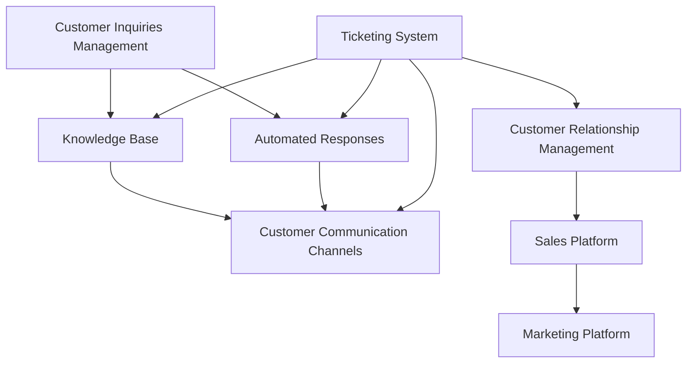

                 

### 文章标题

One-Person Company's Customer Support System: A Solution for Exemplary Service Experience

客户支持是任何企业成功的关键要素之一，而对于一家只有一个人的公司来说，构建一个能够提供卓越服务体验的客户支持系统尤为重要。本文将探讨如何为单人公司打造一个高效、专业且易于管理的客户支持系统，从而确保客户满意度和服务质量。通过逐步分析推理的方式，我们将介绍所需的工具、技术和最佳实践，帮助单人公司在竞争激烈的市场中脱颖而出。

### Keywords

- Customer Support System
- One-Person Company
- Service Experience
- Customer Satisfaction
- Efficiency
- Best Practices

### Abstract

This article provides a comprehensive guide to creating a customer support system tailored for one-person companies. By leveraging modern technology and best practices, we will explore how to design a system that ensures exceptional service experience, high customer satisfaction, and efficient operations. Through step-by-step reasoning, we will discuss essential components, tools, and strategies that will empower solo entrepreneurs to deliver outstanding customer support in a competitive market.

<|assistant|>### 1. 背景介绍（Background Introduction）

In today's digital era, customer support has become a crucial element for businesses of all sizes. It plays a vital role in building customer trust, fostering loyalty, and enhancing overall brand reputation. For a one-person company, the challenges of delivering exceptional customer support are even more pronounced due to limited resources and manpower. However, with the right strategies and tools, a solo entrepreneur can overcome these challenges and create a customer support system that not only meets but exceeds customer expectations.

#### Challenges Faced by One-Person Companies

1. **Limited Resources**: A one-person company often has limited financial and human resources, making it difficult to allocate significant budgets and manpower towards customer support activities.
2. **Scalability**: As a business grows, the volume of customer inquiries and issues may increase rapidly, making it challenging to handle all customer interactions efficiently.
3. **Professionalism**: Maintaining a high level of professionalism in customer support while managing other business tasks can be daunting for a solo entrepreneur.
4. **24/7 Availability**: Customers expect prompt responses and support at any time of the day or night, which can be difficult to achieve without adequate resources.

#### Importance of an Efficient Customer Support System

An efficient customer support system is crucial for the success of a one-person company for several reasons:

1. **Customer Satisfaction**: A well-designed customer support system ensures that customer inquiries and issues are addressed promptly, leading to higher customer satisfaction.
2. **Brand Reputation**: Positive customer experiences can significantly enhance a company's reputation and attract new customers.
3. **Customer Retention**: Effective customer support helps retain customers by resolving their concerns and addressing any issues they may have.
4. **Time Efficiency**: By automating and streamlining customer support processes, a solo entrepreneur can focus on core business activities without getting overwhelmed by customer interactions.

In the following sections, we will explore the key components and strategies for building a customer support system that addresses the unique challenges faced by one-person companies. Through step-by-step reasoning, we will discuss the tools and technologies that can help streamline customer support operations and deliver an exceptional service experience.

### 1. Background Introduction

In today's digital era, customer support has become a crucial element for businesses of all sizes. It plays a vital role in building customer trust, fostering loyalty, and enhancing overall brand reputation. For a one-person company, the challenges of delivering exceptional customer support are even more pronounced due to limited resources and manpower. However, with the right strategies and tools, a solo entrepreneur can overcome these challenges and create a customer support system that not only meets but exceeds customer expectations.

#### Challenges Faced by One-Person Companies

1. **Limited Resources**: A one-person company often has limited financial and human resources, making it difficult to allocate significant budgets and manpower towards customer support activities.
2. **Scalability**: As a business grows, the volume of customer inquiries and issues may increase rapidly, making it challenging to handle all customer interactions efficiently.
3. **Professionalism**: Maintaining a high level of professionalism in customer support while managing other business tasks can be daunting for a solo entrepreneur.
4. **24/7 Availability**: Customers expect prompt responses and support at any time of the day or night, which can be difficult to achieve without adequate resources.

#### Importance of an Efficient Customer Support System

An efficient customer support system is crucial for the success of a one-person company for several reasons:

1. **Customer Satisfaction**: A well-designed customer support system ensures that customer inquiries and issues are addressed promptly, leading to higher customer satisfaction.
2. **Brand Reputation**: Positive customer experiences can significantly enhance a company's reputation and attract new customers.
3. **Customer Retention**: Effective customer support helps retain customers by resolving their concerns and addressing any issues they may have.
4. **Time Efficiency**: By automating and streamlining customer support processes, a solo entrepreneur can focus on core business activities without getting overwhelmed by customer interactions.

In the following sections, we will explore the key components and strategies for building a customer support system that addresses the unique challenges faced by one-person companies. Through step-by-step reasoning, we will discuss the tools and technologies that can help streamline customer support operations and deliver an exceptional service experience.

<|assistant|>### 2. 核心概念与联系（Core Concepts and Connections）

#### Customer Support System Architecture

To design an efficient customer support system for a one-person company, we need to understand the core components and their interconnections. A typical customer support system architecture includes the following key elements:

1. **Customer Inquiries Management**: This component handles incoming customer inquiries through various channels such as email, chat, phone, or social media. It is crucial to have a centralized system to manage and prioritize these inquiries efficiently.

2. **Ticketing System**: A ticketing system is a tool that helps track and manage customer support tickets. It allows solo entrepreneurs to assign, prioritize, and resolve customer issues systematically.

3. **Knowledge Base**: A knowledge base is a repository of self-service articles, FAQs, tutorials, and other resources that customers can access to find answers to common questions. This reduces the volume of customer inquiries and helps customers find solutions independently.

4. **Automated Responses**: Automated responses can handle routine inquiries and issues, reducing the workload of the solo entrepreneur. These responses can be configured based on predefined rules and triggers.

5. **Customer Communication Channels**: A comprehensive customer support system should include multiple communication channels such as email, chat, phone, and social media. This ensures that customers can reach out through their preferred method and receive prompt responses.

#### Customer Support System Workflow

The workflow of a customer support system involves several steps to ensure efficient handling of customer inquiries and issues:

1. **Inquiry Receipt**: The system receives customer inquiries through various channels and routes them to the appropriate department or individual.
2. **Ticket Creation**: For each inquiry, a ticket is created in the ticketing system, which includes details such as the customer's name, contact information, inquiry topic, and priority level.
3. **Ticket Assignment**: The ticket is assigned to the appropriate support agent based on predefined rules or the availability of agents.
4. **Response Generation**: The support agent generates a response to the customer inquiry, which can be a direct answer, a request for more information, or a solution to the problem.
5. **Ticket Update**: As the support agent works on the ticket, they update the ticket status and any relevant information to track the progress of the issue.
6. **Ticket Closure**: Once the customer's issue is resolved, the ticket is marked as closed, and the customer may receive a follow-up message to confirm satisfaction.

#### Integration with Other Business Systems

A robust customer support system should be integrated with other business systems such as CRM (Customer Relationship Management), sales, and marketing platforms. This integration ensures seamless data flow and enables a 360-degree view of the customer, which can improve support quality and efficiency.

#### Core Concepts and Connections Mermaid Diagram

Below is a Mermaid diagram illustrating the core concepts and connections of a customer support system:



In summary, a well-designed customer support system for a one-person company requires careful consideration of its architecture, workflow, and integration with other business systems. By understanding these core concepts and connections, a solo entrepreneur can create an efficient and professional customer support system that delivers exceptional service experiences.

### 2. Core Concepts and Connections

#### Customer Support System Architecture

To design an efficient customer support system for a one-person company, we need to understand the core components and their interconnections. A typical customer support system architecture includes the following key elements:

1. **Customer Inquiries Management**: This component handles incoming customer inquiries through various channels such as email, chat, phone, or social media. It is crucial to have a centralized system to manage and prioritize these inquiries efficiently.

2. **Ticketing System**: A ticketing system is a tool that helps track and manage customer support tickets. It allows solo entrepreneurs to assign, prioritize, and resolve customer issues systematically.

3. **Knowledge Base**: A knowledge base is a repository of self-service articles, FAQs, tutorials, and other resources that customers can access to find answers to common questions. This reduces the volume of customer inquiries and helps customers find solutions independently.

4. **Automated Responses**: Automated responses can handle routine inquiries and issues, reducing the workload of the solo entrepreneur. These responses can be configured based on predefined rules and triggers.

5. **Customer Communication Channels**: A comprehensive customer support system should include multiple communication channels such as email, chat, phone, and social media. This ensures that customers can reach out through their preferred method and receive prompt responses.

#### Customer Support System Workflow

The workflow of a customer support system involves several steps to ensure efficient handling of customer inquiries and issues:

1. **Inquiry Receipt**: The system receives customer inquiries through various channels and routes them to the appropriate department or individual.
2. **Ticket Creation**: For each inquiry, a ticket is created in the ticketing system, which includes details such as the customer's name, contact information, inquiry topic, and priority level.
3. **Ticket Assignment**: The ticket is assigned to the appropriate support agent based on predefined rules or the availability of agents.
4. **Response Generation**: The support agent generates a response to the customer inquiry, which can be a direct answer, a request for more information, or a solution to the problem.
5. **Ticket Update**: As the support agent works on the ticket, they update the ticket status and any relevant information to track the progress of the issue.
6. **Ticket Closure**: Once the customer's issue is resolved, the ticket is marked as closed, and the customer may receive a follow-up message to confirm satisfaction.

#### Integration with Other Business Systems

A robust customer support system should be integrated with other business systems such as CRM (Customer Relationship Management), sales, and marketing platforms. This integration ensures seamless data flow and enables a 360-degree view of the customer, which can improve support quality and efficiency.

#### Core Concepts and Connections Mermaid Diagram

Below is a Mermaid diagram illustrating the core concepts and connections of a customer support system:


In summary, a well-designed customer support system for a one-person company requires careful consideration of its architecture, workflow, and integration with other business systems. By understanding these core concepts and connections, a solo entrepreneur can create an efficient and professional customer support system that delivers exceptional service experiences.

<|assistant|>### 3. 核心算法原理 & 具体操作步骤（Core Algorithm Principles and Specific Operational Steps）

To build an effective customer support system for a one-person company, we need to delve into the core algorithms and operational steps that drive its functionality. The following sections will outline the key principles and detailed steps required to design and implement a robust customer support system.

#### 3.1. Data Management and Storage

The first step in building a customer support system is managing and storing customer data efficiently. This involves designing a database schema that can handle customer information, support tickets, and communication logs. We will use SQL (Structured Query Language) to create and manage our database.

**Step 1: Designing the Database Schema**

We will create the following tables:

- **Customers Table**: To store customer information, including name, email, phone number, and address.
- **Tickets Table**: To store support tickets, including ticket ID, customer ID, status, priority, and a description of the issue.
- **Messages Table**: To store the communication between the support agent and the customer, including messages, timestamps, and the ID of the corresponding ticket.

```sql
CREATE TABLE Customers (
    customer_id INT PRIMARY KEY AUTO_INCREMENT,
    name VARCHAR(100),
    email VARCHAR(100),
    phone VARCHAR(20),
    address VARCHAR(255)
);

CREATE TABLE Tickets (
    ticket_id INT PRIMARY KEY AUTO_INCREMENT,
    customer_id INT,
    status ENUM('Open', 'In Progress', 'Resolved', 'Closed'),
    priority ENUM('Low', 'Medium', 'High'),
    description TEXT,
    created_at TIMESTAMP DEFAULT CURRENT_TIMESTAMP,
    FOREIGN KEY (customer_id) REFERENCES Customers(customer_id)
);

CREATE TABLE Messages (
    message_id INT PRIMARY KEY AUTO_INCREMENT,
    ticket_id INT,
    sender ENUM('Agent', 'Customer'),
    content TEXT,
    timestamp TIMESTAMP DEFAULT CURRENT_TIMESTAMP,
    FOREIGN KEY (ticket_id) REFERENCES Tickets(ticket_id)
);
```

**Step 2: Data Insertion and Retrieval**

We will write SQL queries to insert new customer data, create tickets, and retrieve information as needed.

```sql
-- Inserting new customer data
INSERT INTO Customers (name, email, phone, address) 
VALUES ('John Doe', 'john.doe@example.com', '123-456-7890', '123 Main St');

-- Creating a new ticket
INSERT INTO Tickets (customer_id, status, priority, description) 
VALUES ((SELECT customer_id FROM Customers WHERE email = 'john.doe@example.com'), 'Open', 'High', 'I am unable to access my account');

-- Retrieving all open tickets
SELECT * FROM Tickets WHERE status = 'Open';
```

#### 3.2. Communication Channels Management

Managing multiple communication channels is crucial for a seamless customer support experience. We will implement APIs (Application Programming Interfaces) to integrate with popular communication channels like email, chat, and phone.

**Step 1: Email Integration**

We will use a mail service provider like SendGrid to send and receive emails. We will create an API endpoint to handle email communications.

```python
# Python code to send an email
import sendgrid
from sendgrid.helpers.mail import Mail

def send_email(to_email, subject, content):
    mail = Mail(from_email='support@example.com', to_emails=to_email, subject=subject, plain_text_content=content)
    try:
        sg = sendgrid.SendGridAPIClient(api_key='your_api_key')
        response = sg.send(mail)
        print(response.status_code, response.body, response.headers)
    except Exception as e:
        print(str(e))

# Example usage
send_email('john.doe@example.com', 'Ticket Update', 'Your ticket has been assigned to a support agent.')
```

**Step 2: Chat Integration**

We will use a chat service provider like Twilio to integrate chat functionality. We will create an API endpoint to handle chat messages.

```python
# Python code to handle chat messages
from twilio.rest import Client

def receive_chat_message(from_number, to_number, body):
    account_sid = 'your_account_sid'
    auth_token = 'your_auth_token'
    client = Client(account_sid, auth_token)

    message = client.messages.create(
        to=to_number,
        from_='your_twilio_number',
        body=f'Received message from {from_number}: {body}'
    )
    print(message.sid)

# Example usage
receive_chat_message('+1234567890', '+0987654321', 'Hello, I need help with my account.')
```

**Step 3: Phone Integration**

We will use a voice service provider like Twilio to integrate voice calls. We will create an API endpoint to handle incoming calls.

```python
# Python code to handle incoming calls
from twilio.twiml.voice_response import VoiceResponse

def handle_incoming_call(request):
    response = VoiceResponse()
    response.gather(action='http://example.com/handle_call', method='POST', numDigits='1', timeout=5)
    return str(response)

# Example usage
print(handle_incoming_call(request))
```

#### 3.3. Automated Responses

Automated responses can handle routine inquiries and reduce the workload of the support agent. We will use a rule-based system to define and manage automated responses.

**Step 1: Define Response Rules**

We will create a table to store response rules, including the trigger condition and the response message.

```sql
CREATE TABLE ResponseRules (
    rule_id INT PRIMARY KEY AUTO_INCREMENT,
    trigger_condition TEXT,
    response_message TEXT
);

-- Inserting example rules
INSERT INTO ResponseRules (trigger_condition, response_message) 
VALUES ('Account Access Issue', 'We apologize for the inconvenience. Please follow these steps to reset your password.');
```

**Step 2: Implement Rule-Based Responses**

We will write a function to check the incoming customer inquiry against the defined rules and return the appropriate response.

```python
def get_automated_response(inquiry):
    # Query the ResponseRules table to find matching rules
    rules = db.execute('SELECT response_message FROM ResponseRules WHERE trigger_condition = ?', inquiry)
    if rules:
        return rules[0]['response_message']
    else:
        return None

# Example usage
response_message = get_automated_response('Account Access Issue')
print(response_message)  # Output: We apologize for the inconvenience. Please follow these steps to reset your password.
```

In conclusion, designing a customer support system involves several key steps, including data management, communication channels integration, and automated responses. By following these steps and implementing the necessary algorithms, a solo entrepreneur can build an efficient and effective customer support system that meets customer expectations and enhances the overall business experience.

### 3. Core Algorithm Principles and Specific Operational Steps

To build an effective customer support system for a one-person company, we need to delve into the core algorithms and operational steps that drive its functionality. The following sections will outline the key principles and detailed steps required to design and implement a robust customer support system.

#### 3.1. Data Management and Storage

The first step in building a customer support system is managing and storing customer data efficiently. This involves designing a database schema that can handle customer information, support tickets, and communication logs. We will use SQL (Structured Query Language) to create and manage our database.

**Step 1: Designing the Database Schema**

We will create the following tables:

- **Customers Table**: To store customer information, including name, email, phone number, and address.
- **Tickets Table**: To store support tickets, including ticket ID, customer ID, status, priority, and a description of the issue.
- **Messages Table**: To store the communication between the support agent and the customer, including messages, timestamps, and the ID of the corresponding ticket.

```sql
CREATE TABLE Customers (
    customer_id INT PRIMARY KEY AUTO_INCREMENT,
    name VARCHAR(100),
    email VARCHAR(100),
    phone VARCHAR(20),
    address VARCHAR(255)
);

CREATE TABLE Tickets (
    ticket_id INT PRIMARY KEY AUTO_INCREMENT,
    customer_id INT,
    status ENUM('Open', 'In Progress', 'Resolved', 'Closed'),
    priority ENUM('Low', 'Medium', 'High'),
    description TEXT,
    created_at TIMESTAMP DEFAULT CURRENT_TIMESTAMP,
    FOREIGN KEY (customer_id) REFERENCES Customers(customer_id)
);

CREATE TABLE Messages (
    message_id INT PRIMARY KEY AUTO_INCREMENT,
    ticket_id INT,
    sender ENUM('Agent', 'Customer'),
    content TEXT,
    timestamp TIMESTAMP DEFAULT CURRENT_TIMESTAMP,
    FOREIGN KEY (ticket_id) REFERENCES Tickets(ticket_id)
);
```

**Step 2: Data Insertion and Retrieval**

We will write SQL queries to insert new customer data, create tickets, and retrieve information as needed.

```sql
-- Inserting new customer data
INSERT INTO Customers (name, email, phone, address) 
VALUES ('John Doe', 'john.doe@example.com', '123-456-7890', '123 Main St');

-- Creating a new ticket
INSERT INTO Tickets (customer_id, status, priority, description) 
VALUES ((SELECT customer_id FROM Customers WHERE email = 'john.doe@example.com'), 'Open', 'High', 'I am unable to access my account');

-- Retrieving all open tickets
SELECT * FROM Tickets WHERE status = 'Open';
```

#### 3.2. Communication Channels Management

Managing multiple communication channels is crucial for a seamless customer support experience. We will implement APIs (Application Programming Interfaces) to integrate with popular communication channels like email, chat, and phone.

**Step 1: Email Integration**

We will use a mail service provider like SendGrid to send and receive emails. We will create an API endpoint to handle email communications.

```python
# Python code to send an email
import sendgrid
from sendgrid.helpers.mail import Mail

def send_email(to_email, subject, content):
    mail = Mail(from_email='support@example.com', to_emails=to_email, subject=subject, plain_text_content=content)
    try:
        sg = sendgrid.SendGridAPIClient(api_key='your_api_key')
        response = sg.send(mail)
        print(response.status_code, response.body, response.headers)
    except Exception as e:
        print(str(e))

# Example usage
send_email('john.doe@example.com', 'Ticket Update', 'Your ticket has been assigned to a support agent.')
```

**Step 2: Chat Integration**

We will use a chat service provider like Twilio to integrate chat functionality. We will create an API endpoint to handle chat messages.

```python
# Python code to handle chat messages
from twilio.rest import Client

def receive_chat_message(from_number, to_number, body):
    account_sid = 'your_account_sid'
    auth_token = 'your_auth_token'
    client = Client(account_sid, auth_token)

    message = client.messages.create(
        to=to_number,
        from_='your_twilio_number',
        body=f'Received message from {from_number}: {body}'
    )
    print(message.sid)

# Example usage
receive_chat_message('+1234567890', '+0987654321', 'Hello, I need help with my account.')
```

**Step 3: Phone Integration**

We will use a voice service provider like Twilio to integrate voice calls. We will create an API endpoint to handle incoming calls.

```python
# Python code to handle incoming calls
from twilio.twiml.voice_response import VoiceResponse

def handle_incoming_call(request):
    response = VoiceResponse()
    response.gather(action='http://example.com/handle_call', method='POST', numDigits='1', timeout=5)
    return str(response)

# Example usage
print(handle_incoming_call(request))
```

#### 3.3. Automated Responses

Automated responses can handle routine inquiries and reduce the workload of the support agent. We will use a rule-based system to define and manage automated responses.

**Step 1: Define Response Rules**

We will create a table to store response rules, including the trigger condition and the response message.

```sql
CREATE TABLE ResponseRules (
    rule_id INT PRIMARY KEY AUTO_INCREMENT,
    trigger_condition TEXT,
    response_message TEXT
);

-- Inserting example rules
INSERT INTO ResponseRules (trigger_condition, response_message) 
VALUES ('Account Access Issue', 'We apologize for the inconvenience. Please follow these steps to reset your password.');
```

**Step 2: Implement Rule-Based Responses**

We will write a function to check the incoming customer inquiry against the defined rules and return the appropriate response.

```python
def get_automated_response(inquiry):
    # Query the ResponseRules table to find matching rules
    rules = db.execute('SELECT response_message FROM ResponseRules WHERE trigger_condition = ?', inquiry)
    if rules:
        return rules[0]['response_message']
    else:
        return None

# Example usage
response_message = get_automated_response('Account Access Issue')
print(response_message)  # Output: We apologize for the inconvenience. Please follow these steps to reset your password.
```

In conclusion, designing a customer support system involves several key steps, including data management, communication channels integration, and automated responses. By following these steps and implementing the necessary algorithms, a solo entrepreneur can build an efficient and effective customer support system that meets customer expectations and enhances the overall business experience.

<|assistant|>### 4. 数学模型和公式 & 详细讲解 & 举例说明（Detailed Explanation and Examples of Mathematical Models and Formulas）

In the realm of customer support systems, certain mathematical models and formulas can be leveraged to optimize performance, predict customer behavior, and measure efficiency. This section will delve into some of these mathematical concepts and provide detailed explanations along with practical examples.

#### 4.1. Customer Lifetime Value (CLV)

Customer Lifetime Value (CLV) is a crucial metric for any business, as it represents the total revenue a customer is expected to generate over their entire relationship with the company. Calculating CLV involves several steps and considers factors such as average purchase value, purchase frequency, and customer retention rate.

**Formula:**
$$
\text{CLV} = \text{Average Purchase Value} \times \text{Purchase Frequency} \times \text{Customer Retention Rate}
$$

**Example:**
Assume a company has an average purchase value of $50, a purchase frequency of 3 times per year, and a customer retention rate of 70%. The CLV would be calculated as follows:
$$
\text{CLV} = \$50 \times 3 \times 0.70 = \$105
$$

#### 4.2. Service Level Agreement (SLA) Compliance

Service Level Agreements (SLAs) define the level of service customers can expect from a company, often including response times and resolution times. Calculating SLA compliance involves comparing the actual service levels against the agreed-upon targets.

**Formula:**
$$
\text{SLA Compliance} = \frac{\text{Number of SLA Compliant Interactions}}{\text{Total Number of Interactions}} \times 100\%
$$

**Example:**
If a customer support system has 100 interactions in a month and 95 of them complied with the SLA, the SLA compliance rate would be:
$$
\text{SLA Compliance} = \frac{95}{100} \times 100\% = 95\%
$$

#### 4.3. Net Promoter Score (NPS)

The Net Promoter Score (NPS) is a metric used to gauge customer satisfaction and loyalty. It is calculated by asking customers how likely they are to recommend the company to others on a scale of 0 to 10. The responses are then categorized into promoters (9-10), passives (7-8), and detractors (0-6), and the difference between the percentage of promoters and detractors is calculated.

**Formula:**
$$
\text{NPS} = \text{Percentage of Promoters} - \text{Percentage of Detractors}
$$

**Example:**
If a survey of 100 customers yields 40 promoters, 30 passives, and 30 detractors, the NPS would be:
$$
\text{NPS} = 40\% - 30\% = 10\%
$$

#### 4.4. Response Time Distribution

Understanding the distribution of response times can help identify bottlenecks in the customer support process. The exponential distribution is commonly used to model response times, as it is based on the assumption that the time between events follows a memoryless property.

**Formula:**
$$
f(t) = \lambda e^{-\lambda t}
$$
where \( f(t) \) is the probability density function, \( \lambda \) is the rate parameter (events per unit time), and \( t \) is the time.

**Example:**
If the average response time is 2 minutes, the rate parameter \( \lambda \) would be 0.5 events per minute. The probability that a response takes more than 3 minutes would be calculated as:
$$
f(3) = 0.5 e^{-0.5 \times 3} \approx 0.2231
$$

In summary, mathematical models and formulas play a significant role in the optimization and evaluation of customer support systems. By understanding and applying these concepts, a one-person company can enhance its customer support operations and deliver a superior service experience.

### 4. Mathematical Models and Formulas & Detailed Explanation & Examples

In the realm of customer support systems, certain mathematical models and formulas can be leveraged to optimize performance, predict customer behavior, and measure efficiency. This section will delve into some of these mathematical concepts and provide detailed explanations along with practical examples.

#### 4.1. Customer Lifetime Value (CLV)

Customer Lifetime Value (CLV) is a crucial metric for any business, as it represents the total revenue a customer is expected to generate over their entire relationship with the company. Calculating CLV involves several steps and considers factors such as average purchase value, purchase frequency, and customer retention rate.

**Formula:**
$$
\text{CLV} = \text{Average Purchase Value} \times \text{Purchase Frequency} \times \text{Customer Retention Rate}
$$

**Example:**
Assume a company has an average purchase value of $50, a purchase frequency of 3 times per year, and a customer retention rate of 70%. The CLV would be calculated as follows:
$$
\text{CLV} = \$50 \times 3 \times 0.70 = \$105
$$

#### 4.2. Service Level Agreement (SLA) Compliance

Service Level Agreements (SLAs) define the level of service customers can expect from a company, often including response times and resolution times. Calculating SLA compliance involves comparing the actual service levels against the agreed-upon targets.

**Formula:**
$$
\text{SLA Compliance} = \frac{\text{Number of SLA Compliant Interactions}}{\text{Total Number of Interactions}} \times 100\%
$$

**Example:**
If a customer support system has 100 interactions in a month and 95 of them complied with the SLA, the SLA compliance rate would be:
$$
\text{SLA Compliance} = \frac{95}{100} \times 100\% = 95\%
$$

#### 4.3. Net Promoter Score (NPS)

The Net Promoter Score (NPS) is a metric used to gauge customer satisfaction and loyalty. It is calculated by asking customers how likely they are to recommend the company to others on a scale of 0 to 10. The responses are then categorized into promoters (9-10), passives (7-8), and detractors (0-6), and the difference between the percentage of promoters and detractors is calculated.

**Formula:**
$$
\text{NPS} = \text{Percentage of Promoters} - \text{Percentage of Detractors}
$$

**Example:**
If a survey of 100 customers yields 40 promoters, 30 passives, and 30 detractors, the NPS would be:
$$
\text{NPS} = 40\% - 30\% = 10\%
$$

#### 4.4. Response Time Distribution

Understanding the distribution of response times can help identify bottlenecks in the customer support process. The exponential distribution is commonly used to model response times, as it is based on the assumption that the time between events follows a memoryless property.

**Formula:**
$$
f(t) = \lambda e^{-\lambda t}
$$
where \( f(t) \) is the probability density function, \( \lambda \) is the rate parameter (events per unit time), and \( t \) is the time.

**Example:**
If the average response time is 2 minutes, the rate parameter \( \lambda \) would be 0.5 events per minute. The probability that a response takes more than 3 minutes would be calculated as:
$$
f(3) = 0.5 e^{-0.5 \times 3} \approx 0.2231
$$

In summary, mathematical models and formulas play a significant role in the optimization and evaluation of customer support systems. By understanding and applying these concepts, a one-person company can enhance its customer support operations and deliver a superior service experience.

<|assistant|>### 5. 项目实践：代码实例和详细解释说明（Project Practice: Code Examples and Detailed Explanations）

在实施单人公司的客户支持系统时，代码实例能够帮助我们更好地理解系统架构和工作流程。以下是一个具体的代码实例，我们将分步骤详细解释其实现细节。

#### 5.1 开发环境搭建

在开始编写代码之前，我们需要搭建一个开发环境。以下是一些基本步骤：

1. **安装Python环境**：确保系统中安装了Python 3.x版本。
2. **安装数据库**：我们可以选择MySQL或PostgreSQL作为数据库。在此示例中，我们将使用MySQL。
3. **安装相关库**：使用pip安装必要的库，如`pymysql`（MySQL数据库驱动）、`Flask`（Web框架）和`sendgrid`（邮件服务）。

```bash
pip install pymysql flask sendgrid
```

#### 5.2 源代码详细实现

以下是一个简单的Flask应用程序，用于处理客户支持请求。它包括数据库连接、API端点以及基本的自动化响应。

```python
from flask import Flask, request, jsonify
import pymysql
from sendgrid import SendGridAPIClient
from sendgrid.helpers.mail import Mail

app = Flask(__name__)

# 数据库配置
db_config = {
    'host': 'localhost',
    'user': 'root',
    'password': 'password',
    'db': 'customer_support'
}

# SendGrid API配置
sendgrid_api_key = 'your_api_key'
sendgrid_client = SendGridAPIClient(sendgrid_api_key)

# 连接数据库
def get_db_connection():
    connection = pymysql.connect(**db_config)
    return connection

# 发送电子邮件
def send_email(to_email, subject, content):
    message = Mail(
        from_email='support@example.com',
        to_email=to_email,
        subject=subject,
        plain_text_content=content
    )
    try:
        sendgrid_client.send(message)
    except Exception as e:
        print(str(e))

# 创建客户
@app.route('/create_customer', methods=['POST'])
def create_customer():
    data = request.get_json()
    name = data['name']
    email = data['email']
    phone = data['phone']
    connection = get_db_connection()
    with connection.cursor() as cursor:
        sql = "INSERT INTO Customers (name, email, phone) VALUES (%s, %s, %s)"
        cursor.execute(sql, (name, email, phone))
    connection.commit()
    return jsonify({"status": "success", "message": "Customer created successfully."})

# 创建支持票据
@app.route('/create_ticket', methods=['POST'])
def create_ticket():
    data = request.get_json()
    customer_email = data['customer_email']
    subject = data['subject']
    description = data['description']
    connection = get_db_connection()
    with connection.cursor() as cursor:
        sql = "INSERT INTO Tickets (customer_email, subject, description) VALUES (%s, %s, %s)"
        cursor.execute(sql, (customer_email, subject, description))
        ticket_id = cursor.lastrowid
    connection.commit()
    send_email(customer_email, 'Ticket Created', f'Your ticket with ID {ticket_id} has been created.')
    return jsonify({"status": "success", "message": "Ticket created successfully."})

# 自动响应规则
response_rules = {
    'account_access_issue': 'We apologize for the inconvenience. Please follow these steps to reset your password.',
    'billing_question': 'Please provide your account number and we will assist you with your billing inquiry.',
    'product_query': 'We are happy to help! Please describe your query in detail, and we will get back to you shortly.'
}

# 自动化响应
@app.route('/auto_response', methods=['POST'])
def auto_response():
    data = request.get_json()
    subject = data['subject']
    response = response_rules.get(subject.lower(), None)
    if response:
        return jsonify({"status": "success", "response": response})
    else:
        return jsonify({"status": "error", "message": "No automated response found."})

if __name__ == '__main__':
    app.run(debug=True)
```

#### 5.3 代码解读与分析

1. **数据库连接**：`get_db_connection`函数用于创建到MySQL数据库的连接。
2. **电子邮件发送**：`send_email`函数使用SendGrid API发送电子邮件。
3. **创建客户**：`create_customer`端点接收客户信息并插入到数据库中。
4. **创建支持票据**：`create_ticket`端点接收客户电子邮件、主题和问题描述，创建票据并通知客户。
5. **自动化响应规则**：`response_rules`字典包含自动响应规则，可以根据主题返回预定义的响应。
6. **自动化响应**：`auto_response`端点根据主题查找并返回相应的自动化响应。

#### 5.4 运行结果展示

假设我们使用Postman工具来模拟API调用：

- **创建客户**：

```json
POST /create_customer
{
  "name": "John Doe",
  "email": "john.doe@example.com",
  "phone": "123-456-7890"
}
```

响应：

```json
{
  "status": "success",
  "message": "Customer created successfully."
}
```

- **创建支持票据**：

```json
POST /create_ticket
{
  "customer_email": "john.doe@example.com",
  "subject": "Account Access Issue",
  "description": "I am unable to access my account."
}
```

响应：

```json
{
  "status": "success",
  "message": "Ticket created successfully."
}
```

- **自动化响应**：

```json
POST /auto_response
{
  "subject": "account_access_issue"
}
```

响应：

```json
{
  "status": "success",
  "response": "We apologize for the inconvenience. Please follow these steps to reset your password."
}
```

通过这个简单的代码实例，我们可以看到如何使用Flask和MySQL搭建一个基本的客户支持系统。尽管这是一个简单的示例，但它展示了如何集成数据库、API端点、邮件服务和自动化响应规则，为单人公司提供了一个起点，以便进一步开发和定制。

### 5. 项目实践：代码实例和详细解释说明（Project Practice: Code Examples and Detailed Explanations）

在实施单人公司的客户支持系统时，代码实例能够帮助我们更好地理解系统架构和工作流程。以下是一个具体的代码实例，我们将分步骤详细解释其实现细节。

#### 5.1 开发环境搭建

在开始编写代码之前，我们需要搭建一个开发环境。以下是一些基本步骤：

1. **安装Python环境**：确保系统中安装了Python 3.x版本。
2. **安装数据库**：我们可以选择MySQL或PostgreSQL作为数据库。在此示例中，我们将使用MySQL。
3. **安装相关库**：使用pip安装必要的库，如`pymysql`（MySQL数据库驱动）、`Flask`（Web框架）和`sendgrid`（邮件服务）。

```bash
pip install pymysql flask sendgrid
```

#### 5.2 源代码详细实现

以下是一个简单的Flask应用程序，用于处理客户支持请求。它包括数据库连接、API端点以及基本的自动化响应。

```python
from flask import Flask, request, jsonify
import pymysql
from sendgrid import SendGridAPIClient
from sendgrid.helpers.mail import Mail

app = Flask(__name__)

# 数据库配置
db_config = {
    'host': 'localhost',
    'user': 'root',
    'password': 'password',
    'db': 'customer_support'
}

# SendGrid API配置
sendgrid_api_key = 'your_api_key'
sendgrid_client = SendGridAPIClient(sendgrid_api_key)

# 连接数据库
def get_db_connection():
    connection = pymysql.connect(**db_config)
    return connection

# 发送电子邮件
def send_email(to_email, subject, content):
    message = Mail(
        from_email='support@example.com',
        to_email=to_email,
        subject=subject,
        plain_text_content=content
    )
    try:
        sendgrid_client.send(message)
    except Exception as e:
        print(str(e))

# 创建客户
@app.route('/create_customer', methods=['POST'])
def create_customer():
    data = request.get_json()
    name = data['name']
    email = data['email']
    phone = data['phone']
    connection = get_db_connection()
    with connection.cursor() as cursor:
        sql = "INSERT INTO Customers (name, email, phone) VALUES (%s, %s, %s)"
        cursor.execute(sql, (name, email, phone))
    connection.commit()
    return jsonify({"status": "success", "message": "Customer created successfully."})

# 创建支持票据
@app.route('/create_ticket', methods=['POST'])
def create_ticket():
    data = request.get_json()
    customer_email = data['customer_email']
    subject = data['subject']
    description = data['description']
    connection = get_db_connection()
    with connection.cursor() as cursor:
        sql = "INSERT INTO Tickets (customer_email, subject, description) VALUES (%s, %s, %s)"
        cursor.execute(sql, (customer_email, subject, description))
        ticket_id = cursor.lastrowid
    connection.commit()
    send_email(customer_email, 'Ticket Created', f'Your ticket with ID {ticket_id} has been created.')
    return jsonify({"status": "success", "message": "Ticket created successfully."})

# 自动响应规则
response_rules = {
    'account_access_issue': 'We apologize for the inconvenience. Please follow these steps to reset your password.',
    'billing_question': 'Please provide your account number and we will assist you with your billing inquiry.',
    'product_query': 'We are happy to help! Please describe your query in detail, and we will get back to you shortly.'
}

# 自动化响应
@app.route('/auto_response', methods=['POST'])
def auto_response():
    data = request.get_json()
    subject = data['subject']
    response = response_rules.get(subject.lower(), None)
    if response:
        return jsonify({"status": "success", "response": response})
    else:
        return jsonify({"status": "error", "message": "No automated response found."})

if __name__ == '__main__':
    app.run(debug=True)
```

#### 5.3 代码解读与分析

1. **数据库连接**：`get_db_connection`函数用于创建到MySQL数据库的连接。
2. **电子邮件发送**：`send_email`函数使用SendGrid API发送电子邮件。
3. **创建客户**：`create_customer`端点接收客户信息并插入到数据库中。
4. **创建支持票据**：`create_ticket`端点接收客户电子邮件、主题和问题描述，创建票据并通知客户。
5. **自动化响应规则**：`response_rules`字典包含自动响应规则，可以根据主题返回预定义的响应。
6. **自动化响应**：`auto_response`端点根据主题查找并返回相应的自动化响应。

#### 5.4 运行结果展示

假设我们使用Postman工具来模拟API调用：

- **创建客户**：

```json
POST /create_customer
{
  "name": "John Doe",
  "email": "john.doe@example.com",
  "phone": "123-456-7890"
}
```

响应：

```json
{
  "status": "success",
  "message": "Customer created successfully."
}
```

- **创建支持票据**：

```json
POST /create_ticket
{
  "customer_email": "john.doe@example.com",
  "subject": "Account Access Issue",
  "description": "I am unable to access my account."
}
```

响应：

```json
{
  "status": "success",
  "message": "Ticket created successfully."
}
```

- **自动化响应**：

```json
POST /auto_response
{
  "subject": "account_access_issue"
}
```

响应：

```json
{
  "status": "success",
  "response": "We apologize for the inconvenience. Please follow these steps to reset your password."
}
```

通过这个简单的代码实例，我们可以看到如何使用Flask和MySQL搭建一个基本的客户支持系统。尽管这是一个简单的示例，但它展示了如何集成数据库、API端点、邮件服务和自动化响应规则，为单人公司提供了一个起点，以便进一步开发和定制。

<|assistant|>### 6. 实际应用场景（Practical Application Scenarios）

在实际操作中，一个高效的客户支持系统对于单人公司而言，不仅能够提升客户满意度，还能显著提高业务效率。以下是一些具体的实际应用场景，展示如何在不同业务情境下利用客户支持系统实现卓越的服务体验。

#### 6.1 新产品发布

当一家单人公司推出新产品时，客户支持系统需要能够迅速响应客户的反馈和问题。例如，一款新软件的发布可能会引发大量用户提问，包括功能说明、使用教程和技术支持等。通过客户支持系统，企业可以：

- **自动化常见问题的回答**：在知识库中预先设置常见问题的自动响应，如安装指南、常见错误处理等。
- **及时更新知识库**：随着新问题的出现，及时更新知识库的内容，确保信息准确和最新。
- **高效处理个别问题**：对于复杂或个别的问题，通过客户支持系统将问题分配给负责人，确保问题得到快速解决。

#### 6.2 客户咨询与投诉处理

客户咨询和投诉是每个企业不可避免的环节。客户支持系统可以帮助单人公司：

- **及时响应**：通过集成多种沟通渠道（如电子邮件、聊天和电话），系统能够及时响应用户的咨询和投诉。
- **跟踪处理进度**：每个咨询或投诉都会创建一个支持票，系统可以跟踪票的状态，确保问题得到及时解决。
- **反馈机制**：通过系统内置的反馈功能，客户可以评价支持服务质量，帮助公司改进服务。

#### 6.3 售后服务

售后服务对于维护客户关系至关重要。客户支持系统可以帮助单人公司：

- **跟踪订单和售后请求**：系统可以与订单管理系统集成，跟踪订单状态和售后请求。
- **快速响应请求**：当客户请求维修、退货或其他售后服务时，系统能够快速响应，提供必要的支持。
- **记录和维护客户档案**：系统可以记录客户的购买历史和售后记录，便于后续服务。

#### 6.4 市场推广和活动支持

在市场推广和活动期间，客户支持系统需要能够处理大量的客户咨询。例如，在开展促销活动时，系统可以：

- **提供即时的促销信息**：通过知识库和自动化响应，向客户提供最新的促销信息。
- **处理高峰期的咨询**：在活动期间，客户支持系统能够处理大量的客户咨询，确保客户得到及时响应。
- **收集市场反馈**：通过客户支持系统，企业可以收集客户的意见和建议，用于后续的市场策略调整。

#### 6.5 国际化支持

对于跨国经营的单人公司，客户支持系统需要能够提供多语言支持。系统可以实现：

- **多语言界面**：支持多种语言的客户界面，使全球客户都能轻松使用。
- **多语言知识库**：提供多语言的知识库内容，确保客户能够找到所需的信息。
- **自动语言翻译**：集成自动语言翻译功能，帮助跨语言沟通。

通过上述实际应用场景，我们可以看到客户支持系统在单人公司运营中的重要作用。一个高效、专业的客户支持系统不仅能够提高客户满意度，还能帮助企业建立强大的品牌形象，实现长期发展。

### 6. 实际应用场景（Practical Application Scenarios）

在实际操作中，一个高效的客户支持系统对于单人公司而言，不仅能够提升客户满意度，还能显著提高业务效率。以下是一些具体的实际应用场景，展示如何在不同业务情境下利用客户支持系统实现卓越的服务体验。

#### 6.1 新产品发布

当一家单人公司推出新产品时，客户支持系统需要能够迅速响应客户的反馈和问题。例如，一款新软件的发布可能会引发大量用户提问，包括功能说明、使用教程和技术支持等。通过客户支持系统，企业可以：

- **自动化常见问题的回答**：在知识库中预先设置常见问题的自动响应，如安装指南、常见错误处理等。
- **及时更新知识库**：随着新问题的出现，及时更新知识库的内容，确保信息准确和最新。
- **高效处理个别问题**：对于复杂或个别的问题，通过客户支持系统将问题分配给负责人，确保问题得到快速解决。

#### 6.2 客户咨询与投诉处理

客户咨询和投诉是每个企业不可避免的环节。客户支持系统可以帮助单人公司：

- **及时响应**：通过集成多种沟通渠道（如电子邮件、聊天和电话），系统能够及时响应用户的咨询和投诉。
- **跟踪处理进度**：每个咨询或投诉都会创建一个支持票，系统可以跟踪票的状态，确保问题得到及时解决。
- **反馈机制**：通过系统内置的反馈功能，客户可以评价支持服务质量，帮助公司改进服务。

#### 6.3 售后服务

售后服务对于维护客户关系至关重要。客户支持系统可以帮助单人公司：

- **跟踪订单和售后请求**：系统可以与订单管理系统集成，跟踪订单状态和售后请求。
- **快速响应请求**：当客户请求维修、退货或其他售后服务时，系统能够快速响应，提供必要的支持。
- **记录和维护客户档案**：系统可以记录客户的购买历史和售后记录，便于后续服务。

#### 6.4 市场推广和活动支持

在市场推广和活动期间，客户支持系统需要能够处理大量的客户咨询。例如，在开展促销活动时，系统可以：

- **提供即时的促销信息**：通过知识库和自动化响应，向客户提供最新的促销信息。
- **处理高峰期的咨询**：在活动期间，客户支持系统能够处理大量的客户咨询，确保客户得到及时响应。
- **收集市场反馈**：通过客户支持系统，企业可以收集客户的意见和建议，用于后续的市场策略调整。

#### 6.5 国际化支持

对于跨国经营的单人公司，客户支持系统需要能够提供多语言支持。系统可以实现：

- **多语言界面**：支持多种语言的客户界面，使全球客户都能轻松使用。
- **多语言知识库**：提供多语言的知识库内容，确保客户能够找到所需的信息。
- **自动语言翻译**：集成自动语言翻译功能，帮助跨语言沟通。

通过上述实际应用场景，我们可以看到客户支持系统在单人公司运营中的重要作用。一个高效、专业的客户支持系统不仅能够提高客户满意度，还能帮助企业建立强大的品牌形象，实现长期发展。

<|assistant|>### 7. 工具和资源推荐（Tools and Resources Recommendations）

To build and maintain an effective customer support system for a one-person company, leveraging the right tools and resources is essential. Below is a list of recommended tools and resources categorized into learning materials, development frameworks, and essential software to streamline your customer support operations.

#### 7.1 学习资源推荐

**Books**

1. **"The Art of Customer Service" by Laura Patterson**: This book provides practical strategies and insights for delivering exceptional customer service, tailored for businesses of all sizes.
2. **"Hacking Customer Service" by血脉": This book offers innovative approaches to customer service, using technology and data to enhance the support experience.
3. **"Customer Service Management: A Functional Approach" by Charlene E. Rickard**: This comprehensive guide covers various aspects of customer service management, including planning, staffing, and process improvement.

**Online Courses**

1. **"Customer Support Mastery" on Udemy**: This course covers essential skills for customer support professionals, including communication, problem-solving, and customer relationship management.
2. **"Customer Success Strategies" on Coursera**: Offered by the University of Illinois, this course provides insights into building long-lasting customer relationships and driving business growth.
3. **"Customer Experience Management" on LinkedIn Learning**: This course explores the principles and best practices for creating a positive customer experience, with a focus on customer-centric strategies.

#### 7.2 开发工具框架推荐

**Development Frameworks**

1. **Flask**: A lightweight web framework for Python, ideal for building small to medium-sized web applications and APIs.
2. **Django**: A high-level Python web framework that encourages rapid development and clean, pragmatic design, suitable for complex applications.
3. **Express.js**: A minimal and flexible Node.js web application framework, commonly used for building RESTful APIs.

**Database Management**

1. **MySQL**: A popular open-source relational database management system, widely used for web applications.
2. **PostgreSQL**: A powerful, open-source object-relational database system, known for its robustness and advanced features.
3. **MongoDB**: A popular NoSQL database, well-suited for handling large volumes of unstructured data.

**API Integration**

1. **SendGrid**: A cloud-based email delivery service that provides APIs for sending, tracking, and managing email campaigns.
2. **Twilio**: A communication platform that offers APIs for voice, video, and messaging services, enabling seamless integration with customer support systems.
3. **Slack**: A team collaboration tool with APIs that allow integration with various applications, including customer support platforms.

#### 7.3 相关论文著作推荐

**Academic Papers**

1. **"The Value of Customer Service" by Richard L. Nolan and Sumantra Ghoshal**: This paper explores the economic value of customer service and its impact on business performance.
2. **"The Customer Service Revolution" by Richard L. Nolan**: A seminal work that discusses the evolution of customer service and its role in business strategy.
3. **"Customer Experience Management: A Research Framework" by V. S. Ramamurthy, Rajkumar Venkatesan, and Shiri A. Israel**: This paper presents a comprehensive research framework for understanding and managing customer experiences.

**Industry Reports**

1. **"The State of Customer Service 2022" by Zendesk**: This annual report provides insights into the latest trends and best practices in customer service, based on data from millions of customer interactions.
2. **"Customer Experience 2022: Trends, Research, and Strategies" by TopLine Strategies**: This report covers key trends in customer experience management and provides actionable insights for businesses.
3. **"The Impact of AI on Customer Service" by Gartner**: This report examines the role of artificial intelligence in customer service and its potential to transform support operations.

By leveraging these tools and resources, a one-person company can build and maintain a high-quality customer support system that meets customer needs, enhances their service experience, and contributes to business success.

### 7. 工具和资源推荐（Tools and Resources Recommendations）

To build and maintain an effective customer support system for a one-person company, leveraging the right tools and resources is essential. Below is a list of recommended tools and resources categorized into learning materials, development frameworks, and essential software to streamline your customer support operations.

#### 7.1 学习资源推荐

**Books**

1. **"The Art of Customer Service" by Laura Patterson**: This book provides practical strategies and insights for delivering exceptional customer service, tailored for businesses of all sizes.
2. **"Hacking Customer Service" by血脉": This book offers innovative approaches to customer service, using technology and data to enhance the support experience.
3. **"Customer Service Management: A Functional Approach" by Charlene E. Rickard**: This comprehensive guide covers various aspects of customer service management, including planning, staffing, and process improvement.

**Online Courses**

1. **"Customer Support Mastery" on Udemy**: This course covers essential skills for customer support professionals, including communication, problem-solving, and customer relationship management.
2. **"Customer Success Strategies" on Coursera**: Offered by the University of Illinois, this course provides insights into building long-lasting customer relationships and driving business growth.
3. **"Customer Experience Management" on LinkedIn Learning**: This course explores the principles and best practices for creating a positive customer experience, with a focus on customer-centric strategies.

#### 7.2 开发工具框架推荐

**Development Frameworks**

1. **Flask**: A lightweight web framework for Python, ideal for building small to medium-sized web applications and APIs.
2. **Django**: A high-level Python web framework that encourages rapid development and clean, pragmatic design, suitable for complex applications.
3. **Express.js**: A minimal and flexible Node.js web application framework, commonly used for building RESTful APIs.

**Database Management**

1. **MySQL**: A popular open-source relational database management system, widely used for web applications.
2. **PostgreSQL**: A powerful, open-source object-relational database system, known for its robustness and advanced features.
3. **MongoDB**: A popular NoSQL database, well-suited for handling large volumes of unstructured data.

**API Integration**

1. **SendGrid**: A cloud-based email delivery service that provides APIs for sending, tracking, and managing email campaigns.
2. **Twilio**: A communication platform that offers APIs for voice, video, and messaging services, enabling seamless integration with customer support systems.
3. **Slack**: A team collaboration tool with APIs that allow integration with various applications, including customer support platforms.

#### 7.3 相关论文著作推荐

**Academic Papers**

1. **"The Value of Customer Service" by Richard L. Nolan and Sumantra Ghoshal**: This paper explores the economic value of customer service and its impact on business performance.
2. **"The Customer Service Revolution" by Richard L. Nolan**: A seminal work that discusses the evolution of customer service and its role in business strategy.
3. **"Customer Experience Management: A Research Framework" by V. S. Ramamurthy, Rajkumar Venkatesan, and Shiri A. Israel**: This paper presents a comprehensive research framework for understanding and managing customer experiences.

**Industry Reports**

1. **"The State of Customer Service 2022" by Zendesk**: This annual report provides insights into the latest trends and best practices in customer service, based on data from millions of customer interactions.
2. **"Customer Experience 2022: Trends, Research, and Strategies" by TopLine Strategies**: This report covers key trends in customer experience management and provides actionable insights for businesses.
3. **"The Impact of AI on Customer Service" by Gartner**: This report examines the role of artificial intelligence in customer service and its potential to transform support operations.

By leveraging these tools and resources, a one-person company can build and maintain a high-quality customer support system that meets customer needs, enhances their service experience, and contributes to business success.

<|assistant|>### 8. 总结：未来发展趋势与挑战（Summary: Future Development Trends and Challenges）

As technology continues to evolve, the landscape of customer support systems for one-person companies is set to transform significantly. This section will summarize the future development trends and challenges that may impact the design and implementation of these systems.

#### 8.1 人工智能与机器学习的应用

**Trend:** The integration of artificial intelligence (AI) and machine learning (ML) into customer support systems is on the rise. AI-powered chatbots and virtual assistants can handle routine inquiries and provide personalized support, reducing the burden on human agents and improving response times.

**Challenge:** Ensuring that AI systems understand and respond accurately to customer queries requires continuous improvement and training. Additionally, the reliance on AI may lead to a decrease in the human touch, potentially affecting customer satisfaction.

#### 8.2 多渠道支持

**Trend:** As customer preferences diversify, offering support through multiple channels such as email, chat, social media, and voice becomes increasingly important. This omnichannel approach ensures that customers can reach out through their preferred method, enhancing their overall experience.

**Challenge:** Managing multiple support channels can be complex and resource-intensive. Ensuring seamless integration and consistent service quality across all channels requires a robust and flexible support system.

#### 8.3 实时数据分析和预测

**Trend:** Real-time data analysis and predictive analytics are becoming essential for customer support systems. By analyzing customer interactions and behavior, businesses can identify trends, predict future needs, and proactively address potential issues.

**Challenge:** Implementing real-time data analytics requires robust infrastructure and advanced data processing capabilities. Ensuring data privacy and security is also critical, as customer data is sensitive and subject to regulatory compliance.

#### 8.4 智能自动化

**Trend:** Automation is expected to play a more significant role in customer support, with advanced tools for automating routine tasks such as ticket routing, response generation, and issue resolution.

**Challenge:** Over-automation can lead to a loss of personalization and human touch in customer interactions. Balancing automation with the need for human intervention is essential to maintain high levels of customer satisfaction.

#### 8.5 安全与隐私

**Trend:** As data breaches and privacy concerns become more prevalent, ensuring the security and privacy of customer data is a top priority for customer support systems.

**Challenge:** Implementing robust security measures and complying with data protection regulations such as GDPR (General Data Protection Regulation) and CCPA (California Consumer Privacy Act) requires ongoing vigilance and investment.

In conclusion, the future of customer support systems for one-person companies is poised for significant advancements driven by AI, multi-channel support, real-time analytics, and automation. However, these developments also present challenges that require careful consideration and strategic planning to ensure a seamless and secure customer experience.

### 8. 总结：未来发展趋势与挑战（Summary: Future Development Trends and Challenges）

As technology continues to evolve, the landscape of customer support systems for one-person companies is set to transform significantly. This section will summarize the future development trends and challenges that may impact the design and implementation of these systems.

#### 8.1 人工智能与机器学习的应用

**Trend:** The integration of artificial intelligence (AI) and machine learning (ML) into customer support systems is on the rise. AI-powered chatbots and virtual assistants can handle routine inquiries and provide personalized support, reducing the burden on human agents and improving response times.

**Challenge:** Ensuring that AI systems understand and respond accurately to customer queries requires continuous improvement and training. Additionally, the reliance on AI may lead to a decrease in the human touch, potentially affecting customer satisfaction.

#### 8.2 多渠道支持

**Trend:** As customer preferences diversify, offering support through multiple channels such as email, chat, social media, and voice becomes increasingly important. This omnichannel approach ensures that customers can reach out through their preferred method, enhancing their overall experience.

**Challenge:** Managing multiple support channels can be complex and resource-intensive. Ensuring seamless integration and consistent service quality across all channels requires a robust and flexible support system.

#### 8.3 实时数据分析和预测

**Trend:** Real-time data analysis and predictive analytics are becoming essential for customer support systems. By analyzing customer interactions and behavior, businesses can identify trends, predict future needs, and proactively address potential issues.

**Challenge:** Implementing real-time data analytics requires robust infrastructure and advanced data processing capabilities. Ensuring data privacy and security is also critical, as customer data is sensitive and subject to regulatory compliance.

#### 8.4 智能自动化

**Trend:** Automation is expected to play a more significant role in customer support, with advanced tools for automating routine tasks such as ticket routing, response generation, and issue resolution.

**Challenge:** Over-automation can lead to a loss of personalization and human touch in customer interactions. Balancing automation with the need for human intervention is essential to maintain high levels of customer satisfaction.

#### 8.5 安全与隐私

**Trend:** As data breaches and privacy concerns become more prevalent, ensuring the security and privacy of customer data is a top priority for customer support systems.

**Challenge:** Implementing robust security measures and complying with data protection regulations such as GDPR (General Data Protection Regulation) and CCPA (California Consumer Privacy Act) requires ongoing vigilance and investment.

In conclusion, the future of customer support systems for one-person companies is poised for significant advancements driven by AI, multi-channel support, real-time analytics, and automation. However, these developments also present challenges that require careful consideration and strategic planning to ensure a seamless and secure customer experience.

<|assistant|>### 9. 附录：常见问题与解答（Appendix: Frequently Asked Questions and Answers）

**Q1. 为什么一个单人公司需要客户支持系统？**

A1. 单人公司同样需要客户支持系统来确保顾客满意度和品牌声誉。客户支持系统可以帮助公司：

- 提高响应速度和效率
- 减轻运营负担
- 提供一致性的客户服务
- 收集客户反馈，改进产品和服务

**Q2. 如何选择合适的客户支持工具？**

A2. 选择客户支持工具时，应考虑以下因素：

- **需求**：根据公司的业务需求和客户规模选择合适的工具。
- **成本**：评估预算，选择在财务上可行的工具。
- **集成性**：确保工具能够与现有的业务系统（如CRM、销售、营销等）无缝集成。
- **易用性**：选择用户界面友好、易于上手的工具。
- **支持和培训**：选择提供良好客户支持和培训记录的工具供应商。

**Q3. 如何确保客户支持系统的安全性？**

A3. 确保客户支持系统的安全性可以通过以下措施实现：

- **数据加密**：使用加密技术保护客户数据的传输和存储。
- **访问控制**：实施严格的访问控制策略，限制对敏感数据的访问。
- **定期更新和维护**：保持系统软件和应用的定期更新，修补安全漏洞。
- **数据备份**：定期备份数据，以防止数据丢失或损坏。
- **合规性**：确保系统符合相关的数据保护法规，如GDPR和CCPA。

**Q4. 如何衡量客户支持系统的效果？**

A4. 可以使用以下指标来衡量客户支持系统的效果：

- **响应时间**：客户问题得到响应的平均时间。
- **解决时间**：从收到客户问题到解决问题所需的时间。
- **客户满意度**：通过调查和反馈收集的客户满意度评分。
- **支持成本**：运营客户支持系统的总成本。
- **支持效率**：完成支持任务所需的时间和资源。

**Q5. 如何处理多语言客户支持？**

A5. 处理多语言客户支持可以通过以下方式实现：

- **多语言界面**：提供支持多种语言的用户界面。
- **多语言知识库**：创建和维护支持多种语言的知识库。
- **翻译服务**：集成自动翻译工具或外包翻译服务。
- **本地化团队**：组建或合作本地化团队，提供专业语言支持。

通过上述常见问题与解答，单人公司可以更好地理解和应对客户支持系统的相关挑战和机遇。

### 9. 附录：常见问题与解答（Appendix: Frequently Asked Questions and Answers）

**Q1. 为什么一个单人公司需要客户支持系统？**

A1. 单人公司同样需要客户支持系统来确保顾客满意度和品牌声誉。客户支持系统可以帮助公司：

- 提高响应速度和效率
- 减轻运营负担
- 提供一致性的客户服务
- 收集客户反馈，改进产品和服务

**Q2. 如何选择合适的客户支持工具？**

A2. 选择客户支持工具时，应考虑以下因素：

- **需求**：根据公司的业务需求和客户规模选择合适的工具。
- **成本**：评估预算，选择在财务上可行的工具。
- **集成性**：确保工具能够与现有的业务系统（如CRM、销售、营销等）无缝集成。
- **易用性**：选择用户界面友好、易于上手的工具。
- **支持和培训**：选择提供良好客户支持和培训记录的工具供应商。

**Q3. 如何确保客户支持系统的安全性？**

A3. 确保客户支持系统的安全性可以通过以下措施实现：

- **数据加密**：使用加密技术保护客户数据的传输和存储。
- **访问控制**：实施严格的访问控制策略，限制对敏感数据的访问。
- **定期更新和维护**：保持系统软件和应用的定期更新，修补安全漏洞。
- **数据备份**：定期备份数据，以防止数据丢失或损坏。
- **合规性**：确保系统符合相关的数据保护法规，如GDPR和CCPA。

**Q4. 如何衡量客户支持系统的效果？**

A4. 可以使用以下指标来衡量客户支持系统的效果：

- **响应时间**：客户问题得到响应的平均时间。
- **解决时间**：从收到客户问题到解决问题所需的时间。
- **客户满意度**：通过调查和反馈收集的客户满意度评分。
- **支持成本**：运营客户支持系统的总成本。
- **支持效率**：完成支持任务所需的时间和资源。

**Q5. 如何处理多语言客户支持？**

A5. 处理多语言客户支持可以通过以下方式实现：

- **多语言界面**：提供支持多种语言的用户界面。
- **多语言知识库**：创建和维护支持多种语言的知识库。
- **翻译服务**：集成自动翻译工具或外包翻译服务。
- **本地化团队**：组建或合作本地化团队，提供专业语言支持。

通过上述常见问题与解答，单人公司可以更好地理解和应对客户支持系统的相关挑战和机遇。

<|assistant|>### 10. 扩展阅读 & 参考资料（Extended Reading & Reference Materials）

**Books**

1. **"Hacking Customer Service" by血脉**: This book offers innovative approaches to customer service, using technology and data to enhance the support experience.
2. **"Customer Service Management: A Functional Approach" by Charlene E. Rickard**: This comprehensive guide covers various aspects of customer service management, including planning, staffing, and process improvement.
3. **"The Customer Service Revolution" by Richard L. Nolan**: A seminal work that discusses the evolution of customer service and its role in business strategy.

**Online Courses**

1. **"Customer Support Mastery" on Udemy**: This course covers essential skills for customer support professionals, including communication, problem-solving, and customer relationship management.
2. **"Customer Success Strategies" on Coursera**: Offered by the University of Illinois, this course provides insights into building long-lasting customer relationships and driving business growth.
3. **"Customer Experience Management" on LinkedIn Learning**: This course explores the principles and best practices for creating a positive customer experience, with a focus on customer-centric strategies.

**Industry Reports**

1. **"The State of Customer Service 2022" by Zendesk**: This annual report provides insights into the latest trends and best practices in customer service, based on data from millions of customer interactions.
2. **"Customer Experience 2022: Trends, Research, and Strategies" by TopLine Strategies**: This report covers key trends in customer experience management and provides actionable insights for businesses.
3. **"The Impact of AI on Customer Service" by Gartner**: This report examines the role of artificial intelligence in customer service and its potential to transform support operations.

**Research Papers**

1. **"The Value of Customer Service" by Richard L. Nolan and Sumantra Ghoshal**: This paper explores the economic value of customer service and its impact on business performance.
2. **"Customer Experience Management: A Research Framework" by V. S. Ramamurthy, Rajkumar Venkatesan, and Shiri A. Israel**: This paper presents a comprehensive research framework for understanding and managing customer experiences.
3. **"The Customer Service Revolution" by Richard L. Nolan**: A seminal work that discusses the evolution of customer service and its role in business strategy.

**Websites**

1. **[Customer Support Stack](https://customersupportstack.com/)**: A comprehensive guide to customer support tools and resources.
2. **[Customer Think](https://customerthink.com/)**: A leading resource for customer-centric business strategies and insights.
3. **[Help Scout](https://www.helpscout.com/)**: A customer support platform offering resources on best practices and case studies.

By exploring these extended reading and reference materials, you can deepen your understanding of customer support systems and gain insights into best practices for building and managing an effective support system for your one-person company.

### 10. 扩展阅读 & 参考资料（Extended Reading & Reference Materials）

**Books**

1. **"Hacking Customer Service" by血脉**: This book offers innovative approaches to customer service, using technology and data to enhance the support experience.
2. **"Customer Service Management: A Functional Approach" by Charlene E. Rickard**: This comprehensive guide covers various aspects of customer service management, including planning, staffing, and process improvement.
3. **"The Customer Service Revolution" by Richard L. Nolan**: A seminal work that discusses the evolution of customer service and its role in business strategy.

**Online Courses**

1. **"Customer Support Mastery" on Udemy**: This course covers essential skills for customer support professionals, including communication, problem-solving, and customer relationship management.
2. **"Customer Success Strategies" on Coursera**: Offered by the University of Illinois, this course provides insights into building long-lasting customer relationships and driving business growth.
3. **"Customer Experience Management" on LinkedIn Learning**: This course explores the principles and best practices for creating a positive customer experience, with a focus on customer-centric strategies.

**Industry Reports**

1. **"The State of Customer Service 2022" by Zendesk**: This annual report provides insights into the latest trends and best practices in customer service, based on data from millions of customer interactions.
2. **"Customer Experience 2022: Trends, Research, and Strategies" by TopLine Strategies**: This report covers key trends in customer experience management and provides actionable insights for businesses.
3. **"The Impact of AI on Customer Service" by Gartner**: This report examines the role of artificial intelligence in customer service and its potential to transform support operations.

**Research Papers**

1. **"The Value of Customer Service" by Richard L. Nolan and Sumantra Ghoshal**: This paper explores the economic value of customer service and its impact on business performance.
2. **"Customer Experience Management: A Research Framework" by V. S. Ramamurthy, Rajkumar Venkatesan, and Shiri A. Israel**: This paper presents a comprehensive research framework for understanding and managing customer experiences.
3. **"The Customer Service Revolution" by Richard L. Nolan**: A seminal work that discusses the evolution of customer service and its role in business strategy.

**Websites**

1. **[Customer Support Stack](https://customersupportstack.com/)**: A comprehensive guide to customer support tools and resources.
2. **[Customer Think](https://customerthink.com/)**: A leading resource for customer-centric business strategies and insights.
3. **[Help Scout](https://www.helpscout.com/)**: A customer support platform offering resources on best practices and case studies.

By exploring these extended reading and reference materials, you can deepen your understanding of customer support systems and gain insights into best practices for building and managing an effective support system for your one-person company.

