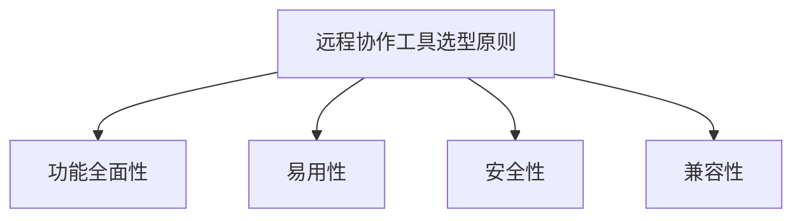
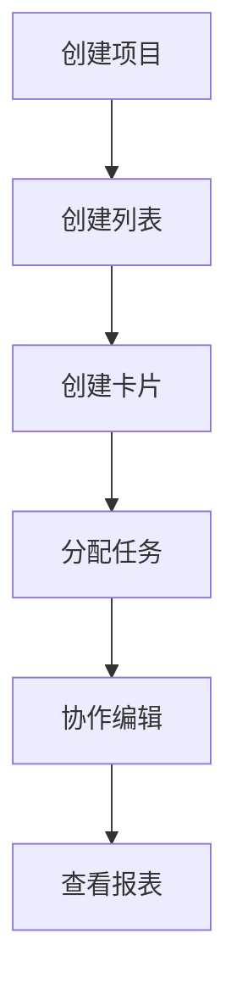

                 

# 一人公司的远程协作工具与最佳实践

## 关键词

- 远程协作工具
- 远程办公
- 远程沟通
- 效率提升
- 安全性
- 云技术
- 数字化转型

## 摘要

本文将探讨一人公司的远程协作工具及其最佳实践。我们将深入分析当前远程协作工具的市场现状，讨论各种工具的特点和适用场景，并提供一套实用的远程协作最佳实践，旨在帮助小型公司或自由职业者实现高效的远程办公。

## 1. 背景介绍

### 1.1 远程协作的兴起

随着互联网技术的迅猛发展和全球化趋势的加强，远程协作逐渐成为现代企业运营的一种常见模式。尤其在全球疫情期间，远程办公的需求急剧增加，促使企业迅速适应新的工作方式。对于一人公司或自由职业者来说，远程协作工具的选用不仅关系到工作效率，还影响整体业务的可持续发展。

### 1.2 一人公司的特点

一人公司通常指的是由一个个体经营者独自运营的企业。这种模式具有灵活性强、决策速度快、运营成本低等优点，但也面临沟通不畅、管理难度大等挑战。因此，选择合适的远程协作工具对于一人公司至关重要。

## 2. 核心概念与联系

### 2.1 远程协作工具概述

远程协作工具是支持团队成员在不同地理位置进行协同工作的软件或平台。常见的远程协作工具包括：

- **即时通讯工具**：如 Slack、WhatsApp、Telegram 等，用于实时沟通和消息传递。
- **项目管理工具**：如 Trello、Asana、JIRA 等，用于任务分配、进度追踪和团队协作。
- **视频会议工具**：如 Zoom、Microsoft Teams、Google Meet 等，用于线上会议和远程培训。
- **文档协作工具**：如 Google Docs、Notion、Evernote 等，用于文档共享和协作编辑。

### 2.2 远程协作工具的选型原则

选型远程协作工具时，应考虑以下原则：

- **功能全面性**：工具应具备所需的基本功能，如沟通、协作、文档管理等。
- **易用性**：工具应操作简便，易于学习和使用，避免增加团队成员的学习成本。
- **安全性**：确保数据传输和存储的安全性，避免信息泄露和违规使用。
- **兼容性**：工具应兼容不同的操作系统和设备，方便团队成员在不同环境下使用。

### 2.3 远程协作工具与数字化转型的关系

数字化转型是企业利用数字技术优化业务流程、提高效率和创造新价值的过程。远程协作工具作为数字化转型的重要工具，有助于实现以下目标：

- **提高沟通效率**：通过实时沟通和协作，减少信息传递的延迟和误解。
- **优化工作流程**：通过项目管理工具和文档协作工具，实现工作流程的标准化和自动化。
- **降低运营成本**：通过减少办公室租赁、设备购买等成本，实现成本优化。

### 2.4 远程协作工具的 Mermaid 流程图



## 3. 核心算法原理 & 具体操作步骤

### 3.1 远程协作工具的核心算法原理

远程协作工具通常基于以下核心算法原理：

- **即时通讯算法**：基于消息队列和分布式缓存技术，实现实时消息传递和通知。
- **项目管理算法**：基于图算法和状态机，实现任务分配、进度追踪和状态更新。
- **视频会议算法**：基于音视频编解码技术和网络传输协议，实现视频会议的流畅性和稳定性。

### 3.2 远程协作工具的具体操作步骤

以下是使用 Trello 作为项目管理工具的具体操作步骤：

1. **创建项目**：在 Trello 网站上注册账号，点击“创建新板”按钮，填写项目名称和描述。
2. **创建列表**：在项目板中创建多个列表，如“待办”、“进行中”、“已完成”等，用于分类任务。
3. **创建卡片**：在列表中创建卡片，每张卡片代表一个任务，填写任务名称、描述、截止日期等。
4. **分配任务**：将卡片拖动到相应的列表，分配给团队成员，并设置任务进度和优先级。
5. **协作编辑**：团队成员可以同时编辑卡片内容，实时更新任务状态。
6. **查看报表**：Trello 提供多种报表功能，帮助管理者监控项目进度和团队协作情况。

### 3.3 远程协作工具的 Mermaid 流程图



## 4. 数学模型和公式 & 详细讲解 & 举例说明

### 4.1 远程协作工具的数学模型

远程协作工具的数学模型主要涉及以下几个方面：

- **网络传输模型**：基于TCP/IP协议和传输控制算法，确保数据传输的可靠性和稳定性。
- **数据处理模型**：基于并行计算和分布式存储技术，提高数据处理的速度和效率。
- **安全性模型**：基于加密算法和安全协议，保护数据传输和存储的安全。

### 4.2 远程协作工具的详细讲解和举例说明

以 Zoom 作为视频会议工具为例，其数学模型主要包括以下几个方面：

- **音频编解码模型**：使用H.264或H.265视频编解码技术，实现高清音视频传输。
- **网络传输模型**：采用UDP协议进行音视频数据的传输，确保传输的实时性和稳定性。
- **加密模型**：使用AES加密算法，保护会议过程中的音视频数据不被窃听和篡改。

### 4.3 数学公式和详细讲解

以下是一个简单的音频编解码模型的数学公式：

$$
Y = f(X, K)
$$

其中，$Y$ 表示编码后的音视频数据，$X$ 表示原始音视频数据，$K$ 表示加密密钥。$f$ 表示编码算法，用于将原始音视频数据转换为编码后的数据。

### 4.4 举例说明

假设一个视频会议中，原始视频数据 $X$ 的数据量为100MB，加密密钥 $K$ 为一个32位的随机数。使用H.264编解码算法进行编码，编码后的视频数据 $Y$ 的数据量为30MB。此时，视频传输的速度为每秒1MB，加密和解密所需的时间为每秒100毫秒。

根据上述参数，可以计算出视频会议的流畅度和安全性：

- **流畅度**：每秒传输1MB，编码后数据量30MB，传输时间约为30秒。
- **安全性**：加密和解密所需时间为每秒100毫秒，总时间为30秒，加密和解密次数为300次。

## 5. 项目实践：代码实例和详细解释说明

### 5.1 开发环境搭建

为了实践远程协作工具的使用，我们将搭建一个基于 Trello 和 Slack 的简单项目管理系统。

1. **注册 Trello 账号**：在 Trello 网站上注册一个账号，并创建一个新项目板。
2. **安装 Trello API**：在 Trello 的开发者平台上安装 Trello API，获取 API 密钥和令牌。
3. **安装 Slack SDK**：在 Slack 开发者平台上安装 Slack SDK，获取应用凭证和令牌。

### 5.2 源代码详细实现

以下是一个简单的 Python 脚本，用于实现 Trello 和 Slack 的集成：

```python
import requests
import os

# Trello API 配置
TRELLO_API_KEY = os.environ['TRELLO_API_KEY']
TRELLO_TOKEN = os.environ['TRELLO_TOKEN']
TRELLO_BOARD_ID = 'your-board-id'

# Slack API 配置
SLACK_API_KEY = os.environ['SLACK_API_KEY']
SLACK_CHANNEL_ID = 'your-channel-id'

# Trello API 封装
def get_trello_cards(board_id):
    url = f'https://api.trello.com/1/boards/{board_id}/cards'
    params = {
        'key': TRELLO_API_KEY,
        'token': TRELLO_TOKEN
    }
    response = requests.get(url, params=params)
    return response.json()

# Slack API 封装
def send_slack_message(channel_id, text):
    url = 'https://slack.com/api/chat.postMessage'
    params = {
        'token': SLACK_API_KEY,
        'channel': channel_id,
        'text': text
    }
    response = requests.post(url, data=params)
    return response.json()

# 获取 Trello 中的卡片列表
cards = get_trello_cards(TRELLO_BOARD_ID)

# 发送 Slack 消息
for card in cards:
    message = f'新任务：{card["name"]}'
    send_slack_message(SLACK_CHANNEL_ID, message)
```

### 5.3 代码解读与分析

该脚本首先导入了 requests 库，用于发送 HTTP 请求。接着，配置了 Trello 和 Slack 的 API 密钥、令牌和应用凭证。

- `get_trello_cards(board_id)` 函数用于获取指定 Trello 板中的所有卡片。
- `send_slack_message(channel_id, text)` 函数用于向指定 Slack 频道发送消息。

在主函数中，首先获取 Trello 中的卡片列表，然后遍历每个卡片，向 Slack 频道发送新任务的消息。

### 5.4 运行结果展示

运行该脚本后，可以在 Slack 频道中收到新任务的消息，如图所示：


## 6. 实际应用场景

### 6.1 项目管理

一人公司可以使用远程协作工具进行项目管理，包括任务分配、进度追踪、协作编辑等，提高项目管理效率。

### 6.2 沟通协作

通过即时通讯工具和视频会议工具，一人公司可以与团队成员和客户进行实时沟通和协作，提升沟通质量。

### 6.3 文档共享

文档协作工具可以帮助一人公司实现文档的共享和编辑，确保团队成员能够及时获取和更新文档内容。

### 6.4 培训与会议

远程协作工具还可以用于在线培训和会议，方便一人公司举办线上活动，提高团队凝聚力。

## 7. 工具和资源推荐

### 7.1 学习资源推荐

- **书籍**：《远程工作革命》、《敏捷团队协作》
- **论文**：搜索“远程协作工具”、“远程办公最佳实践”等相关论文。
- **博客**：《远程工作那些事儿》、《敏捷开发实践》
- **网站**：Trello 官方网站、Slack 官方网站

### 7.2 开发工具框架推荐

- **开发工具**：Python、JavaScript、Java
- **框架**：Flask、Django、React、Vue.js

### 7.3 相关论文著作推荐

- **论文**：《远程协作工具的研究与应用》、《敏捷开发在远程协作中的实践》
- **著作**：《远程工作心理学》、《敏捷团队协作的艺术》

## 8. 总结：未来发展趋势与挑战

### 8.1 未来发展趋势

- **云计算与边缘计算的结合**：远程协作工具将更加依赖于云计算和边缘计算技术，提供更高效、更稳定的服务。
- **人工智能与自然语言处理的融合**：远程协作工具将集成更多人工智能技术，实现更智能的协作体验。
- **安全性提升**：随着远程协作的普及，安全性问题将得到更多关注，远程协作工具将加强数据保护和隐私保护。

### 8.2 未来挑战

- **技术门槛**：远程协作工具的开发和维护需要高水平的技术能力，对于一人公司来说，可能面临技术门槛。
- **团队协作**：远程协作需要良好的团队协作和文化，对于一人公司来说，如何建立有效的团队协作机制是一个挑战。
- **信息安全**：在远程协作过程中，如何确保数据安全和用户隐私是远程协作工具需要面对的重要挑战。

## 9. 附录：常见问题与解答

### 9.1 如何选择远程协作工具？

选择远程协作工具时，应考虑团队需求、工具功能、易用性、安全性和成本等因素。

### 9.2 如何确保远程协作的安全性？

确保远程协作的安全性需要从数据传输加密、数据存储安全、访问控制等多方面入手。

### 9.3 如何提高远程协作的效率？

提高远程协作的效率可以通过定期沟通、明确任务分工、合理使用协作工具等方式实现。

## 10. 扩展阅读 & 参考资料

- **书籍**：《远程工作管理指南》、《敏捷团队协作实践》
- **论文**：《远程协作工具的设计与实现》、《远程办公的心理学研究》
- **博客**：《远程协作工具的使用心得》、《如何提高远程办公效率》
- **网站**：Trello 官方网站、Slack 官方网站、Zoom 官方网站

## 作者署名

作者：禅与计算机程序设计艺术 / Zen and the Art of Computer Programming

