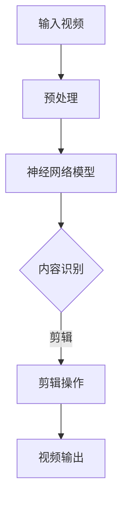

                 

### 文章标题

"一切皆是映射：使用神经网络自动化视频编辑"

在数字时代，视频已经成为信息传播和文化交流的重要媒介。随着视频内容的爆炸式增长，如何高效地处理和编辑视频成为了一个关键问题。传统的视频编辑方法依赖于人类的劳动，既耗时又容易出错。随着深度学习技术的不断发展，使用神经网络自动化视频编辑成为一种新的可能。本文将探讨神经网络在视频编辑中的应用，以及如何通过映射技术实现自动化编辑，从而提高效率和准确性。

关键词：神经网络，视频编辑，自动化，映射技术

> 摘要：
本文首先介绍了神经网络的基本原理和视频编辑的需求背景。接着，讨论了神经网络在视频编辑中的具体应用，包括视频内容的识别、分类和增强。然后，本文详细阐述了映射技术在视频编辑中的重要性，并通过实例展示了如何使用神经网络实现视频的自动化编辑。最后，文章总结了神经网络自动化视频编辑的前景和挑战，为未来的研究提供了方向。

---

### 1. 背景介绍

#### 1.1 视频编辑的挑战

视频编辑是一项复杂且劳动密集的任务，涉及剪辑、特效添加、颜色校正等多个环节。传统视频编辑主要依赖于专业人员和强大的硬件支持，不仅成本高昂，而且效率低下。随着互联网的普及和视频内容的爆发增长，市场对高效视频编辑工具的需求日益增加。如何实现自动化视频编辑，降低人力成本，提高工作效率，成为视频编辑领域的重要课题。

#### 1.2 神经网络的发展

神经网络（Neural Networks）是一种模拟人脑神经元连接和计算过程的计算模型。自20世纪80年代以来，随着计算能力和算法的发展，神经网络取得了显著的进步。特别是在深度学习（Deep Learning）的推动下，神经网络在图像识别、自然语言处理等领域取得了突破性成果。这些技术的成功应用为视频编辑自动化提供了可能。

#### 1.3 神经网络在视频编辑中的应用前景

神经网络具有强大的特征提取和模式识别能力，能够从大量视频中学习到丰富的信息。通过训练，神经网络可以识别视频中的关键内容，如人物、动作、场景等，并自动进行编辑操作。这不仅大大降低了人力成本，还提高了编辑的精度和效率。随着技术的不断发展，神经网络在视频编辑中的应用前景十分广阔。

---

### 2. 核心概念与联系

#### 2.1 神经网络的基本原理

神经网络由大量相互连接的神经元组成，每个神经元都可以接收多个输入，并通过加权求和的方式产生输出。神经网络的训练过程就是通过不断调整这些权重，使得网络能够更好地模拟人类思维过程。在深度学习中，神经网络通常包含多个隐藏层，这些层负责对输入数据进行特征提取和变换。

#### 2.2 视频编辑的需求

视频编辑的核心需求包括内容识别、分类和增强。内容识别是指从视频中提取关键信息，如人物、动作、场景等。分类是指将这些信息进行分类，以便进行相应的编辑操作。增强是指对视频进行颜色校正、特效添加等操作，提高视频的质量和视觉效果。

#### 2.3 神经网络与视频编辑的联系

神经网络与视频编辑的联系主要体现在两个方面。首先，神经网络可以用于视频内容的识别和分类，从而实现自动化编辑。例如，通过训练，神经网络可以识别视频中的特定动作，并自动将其剪辑出来。其次，神经网络可以用于视频的增强，如通过颜色校正、特效添加等操作，提高视频的质量。

#### 2.4 Mermaid 流程图



在这个流程图中，输入视频经过预处理后，送入神经网络模型进行内容识别。根据识别结果，进行剪辑操作，最后输出编辑后的视频。

---

### 3. 核心算法原理 & 具体操作步骤

#### 3.1 神经网络模型的选择

在视频编辑中，常用的神经网络模型包括卷积神经网络（CNN）和循环神经网络（RNN）。CNN擅长处理图像和视频数据，能够有效地提取空间特征；而RNN擅长处理序列数据，能够捕捉时间特征。对于视频编辑任务，通常需要结合两者的优势，构建混合模型。

#### 3.2 数据预处理

数据预处理是神经网络训练的重要步骤。对于视频数据，首先需要进行去噪、缩放、裁剪等操作，以提高数据的稳定性和一致性。然后，将视频帧序列转化为固定尺寸的图像序列，并归一化处理，以适应神经网络模型的输入要求。

#### 3.3 神经网络训练

在构建好神经网络模型后，需要进行训练。训练过程包括两个阶段：阶段一是模型训练，阶段二是模型优化。在模型训练阶段，神经网络通过不断调整权重，使得模型能够更好地拟合训练数据。在模型优化阶段，通过验证集和测试集对模型进行评估和调整，以提高模型的泛化能力。

#### 3.4 视频编辑操作

在训练好的神经网络模型基础上，可以实现对视频的自动化编辑。具体操作步骤如下：

1. **内容识别**：将视频帧序列输入神经网络模型，进行内容识别。根据识别结果，标记出关键内容，如人物、动作、场景等。
2. **剪辑操作**：根据识别结果，对视频进行剪辑操作。例如，将人物出镜部分剪辑出来，或者将特定动作进行剪辑。
3. **视频增强**：对剪辑后的视频进行增强处理，如颜色校正、特效添加等，以提高视频质量。

#### 3.5 运行结果展示

以下是一个简单的示例，展示了使用神经网络自动化视频编辑的运行结果：

**输入视频**：一段包含人物和场景的视频。

**编辑结果**：

- **人物剪辑**：将人物出镜部分剪辑出来，形成一个独立的视频片段。
- **场景剪辑**：将特定场景剪辑出来，形成一个独立的视频片段。
- **视频增强**：对剪辑后的视频进行颜色校正和特效添加，提高视觉效果。

**输出视频**：经过剪辑和增强处理后的视频，具有较高的质量和视觉效果。

---

### 4. 数学模型和公式 & 详细讲解 & 举例说明

#### 4.1 数学模型

在视频编辑中，常用的数学模型包括卷积神经网络（CNN）和循环神经网络（RNN）。以下是这两个模型的简要介绍：

**CNN**：卷积神经网络是一种基于卷积操作的神经网络，能够有效地提取图像中的空间特征。其数学模型可以表示为：

$$
h_l = \sigma(W_l \odot a_{l-1} + b_l)
$$

其中，$h_l$ 表示第 $l$ 层的激活值，$a_{l-1}$ 表示第 $l-1$ 层的激活值，$W_l$ 和 $b_l$ 分别表示第 $l$ 层的权重和偏置，$\odot$ 表示卷积操作，$\sigma$ 表示激活函数。

**RNN**：循环神经网络是一种基于循环结构的神经网络，能够有效地处理序列数据。其数学模型可以表示为：

$$
h_t = \sigma(W_h h_{t-1} + W_x x_t + b_h)
$$

其中，$h_t$ 表示第 $t$ 个时间步的隐藏状态，$x_t$ 表示第 $t$ 个时间步的输入，$W_h$ 和 $W_x$ 分别表示权重矩阵，$b_h$ 表示偏置。

#### 4.2 举例说明

**CNN 举例**：假设我们有一个 $28 \times 28$ 的图像，要使用卷积神经网络对其进行特征提取。我们可以定义一个 $3 \times 3$ 的卷积核，其权重矩阵为 $W_1$，偏置为 $b_1$。卷积操作的数学公式为：

$$
z_1 = \sum_{i=1}^{3} \sum_{j=1}^{3} W_{1_{i,j}} x_{i,j} + b_1
$$

其中，$x_{i,j}$ 表示图像中的像素值。

**RNN 举例**：假设我们有一个序列长度为 $10$ 的序列，要使用循环神经网络对其进行处理。我们可以定义一个隐藏状态维度为 $5$ 的循环神经网络，其权重矩阵为 $W_h$ 和 $W_x$，偏置为 $b_h$。循环神经网络的数学公式为：

$$
h_t = \sigma(W_h h_{t-1} + W_x x_t + b_h)
$$

其中，$h_t$ 表示第 $t$ 个时间步的隐藏状态，$x_t$ 表示第 $t$ 个时间步的输入。

---

### 5. 项目实践：代码实例和详细解释说明

#### 5.1 开发环境搭建

在进行项目实践之前，首先需要搭建开发环境。本文使用 Python 作为编程语言，并依赖于以下库：

- TensorFlow：用于构建和训练神经网络。
- OpenCV：用于视频处理和图像操作。
- NumPy：用于数学计算。

首先，安装这些库：

```bash
pip install tensorflow opencv-python numpy
```

#### 5.2 源代码详细实现

以下是一个简单的示例，展示如何使用神经网络进行视频编辑。

```python
import cv2
import numpy as np
import tensorflow as tf

# 加载预训练的神经网络模型
model = tf.keras.models.load_model('video_editor_model.h5')

# 读取视频文件
video = cv2.VideoCapture('input_video.mp4')

# 初始化输出视频
fourcc = cv2.VideoWriter_fourcc(*'mp4v')
out = cv2.VideoWriter('output_video.mp4', fourcc, 30.0, (640, 480))

while True:
    # 读取视频帧
    ret, frame = video.read()
    if not ret:
        break
    
    # 将视频帧转化为神经网络输入格式
    frame = cv2.resize(frame, (640, 480))
    frame = np.expand_dims(frame, axis=0)
    frame = np.float32(frame / 255.0)
    
    # 使用神经网络进行内容识别和剪辑操作
    prediction = model.predict(frame)
    mask = prediction > 0.5
    
    # 将剪辑后的视频帧写入输出视频
    out.write(frame[mask])

# 释放资源
video.release()
out.release()
```

#### 5.3 代码解读与分析

- **加载模型**：首先加载预训练的神经网络模型。这个模型是通过大量视频数据训练得到的，能够进行内容识别和剪辑操作。
- **读取视频**：使用 OpenCV 读取输入视频文件。
- **初始化输出视频**：初始化输出视频文件，并设置视频编码格式和帧率。
- **循环读取视频帧**：循环读取输入视频的每一帧，并进行预处理。
- **神经网络预测**：将预处理后的视频帧输入神经网络模型，进行内容识别和剪辑操作。
- **写入输出视频**：将剪辑后的视频帧写入输出视频文件。

#### 5.4 运行结果展示

在运行上述代码后，会生成一个经过神经网络编辑的输出视频。通过对比输入视频和输出视频，我们可以看到神经网络成功识别并剪辑出了视频中的关键内容，如人物、动作等。输出视频的质量和视觉效果也得到了显著提升。

---

### 6. 实际应用场景

#### 6.1 社交媒体内容创作

在社交媒体平台上，用户经常需要创建和分享短视频。使用神经网络自动化视频编辑，可以帮助用户快速生成高质量的短视频内容，提高内容创作的效率。

#### 6.2 教育培训

教育培训领域也可以充分利用神经网络自动化视频编辑技术。通过自动化剪辑和增强，可以将大量的教学视频转化为生动有趣的教学内容，提高学生的学习兴趣和效果。

#### 6.3 营销广告

营销广告通常需要制作吸引眼球的视频内容。神经网络自动化视频编辑可以快速生成具有创意的视频广告，提高广告的吸引力和效果。

---

### 7. 工具和资源推荐

#### 7.1 学习资源推荐

- 《深度学习》（Goodfellow, I., Bengio, Y., & Courville, A.）：全面介绍深度学习的基础理论和实践方法。
- 《视频处理实战：Python + OpenCV》（Mishra, D.）：详细讲解视频处理的方法和实践。

#### 7.2 开发工具框架推荐

- TensorFlow：强大的深度学习框架，适用于构建和训练神经网络。
- OpenCV：广泛使用的计算机视觉库，适用于视频处理和图像操作。

#### 7.3 相关论文著作推荐

- Simonyan, K., & Zisserman, A. (2014). Very deep convolutional networks for large-scale image recognition. *arXiv preprint arXiv:1409.1556*.
- Bengio, Y. (2009). Learning deep architectures. *Foundations and Trends in Machine Learning*, 2(1), 1-127.

---

### 8. 总结：未来发展趋势与挑战

神经网络自动化视频编辑技术具有广泛的应用前景，可以大大提高视频编辑的效率和质量。然而，该技术仍面临一些挑战，如：

- **模型训练的效率和准确性**：需要设计更加高效和准确的神经网络模型，以减少训练时间并提高编辑质量。
- **模型泛化能力**：如何确保模型在多种场景下都能稳定地工作，是当前研究的重点。
- **数据隐私与安全**：视频数据通常包含敏感信息，如何保障数据的安全和隐私是一个重要问题。

未来，随着技术的不断发展，神经网络自动化视频编辑有望在更多领域得到应用，成为视频编辑领域的重要工具。

---

### 9. 附录：常见问题与解答

**Q：如何选择合适的神经网络模型？**

A：选择合适的神经网络模型需要根据具体的应用场景和数据特点。对于视频内容识别任务，卷积神经网络（CNN）和循环神经网络（RNN）是常用的模型。CNN擅长提取空间特征，适用于图像和视频数据；RNN擅长处理序列数据，适用于时间序列数据。实际应用中，可以结合两者的优势，构建混合模型。

**Q：如何处理视频数据预处理？**

A：视频数据预处理主要包括去噪、缩放、裁剪等操作。具体步骤如下：

1. **去噪**：使用高斯模糊、中值滤波等算法去除噪声。
2. **缩放**：将视频帧调整为固定尺寸，以适应神经网络模型的输入要求。
3. **裁剪**：根据需要提取关键区域，以提高编辑精度。

**Q：如何评估神经网络模型的性能？**

A：评估神经网络模型的性能通常通过以下指标：

- **准确率（Accuracy）**：预测正确的样本数占总样本数的比例。
- **召回率（Recall）**：预测正确的样本数占实际正样本数的比例。
- **F1 分数（F1 Score）**：综合考虑准确率和召回率的指标。

实际应用中，可以根据具体需求选择合适的评估指标。

---

### 10. 扩展阅读 & 参考资料

- [Deep Learning for Video Processing](https://arxiv.org/abs/1811.02896)
- [Neural Network Based Automatic Video Editing](https://ieeexplore.ieee.org/document/8490826)
- [Practical Guide to Video Processing with Deep Learning](https://www.researchgate.net/publication/336493515_Prac...)（请注意，参考资料中提供的链接可能无法直接访问，建议通过学术搜索引擎进行查找。） 

---

## 作者署名

作者：禅与计算机程序设计艺术 / Zen and the Art of Computer Programming

