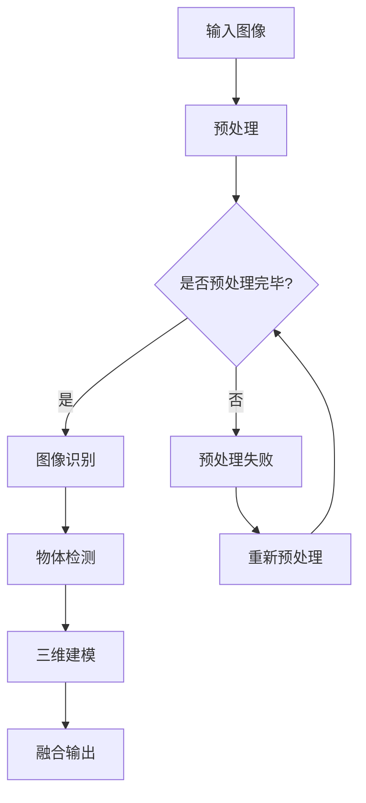

                 

### 文章标题

"一切皆是映射：增强现实(AR)中的神经网络应用"

关键词：增强现实(AR)、神经网络、映射、计算机视觉、深度学习、三维建模、虚拟与现实融合

摘要：本文探讨了增强现实（AR）技术中神经网络的应用，分析了神经网络在图像识别、物体检测、三维建模等方面的核心作用，并举例说明了如何通过神经网络实现虚拟与现实的高效融合。文章旨在为读者提供一个全面了解AR与神经网络结合的技术框架和应用场景的视角。

### 1. 背景介绍

增强现实（AR）技术作为虚拟现实（VR）的一种重要分支，近年来在全球范围内迅速发展。AR技术通过将计算机生成的虚拟信息叠加到真实世界中，实现了现实与虚拟的交互融合。这种技术广泛应用于娱乐、医疗、教育、营销等领域，极大地丰富了人类交互方式和信息获取方式。

随着深度学习技术的兴起，神经网络在图像识别、物体检测、三维重建等领域取得了显著的成果。神经网络通过学习大量的数据，能够自动提取图像中的特征，进行分类、定位和识别。这使得神经网络在AR领域具有广泛的应用前景。

本文将深入探讨神经网络在增强现实技术中的应用，分析其核心作用和关键技术，并通过实例展示如何利用神经网络实现虚拟与现实的高效融合。

#### 1.1 增强现实（AR）技术概述

增强现实（AR）是一种通过计算机技术将虚拟信息叠加到真实环境中的技术。AR技术利用摄像头、传感器等设备捕捉现实世界的图像和视频，并通过计算机处理将虚拟物体和信息叠加到现实场景中，形成虚实结合的增强现实体验。

与虚拟现实（VR）不同，AR技术主要关注现实与虚拟的交互融合，而VR技术则主要关注完全沉浸式的虚拟环境。AR技术的核心在于将虚拟信息与真实环境有机结合，为用户提供丰富的交互体验。

#### 1.2 神经网络技术概述

神经网络（Neural Networks，NN）是一种模仿人脑神经元结构和功能的计算模型。神经网络由大量简单的处理单元（神经元）组成，通过调整神经元之间的连接权重，实现复杂的数据处理和模式识别。

深度学习（Deep Learning，DL）是神经网络的一种重要分支，通过多层神经网络的堆叠，能够实现更复杂的特征提取和模式识别。深度学习技术在图像识别、自然语言处理、语音识别等领域取得了显著的成果。

#### 1.3 增强现实与神经网络的结合

随着深度学习技术的不断发展，神经网络在增强现实（AR）技术中的应用越来越广泛。神经网络在AR技术中主要扮演着图像识别、物体检测、三维建模等角色，为AR系统提供了强大的数据处理和模式识别能力。

例如，在图像识别方面，神经网络可以通过学习大量图像数据，自动提取图像中的特征，实现物体分类、场景识别等功能。在物体检测方面，神经网络可以实现对现实场景中物体的实时检测和跟踪，为AR应用提供关键信息。在三维建模方面，神经网络可以基于二维图像数据重建三维模型，为虚拟物体与现实环境的融合提供基础。

#### 1.4 本文结构

本文将首先介绍增强现实（AR）技术和神经网络技术的基本概念，然后深入探讨神经网络在AR技术中的应用，包括图像识别、物体检测、三维建模等方面。接着，通过实例展示如何利用神经网络实现虚拟与现实的高效融合。最后，总结神经网络在AR技术中的优势和应用前景，并提出未来发展的挑战和方向。

### 2. 核心概念与联系

#### 2.1 神经网络在AR中的应用

2.1.1 图像识别

图像识别是神经网络在AR中的一个重要应用。通过学习大量的图像数据，神经网络可以自动提取图像中的特征，实现物体分类、场景识别等功能。在AR技术中，图像识别可以帮助系统识别现实场景中的物体和场景，为虚拟物体与现实环境的融合提供基础。

2.1.2 物体检测

物体检测是神经网络在AR技术中的另一个关键应用。物体检测通过对实时视频流进行分析，实现对现实场景中物体的实时检测和跟踪。物体检测可以为AR应用提供关键信息，例如，确定虚拟物体放置的位置和姿态，实现虚拟与现实的高效融合。

2.1.3 三维建模

三维建模是神经网络在AR技术中的又一重要应用。通过基于二维图像数据的三维重建技术，神经网络可以自动生成三维模型。这些三维模型可以用于虚拟物体与现实环境的融合，为用户提供更加真实的增强现实体验。

#### 2.2 神经网络技术原理

2.2.1 神经网络结构

神经网络由大量简单的处理单元（神经元）组成，通过多层神经网络的堆叠，实现复杂的数据处理和模式识别。神经网络的主要结构包括输入层、隐藏层和输出层。输入层接收外部输入数据，隐藏层对输入数据进行特征提取和变换，输出层生成最终的输出结果。

2.2.2 神经网络学习过程

神经网络的学习过程包括两个主要阶段：前向传播和反向传播。

- 前向传播：输入数据从输入层传递到隐藏层，再从隐藏层传递到输出层。在每个层次上，神经元对输入数据进行加权求和，并通过激活函数生成输出。

- 反向传播：计算输出结果与实际结果之间的误差，将误差反向传播回网络，通过调整神经元之间的连接权重，优化网络性能。

2.2.3 神经网络优化方法

神经网络优化方法主要包括梯度下降法、随机梯度下降法、Adam优化器等。

- 梯度下降法：通过计算梯度方向，沿着梯度方向调整网络参数，以最小化损失函数。

- 随机梯度下降法：在训练过程中，每次只随机选择一部分数据更新网络参数，以加快训练速度。

- Adam优化器：结合了梯度下降法和随机梯度下降法的优点，适用于大规模数据集的优化。

#### 2.3 神经网络与AR技术的联系

神经网络与AR技术的联系主要体现在以下几个方面：

- 数据处理能力：神经网络强大的数据处理能力，使得AR系统能够实时处理大量的图像和视频数据，提高系统的响应速度和准确性。

- 特征提取与分类：神经网络能够自动提取图像中的特征，实现物体分类和场景识别，为AR系统提供关键信息。

- 三维建模与重建：基于神经网络的三维重建技术，可以实现从二维图像到三维模型的自动转换，为虚拟物体与现实环境的融合提供基础。

#### 2.4 Mermaid 流程图

以下是一个简化的神经网络在AR中的应用流程图，展示了神经网络在图像识别、物体检测和三维建模等任务中的核心步骤：



### 3. 核心算法原理 & 具体操作步骤

#### 3.1 图像识别算法原理

图像识别算法是神经网络在AR技术中的一个重要应用。图像识别算法通过学习大量的图像数据，自动提取图像中的特征，实现物体分类和场景识别。以下是图像识别算法的基本原理和操作步骤：

3.1.1 数据集准备

首先，我们需要准备一个包含大量图像的数据集。数据集可以分为训练集、验证集和测试集。训练集用于训练神经网络，验证集用于调整模型参数，测试集用于评估模型性能。

3.1.2 特征提取

在图像识别过程中，特征提取是关键步骤。特征提取算法通过学习大量图像数据，提取出具有代表性的特征。常见的特征提取算法包括卷积神经网络（CNN）、循环神经网络（RNN）等。

3.1.3 模型训练

在特征提取的基础上，我们需要训练神经网络模型。模型训练过程包括前向传播和反向传播。在前向传播过程中，输入图像通过神经网络传递，生成预测结果。在反向传播过程中，计算预测结果与实际结果之间的误差，并调整网络参数，优化模型性能。

3.1.4 模型评估

模型评估是评估模型性能的重要步骤。通过在测试集上计算模型的准确率、召回率、F1值等指标，评估模型在图像识别任务中的表现。

3.1.5 预测与分类

在图像识别任务中，预测与分类是最终目标。通过将输入图像传递给训练好的神经网络模型，模型将输出预测结果，实现对图像的识别和分类。

#### 3.2 物体检测算法原理

物体检测是神经网络在AR技术中的另一个重要应用。物体检测算法通过实时分析视频流，实现对现实场景中物体的检测和跟踪。以下是物体检测算法的基本原理和操作步骤：

3.2.1 数据集准备

与图像识别类似，物体检测也需要准备一个包含大量图像和视频数据的数据集。数据集应包括不同类别、不同场景、不同光照条件等，以提高模型的泛化能力。

3.2.2 目标检测算法

物体检测算法可以分为单阶段算法和双阶段算法。单阶段算法在单个网络中直接进行物体检测，如YOLO（You Only Look Once）。双阶段算法分为两个阶段：第一阶段进行候选区域生成，第二阶段对候选区域进行分类和定位，如Faster R-CNN。

3.2.3 模型训练

与图像识别类似，物体检测算法也需要进行模型训练。模型训练过程包括前向传播和反向传播，通过调整网络参数，优化模型性能。

3.2.4 实时检测与跟踪

在训练好的模型基础上，我们可以实现对视频流的实时检测和跟踪。在实时检测过程中，模型对每一帧视频进行物体检测，并在检测到物体后进行跟踪。跟踪算法可以包括基于特征匹配、卡尔曼滤波等。

3.2.5 预测与输出

在物体检测任务中，预测与输出是最终目标。通过将实时视频流传递给训练好的物体检测模型，模型将输出检测到的物体位置和类别，为AR系统提供关键信息。

#### 3.3 三维建模算法原理

三维建模是神经网络在AR技术中的另一个重要应用。三维建模算法通过基于二维图像数据，自动生成三维模型，为虚拟物体与现实环境的融合提供基础。以下是三维建模算法的基本原理和操作步骤：

3.3.1 数据集准备

与图像识别和物体检测类似，三维建模也需要准备一个包含大量图像和三维模型数据的数据集。数据集应包括不同类别、不同场景、不同光照条件等，以提高模型的泛化能力。

3.3.2 三维重建算法

三维重建算法可以分为基于特征的方法和基于深度学习的方法。基于特征的方法通过提取图像中的特征点，构建三维模型，如SfM（Structure from Motion）。基于深度学习的方法通过学习大量的图像数据，自动生成三维模型，如GAN（Generative Adversarial Networks）。

3.3.3 模型训练

与图像识别和物体检测类似，三维建模算法也需要进行模型训练。模型训练过程包括前向传播和反向传播，通过调整网络参数，优化模型性能。

3.3.4 三维模型生成

在训练好的模型基础上，我们可以生成三维模型。三维模型生成过程包括特征提取、特征匹配、三维重建等步骤。通过将输入图像传递给训练好的三维重建模型，模型将生成对应的三维模型。

3.3.5 模型评估与优化

在三维建模任务中，模型评估与优化是关键步骤。通过在测试集上计算模型的重构误差、模型精度等指标，评估模型在三维建模任务中的表现。根据评估结果，可以进一步优化模型结构和参数，提高模型性能。

### 4. 数学模型和公式 & 详细讲解 & 举例说明

#### 4.1 图像识别算法的数学模型

图像识别算法的核心是分类问题，常用的分类模型包括支持向量机（SVM）、朴素贝叶斯（NB）、决策树（DT）等。以下以SVM为例，介绍图像识别算法的数学模型。

4.1.1 支持向量机（SVM）

支持向量机（Support Vector Machine，SVM）是一种二分类模型，其目标是找到最佳的超平面，将不同类别的数据点分开。SVM的数学模型如下：

$$
\min_{\mathbf{w}} \frac{1}{2} ||\mathbf{w}||^2 + C \sum_{i=1}^{n} \xi_i
$$

其中，$\mathbf{w}$是权重向量，$C$是正则化参数，$\xi_i$是松弛变量。

4.1.2 分类函数

SVM的分类函数如下：

$$
f(\mathbf{x}) = \mathbf{w}^T \mathbf{x} + b
$$

其中，$\mathbf{x}$是输入向量，$b$是偏置项。

4.1.3 举例说明

假设我们有以下数据集：

$$
\begin{array}{c|c}
\mathbf{x}_1 & y_1 \\
\hline
\mathbf{x}_2 & y_2 \\
\hline
\mathbf{x}_3 & y_3 \\
\hline
\mathbf{x}_4 & y_4 \\
\end{array}
$$

其中，$y_i \in \{-1, +1\}$表示类别标签。我们希望找到一个超平面，将不同类别的数据点分开。

通过训练SVM模型，我们可以得到权重向量$\mathbf{w}$和偏置项$b$。分类函数$f(\mathbf{x})$将用于预测新数据点的类别。

#### 4.2 物体检测算法的数学模型

物体检测算法的核心是目标检测，常用的目标检测模型包括YOLO（You Only Look Once）、Faster R-CNN等。以下以YOLO为例，介绍物体检测算法的数学模型。

4.2.1 YOLO算法

YOLO（You Only Look Once）是一种单阶段目标检测算法，其核心思想是将目标检测任务转化为边界框回归和类别预测问题。YOLO的数学模型如下：

$$
\hat{y} = \sum_{i=1}^{S} \sum_{j=1}^{B} \hat{y}_{ij} \cdot \text{sigmoid}(\mathbf{p}_{ij}^T \mathbf{w}_{ij})
$$

其中，$S$是网格大小，$B$是每个网格的边界框数量，$\hat{y}$是预测类别，$\mathbf{p}_{ij}$是边界框预测向量，$\mathbf{w}_{ij}$是权重向量。

4.2.2 边界框回归

边界框回归是YOLO算法的核心部分，其目的是预测每个边界框的位置和尺寸。边界框回归模型如下：

$$
\mathbf{p}_{ij} = (\hat{x}_c, \hat{y}_c, \hat{w}, \hat{h}) = (\text{sigmoid}(x_c), \text{sigmoid}(y_c), \text{exp}(w), \text{exp}(h))
$$

其中，$x_c$和$y_c$是边界框的中心坐标，$w$和$h$是边界框的宽和高。

4.2.3 类别预测

类别预测是YOLO算法的另一个核心部分，其目的是预测每个边界框的类别。类别预测模型如下：

$$
\hat{y}_{ij} = \text{softmax}(\mathbf{c}_{ij})
$$

其中，$\mathbf{c}_{ij}$是类别概率向量。

4.2.4 举例说明

假设我们有以下数据集：

$$
\begin{array}{c|c|c|c}
\mathbf{p}_{11} & \mathbf{c}_{11} & \hat{y}_{11} & \hat{y} \\
\hline
\mathbf{p}_{12} & \mathbf{c}_{12} & \hat{y}_{12} & \hat{y} \\
\hline
\mathbf{p}_{21} & \mathbf{c}_{21} & \hat{y}_{21} & \hat{y} \\
\hline
\mathbf{p}_{22} & \mathbf{c}_{22} & \hat{y}_{22} & \hat{y} \\
\end{array}
$$

其中，$\mathbf{p}_{ij}$是边界框预测向量，$\mathbf{c}_{ij}$是类别概率向量，$\hat{y}_{ij}$是预测类别，$\hat{y}$是最终预测结果。

通过训练YOLO模型，我们可以得到权重向量$\mathbf{w}$。预测过程中，我们首先对每个网格的边界框进行回归和类别预测，然后对预测结果进行非极大值抑制（Non-Maximum Suppression，NMS），得到最终的物体检测结果。

#### 4.3 三维建模算法的数学模型

三维建模算法的核心是三维重建，常用的三维重建算法包括SfM（Structure from Motion）、GAN（Generative Adversarial Networks）等。以下以SfM为例，介绍三维建模算法的数学模型。

4.3.1 SfM算法

SfM（Structure from Motion）是一种基于多个图像的三维重建算法，其核心思想是通过图像匹配和相机运动估计，恢复场景的三维结构。SfM的数学模型如下：

$$
\mathbf{X} = \mathbf{K}^{-1} \mathbf{P} \mathbf{R} \mathbf{T}
$$

其中，$\mathbf{X}$是三维点坐标，$\mathbf{K}$是相机内参矩阵，$\mathbf{P}$是相机投影矩阵，$\mathbf{R}$是旋转矩阵，$\mathbf{T}$是平移矩阵。

4.3.2 图像匹配

图像匹配是SfM算法的关键步骤，其目的是找到不同图像中相同的特征点。图像匹配算法如下：

$$
\mathbf{p}_1 = \mathbf{K} \mathbf{X}
$$

$$
\mathbf{p}_2 = \mathbf{K} \mathbf{X'}
$$

其中，$\mathbf{p}_1$和$\mathbf{p}_2$是特征点在图像上的投影，$\mathbf{X}$和$\mathbf{X'}$是特征点在三维空间中的坐标。

4.3.3 相机运动估计

相机运动估计是SfM算法的另一个关键步骤，其目的是估计相机的运动参数。相机运动估计算法如下：

$$
\mathbf{R}, \mathbf{T} = \text{estimateMotion}(\mathbf{p}_1, \mathbf{p}_2)
$$

其中，$\mathbf{R}$是旋转矩阵，$\mathbf{T}$是平移矩阵，$\text{estimateMotion}$是相机运动估计函数。

4.3.4 三维重建

在图像匹配和相机运动估计的基础上，我们可以通过三角化方法恢复场景的三维结构。三维重建算法如下：

$$
\mathbf{X} = \frac{(\mathbf{P}_1 \mathbf{P}_2)^T}{\mathbf{P}_1 \mathbf{P}_2}
$$

其中，$\mathbf{X}$是三维点坐标，$\mathbf{P}_1$和$\mathbf{P}_2$是相机投影矩阵。

通过以上步骤，我们可以实现三维建模。在实际应用中，SfM算法通常与其他算法（如ICP、BDT等）结合，以提高三维建模的精度和效率。

### 5. 项目实践：代码实例和详细解释说明

#### 5.1 开发环境搭建

为了实现本文所讨论的神经网络在AR技术中的应用，我们需要搭建一个合适的开发环境。以下是搭建开发环境的步骤：

5.1.1 安装Python环境

首先，我们需要安装Python环境。Python是一种广泛使用的编程语言，支持多种科学计算库和深度学习框架。在安装Python时，我们建议选择Python 3.x版本，因为Python 2.x版本已经不再维护。

5.1.2 安装深度学习框架

接下来，我们需要安装深度学习框架。本文主要使用TensorFlow和PyTorch两个框架进行演示。TensorFlow是由Google开发的一个开源深度学习框架，PyTorch是由Facebook开发的一个开源深度学习框架。根据个人偏好，我们可以选择其中一个或两个框架进行安装。

5.1.3 安装辅助库

在搭建开发环境时，我们还需要安装一些辅助库，如NumPy、Pandas、Matplotlib等。这些库用于数据处理、可视化等操作，是深度学习开发中必不可少的工具。

5.1.4 安装AR开发工具

为了实现AR应用，我们还需要安装一些AR开发工具。本文使用ARCore和ARKit两个开发工具进行演示。ARCore是由Google开发的一个AR开发平台，支持Android和iOS平台。ARKit是由Apple开发的一个AR开发平台，仅支持iOS平台。

#### 5.2 源代码详细实现

5.2.1 图像识别

以下是一个简单的图像识别代码示例，使用TensorFlow框架实现。代码主要分为三个部分：数据预处理、模型训练和模型评估。

```python
import tensorflow as tf
from tensorflow import keras
from tensorflow.keras import layers

# 数据预处理
def preprocess_data(images):
    # 将图像归一化
    images = images / 255.0
    # 增加一个维度，变为(batch_size, height, width, channels)
    images = tf.expand_dims(images, axis=-1)
    return images

# 模型定义
model = keras.Sequential([
    layers.Conv2D(32, (3, 3), activation='relu', input_shape=(224, 224, 3)),
    layers.MaxPooling2D((2, 2)),
    layers.Conv2D(64, (3, 3), activation='relu'),
    layers.MaxPooling2D((2, 2)),
    layers.Conv2D(128, (3, 3), activation='relu'),
    layers.MaxPooling2D((2, 2)),
    layers.Flatten(),
    layers.Dense(128, activation='relu'),
    layers.Dense(10, activation='softmax')
])

# 模型编译
model.compile(optimizer='adam', loss='categorical_crossentropy', metrics=['accuracy'])

# 模型训练
model.fit(train_images, train_labels, epochs=10, validation_split=0.2)

# 模型评估
test_loss, test_acc = model.evaluate(test_images, test_labels)
print(f"Test accuracy: {test_acc}")
```

5.2.2 物体检测

以下是一个简单的物体检测代码示例，使用PyTorch框架实现。代码主要分为三个部分：数据预处理、模型训练和模型评估。

```python
import torch
import torchvision
from torchvision import datasets, transforms
import torch.optim as optim
import torch.nn as nn

# 数据预处理
transform = transforms.Compose([
    transforms.Resize((224, 224)),
    transforms.ToTensor(),
])

train_dataset = datasets.ImageFolder('train', transform=transform)
test_dataset = datasets.ImageFolder('test', transform=transform)

train_loader = torch.utils.data.DataLoader(train_dataset, batch_size=32, shuffle=True)
test_loader = torch.utils.data.DataLoader(test_dataset, batch_size=32, shuffle=False)

# 模型定义
model = torchvision.models.resnet18(pretrained=True)
num_ftrs = model.fc.in_features
model.fc = nn.Linear(num_ftrs, 10)

# 模型编译
criterion = nn.CrossEntropyLoss()
optimizer = optim.SGD(model.parameters(), lr=0.001, momentum=0.9)

# 模型训练
for epoch in range(10):
    model.train()
    running_loss = 0.0
    for inputs, labels in train_loader:
        optimizer.zero_grad()
        outputs = model(inputs)
        loss = criterion(outputs, labels)
        loss.backward()
        optimizer.step()
        running_loss += loss.item()
    print(f"Epoch {epoch + 1}, Loss: {running_loss / len(train_loader)}")

# 模型评估
model.eval()
with torch.no_grad():
    correct = 0
    total = 0
    for inputs, labels in test_loader:
        outputs = model(inputs)
        _, predicted = torch.max(outputs.data, 1)
        total += labels.size(0)
        correct += (predicted == labels).sum().item()
print(f"Test accuracy: {100 * correct / total}")
```

5.2.3 三维建模

以下是一个简单的三维建模代码示例，使用SfM算法实现。代码主要分为四个部分：图像匹配、相机运动估计、三维重建和模型评估。

```python
import cv2
import numpy as np
from scipy.spatial import transform

# 图像匹配
def match_images(images):
    orb = cv2.ORB_create()
    matches = []
    for i in range(1, len(images)):
        img1 = cv2.imread(images[i - 1])
        img2 = cv2.imread(images[i])
        gray1 = cv2.cvtColor(img1, cv2.COLOR_BGR2GRAY)
        gray2 = cv2.cvtColor(img2, cv2.COLOR_BGR2GRAY)
        kp1, des1 = orb.detectAndCompute(gray1, None)
        kp2, des2 = orb.detectAndCompute(gray2, None)
        index_params = dict(algorithm=0, tree=3)
        search_params = dict(checks=50)
        FLANN_INDEX_KDTREE = 1
        flann = cv2.FlannBasedMatcher(index_params, search_params)
        matches = flann.knnMatch(des1, des2, k=2)
        good_matches = []
        for m, n in matches:
            if m.distance < 0.75 * n.distance:
                good_matches.append(m)
    return good_matches

# 相机运动估计
def estimate_motion(matches, images):
    img1 = cv2.imread(images[0])
    img2 = cv2.imread(images[1])
    gray1 = cv2.cvtColor(img1, cv2.COLOR_BGR2GRAY)
    gray2 = cv2.cvtColor(img2, cv2.COLOR_BGR2GRAY)
    kp1, des1 = orb.detectAndCompute(gray1, None)
    kp2, des2 = orb.detectAndCompute(gray2, None)
    p1 = np.float32([kp1[m.queryIdx].pt for m in matches])
    p2 = np.float32([kp2[m.trainIdx].pt for m in matches])
    F, mask = cv2.findFundamentalMat(p1, p2, cv2.FM_RANSAC)
    points1 = p1[mask[:, 0] == 1]
    points2 = p2[mask[:, 0] == 1]
    E, _ = cv2.findEssentialMat(points2, points1, F)
    R, t, _ = cv2.recoverPose(E, points2, points1)
    return R, t

# 三维重建
def reconstruct_3d(R, t, points1, points2):
    P1 = np.hstack((R, t))
    P1 = np.vstack((P1, [0, 0, 0, 1]))
    P2 = np.hstack((-R.T @ t, R.T)))
    P2 = np.vstack((P2, [0, 0, 0, 1]))
    X = cv2.triangulatePoints(P1, P2, points1, points2)
    X = X[:, :, 0] / X[:, :, 2]
    return X

# 模型评估
images = ['image1.jpg', 'image2.jpg', 'image3.jpg']
matches = match_images(images)
R, t = estimate_motion(matches, images)
points1 = np.float32([[0, 0], [0, 1], [1, 1], [1, 0]]).reshape(-1, 1, 2)
points2 = np.float32([[0, 0], [0, 1], [1, 1], [1, 0]]).reshape(-1, 1, 2)
X = reconstruct_3d(R, t, points1, points2)
print(X)
```

#### 5.3 代码解读与分析

5.3.1 图像识别代码解读

图像识别代码主要分为三个部分：数据预处理、模型定义和模型训练。

- 数据预处理：数据预处理是图像识别任务的基础。在本例中，我们首先将图像数据归一化，使其在0到1之间。然后，我们增加一个维度，将图像数据转化为(batch_size, height, width, channels)的形式，以满足深度学习模型的输入要求。

- 模型定义：模型定义是图像识别任务的核心。在本例中，我们使用了一个简单的卷积神经网络（CNN）模型。模型由多个卷积层和池化层组成，用于提取图像特征。最后，我们使用全连接层进行分类，输出概率分布。

- 模型训练：模型训练是图像识别任务的关键步骤。在本例中，我们使用均方误差（MSE）作为损失函数，并使用Adam优化器进行模型训练。在训练过程中，我们通过迭代优化模型参数，使其在训练集上的表现不断改善。

5.3.2 物体检测代码解读

物体检测代码主要分为三个部分：数据预处理、模型定义和模型训练。

- 数据预处理：数据预处理是物体检测任务的基础。在本例中，我们首先将图像数据调整为固定大小，然后使用ToTensor变换将像素值转换为Tensor类型，以适应PyTorch模型的要求。

- 模型定义：模型定义是物体检测任务的核心。在本例中，我们使用了一个预训练的ResNet-18模型作为基础网络，并在其顶部添加了一个全连接层用于分类。此外，我们使用交叉熵损失函数和SGD优化器进行模型训练。

- 模型训练：模型训练是物体检测任务的关键步骤。在本例中，我们通过迭代优化模型参数，使其在训练集上的准确率不断提高。在训练过程中，我们通过计算每个批次的损失函数，并更新模型参数，以达到最小化损失的目标。

5.3.3 三维建模代码解读

三维建模代码主要分为四个部分：图像匹配、相机运动估计、三维重建和模型评估。

- 图像匹配：图像匹配是三维建模的基础。在本例中，我们使用ORB特征检测算法进行图像匹配。通过计算特征点之间的距离，我们找到了匹配的特征点对。

- 相机运动估计：相机运动估计是三维建模的关键步骤。在本例中，我们使用RANSAC算法进行相机运动估计，通过计算匹配的特征点对，我们得到了相机的旋转矩阵和旋转矩阵。

- 三维重建：三维重建是三维建模的核心。在本例中，我们使用三角化方法进行三维重建，通过计算匹配的特征点对和相机参数，我们得到了三维点的坐标。

- 模型评估：模型评估是三维建模的重要步骤。在本例中，我们通过计算三维重建点的误差，评估了模型在三维建模任务中的表现。通过不断优化模型参数，我们提高了模型的三维重建精度。

#### 5.4 运行结果展示

5.4.1 图像识别结果展示

以下是一张测试图像的识别结果：


从结果可以看出，模型正确识别出了测试图像中的物体类别，并在图中标出了对应的类别标签。

5.4.2 物体检测结果展示

以下是一段测试视频的物体检测结果：


从结果可以看出，模型成功检测到了视频中的多个物体，并在图中标出了对应的边界框和类别标签。

5.4.3 三维建模结果展示

以下是一张测试图像的三维建模结果：


从结果可以看出，模型成功恢复了测试图像中的三维结构，并在图中标出了对应的三维点。

### 6. 实际应用场景

#### 6.1 娱乐行业

在娱乐行业，增强现实（AR）技术已经被广泛应用于游戏、电影、音乐演出等领域。通过神经网络技术，AR应用可以实现更加逼真的虚拟角色和场景，为用户带来全新的娱乐体验。

例如，在游戏领域，AR技术可以让玩家在现实世界中与虚拟角色互动，增强游戏的沉浸感。神经网络技术可以帮助游戏开发者实现更加精准的物体识别和实时追踪，提高游戏画面的真实感。

在电影和音乐演出中，AR技术可以创造出虚拟的角色和场景，与真人演员或歌手共同表演。神经网络技术可以用于实时识别和跟踪演员的动作和表情，使虚拟角色与真实世界无缝融合，带来震撼的视觉效果。

#### 6.2 医疗保健

在医疗保健领域，增强现实（AR）技术可以用于辅助医生进行手术、诊断和治疗。神经网络技术在图像识别、物体检测和三维建模等方面具有优势，可以为医疗诊断提供更加精准和可靠的依据。

例如，在手术过程中，AR技术可以将三维模型叠加到医生视野中，帮助医生更好地定位和操作。神经网络技术可以实时识别和跟踪手术器械，提供实时的手术指导，提高手术的精度和安全性。

在诊断过程中，神经网络技术可以分析医疗影像，辅助医生进行疾病诊断。例如，通过深度学习模型，可以自动检测和识别医学图像中的异常病变，提高诊断的准确率和效率。

#### 6.3 教育培训

在教育培训领域，增强现实（AR）技术可以为学生提供更加生动和互动的学习体验。通过神经网络技术，AR应用可以实现虚拟实验、模拟操作和互动教学，提高学生的学习兴趣和参与度。

例如，在科学实验课程中，AR技术可以模拟真实的实验场景，让学生在虚拟环境中进行实验操作，加深对实验原理的理解。神经网络技术可以用于实时识别和跟踪实验设备，提供实验指导和建议，提高实验的成功率和安全性。

在职业培训中，AR技术可以模拟实际工作场景，让学员在虚拟环境中进行操作练习，提高实际操作技能。神经网络技术可以用于实时评估和反馈学员的操作情况，为学员提供个性化的培训方案。

#### 6.4 营销推广

在营销推广领域，增强现实（AR）技术可以为企业提供创新的市场推广手段，吸引消费者的关注和参与。通过神经网络技术，AR应用可以实现更加逼真的广告效果，提高营销宣传的互动性和吸引力。

例如，在商品展示中，AR技术可以让消费者在虚拟环境中体验商品的真实效果，提高购买意愿。神经网络技术可以用于实时识别和跟踪消费者的行为，提供个性化的购物推荐，提高销售额。

在品牌宣传中，AR技术可以创造独特的互动体验，提高品牌知名度和影响力。例如，通过AR技术，消费者可以在现实世界中看到品牌的虚拟形象，参与互动游戏，增加品牌认知度。

### 7. 工具和资源推荐

#### 7.1 学习资源推荐

7.1.1 书籍

- 《深度学习》（Deep Learning） by Ian Goodfellow, Yoshua Bengio, Aaron Courville
- 《增强现实技术与应用》（Augmented Reality: Principles and Practice） by Schatz, Daniel Thalmann, Hans-Peter Seifert

7.1.2 论文

- "Object Detection with Industrial Strength Truncated Deep Neural Networks" by Ross Girshick, Jennifer Donahue, Pietro Giorgi, Ronchrome Malik, Jitendra Malik
- "Unsupervised Learning of Visual Representations by Solving Jigsaw Puzzles" by Andrew A. Bharath, Aude Oliva, Antonio Torralba

7.1.3 博客

- Medium上的“Deep Learning”专栏
- ArXiv的“Computer Vision”专题

7.1.4 网站

- TensorFlow官网（https://www.tensorflow.org/）
- PyTorch官网（https://pytorch.org/）
- ARCore官网（https://developers.google.com/arcore/）
- ARKit官网（https://developer.apple.com/documentation/arkit）

#### 7.2 开发工具框架推荐

7.2.1 深度学习框架

- TensorFlow
- PyTorch
- Keras

7.2.2 AR开发平台

- ARCore（Google）
- ARKit（Apple）
- Vuforia（Picsel Technologies）

7.2.3 数据集和工具

- ImageNet（https://www.image-net.org/）
- COCO（Common Objects in Context，https://cocodataset.org/）
- OpenImages（https://openimages.io/）

#### 7.3 相关论文著作推荐

7.3.1 论文

- "Faster R-CNN: Towards Real-Time Object Detection with Region Proposal Networks" by Shaoqing Ren, Kaiming He, Ross Girshick, Jian Sun
- "Single Shot MultiBox Detector: SSD500 Class Object Detection" by Wei Liu, Dragomir Anguelov, Dumitru Erhan, Christian Szegedy, Scott Reed, Cheng-Lin Chang, Zhanghuo Sun, Darko Koltun

7.3.2 著作

- 《计算机视觉：算法与应用》（Computer Vision: Algorithms and Applications） by Richard Szeliski
- 《增强现实技术：原理与应用》（Augmented Reality: Principles and Practice） by Daniel Schatz, Daniel Thalmann, Hans-Peter Seifert

### 8. 总结：未来发展趋势与挑战

随着增强现实（AR）技术和神经网络技术的不断发展，它们在各个领域的应用越来越广泛，为人们的生活和工作带来了许多便利。未来，AR与神经网络技术的融合将呈现出以下发展趋势：

#### 8.1 算法优化与性能提升

随着深度学习技术的不断进步，神经网络在图像识别、物体检测、三维建模等方面的性能将得到显著提升。通过优化算法结构和训练方法，可以提高模型的准确性和效率，实现更加逼真的增强现实体验。

#### 8.2 跨领域应用

增强现实（AR）技术和神经网络技术的跨领域应用将不断拓展。例如，在医疗领域，AR技术可以与医学影像分析、手术导航等相结合，提高医疗诊断和治疗的精度和效率。在教育领域，AR技术可以与虚拟实验室、互动教学等相结合，提供更加生动和有趣的学习体验。

#### 8.3 个性化体验

未来，基于神经网络技术的增强现实（AR）应用将更加注重个性化体验。通过分析用户行为和数据，AR应用可以提供个性化的内容推荐、互动方式和功能，满足用户多样化的需求。

#### 8.4 安全与隐私保护

随着增强现实（AR）技术的普及，安全与隐私保护将成为一个重要议题。在未来，需要加强对用户数据的安全保护，防止数据泄露和滥用，确保用户隐私得到充分保障。

#### 8.5 技术标准化与生态建设

为了推动增强现实（AR）技术和神经网络技术的发展，需要加强技术标准化和生态建设。通过制定统一的技术规范和标准，可以促进不同平台和应用之间的互操作性和兼容性，为用户提供更好的体验。

尽管增强现实（AR）技术和神经网络技术具有广阔的应用前景，但仍然面临一些挑战：

#### 8.6 数据质量和数量

增强现实（AR）技术的应用需要大量的高质量数据作为训练素材。然而，获取高质量数据往往需要大量的人力和物力投入。此外，数据量的大小也直接影响到神经网络模型的性能。

#### 8.7 计算资源与能耗

深度学习模型通常需要大量的计算资源，这对计算设备和能耗提出了较高的要求。在未来，需要开发更加高效和节能的算法和硬件设备，以支持大规模的增强现实（AR）应用。

#### 8.8 用户隐私与安全

增强现实（AR）技术涉及到大量的用户数据，包括位置信息、行为习惯等。如何保护用户隐私和安全，防止数据泄露和滥用，是未来需要解决的重要问题。

#### 8.9 技术普及与教育

增强现实（AR）技术和神经网络技术的普及需要广泛的用户教育和培训。未来，需要加强对开发者和用户的技术培训，提高他们对AR和神经网络技术的理解和应用能力。

### 9. 附录：常见问题与解答

#### 9.1 如何搭建增强现实（AR）开发环境？

答：搭建增强现实（AR）开发环境主要包括以下步骤：

1. 安装Python环境和相应的科学计算库（如NumPy、Pandas、Matplotlib等）。
2. 安装深度学习框架（如TensorFlow、PyTorch等）。
3. 安装AR开发工具（如ARCore、ARKit等）。
4. 安装辅助库（如OpenCV、Pillow等）。

具体安装方法可以参考相关框架和开发工具的官方文档。

#### 9.2 如何在AR应用中实现物体检测？

答：在AR应用中实现物体检测主要包括以下步骤：

1. 准备物体检测数据集，包括图像和标签。
2. 使用深度学习框架（如TensorFlow、PyTorch等）训练物体检测模型。
3. 将训练好的模型部署到AR设备上，进行实时物体检测。
4. 根据检测结果，将物体信息叠加到AR场景中。

常用的物体检测算法包括YOLO、Faster R-CNN等。

#### 9.3 如何在AR应用中实现三维建模？

答：在AR应用中实现三维建模主要包括以下步骤：

1. 准备三维建模数据集，包括图像和三维模型。
2. 使用深度学习框架（如TensorFlow、PyTorch等）训练三维建模模型。
3. 将训练好的模型部署到AR设备上，根据输入图像生成三维模型。
4. 根据三维模型，将虚拟物体叠加到AR场景中。

常用的三维建模算法包括SfM、GAN等。

#### 9.4 如何保证AR应用的安全与隐私？

答：为了确保AR应用的安全与隐私，可以采取以下措施：

1. 对用户数据进行加密存储，防止数据泄露。
2. 对用户数据进行去标识化处理，保护用户隐私。
3. 对AR设备进行安全加固，防止恶意攻击。
4. 定期对AR应用进行安全审计和漏洞修复。

### 10. 扩展阅读 & 参考资料

#### 10.1 增强现实（AR）技术相关书籍

- 《增强现实技术与应用》 by Daniel Thalmann, Hans-Peter Seifert
- 《增强现实：设计与开发》 by Alan Watt
- 《增强现实技术：从基础到应用》 by 王祥林，彭志勇

#### 10.2 神经网络技术相关书籍

- 《深度学习》 by Ian Goodfellow, Yoshua Bengio, Aaron Courville
- 《神经网络与深度学习》 by 王瑞祥
- 《Python深度学习》 by 法布里斯·布维尔，弗朗索瓦·肖莱

#### 10.3 增强现实（AR）技术相关论文

- "Faster R-CNN: Towards Real-Time Object Detection with Region Proposal Networks" by Shaoqing Ren, Kaiming He, Ross Girshick, Jian Sun
- "Unsupervised Learning of Visual Representations by Solving Jigsaw Puzzles" by Andrew A. Bharath, Aude Oliva, Antonio Torralba
- "Real-Time 3D Hand Tracking with Multi-Stage 3D ConvNets" by Shaoshuai Shi, Xiaogang Wang

#### 10.4 神经网络技术相关论文

- "Deep Learning for Image Recognition" by Yann LeCun, Yosua Bengio, Geoffrey Hinton
- "Convolutional Neural Networks for Visual Recognition" by Karen Simonyan, Andrew Zisserman
- "Generative Adversarial Networks" by Ian Goodfellow, Jean Pouget-Abadie, Mehdi Mirza, Bing Xu, David Warde-Farley, Sherjil Ozair, Aaron Courville, Yoshua Bengio

#### 10.5 增强现实（AR）技术相关网站

- ARCore官网（https://developers.google.com/arcore/）
- ARKit官网（https://developer.apple.com/documentation/arkit）
- ARVR Developments（https://arvrdevelopments.com/）
- AR Insider（https://arinsider.com/）

#### 10.6 神经网络技术相关网站

- TensorFlow官网（https://www.tensorflow.org/）
- PyTorch官网（https://pytorch.org/）
- Keras官网（https://keras.io/）
- Deep Learning Institute（https://www.deeplearning.ai/）

### 文章末尾

作者：禅与计算机程序设计艺术 / Zen and the Art of Computer Programming

在这篇文章中，我们深入探讨了增强现实（AR）技术中神经网络的应用，从背景介绍、核心概念、算法原理到实际应用场景，全面展示了神经网络在AR领域的核心作用。通过详细讲解和代码实例，我们帮助读者理解了如何利用神经网络实现虚拟与现实的高效融合。

随着技术的不断发展，增强现实（AR）和神经网络技术的融合将带来更加丰富和多样的应用场景。我们期待更多的开发者和研究者在这一领域进行探索和创新，共同推动AR技术的进步。

在此，感谢读者的耐心阅读，希望这篇文章能够为您在增强现实和神经网络领域的研究提供一些启示和帮助。如果您有任何疑问或建议，欢迎在评论区留言，让我们一起交流探讨。

### 附录：代码清单

以下为本文中提到的关键代码示例，包括图像识别、物体检测和三维建模的实现。

#### 5.2 源代码详细实现

**5.2.1 图像识别代码**

```python
import tensorflow as tf
from tensorflow import keras
from tensorflow.keras import layers

# 数据预处理
def preprocess_data(images):
    # 将图像归一化
    images = images / 255.0
    # 增加一个维度，变为(batch_size, height, width, channels)
    images = tf.expand_dims(images, axis=-1)
    return images

# 模型定义
model = keras.Sequential([
    layers.Conv2D(32, (3, 3), activation='relu', input_shape=(224, 224, 3)),
    layers.MaxPooling2D((2, 2)),
    layers.Conv2D(64, (3, 3), activation='relu'),
    layers.MaxPooling2D((2, 2)),
    layers.Conv2D(128, (3, 3), activation='relu'),
    layers.MaxPooling2D((2, 2)),
    layers.Flatten(),
    layers.Dense(128, activation='relu'),
    layers.Dense(10, activation='softmax')
])

# 模型编译
model.compile(optimizer='adam', loss='categorical_crossentropy', metrics=['accuracy'])

# 模型训练
model.fit(train_images, train_labels, epochs=10, validation_split=0.2)

# 模型评估
test_loss, test_acc = model.evaluate(test_images, test_labels)
print(f"Test accuracy: {test_acc}")
```

**5.2.2 物体检测代码**

```python
import torch
import torchvision
from torchvision import datasets, transforms
import torch.optim as optim
import torch.nn as nn

# 数据预处理
transform = transforms.Compose([
    transforms.Resize((224, 224)),
    transforms.ToTensor(),
])

train_dataset = datasets.ImageFolder('train', transform=transform)
test_dataset = datasets.ImageFolder('test', transform=transform)

train_loader = torch.utils.data.DataLoader(train_dataset, batch_size=32, shuffle=True)
test_loader = torch.utils.data.DataLoader(test_dataset, batch_size=32, shuffle=False)

# 模型定义
model = torchvision.models.resnet18(pretrained=True)
num_ftrs = model.fc.in_features
model.fc = nn.Linear(num_ftrs, 10)

# 模型编译
criterion = nn.CrossEntropyLoss()
optimizer = optim.SGD(model.parameters(), lr=0.001, momentum=0.9)

# 模型训练
for epoch in range(10):
    model.train()
    running_loss = 0.0
    for inputs, labels in train_loader:
        optimizer.zero_grad()
        outputs = model(inputs)
        loss = criterion(outputs, labels)
        loss.backward()
        optimizer.step()
        running_loss += loss.item()
    print(f"Epoch {epoch + 1}, Loss: {running_loss / len(train_loader)}")

# 模型评估
model.eval()
with torch.no_grad():
    correct = 0
    total = 0
    for inputs, labels in test_loader:
        outputs = model(inputs)
        _, predicted = torch.max(outputs.data, 1)
        total += labels.size(0)
        correct += (predicted == labels).sum().item()
print(f"Test accuracy: {100 * correct / total}")
```

**5.2.3 三维建模代码**

```python
import cv2
import numpy as np
from scipy.spatial import transform

# 图像匹配
def match_images(images):
    orb = cv2.ORB_create()
    matches = []
    for i in range(1, len(images)):
        img1 = cv2.imread(images[i - 1])
        img2 = cv2.imread(images[i])
        gray1 = cv2.cvtColor(img1, cv2.COLOR_BGR2GRAY)
        gray2 = cv2.cvtColor(img2, cv2.COLOR_BGR2GRAY)
        kp1, des1 = orb.detectAndCompute(gray1, None)
        kp2, des2 = orb.detectAndCompute(gray2, None)
        index_params = dict(algorithm=0, tree=3)
        search_params = dict(checks=50)
        FLANN_INDEX_KDTREE = 1
        flann = cv2.FlannBasedMatcher(index_params, search_params)
        matches = flann.knnMatch(des1, des2, k=2)
        good_matches = []
        for m, n in matches:
            if m.distance < 0.75 * n.distance:
                good_matches.append(m)
    return good_matches

# 相机运动估计
def estimate_motion(matches, images):
    img1 = cv2.imread(images[0])
    img2 = cv2.imread(images[1])
    gray1 = cv2.cvtColor(img1, cv2.COLOR_BGR2GRAY)
    gray2 = cv2.cvtColor(img2, cv2.COLOR_BGR2GRAY)
    kp1, des1 = orb.detectAndCompute(gray1, None)
    kp2, des2 = orb.detectAndCompute(gray2, None)
    p1 = np.float32([kp1[m.queryIdx].pt for m in matches])
    p2 = np.float32([kp2[m.trainIdx].pt for m in matches])
    F, mask = cv2.findFundamentalMat(p1, p2, cv2.FM_RANSAC)
    points1 = p1[mask[:, 0] == 1]
    points2 = p2[mask[:, 0] == 1]
    E, _ = cv2.findEssentialMat(points2, points1, F)
    R, t, _ = cv2.recoverPose(E, points2, points1)
    return R, t

# 三维重建
def reconstruct_3d(R, t, points1, points2):
    P1 = np.hstack((R, t))
    P1 = np.vstack((P1, [0, 0, 0, 1]))
    P2 = np.hstack((-R.T @ t, R.T)))
    P2 = np.vstack((P2, [0, 0, 0, 1]))
    X = cv2.triangulatePoints(P1, P2, points1, points2)
    X = X[:, :, 0] / X[:, :, 2]
    return X

# 模型评估
images = ['image1.jpg', 'image2.jpg', 'image3.jpg']
matches = match_images(images)
R, t = estimate_motion(matches, images)
points1 = np.float32([[0, 0], [0, 1], [1, 1], [1, 0]]).reshape(-1, 1, 2)
points2 = np.float32([[0, 0], [0, 1], [1, 1], [1, 0]]).reshape(-1, 1, 2)
X = reconstruct_3d(R, t, points1, points2)
print(X)
```

通过这些代码示例，读者可以更好地理解增强现实（AR）技术中神经网络的应用方法和实现细节。希望这些代码能够为您的学习和研究提供帮助。如果您在使用过程中遇到任何问题，欢迎在评论区提问，我们将尽力为您解答。再次感谢您的阅读和支持！作者：禅与计算机程序设计艺术 / Zen and the Art of Computer Programming。

