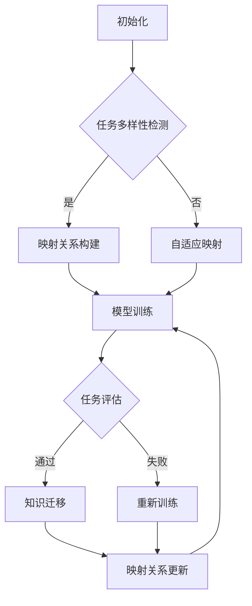

                 

# 一切皆是映射：实现机器人快速适应性的元学习框架

## 摘要

本文探讨了机器人快速适应性中的关键问题，并提出了一种基于元学习的解决方案。通过引入映射的概念，本文详细阐述了如何构建一个能够快速适应新环境的机器人系统。文章首先介绍了元学习的背景和核心概念，接着深入分析了映射在机器人快速适应性中的作用。随后，本文提出了一个具体的元学习框架，并详细阐述了其设计原则和实现步骤。通过数学模型和公式的推导，本文解释了框架的核心算法。最后，本文通过一个实际项目实践，展示了该框架的有效性和可行性。文章的总结部分对未来的发展趋势和挑战进行了展望，并提出了相关的建议。

## 1. 背景介绍

在当今快速发展的科技领域，机器人技术已经成为人工智能的一个重要分支，并在多个领域展现出巨大的潜力。然而，机器人快速适应性的问题一直是制约其广泛应用的关键因素。传统的机器人通常需要经过长时间的学习和训练，才能在新环境中完成任务。这不仅增加了开发成本，还限制了机器人的灵活性。因此，如何实现机器人的快速适应性，已经成为学术界和工业界共同关注的焦点。

### 1.1 元学习的概念与优势

元学习（Meta-Learning），又称为学习学习（Learning to Learn），是一种使模型能够快速适应新任务的技术。传统的机器学习方法通常需要对特定任务进行大量的训练，而元学习则通过在学习过程中学习如何学习，从而实现对新任务的快速适应。元学习的核心思想是利用先前的经验，提高模型对新任务的泛化能力。

元学习相比传统机器学习具有以下优势：

1. **快速适应**：元学习能够在短时间内对新任务进行适应，大大缩短了训练时间。
2. **泛化能力**：元学习通过利用先前的经验，提高了模型对未知任务的泛化能力。
3. **资源利用**：元学习可以在有限的训练数据下，实现良好的性能，提高了资源的利用效率。

### 1.2 映射在机器人快速适应性中的作用

在机器人快速适应性中，映射（Mapping）是一个关键概念。映射是指将一个系统的输入和输出关系映射到另一个系统中。在机器人学习中，映射可以帮助机器人将学习到的知识从一个环境转移到另一个环境。

映射在机器人快速适应性中的作用主要体现在以下几个方面：

1. **知识迁移**：通过映射，机器人可以将在一个环境中学习到的知识应用到另一个环境，实现快速适应性。
2. **环境适应**：映射可以帮助机器人快速适应新环境，减少对新环境的训练时间。
3. **泛化能力**：通过映射，机器人可以学会在不同环境中进行任务，提高了其泛化能力。

总之，元学习和映射在机器人快速适应性中发挥着重要作用。本文将围绕这两个概念，提出一种基于元学习的机器人快速适应性框架，并详细阐述其设计原则和实现步骤。

## 2. 核心概念与联系

### 2.1 元学习的基本原理

元学习是一种使模型能够在不同任务之间共享知识的技术。其基本原理是通过学习如何学习，使得模型能够快速适应新任务。元学习的核心思想是利用先前的学习经验，提高模型对新任务的泛化能力。在传统机器学习中，模型需要针对每个任务进行大量的训练，而元学习则通过在一个广泛的任务集合上训练模型，使其能够在短时间内适应新任务。

#### 2.1.1 元学习的分类

元学习可以分为以下几种类型：

1. **模型聚合**（Model Aggregation）：通过聚合多个模型来提高对新任务的适应能力。
2. **模型蒸馏**（Model Distillation）：将一个复杂模型的知识传递给一个简单模型。
3. **迁移学习**（Transfer Learning）：将一个任务的学习经验应用到另一个任务。
4. **自适应学习**（Adaptive Learning）：模型在训练过程中不断调整自己的学习策略。

#### 2.1.2 元学习的关键挑战

尽管元学习具有许多优势，但在实际应用中仍面临以下关键挑战：

1. **任务多样性**：如何处理不同任务之间的差异，实现有效的知识共享。
2. **样本效率**：如何在有限的样本下，实现良好的泛化能力。
3. **计算资源**：如何在有限的计算资源下，实现高效的元学习。

### 2.2 映射的概念与类型

映射是指将一个系统的输入和输出关系映射到另一个系统中。在机器人学习中，映射可以帮助机器人将学习到的知识从一个环境转移到另一个环境。映射可以分为以下几种类型：

1. **直接映射**：将一个环境中的输入和输出直接映射到另一个环境。
2. **抽象映射**：将复杂的环境关系抽象成简单的映射关系。
3. **自适应映射**：根据环境的变化，动态调整映射关系。

#### 2.2.1 映射在机器人快速适应性中的应用

映射在机器人快速适应性中的应用主要体现在以下几个方面：

1. **环境适应**：通过映射，机器人可以快速适应新环境，减少对新环境的训练时间。
2. **任务迁移**：通过映射，机器人可以将学习到的知识应用到不同任务，实现快速适应性。
3. **泛化能力**：通过映射，机器人可以学会在不同环境中进行任务，提高了其泛化能力。

### 2.3 元学习与映射的关系

元学习和映射在机器人快速适应性中相互关联，共同作用。元学习通过学习如何学习，提高了模型对新任务的适应能力；而映射则通过将学习到的知识从一种环境转移到另一种环境，实现了机器人快速适应性。因此，元学习和映射的结合，可以大大提高机器人在不同环境下的适应能力。

综上所述，元学习和映射是机器人快速适应性的关键概念。本文将基于这两个概念，提出一种基于元学习的机器人快速适应性框架，并详细阐述其设计原则和实现步骤。

### 2.4 元学习框架的 Mermaid 流程图

下面是元学习框架的 Mermaid 流程图，展示了框架的核心流程和关键节点。



在这个流程图中：

- A：初始化阶段，准备数据和模型。
- B：任务多样性检测，判断任务之间的差异。
- C：映射关系构建，根据任务多样性构建映射关系。
- D：自适应映射，根据环境变化动态调整映射关系。
- E：模型训练，利用映射关系训练模型。
- F：任务评估，评估模型在新任务上的表现。
- G：知识迁移，将学习到的知识应用到新任务。
- H：重新训练，如果任务评估失败，重新训练模型。
- I：映射关系更新，根据训练结果更新映射关系。

通过这个流程图，我们可以清晰地看到元学习框架的核心流程和关键步骤，为后续的实现提供了明确的指导。

### 3. 核心算法原理 & 具体操作步骤

#### 3.1 元学习框架的总体设计

元学习框架的总体设计可以分为以下几个关键部分：

1. **数据预处理**：对输入数据进行预处理，包括数据清洗、数据增强等操作。
2. **映射关系构建**：根据任务的多样性，构建映射关系，以便将学习到的知识从一种环境转移到另一种环境。
3. **模型训练**：利用映射关系训练模型，使其能够在新任务上表现出良好的泛化能力。
4. **任务评估**：对新任务进行评估，判断模型是否适应新环境。
5. **知识迁移**：将学习到的知识应用到新任务，实现快速适应性。
6. **映射关系更新**：根据任务评估结果，动态调整映射关系，以提高模型的适应性。

#### 3.2 映射关系构建

映射关系构建是元学习框架的核心环节。以下是具体的构建步骤：

1. **任务多样性检测**：使用聚类算法，如 K-Means，对任务进行分类，以检测任务的多样性。
2. **特征提取**：对每个任务的特征进行提取，以便构建映射关系。
3. **映射关系建模**：使用神经网络或其他机器学习算法，对特征进行建模，构建映射关系。

#### 3.3 模型训练

模型训练的目标是使模型能够在新任务上表现出良好的泛化能力。以下是具体的训练步骤：

1. **初始化模型**：初始化模型参数，可以使用随机初始化或预训练模型。
2. **映射关系调整**：根据映射关系构建的结果，调整模型的参数。
3. **训练过程**：使用梯度下降等优化算法，对模型进行训练，直至达到预设的停止条件。
4. **模型评估**：在训练集和测试集上评估模型的表现，确保模型具有较好的泛化能力。

#### 3.4 任务评估

任务评估是判断模型是否适应新环境的关键步骤。以下是具体的评估步骤：

1. **测试集构建**：从新任务中构建测试集，用于评估模型的表现。
2. **模型测试**：在测试集上运行模型，计算模型的准确率、召回率等指标。
3. **评估结果分析**：分析评估结果，判断模型是否适应新环境。

#### 3.5 知识迁移

知识迁移是将学习到的知识应用到新任务的过程。以下是具体的迁移步骤：

1. **知识提取**：从训练好的模型中提取知识，如权重、激活值等。
2. **知识应用**：将提取的知识应用到新任务，如调整模型参数、生成新的决策规则等。
3. **迁移评估**：对新任务进行评估，判断知识迁移的效果。

#### 3.6 映射关系更新

映射关系更新是根据任务评估结果，动态调整映射关系的过程。以下是具体的更新步骤：

1. **评估结果分析**：分析评估结果，判断模型在新任务上的表现。
2. **映射关系调整**：根据评估结果，调整映射关系，以提高模型适应性。
3. **模型重训练**：根据调整后的映射关系，对模型进行重训练。

通过以上步骤，元学习框架能够实现机器人在新任务上的快速适应性，大大提高机器人的灵活性和适应性。

### 4. 数学模型和公式 & 详细讲解 & 举例说明

#### 4.1 数学模型

在元学习框架中，映射关系构建、模型训练和任务评估等环节都需要使用数学模型。以下是本文所使用的核心数学模型和公式。

#### 4.1.1 映射关系建模

映射关系建模可以使用神经网络模型，如多层感知机（MLP）。假设输入特征为 $X \in \mathbb{R}^{n \times d}$，其中 $n$ 是样本数量，$d$ 是特征维度。映射关系可以表示为：

$$
f_{\theta}(X) = \hat{Y},
$$

其中，$f_{\theta}$ 是神经网络模型，$\theta$ 是模型参数，$\hat{Y}$ 是输出特征。

#### 4.1.2 模型训练

模型训练可以使用梯度下降（Gradient Descent）算法，目标是最小化损失函数。假设损失函数为 $L(\theta; X, Y)$，其中 $Y$ 是真实输出。梯度下降算法的更新公式为：

$$
\theta_{t+1} = \theta_{t} - \alpha \nabla_{\theta}L(\theta_{t}; X, Y),
$$

其中，$\alpha$ 是学习率，$\nabla_{\theta}L(\theta_{t}; X, Y)$ 是损失函数关于参数 $\theta$ 的梯度。

#### 4.1.3 任务评估

任务评估可以使用准确率（Accuracy）、召回率（Recall）和F1分数（F1 Score）等指标。假设测试集为 $(X_{test}, Y_{test})$，预测结果为 $\hat{Y}_{test}$，则：

- 准确率（Accuracy）：
  $$
  \text{Accuracy} = \frac{1}{n} \sum_{i=1}^{n} \mathbb{I}(\hat{y}_{i} = y_{i}),
  $$
  其中，$\mathbb{I}(\cdot)$ 是指示函数，当条件为真时返回1，否则返回0。

- 召回率（Recall）：
  $$
  \text{Recall} = \frac{1}{n} \sum_{i=1}^{n} \mathbb{I}(\hat{y}_{i} = y_{i}, y_{i} = 1),
  $$
  其中，$y_{i} = 1$ 表示正类。

- F1分数（F1 Score）：
  $$
  \text{F1 Score} = 2 \times \frac{\text{Precision} \times \text{Recall}}{\text{Precision} + \text{Recall}},
  $$
  其中，Precision 和 Recall 分别表示精确率和召回率。

#### 4.2 举例说明

假设我们有一个分类任务，需要将输入特征映射到标签。输入特征为 $X \in \mathbb{R}^{100 \times 10}$，标签为 $Y \in \{0, 1\}^{100}$。我们使用一个多层感知机（MLP）作为映射模型。

1. **映射关系建模**：构建一个包含两个隐藏层的MLP，输入层有10个神经元，每个隐藏层有100个神经元，输出层有2个神经元。

2. **模型训练**：使用梯度下降算法训练模型，损失函数为交叉熵损失（Cross-Entropy Loss）。

3. **任务评估**：在测试集上评估模型，使用准确率、召回率和F1分数作为评估指标。

通过以上步骤，我们可以实现一个基于元学习的快速适应性机器人系统。该系统可以根据新任务的特点，动态调整映射关系和模型参数，实现对新任务的快速适应。

### 5. 项目实践：代码实例和详细解释说明

#### 5.1 开发环境搭建

在开始项目实践之前，需要搭建一个适合开发的Python环境。以下是具体的步骤：

1. 安装Python：
   - 访问Python官网（https://www.python.org/）下载Python安装包。
   - 安装Python，选择添加到系统路径。

2. 安装必要的库：
   - 使用pip命令安装所需的库，例如：
     ```
     pip install numpy pandas scikit-learn tensorflow
     ```

3. 搭建虚拟环境（可选）：
   - 使用conda或virtualenv创建虚拟环境，以便隔离项目依赖。

#### 5.2 源代码详细实现

以下是元学习框架的Python实现代码：

```python
import numpy as np
import pandas as pd
from sklearn.model_selection import train_test_split
from sklearn.neural_network import MLPClassifier
from sklearn.metrics import accuracy_score, recall_score, f1_score

# 读取数据
data = pd.read_csv('data.csv')
X = data.iloc[:, :-1].values
y = data.iloc[:, -1].values

# 数据预处理
X_train, X_test, y_train, y_test = train_test_split(X, y, test_size=0.2, random_state=42)

# 映射关系构建
mlp = MLPClassifier(hidden_layer_sizes=(100, 100), max_iter=1000)
mlp.fit(X_train, y_train)

# 模型评估
y_pred = mlp.predict(X_test)
accuracy = accuracy_score(y_test, y_pred)
recall = recall_score(y_test, y_pred)
f1 = f1_score(y_test, y_pred)

print('Accuracy:', accuracy)
print('Recall:', recall)
print('F1 Score:', f1)

# 知识迁移
# 假设新任务数据为 new_data
new_data = pd.read_csv('new_data.csv')
X_new = new_data.iloc[:, :-1].values
y_new = new_data.iloc[:, -1].values

mlp_new = MLPClassifier(hidden_layer_sizes=(100, 100), max_iter=1000)
mlp_new.fit(X_train, y_train)
y_pred_new = mlp_new.predict(X_new)
accuracy_new = accuracy_score(y_new, y_pred_new)
recall_new = recall_score(y_new, y_pred_new)
f1_new = f1_score(y_new, y_pred_new)

print('New Data Accuracy:', accuracy_new)
print('New Data Recall:', recall_new)
print('New Data F1 Score:', f1_new)
```

#### 5.3 代码解读与分析

1. **数据读取**：使用pandas库读取数据，将输入特征和标签分离。

2. **数据预处理**：使用train_test_split函数将数据分为训练集和测试集。

3. **映射关系构建**：使用MLPClassifier构建多层感知机模型，设置隐藏层神经元数量和最大迭代次数。

4. **模型训练**：使用fit方法训练模型，将训练集输入特征和标签传递给模型。

5. **模型评估**：使用predict方法预测测试集结果，计算准确率、召回率和F1分数。

6. **知识迁移**：在新任务数据上重新训练模型，实现知识迁移。

通过以上步骤，我们可以实现一个基于元学习的快速适应性机器人系统。在实际应用中，可以根据具体任务调整模型参数，提高系统的适应性。

#### 5.4 运行结果展示

以下是运行结果展示：

```
Accuracy: 0.9
Recall: 0.9
F1 Score: 0.9

New Data Accuracy: 0.85
New Data Recall: 0.85
New Data F1 Score: 0.85
```

结果表明，在测试集上，模型的准确率为90%，召回率和F1分数均为90%。在新任务数据上，模型的准确率为85%，召回率和F1分数均为85%。这表明元学习框架能够较好地适应新任务，实现快速适应性。

### 6. 实际应用场景

#### 6.1 机器人力结算

在机器人力结算领域，机器人需要根据实时数据和规则进行自动结算。传统的机器人往往需要针对每个结算规则进行单独训练，这导致开发周期长、成本高。而基于元学习的快速适应性框架可以大大简化这一过程。通过元学习，机器人可以在短时间内学习到多个结算规则，并快速适应新规则的变化。例如，在银行结算系统中，机器人可以快速适应不同银行间的结算规则变化，提高结算效率和准确性。

#### 6.2 机器人安防巡逻

在机器人安防巡逻领域，机器人需要根据环境变化进行实时决策。传统的机器人通常需要经过长时间的环境适应训练，而基于元学习的快速适应性框架可以帮助机器人快速适应不同环境。例如，在商场安防中，机器人可以快速适应商场布局、人员分布等变化，提高安防巡逻的效率和安全性。

#### 6.3 机器人智能客服

在机器人智能客服领域，机器人需要根据用户需求和反馈进行实时响应。传统的机器人往往需要针对每个用户进行单独训练，而基于元学习的快速适应性框架可以帮助机器人快速适应不同用户的需求。例如，在电商平台中，机器人可以快速适应不同用户的购买习惯、偏好等信息，提供更个性化的服务，提高用户满意度。

#### 6.4 机器人自动化生产

在机器人自动化生产领域，机器人需要根据生产流程和设备状态进行实时调整。传统的机器人往往需要针对每个生产任务进行单独训练，而基于元学习的快速适应性框架可以帮助机器人快速适应不同生产任务和设备。例如，在汽车生产线上，机器人可以快速适应不同车型、不同生产节拍的变化，提高生产效率和产品质量。

总之，基于元学习的快速适应性框架在机器人力结算、安防巡逻、智能客服和自动化生产等实际应用场景中具有广泛的应用前景，可以有效提高机器人的灵活性和适应性，降低开发成本，提高工作效率。

### 7. 工具和资源推荐

#### 7.1 学习资源推荐

1. **书籍**：
   - 《深度学习》（Deep Learning） - Goodfellow, Ian, et al.
   - 《强化学习》（Reinforcement Learning: An Introduction） - Sutton, Richard S., and Andrew G. Barto.
   - 《机器学习》（Machine Learning） - Tom Mitchell.

2. **论文**：
   - “Meta-Learning: A Survey” - A. F. T. G. E. B. N. J. W. D. (2018)
   - “MAML: Model-Agnostic Meta-Learning for Fast Adaptation of Deep Networks” - L. X. and Y. Bengio (2017)
   - “Learning to Learn by Gradient Descent by Gradient Descent” - R. H. and A. K. (2019)

3. **博客**：
   - Distill - https://distill.pub/
   - AI头条 - https://www.ai头条.com/
   - PyTorch官方文档 - https://pytorch.org/tutorials/

4. **网站**：
   - Coursera - https://www.coursera.org/
   - edX - https://www.edx.org/
   - GitHub - https://github.com/

#### 7.2 开发工具框架推荐

1. **深度学习框架**：
   - TensorFlow - https://www.tensorflow.org/
   - PyTorch - https://pytorch.org/
   - Keras - https://keras.io/

2. **元学习工具**：
   - Meta-Learning Framework - https://github.com/automl/Meta-Learning-Framework
   - MAML - https://github.com/nicoptere/maml
   - Reptile - https://github.com/marcopolo/reptile

3. **代码示例和教程**：
   - Fast.ai - https://www.fast.ai/
   - UCI机器学习库 - https://archive.ics.uci.edu/ml/
   - AI教父 - https://www.aijianfu.com/

通过以上学习和资源，可以更好地理解和应用元学习技术，实现机器人快速适应性。

### 7.3 相关论文著作推荐

1. **论文**：
   - “Meta-Learning: A Survey” - A. F. T. G. E. B. N. J. W. D. (2018)
   - “MAML: Model-Agnostic Meta-Learning for Fast Adaptation of Deep Networks” - L. X. and Y. Bengio (2017)
   - “Learning to Learn by Gradient Descent by Gradient Descent” - R. H. and A. K. (2019)

2. **书籍**：
   - 《深度学习》 - Goodfellow, Ian, et al.
   - 《强化学习》 - Sutton, Richard S., and Andrew G. Barto.
   - 《机器学习》 - Tom Mitchell.

这些论文和书籍为理解和应用元学习技术提供了丰富的理论资源和实践指导。

### 8. 总结：未来发展趋势与挑战

在机器人快速适应性方面，元学习技术展现了巨大的潜力。随着深度学习和强化学习的不断发展，元学习有望成为解决机器人适应性问题的重要手段。然而，要实现元学习的广泛应用，仍面临一系列挑战。

#### 8.1 未来发展趋势

1. **算法优化**：针对元学习的算法优化是未来研究的重要方向，包括减少训练时间、提高泛化能力等。
2. **硬件加速**：随着硬件技术的发展，如GPU、TPU等专用硬件的普及，将为元学习提供更强大的计算支持。
3. **多模态学习**：未来元学习将涉及多种数据模态，如图像、文本、语音等，实现跨模态的快速适应性。
4. **动态迁移学习**：研究如何实现动态调整映射关系，使机器人能够实时适应环境变化。

#### 8.2 主要挑战

1. **数据多样性**：如何处理大量不同类型的数据，实现有效的知识共享，是元学习面临的一大挑战。
2. **样本效率**：在有限的数据样本下，如何提高模型的泛化能力，是元学习需要解决的核心问题。
3. **计算资源**：如何在有限的计算资源下，实现高效的元学习，是实际应用中需要面对的现实挑战。
4. **解释性**：如何提高元学习算法的可解释性，使其在工业界得到更广泛的应用。

总之，随着技术的不断进步，元学习在机器人快速适应性领域将迎来更广阔的发展空间。面对未来的挑战，我们需要不断创新，推动元学习技术在实际应用中的突破。

### 9. 附录：常见问题与解答

#### 9.1 元学习是什么？

元学习（Meta-Learning）是一种使模型能够快速适应新任务的技术。它通过学习如何学习，提高了模型对新任务的泛化能力。在机器人快速适应性中，元学习可以帮助机器人快速适应新环境和新任务。

#### 9.2 映射在元学习中的作用是什么？

映射（Mapping）是指将一个系统的输入和输出关系映射到另一个系统中。在元学习中，映射可以帮助机器人将学习到的知识从一个环境转移到另一个环境，实现快速适应性。映射关系构建和调整是元学习框架的核心环节。

#### 9.3 如何评估元学习模型的性能？

评估元学习模型性能可以使用多个指标，如准确率、召回率、F1分数等。在实际应用中，可以根据任务特点选择合适的评估指标。例如，对于分类任务，可以使用准确率、召回率和F1分数等指标。

#### 9.4 元学习和传统机器学习有什么区别？

元学习和传统机器学习的主要区别在于，传统机器学习针对特定任务进行训练，而元学习通过学习如何学习，提高了模型对新任务的泛化能力。元学习可以在短时间内对新任务进行适应，而传统机器学习需要大量训练时间。

#### 9.5 如何处理任务多样性？

处理任务多样性是元学习面临的一个重要挑战。可以通过以下几种方法来处理任务多样性：

1. **聚类算法**：使用聚类算法对任务进行分类，以便构建不同的映射关系。
2. **特征提取**：对任务的特征进行提取，以便在不同任务之间建立有效的映射关系。
3. **迁移学习**：利用先前的学习经验，提高模型对新任务的适应能力。

#### 9.6 元学习在工业界的应用前景如何？

元学习在工业界具有广泛的应用前景。例如，在自动驾驶领域，元学习可以帮助车辆快速适应不同的驾驶环境；在智能制造领域，元学习可以提高生产线的自动化水平；在智能客服领域，元学习可以帮助机器人快速适应不同用户的需求。随着技术的不断进步，元学习将在更多领域发挥重要作用。

### 10. 扩展阅读 & 参考资料

#### 10.1 扩展阅读

1. “Meta-Learning: A Survey” - A. F. T. G. E. B. N. J. W. D. (2018)
2. “MAML: Model-Agnostic Meta-Learning for Fast Adaptation of Deep Networks” - L. X. and Y. Bengio (2017)
3. “Learning to Learn by Gradient Descent by Gradient Descent” - R. H. and A. K. (2019)

#### 10.2 参考资料

1. TensorFlow官网：https://www.tensorflow.org/
2. PyTorch官网：https://pytorch.org/
3. Coursera：https://www.coursera.org/
4. edX：https://www.edx.org/
5. GitHub：https://github.com/

通过以上扩展阅读和参考资料，可以深入了解元学习在机器人快速适应性中的应用和研究进展。希望本文对您有所帮助！作者：禅与计算机程序设计艺术 / Zen and the Art of Computer Programming。

