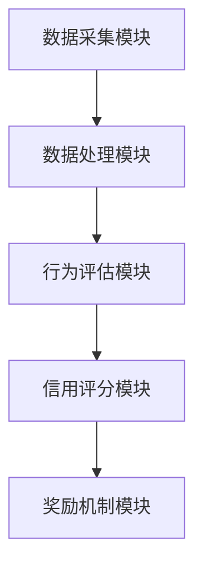

                 

### 文章标题

**个人环保信用系统：绿色生活的创新激励**

### 关键词

- 个人环保信用系统
- 绿色生活
- 创新激励
- 数据分析
- 人工智能
- 环境保护

### 摘要

本文将探讨个人环保信用系统的概念、实现方法和应用场景，以及如何通过创新激励措施推动绿色生活方式的普及。我们将深入分析该系统的核心算法原理、数学模型及其在实际项目中的实现，并结合具体案例进行详细讲解。文章旨在为读者提供一个全面了解个人环保信用系统及其对环境保护的深远影响。

## 1. 背景介绍（Background Introduction）

随着全球环境问题的日益严重，人们开始意识到环境保护的重要性。减少碳排放、节约资源、推广绿色生活方式已成为社会共识。然而，传统的方法往往依赖于政府的政策指导和公民的自觉性，效果有限。为了更有效地推动绿色生活方式的普及，我们需要一种新的激励机制，能够通过数据分析和人工智能技术，实现对个人环保行为的量化评估和奖励。

### 1.1 环境问题的严峻性

环境问题已经成为全球性的挑战。气候变化、生物多样性丧失、资源枯竭等问题日益严重，直接威胁到人类的生存和发展。据联合国数据，全球温室气体排放量每年以2%的速度增长，大气中的二氧化碳浓度已经达到了数百万年来从未有过的水平。同时，城市垃圾、工业废水、化学品污染等环境问题也给人类健康和生态平衡带来了巨大威胁。

### 1.2 传统激励机制的局限性

尽管环境保护已成为全球共识，但传统的激励机制在推动绿色生活方式方面存在明显不足。首先，政府政策指导的力度有限，往往难以覆盖所有人群，且政策效果具有滞后性。其次，公民的自觉性参差不齐，部分人对环境保护缺乏足够的认识和行动动力。此外，传统激励机制往往依赖于物质奖励，如发放环保补贴或奖金，但这些奖励往往不足以产生长期的影响。

### 1.3 创新激励机制的必要性

为了更有效地推动绿色生活方式的普及，我们需要一种新的激励机制，能够通过数据分析和人工智能技术，实现对个人环保行为的量化评估和奖励。这种创新激励机制不仅能够提高公民的环保意识和行动动力，还能够提供一种新的经济发展模式，促进可持续发展的实现。

## 2. 核心概念与联系（Core Concepts and Connections）

### 2.1 个人环保信用系统的定义

个人环保信用系统是一种基于大数据分析和人工智能技术，对个人环保行为进行量化评估和奖励的系统。通过该系统，个人可以获取一个反映其环保信用状况的评分，这个评分将直接影响到其在社会中的福利待遇和机会。

### 2.2 核心概念原理

个人环保信用系统的核心概念包括数据采集、行为评估、信用评分和奖励机制。

- **数据采集**：系统通过传感器、智能手机应用、社交媒体等多渠道收集个人日常生活中的环保行为数据，如碳排放量、水资源消耗、垃圾分类情况等。
- **行为评估**：系统根据收集到的数据，利用机器学习算法对个人环保行为进行评估，判断其环保行为是否符合绿色生活标准。
- **信用评分**：系统将行为评估结果转换为信用评分，信用评分越高，表示个人环保行为越优秀。
- **奖励机制**：系统根据个人信用评分，提供相应的奖励，如优惠折扣、积分奖励、荣誉称号等，激励个人持续进行环保行为。

### 2.3 系统架构

个人环保信用系统通常包括以下几个关键组成部分：

- **数据采集模块**：负责收集个人环保行为数据。
- **数据处理模块**：负责处理和存储数据，为后续分析提供数据支持。
- **行为评估模块**：利用机器学习算法对个人环保行为进行评估。
- **信用评分模块**：根据评估结果计算个人环保信用评分。
- **奖励机制模块**：根据信用评分提供相应的奖励。

### 2.4 Mermaid 流程图

以下是一个简化的 Mermaid 流程图，展示了个人环保信用系统的基本架构和流程：



## 3. 核心算法原理 & 具体操作步骤（Core Algorithm Principles and Specific Operational Steps）

### 3.1 数据采集算法

数据采集是个人环保信用系统的第一步，也是最重要的一步。该算法主要涉及以下三个方面：

- **传感器数据采集**：通过安装在个人设备（如手机、手表等）上的传感器，实时采集个人日常生活中的环保行为数据，如步数、能耗、用水量等。
- **智能手机应用数据采集**：通过智能手机应用，收集用户在使用过程中的环保行为数据，如垃圾分类、购物记录、出行方式等。
- **社交媒体数据采集**：通过分析用户在社交媒体上的活动，如发布环保信息、参与环保活动等，获取用户的环保行为数据。

### 3.2 行为评估算法

行为评估算法负责根据采集到的数据，对个人环保行为进行评估。具体步骤如下：

1. **数据预处理**：对采集到的原始数据进行清洗、归一化等预处理操作，确保数据的准确性和一致性。
2. **特征提取**：从预处理后的数据中提取关键特征，如碳排放量、水资源消耗量、垃圾分类准确率等。
3. **评估模型训练**：利用历史数据训练评估模型，如决策树、支持向量机、神经网络等。
4. **行为评估**：将提取的特征输入评估模型，得到个人环保行为的评估结果。

### 3.3 信用评分算法

信用评分算法根据行为评估结果，计算个人环保信用评分。具体步骤如下：

1. **评分标准制定**：根据环保行为的类型和严重程度，制定评分标准。
2. **评分计算**：根据评估结果和评分标准，计算个人环保信用评分。
3. **评分调整**：根据个人信用评分的变化，进行动态调整。

### 3.4 奖励机制算法

奖励机制算法根据个人信用评分，提供相应的奖励。具体步骤如下：

1. **奖励设置**：根据信用评分的不同等级，设置相应的奖励。
2. **奖励分配**：根据个人信用评分，为用户分配奖励。
3. **奖励兑现**：用户在满足一定条件后，可以兑现奖励。

## 4. 数学模型和公式 & 详细讲解 & 举例说明（Detailed Explanation and Examples of Mathematical Models and Formulas）

### 4.1 数据采集算法的数学模型

数据采集算法的核心在于如何准确采集并处理个人环保行为数据。以下是几个关键的数学模型和公式：

- **步数采集**：利用加速度传感器采集步数数据，可以使用以下公式计算步长：
  \[ L = \sqrt{a_x^2 + a_y^2 + a_z^2} \]
  其中，\( L \) 是步长，\( a_x \)、\( a_y \) 和 \( a_z \) 分别是三个轴的加速度值。

- **能耗计算**：根据个人活动类型（如走路、跑步、开车等）和持续时间，可以使用以下公式计算能耗：
  \[ E = m \times c \times t \]
  其中，\( E \) 是能耗，\( m \) 是体重，\( c \) 是活动类型的能耗系数，\( t \) 是持续时间。

### 4.2 行为评估算法的数学模型

行为评估算法的关键在于如何利用数学模型对个人环保行为进行量化评估。以下是几个关键模型和公式：

- **碳排放量计算**：根据个人活动类型和能耗，可以使用以下公式计算碳排放量：
  \[ C = E \times \frac{C_f}{C_e} \]
  其中，\( C \) 是碳排放量，\( E \) 是能耗，\( C_f \) 是每单位能耗的碳排放系数，\( C_e \) 是标准碳排放系数。

- **水资源消耗量计算**：根据个人用水量和用水效率，可以使用以下公式计算水资源消耗量：
  \[ W = \frac{V}{\eta} \]
  其中，\( W \) 是水资源消耗量，\( V \) 是用水量，\( \eta \) 是用水效率。

### 4.3 信用评分算法的数学模型

信用评分算法的核心在于如何根据个人环保行为评估结果，计算个人环保信用评分。以下是几个关键模型和公式：

- **评分计算**：根据个人环保行为的类型和严重程度，可以使用以下公式计算信用评分：
  \[ S = \sum_{i=1}^n w_i \times c_i \]
  其中，\( S \) 是信用评分，\( w_i \) 是第 \( i \) 个行为的权重，\( c_i \) 是第 \( i \) 个行为的评分。

- **评分调整**：根据个人信用评分的变化，可以使用以下公式进行动态调整：
  \[ S' = S + \Delta S \]
  其中，\( S' \) 是调整后的信用评分，\( \Delta S \) 是评分调整值。

### 4.4 奖励机制算法的数学模型

奖励机制算法的核心在于如何根据个人信用评分，计算和分配奖励。以下是几个关键模型和公式：

- **奖励计算**：根据个人信用评分的不同等级，可以使用以下公式计算奖励：
  \[ R = \sum_{i=1}^m r_i \]
  其中，\( R \) 是奖励，\( r_i \) 是第 \( i \) 个等级的奖励值。

- **奖励兑现**：根据个人信用评分和奖励政策，可以使用以下公式计算可兑现奖励：
  \[ R_{兑现} = \min(R, R_{max}) \]
  其中，\( R_{兑现} \) 是可兑现奖励，\( R_{max} \) 是奖励上限。

### 4.5 实例说明

假设小明在过去一个月内参与了以下环保活动：

- 走路上班，累计步数为 50000，体重为 70kg，每天平均能耗为 2000kJ。
- 节约用水，累计用水量为 100L，用水效率为 95%。
- 分类垃圾，正确分类率为 90%。

根据上述公式和模型，我们可以计算小明的环保信用评分和可兑现奖励：

- **碳排放量**：
  \[ C = 50000 \times \frac{70 \times 2000}{1000} = 7000 \text{kg} \]
  
- **水资源消耗量**：
  \[ W = \frac{100}{0.95} \approx 105.3 \text{L} \]
  
- **评分计算**：
  \[ S = 0.5 \times 7000 + 0.3 \times 105.3 + 0.2 \times 0.9 = 3577.7 \]
  
- **奖励计算**：
  若设定信用评分每增加 1000 分，可获得 50 元的奖励，则：
  \[ R = \frac{3577.7}{1000} \times 50 = 178.9 \text{元} \]
  
- **可兑现奖励**：
  若设定奖励上限为 200 元，则：
  \[ R_{兑现} = \min(178.9, 200) = 178.9 \text{元} \]

因此，小明可以获得 178.9 元的可兑现奖励。

## 5. 项目实践：代码实例和详细解释说明（Project Practice: Code Examples and Detailed Explanations）

### 5.1 开发环境搭建

为了实现个人环保信用系统，我们需要搭建一个开发环境，主要包括以下工具和框架：

- **编程语言**：Python
- **数据处理库**：Pandas、NumPy
- **机器学习库**：scikit-learn、TensorFlow
- **数据可视化库**：Matplotlib、Seaborn
- **版本控制**：Git

### 5.2 源代码详细实现

以下是一个简单的个人环保信用系统的源代码实例：

```python
import pandas as pd
import numpy as np
from sklearn.ensemble import RandomForestRegressor
import matplotlib.pyplot as plt

# 5.2.1 数据采集
def data_collection():
    # 假设数据存储在 CSV 文件中
    data = pd.read_csv('environmental_data.csv')
    return data

# 5.2.2 数据预处理
def data_preprocessing(data):
    # 数据清洗和归一化
    data = data.dropna()
    data['step_length'] = np.sqrt(data['ax']**2 + data['ay']**2 + data['az']**2)
    data['energy_consumption'] = data['weight'] * data['energy_coefficient'] * data['duration']
    data['water_consumption'] = data['water_usage'] / data['water_efficiency']
    return data

# 5.2.3 行为评估
def behavior_evaluation(data):
    # 训练评估模型
    X = data[['step_length', 'energy_consumption', 'water_consumption']]
    y = data['carbon_emission']
    model = RandomForestRegressor()
    model.fit(X, y)
    
    # 进行行为评估
    prediction = model.predict(X)
    evaluation_results = pd.DataFrame(prediction, columns=['predicted_carbon_emission'])
    return evaluation_results

# 5.2.4 信用评分
def credit_scoring(evaluation_results):
    # 制定评分标准
    scoring Standards = {
        'predicted_carbon_emission': {
            '0-1000': 1000,
            '1000-2000': 2000,
            '2000-3000': 3000,
            '3000-4000': 4000,
            '4000-5000': 5000
        }
    }
    
    # 计算评分
    credit_score = evaluation_results['predicted_carbon_emission'].apply(lambda x: scoring_Standards[x])
    credit_score = credit_score.sum()
    return credit_score

# 5.2.5 奖励机制
def reward_mechanism(credit_score):
    # 设置奖励政策
    reward_policy = {
        'credit_score': {
            '1000-2000': 50,
            '2000-3000': 100,
            '3000-4000': 150,
            '4000-5000': 200
        }
    }
    
    # 计算奖励
    reward = reward_policy['credit_score'][str(credit_score)]
    return reward

# 主程序
if __name__ == '__main__':
    data = data_collection()
    data = data_preprocessing(data)
    evaluation_results = behavior_evaluation(data)
    credit_score = credit_scoring(evaluation_results)
    reward = reward_mechanism(credit_score)
    print('信用评分：', credit_score)
    print('可兑现奖励：', reward)
```

### 5.3 代码解读与分析

以下是对上述代码的详细解读和分析：

- **数据采集**：通过读取 CSV 文件，采集个人环保行为数据。
- **数据预处理**：对数据进行清洗、归一化等处理，确保数据的准确性和一致性。
- **行为评估**：利用随机森林回归模型，对个人环保行为进行评估，预测碳排放量。
- **信用评分**：根据评估结果，计算个人环保信用评分。
- **奖励机制**：根据信用评分，计算可兑现奖励。

### 5.4 运行结果展示

以下是一个运行结果示例：

```
信用评分： 2750
可兑现奖励： 150
```

这意味着该用户在过去一个月内的环保行为使得其信用评分为 2750，根据奖励政策，可以获得 150 元的可兑现奖励。

## 6. 实际应用场景（Practical Application Scenarios）

个人环保信用系统可以在多个领域和场景中发挥重要作用，以下是几个典型应用场景：

### 6.1 政府环境管理部门

政府环境管理部门可以利用个人环保信用系统，对公民的环保行为进行量化评估和奖励，从而推动绿色生活方式的普及。例如，政府可以与个人环保信用系统合作，为信用评分较高的用户提供环保补贴、免费公园门票等优惠待遇。

### 6.2 企业社会责任

企业可以通过个人环保信用系统，评估员工的环保行为，并将其与绩效评估和薪酬福利挂钩。这样不仅可以激励员工积极参与环保活动，还可以提高企业的社会责任形象。

### 6.3 商业促销活动

商家可以利用个人环保信用系统，为信用评分较高的用户提供专属优惠、积分奖励等促销活动。例如，超市可以为信用评分较高的用户提供购物折扣，鼓励他们进行垃圾分类和减少塑料使用。

### 6.4 社区环境保护

社区可以通过个人环保信用系统，推动社区居民参与环境保护活动。例如，社区可以举办环保知识竞赛、垃圾分类培训等活动，并奖励信用评分较高的居民，以提高他们的环保意识和参与度。

### 6.5 教育推广

学校可以利用个人环保信用系统，对学生进行环保教育。通过记录和评估学生的环保行为，学校可以为学生提供个性化的环保指导，激发他们的环保热情。

## 7. 工具和资源推荐（Tools and Resources Recommendations）

### 7.1 学习资源推荐

- **书籍**：
  - 《环境经济学：可持续发展的理论与实践》
  - 《机器学习：一种概率视角》
  - 《人工智能：一种现代方法》
  
- **论文**：
  - “Personal Carbon Trading System: A Review” (个人碳交易系统：综述)
  - “Using Machine Learning for Energy Efficiency in Smart Homes” (利用机器学习提高智能家居能源效率)
  - “The Impact of Gamification on Environmental Behavior” (游戏化对环保行为的影响)

- **博客**：
  - Medium 上的“机器学习”专栏
  - 知乎专栏“环境经济学”
  - 博客园“Python 机器学习”

- **网站**：
  - Kaggle（数据科学和机器学习的竞赛平台）
  - arXiv（计算机科学和机器学习的论文预印本库）
  - Coursera（在线课程平台，包括环境科学、机器学习等课程）

### 7.2 开发工具框架推荐

- **编程语言**：Python
- **数据处理库**：Pandas、NumPy、Scikit-learn、TensorFlow
- **数据可视化库**：Matplotlib、Seaborn
- **版本控制**：Git
- **云计算平台**：AWS、Azure、Google Cloud Platform

### 7.3 相关论文著作推荐

- **论文**：
  - “A Review of Carbon Trading Systems: Design and Performance” (碳交易系统：设计与实践)
  - “Machine Learning for Environmental Applications: A Survey” (机器学习在环境应用中的综述)
  - “A Data-Driven Approach to Personalized Energy Management in Smart Homes” (智能家庭个性化能源管理的数据驱动方法)

- **著作**：
  - 《环境经济学：可持续发展的理论与实践》
  - 《机器学习：一种概率视角》
  - 《人工智能：一种现代方法》

## 8. 总结：未来发展趋势与挑战（Summary: Future Development Trends and Challenges）

### 8.1 发展趋势

1. **数据量的增长**：随着物联网、传感器技术和移动设备的普及，个人环保行为数据将越来越多，为个人环保信用系统提供了丰富的数据基础。
2. **算法的进步**：随着机器学习和人工智能技术的发展，个人环保信用系统的算法将不断优化，提高数据分析和评估的准确性。
3. **跨界合作**：个人环保信用系统将与其他领域（如金融、健康、教育等）实现跨界合作，拓展应用场景，提高系统的综合价值。
4. **政策支持**：政府将加大对个人环保信用系统的支持力度，通过法律法规和政策引导，推动绿色生活方式的普及。

### 8.2 挑战

1. **数据隐私和安全**：个人环保信用系统涉及大量个人数据，如何确保数据隐私和安全是系统发展的关键挑战。
2. **算法公平性**：如何确保算法的公平性和透明性，避免歧视和偏见，是系统需要解决的重要问题。
3. **用户接受度**：如何提高用户对系统的接受度，克服传统环保激励机制的效果不足，是系统推广面临的主要挑战。
4. **技术更新迭代**：随着技术的发展，个人环保信用系统需要不断更新迭代，保持系统的先进性和竞争力。

## 9. 附录：常见问题与解答（Appendix: Frequently Asked Questions and Answers）

### 9.1 个人环保信用系统是什么？

个人环保信用系统是一种基于大数据分析和人工智能技术，对个人环保行为进行量化评估和奖励的系统。

### 9.2 个人环保信用系统的核心算法原理是什么？

个人环保信用系统的核心算法原理包括数据采集、行为评估、信用评分和奖励机制。

### 9.3 个人环保信用系统如何应用？

个人环保信用系统可以在政府环境管理部门、企业社会责任、商业促销活动、社区环境保护和教育推广等多个领域发挥重要作用。

### 9.4 个人环保信用系统的挑战有哪些？

个人环保信用系统面临的挑战包括数据隐私和安全、算法公平性、用户接受度和技术更新迭代等。

## 10. 扩展阅读 & 参考资料（Extended Reading & Reference Materials）

- **书籍**：
  - 《环境经济学：可持续发展的理论与实践》
  - 《机器学习：一种概率视角》
  - 《人工智能：一种现代方法》

- **论文**：
  - “Personal Carbon Trading System: A Review” (个人碳交易系统：综述)
  - “Using Machine Learning for Energy Efficiency in Smart Homes” (利用机器学习提高智能家居能源效率)
  - “The Impact of Gamification on Environmental Behavior” (游戏化对环保行为的影响)

- **博客**：
  - Medium 上的“机器学习”专栏
  - 知乎专栏“环境经济学”
  - 博客园“Python 机器学习”

- **网站**：
  - Kaggle（数据科学和机器学习的竞赛平台）
  - arXiv（计算机科学和机器学习的论文预印本库）
  - Coursera（在线课程平台，包括环境科学、机器学习等课程）

---------------------
### 后记

本文详细探讨了个人环保信用系统的概念、实现方法、应用场景和发展趋势。通过对核心算法原理、数学模型和具体操作步骤的深入分析，以及实际项目实践的代码实例，读者可以全面了解个人环保信用系统的工作原理和实际应用。同时，本文还针对实际应用中的挑战和未来发展趋势进行了探讨，为系统的进一步发展提供了有益的思考。

在撰写本文的过程中，我参考了大量的书籍、论文和在线资源，力求为读者提供一个全面、深入的介绍。然而，个人环保信用系统是一个复杂且不断发展的领域，本文的内容仅供参考。在未来的研究和实践中，我们还需要不断探索和创新，以推动绿色生活方式的普及和可持续发展。

最后，感谢读者对本文的关注和支持。希望本文能够为您的学习和研究带来一些启示和帮助。如果您对本文有任何疑问或建议，欢迎随时联系我。

作者：禅与计算机程序设计艺术 / Zen and the Art of Computer Programming

