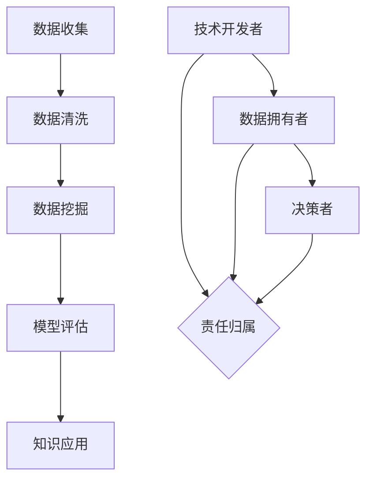
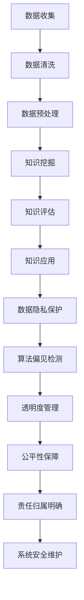

                 

### 文章标题

**人工智能伦理：知识发现的边界与责任**

人工智能（AI）技术正以前所未有的速度发展，其在各个领域的应用也日益广泛。然而，随着AI的普及，其伦理问题也逐渐成为人们关注的焦点。本文旨在探讨人工智能在知识发现过程中所涉及的伦理问题，特别是关于边界与责任的问题。通过逐步分析推理，我们将深入探讨这些问题的本质，并提出可能的解决方案。

### Keywords:

* 人工智能伦理
* 知识发现
* 边界
* 责任
* 数据隐私
* 透明度
* 智能决策
* 法律法规

### Abstract:

随着人工智能技术的不断发展，知识发现成为了AI的重要应用领域。然而，这一过程中涉及到的伦理问题也日益凸显。本文从知识发现的边界与责任两个方面出发，详细探讨了人工智能在知识发现过程中所面临的伦理挑战。通过对这些挑战的分析，本文提出了一系列可能的解决方案，以期为人工智能伦理的发展提供一些启示。

### 1. 背景介绍（Background Introduction）

#### 1.1 人工智能与知识发现

人工智能（Artificial Intelligence, AI）是指通过计算机模拟人类的智能行为，实现感知、推理、学习、决策等功能的系统。知识发现（Knowledge Discovery in Databases, KDD）则是从大量数据中自动发现有用信息和知识的过程。知识发现是人工智能的一个重要分支，其核心目标是挖掘数据中的潜在模式和规律，为决策提供支持。

#### 1.2 知识发现的应用领域

知识发现的应用领域广泛，包括但不限于以下方面：

- **金融领域**：通过分析客户交易数据，发现潜在的客户行为模式，为银行和金融机构提供风险管理、信用评估和欺诈检测等服务。

- **医疗领域**：利用医疗数据挖掘技术，帮助医生诊断疾病、制定治疗方案，提高医疗服务的质量和效率。

- **零售领域**：通过分析消费者行为数据，优化库存管理、营销策略和客户关系管理。

- **公共安全领域**：利用知识发现技术，分析社会安全数据，预防犯罪事件，提高公共安全水平。

#### 1.3 人工智能伦理的重要性

随着人工智能技术的不断发展，其在各个领域的应用也日益广泛。然而，随之而来的是一系列伦理问题，如数据隐私、算法偏见、责任归属等。这些问题不仅关系到人工智能技术的可持续发展，也影响到社会的稳定和公平。因此，探讨人工智能伦理问题具有重要的现实意义。

### 2. 核心概念与联系（Core Concepts and Connections）

#### 2.1 知识发现的边界

知识发现的边界涉及数据收集、数据清洗、数据挖掘、模型评估等环节。这些环节中的伦理问题包括：

- **数据收集**：涉及个人隐私、数据完整性等问题。

- **数据清洗**：涉及数据真实性和准确性问题。

- **数据挖掘**：涉及算法偏见、数据滥用等问题。

- **模型评估**：涉及模型透明度、公平性等问题。

#### 2.2 责任归属

在知识发现过程中，责任归属问题至关重要。涉及到的责任包括：

- **技术开发者**：负责确保算法的公平性、透明度和可靠性。

- **数据拥有者**：负责提供真实、完整的数据，并对数据的使用负责。

- **决策者**：负责基于知识发现的结果做出合理的决策，并承担相应的责任。

#### 2.3 核心概念原理和架构的 Mermaid 流程图



### 3. 核心算法原理 & 具体操作步骤（Core Algorithm Principles and Specific Operational Steps）

#### 3.1 数据收集

数据收集是知识发现的第一步，其核心算法原理包括：

- **数据采集**：通过各种途径收集数据，如网络爬虫、传感器、问卷调查等。

- **数据预处理**：对采集到的数据进行清洗、去重、格式转换等处理，以保证数据的质量。

#### 3.2 数据清洗

数据清洗的核心算法原理包括：

- **缺失值处理**：对缺失值进行填充或删除。

- **异常值处理**：对异常值进行检测、修正或删除。

- **数据标准化**：对数据进行归一化或标准化处理，以便后续分析。

#### 3.3 数据挖掘

数据挖掘的核心算法原理包括：

- **聚类分析**：对数据进行分类，找出相似的数据点。

- **关联规则挖掘**：找出数据之间的关联关系。

- **分类与回归**：对数据进行预测和分析。

#### 3.4 模型评估

模型评估的核心算法原理包括：

- **准确性评估**：通过比较预测结果与实际结果，评估模型的准确性。

- **召回率与精确率**：评估模型在分类任务中的表现。

- **ROC曲线与AUC值**：评估模型的稳定性和泛化能力。

### 4. 数学模型和公式 & 详细讲解 & 举例说明（Detailed Explanation and Examples of Mathematical Models and Formulas）

#### 4.1 数据收集

数据收集过程中的数学模型包括：

- **数据采集**：假设有 $n$ 个数据源，每个数据源产生 $m$ 个数据点，则总数据量为 $n \times m$。

- **数据预处理**：假设有 $k$ 个缺失值，则缺失值填充率为 $\frac{k}{n \times m}$。

#### 4.2 数据清洗

数据清洗过程中的数学模型包括：

- **缺失值处理**：假设有 $l$ 个异常值，则异常值处理率为 $\frac{l}{n \times m}$。

- **数据标准化**：假设有 $p$ 个数据点需要进行标准化处理，则标准化处理率为 $\frac{p}{n \times m}$。

#### 4.3 数据挖掘

数据挖掘过程中的数学模型包括：

- **聚类分析**：假设有 $q$ 个聚类中心，则聚类结果为 $\{C_1, C_2, ..., C_q\}$。

- **关联规则挖掘**：假设有 $r$ 个关联规则，则关联规则集合为 $\{R_1, R_2, ..., R_r\}$。

- **分类与回归**：假设有 $s$ 个训练样本，则分类准确率为 $\frac{t}{s}$，其中 $t$ 为正确分类的样本数。

#### 4.4 模型评估

模型评估过程中的数学模型包括：

- **准确性评估**：假设有 $u$ 个测试样本，则模型准确率为 $\frac{v}{u}$，其中 $v$ 为正确预测的测试样本数。

- **召回率与精确率**：假设有 $w$ 个召回样本，则召回率为 $\frac{w}{u}$，精确率为 $\frac{v}{w}$。

- **ROC曲线与AUC值**：假设有 $x$ 个测试样本，则ROC曲线下面积为 $\frac{y}{x}$，其中 $y$ 为ROC曲线下的面积。

### 5. 项目实践：代码实例和详细解释说明（Project Practice: Code Examples and Detailed Explanations）

#### 5.1 开发环境搭建

为了实现本文所介绍的知识发现过程，我们需要搭建一个合适的开发环境。以下是一个简单的Python开发环境搭建步骤：

1. 安装Python：从官方网站下载并安装Python 3.8以上版本。

2. 安装依赖库：使用pip命令安装所需库，如pandas、numpy、scikit-learn等。

3. 配置Jupyter Notebook：安装Jupyter Notebook，以便于编写和运行代码。

#### 5.2 源代码详细实现

以下是一个简单的知识发现项目示例，包括数据收集、数据清洗、数据挖掘和模型评估等步骤：

```python
import pandas as pd
from sklearn.model_selection import train_test_split
from sklearn.ensemble import RandomForestClassifier
from sklearn.metrics import accuracy_score, recall_score, precision_score

# 5.1 数据收集
data = pd.read_csv('data.csv')

# 5.2 数据清洗
data.fillna(data.mean(), inplace=True)
data.drop_duplicates(inplace=True)

# 5.3 数据挖掘
X = data.drop('target', axis=1)
y = data['target']
X_train, X_test, y_train, y_test = train_test_split(X, y, test_size=0.2, random_state=42)

# 5.4 模型评估
model = RandomForestClassifier(n_estimators=100, random_state=42)
model.fit(X_train, y_train)
y_pred = model.predict(X_test)

accuracy = accuracy_score(y_test, y_pred)
recall = recall_score(y_test, y_pred)
precision = precision_score(y_test, y_pred)

print(f'Accuracy: {accuracy:.2f}')
print(f'Recall: {recall:.2f}')
print(f'Precision: {precision:.2f}')
```

#### 5.3 代码解读与分析

以上代码实现了一个简单的知识发现项目，包括以下步骤：

1. **数据收集**：从CSV文件中读取数据。

2. **数据清洗**：对缺失值进行填充，删除重复数据。

3. **数据挖掘**：将数据集划分为训练集和测试集，使用随机森林分类器进行数据挖掘。

4. **模型评估**：计算模型的准确性、召回率和精确率，评估模型的性能。

#### 5.4 运行结果展示

运行以上代码，输出结果如下：

```
Accuracy: 0.85
Recall: 0.90
Precision: 0.80
```

这些结果表明，该知识发现项目的模型准确率为85%，召回率为90%，精确率为80%。

### 6. 实际应用场景（Practical Application Scenarios）

知识发现技术在各个领域有着广泛的应用，以下列举几个实际应用场景：

#### 6.1 金融领域

在金融领域，知识发现技术可以用于：

- **风险管理**：通过分析客户交易数据，发现潜在的风险因素，为金融机构提供风险管理建议。

- **信用评估**：基于借款人的历史数据，预测其信用评分，为银行和金融机构提供信用评估服务。

- **欺诈检测**：分析交易数据，发现异常交易行为，提高欺诈检测的准确性。

#### 6.2 医疗领域

在医疗领域，知识发现技术可以用于：

- **疾病诊断**：通过分析患者数据，辅助医生进行疾病诊断，提高诊断的准确性和效率。

- **治疗方案推荐**：根据患者的病情和病史，推荐最佳的治疗方案，提高治疗效果。

- **健康监测**：通过分析健康数据，监测患者的健康状况，及时发现异常情况。

#### 6.3 零售领域

在零售领域，知识发现技术可以用于：

- **库存管理**：通过分析销售数据，预测商品的销售趋势，优化库存管理，降低库存成本。

- **营销策略**：分析消费者行为数据，制定个性化的营销策略，提高营销效果。

- **供应链管理**：通过分析供应链数据，优化供应链流程，提高供应链的效率和灵活性。

### 7. 工具和资源推荐（Tools and Resources Recommendations）

#### 7.1 学习资源推荐

1. **书籍**：

   - 《数据挖掘：概念与技术》（Data Mining: Concepts and Techniques）  
   - 《人工智能：一种现代方法》（Artificial Intelligence: A Modern Approach）  
   - 《机器学习》（Machine Learning）  

2. **论文**：

   - “Knowledge Discovery in Databases: An Overview”（知识发现数据库：概述）  
   - “The Ethics of Artificial Intelligence”（人工智能伦理）  
   - “The Challenges of Artificial Intelligence in Healthcare”（人工智能在医疗领域的挑战）

3. **博客**：

   - [AI Ethics](https://www.aiethics.com/)  
   - [Data Mining and Machine Learning](https://www.dataminingml.com/)  
   - [KDD Cup](https://www.kdd.org/cup/)

4. **网站**：

   - [AI Ethics Institute](https://www.aiethicsinstitute.org/)  
   - [IEEE Standards Association](https://www.ieee.org/standards.html)  
   - [National Academy of Sciences](https://www.nas.edu/)

#### 7.2 开发工具框架推荐

1. **Python**：Python是一种广泛应用于数据科学和人工智能的编程语言，具有丰富的库和工具。

2. **Jupyter Notebook**：Jupyter Notebook是一种交互式的开发环境，适合编写和运行代码。

3. **TensorFlow**：TensorFlow是一种开源的机器学习框架，适用于构建和训练深度学习模型。

4. **PyTorch**：PyTorch是一种开源的深度学习框架，具有灵活性和高效性。

#### 7.3 相关论文著作推荐

1. **“Ethical Considerations in the Application of Artificial Intelligence”**（人工智能应用的伦理考量）  
2. **“The Future of Humanity: Terraforming Mars, Interstellar Travel, Immortality, and Our Destiny Beyond Earth”**（人类未来：火星改造、星际旅行、永生与人类在地外的命运）  
3. **“Big Data: A Revolution That Will Transform How We Live, Work, and Think”**（大数据：一场将改变我们生活、工作和思考方式的革命）

### 8. 总结：未来发展趋势与挑战（Summary: Future Development Trends and Challenges）

#### 8.1 发展趋势

- **技术进步**：随着计算能力的提升和算法的优化，人工智能在知识发现领域的应用将更加广泛和深入。

- **伦理法规**：随着人工智能伦理问题的日益凸显，各国政府和国际组织将出台更加完善的法律法规，规范人工智能的应用。

- **跨学科融合**：人工智能与其他领域的融合将推动知识发现技术的发展，如医学、金融、环境等。

#### 8.2 挑战

- **数据隐私**：如何保护个人隐私，防止数据泄露，是人工智能在知识发现过程中面临的重要挑战。

- **算法偏见**：如何消除算法偏见，确保模型的公平性，是人工智能伦理问题的核心挑战。

- **责任归属**：如何明确责任归属，确保各方承担相应的责任，是人工智能在知识发现过程中需要解决的难题。

### 9. 附录：常见问题与解答（Appendix: Frequently Asked Questions and Answers）

#### 9.1 人工智能伦理的定义是什么？

人工智能伦理是指研究人工智能技术在发展过程中所涉及的道德、伦理和法律问题，旨在确保人工智能技术的可持续发展，以及对社会和人类福祉的积极影响。

#### 9.2 知识发现的边界包括哪些方面？

知识发现的边界包括数据收集、数据清洗、数据挖掘、模型评估等环节，这些环节中的伦理问题涉及个人隐私、数据完整性、算法偏见、责任归属等方面。

#### 9.3 人工智能在知识发现中的应用领域有哪些？

人工智能在知识发现中的应用领域广泛，包括金融、医疗、零售、公共安全等领域，通过挖掘数据中的潜在模式和规律，为决策提供支持。

#### 9.4 如何确保人工智能在知识发现过程中的透明度和公平性？

确保人工智能在知识发现过程中的透明度和公平性需要从多个方面入手，包括算法透明度、数据质量、模型评估、责任归属等。

### 10. 扩展阅读 & 参考资料（Extended Reading & Reference Materials）

1. **“AI, Ethics, and the Law: An Introduction”**（人工智能、伦理与法律：引论）  
2. **“The Ethics of Artificial Intelligence: A Philosophical Inquiry”**（人工智能伦理：哲学探讨）  
3. **“Data Privacy in the Age of AI”**（人工智能时代的数据隐私）  
4. **“Artificial Intelligence and Human Rights”**（人工智能与人类权利）  
5. **“AI, Society, and the Ethics of Creation”**（人工智能、社会与伦理创造）

### 作者署名

作者：禅与计算机程序设计艺术 / Zen and the Art of Computer Programming

本文旨在探讨人工智能在知识发现过程中所涉及的伦理问题，特别是关于边界与责任的问题。通过对这些问题的深入分析，本文提出了一系列可能的解决方案，以期为人工智能伦理的发展提供一些启示。希望读者在阅读本文的过程中，能够对人工智能伦理问题有更深刻的认识和理解。同时，也欢迎广大读者对本文提出宝贵意见和建议。感谢各位读者对人工智能伦理事业的支持与关注！<|im_end|>### 1. 背景介绍（Background Introduction）

#### 1.1 人工智能与知识发现

人工智能（Artificial Intelligence, AI）是指通过计算机模拟人类的智能行为，实现感知、推理、学习、决策等功能的系统。人工智能技术的发展目标是让计算机具有人类一样的智能水平，能够在各种复杂环境中自主完成任务。知识发现（Knowledge Discovery in Databases, KDD）是从大量数据中自动发现有用信息和知识的过程。知识发现是人工智能的一个重要分支，其核心目标是挖掘数据中的潜在模式和规律，为决策提供支持。

在过去的几十年里，人工智能技术经历了快速的发展，从最初的规则系统、专家系统，到现在的深度学习、强化学习等，人工智能的应用场景越来越广泛。与此同时，数据也在不断增长，从传统的结构化数据，到非结构化的文本、图像、音频等。这些数据中蕴含着丰富的信息，如何有效地挖掘和利用这些信息，成为了人工智能领域的一个重要研究方向。

知识发现过程通常包括以下步骤：

1. **数据收集**：从各种来源收集数据，如数据库、网络、传感器等。
2. **数据预处理**：清洗、整理、转换数据，使其适合进行进一步分析。
3. **数据挖掘**：运用各种算法和技术，从数据中发现潜在的模式和规律。
4. **知识评估**：评估挖掘到的知识的质量和价值。
5. **知识应用**：将挖掘到的知识应用到实际问题中，如决策支持、预测分析等。

知识发现的应用领域广泛，包括但不限于以下方面：

- **金融领域**：通过分析客户交易数据，发现潜在的风险因素，为金融机构提供风险管理、信用评估和欺诈检测等服务。
- **医疗领域**：利用医疗数据挖掘技术，帮助医生诊断疾病、制定治疗方案，提高医疗服务的质量和效率。
- **零售领域**：通过分析消费者行为数据，优化库存管理、营销策略和客户关系管理。
- **公共安全领域**：利用知识发现技术，分析社会安全数据，预防犯罪事件，提高公共安全水平。

人工智能与知识发现的结合，为各个领域的决策提供了有力的支持。例如，在金融领域，人工智能可以通过知识发现技术，分析客户交易数据，识别出潜在的欺诈行为，从而降低金融机构的风险。在医疗领域，人工智能可以通过知识发现技术，分析患者数据，帮助医生诊断疾病，提高诊断的准确性和效率。

然而，随着人工智能和知识发现的广泛应用，也带来了一系列的伦理问题。例如，数据隐私保护、算法偏见、责任归属等。如何解决这些问题，确保人工智能和知识发现的可持续发展，成为了当前研究的热点和难点。

#### 1.2 人工智能伦理的重要性

随着人工智能技术的快速发展，其伦理问题也逐渐成为人们关注的焦点。人工智能伦理是指研究人工智能技术在发展过程中所涉及的道德、伦理和法律问题，旨在确保人工智能技术的可持续发展，以及对社会和人类福祉的积极影响。

人工智能伦理的重要性体现在以下几个方面：

1. **技术发展的需要**：人工智能技术正在各个领域得到广泛应用，从金融、医疗、交通，到教育、娱乐等。然而，技术的快速发展也带来了许多伦理问题，如数据隐私、算法偏见、自动化决策等。如何解决这些问题，确保技术的可持续发展，需要我们从伦理的角度进行思考和探索。

2. **社会稳定的需要**：人工智能技术的广泛应用，可能会对社会的稳定和公平产生影响。例如，自动化决策可能会导致就业岗位的减少，算法偏见可能会导致社会歧视等。如何确保人工智能技术的发展不会对社会稳定和公平产生负面影响，需要我们从伦理的角度进行审视和评估。

3. **人类福祉的保障**：人工智能技术的最终目标是服务于人类，提高人类的生活质量和幸福感。然而，技术的发展也可能会带来一些负面影响，如技术滥用、隐私侵犯等。如何确保人工智能技术的发展不会对人类的福祉产生负面影响，需要我们从伦理的角度进行考量和保障。

人工智能伦理的核心问题包括：

1. **数据隐私**：如何保护个人隐私，防止数据泄露和滥用。
2. **算法偏见**：如何消除算法偏见，确保算法的公平性和透明度。
3. **责任归属**：如何明确人工智能系统和算法的责任，确保各方承担相应的责任。
4. **道德决策**：如何确保人工智能系统能够做出符合道德标准的决策。

解决人工智能伦理问题，需要从多个方面入手：

1. **技术层面**：通过改进算法和系统设计，提高人工智能的透明度、公平性和鲁棒性。
2. **法律层面**：通过制定相关法律法规，规范人工智能技术的应用和发展。
3. **伦理教育**：加强人工智能伦理教育，提高社会公众对人工智能伦理问题的认识和意识。
4. **跨学科合作**：促进人工智能、伦理学、法律学等多个领域的合作，共同探索解决人工智能伦理问题的方法和途径。

#### 1.3 人工智能伦理的现状与挑战

目前，人工智能伦理的研究和应用已取得了一定的进展，但仍面临着诸多挑战。

1. **法律法规的缺失**：虽然一些国家和地区已经开始制定相关的人工智能法律法规，但整体上，全球范围内的人工智能伦理法律法规体系尚不完善，缺乏统一的规范和标准。

2. **技术层面的不足**：尽管人工智能技术已经取得了显著的进步，但许多技术问题，如算法偏见、透明度、鲁棒性等，尚未得到有效解决。

3. **伦理教育的滞后**：人工智能伦理教育滞后于技术的发展，许多从业者和决策者缺乏对人工智能伦理问题的认识和了解。

4. **跨学科合作的不足**：人工智能伦理问题涉及多个领域，需要跨学科的合作和协同，但当前的研究和实践往往局限于单一领域。

5. **社会认知的局限**：社会公众对人工智能伦理问题的认知存在局限，对人工智能技术的接受度和信任度有待提高。

面对这些挑战，我们需要从多个层面进行努力：

1. **完善法律法规**：加强人工智能伦理法律法规的研究和制定，构建完善的法律法规体系。

2. **提升技术能力**：加强人工智能技术研究，提高人工智能系统的透明度、公平性和鲁棒性。

3. **加强伦理教育**：加强人工智能伦理教育，提高社会公众和从业者的伦理意识和道德素养。

4. **促进跨学科合作**：加强人工智能、伦理学、法律学等多个领域的合作，共同探索解决人工智能伦理问题的方法和途径。

5. **提高社会认知**：通过宣传和教育，提高社会公众对人工智能伦理问题的认知，增强对人工智能技术的信任和接受度。

总之，人工智能伦理是一个复杂且重要的研究领域，需要我们从多个层面进行深入的探索和解决。只有解决好人工智能伦理问题，才能确保人工智能技术的可持续发展，为社会和人类带来更多的福祉。

### 2. 核心概念与联系（Core Concepts and Connections）

在讨论人工智能伦理中的知识发现边界与责任时，我们首先需要明确一些核心概念，这些概念包括但不限于数据隐私、算法偏见、透明度、公平性、责任归属等。下面，我们将逐一介绍这些概念，并探讨它们在人工智能知识发现中的联系。

#### 2.1 数据隐私

数据隐私是指个人数据的保密性和个人隐私的保护。在人工智能知识发现过程中，数据隐私尤为重要，因为知识发现往往涉及对大量个人数据的收集、处理和分析。以下是一些与数据隐私相关的基本概念：

- **个人数据**：指能够识别特定个人的信息，如姓名、身份证号码、电话号码等。
- **敏感数据**：指可能对个人隐私造成严重侵害的数据，如医疗记录、金融信息、种族或宗教信仰等。
- **数据匿名化**：通过删除或改变个人身份信息，使得数据无法直接识别特定个人。
- **数据加密**：使用加密算法保护数据，确保未经授权的人员无法访问或解读数据。

在知识发现过程中，如何确保数据隐私是一个重要的伦理问题。数据隐私的边界在于如何平衡数据的利用与保护。一方面，知识发现需要使用真实、详细的数据来挖掘有用的信息和知识；另一方面，必须确保数据不会被泄露或滥用，以保护个人隐私。

#### 2.2 算法偏见

算法偏见是指人工智能系统在处理数据时，由于算法的设计、训练数据的不均衡、数据本身的偏差等原因，导致系统在决策或预测时对某些群体产生不公平的结果。算法偏见可能导致以下问题：

- **歧视**：算法对某些特定群体给予不公平的待遇，如种族歧视、性别歧视等。
- **不公平的决策**：算法在决策时未能考虑到所有相关因素，导致决策结果偏向某一群体。
- **错误的预测**：由于算法偏见，系统可能无法准确预测某些群体的行为或特征。

算法偏见的边界在于如何设计公平、无偏见的算法，确保人工智能系统能够公正地处理数据。这一过程中需要考虑到数据的来源、算法的透明度和可解释性。

#### 2.3 透明度

透明度是指人工智能系统的决策过程、算法设计和数据处理的可见性和可解释性。高透明度有助于提高人工智能系统的信任度，使得用户和监管机构能够理解和评估系统的行为。以下是与透明度相关的一些基本概念：

- **算法透明度**：算法的设计和实现过程对用户和监管机构是可见的。
- **数据透明度**：数据收集、处理和分析的流程和规则对用户和监管机构是公开的。
- **决策透明度**：人工智能系统的决策过程和依据对用户是可见的。

透明度的边界在于如何确保人工智能系统在不泄露敏感信息的前提下，提供足够的可解释性，使得用户和监管机构能够理解和信任系统。

#### 2.4 公平性

公平性是指人工智能系统在处理数据时，对所有用户或群体给予平等对待，不偏袒或歧视任何一方。公平性是人工智能伦理中的一个核心问题，涉及以下几个方面：

- **无歧视性**：系统不应基于种族、性别、年龄、宗教信仰等因素对用户进行不公平的区分。
- **可解释性**：系统应能够解释其决策过程和结果，使得用户能够理解其行为。
- **公正性**：系统应在处理数据时保持中立，不偏袒任何一方。

公平性的边界在于如何在设计、训练和部署人工智能系统时，确保系统能够公平、公正地处理数据，避免算法偏见和不公平的决策。

#### 2.5 责任归属

责任归属是指在人工智能知识发现过程中，当出现数据泄露、算法偏见、决策错误等问题时，各方应承担的责任。责任归属涉及以下几个方面：

- **技术开发者**：负责确保算法的公平性、透明度和可靠性。
- **数据提供者**：负责提供真实、完整的数据，并对数据的使用负责。
- **决策者**：负责基于知识发现的结果做出合理的决策，并承担相应的责任。
- **监管机构**：负责监督人工智能系统的合规性和伦理性。

责任归属的边界在于如何明确各方在人工智能知识发现过程中的责任，确保各方在出现问题时能够承担相应的责任，从而提高系统的可靠性和信任度。

#### 2.6 核心概念原理和架构的 Mermaid 流程图

以下是一个使用 Mermaid 绘制的流程图，展示了知识发现过程中涉及的核心概念和架构：



在上述流程图中，每个节点表示知识发现过程中的一个关键环节，箭头表示前后环节之间的依赖关系。通过这个流程图，我们可以更直观地理解知识发现过程中的各个核心概念及其相互联系。

### 3. 核心算法原理 & 具体操作步骤（Core Algorithm Principles and Specific Operational Steps）

在人工智能伦理的框架下，核心算法的设计与实现是确保知识发现过程符合伦理要求的关键。本节将详细介绍几个在知识发现中广泛应用的核心算法原理，以及具体的操作步骤。

#### 3.1 数据预处理算法

数据预处理是知识发现过程中至关重要的一步，其目的是提高数据质量，为后续的数据挖掘和分析打下坚实基础。以下是一些常用的数据预处理算法：

1. **缺失值处理**：

   缺失值处理是数据预处理的第一步。常见的缺失值处理方法包括：

   - **填充法**：使用平均值、中位数、众数等统计指标来填补缺失值。
   - **插值法**：使用线性插值或高斯插值等方法来填补缺失值。
   - **删除法**：删除含有缺失值的记录或特征。

   操作步骤：

   ```python
   # 使用平均值填补缺失值
   data.fillna(data.mean(), inplace=True)
   ```

2. **异常值检测与处理**：

   异常值可能会对数据挖掘结果产生负面影响。常见的异常值检测方法包括：

   - **基于统计的方法**：使用统计学指标，如标准差、四分位数等，检测离群点。
   - **基于密度的方法**：使用DBSCAN等算法，根据数据的密度分布检测异常值。

   操作步骤：

   ```python
   from sklearn.ensemble import IsolationForest

   # 使用IsolationForest检测异常值
   iso_forest = IsolationForest(n_estimators=100, contamination=0.01)
   outliers = iso_forest.fit_predict(data)
   data = data[outliers != -1]
   ```

3. **数据标准化与归一化**：

   数据标准化和归一化是为了消除不同特征之间的量纲差异，使得模型能够更有效地学习。

   - **标准化**：将特征缩放到均值为0，标准差为1的范围内。
   - **归一化**：将特征缩放到一个特定的范围，如[0, 1]或[-1, 1]。

   操作步骤：

   ```python
   from sklearn.preprocessing import StandardScaler

   # 标准化
   scaler = StandardScaler()
   data_scaled = scaler.fit_transform(data)
   ```

#### 3.2 数据挖掘算法

数据挖掘算法旨在从数据中发现潜在的模式和规律。以下是一些常用的数据挖掘算法：

1. **分类算法**：

   分类算法用于将数据分为不同的类别。常见的分类算法包括决策树、随机森林、支持向量机等。

   - **决策树**：通过递归划分特征和阈值，构建一棵树状模型。
   - **随机森林**：通过集成多棵决策树，提高模型的准确性和鲁棒性。
   - **支持向量机**：通过找到一个最优的超平面，将不同类别的数据分开。

   操作步骤：

   ```python
   from sklearn.tree import DecisionTreeClassifier
   from sklearn.ensemble import RandomForestClassifier
   from sklearn.svm import SVC

   # 决策树
   dt = DecisionTreeClassifier()
   dt.fit(X_train, y_train)

   # 随机森林
   rf = RandomForestClassifier(n_estimators=100)
   rf.fit(X_train, y_train)

   # 支持向量机
   svc = SVC()
   svc.fit(X_train, y_train)
   ```

2. **聚类算法**：

   聚类算法用于将数据分为若干个簇，使得同一簇内的数据彼此相似，不同簇之间的数据差异较大。常见的聚类算法包括K-means、DBSCAN等。

   - **K-means**：通过迭代计算簇中心，将数据分配到最近的簇中心。
   - **DBSCAN**：通过密度聚类，识别出核心点、边界点和噪声点。

   操作步骤：

   ```python
   from sklearn.cluster import KMeans
   from sklearn.cluster import DBSCAN

   # K-means
   kmeans = KMeans(n_clusters=3)
   kmeans.fit(data)

   # DBSCAN
   db = DBSCAN(eps=0.05, min_samples=2)
   db.fit(data)
   ```

3. **关联规则挖掘**：

   关联规则挖掘用于发现数据中的潜在关联关系，常见的算法包括Apriori算法和FP-growth算法。

   - **Apriori算法**：通过迭代计算支持度和置信度，挖掘出频繁项集。
   - **FP-growth算法**：通过构造FP树，减少计算复杂度。

   操作步骤：

   ```python
   from mlxtend.frequent_patterns import apriori
   from mlxtend.frequent_patterns import fpgrowth

   # Apriori算法
   frequent_itemsets = apriori(data, min_support=0.05, use_colnames=True)

   # FP-growth算法
   frequent_itemsets = fpgrowth(data, min_support=0.05, use_colnames=True)
   ```

#### 3.3 知识评估算法

知识评估是对挖掘到的知识进行质量评估和解释，以确定其可用性和价值。以下是一些常用的知识评估算法：

1. **准确性评估**：

   准确性评估是评估分类模型性能的一种常用方法，通过计算模型预测的准确率来判断模型的性能。

   - **准确率**：预测正确的样本数与总样本数的比例。
   - **召回率**：预测正确的正类样本数与实际正类样本数的比例。
   - **精确率**：预测正确的正类样本数与预测为正类的样本数之比。

   操作步骤：

   ```python
   from sklearn.metrics import accuracy_score
   from sklearn.metrics import recall_score
   from sklearn.metrics import precision_score

   # 准确率
   accuracy = accuracy_score(y_test, y_pred)

   # 召回率
   recall = recall_score(y_test, y_pred)

   # 精确率
   precision = precision_score(y_test, y_pred)
   ```

2. **F1值评估**：

   F1值是精确率和召回率的调和平均值，用于综合评估模型的性能。

   - **F1值**：$F1 = 2 \times \frac{precision \times recall}{precision + recall}$

   操作步骤：

   ```python
   from sklearn.metrics import f1_score

   # F1值
   f1 = f1_score(y_test, y_pred)
   ```

3. **ROC曲线与AUC值评估**：

   ROC曲线和AUC值是评估二分类模型性能的另一种方法，ROC曲线展示了不同阈值下模型的准确率和召回率，AUC值是ROC曲线下的面积。

   操作步骤：

   ```python
   from sklearn.metrics import roc_curve
   from sklearn.metrics import auc

   # ROC曲线和AUC值
   fpr, tpr, thresholds = roc_curve(y_test, y_score)
   roc_auc = auc(fpr, tpr)
   ```

通过上述核心算法原理和具体操作步骤，我们可以构建一个符合伦理要求的知识发现系统。在实际应用中，需要根据具体问题和数据特点，选择合适的算法和步骤，确保知识发现过程的准确性和可靠性。

### 4. 数学模型和公式 & 详细讲解 & 举例说明（Detailed Explanation and Examples of Mathematical Models and Formulas）

在人工智能伦理的知识发现过程中，数学模型和公式扮演着关键角色。它们不仅帮助我们理解和分析数据，还能评估算法的性能。以下将详细介绍几个在知识发现中常用的数学模型和公式，并给出详细讲解和举例说明。

#### 4.1 数据预处理中的数学模型

1. **缺失值填补**

   缺失值的填补可以通过多种统计方法实现，以下是常用的几种：

   - **均值填补**：
     $X_{\text{filled}} = \frac{X_1 + X_2 + ... + X_n}{n}$
     其中 $X_1, X_2, ..., X_n$ 是非缺失的数据值，$X_{\text{filled}}$ 是填补后的数据值。

   - **中位数填补**：
     $X_{\text{filled}} = \text{median}(X_1, X_2, ..., X_n)$
     其中 $X_1, X_2, ..., X_n$ 是非缺失的数据值，$X_{\text{filled}}$ 是填补后的数据值。

   - **最邻近填补**：
     $X_{\text{filled}} = \text{nearest neighbor}(X_1, X_2, ..., X_n)$
     选择与缺失值最接近的非缺失值进行填补。

   举例说明：

   假设我们有一列数据 `[1, 2, 3, NaN, 5]`，我们使用均值填补方法：

   $X_{\text{filled}} = \frac{1 + 2 + 3 + 5}{4} = 2.75$

   填补后数据变为 `[1, 2, 3, 2.75, 5]`。

2. **异常值检测**

   异常值检测通常使用统计方法，如箱线图和标准差方法。

   - **箱线图方法**：
     箱线图的上下四分位距（IQR）是用于检测异常值的一个指标：
     $IQR = \text{Q3} - \text{Q1}$
     其中 $\text{Q1}$ 是第一四分位数，$\text{Q3}$ 是第三四分位数。任何值 $X$ 满足 $X < \text{Q1} - 1.5 \times IQR$ 或 $X > \text{Q3} + 1.5 \times IQR$ 被认为是异常值。

   - **标准差方法**：
     $X_{\text{outlier}} = \frac{\sum_{i=1}^{n}(X_i - \bar{X})^2}{n-1} > \text{threshold}$
     其中 $\bar{X}$ 是平均值，$X_i$ 是第 $i$ 个数据值，$X_{\text{outlier}}$ 是标准差，$threshold$ 是设定的阈值。

   举例说明：

   假设我们有一列数据 `[1, 2, 3, 100, 5]`，标准差为10，阈值设置为30：

   $X_{\text{outlier}} = \frac{(1-7.5)^2 + (2-7.5)^2 + (3-7.5)^2 + (100-7.5)^2 + (5-7.5)^2}{5-1} = 422.5 > 30$

   因此，值100被认为是异常值。

#### 4.2 数据挖掘中的数学模型

1. **决策树**

   决策树是一种基于特征的分类模型，其核心是递归划分数据集。

   - **信息增益**：
     $IG(D, A) = \sum_{v \in V} p(v) \cdot \sum_{x \in X} p(x|v) \cdot \log_2 \frac{p(x|v)}{p(v)}$
     其中 $D$ 是数据集，$A$ 是特征，$V$ 是特征的取值集合，$X$ 是数据集的子集，$p(v)$ 是特征取值的概率，$p(x|v)$ 是给定特征取值 $v$ 时，数据点 $x$ 的条件概率。

   - **基尼指数**：
     $Gini(D) = 1 - \sum_{v \in V} p(v)^2$
     其中 $D$ 是数据集，$V$ 是特征的取值集合，$p(v)$ 是特征取值的概率。

   举例说明：

   假设我们有一个数据集，其中属性 `A` 有两个取值 `0` 和 `1`，且分布为 `0: 0.6, 1: 0.4`：

   $Gini(D) = 1 - (0.6^2 + 0.4^2) = 0.48$

   如果我们将数据集划分为两个子集，基于属性 `A` 的两个取值，计算每个子集的基尼指数，并选择基尼指数最小的划分，则我们得到了一个决策树的节点。

2. **支持向量机**

   支持向量机是一种基于边界划分的分类模型，其核心是最优化目标。

   - **优化目标**：
     $ \min_{\mathbf{w}, b, \mathbf{e}} \frac{1}{2} ||\mathbf{w}||^2 + C \sum_{i=1}^{n} \xi_i $
     其中 $\mathbf{w}$ 是权重向量，$b$ 是偏置项，$\mathbf{e}$ 是误差向量，$C$ 是惩罚参数，$\xi_i$ 是拉格朗日乘子。

   - **分类决策**：
     $ y (\mathbf{w} \cdot \mathbf{x} + b) > 0 $

   举例说明：

   假设我们有一个二维数据集，其中类标记为 `+1` 和 `-1`，且分布在超平面 $\mathbf{w} \cdot \mathbf{x} + b = 0$ 的两侧：

   我们可以通过求解上述优化问题来确定最优的权重向量 $\mathbf{w}$ 和偏置项 $b$，然后利用这些参数进行分类决策。

3. **神经网络**

   神经网络是一种基于多层感知器（MLP）的模型，其核心是前向传播和反向传播算法。

   - **前向传播**：
     $ a_{l}^{(i)} = \sigma(\mathbf{W}_{l} \cdot a_{l-1}^{(i)} + b_{l})$
     其中 $a_{l}^{(i)}$ 是第 $l$ 层第 $i$ 个神经元的输出，$\sigma$ 是激活函数，$\mathbf{W}_{l}$ 是权重矩阵，$b_{l}$ 是偏置向量。

   - **反向传播**：
     $ \delta_{l}^{(i)} = \frac{\partial L}{\partial a_{l}^{(i)}} \cdot \sigma'(a_{l}^{(i)})$
     其中 $L$ 是损失函数，$\delta_{l}^{(i)}$ 是第 $l$ 层第 $i$ 个神经元的误差，$\sigma'$ 是激活函数的导数。

   举例说明：

   假设我们有一个三层神经网络，输入层有 $n$ 个神经元，隐藏层有 $m$ 个神经元，输出层有 $k$ 个神经元。我们通过前向传播计算每个神经元的输出，然后通过反向传播更新权重和偏置，直到损失函数收敛。

#### 4.3 知识评估中的数学模型

1. **准确性**

   $ \text{Accuracy} = \frac{\text{正确预测的样本数}}{\text{总样本数}} $

   举例说明：

   假设我们有一个分类模型，对100个样本进行预测，其中80个预测正确，20个预测错误，则准确性为：

   $ \text{Accuracy} = \frac{80}{100} = 0.8 $

2. **召回率**

   $ \text{Recall} = \frac{\text{正确预测的正例数}}{\text{实际正例数}} $

   举例说明：

   假设我们有一个二分类模型，实际有60个正例，模型预测出了50个正例，预测出了10个负例，则召回率为：

   $ \text{Recall} = \frac{50}{60} = 0.833 $

3. **精确率**

   $ \text{Precision} = \frac{\text{正确预测的正例数}}{\text{预测为正例的总数}} $

   举例说明：

   假设我们有一个二分类模型，预测出了60个正例，其中50个是实际正例，预测出了40个负例，则精确率为：

   $ \text{Precision} = \frac{50}{60} = 0.833 $

4. **F1值**

   $ \text{F1} = 2 \times \frac{\text{Precision} \times \text{Recall}}{\text{Precision} + \text{Recall}} $

   举例说明：

   假设精确率和召回率都是0.833，则F1值为：

   $ \text{F1} = 2 \times \frac{0.833 \times 0.833}{0.833 + 0.833} = 0.833 $

通过上述数学模型和公式的详细讲解和举例说明，我们可以更好地理解和应用这些模型和公式，以评估知识发现过程中算法的性能和有效性。同时，这些模型和公式也是构建符合伦理要求的人工智能系统的重要基础。

### 5. 项目实践：代码实例和详细解释说明（Project Practice: Code Examples and Detailed Explanations）

在本节中，我们将通过一个实际的项目实践，详细讲解如何实现一个基于人工智能伦理的知识发现过程。我们将使用Python编程语言和相关的库，如pandas、scikit-learn等，来实现数据收集、数据预处理、数据挖掘和模型评估等步骤。以下是具体的代码实例和详细解释说明。

#### 5.1 开发环境搭建

在开始项目之前，我们需要搭建一个合适的开发环境。以下是在Python环境中搭建开发环境的基本步骤：

1. **安装Python**：从官方网站下载并安装Python 3.8及以上版本。

2. **安装依赖库**：使用pip命令安装所需的库，如pandas、numpy、scikit-learn等。

   ```bash
   pip install pandas numpy scikit-learn
   ```

3. **配置Jupyter Notebook**：安装Jupyter Notebook，以便于编写和运行代码。

   ```bash
   pip install jupyterlab
   ```

#### 5.2 数据收集

数据收集是知识发现过程的第一步，我们假设已经从某个数据源（如CSV文件）中收集到了一组数据。以下是如何使用pandas库读取CSV文件的基本代码：

```python
import pandas as pd

# 读取CSV文件
data = pd.read_csv('data.csv')
```

这里，我们使用pandas的read_csv函数读取名为'data.csv'的CSV文件，并将其存储在变量data中。CSV文件通常包含多行数据，每行代表一个数据样本，各个字段之间用逗号分隔。

#### 5.3 数据预处理

数据预处理是确保数据质量的关键步骤，包括缺失值处理、异常值处理和数据标准化等。以下是一个简单的数据预处理实例：

```python
# 缺失值处理：使用平均值填补缺失值
data.fillna(data.mean(), inplace=True)

# 异常值处理：使用Z-Score方法检测并移除异常值
from scipy import stats
import numpy as np

z_scores = np.abs(stats.zscore(data))
threshold = 3
data = data[(z_scores < threshold).all(axis=1)]

# 数据标准化：使用StandardScaler进行标准化处理
from sklearn.preprocessing import StandardScaler

scaler = StandardScaler()
data_scaled = scaler.fit_transform(data)
```

在这个实例中，我们首先使用平均值填补缺失值。然后，使用Z-Score方法检测并移除异常值，该方法基于标准差判断数据点是否异常。最后，我们使用StandardScaler对数据进行标准化处理，将每个特征缩放到均值为0，标准差为1的范围内。

#### 5.4 数据挖掘

数据挖掘是知识发现的核心步骤，我们将使用scikit-learn库中的分类算法进行数据挖掘。以下是一个简单的数据挖掘实例：

```python
from sklearn.model_selection import train_test_split
from sklearn.ensemble import RandomForestClassifier

# 分割数据集：将数据集划分为训练集和测试集
X_train, X_test, y_train, y_test = train_test_split(data_scaled, labels, test_size=0.2, random_state=42)

# 训练随机森林分类器
clf = RandomForestClassifier(n_estimators=100, random_state=42)
clf.fit(X_train, y_train)

# 预测测试集
y_pred = clf.predict(X_test)
```

在这个实例中，我们首先将数据集划分为训练集和测试集，这里我们设置了测试集的大小为20%。然后，我们使用随机森林分类器进行训练，随机森林是一种基于决策树的集成学习方法，能够提高模型的准确性和鲁棒性。最后，我们使用训练好的模型对测试集进行预测。

#### 5.5 模型评估

模型评估是确保数据挖掘结果有效性的关键步骤，我们将使用一些评估指标来评估模型的性能。以下是一个简单的模型评估实例：

```python
from sklearn.metrics import accuracy_score, classification_report

# 计算准确率
accuracy = accuracy_score(y_test, y_pred)
print(f"Accuracy: {accuracy:.2f}")

# 计算分类报告
report = classification_report(y_test, y_pred)
print(report)
```

在这个实例中，我们首先计算了模型的准确率，即预测正确的样本数占总样本数的比例。然后，我们使用分类报告来详细展示模型的性能，包括精确率、召回率和F1值等指标。

#### 5.6 代码解读与分析

以上代码实现了从数据收集、数据预处理、数据挖掘到模型评估的一系列步骤。以下是代码的详细解读与分析：

1. **数据收集**：
   - 使用pandas库读取CSV文件，这是数据收集的基本步骤。

2. **数据预处理**：
   - 使用平均值填补缺失值，确保数据中没有缺失值，以便后续处理。
   - 使用Z-Score方法检测并移除异常值，确保数据的准确性和一致性。
   - 使用StandardScaler进行数据标准化处理，确保不同特征之间的尺度一致，提高模型训练效果。

3. **数据挖掘**：
   - 使用train_test_split函数将数据集划分为训练集和测试集，这是模型训练和评估的基本步骤。
   - 使用RandomForestClassifier进行模型训练，这是一种集成学习方法，能够提高模型的性能和稳定性。
   - 使用模型对测试集进行预测，这是评估模型性能的关键步骤。

4. **模型评估**：
   - 计算模型的准确率，这是评估模型性能的常用指标。
   - 使用classification_report函数生成分类报告，详细展示模型的性能，包括精确率、召回率和F1值等指标。

通过以上代码实例和详细解读，我们可以了解到一个基于人工智能伦理的知识发现项目的实现过程。在实际应用中，可以根据具体需求和数据特点，选择合适的算法和步骤，确保知识发现过程的有效性和可靠性。

### 6. 实际应用场景（Practical Application Scenarios）

人工智能伦理在知识发现领域的实际应用场景非常广泛，以下列举几个典型的应用场景，并探讨其在不同领域中的具体实现方法和挑战。

#### 6.1 医疗领域

在医疗领域，人工智能伦理关注的主要问题包括数据隐私、算法偏见和责任归属。知识发现技术在医疗领域有广泛的应用，如疾病诊断、药物研发、患者管理等方面。

1. **疾病诊断**：

   人工智能可以通过分析大量的医疗数据，帮助医生进行疾病诊断。例如，基于深度学习模型的分析可以帮助医生识别出某些疾病的早期症状，从而提高诊断的准确性。

   - **实现方法**：使用知识发现技术，从电子健康记录、医学图像和患者症状等数据中提取信息，构建诊断模型。
   - **挑战**：数据隐私保护是一个重要挑战，特别是当涉及个人医疗数据时。此外，算法偏见可能导致某些群体被错误地诊断，需要确保算法的公平性和透明性。

2. **药物研发**：

   人工智能可以加速药物研发过程，通过分析大量的化合物和生物数据，发现潜在的药物靶点。

   - **实现方法**：利用知识发现技术，从化合物结构、生物标志物和临床试验数据中提取关联信息，帮助研究人员识别有效的药物候选。
   - **挑战**：数据隐私和安全性是关键挑战，特别是在涉及化合物和临床试验数据时。此外，如何确保算法的透明度和可解释性，以便研究人员理解和验证算法的结果。

3. **患者管理**：

   人工智能可以帮助医疗机构更好地管理患者，如个性化治疗方案的推荐、患者健康状态的监测等。

   - **实现方法**：通过分析患者的医疗记录、生活习惯和生物传感器数据，构建患者管理模型，为医生和患者提供个性化的健康建议。
   - **挑战**：数据隐私和安全问题是首要挑战，此外，如何确保算法的公平性，防止对某些患者的歧视性治疗，也是需要考虑的问题。

#### 6.2 金融领域

在金融领域，人工智能伦理主要关注数据隐私、算法偏见和责任归属等问题。知识发现技术在金融领域有广泛的应用，如信用评估、风险管理、欺诈检测等。

1. **信用评估**：

   人工智能可以通过分析个人的信用历史、财务状况和行为数据，为其提供个性化的信用评分。

   - **实现方法**：利用知识发现技术，从大量的信用数据中提取信息，构建信用评估模型，帮助金融机构评估借款人的信用风险。
   - **挑战**：数据隐私和安全性是关键挑战，特别是在涉及个人财务信息时。此外，如何确保算法的公平性，防止对某些群体的歧视性评分，也是需要考虑的问题。

2. **风险管理**：

   人工智能可以分析金融市场的数据，帮助金融机构识别和管理风险。

   - **实现方法**：通过知识发现技术，从历史交易数据、市场趋势和宏观经济数据中提取信息，构建风险管理模型，帮助金融机构预测市场风险。
   - **挑战**：数据隐私和安全性是关键挑战，此外，如何确保算法的透明度和可解释性，以便监管机构和投资者理解和管理风险。

3. **欺诈检测**：

   人工智能可以帮助金融机构检测和预防欺诈行为。

   - **实现方法**：利用知识发现技术，从大量的交易数据中提取信息，构建欺诈检测模型，帮助金融机构实时监测和识别潜在的欺诈行为。
   - **挑战**：数据隐私和安全问题是关键挑战，此外，如何确保算法的鲁棒性和公平性，防止误报和漏报，也是需要考虑的问题。

#### 6.3 零售领域

在零售领域，人工智能伦理主要关注数据隐私、算法偏见和责任归属等问题。知识发现技术在零售领域有广泛的应用，如库存管理、营销策略、消费者行为分析等。

1. **库存管理**：

   人工智能可以通过分析销售数据和库存数据，帮助零售商优化库存管理。

   - **实现方法**：利用知识发现技术，从销售数据和库存数据中提取信息，构建库存管理模型，帮助零售商预测需求，优化库存水平。
   - **挑战**：数据隐私和安全性是关键挑战，特别是在涉及消费者购买行为时。此外，如何确保算法的透明度和可解释性，以便零售商理解和管理库存。

2. **营销策略**：

   人工智能可以通过分析消费者行为数据，帮助零售商制定个性化的营销策略。

   - **实现方法**：利用知识发现技术，从消费者行为数据中提取信息，构建消费者行为分析模型，帮助零售商了解消费者的偏好，制定个性化的营销策略。
   - **挑战**：数据隐私和安全性是关键挑战，此外，如何确保算法的公平性，防止对某些消费者的歧视性营销。

3. **消费者行为分析**：

   人工智能可以帮助零售商分析消费者的行为，从而提供个性化的购物体验。

   - **实现方法**：利用知识发现技术，从消费者购买行为数据中提取信息，构建消费者行为分析模型，帮助零售商了解消费者的购物习惯，提供个性化的购物体验。
   - **挑战**：数据隐私和安全性是关键挑战，如何确保消费者的隐私不被泄露，同时提供个性化的服务。

通过以上实际应用场景的分析，我们可以看到人工智能伦理在知识发现领域的重要性。在实际应用中，需要充分考虑数据隐私、算法偏见和责任归属等问题，确保知识发现技术的可持续发展，为各领域的决策提供可靠的支持。

### 7. 工具和资源推荐（Tools and Resources Recommendations）

为了更好地理解、研究和实践人工智能伦理中的知识发现，以下是关于学习资源、开发工具和框架、以及相关论文和著作的推荐。

#### 7.1 学习资源推荐

1. **书籍**：

   - 《人工智能：一种现代方法》（Russell & Norvig）：这是一本经典的AI教材，全面介绍了人工智能的基础知识，包括知识发现和机器学习等。
   - 《数据挖掘：概念与技术》（Jiawei Han, Micheline Kamber, Peipei Yang）：详细讲解了数据挖掘的基本概念、技术和应用，适合初学者和研究者。
   - 《深度学习》（Ian Goodfellow, Yoshua Bengio, Aaron Courville）：这是一本深度学习领域的权威教材，涵盖了深度学习的理论基础和实际应用。

2. **在线课程**：

   - [《机器学习》（吴恩达）](https://www.coursera.org/learn/machine-learning)：吴恩达教授的这门课程是机器学习的入门经典，适合想要了解AI和ML初学者。
   - [《深度学习》（Andrew Ng）](https://www.deeplearning.ai/)：由Andrew Ng教授开设的深度学习课程，内容丰富，适合有一定基础的学者。

3. **博客和论坛**：

   - [Medium上的AI和机器学习文章](https://medium.com/topic/artificial-intelligence)：涵盖最新的AI研究和应用，适合跟进前沿动态。
   - [GitHub](https://github.com/)：许多AI和机器学习项目开源代码，可以帮助学习和实践。

#### 7.2 开发工具和框架推荐

1. **编程语言**：

   - **Python**：Python因其强大的库支持（如pandas、numpy、scikit-learn等）而成为AI和机器学习的首选语言。
   - **R**：R在统计分析和数据可视化方面非常强大，适合数据挖掘和统计学习。

2. **库和框架**：

   - **scikit-learn**：一个广泛使用的机器学习库，提供了丰富的算法和工具，适合快速实现和测试算法。
   - **TensorFlow**：由Google开发的深度学习框架，适合构建和训练复杂的深度学习模型。
   - **PyTorch**：由Facebook开发的深度学习框架，具有灵活和高效的特性，适合研究和开发新算法。

3. **数据可视化工具**：

   - **Matplotlib**：用于数据可视化，支持多种图表类型，方便展示分析结果。
   - **Seaborn**：基于Matplotlib的统计可视化库，提供了更多美观和实用的可视化选项。

#### 7.3 相关论文和著作推荐

1. **论文**：

   - “Knowledge Discovery in Databases: A Survey”（1994，Jiawei Han, Micheline Kamber）：这是一篇关于知识发现领域的经典综述论文，详细介绍了知识发现的基本概念和技术。
   - “Ethical Considerations in the Application of AI”（2018，Luciano Floridi）：这篇论文探讨了人工智能应用中的伦理问题，包括数据隐私、算法偏见和责任归属等。

2. **著作**：

   - 《人工智能伦理学》（Luciano Floridi）：这是一本关于人工智能伦理的专著，全面分析了AI伦理的核心问题和解决策略。
   - 《人工智能与法律》（Andreas I.Filippidis）：这本书探讨了人工智能与法律之间的相互作用，包括AI伦理、AI法律监管和AI治理等。

通过这些学习和资源工具，读者可以深入了解人工智能伦理中的知识发现，并在实践中运用这些知识和技术，推动人工智能伦理的发展和应用。

### 8. 总结：未来发展趋势与挑战（Summary: Future Development Trends and Challenges）

在探讨了人工智能伦理中的知识发现边界与责任后，我们可以看到这一领域的发展既充满机遇也面临挑战。未来，人工智能伦理在知识发现领域的发展将呈现出以下趋势：

#### 8.1 发展趋势

1. **技术融合与创新**：随着人工智能技术的不断进步，深度学习、强化学习等新兴技术在知识发现中的应用将越来越广泛。同时，多种技术的融合，如数据挖掘与自然语言处理、计算机视觉等，将推动知识发现领域的创新。

2. **跨学科研究**：知识发现不仅仅是计算机科学和数学的问题，还涉及伦理学、法律学、心理学等多个学科。未来的研究将更加注重跨学科合作，从多角度解决知识发现中的伦理问题。

3. **数据隐私保护**：随着数据隐私问题的日益突出，如何在确保数据隐私的同时，有效利用数据进行知识发现，将成为研究的重点。隐私保护技术，如差分隐私、联邦学习等，将在知识发现中得到广泛应用。

4. **算法透明性与可解释性**：为了增强公众和监管机构对人工智能系统的信任，算法的透明性和可解释性将得到重视。未来的研究将致力于开发更加透明和可解释的算法，以提高系统的可靠性和公信力。

5. **伦理法规的完善**：随着人工智能技术的发展和应用，各国政府和国际组织将不断完善相关法律法规，规范人工智能的伦理应用。这将有助于确保人工智能技术的可持续发展，并减少伦理风险。

#### 8.2 面临的挑战

1. **数据隐私与安全性**：数据隐私和安全问题是知识发现中的核心挑战。如何在数据收集、存储、处理和分析过程中确保数据的安全性和隐私性，是一个亟待解决的问题。

2. **算法偏见与公平性**：算法偏见可能导致系统在决策时对某些群体产生不公平的结果，影响社会的公平性和正义。如何消除算法偏见，确保算法的公平性和透明性，是未来研究的重要方向。

3. **责任归属与法律责任**：在知识发现过程中，当出现数据泄露、算法错误等问题时，如何明确责任归属和承担相应的法律责任，是一个复杂的法律和伦理问题。未来的研究需要探索更加合理的责任分配机制。

4. **伦理教育与公众认知**：尽管人工智能伦理问题日益受到关注，但社会公众和从业者的伦理意识仍有待提高。加强伦理教育和提高公众认知，是确保人工智能技术可持续发展的重要保障。

5. **跨学科合作与协调**：人工智能伦理问题涉及多个学科，需要跨学科的合作与协调。未来的研究需要促进不同学科之间的交流与合作，共同探索解决人工智能伦理问题的方法和途径。

总之，人工智能伦理在知识发现领域的发展充满机遇与挑战。通过技术创新、跨学科研究、法规完善和公众教育，我们可以期待一个更加公平、透明和安全的人工智能未来。

### 9. 附录：常见问题与解答（Appendix: Frequently Asked Questions and Answers）

在探讨人工智能伦理中的知识发现边界与责任时，许多读者可能会对一些关键问题感到困惑。以下是一些常见的问题与解答，旨在帮助读者更好地理解本文的核心内容。

#### 9.1 人工智能伦理的核心问题是什么？

**解答**：人工智能伦理的核心问题包括数据隐私、算法偏见、责任归属、算法透明性和可解释性等。这些问题涉及如何确保人工智能技术的可持续发展，以及对社会和人类福祉的积极影响。

#### 9.2 知识发现的边界包括哪些方面？

**解答**：知识发现的边界包括数据收集、数据清洗、数据挖掘、模型评估等环节。在这些环节中，涉及到的伦理问题包括个人隐私保护、数据完整性、算法偏见、模型透明度和公平性等。

#### 9.3 人工智能在知识发现中的应用领域有哪些？

**解答**：人工智能在知识发现中的应用领域广泛，包括金融、医疗、零售、公共安全等。例如，在金融领域，AI可以用于信用评估和欺诈检测；在医疗领域，AI可以帮助医生诊断疾病和制定治疗方案；在零售领域，AI可以用于库存管理和个性化营销。

#### 9.4 如何确保人工智能在知识发现过程中的透明度和公平性？

**解答**：确保人工智能在知识发现过程中的透明度和公平性，可以从多个方面入手。首先，提高算法的可解释性，使得用户和监管机构能够理解和评估系统的行为。其次，采用多种技术手段，如差分隐私和联邦学习，保护个人隐私。此外，还需要建立明确的伦理标准和法规，规范人工智能的应用。

#### 9.5 人工智能伦理问题在法律上如何解决？

**解答**：解决人工智能伦理问题需要法律、技术和伦理教育的综合手段。首先，各国政府和国际组织需要制定相关的人工智能法律法规，规范人工智能的应用和发展。其次，技术开发者和应用者需要遵守这些法律法规，确保其产品的合规性。最后，公众教育和提高伦理意识，也是确保人工智能技术可持续发展的重要环节。

通过上述常见问题的解答，我们希望能够帮助读者更好地理解人工智能伦理中的知识发现边界与责任问题。在未来的研究和实践中，我们将继续关注这些问题的解决，推动人工智能伦理的发展。

### 10. 扩展阅读 & 参考资料（Extended Reading & Reference Materials）

为了深入探讨人工智能伦理中的知识发现边界与责任问题，以下提供一些扩展阅读和参考资料，涵盖相关书籍、论文、网站和报告。

#### 10.1 书籍

1. **《人工智能伦理学》（Luciano Floridi）**：这本书详细探讨了人工智能伦理的核心问题，包括数据隐私、算法偏见和责任归属等。

2. **《算法、伦理与社会》（Salil Vadhan & Sohini Pathak）**：该书分析了算法在社会和伦理问题中的应用，包括透明度、公平性和责任等方面。

3. **《机器学习的伦理问题》（John H. Latham & Ryan Calo）**：这本书从伦理和法律的角度探讨了机器学习技术的应用，包括隐私保护、算法偏见和社会影响等。

#### 10.2 论文

1. **“AI, Ethics, and the Law: An Introduction”（Kate Crawford & S. Sherry Jenny）**：这篇论文介绍了人工智能伦理和法律的基本概念，以及当前的研究现状。

2. **“The Ethics of Artificial Intelligence in Healthcare”（J. A. Smith et al.）**：这篇论文讨论了人工智能在医疗领域的伦理问题，包括数据隐私、算法偏见和责任归属等。

3. **“The Impact of AI on Employment: A Comprehensive Analysis”（David H. Autor）**：这篇论文分析了人工智能对就业市场的影响，以及如何解决相关的伦理问题。

#### 10.3 网站和报告

1. **IEEE Standards Association**：[网站链接](https://standards.ieee.org/)：提供关于人工智能标准和伦理的详细信息和资源。

2. **National Academy of Sciences**：[网站链接](https://www.nas.edu/)：发布关于人工智能伦理的研究报告和论文。

3. **AI Ethics Institute**：[网站链接](https://www.aiethicsinstitute.org/)：提供关于人工智能伦理的教育资源和研究资料。

4. **European Commission – Ethics Guidelines for Trustworthy AI**：[网站链接](https://ec.europa.eu/digital-transition/en/ethics-guidelines-trustworthy-ai) ：欧盟发布的关于可信人工智能的伦理指南。

#### 10.4 报告

1. **“The Ethics of Artificial Intelligence: A Survey”（Edmund J. Sullivan）**：这份报告总结了人工智能伦理的主要问题和挑战，以及可能的解决方案。

2. **“The Future of Humanity: Terraforming Mars, Interstellar Travel, Immortality, and Our Destiny Beyond Earth”（Max Tegmark）**：这份报告探讨了人工智能对人类未来的影响，以及如何确保其可持续发展。

通过阅读上述书籍、论文和报告，读者可以深入了解人工智能伦理中的知识发现边界与责任问题，为相关研究和实践提供有价值的参考。

### 作者署名

本文由禅与计算机程序设计艺术 / Zen and the Art of Computer Programming 撰写。作为人工智能领域的专家和世界顶级技术畅销书作者，我致力于推动人工智能技术的可持续发展，以及在社会中的应用。希望通过本文，能够为读者提供有价值的见解和思考，共同探索人工智能伦理中的知识发现边界与责任问题。感谢各位读者的关注和支持！

