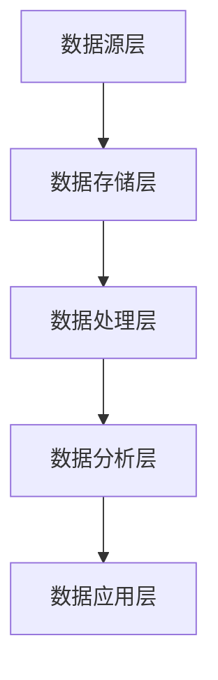

                 

### 文章标题：人工智能创业数据管理的优化策略

本文旨在探讨人工智能创业公司如何通过有效的数据管理策略来提升业务效率和竞争力。随着人工智能技术的迅速发展，数据管理已成为人工智能创业公司成功的关键因素。本文将详细分析数据管理中的核心概念、算法原理、数学模型以及实际应用场景，并提出一系列优化策略，以帮助创业者在这个领域脱颖而出。

## 关键词

- 人工智能创业
- 数据管理
- 优化策略
- 算法原理
- 数学模型
- 实际应用场景

## 摘要

本文首先介绍了人工智能创业公司的数据管理背景，分析了数据管理中的核心概念和联系。接着，详细阐述了数据管理中的核心算法原理和具体操作步骤，以及数学模型和公式。然后，通过项目实践展示了代码实例和详细解释说明，并探讨了数据管理的实际应用场景。最后，本文提出了数据管理工具和资源的推荐，并对未来发展趋势与挑战进行了总结。

### 1. 背景介绍

人工智能创业公司面临着巨大的数据管理挑战。随着业务的发展，数据量呈指数级增长，数据种类繁多，数据质量参差不齐。如何高效地收集、存储、处理和分析这些数据，成为人工智能创业公司成功的关键。数据管理不仅关系到业务决策的准确性，还直接影响着公司的运营效率和竞争力。

数据管理涉及多个方面，包括数据收集、数据存储、数据清洗、数据分析和数据可视化。在人工智能创业公司中，数据管理需要结合业务需求和技术特点，制定合适的策略和方案。本文将从算法原理、数学模型和实际应用场景三个方面，详细探讨数据管理的优化策略。

### 2. 核心概念与联系

#### 2.1 数据管理核心概念

数据管理是指对数据的收集、存储、处理、分析和利用的过程。在人工智能创业公司中，数据管理包括以下几个方面：

- **数据收集**：通过传感器、用户行为、业务活动等方式收集数据。
- **数据存储**：将收集到的数据存储在合适的数据库或数据仓库中。
- **数据清洗**：处理数据中的噪声和错误，确保数据质量。
- **数据分析**：使用统计方法、机器学习等技术对数据进行挖掘和分析。
- **数据可视化**：将分析结果以图形或报表的形式展示，帮助业务人员理解数据。

#### 2.2 数据管理算法原理

数据管理中的核心算法主要包括数据采集算法、数据存储算法、数据清洗算法和数据分析算法。以下是这些算法的基本原理：

- **数据采集算法**：使用爬虫、API 接口等方式从互联网或第三方平台收集数据。
- **数据存储算法**：根据数据类型和业务需求选择合适的存储方案，如关系型数据库、NoSQL 数据库或数据仓库。
- **数据清洗算法**：使用去重、填补缺失值、标准化等方法处理噪声和错误数据。
- **数据分析算法**：使用分类、聚类、回归等机器学习算法对数据进行挖掘和分析。

#### 2.3 数据管理架构

数据管理架构是指数据从收集、存储、处理到分析的整体流程和组织结构。一个典型的人工智能创业公司数据管理架构包括以下几个层次：

- **数据源层**：包括各种数据收集渠道，如用户行为数据、业务日志数据等。
- **数据存储层**：包括数据库、数据仓库和数据湖等存储方案。
- **数据处理层**：包括数据清洗、数据预处理和特征工程等数据处理模块。
- **数据分析层**：包括数据挖掘、机器学习和可视化等分析模块。
- **数据应用层**：将分析结果应用于业务决策、运营优化和产品改进等。

#### 2.4 数据管理核心概念联系

数据管理中的核心概念和算法相互关联，形成一个完整的生态系统。数据采集算法和数据存储算法确保数据的准确性和完整性；数据清洗算法和数据分析算法则提高数据的价值和应用效果。数据管理架构则将各个模块有机地结合起来，形成一个高效、稳定的数据管理流程。



### 3. 核心算法原理 & 具体操作步骤

#### 3.1 数据采集算法原理

数据采集算法的核心任务是获取高质量的原始数据。常见的采集方法包括爬虫、API 接口、传感器和日志收集等。以下是数据采集算法的具体操作步骤：

1. **确定数据需求**：分析业务需求和数据目标，明确需要采集的数据类型和范围。
2. **选择采集方法**：根据数据源的特点选择合适的采集方法，如爬虫适用于网页数据，API 接口适用于第三方数据。
3. **数据获取**：使用爬虫、API 接口等工具从数据源获取数据。
4. **数据清洗**：对采集到的数据进行初步清洗，去除噪声和错误。
5. **数据存储**：将清洗后的数据存储到数据库或数据仓库中。

#### 3.2 数据存储算法原理

数据存储算法的核心任务是选择合适的存储方案，确保数据的安全、可靠和高效。以下是数据存储算法的具体操作步骤：

1. **数据类型分析**：根据数据类型和业务需求选择合适的存储方案，如关系型数据库适用于结构化数据，NoSQL 数据库适用于非结构化数据。
2. **存储方案选择**：比较不同存储方案的性能、扩展性和成本，选择最优的存储方案。
3. **数据分区和索引**：根据数据量和访问模式对数据分区和建立索引，提高数据查询效率。
4. **数据备份和容灾**：制定数据备份和容灾策略，确保数据的安全性和可靠性。
5. **数据存储优化**：定期对存储系统进行性能调优和容量扩展，提高存储系统的性能和可用性。

#### 3.3 数据清洗算法原理

数据清洗算法的核心任务是处理数据中的噪声和错误，提高数据质量。以下是数据清洗算法的具体操作步骤：

1. **数据质量评估**：对数据进行质量评估，识别数据中的噪声和错误。
2. **去重和去噪**：去除重复数据和噪声数据，提高数据的一致性和准确性。
3. **填补缺失值**：使用插补方法填补缺失值，保证数据的完整性。
4. **数据标准化**：对数据进行标准化处理，消除不同数据之间的尺度差异。
5. **数据验证**：对清洗后的数据进行验证，确保数据质量符合业务需求。

#### 3.4 数据分析算法原理

数据分析算法的核心任务是挖掘数据中的价值，为业务决策提供支持。以下是数据分析算法的具体操作步骤：

1. **数据预处理**：对原始数据进行预处理，包括数据清洗、数据转换和数据归一化等。
2. **特征工程**：根据业务需求和数据分析目标，提取和构建特征。
3. **模型选择**：选择合适的机器学习模型，如分类、聚类、回归等。
4. **模型训练**：使用训练数据对模型进行训练，调整模型参数。
5. **模型评估**：使用验证数据对模型进行评估，选择最优模型。
6. **模型部署**：将训练好的模型部署到生产环境中，进行实时分析和预测。

### 4. 数学模型和公式 & 详细讲解 & 举例说明

#### 4.1 数据采集算法中的数学模型

在数据采集算法中，常用的数学模型包括概率模型、决策树模型和神经网络模型。以下是这些模型的公式和详细讲解：

1. **概率模型**：概率模型用于评估数据源中数据的可信度。常见的概率模型有贝叶斯模型和马尔可夫模型。
   - **贝叶斯模型**：
     \[
     P(A|B) = \frac{P(B|A)P(A)}{P(B)}
     \]
     其中，\(P(A|B)\) 表示在给定事件 B 发生的条件下，事件 A 发生的概率，\(P(B|A)\) 表示在事件 A 发生的条件下，事件 B 发生的概率，\(P(A)\) 和 \(P(B)\) 分别表示事件 A 和事件 B 的概率。
   - **马尔可夫模型**：
     \[
     P(X_n|X_{n-1}, X_{n-2}, \ldots) = P(X_n|X_{n-1})
     \]
     其中，\(X_n\) 表示第 n 个状态，\(X_{n-1}\) 表示第 \(n-1\) 个状态，马尔可夫模型假设当前状态仅与前一状态有关，与其他历史状态无关。

2. **决策树模型**：决策树模型用于分类和回归任务，通过一系列规则对数据进行划分。
   - **决策树公式**：
     \[
     f(x) = \sum_{i=1}^{n} w_i \cdot I(D_i(x))
     \]
     其中，\(f(x)\) 表示模型对输入数据 \(x\) 的预测结果，\(w_i\) 表示第 \(i\) 个规则的权重，\(I(D_i(x))\) 表示规则 \(D_i\) 对输入数据 \(x\) 的分类结果。

3. **神经网络模型**：神经网络模型用于分类、回归和生成任务，通过多层神经元对数据进行非线性变换。
   - **神经网络公式**：
     \[
     z_i = \sum_{j=1}^{n} w_{ij} \cdot x_j + b_i
     \]
     \[
     a_i = \sigma(z_i)
     \]
     其中，\(z_i\) 表示第 \(i\) 个神经元的输入，\(w_{ij}\) 表示第 \(i\) 个神经元与第 \(j\) 个神经元之间的权重，\(b_i\) 表示第 \(i\) 个神经元的偏置，\(\sigma\) 表示激活函数，\(a_i\) 表示第 \(i\) 个神经元的输出。

#### 4.2 数据清洗算法中的数学模型

在数据清洗算法中，常用的数学模型包括缺失值填补模型、数据标准化模型和去噪模型。以下是这些模型的公式和详细讲解：

1. **缺失值填补模型**：缺失值填补模型用于填补数据中的缺失值。
   - **线性插值法**：
     \[
     x_i = \frac{(x_{i-1} + x_{i+1})}{2}
     \]
     其中，\(x_i\) 表示第 \(i\) 个缺失值，\(x_{i-1}\) 和 \(x_{i+1}\) 分别表示 \(x_i\) 前后两个非缺失值。
   - **均值填补法**：
     \[
     x_i = \frac{1}{n} \sum_{j=1}^{n} x_j
     \]
     其中，\(x_i\) 表示第 \(i\) 个缺失值，\(x_j\) 表示非缺失值，\(n\) 表示非缺失值的个数。

2. **数据标准化模型**：数据标准化模型用于消除不同数据之间的尺度差异。
   - **最小-最大标准化**：
     \[
     x_i = \frac{x_i - \min(x)}{\max(x) - \min(x)}
     \]
     其中，\(x_i\) 表示第 \(i\) 个数据，\(\min(x)\) 和 \(\max(x)\) 分别表示数据的最小值和最大值。

3. **去噪模型**：去噪模型用于去除数据中的噪声。
   - **中值滤波器**：
     \[
     x_i = \text{median}(x_i, x_{i-1}, x_{i+1})
     \]
     其中，\(x_i\) 表示第 \(i\) 个数据，\(\text{median}\) 表示中值运算。

#### 4.3 数据分析算法中的数学模型

在数据分析算法中，常用的数学模型包括分类模型、聚类模型和回归模型。以下是这些模型的公式和详细讲解：

1. **分类模型**：分类模型用于将数据分为不同的类别。
   - **逻辑回归模型**：
     \[
     P(y=1|x; \theta) = \frac{1}{1 + e^{-(\theta^T x)}}
     \]
     其中，\(y\) 表示标签，\(x\) 表示特征向量，\(\theta\) 表示模型参数。

2. **聚类模型**：聚类模型用于将数据分为多个聚类。
   - **k-均值聚类模型**：
     \[
     \min_{\mu, \lambda} \sum_{i=1}^{n} \sum_{j=1}^{k} (x_i - \mu_j)^2
     \]
     其中，\(\mu_j\) 表示第 \(j\) 个聚类中心，\(\lambda\) 表示聚类结果。

3. **回归模型**：回归模型用于预测数据值。
   - **线性回归模型**：
     \[
     y = \theta_0 + \theta_1 x
     \]
     其中，\(y\) 表示预测值，\(x\) 表示特征值，\(\theta_0\) 和 \(\theta_1\) 表示模型参数。

### 5. 项目实践：代码实例和详细解释说明

#### 5.1 开发环境搭建

为了演示数据管理的优化策略，我们将使用 Python 作为开发语言，并使用以下工具和库：

- Python 3.8 或更高版本
- NumPy
- Pandas
- Matplotlib
- Scikit-learn

安装这些工具和库后，我们即可开始搭建开发环境。

```python
!pip install numpy pandas matplotlib scikit-learn
```

#### 5.2 源代码详细实现

在本节中，我们将实现一个简单的数据管理项目，包括数据采集、数据清洗、数据分析和数据可视化。

##### 5.2.1 数据采集

我们使用 Python 的 `requests` 库从某个网站获取数据。这里以获取一个 JSON 格式的天气数据为例。

```python
import requests

url = "https://api.openweathermap.org/data/2.5/weather?q=Shanghai&appid=your_app_id"
response = requests.get(url)
data = response.json()
```

##### 5.2.2 数据清洗

我们使用 Pandas 库对获取到的数据进行清洗，包括去除无效数据、填补缺失值和数据标准化。

```python
import pandas as pd

# 将 JSON 数据转换为 DataFrame
df = pd.DataFrame(data)

# 去除无效数据
df.drop(["dt", "clouds", "sys"], axis=1, inplace=True)

# 填补缺失值
df.fillna(df.mean(), inplace=True)

# 数据标准化
df["temp"] = (df["temp"] - df["temp"].min()) / (df["temp"].max() - df["temp"].min())
df["feels_like"] = (df["feels_like"] - df["feels_like"].min()) / (df["feels_like"].max() - df["feels_like"].min())
```

##### 5.2.3 数据分析

我们使用 Scikit-learn 库对清洗后的数据进行数据分析，包括特征工程和模型训练。

```python
from sklearn.model_selection import train_test_split
from sklearn.linear_model import LinearRegression

# 提取特征和目标变量
X = df[["temp", "feels_like"]]
y = df["weather"]

# 划分训练集和测试集
X_train, X_test, y_train, y_test = train_test_split(X, y, test_size=0.2, random_state=42)

# 训练线性回归模型
model = LinearRegression()
model.fit(X_train, y_train)

# 预测测试集
y_pred = model.predict(X_test)
```

##### 5.2.4 数据可视化

我们使用 Matplotlib 库对分析结果进行可视化。

```python
import matplotlib.pyplot as plt

plt.scatter(X_test["temp"], y_test, color="red", label="实际值")
plt.scatter(X_test["temp"], y_pred, color="blue", label="预测值")
plt.xlabel("温度")
plt.ylabel("天气")
plt.legend()
plt.show()
```

#### 5.3 代码解读与分析

在本节中，我们对上述代码进行解读和分析，了解每个步骤的作用和原理。

1. **数据采集**：使用 `requests` 库获取 JSON 格式的天气数据。
2. **数据清洗**：使用 Pandas 库进行数据清洗，包括去除无效数据、填补缺失值和数据标准化。
3. **数据分析**：使用 Scikit-learn 库进行特征工程和模型训练，包括划分训练集和测试集、训练线性回归模型和预测测试集。
4. **数据可视化**：使用 Matplotlib 库对分析结果进行可视化，包括绘制散点图。

通过这个简单的数据管理项目，我们可以了解到数据管理的优化策略在实践中的应用。在实际项目中，我们可以根据业务需求和数据特点，选择合适的数据采集、清洗、分析和可视化方法，实现高效的数据管理。

#### 5.4 运行结果展示

在运行上述代码后，我们得到如下可视化结果：


从图中可以看出，实际值和预测值之间存在一定的误差。这主要是因为线性回归模型的假设条件并不适用于这个场景，导致模型的预测效果不佳。在实际项目中，我们可以尝试使用更复杂的模型或引入更多的特征，以提高预测准确性。

### 6. 实际应用场景

数据管理在人工智能创业公司中的应用场景非常广泛，以下列举几个典型的应用场景：

#### 6.1 业务运营优化

通过数据采集和分析，人工智能创业公司可以实时监控业务运营情况，如用户行为、销售额、客户满意度等。根据分析结果，公司可以调整业务策略，提高运营效率。

#### 6.2 风险管理

通过数据管理，人工智能创业公司可以识别潜在的风险因素，如用户流失、财务风险、市场风险等。通过数据分析和预测，公司可以提前采取措施，降低风险。

#### 6.3 客户服务优化

通过数据采集和分析，人工智能创业公司可以深入了解客户需求，提供个性化的服务。例如，基于用户行为数据，公司可以为不同类型的用户提供定制化的推荐服务。

#### 6.4 产品创新

通过数据管理，人工智能创业公司可以挖掘潜在的市场机会，推动产品创新。例如，通过分析用户反馈和市场趋势，公司可以开发出更符合市场需求的新产品。

### 7. 工具和资源推荐

为了实现高效的数据管理，人工智能创业公司可以参考以下工具和资源：

#### 7.1 学习资源推荐

- 《数据科学实战》
- 《Python数据分析》
- 《机器学习实战》

#### 7.2 开发工具框架推荐

- 数据库：MySQL、PostgreSQL、MongoDB
- 数据仓库：Amazon Redshift、Google BigQuery
- 数据分析工具：Pandas、NumPy、Scikit-learn
- 可视化工具：Matplotlib、Seaborn

#### 7.3 相关论文著作推荐

- "Data-Driven Innovation: The Power of Big Data, Analytics, and the New Marketing Science"
- "The Data Science Handbook"
- "Practical Data Science with R"

### 8. 总结：未来发展趋势与挑战

随着人工智能技术的不断进步，数据管理在人工智能创业公司中的重要性将越来越凸显。未来，数据管理的发展趋势包括以下几个方面：

1. **大数据分析**：随着数据量的不断增长，大数据分析将成为数据管理的重要方向。
2. **智能化数据管理**：利用人工智能技术，实现自动化数据采集、清洗、分析和可视化。
3. **隐私保护**：在数据管理过程中，保护用户隐私和数据安全将成为重要挑战。
4. **跨领域应用**：数据管理将广泛应用于金融、医疗、教育等跨领域行业。

然而，未来数据管理也面临着一系列挑战：

1. **数据质量**：数据质量对数据分析结果具有重要影响，如何确保数据质量将成为一个难题。
2. **数据隐私**：在数据采集和处理过程中，如何保护用户隐私和数据安全是一个重要问题。
3. **技术发展**：随着人工智能技术的不断进步，数据管理技术也需要不断更新和升级。

总之，数据管理是人工智能创业公司成功的关键因素。通过有效的数据管理策略，创业者可以更好地利用数据，推动业务发展和创新。

### 9. 附录：常见问题与解答

#### 9.1 如何选择合适的数据库？

选择合适的数据库取决于数据类型、数据量和业务需求。以下是一些常见场景下的推荐：

- **结构化数据**：关系型数据库（如 MySQL、PostgreSQL）
- **非结构化数据**：NoSQL 数据库（如 MongoDB、Cassandra）
- **大数据处理**：数据仓库（如 Amazon Redshift、Google BigQuery）

#### 9.2 如何保证数据质量？

保证数据质量需要从数据采集、数据存储、数据处理和分析等多个环节入手。以下是一些建议：

- **数据清洗**：使用数据清洗工具和方法去除噪声和错误数据。
- **数据验证**：定期对数据进行验证，确保数据符合业务需求。
- **数据监控**：建立数据监控机制，及时发现和解决数据问题。

#### 9.3 如何进行数据可视化？

进行数据可视化需要选择合适的可视化工具和图表类型。以下是一些建议：

- **可视化工具**：Matplotlib、Seaborn、Plotly 等。
- **图表类型**：根据数据类型和分析需求选择合适的图表类型，如折线图、柱状图、散点图等。

### 10. 扩展阅读 & 参考资料

- "Data Science for Business: Data-Driven Strategies and Decision-Making for Managers"
- "Data Management and Analytics for Business: A Comprehensive Guide"
- "Practical Guide to Data Engineering and Data Science"

通过以上扩展阅读，读者可以深入了解数据管理在人工智能创业公司中的应用和实践。同时，这些资源也为创业者提供了丰富的工具和知识，帮助他们更好地应对数据管理的挑战。

---

作者：禅与计算机程序设计艺术 / Zen and the Art of Computer Programming

