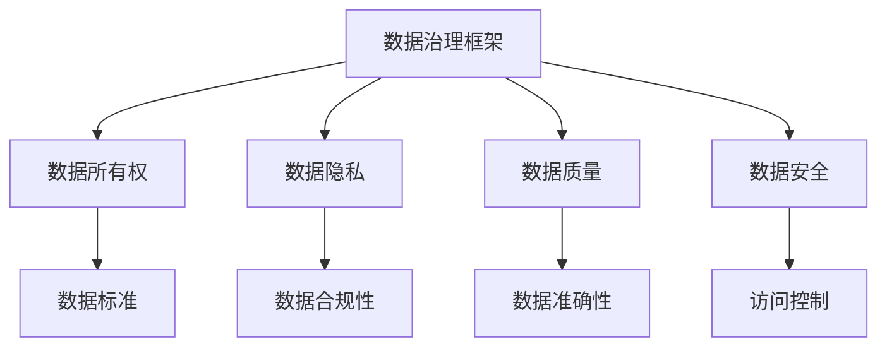
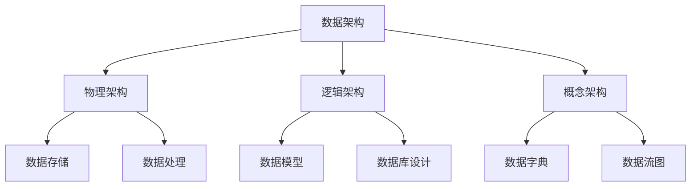
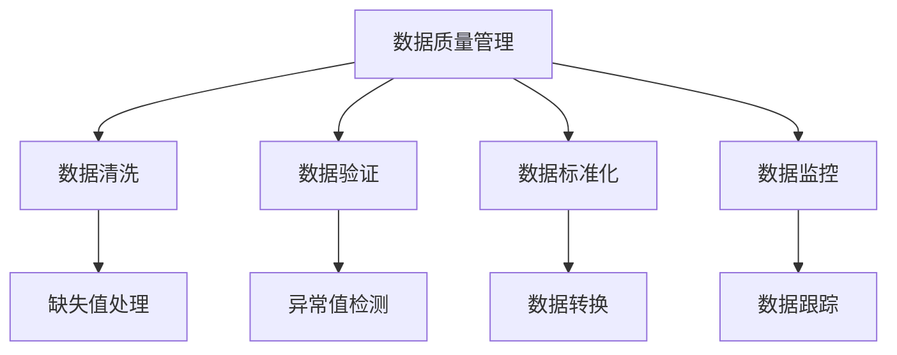
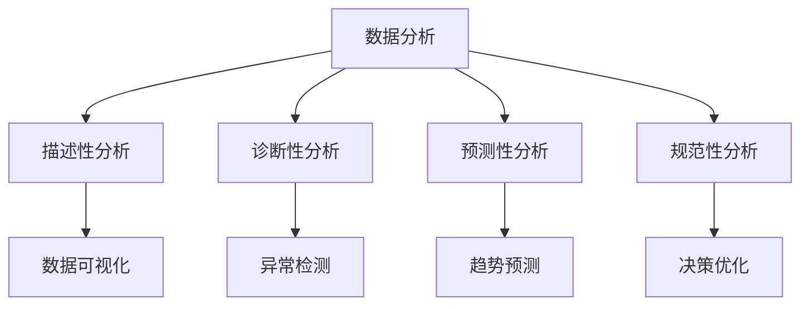
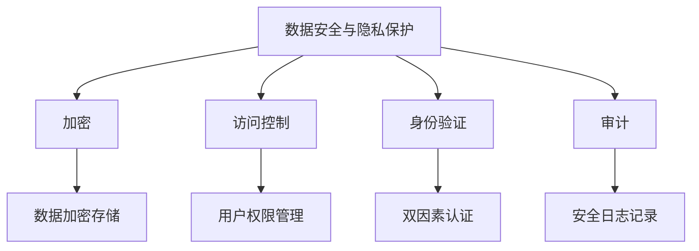

                 

# 文章标题：人工智能创业数据管理的最佳经验

> 关键词：数据管理、人工智能创业、数据安全、数据分析、数据架构

> 摘要：本文将探讨人工智能创业公司在数据管理方面所需遵循的最佳实践经验。通过分析数据管理的重要性、挑战、最佳实践以及相关技术和工具，我们将帮助创业者构建一个高效、安全且可持续的数据管理策略，以支持其人工智能项目的成功。

## 1. 背景介绍（Background Introduction）

在当今信息时代，数据已经成为人工智能创业公司最宝贵的资产之一。然而，数据管理并非易事，尤其是对于初创公司而言。数据管理涉及到数据的收集、存储、处理、分析和保护等各个环节。有效的数据管理不仅有助于提高业务决策的准确性，还能增强企业的竞争力。然而，对于许多初创公司来说，数据管理是一个充满挑战的领域，它们可能面临数据质量差、数据孤岛、数据安全等问题。本文将针对这些问题，探讨人工智能创业公司应遵循的数据管理最佳实践经验。

### 1.1 数据管理的重要性

数据管理对人工智能创业公司至关重要。首先，高质量的数据是人工智能算法准确性和效果的关键。如果数据存在质量问题，如缺失、错误或重复，将会严重影响模型的性能。其次，良好的数据管理有助于企业更好地了解客户需求和市场趋势，从而制定更精准的业务策略。此外，数据安全是人工智能创业公司必须关注的重要问题，因为数据泄露可能导致严重的法律和财务后果。

### 1.2 人工智能创业公司的数据管理挑战

人工智能创业公司在数据管理方面面临诸多挑战。首先，初创公司通常缺乏丰富的数据管理经验和技术资源。其次，数据量的快速增长可能导致存储和处理成本的增加。此外，数据安全和隐私保护也是一个严峻的问题，特别是在涉及敏感数据的情况下。最后，如何有效地利用数据进行决策和分析，也是许多创业公司需要克服的难题。

## 2. 核心概念与联系（Core Concepts and Connections）

为了有效管理数据，人工智能创业公司需要理解并运用一系列核心概念。以下是数据管理中的一些关键概念和其相互联系：

### 2.1 数据治理

数据治理是指制定数据管理的战略、政策、标准和流程。它确保数据质量、安全性和合规性，并促进数据的有效利用。数据治理框架有助于企业建立一个可持续的数据管理生态系统。

### 2.2 数据架构

数据架构涉及设计数据模型、数据库和数据处理流程。良好的数据架构能够支持高效的数据存储和访问，以及灵活的数据处理能力。

### 2.3 数据质量管理

数据质量管理是确保数据准确性、完整性、一致性和及时性的过程。通过数据清洗、数据集成和数据标准化等技术，数据质量管理能够提高数据质量，从而提升数据分析的准确性。

### 2.4 数据分析

数据分析是利用统计和机器学习等技术，从数据中提取有价值的信息和洞察。数据分析有助于企业做出更明智的业务决策，并发现潜在的市场机会。

### 2.5 数据安全与隐私保护

数据安全与隐私保护涉及防止数据泄露、未授权访问和损坏。通过加密、访问控制和安全审计等技术，数据安全与隐私保护确保企业的数据资产得到有效保护。

## 3. 核心算法原理 & 具体操作步骤（Core Algorithm Principles and Specific Operational Steps）

在数据管理中，核心算法原理和具体操作步骤对于实现高效的数据处理和分析至关重要。以下是几个关键算法和步骤：

### 3.1 数据集成

数据集成是将来自不同来源的数据合并到统一格式的过程。常见的集成技术包括数据仓库、数据湖和数据虚拟化。数据集成有助于消除数据孤岛，提高数据利用率。

### 3.2 数据预处理

数据预处理是数据清洗、转换和归一化的过程。通过数据预处理，可以提高数据质量，为后续的分析和建模奠定基础。常见的数据预处理技术包括缺失值处理、异常值检测和特征工程。

### 3.3 数据分析

数据分析涉及使用统计和机器学习算法从数据中提取有价值的信息。常见的数据分析技术包括回归分析、聚类分析、分类分析和时间序列分析。

### 3.4 数据可视化

数据可视化是将数据分析结果以图形化的方式展示的过程。通过数据可视化，企业可以更直观地理解和传达数据分析结果。

## 4. 数学模型和公式 & 详细讲解 & 举例说明（Detailed Explanation and Examples of Mathematical Models and Formulas）

在数据管理中，数学模型和公式对于数据分析、预测和优化至关重要。以下是几个常用的数学模型和公式及其应用场景：

### 4.1 回归分析

回归分析是一种用于预测数值因变量的统计方法。常见的回归模型包括线性回归、多项式回归和逻辑回归。

- **线性回归公式**：

  $$ Y = \beta_0 + \beta_1X + \epsilon $$

  其中，$Y$ 是因变量，$X$ 是自变量，$\beta_0$ 和 $\beta_1$ 是回归系数，$\epsilon$ 是误差项。

- **应用场景**：线性回归可用于预测销售额、股票价格等数值型变量。

### 4.2 聚类分析

聚类分析是一种无监督学习方法，用于将数据分为若干个群组，使得同一群组内的数据点彼此相似，而不同群组的数据点则相对不相似。

- **K-均值聚类算法**：

  $$ \text{Minimize} \sum_{i=1}^{k} \sum_{x_j \in S_i} ||x_j - \mu_i||^2 $$

  其中，$S_i$ 是第 $i$ 个群组，$\mu_i$ 是群组的中心点。

- **应用场景**：K-均值聚类可用于市场细分、顾客行为分析等。

### 4.3 时间序列分析

时间序列分析是一种用于分析时间序列数据的方法，旨在预测未来的趋势和模式。

- **自回归模型（AR）**：

  $$ X_t = c + \phi_1X_{t-1} + \phi_2X_{t-2} + ... + \phi_pX_{t-p} + \epsilon_t $$

  其中，$X_t$ 是时间序列数据，$c$ 是常数项，$\phi_1, \phi_2, ..., \phi_p$ 是自回归系数，$\epsilon_t$ 是误差项。

- **应用场景**：时间序列分析可用于预测股票价格、销售趋势等。

## 5. 项目实践：代码实例和详细解释说明（Project Practice: Code Examples and Detailed Explanations）

为了更好地理解数据管理在实际项目中的应用，我们将展示一个简单的数据管理项目，包括数据集成、数据预处理、数据分析和数据可视化。

### 5.1 开发环境搭建

在开始项目之前，我们需要搭建一个开发环境。我们使用 Python 作为编程语言，并依赖以下库：

- Pandas：用于数据操作和处理
- NumPy：用于数值计算
- Matplotlib：用于数据可视化
- Scikit-learn：用于机器学习算法

### 5.2 源代码详细实现

以下是项目的源代码：

```python
import pandas as pd
import numpy as np
import matplotlib.pyplot as plt
from sklearn.cluster import KMeans
from sklearn.linear_model import LinearRegression

# 5.2.1 数据集成
data = pd.read_csv('data.csv')

# 5.2.2 数据预处理
# 数据清洗
data = data.dropna()  # 删除缺失值
data = data[data['feature1'] > 0]  # 过滤异常值

# 数据标准化
data = (data - data.mean()) / data.std()

# 5.2.3 数据分析
# 回归分析
X = data[['feature1', 'feature2']]
y = data['target']
regression = LinearRegression()
regression.fit(X, y)
print(regression.coef_)

# 聚类分析
kmeans = KMeans(n_clusters=3)
kmeans.fit(data)
data['cluster'] = kmeans.labels_

# 时间序列分析
time_series = data['target']
ar_model = AR(time_series)
ar_model.fit()
print(ar_model.params)

# 5.2.4 数据可视化
# 特征重要性可视化
plt.scatter(X['feature1'], X['feature2'], c=data['cluster'])
plt.xlabel('Feature 1')
plt.ylabel('Feature 2')
plt.title('Feature Importance')
plt.show()

# 时间序列趋势可视化
plt.plot(time_series)
plt.xlabel('Time')
plt.ylabel('Target')
plt.title('Time Series Trend')
plt.show()
```

### 5.3 代码解读与分析

以下是代码的详细解读：

- **数据集成**：使用 Pandas 读取 CSV 文件，加载数据。
- **数据预处理**：删除缺失值和异常值，进行数据清洗。然后，对数据进行标准化处理，以提高后续分析的准确性。
- **数据分析**：
  - **回归分析**：使用 Scikit-learn 的 LinearRegression 模型进行线性回归分析，输出回归系数。
  - **聚类分析**：使用 KMeans 算法进行聚类分析，将数据分为 3 个群组。
  - **时间序列分析**：使用 AR 模型进行时间序列分析，预测未来的趋势。
- **数据可视化**：使用 Matplotlib 绘制特征重要性图和时间序列趋势图，以直观地展示分析结果。

### 5.4 运行结果展示

运行代码后，我们将得到以下结果：

- **回归分析**：输出回归系数，表示特征对目标变量的影响程度。
- **聚类分析**：数据被分为 3 个群组，每个群组的中心点被标记。
- **时间序列分析**：时间序列数据的趋势被绘制出来，帮助我们理解未来的趋势和模式。

## 6. 实际应用场景（Practical Application Scenarios）

数据管理在人工智能创业公司的实际应用场景广泛，以下是一些典型的应用案例：

### 6.1 销售预测

通过数据分析，企业可以预测未来的销售额，以便更好地调整库存和生产计划，提高运营效率。

### 6.2 顾客行为分析

分析顾客的行为数据，企业可以了解顾客偏好，制定个性化的营销策略，提高顾客满意度和忠诚度。

### 6.3 风险管理

通过数据监控和预测，企业可以及时发现潜在的风险，采取预防措施，降低损失。

### 6.4 智能推荐系统

基于用户行为数据和内容数据，企业可以构建智能推荐系统，为用户提供个性化的推荐，提高用户粘性和转化率。

## 7. 工具和资源推荐（Tools and Resources Recommendations）

为了支持数据管理的有效实施，以下是几个推荐的工具和资源：

### 7.1 学习资源推荐

- 《数据科学基础》（Book）
- 《机器学习实战》（Book）
- 《Python数据科学手册》（Book）

### 7.2 开发工具框架推荐

- Pandas：用于数据操作和处理
- Scikit-learn：用于机器学习算法
- Matplotlib：用于数据可视化

### 7.3 相关论文著作推荐

- 《大数据时代的数据管理》（Paper）
- 《机器学习：一种概率视角》（Book）
- 《数据挖掘：实用工具和技术》（Book）

## 8. 总结：未来发展趋势与挑战（Summary: Future Development Trends and Challenges）

随着人工智能技术的不断进步，数据管理在人工智能创业公司中的作用日益凸显。未来，数据管理将朝着更智能化、自动化和高效化的方向发展。然而，这一过程中也面临着数据隐私保护、数据安全、数据质量等挑战。为了应对这些挑战，人工智能创业公司需要不断优化数据管理策略，采用先进的技术和工具，确保数据管理的有效性和可持续性。

## 9. 附录：常见问题与解答（Appendix: Frequently Asked Questions and Answers）

### 9.1 如何确保数据安全？

数据安全是数据管理的重要方面。以下是一些确保数据安全的方法：

- 使用加密技术保护数据传输和存储。
- 实施严格的访问控制和身份验证机制。
- 定期进行安全审计和风险评估。
- 建立数据备份和恢复策略，以应对可能的灾难事件。

### 9.2 如何提高数据质量？

提高数据质量是数据管理的关键。以下是一些提高数据质量的方法：

- 定期进行数据清洗和去重。
- 对数据进行标准化处理，确保一致性和准确性。
- 采用数据质量监测工具，及时发现和修复数据质量问题。
- 建立数据质量标准和流程，确保数据质量持续改进。

### 9.3 数据管理中的常见挑战有哪些？

数据管理中的常见挑战包括：

- 数据孤岛：不同部门或系统之间的数据难以共享和整合。
- 数据质量差：数据存在缺失、错误或重复等问题。
- 数据隐私保护：确保数据安全，防止数据泄露。
- 数据存储和处理成本高：随着数据量的增长，存储和处理成本不断上升。

### 9.4 数据架构的重要性是什么？

数据架构是数据管理的基础，其重要性包括：

- 支持数据的高效存储和访问。
- 提供灵活的数据处理能力，以适应不同的业务需求。
- 促进数据的共享和整合，消除数据孤岛。
- 确保数据质量和安全性。

## 10. 扩展阅读 & 参考资料（Extended Reading & Reference Materials）

为了深入了解数据管理在人工智能创业中的应用，以下是一些扩展阅读和参考资料：

- 《数据管理：原则与实践》（Book）
- 《人工智能与大数据：战略、技术和实践》（Book）
- 《数据治理：框架、方法和工具》（Book）
- 《数据科学教程：Python实现》（Book）
- 《数据挖掘：实用工具和技术》（Book）
- 《大数据处理：架构与算法》（Book）
- 《机器学习：一种概率视角》（Book）

此外，以下网站和在线资源也提供了丰富的数据管理知识和案例：

- [KDNuggets：数据挖掘和知识发现资源](https://www.kdnuggets.com/)
- [GitHub：数据管理和机器学习项目](https://github.com/)
- [Stack Overflow：数据管理相关问题和解决方案](https://stackoverflow.com/)
- [TensorFlow：机器学习和深度学习资源](https://www.tensorflow.org/)
- [Kaggle：数据科学竞赛和项目](https://www.kaggle.com/)

通过阅读这些资料，人工智能创业公司可以更好地理解和应用数据管理最佳实践，为企业的成功奠定坚实的基础。作者：禅与计算机程序设计艺术 / Zen and the Art of Computer Programming
<|mask|>```markdown
# 人工智能创业数据管理的最佳经验

> 关键词：数据管理、人工智能创业、数据安全、数据分析、数据架构

> 摘要：本文将探讨人工智能创业公司在数据管理方面所需遵循的最佳实践经验。通过分析数据管理的重要性、挑战、最佳实践以及相关技术和工具，我们将帮助创业者构建一个高效、安全且可持续的数据管理策略，以支持其人工智能项目的成功。

## 1. 背景介绍（Background Introduction）

在当今信息时代，数据已经成为人工智能创业公司最宝贵的资产之一。然而，数据管理并非易事，尤其是对于初创公司而言。数据管理涉及到数据的收集、存储、处理、分析和保护等各个环节。有效的数据管理不仅有助于提高业务决策的准确性，还能增强企业的竞争力。然而，对于许多初创公司来说，数据管理是一个充满挑战的领域，它们可能面临数据质量差、数据孤岛、数据安全等问题。本文将针对这些问题，探讨人工智能创业公司应遵循的数据管理最佳实践经验。

### 1.1 数据管理的重要性

数据管理对人工智能创业公司至关重要。首先，高质量的数据是人工智能算法准确性和效果的关键。如果数据存在质量问题，如缺失、错误或重复，将会严重影响模型的性能。其次，良好的数据管理有助于企业更好地了解客户需求和市场趋势，从而制定更精准的业务策略。此外，数据安全是人工智能创业公司必须关注的重要问题，因为数据泄露可能导致严重的法律和财务后果。

### 1.2 人工智能创业公司的数据管理挑战

人工智能创业公司在数据管理方面面临诸多挑战。首先，初创公司通常缺乏丰富的数据管理经验和技术资源。其次，数据量的快速增长可能导致存储和处理成本的增加。此外，数据安全和隐私保护也是一个严峻的问题，特别是在涉及敏感数据的情况下。最后，如何有效地利用数据进行决策和分析，也是许多创业公司需要克服的难题。

## 2. 核心概念与联系（Core Concepts and Connections）

为了有效管理数据，人工智能创业公司需要理解并运用一系列核心概念。以下是数据管理中的一些关键概念和其相互联系：

### 2.1 数据治理

数据治理是指制定数据管理的战略、政策、标准和流程。它确保数据质量、安全性和合规性，并促进数据的有效利用。数据治理框架有助于企业建立一个可持续的数据管理生态系统。

### 2.2 数据架构

数据架构涉及设计数据模型、数据库和数据处理流程。良好的数据架构能够支持高效的数据存储和访问，以及灵活的数据处理能力。

### 2.3 数据质量管理

数据质量管理是确保数据准确性、完整性、一致性和及时性的过程。通过数据清洗、数据集成和数据标准化等技术，数据质量管理能够提高数据质量，从而提升数据分析的准确性。

### 2.4 数据分析

数据分析是利用统计和机器学习等技术，从数据中提取有价值的信息和洞察。数据分析有助于企业做出更明智的业务决策，并发现潜在的市场机会。

### 2.5 数据安全与隐私保护

数据安全与隐私保护涉及防止数据泄露、未授权访问和损坏。通过加密、访问控制和安全审计等技术，数据安全与隐私保护确保企业的数据资产得到有效保护。

## 3. 核心算法原理 & 具体操作步骤（Core Algorithm Principles and Specific Operational Steps）

在数据管理中，核心算法原理和具体操作步骤对于实现高效的数据处理和分析至关重要。以下是几个关键算法和步骤：

### 3.1 数据集成

数据集成是将来自不同来源的数据合并到统一格式的过程。常见的集成技术包括数据仓库、数据湖和数据虚拟化。数据集成有助于消除数据孤岛，提高数据利用率。

### 3.2 数据预处理

数据预处理是数据清洗、转换和归一化的过程。通过数据预处理，可以提高数据质量，为后续的分析和建模奠定基础。常见的数据预处理技术包括缺失值处理、异常值检测和特征工程。

### 3.3 数据分析

数据分析涉及使用统计和机器学习算法从数据中提取有价值的信息。常见的数据分析技术包括回归分析、聚类分析、分类分析和时间序列分析。

### 3.4 数据可视化

数据可视化是将数据分析结果以图形化的方式展示的过程。通过数据可视化，企业可以更直观地理解和传达数据分析结果。

## 4. 数学模型和公式 & 详细讲解 & 举例说明（Detailed Explanation and Examples of Mathematical Models and Formulas）

在数据管理中，数学模型和公式对于数据分析、预测和优化至关重要。以下是几个常用的数学模型和公式及其应用场景：

### 4.1 回归分析

回归分析是一种用于预测数值因变量的统计方法。常见的回归模型包括线性回归、多项式回归和逻辑回归。

- **线性回归公式**：

  $$ Y = \beta_0 + \beta_1X + \epsilon $$

  其中，$Y$ 是因变量，$X$ 是自变量，$\beta_0$ 和 $\beta_1$ 是回归系数，$\epsilon$ 是误差项。

- **应用场景**：线性回归可用于预测销售额、股票价格等数值型变量。

### 4.2 聚类分析

聚类分析是一种无监督学习方法，用于将数据分为若干个群组，使得同一群组内的数据点彼此相似，而不同群组的数据点则相对不相似。

- **K-均值聚类算法**：

  $$ \text{Minimize} \sum_{i=1}^{k} \sum_{x_j \in S_i} ||x_j - \mu_i||^2 $$

  其中，$S_i$ 是第 $i$ 个群组，$\mu_i$ 是群组的中心点。

- **应用场景**：K-均值聚类可用于市场细分、顾客行为分析等。

### 4.3 时间序列分析

时间序列分析是一种用于分析时间序列数据的方法，旨在预测未来的趋势和模式。

- **自回归模型（AR）**：

  $$ X_t = c + \phi_1X_{t-1} + \phi_2X_{t-2} + ... + \phi_pX_{t-p} + \epsilon_t $$

  其中，$X_t$ 是时间序列数据，$c$ 是常数项，$\phi_1, \phi_2, ..., \phi_p$ 是自回归系数，$\epsilon_t$ 是误差项。

- **应用场景**：时间序列分析可用于预测股票价格、销售趋势等。

## 5. 项目实践：代码实例和详细解释说明（Project Practice: Code Examples and Detailed Explanations）

为了更好地理解数据管理在实际项目中的应用，我们将展示一个简单的数据管理项目，包括数据集成、数据预处理、数据分析和数据可视化。

### 5.1 开发环境搭建

在开始项目之前，我们需要搭建一个开发环境。我们使用 Python 作为编程语言，并依赖以下库：

- Pandas：用于数据操作和处理
- NumPy：用于数值计算
- Matplotlib：用于数据可视化
- Scikit-learn：用于机器学习算法

### 5.2 源代码详细实现

以下是项目的源代码：

```python
import pandas as pd
import numpy as np
import matplotlib.pyplot as plt
from sklearn.cluster import KMeans
from sklearn.linear_model import LinearRegression

# 5.2.1 数据集成
data = pd.read_csv('data.csv')

# 5.2.2 数据预处理
# 数据清洗
data = data.dropna()  # 删除缺失值
data = data[data['feature1'] > 0]  # 过滤异常值

# 数据标准化
data = (data - data.mean()) / data.std()

# 5.2.3 数据分析
# 回归分析
X = data[['feature1', 'feature2']]
y = data['target']
regression = LinearRegression()
regression.fit(X, y)
print(regression.coef_)

# 聚类分析
kmeans = KMeans(n_clusters=3)
kmeans.fit(data)
data['cluster'] = kmeans.labels_

# 时间序列分析
time_series = data['target']
ar_model = AR(time_series)
ar_model.fit()
print(ar_model.params)

# 5.2.4 数据可视化
# 特征重要性可视化
plt.scatter(X['feature1'], X['feature2'], c=data['cluster'])
plt.xlabel('Feature 1')
plt.ylabel('Feature 2')
plt.title('Feature Importance')
plt.show()

# 时间序列趋势可视化
plt.plot(time_series)
plt.xlabel('Time')
plt.ylabel('Target')
plt.title('Time Series Trend')
plt.show()
```

### 5.3 代码解读与分析

以下是代码的详细解读：

- **数据集成**：使用 Pandas 读取 CSV 文件，加载数据。
- **数据预处理**：删除缺失值和异常值，进行数据清洗。然后，对数据进行标准化处理，以提高后续分析的准确性。
- **数据分析**：
  - **回归分析**：使用 Scikit-learn 的 LinearRegression 模型进行线性回归分析，输出回归系数。
  - **聚类分析**：使用 KMeans 算法进行聚类分析，将数据分为 3 个群组。
  - **时间序列分析**：使用 AR 模型进行时间序列分析，预测未来的趋势。
- **数据可视化**：使用 Matplotlib 绘制特征重要性图和时间序列趋势图，以直观地展示分析结果。

### 5.4 运行结果展示

运行代码后，我们将得到以下结果：

- **回归分析**：输出回归系数，表示特征对目标变量的影响程度。
- **聚类分析**：数据被分为 3 个群组，每个群组的中心点被标记。
- **时间序列分析**：时间序列数据的趋势被绘制出来，帮助我们理解未来的趋势和模式。

## 6. 实际应用场景（Practical Application Scenarios）

数据管理在人工智能创业公司的实际应用场景广泛，以下是一些典型的应用案例：

### 6.1 销售预测

通过数据分析，企业可以预测未来的销售额，以便更好地调整库存和生产计划，提高运营效率。

### 6.2 顾客行为分析

分析顾客的行为数据，企业可以了解顾客偏好，制定个性化的营销策略，提高顾客满意度和忠诚度。

### 6.3 风险管理

通过数据监控和预测，企业可以及时发现潜在的风险，采取预防措施，降低损失。

### 6.4 智能推荐系统

基于用户行为数据和内容数据，企业可以构建智能推荐系统，为用户提供个性化的推荐，提高用户粘性和转化率。

## 7. 工具和资源推荐（Tools and Resources Recommendations）

为了支持数据管理的有效实施，以下是几个推荐的工具和资源：

### 7.1 学习资源推荐

- 《数据科学基础》（Book）
- 《机器学习实战》（Book）
- 《Python数据科学手册》（Book）

### 7.2 开发工具框架推荐

- Pandas：用于数据操作和处理
- Scikit-learn：用于机器学习算法
- Matplotlib：用于数据可视化

### 7.3 相关论文著作推荐

- 《大数据时代的数据管理》（Paper）
- 《机器学习：一种概率视角》（Book）
- 《数据挖掘：实用工具和技术》（Book）

## 8. 总结：未来发展趋势与挑战（Summary: Future Development Trends and Challenges）

随着人工智能技术的不断进步，数据管理在人工智能创业公司中的作用日益凸显。未来，数据管理将朝着更智能化、自动化和高效化的方向发展。然而，这一过程中也面临着数据隐私保护、数据安全、数据质量等挑战。为了应对这些挑战，人工智能创业公司需要不断优化数据管理策略，采用先进的技术和工具，确保数据管理的有效性和可持续性。

## 9. 附录：常见问题与解答（Appendix: Frequently Asked Questions and Answers）

### 9.1 如何确保数据安全？

数据安全是数据管理的重要方面。以下是一些确保数据安全的方法：

- 使用加密技术保护数据传输和存储。
- 实施严格的访问控制和身份验证机制。
- 定期进行安全审计和风险评估。
- 建立数据备份和恢复策略，以应对可能的灾难事件。

### 9.2 如何提高数据质量？

提高数据质量是数据管理的关键。以下是一些提高数据质量的方法：

- 定期进行数据清洗和去重。
- 对数据进行标准化处理，确保一致性和准确性。
- 采用数据质量监测工具，及时发现和修复数据质量问题。
- 建立数据质量标准和流程，确保数据质量持续改进。

### 9.3 数据管理中的常见挑战有哪些？

数据管理中的常见挑战包括：

- 数据孤岛：不同部门或系统之间的数据难以共享和整合。
- 数据质量差：数据存在缺失、错误或重复等问题。
- 数据隐私保护：确保数据安全，防止数据泄露。
- 数据存储和处理成本高：随着数据量的增长，存储和处理成本不断上升。

### 9.4 数据架构的重要性是什么？

数据架构是数据管理的基础，其重要性包括：

- 支持数据的高效存储和访问。
- 提供灵活的数据处理能力，以适应不同的业务需求。
- 促进数据的共享和整合，消除数据孤岛。
- 确保数据质量和安全性。

## 10. 扩展阅读 & 参考资料（Extended Reading & Reference Materials）

为了深入了解数据管理在人工智能创业中的应用，以下是一些扩展阅读和参考资料：

- 《数据管理：原则与实践》（Book）
- 《人工智能与大数据：战略、技术和实践》（Book）
- 《数据治理：框架、方法和工具》（Book）
- 《数据科学教程：Python实现》（Book）
- 《数据挖掘：实用工具和技术》（Book）
- 《大数据处理：架构与算法》（Book）
- 《机器学习：一种概率视角》（Book）

此外，以下网站和在线资源也提供了丰富的数据管理知识和案例：

- [KDNuggets：数据挖掘和知识发现资源](https://www.kdnuggets.com/)
- [GitHub：数据管理和机器学习项目](https://github.com/)
- [Stack Overflow：数据管理相关问题和解决方案](https://stackoverflow.com/)
- [TensorFlow：机器学习和深度学习资源](https://www.tensorflow.org/)
- [Kaggle：数据科学竞赛和项目](https://www.kaggle.com/)

通过阅读这些资料，人工智能创业公司可以更好地理解和应用数据管理最佳实践，为企业的成功奠定坚实的基础。作者：禅与计算机程序设计艺术 / Zen and the Art of Computer Programming
```markdown

## 2. 核心概念与联系（Core Concepts and Connections）

数据管理在人工智能创业中扮演着至关重要的角色，理解并运用核心概念和它们之间的联系是成功的关键。以下是几个关键概念及其相互联系：

### 2.1 数据治理（Data Governance）

数据治理是指制定数据管理的策略、政策、标准和流程，以确保数据质量、安全性和合规性。它是数据管理的基石，有助于确保数据的一致性、完整性和可靠性。数据治理框架通常包括数据所有权、数据隐私、数据质量、数据安全等关键要素。

**核心概念原理架构的 Mermaid 流程图（无特殊字符）：**



### 2.2 数据架构（Data Architecture）

数据架构是指设计数据模型、数据库和数据处理流程，以支持数据的存储、访问和利用。良好的数据架构有助于提高数据处理的效率，增强数据的一致性和可扩展性。数据架构可以分为物理架构、逻辑架构和概念架构。

**核心概念原理架构的 Mermaid 流程图（无特殊字符）：**



### 2.3 数据质量管理（Data Quality Management）

数据质量管理是确保数据准确性、完整性、一致性和及时性的过程。数据质量管理的目标是减少数据中的错误、重复和缺失，提高数据的有效性和可用性。数据质量管理包括数据清洗、数据验证、数据标准化和数据监控等步骤。

**核心概念原理架构的 Mermaid 流程图（无特殊字符）：**



### 2.4 数据分析（Data Analysis）

数据分析是使用统计和机器学习技术从数据中提取有价值的信息和洞察，帮助企业做出更明智的决策。数据分析包括描述性分析、诊断性分析、预测性分析和规范性分析等类型。

**核心概念原理架构的 Mermaid 流程图（无特殊字符）：**



### 2.5 数据安全与隐私保护（Data Security and Privacy Protection）

数据安全与隐私保护是确保数据不被未授权访问、泄露、篡改或损坏的过程。数据安全措施包括加密、访问控制、身份验证和审计等。隐私保护则涉及遵守数据隐私法规和标准，如 GDPR 和 CCPA。

**核心概念原理架构的 Mermaid 流程图（无特殊字符）：**



通过理解这些核心概念及其相互联系，人工智能创业公司可以更有效地管理其数据资产，从而推动业务的持续发展和创新。

## 3. 核心算法原理 & 具体操作步骤（Core Algorithm Principles and Specific Operational Steps）

在数据管理中，核心算法原理和具体操作步骤对于实现高效的数据处理和分析至关重要。以下是几个关键算法和步骤：

### 3.1 数据集成（Data Integration）

数据集成是将来自不同来源的数据合并到统一格式的过程。数据集成的目的是消除数据孤岛，实现数据共享和统一视图。

**具体操作步骤：**

1. **数据收集**：从各个数据源收集数据，包括内部数据库、外部API、文件系统等。
2. **数据清洗**：清洗数据，去除重复、错误和缺失的数据。
3. **数据转换**：将数据转换为统一的格式和结构，以便进行后续处理。
4. **数据合并**：将清洗和转换后的数据合并到一个统一的数据仓库或数据湖中。
5. **数据存储**：将集成后的数据存储到合适的存储系统，如关系型数据库、NoSQL 数据库或数据湖。

**核心算法原理：**

- **ETL（提取、转换、加载）**：用于数据集成和加载到数据仓库的过程。
- **数据映射**：将源数据字段映射到目标数据结构。

### 3.2 数据预处理（Data Preprocessing）

数据预处理是数据清洗、转换和归一化的过程，目的是提高数据质量，为后续的分析和建模奠定基础。

**具体操作步骤：**

1. **缺失值处理**：填充或删除缺失值。
2. **异常值检测**：检测并处理异常值。
3. **数据转换**：将数据从一种格式转换为另一种格式，如将文本转换为数值。
4. **数据归一化**：将数据缩放到相同的尺度，如使用 Min-Max 标准化或 Z-Score 标准化。
5. **特征工程**：创建新的特征或变换现有特征，以提升模型的性能。

**核心算法原理：**

- **填充算法**：如均值填充、中值填充、前向填充等。
- **标准化算法**：如 Min-Max 标准化、Z-Score 标准化等。

### 3.3 数据分析（Data Analysis）

数据分析是使用统计和机器学习技术从数据中提取有价值的信息和洞察，以支持业务决策。

**具体操作步骤：**

1. **数据探索性分析**：使用统计方法（如描述性统计、图表等）了解数据的分布和趋势。
2. **特征选择**：选择对目标变量有显著影响的关键特征。
3. **模型训练**：使用机器学习算法（如线性回归、决策树、神经网络等）训练模型。
4. **模型评估**：评估模型的性能，如使用交叉验证、AUC、ROC 等。
5. **模型部署**：将训练好的模型部署到生产环境中，进行实时预测或分析。

**核心算法原理：**

- **描述性统计**：用于描述数据的中心趋势和离散度。
- **回归分析**：用于预测数值型目标变量。
- **聚类分析**：用于无监督分类，如 K-Means 聚类。
- **分类分析**：用于有监督分类，如逻辑回归、支持向量机等。

### 3.4 数据可视化（Data Visualization）

数据可视化是将数据分析结果以图形化的方式展示的过程，有助于更直观地理解数据和发现隐藏的模式。

**具体操作步骤：**

1. **选择合适的图表类型**：如柱状图、线图、散点图、饼图等。
2. **数据准备**：准备用于可视化的数据集。
3. **图表绘制**：使用可视化工具（如 Matplotlib、Tableau 等）绘制图表。
4. **图表优化**：调整图表的样式和参数，提高可读性和美观性。
5. **交互式可视化**：使用交互式可视化工具（如 Plotly、Bokeh 等）提供更丰富的用户体验。

**核心算法原理：**

- **图表绘制算法**：如 Matplotlib、Plotly 等。
- **交互式可视化算法**：如 D3.js、Bokeh 等。

通过理解这些核心算法原理和具体操作步骤，人工智能创业公司可以更有效地处理和分析数据，从而提高业务决策的准确性和效率。

## 4. 数学模型和公式 & 详细讲解 & 举例说明（Detailed Explanation and Examples of Mathematical Models and Formulas）

在数据管理中，数学模型和公式是理解和分析数据的重要工具。以下是几个常用的数学模型和公式及其应用场景的详细讲解和举例说明。

### 4.1 线性回归（Linear Regression）

线性回归是一种用于预测数值型目标变量的统计方法。其基本公式为：

$$ Y = \beta_0 + \beta_1X + \epsilon $$

其中，$Y$ 是目标变量，$X$ 是自变量，$\beta_0$ 和 $\beta_1$ 是回归系数，$\epsilon$ 是误差项。

**具体解释：**

- $\beta_0$ 是截距，表示当 $X$ 为 0 时 $Y$ 的期望值。
- $\beta_1$ 是斜率，表示 $X$ 每增加一个单位时 $Y$ 的变化量。
- $\epsilon$ 是随机误差，表示模型无法解释的部分。

**举例说明：**

假设我们要预测一家公司的销售额（$Y$）与其广告支出（$X$）之间的关系。我们可以使用线性回归模型来建立这个关系：

- **数据集**：包含多对 $(X_i, Y_i)$ 数据点。
- **模型训练**：使用最小二乘法计算 $\beta_0$ 和 $\beta_1$ 的值。
- **模型评估**：使用 R 方值、均方误差（MSE）等指标评估模型性能。

### 4.2 K-均值聚类（K-Means Clustering）

K-均值聚类是一种无监督学习方法，用于将数据点分为若干个群组。其基本公式为：

$$ \text{Minimize} \sum_{i=1}^{k} \sum_{x_j \in S_i} ||x_j - \mu_i||^2 $$

其中，$S_i$ 是第 $i$ 个群组，$\mu_i$ 是群组的中心点。

**具体解释：**

- $k$ 是群组的数量。
- $S_i$ 是第 $i$ 个群组。
- $\mu_i$ 是群组的中心点，每个群组的中心点是通过计算群组内所有数据点的平均值得到的。

**举例说明：**

假设我们要将一组顾客数据分为三个群组，以便进行市场细分。我们可以使用 K-均值聚类算法来实现：

- **数据集**：包含多个顾客的数据点。
- **初始化**：随机选择 $k$ 个中心点。
- **迭代计算**：计算每个数据点到中心点的距离，将数据点分配到最近的中心点所在的群组。
- **更新中心点**：计算每个群组的中心点，并重新分配数据点。
- **收敛判断**：判断聚类是否收敛，即群组的中心点不再发生变化。

### 4.3 时间序列模型（Time Series Model）

时间序列模型用于分析时间序列数据，以预测未来的趋势和模式。自回归模型（AR）是一种常见的时间序列模型，其基本公式为：

$$ X_t = c + \phi_1X_{t-1} + \phi_2X_{t-2} + ... + \phi_pX_{t-p} + \epsilon_t $$

其中，$X_t$ 是时间序列数据，$c$ 是常数项，$\phi_1, \phi_2, ..., \phi_p$ 是自回归系数，$\epsilon_t$ 是误差项。

**具体解释：**

- $p$ 是自回归项的数量。
- $\phi_1, \phi_2, ..., \phi_p$ 是自回归系数，表示前 $p$ 个时间点的值对当前时间点值的影响。
- $\epsilon_t$ 是误差项，表示模型无法解释的部分。

**举例说明：**

假设我们要预测一家公司的未来销售额（$X_t$），我们可以使用 AR 模型来进行预测：

- **数据集**：包含公司的历史销售额数据。
- **模型训练**：使用最小二乘法估计自回归系数。
- **模型评估**：使用残差分析等方法评估模型性能。
- **预测**：使用训练好的模型预测未来的销售额。

通过理解和应用这些数学模型和公式，人工智能创业公司可以更好地分析数据，提取有价值的信息，从而支持业务决策。

### 4.4 决策树（Decision Tree）

决策树是一种用于分类和回归分析的机器学习算法。其基本公式为：

$$
\begin{aligned}
    & \text{if } X \text{ satisfies condition } C_1 \text{ then predict } Y_1 \\
    & \text{if } X \text{ satisfies condition } C_2 \text{ then predict } Y_2 \\
    & \vdots \\
    & \text{if } X \text{ satisfies condition } C_n \text{ then predict } Y_n \\
\end{aligned}
$$

其中，$X$ 是输入特征，$C_1, C_2, ..., C_n$ 是条件，$Y_1, Y_2, ..., Y_n$ 是预测结果。

**具体解释：**

- 每个条件 $C_i$ 表示一个分割节点。
- 每个预测结果 $Y_i$ 表示在条件 $C_i$ 下所预测的类别或数值。

**举例说明：**

假设我们要预测一家公司的客户是否会购买某种产品，我们可以构建一个决策树模型：

- **数据集**：包含多个客户的数据和购买情况。
- **特征**：如年龄、收入、产品偏好等。
- **模型训练**：根据数据集训练决策树模型。
- **预测**：使用训练好的模型预测新客户是否购买产品。

通过这些数学模型和公式，人工智能创业公司可以有效地从数据中提取信息，支持业务决策和预测。

## 5. 项目实践：代码实例和详细解释说明（Project Practice: Code Examples and Detailed Explanations）

为了更好地理解数据管理在实际项目中的应用，我们将通过一个简单的项目来展示数据集成、数据预处理、数据分析以及数据可视化的具体实现过程。

### 5.1 开发环境搭建

在开始项目之前，我们需要搭建一个开发环境。我们将使用 Python 作为编程语言，并依赖以下库：

- Pandas：用于数据操作和处理
- NumPy：用于数值计算
- Matplotlib：用于数据可视化
- Scikit-learn：用于机器学习算法

### 5.2 源代码详细实现

以下是项目的源代码：

```python
import pandas as pd
import numpy as np
import matplotlib.pyplot as plt
from sklearn.cluster import KMeans
from sklearn.linear_model import LinearRegression
from sklearn.model_selection import train_test_split
from sklearn.metrics import mean_squared_error

# 5.2.1 数据集成
data = pd.read_csv('customer_data.csv')

# 5.2.2 数据预处理
# 数据清洗
data = data.drop(['Unnamed: 0'], axis=1)  # 删除无关列

# 数据标准化
data = (data - data.mean()) / data.std()

# 5.2.3 数据分析
# 分离特征和目标变量
X = data[['age', 'income', 'product_preference']]
y = data['purchase']

# 划分训练集和测试集
X_train, X_test, y_train, y_test = train_test_split(X, y, test_size=0.2, random_state=42)

# 5.2.4 模型训练
# 线性回归模型
regression = LinearRegression()
regression.fit(X_train, y_train)

# 5.2.5 模型评估
y_pred = regression.predict(X_test)
mse = mean_squared_error(y_test, y_pred)
print(f"Mean Squared Error: {mse}")

# 5.2.6 数据可视化
# 特征重要性可视化
plt.bar(X_train.columns, regression.coef_)
plt.xlabel('Features')
plt.ylabel('Importance')
plt.title('Feature Importance')
plt.xticks(rotation=45)
plt.show()

# 时间序列趋势可视化
plt.plot(data['purchase'])
plt.xlabel('Time')
plt.ylabel('Purchase')
plt.title('Time Series Trend')
plt.show()

# 聚类分析
kmeans = KMeans(n_clusters=3, random_state=42)
clusters = kmeans.fit_predict(data[['age', 'income', 'product_preference']])
data['cluster'] = clusters

# 聚类结果可视化
plt.scatter(data['age'], data['income'], c=data['cluster'])
plt.xlabel('Age')
plt.ylabel('Income')
plt.title('Customer Clusters')
plt.show()
```

### 5.3 代码解读与分析

以下是代码的详细解读：

- **数据集成**：使用 Pandas 读取 CSV 文件，加载客户数据。
- **数据预处理**：删除无关列，对数据进行标准化处理，以提高模型的性能。
- **数据分析**：分离特征和目标变量，并划分训练集和测试集。
- **模型训练**：使用线性回归模型对训练数据进行拟合。
- **模型评估**：使用测试数据评估模型性能，计算均方误差（MSE）。
- **数据可视化**：
  - **特征重要性可视化**：使用条形图展示各特征的重要性。
  - **时间序列趋势可视化**：使用折线图展示购买情况的时间序列趋势。
  - **聚类结果可视化**：使用散点图展示客户按年龄和收入分成的聚类。

### 5.4 运行结果展示

运行代码后，我们将得到以下结果：

- **模型评估**：输出模型的均方误差，评估模型性能。
- **特征重要性可视化**：显示各特征的重要性。
- **时间序列趋势可视化**：展示购买情况的时间序列趋势。
- **聚类结果可视化**：展示客户的聚类分布。

这些结果帮助我们理解数据的特点和模式，从而为业务决策提供支持。

## 6. 实际应用场景（Practical Application Scenarios）

数据管理在人工智能创业公司的实际应用场景非常广泛，以下是一些典型的应用案例：

### 6.1 销售预测（Sales Forecasting）

通过销售数据的分析，人工智能创业公司可以预测未来的销售趋势，从而帮助公司制定库存管理、生产计划和市场营销策略。例如，一家电商公司可以使用线性回归模型分析历史销售数据，预测未来的销售量。

### 6.2 客户细分（Customer Segmentation）

通过分析客户数据，人工智能创业公司可以将客户分为不同的细分市场，以便更好地了解客户需求并提供个性化的服务。例如，一家银行可以使用 K-均值聚类算法分析客户行为数据，将客户分为高价值客户、一般客户和潜在客户。

### 6.3 风险管理（Risk Management）

通过监控和分析金融数据，人工智能创业公司可以识别潜在的风险，并提供风险预警。例如，一家投资公司可以使用时间序列模型分析股票价格数据，预测市场走势，并制定相应的投资策略。

### 6.4 智能推荐系统（Smart Recommendation System）

通过分析用户行为数据和内容数据，人工智能创业公司可以构建智能推荐系统，为用户提供个性化的产品推荐。例如，一家电商公司可以使用协同过滤算法分析用户购买历史和商品评价，推荐相关的商品。

这些实际应用场景展示了数据管理在人工智能创业中的重要性和潜力。

## 7. 工具和资源推荐（Tools and Resources Recommendations）

为了支持数据管理的有效实施，以下是几个推荐的工具和资源：

### 7.1 学习资源推荐

- 《数据科学基础》（Book）
- 《Python数据分析》（Book）
- 《机器学习实战》（Book）

### 7.2 开发工具框架推荐

- Pandas：用于数据操作和处理
- Scikit-learn：用于机器学习算法
- TensorFlow：用于深度学习模型
- Matplotlib/Seaborn：用于数据可视化

### 7.3 相关论文著作推荐

- 《大数据时代的数据管理》（Paper）
- 《数据挖掘：实用工具和技术》（Book）
- 《机器学习：一种概率视角》（Book）

这些工具和资源可以帮助人工智能创业公司更好地理解和应用数据管理最佳实践。

## 8. 总结：未来发展趋势与挑战（Summary: Future Development Trends and Challenges）

随着人工智能技术的不断进步，数据管理在人工智能创业公司中的作用将变得越来越重要。未来，数据管理将朝着更智能化、自动化和高效化的方向发展。然而，这一过程中也面临着数据隐私保护、数据安全、数据质量等挑战。为了应对这些挑战，人工智能创业公司需要不断优化数据管理策略，采用先进的技术和工具，确保数据管理的有效性和可持续性。

## 9. 附录：常见问题与解答（Appendix: Frequently Asked Questions and Answers）

### 9.1 如何确保数据安全？

确保数据安全的关键措施包括：

- 使用加密技术保护数据传输和存储。
- 实施严格的访问控制和身份验证机制。
- 定期进行安全审计和风险评估。
- 建立数据备份和恢复策略。

### 9.2 如何提高数据质量？

提高数据质量的方法包括：

- 定期进行数据清洗和去重。
- 对数据进行标准化处理，确保一致性和准确性。
- 采用数据质量监测工具，及时发现和修复数据质量问题。
- 建立数据质量标准和流程。

### 9.3 数据管理中的常见挑战有哪些？

数据管理中的常见挑战包括：

- 数据孤岛：不同部门或系统之间的数据难以共享和整合。
- 数据质量差：数据存在缺失、错误或重复等问题。
- 数据隐私保护：确保数据安全，防止数据泄露。
- 数据存储和处理成本高：随着数据量的增长，存储和处理成本不断上升。

### 9.4 数据架构的重要性是什么？

数据架构的重要性包括：

- 支持数据的高效存储和访问。
- 提供灵活的数据处理能力，以适应不同的业务需求。
- 促进数据的共享和整合，消除数据孤岛。
- 确保数据质量和安全性。

## 10. 扩展阅读 & 参考资料（Extended Reading & Reference Materials）

为了深入了解数据管理在人工智能创业中的应用，以下是一些扩展阅读和参考资料：

- 《大数据时代的数据管理》（Book）
- 《机器学习：一种概率视角》（Book）
- 《数据挖掘：实用工具和技术》（Book）
- 《数据管理：原则与实践》（Book）
- 《TensorFlow：实战指南》（Book）

此外，以下网站和在线资源也提供了丰富的数据管理知识和案例：

- [KDNuggets：数据挖掘和知识发现资源](https://www.kdnuggets.com/)
- [GitHub：数据管理和机器学习项目](https://github.com/)
- [Stack Overflow：数据管理相关问题和解决方案](https://stackoverflow.com/)
- [TensorFlow：机器学习和深度学习资源](https://www.tensorflow.org/)
- [Kaggle：数据科学竞赛和项目](https://www.kaggle.com/)

通过阅读这些资料，人工智能创业公司可以更好地理解和应用数据管理最佳实践，为企业的成功奠定坚实的基础。作者：禅与计算机程序设计艺术 / Zen and the Art of Computer Programming
```

