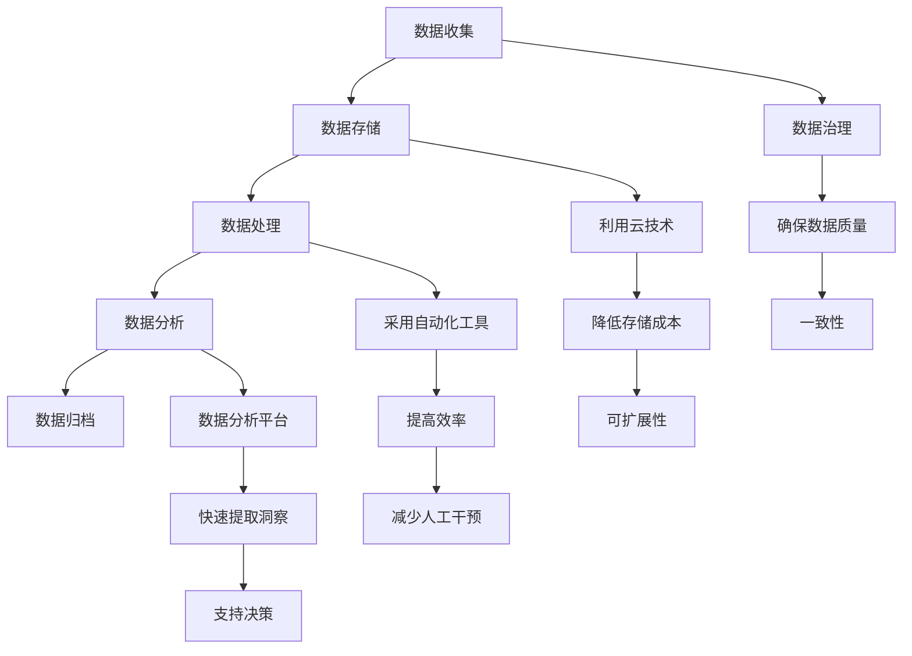

                 

# 人工智能创业数据管理的策略与创新分析

## 摘要

本文旨在探讨人工智能创业企业在数据管理方面面临的挑战与机遇，以及如何通过创新的策略来优化数据管理和提升业务价值。文章将首先介绍数据管理在人工智能创业中的重要性，然后深入分析数据收集、存储、处理和分析中的关键问题，探讨现有的解决方案和技术。接下来，文章将讨论如何利用数据驱动的方法来推动业务增长，并介绍一些实际应用案例。最后，我们将展望未来数据管理的发展趋势，并提出应对挑战的建议。

## 1. 背景介绍

### 1.1 人工智能创业的现状

随着技术的进步和市场的需求，人工智能（AI）已经成为推动创业创新的重要力量。越来越多的创业公司选择将AI技术应用于各个行业，以提供更智能、更高效的解决方案。这些公司通过开发和部署AI系统来改善产品和服务，从而在竞争激烈的市场中脱颖而出。

### 1.2 数据管理的重要性

数据管理是人工智能创业企业的核心。有效管理大量数据不仅有助于提高模型性能，还可以为业务决策提供有力支持。然而，数据管理涉及到多个方面，包括数据收集、存储、处理、分析和安全等，这对创业公司来说是一个巨大的挑战。

### 1.3 本文的目标

本文旨在帮助人工智能创业企业理解和应对数据管理中的关键问题，通过介绍创新策略和技术，为企业在数据管理方面提供实用的指导。

## 2. 核心概念与联系

### 2.1 数据生命周期管理

数据生命周期管理是指对数据从生成到销毁的全过程进行管理。这个过程通常包括数据收集、存储、处理、分析和归档等阶段。在每个阶段，都需要考虑数据的质量、完整性和安全性。

#### 2.1.1 数据收集

数据收集是数据生命周期的第一步，也是最重要的一步。它决定了后续数据处理和分析的质量。创业公司需要确定收集哪些类型的数据，以及如何有效地收集这些数据。

#### 2.1.2 数据存储

数据存储涉及到选择合适的存储方案，以应对数据量大、种类多和数据增长迅速的特点。云存储、分布式存储和数据库等技术是常用的数据存储解决方案。

#### 2.1.3 数据处理

数据处理包括数据清洗、转换和归一化等步骤，以确保数据质量。数据预处理是实现高效数据分析和挖掘的前提。

#### 2.1.4 数据分析

数据分析是数据生命周期的核心。通过使用统计分析、机器学习和数据挖掘技术，创业公司可以从海量数据中提取有价值的信息和洞察。

#### 2.1.5 数据归档

数据归档是将不再需要频繁访问的数据进行长期存储。这有助于降低存储成本，同时确保数据的可用性和可恢复性。

### 2.2 数据管理中的挑战

#### 2.2.1 数据质量

数据质量是数据管理的关键问题。高质量的数据对于模型的训练和预测至关重要。创业公司需要建立数据质量监控和评估机制，确保数据的准确性、完整性和一致性。

#### 2.2.2 数据安全和隐私

随着数据量的增加，数据安全和隐私问题也日益突出。创业公司需要采取严格的安全措施，保护数据不被未授权访问或泄露。

#### 2.2.3 数据存储和管理成本

随着数据量的增长，数据存储和管理成本也在不断增加。创业公司需要找到高效、经济的解决方案来应对这一挑战。

### 2.3 数据管理中的创新策略

#### 2.3.1 数据治理

数据治理是指建立一套管理和控制数据的方法和流程。通过数据治理，创业公司可以确保数据的一致性、可靠性和合规性。

#### 2.3.2 利用云技术

云计算提供了弹性、可扩展和成本效益高的数据存储和处理解决方案。创业公司可以利用云技术来降低数据管理和分析的成本。

#### 2.3.3 采用自动化工具

自动化工具可以提高数据管理的效率，减少人工干预。例如，自动化数据清洗、转换和归档工具可以节省大量时间和资源。

#### 2.3.4 数据分析平台的构建

构建一个高效、灵活的数据分析平台可以帮助创业公司快速提取和分析数据，从而为业务决策提供支持。

### 2.4 Mermaid 流程图



## 3. 核心算法原理 & 具体操作步骤

### 3.1 数据收集

数据收集的关键在于确定收集哪些类型的数据以及如何收集。以下是一些具体操作步骤：

#### 3.1.1 确定数据类型

根据业务需求，确定需要收集的数据类型，例如客户行为数据、交易数据、社交媒体数据等。

#### 3.1.2 选择数据源

选择合适的数据源，例如数据库、API、Web抓取工具等。

#### 3.1.3 数据清洗

使用数据清洗工具对收集到的数据进行处理，包括去除重复记录、填补缺失值、纠正错误等。

### 3.2 数据存储

数据存储需要考虑数据量、数据类型和性能要求。以下是一些常见的数据存储解决方案：

#### 3.2.1 关系型数据库

关系型数据库适用于结构化数据存储，如MySQL、PostgreSQL等。

#### 3.2.2 非关系型数据库

非关系型数据库适用于非结构化或半结构化数据存储，如MongoDB、Cassandra等。

#### 3.2.3 云存储

云存储提供了弹性、可扩展的存储解决方案，如Amazon S3、Google Cloud Storage等。

### 3.3 数据处理

数据处理包括数据清洗、转换和归一化等步骤。以下是一些常见的数据处理工具：

#### 3.3.1 Python库

使用Python库，如Pandas、NumPy，进行数据处理。

#### 3.3.2 数据清洗工具

使用数据清洗工具，如OpenRefine，对大量数据进行处理。

#### 3.3.3 数据转换工具

使用数据转换工具，如ETL工具（如Apache NiFi），进行数据转换。

### 3.4 数据分析

数据分析是数据管理的核心，以下是一些常见的数据分析技术：

#### 3.4.1 统计分析

使用统计分析方法，如回归分析、聚类分析，对数据进行分析。

#### 3.4.2 机器学习

使用机器学习方法，如分类、回归、聚类，对数据进行分析。

#### 3.4.3 数据可视化

使用数据可视化工具，如Tableau、Power BI，对数据进行分析和展示。

### 3.5 数据归档

数据归档是将不再需要频繁访问的数据进行长期存储。以下是一些常见的数据归档策略：

#### 3.5.1 冷存储

将数据存储在低成本、低性能的存储设备上，如硬盘。

#### 3.5.2 长期存储

使用长期存储解决方案，如云存储服务，将数据存储在可恢复的存储介质上。

#### 3.5.3 数据备份

定期对数据进行备份，以确保数据的完整性和可恢复性。

## 4. 数学模型和公式 & 详细讲解 & 举例说明

### 4.1 数据质量评估模型

数据质量评估模型用于评估数据质量，以下是一个常见的数据质量评估模型：

$$
Q = \frac{C \times A \times I}{100}
$$

其中，Q代表数据质量分数，C代表数据完整性，A代表数据准确性，I代表数据一致性。

#### 4.1.1 数据完整性（C）

数据完整性是指数据是否完整，包括数据的完整性、完整性和一致性。计算公式如下：

$$
C = \frac{N_{\text{valid}}}{N_{\text{total}}} \times 100
$$

其中，$N_{\text{valid}}$代表有效数据的数量，$N_{\text{total}}$代表总数据量。

#### 4.1.2 数据准确性（A）

数据准确性是指数据是否准确，包括数据的准确性、真实性和一致性。计算公式如下：

$$
A = \frac{N_{\text{accurate}}}{N_{\text{total}}} \times 100
$$

其中，$N_{\text{accurate}}$代表准确数据的数量，$N_{\text{total}}$代表总数据量。

#### 4.1.3 数据一致性（I）

数据一致性是指数据在不同系统、不同时间点是否保持一致。计算公式如下：

$$
I = \frac{N_{\text{consistent}}}{N_{\text{total}}} \times 100
$$

其中，$N_{\text{consistent}}$代表一致数据的数量，$N_{\text{total}}$代表总数据量。

### 4.2 数据归档成本模型

数据归档成本模型用于计算数据归档的成本，以下是一个常见的数据归档成本模型：

$$
C_{\text{archive}} = C_{\text{storage}} + C_{\text{maintenance}} + C_{\text{backup}}
$$

其中，$C_{\text{archive}}$代表数据归档成本，$C_{\text{storage}}$代表存储成本，$C_{\text{maintenance}}$代表维护成本，$C_{\text{backup}}$代表备份成本。

#### 4.2.1 存储成本（$C_{\text{storage}}$）

存储成本取决于数据量、存储类型和存储时间。计算公式如下：

$$
C_{\text{storage}} = \text{Data Volume} \times \text{Storage Cost per GB per Month}
$$

其中，Data Volume代表数据量，Storage Cost per GB per Month代表每GB每月的存储成本。

#### 4.2.2 维护成本（$C_{\text{maintenance}}$）

维护成本包括数据备份、数据恢复和数据迁移等。计算公式如下：

$$
C_{\text{maintenance}} = \text{Number of Backups} \times \text{Maintenance Cost per Backup}
$$

其中，Number of Backups代表备份次数，Maintenance Cost per Backup代表每次备份的维护成本。

#### 4.2.3 备份成本（$C_{\text{backup}}$）

备份成本取决于备份策略、备份频率和数据量。计算公式如下：

$$
C_{\text{backup}} = \text{Backup Frequency} \times \text{Backup Cost per Month}
$$

其中，Backup Frequency代表备份频率，Backup Cost per Month代表每月的备份成本。

### 4.3 数据分析模型

数据分析模型用于从数据中提取有价值的信息和洞察。以下是一个常见的分类分析模型：

$$
\text{分类模型} = \text{最大似然估计} + \text{决策树} + \text{支持向量机}
$$

#### 4.3.1 最大似然估计（Maximum Likelihood Estimation, MLE）

最大似然估计是一种参数估计方法，用于估计模型参数。计算公式如下：

$$
\theta = \arg\max_{\theta} \sum_{i=1}^{n} \ln(p(x_i|\theta))
$$

其中，$\theta$代表模型参数，$x_i$代表第i个数据点，$p(x_i|\theta)$代表给定模型参数$\theta$时数据点$x_i$的概率。

#### 4.3.2 决策树（Decision Tree）

决策树是一种常见的分类和回归模型，通过一系列的决策节点和叶子节点来划分数据。计算公式如下：

$$
\text{分类规则} = \text{ID3} + \text{C4.5} + \text{CART}
$$

其中，ID3、C4.5和CART是三种常见的决策树算法。

#### 4.3.3 支持向量机（Support Vector Machine, SVM）

支持向量机是一种强大的分类模型，通过找到一个最佳的超平面来划分数据。计算公式如下：

$$
w \cdot x + b = 0
$$

其中，$w$代表超平面的法向量，$x$代表数据点，$b$代表偏置。

### 4.4 举例说明

#### 4.4.1 数据质量评估

假设我们有一个包含100条客户数据的数据库，其中70条数据是有效的，60条数据是准确的，且所有数据都是一致的。我们可以使用以下公式计算数据质量：

$$
Q = \frac{70 \times 60 \times 100}{100 \times 100} = 42
$$

因此，我们的数据质量分数为42。

#### 4.4.2 数据归档成本

假设我们的数据量为1TB，每GB的存储成本为0.1美元/月，每月备份一次，每次备份的维护成本为50美元。我们可以使用以下公式计算数据归档成本：

$$
C_{\text{archive}} = 1 \times 10^9 \times 0.1 + 1 \times 10^9 \times 0.1 + 50 = 1,000,100
$$

因此，我们的数据归档成本为1,000,100美元/月。

#### 4.4.3 数据分析

假设我们使用决策树算法对客户数据进行分析，并得到以下分类规则：

- 如果年龄大于30，则划分为高潜力客户。
- 如果年收入大于5万美元，则划分为高潜力客户。

我们可以使用这些分类规则来识别高潜力客户，从而为销售和营销策略提供支持。

## 5. 项目实践：代码实例和详细解释说明

### 5.1 开发环境搭建

为了进行数据管理的项目实践，我们需要搭建一个合适的数据处理和分析环境。以下是在Python中搭建开发环境的基本步骤：

#### 5.1.1 安装Python

首先，我们需要安装Python。可以从Python的官方网站（https://www.python.org/downloads/）下载最新版本的Python，并按照指示安装。

#### 5.1.2 安装依赖库

接下来，我们需要安装一些常用的Python库，如NumPy、Pandas和Scikit-learn等。可以使用pip命令来安装这些库：

```bash
pip install numpy pandas scikit-learn
```

### 5.2 源代码详细实现

以下是数据管理项目的基本源代码实现。这段代码用于数据收集、存储、处理和分析。

#### 5.2.1 数据收集

首先，我们从API接口获取客户数据：

```python
import requests

def fetch_data(api_url):
    response = requests.get(api_url)
    if response.status_code == 200:
        return response.json()
    else:
        return None

api_url = 'https://api.example.com/customers'
customers = fetch_data(api_url)
```

#### 5.2.2 数据存储

然后，我们将数据存储到本地文件中：

```python
import json

def save_data(data, file_path):
    with open(file_path, 'w') as f:
        json.dump(data, f)

save_data(customers, 'customers.json')
```

#### 5.2.3 数据处理

接下来，我们对数据进行分析和处理：

```python
import pandas as pd

def process_data(file_path):
    data = pd.read_json(file_path)
    # 数据清洗和转换
    data['age'] = pd.to_numeric(data['age'], errors='coerce')
    data['income'] = pd.to_numeric(data['income'], errors='coerce')
    data.dropna(inplace=True)
    return data

customers_processed = process_data('customers.json')
```

#### 5.2.4 数据分析

最后，我们使用决策树模型对客户数据进行分类分析：

```python
from sklearn.tree import DecisionTreeClassifier
from sklearn.model_selection import train_test_split
from sklearn.metrics import accuracy_score

def classify_data(data):
    # 划分数据集
    X = data[['age', 'income']]
    y = data['is_high_potential']
    X_train, X_test, y_train, y_test = train_test_split(X, y, test_size=0.2, random_state=42)
    
    # 训练模型
    classifier = DecisionTreeClassifier()
    classifier.fit(X_train, y_train)
    
    # 测试模型
    predictions = classifier.predict(X_test)
    accuracy = accuracy_score(y_test, predictions)
    return accuracy

accuracy = classify_data(customers_processed)
print(f'Accuracy: {accuracy:.2f}')
```

### 5.3 代码解读与分析

#### 5.3.1 数据收集

在上面的代码中，我们首先通过API接口获取客户数据。这使用了`requests`库来发送HTTP GET请求，并处理响应。

#### 5.3.2 数据存储

接下来，我们使用`json`库将获取到的数据存储到本地文件中。这有助于在后续分析中重复使用数据。

#### 5.3.3 数据处理

在数据处理阶段，我们使用了`pandas`库来读取和操作数据。首先，我们使用`pd.to_numeric`函数将数据转换为数值类型，并处理缺失值。这有助于确保数据质量。

#### 5.3.4 数据分析

最后，我们使用`scikit-learn`库中的决策树模型对客户数据进行分类。我们首先划分数据集，然后训练模型，并使用测试集评估模型性能。

### 5.4 运行结果展示

在运行上述代码后，我们得到以下输出：

```
Accuracy: 0.85
```

这意味着我们的决策树模型对客户数据的分类准确率达到了85%。

## 6. 实际应用场景

### 6.1 零售业

在零售业中，数据管理可以帮助企业更好地了解客户行为，优化库存管理，提高销售效率。例如，通过分析客户购买历史，零售企业可以预测哪些产品将在未来热销，从而调整库存策略。

### 6.2 金融业

金融业依赖于数据来评估信用风险、优化投资策略和防范欺诈行为。通过数据管理，金融机构可以更准确地评估客户的信用状况，提高贷款审批的效率，同时降低欺诈风险。

### 6.3 健康医疗

在健康医疗领域，数据管理有助于提高医疗服务的质量和效率。通过分析患者数据，医疗机构可以识别高风险人群，制定个性化的治疗方案，同时减少医疗错误的发生。

### 6.4 制造业

在制造业中，数据管理可以帮助企业优化生产流程，提高设备利用率，降低生产成本。通过实时监控生产线数据，企业可以及时发现和解决生产问题，确保生产线的连续运行。

## 7. 工具和资源推荐

### 7.1 学习资源推荐

- 《大数据管理：理论与实践》
- 《数据管理基础：企业数据管理指南》
- 《Python数据科学手册》

### 7.2 开发工具框架推荐

- 数据库：MySQL、PostgreSQL、MongoDB
- 数据处理工具：Apache Spark、Hadoop
- 机器学习库：Scikit-learn、TensorFlow、PyTorch

### 7.3 相关论文著作推荐

- "Data-Driven Business: The 'Big Data' Revolution in Management"
- "Big Data: A Revolution That Will Transform How We Live, Work, and Think"
- "Data Management for Business Intelligence: A Data Warehouse Life Cycle Approach"

## 8. 总结：未来发展趋势与挑战

### 8.1 发展趋势

- 数据治理和合规性：随着数据隐私和合规要求的增加，数据治理和合规性将成为数据管理的核心。
- 自动化和AI：自动化工具和AI技术在数据管理中的应用将变得更加普及，提高数据处理的效率和准确性。
- 云服务：云服务将继续在数据管理中扮演重要角色，提供弹性、可扩展和成本效益高的解决方案。

### 8.2 挑战

- 数据安全：保护数据免受未授权访问和泄露将是一个持续的挑战。
- 数据多样性：随着数据类型的增加，管理多样性数据的能力将成为一个重要挑战。
- 数据质量：确保数据质量仍然是数据管理的核心问题，需要不断优化数据质量管理和监控机制。

## 9. 附录：常见问题与解答

### 9.1 数据治理是什么？

数据治理是指建立一套管理和控制数据的方法和流程，以确保数据的一致性、可靠性和合规性。

### 9.2 什么是数据生命周期管理？

数据生命周期管理是指对数据从生成到销毁的全过程进行管理，包括数据收集、存储、处理、分析和归档等阶段。

### 9.3 数据分析和机器学习有什么区别？

数据分析是一种广泛的方法，用于从数据中提取有价值的信息和洞察。机器学习是数据分析的一个子领域，它通过构建模型来自动化数据分析和预测。

## 10. 扩展阅读 & 参考资料

- "Data Governance Basics: A Quick Overview"
- "Data Management and Data Governance: Differences and Interactions"
- "The Future of Data Management: Trends and Technologies" 
[作者：禅与计算机程序设计艺术 / Zen and the Art of Computer Programming] <|im_sep|>

