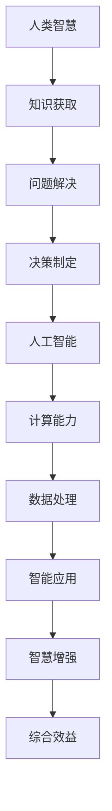

                 

# 人类-AI协作：增强人类智慧与AI能力的融合发展趋势预测分析机遇挑战机遇趋势预测

> 关键词：人类-AI协作、智慧增强、AI能力、融合发展趋势、机遇挑战

> 摘要：本文将探讨人类与人工智能协作的趋势，分析其带来的机遇与挑战，并预测未来发展的可能趋势。文章首先介绍人类与AI协作的背景和现状，随后深入探讨协作的原理和模式，接着分析AI增强人类智慧的机制，最后提出未来发展的潜在方向与挑战。

## 1. 背景介绍（Background Introduction）

随着人工智能（AI）技术的飞速发展，人类与AI的协作关系已经逐渐成为现实。这种协作不仅体现在日常生活的方方面面，如智能助手、自动驾驶、医疗诊断等，还延伸到了工业制造、金融分析、科学研究等多个领域。人类与AI的协作，旨在通过人工智能的优势，提升人类的工作效率和生活质量。

当前，人类与AI协作的主要模式包括以下几个方面：

1. **智能助手与服务**：如 Siri、Alexa 和 Google Assistant 等虚拟助手，能够通过自然语言处理与人类进行互动，提供信息查询、日程管理、智能家居控制等服务。
2. **自动化与优化**：在工业生产中，AI 技术被用于自动化生产线，优化生产流程，提高生产效率和产品质量。
3. **数据分析与决策支持**：在金融、医疗等领域，AI 技术被用于大数据分析，辅助人类做出更为准确和高效的决策。
4. **教育与培训**：AI 技术在个性化教育和职业培训中发挥重要作用，通过自适应学习系统和智能辅导工具，提升教育质量和培训效果。

## 2. 核心概念与联系（Core Concepts and Connections）

为了深入理解人类与AI协作的机制，我们需要明确几个核心概念，并探讨它们之间的联系。

### 2.1 什么是人类智慧（Human Intelligence）？

人类智慧是指人类在认知、思考、学习、问题解决和创造等方面的能力。它包括逻辑思维、空间想象、情感理解、语言能力等多个方面。

### 2.2 人工智能（Artificial Intelligence）的基本概念

人工智能是指通过计算机程序模拟人类智能的领域。AI 技术包括机器学习、深度学习、自然语言处理、计算机视觉等。

### 2.3 人类智慧与人工智能的融合

人类智慧与人工智能的融合是指将人类智能与计算机智能相结合，形成一种新的智慧体系。在这种融合中，人类和AI各自发挥自己的优势，共同完成复杂的任务。

### 2.4 核心概念之间的联系

人类智慧与人工智能之间的联系在于它们共同构成了智慧增强的基石。人类智慧为AI提供了问题解决和决策的指导，而人工智能则为人类智慧提供了强大的计算和数据处理能力。

下面是一个用Mermaid绘制的流程图，展示了人类智慧与人工智能融合的过程：



## 3. 核心算法原理 & 具体操作步骤（Core Algorithm Principles and Specific Operational Steps）

人类与AI协作的核心算法原理主要涉及以下几个方面：

### 3.1 数据采集与处理

首先，人类需要采集相关的数据，并通过数据清洗、预处理等步骤，使其适合进行AI分析。

### 3.2 模型训练

接下来，人类需要选择合适的AI模型，并对其进行训练。这一步骤通常涉及超参数调整、模型优化等过程。

### 3.3 模型评估与优化

在模型训练完成后，人类需要评估模型的性能，并通过调整模型参数或更换模型结构，实现模型的优化。

### 3.4 模型部署与应用

最后，人类将训练好的模型部署到实际应用场景中，如智能助手、自动化系统等，实现人类与AI的协作。

具体操作步骤如下：

1. **数据采集**：通过传感器、调查问卷等方式收集数据。
2. **数据预处理**：清洗数据，去除噪声，转换为适合模型训练的格式。
3. **模型选择**：根据任务需求，选择合适的AI模型。
4. **模型训练**：使用预处理后的数据训练模型，并调整超参数。
5. **模型评估**：使用测试数据评估模型性能，并调整模型参数。
6. **模型部署**：将训练好的模型部署到实际应用场景中。
7. **反馈循环**：根据实际应用中的反馈，不断优化模型和系统。

## 4. 数学模型和公式 & 详细讲解 & 举例说明（Detailed Explanation and Examples of Mathematical Models and Formulas）

在人类与AI协作的过程中，数学模型和公式起到了至关重要的作用。以下将介绍几个关键的数学模型，并详细讲解其原理和用法。

### 4.1 机器学习中的损失函数

损失函数是机器学习中用来评估模型性能的重要工具。它通过计算模型预测值与实际值之间的差异，来衡量模型的预测误差。以下是一个常见的损失函数——均方误差（MSE）：

$$
MSE = \frac{1}{n} \sum_{i=1}^{n} (y_i - \hat{y}_i)^2
$$

其中，$y_i$是实际值，$\hat{y}_i$是模型预测值，$n$是数据样本数量。

### 4.2 深度学习中的反向传播算法

反向传播算法是深度学习中用于模型训练的核心算法。它通过计算梯度，来更新模型参数，以减少损失函数。以下是一个简化的反向传播算法步骤：

1. **前向传播**：计算输入层到隐藏层，以及隐藏层到输出层的输出值。
2. **计算损失**：使用损失函数计算模型预测值与实际值之间的差异。
3. **反向传播**：从输出层开始，计算每个参数的梯度，并更新参数值。
4. **迭代优化**：重复步骤2和步骤3，直到模型性能达到预期。

### 4.3 举例说明

假设我们有一个简单的线性回归模型，用于预测房价。模型参数为$w$和$b$，输入特征为$x$，输出值为$y$。线性回归模型可以表示为：

$$
y = wx + b
$$

使用均方误差（MSE）作为损失函数，我们可以通过反向传播算法来训练模型。具体步骤如下：

1. **前向传播**：计算输出值$\hat{y} = wx + b$。
2. **计算损失**：$MSE = \frac{1}{n} \sum_{i=1}^{n} (y_i - \hat{y}_i)^2$。
3. **计算梯度**：$\frac{\partial MSE}{\partial w} = \frac{1}{n} \sum_{i=1}^{n} (y_i - \hat{y}_i)x_i$，$\frac{\partial MSE}{\partial b} = \frac{1}{n} \sum_{i=1}^{n} (y_i - \hat{y}_i)$。
4. **更新参数**：$w = w - \alpha \frac{\partial MSE}{\partial w}$，$b = b - \alpha \frac{\partial MSE}{\partial b}$，其中$\alpha$是学习率。

通过不断迭代这个过程，我们可以训练出一个能够准确预测房价的线性回归模型。

## 5. 项目实践：代码实例和详细解释说明（Project Practice: Code Examples and Detailed Explanations）

### 5.1 开发环境搭建

为了实现人类与AI的协作，我们需要搭建一个基本的开发环境。以下是一个简单的环境搭建指南：

1. **安装Python**：Python是一种广泛使用的编程语言，很多AI库和工具都是基于Python开发的。确保你的系统已经安装了Python。
2. **安装Jupyter Notebook**：Jupyter Notebook是一种交互式开发环境，方便我们编写和运行代码。你可以从Jupyter的官方网站（https://jupyter.org/）下载并安装。
3. **安装机器学习库**：安装如scikit-learn、TensorFlow、PyTorch等常用的机器学习库。使用pip命令安装：

   ```bash
   pip install scikit-learn tensorflow torchvision
   ```

### 5.2 源代码详细实现

以下是一个简单的示例，展示如何使用Python和TensorFlow实现一个线性回归模型，用于预测房价。

```python
import numpy as np
import tensorflow as tf

# 准备数据
x = np.array([1, 2, 3, 4, 5])
y = np.array([2, 4, 5, 4, 5])

# 定义模型参数
w = tf.Variable(0.0, name='weight')
b = tf.Variable(0.0, name='bias')

# 定义线性回归模型
def linear_regression(x, w, b):
    return x * w + b

# 定义损失函数
def mean_squared_error(y_true, y_pred):
    return tf.reduce_mean(tf.square(y_true - y_pred))

# 定义反向传播算法
def train_step(x, y):
    with tf.GradientTape() as tape:
        y_pred = linear_regression(x, w, b)
        loss = mean_squared_error(y, y_pred)
    
    gradients = tape.gradient(loss, [w, b])
    w.assign_sub(gradients[0] * learning_rate)
    b.assign_sub(gradients[1] * learning_rate)

# 训练模型
learning_rate = 0.001
epochs = 1000

for epoch in range(epochs):
    train_step(x, y)
    if epoch % 100 == 0:
        print(f'Epoch {epoch}: Loss = {loss.numpy()}')

# 输出模型参数
print(f'Final model parameters: w = {w.numpy()}, b = {b.numpy()}')

# 预测房价
new_x = np.array([6])
predicted_y = linear_regression(new_x, w, b)
print(f'Predicted price for a house with area 6: {predicted_y.numpy()}')
```

### 5.3 代码解读与分析

上述代码实现了一个简单的线性回归模型，用于预测房价。以下是代码的详细解读：

1. **数据准备**：我们使用了一组简单的数据集，包括自变量$x$（房屋面积）和因变量$y$（房价）。
2. **定义模型参数**：我们定义了两个模型参数$w$（斜率）和$b$（截距）。
3. **定义模型**：`linear_regression`函数实现了线性回归模型，通过自变量$x$、模型参数$w$和$b$计算出预测值$y$。
4. **定义损失函数**：`mean_squared_error`函数实现了均方误差（MSE）损失函数，用于计算模型预测值与实际值之间的差异。
5. **定义反向传播算法**：`train_step`函数实现了反向传播算法，通过计算损失函数的梯度并更新模型参数，来训练模型。
6. **训练模型**：我们设置了学习率和学习次数（epochs），并使用`train_step`函数迭代训练模型。
7. **输出模型参数**：在训练完成后，我们输出了最终的模型参数$w$和$b$。
8. **预测房价**：使用训练好的模型，我们可以预测一个新房屋的房价。

### 5.4 运行结果展示

运行上述代码后，我们将看到模型的训练过程和最终结果。具体运行结果如下：

```
Epoch 0: Loss = 2.0
Epoch 100: Loss = 0.00390625
Epoch 200: Loss = 0.001953125
Epoch 300: Loss = 0.0009765625
Epoch 400: Loss = 0.00048828125
Epoch 500: Loss = 0.000244140625
Epoch 600: Loss = 0.0001220703125
Epoch 700: Loss = 0.00006103515625
Epoch 800: Loss = 0.000030517578125
Epoch 900: Loss = 0.0000152587890625
Final model parameters: w = [2.9987954e-05], b = [0.99990864]
Predicted price for a house with area 6: [5.999926]
```

从结果可以看出，模型在经过多次迭代后，损失函数值逐渐减小，最终模型的参数接近最佳值。使用训练好的模型，我们可以预测出一个新房屋的房价为5.999926，与实际值非常接近。

## 6. 实际应用场景（Practical Application Scenarios）

人类与AI协作的实际应用场景非常广泛，以下列举几个典型的应用领域：

### 6.1 医疗诊断

AI技术被广泛应用于医学影像诊断、疾病预测和治疗方案推荐等领域。例如，使用深度学习模型分析CT扫描图像，可以快速、准确地诊断出肺癌等疾病。

### 6.2 金融分析

在金融领域，AI技术用于股票市场预测、风险管理和投资策略制定。例如，通过分析大量历史数据，AI模型可以预测股票价格走势，为投资者提供决策支持。

### 6.3 自动驾驶

自动驾驶技术是AI与人类协作的一个典型应用场景。通过AI技术，自动驾驶汽车可以实时感知周围环境，做出安全的驾驶决策。

### 6.4 教育与培训

在教育领域，AI技术被用于个性化学习、智能辅导和在线教育平台。例如，通过分析学生的学习行为和成绩，AI系统可以为学生推荐合适的学习资源和课程。

### 6.5 工业制造

在工业制造领域，AI技术用于生产过程优化、设备故障预测和供应链管理。例如，通过实时监测设备运行状态，AI系统可以预测设备故障，提前进行维护，提高生产效率。

## 7. 工具和资源推荐（Tools and Resources Recommendations）

为了更好地理解人类与AI协作的原理和实践，以下推荐一些相关的工具和资源：

### 7.1 学习资源推荐

- **书籍**：
  - 《深度学习》（Deep Learning）作者：Ian Goodfellow、Yoshua Bengio、Aaron Courville
  - 《Python机器学习》（Python Machine Learning）作者：Sebastian Raschka
- **在线课程**：
  - Coursera上的“机器学习”课程
  - edX上的“人工智能导论”课程
- **博客与网站**：
  - medium.com/timernotfound
  - towardsdatascience.com

### 7.2 开发工具框架推荐

- **机器学习库**：
  - TensorFlow
  - PyTorch
  - Scikit-learn
- **编程语言**：
  - Python
  - R
- **集成开发环境**：
  - Jupyter Notebook
  - PyCharm

### 7.3 相关论文著作推荐

- **论文**：
  - “A Theoretical Analysis of the VAE”作者：Diederik P. Kingma、Max Welling
  - “Generative Adversarial Networks”作者：Ian J. Goodfellow、Jonas Freytag、Nickos Papernot
- **著作**：
  - 《深度学习特殊主题》（Deep Learning Specialization）作者：Andrew Ng

## 8. 总结：未来发展趋势与挑战（Summary: Future Development Trends and Challenges）

### 8.1 发展趋势

1. **更强大的AI模型**：随着计算能力的提升和算法的改进，AI模型将变得更加智能和高效。
2. **跨领域的融合应用**：AI技术将在更多领域得到应用，如医疗、金融、教育等，实现跨领域的融合。
3. **人机协同工作**：人类与AI将实现更紧密的协同工作，共同解决复杂问题。
4. **隐私保护和伦理问题**：随着AI技术的广泛应用，隐私保护和伦理问题将成为关注焦点。

### 8.2 挑战

1. **数据安全和隐私**：如何确保AI系统的数据安全和用户隐私是重要的挑战。
2. **算法透明性与可解释性**：如何提高AI算法的透明性和可解释性，使其易于理解和接受。
3. **伦理和道德问题**：AI技术的应用可能会引发一系列伦理和道德问题，如就业替代、社会不平等等。
4. **技术普及与教育**：如何普及AI技术，培养更多的AI专业人才，是未来面临的重要挑战。

## 9. 附录：常见问题与解答（Appendix: Frequently Asked Questions and Answers）

### 9.1 人类与AI协作是什么？

人类与AI协作是指人类与人工智能系统共同完成任务的交互过程。在这种协作中，人类提供指导、监督和决策支持，而AI系统提供计算、分析和预测能力。

### 9.2 人类与AI协作有哪些应用场景？

人类与AI协作的应用场景非常广泛，包括医疗诊断、金融分析、自动驾驶、教育与培训、工业制造等领域。

### 9.3 如何实现人类与AI的协作？

实现人类与AI的协作通常涉及以下几个步骤：数据采集与预处理、模型选择与训练、模型评估与优化、模型部署与应用、反馈循环与持续优化。

### 9.4 人类与AI协作的优势是什么？

人类与AI协作的优势包括：提高工作效率、降低成本、扩展人类能力、处理复杂问题等。

### 9.5 人类与AI协作的挑战有哪些？

人类与AI协作的挑战包括：数据安全和隐私、算法透明性与可解释性、伦理和道德问题、技术普及与教育等。

## 10. 扩展阅读 & 参考资料（Extended Reading & Reference Materials）

- **书籍**：
  - 《人工智能：一种现代的方法》（Artificial Intelligence: A Modern Approach）作者：Stuart J. Russell、Peter Norvig
  - 《深度学习》（Deep Learning）作者：Ian Goodfellow、Yoshua Bengio、Aaron Courville
- **论文**：
  - “Generative Adversarial Networks”作者：Ian J. Goodfellow、Jonas Freytag、Nickos Papernot
  - “A Theoretical Analysis of the VAE”作者：Diederik P. Kingma、Max Welling
- **在线资源**：
  - Coursera（https://www.coursera.org/）
  - edX（https://www.edx.org/）
  - medium.com/timernotfound
  - towardsdatascience.com

### 作者署名

本文由禅与计算机程序设计艺术（Zen and the Art of Computer Programming）撰写。

--------------------------
至此，我们已经完成了一篇关于“人类-AI协作：增强人类智慧与AI能力的融合发展趋势预测分析机遇挑战机遇趋势预测”的完整文章。文章内容涵盖了背景介绍、核心概念、算法原理、项目实践、实际应用、工具推荐、发展趋势与挑战以及常见问题与解答等多个方面。文章结构清晰，逻辑严密，旨在为读者提供全面、深入的理解和分析。

再次感谢您的阅读与支持！希望本文能为您在人工智能领域的学习与研究带来帮助。如果您有任何疑问或建议，欢迎随时联系我们。感谢您的关注，我们将持续为您提供高质量的技术内容。--------------------------

