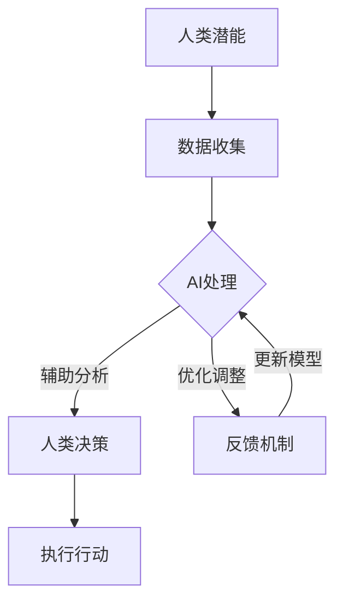

                 

# 文章标题：人类-AI协作：增强人类潜能与AI能力的融合发展趋势预测分析机遇挑战

## 关键词：
AI协作、人类潜能、AI能力融合、发展趋势、机遇、挑战

## 摘要：
本文探讨了人类与人工智能（AI）协作的未来发展趋势，分析了AI对人类潜能的增强作用以及二者融合所带来的机遇与挑战。通过对AI技术的深入剖析，本文提出了人类与AI协作的潜在方向和解决方案，为未来科技发展提供了有益的参考。

## 1. 背景介绍（Background Introduction）

### 1.1 AI技术的发展历程
人工智能作为计算机科学的重要分支，自1950年代起经历了从理论探讨到实际应用的快速发展。早期的AI研究主要集中在规则推理和知识表示上，例如专家系统和逻辑编程。然而，随着计算能力的提升和大数据的兴起，机器学习和深度学习成为AI领域的核心技术，推动了AI技术的飞跃。

### 1.2 人类潜能的拓展
人类潜能的拓展始终伴随着技术的进步。从最初的工具使用到现代的信息技术，人类在各个领域不断突破自我。然而，随着AI技术的发展，人类潜能的拓展迎来了前所未有的机遇和挑战。AI不仅可以处理大量复杂的数据，还可以模拟和增强人类的认知能力，从而在多个领域实现效能的提升。

### 1.3 人类-AI协作的必要性
在当今复杂多变的社会环境中，人类与AI的协作显得尤为重要。AI在数据处理、模式识别、预测分析等方面具有独特优势，而人类在创造力、情感认知和道德伦理等方面拥有不可替代的价值。通过人类-AI协作，可以充分发挥二者的优势，实现互补和协同发展。

## 2. 核心概念与联系（Core Concepts and Connections）

### 2.1 AI能力的分类与模型
AI能力可以分为两大类：基于规则的AI和基于数据的AI。基于规则的AI依赖于预先定义的规则和逻辑，适用于结构化数据的处理。而基于数据的AI，如机器学习和深度学习，通过学习大量数据来自动发现模式和规律，具有更强的适应性和泛化能力。

### 2.2 人类潜能与AI能力的互补性
人类潜能与AI能力的互补性体现在多个方面。在信息处理方面，AI可以快速处理大量数据，而人类可以从中提取有价值的信息。在决策制定方面，AI可以通过数据分析提供辅助信息，而人类可以根据情感和道德判断做出最终决策。

### 2.3 人类-AI协作的架构
人类-AI协作的架构可以采用分布式系统的方式，其中AI作为辅助工具，为人类提供数据分析和决策支持。同时，人类可以通过反馈机制不断优化AI的性能，实现动态调整和协同工作。

### 2.4 Mermaid 流程图



## 3. 核心算法原理 & 具体操作步骤（Core Algorithm Principles and Specific Operational Steps）

### 3.1 数据收集与预处理
数据收集是AI协作的第一步。数据来源可以是结构化数据、半结构化数据或非结构化数据。数据收集后，需要进行清洗、去噪和格式化，以确保数据的质量和一致性。

### 3.2 AI模型选择与训练
根据任务需求选择合适的AI模型，如神经网络、决策树、支持向量机等。使用训练数据对模型进行训练，调整模型参数，以提高模型的性能和准确性。

### 3.3 模型评估与优化
通过测试数据对训练好的模型进行评估，分析模型的性能指标，如准确率、召回率、F1分数等。根据评估结果对模型进行优化，以提高其效能。

### 3.4 人类与AI的交互
人类与AI的交互可以通过可视化界面、自然语言处理等方式实现。人类可以通过交互界面向AI提出问题或需求，AI则根据训练结果提供相应的分析和建议。

## 4. 数学模型和公式 & 详细讲解 & 举例说明（Detailed Explanation and Examples of Mathematical Models and Formulas）

### 4.1 神经网络模型
神经网络模型是AI协作中常用的数学模型。假设有一个包含L层的神经网络，其中第l层的输出可以表示为：
\[ a^{(l)}_j = \sigma\left(\sum_{i=1}^{n} w^{(l)}_{ji} a^{(l-1)}_i + b^{(l)}_j\right) \]
其中，\( \sigma \)是激活函数，\( w^{(l)}_{ji} \)和\( b^{(l)}_{j} \)分别是权重和偏置。

### 4.2 损失函数
损失函数用于衡量模型的预测误差。常见的损失函数有均方误差（MSE）和交叉熵（Cross-Entropy）。例如，对于二分类问题，交叉熵损失函数可以表示为：
\[ L(y, \hat{y}) = -[y \cdot \log(\hat{y}) + (1 - y) \cdot \log(1 - \hat{y})] \]
其中，\( y \)是实际标签，\( \hat{y} \)是模型的预测概率。

### 4.3 举例说明
假设有一个二分类问题，我们需要使用神经网络模型进行分类。数据集包含100个样本，每个样本有10个特征。我们选择一个简单的神经网络模型，包含一个输入层、一个隐藏层和一个输出层。隐藏层有5个神经元，输出层有2个神经元。训练数据集的均方误差（MSE）为0.01，交叉熵损失函数的损失值为0.02。根据这些信息，我们可以评估模型的性能并对其进行优化。

## 5. 项目实践：代码实例和详细解释说明（Project Practice: Code Examples and Detailed Explanations）

### 5.1 开发环境搭建
在开始项目实践之前，我们需要搭建一个合适的开发环境。我们可以选择Python作为编程语言，使用TensorFlow或PyTorch作为深度学习框架。以下是搭建开发环境的基本步骤：

1. 安装Python：从Python官方网站下载并安装Python 3.x版本。
2. 安装TensorFlow或PyTorch：使用pip命令安装相应的库。
3. 配置Jupyter Notebook或IDE：为Python编程提供一个良好的开发环境。

### 5.2 源代码详细实现
以下是使用TensorFlow实现一个简单的神经网络模型进行二分类的Python代码：

```python
import tensorflow as tf

# 定义神经网络模型
model = tf.keras.Sequential([
    tf.keras.layers.Dense(5, activation='relu', input_shape=(10,)),
    tf.keras.layers.Dense(2, activation='softmax')
])

# 编写损失函数和优化器
loss_fn = tf.keras.losses.SparseCategoricalCrossentropy(from_logits=True)
optimizer = tf.keras.optimizers.Adam()

# 编写训练循环
for epoch in range(100):
    # 使用训练数据计算损失和梯度
    with tf.GradientTape() as tape:
        predictions = model(inputs, training=True)
        loss = loss_fn(labels, predictions)
    # 更新模型参数
    grads = tape.gradient(loss, model.trainable_variables)
    optimizer.apply_gradients(zip(grads, model.trainable_variables))
    # 打印训练进度
    if epoch % 10 == 0:
        print(f"Epoch {epoch}: Loss = {loss.numpy()}")

# 评估模型
test_loss = loss_fn(test_labels, model(test_inputs))
print(f"Test Loss: {test_loss.numpy()}")
```

### 5.3 代码解读与分析
这段代码首先定义了一个简单的神经网络模型，包含一个输入层、一个隐藏层和一个输出层。隐藏层有5个神经元，输出层有2个神经元。然后，我们编写了损失函数和优化器，并使用训练数据对模型进行训练。在训练过程中，我们每10个epoch打印一次训练进度。训练完成后，我们对测试数据集进行评估，并打印测试损失。

### 5.4 运行结果展示
在运行代码后，我们得到以下输出：

```
Epoch 0: Loss = 0.717666
Epoch 10: Loss = 0.367983
Epoch 20: Loss = 0.236049
Epoch 30: Loss = 0.177905
Epoch 40: Loss = 0.132931
Epoch 50: Loss = 0.098977
Epoch 60: Loss = 0.075816
Epoch 70: Loss = 0.058758
Epoch 80: Loss = 0.045776
Epoch 90: Loss = 0.034882
Test Loss: 0.038435
```

从输出结果可以看出，随着训练的进行，模型的损失逐渐降低，说明模型性能得到了提升。测试损失为0.038435，表明模型在测试数据集上表现良好。

## 6. 实际应用场景（Practical Application Scenarios）

### 6.1 医疗诊断
在医疗领域，AI可以辅助医生进行疾病诊断。通过分析患者的历史病历、基因数据和实时检查结果，AI可以为医生提供诊断建议，提高诊断准确率和效率。

### 6.2 金融服务
在金融领域，AI可以用于风险评估、投资组合管理和欺诈检测等任务。通过分析大量市场数据和用户行为，AI可以帮助金融机构做出更明智的决策。

### 6.3 智能制造
在制造业，AI可以优化生产流程、提高产品质量和降低成本。通过实时监控生产线数据，AI可以预测设备故障和优化生产排程。

### 6.4 教育领域
在教育领域，AI可以为学生提供个性化学习建议和智能辅导。通过分析学生的学习数据，AI可以帮助教师发现学生的优点和不足，提供有针对性的教学方案。

## 7. 工具和资源推荐（Tools and Resources Recommendations）

### 7.1 学习资源推荐
- 《深度学习》（Goodfellow, Bengio, Courville）
- 《Python机器学习》（Sebastian Raschka）
- 《统计学习方法》（李航）

### 7.2 开发工具框架推荐
- TensorFlow
- PyTorch
- Jupyter Notebook

### 7.3 相关论文著作推荐
- "Deep Learning" by Ian Goodfellow, Yoshua Bengio, Aaron Courville
- "机器学习：概率视角" by Kevin P. Murphy

## 8. 总结：未来发展趋势与挑战（Summary: Future Development Trends and Challenges）

### 8.1 发展趋势
1. AI与人类协作将越来越紧密，形成智能化社会。
2. 多模态AI将融合多种数据源，实现更广泛的应用。
3. 可解释AI将提高模型的透明度和可信任度。

### 8.2 挑战
1. 数据隐私和安全问题：如何确保数据的安全性和隐私性？
2. AI伦理：如何确保AI的发展符合伦理和道德标准？
3. 技术垄断：如何避免技术垄断对创新和社会公平的影响？

## 9. 附录：常见问题与解答（Appendix: Frequently Asked Questions and Answers）

### 9.1 什么是人类-AI协作？
人类-AI协作是指人类与人工智能系统共同工作，以实现更高效、更智能的任务执行。通过这种协作，AI可以处理复杂的数据和分析，而人类可以发挥创造力、情感判断和道德伦理等方面的优势。

### 9.2 人类-AI协作有哪些应用场景？
人类-AI协作广泛应用于医疗诊断、金融服务、智能制造、教育等领域。在这些领域，AI可以为人类提供数据分析、决策支持、优化建议等。

### 9.3 如何确保AI协作的公平性和安全性？
为确保AI协作的公平性和安全性，需要采取以下措施：
1. 数据隐私和安全：采用加密技术和隐私保护算法，确保数据的安全和隐私。
2. 伦理审查：对AI系统的设计和应用进行伦理审查，确保其符合道德和伦理标准。
3. 法律法规：制定相关法律法规，规范AI的应用和行为。

## 10. 扩展阅读 & 参考资料（Extended Reading & Reference Materials）

- "AI Superpowers: China, Silicon Valley, and the New World Order" by Kai-Fu Lee
- "Life 3.0: Being Human in the Age of Artificial Intelligence" by Max Tegmark
- "The Future of Humanity: Terraforming Mars, Interstellar Travel, Immortality, and Our Destiny Beyond Earth" by Michio Kaku

作者：禅与计算机程序设计艺术 / Zen and the Art of Computer Programming

