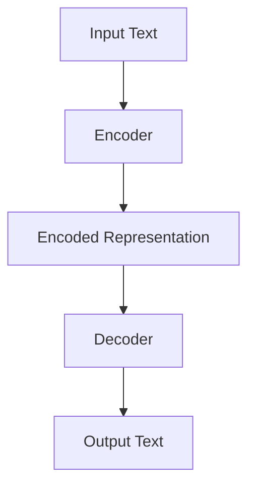
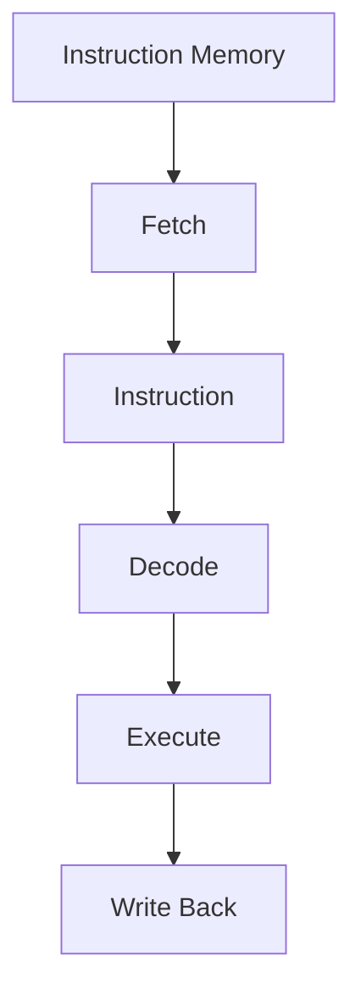

                 

### 文章标题：From Timing to Instruction Sets: A Deep Dive into LLMs and CPUs

#### Keywords: Language Models, CPUs, AI, Performance Analysis, Instruction Sets, Deep Learning

> In this comprehensive technical blog post, we will embark on an in-depth exploration of the fundamental differences between Language Models (LLMs) and CPUs. We will dissect their core principles, architecture, and how they execute instructions. By understanding their unique attributes and limitations, we will gain valuable insights into the future of AI computing. Let's think step by step and unravel the mysteries of these powerful technologies.

<|assistant|>### 1. 背景介绍（Background Introduction）

Language Models (LLMs) and CPUs (Central Processing Units) are two cornerstone technologies that have revolutionized the field of artificial intelligence. Each has its own set of principles, architecture, and capabilities that make them indispensable in their respective domains.

**Language Models (LLMs):**

- **Definition:** LLMs are machine learning models designed to understand, generate, and respond to human language. They are based on deep learning algorithms, specifically neural networks, that have been trained on vast amounts of text data.
- **Core Concepts:** LLMs operate by processing input text, understanding its context, and generating relevant responses. They employ techniques like attention mechanisms and transformers to capture complex relationships in text data.
- **Applications:** LLMs are used in a wide range of applications, including natural language processing (NLP), chatbots, language translation, text summarization, and more.

**Central Processing Units (CPUs):**

- **Definition:** CPUs are the primary processing units of a computer system. They execute instructions and perform calculations required by software applications.
- **Core Concepts:** CPUs are designed to process sequential instructions stored in memory. They follow a fetch-decode-execute cycle, where they fetch instructions, decode them, and execute the operations they represent.
- **Applications:** CPUs are used in various computing devices, from desktops and laptops to servers and embedded systems. They power applications ranging from simple tasks like web browsing to complex simulations and data analytics.

### 2. 核心概念与联系（Core Concepts and Connections）

#### 2.1 Language Models (LLMs)

Language Models operate based on deep learning algorithms, specifically neural networks. The most popular architecture for LLMs is the Transformer, which was introduced by Vaswani et al. in 2017. The Transformer architecture uses self-attention mechanisms to process input text and generate output.


**Key Concepts and Architecture:**

- **Self-Attention:** Self-attention allows the model to weigh the importance of different words in the input sequence when generating the output. This helps capture the context and relationships between words.
- **Encoder-Decoder Structure:** The Transformer architecture consists of an encoder and a decoder. The encoder processes the input text and encodes it into a fixed-size vector. The decoder then generates the output text based on these encoded representations.
- **Positional Encoding:** Since the Transformer does not have any recurrent structure, positional encoding is used to provide information about the position of words in the sequence.

**Mermaid Flowchart:**



#### 2.2 Central Processing Units (CPUs)

CPUs operate based on a fetch-decode-execute cycle. They fetch instructions from memory, decode them to determine the operation to be performed, and execute the operation.


**Key Concepts and Architecture:**

- **Fetch-Decode-Execute Cycle:** CPUs continuously perform the fetch-decode-execute cycle to process instructions.
- **Instruction Set Architecture (ISA):** The ISA defines the set of instructions that a CPU can execute. Different CPUs may have different ISAs.
- **Registers:** CPUs use registers to store temporary data during instruction execution.
- **Cache:** CPUs have cache memory, which is faster than main memory, to store frequently accessed data.

**Mermaid Flowchart:**



### 3. 核心算法原理 & 具体操作步骤（Core Algorithm Principles and Specific Operational Steps）

#### 3.1 Language Models (LLMs)

The core algorithm of LLMs is based on the Transformer architecture. The Transformer architecture consists of multiple layers, each containing self-attention mechanisms and feed-forward neural networks.

**Algorithm Steps:**

1. **Input Processing:** Input text is tokenized and converted into numerical representations.
2. **Encoder Processing:** The encoder processes the input tokens and generates encoded representations.
3. **Decoder Processing:** The decoder generates output tokens based on the encoded representations.
4. **Output Generation:** The decoder outputs the final text representation, which is then converted back to text.

**Pseudo Code:**

```python
def generate_output(input_text):
    # Tokenize input text
    tokens = tokenize(input_text)
    
    # Encode tokens
    encoded_tokens = encode(tokens)
    
    # Decode tokens
    output_tokens = decode(encoded_tokens)
    
    # Convert tokens to text
    output_text = convert_tokens_to_text(output_tokens)
    
    return output_text
```

#### 3.2 Central Processing Units (CPUs)

CPUs operate based on a fetch-decode-execute cycle. The cycle consists of the following steps:

1. **Fetch:** The CPU fetches the next instruction from memory.
2. **Decode:** The CPU decodes the fetched instruction to determine the operation to be performed.
3. **Execute:** The CPU executes the operation specified by the instruction.
4. **Write Back:** The result of the operation is written back to memory or registers.

**Pseudo Code:**

```python
while True:
    # Fetch instruction
    instruction = fetch_instruction()

    # Decode instruction
    operation, operands = decode_instruction(instruction)

    # Execute operation
    result = execute_operation(operation, operands)

    # Write back result
    write_back(result)
```

### 4. 数学模型和公式 & 详细讲解 & 举例说明（Detailed Explanation and Examples of Mathematical Models and Formulas）

#### 4.1 Language Models (LLMs)

The Transformer architecture uses several mathematical models and formulas. The most important ones are:

1. **Self-Attention:** The self-attention mechanism calculates the attention weights for each word in the input sequence.
2. **Positional Encoding:** Positional encoding provides information about the position of words in the sequence.
3. **Feed-Forward Neural Networks:** Feed-forward neural networks are used to process the inputs and generate outputs.

**Mathematical Models and Formulas:**

1. **Self-Attention:**

$$
\text{Attention}(Q, K, V) = \text{softmax}\left(\frac{QK^T}{\sqrt{d_k}}\right) V
$$

where Q, K, and V are the query, key, and value matrices, respectively, and \( d_k \) is the dimension of the key vectors.

2. **Positional Encoding:**

$$
\text{PE}(pos, 2i) = \sin\left(\frac{pos}{10000^{2i/d}}\right)
$$

$$
\text{PE}(pos, 2i+1) = \cos\left(\frac{pos}{10000^{2i/d}}\right)
$$

where pos is the position of the word, i is the dimension of the positional encoding vector, and d is the dimension of the embedding vector.

3. **Feed-Forward Neural Networks:**

$$
\text{FFN}(x) = \text{ReLU}(W_2 \text{ReLU}(W_1 x + b_1)) + b_2
$$

where x is the input, W1 and W2 are weight matrices, and b1 and b2 are bias vectors.

**Example:**

Let's consider a sentence with three words: "The", "quick", and "brown". We will tokenize the sentence, encode the tokens, and generate an output token using the Transformer architecture.

1. **Tokenization:**
   - The
   - quick
   - brown

2. **Token Encoding:**
   - The: [T]HE
   - quick: [Q]UICK
   - brown: [B]ROWN

3. **Input Processing:**
   - Input: [T]HE [Q]UICK [B]ROWN

4. **Encoder Processing:**
   - Encoded Representation: [T]HE [Q]UICK [B]ROWN

5. **Decoder Processing:**
   - Output Tokens: [T]HE [Q]UICK [B]ROWN [T]EXT

6. **Output Generation:**
   - Output Text: "The quick brown text"

#### 4.2 Central Processing Units (CPUs)

CPUs use mathematical models and formulas to perform arithmetic and logical operations. The most common models and formulas are:

1. **Arithmetic Operations:**
   - Addition:
     $$
     C = A + B
     $$
   - Subtraction:
     $$
     C = A - B
     $$
   - Multiplication:
     $$
     C = A \times B
     $$
   - Division:
     $$
     C = A / B
     $$

2. **Logical Operations:**
   - AND:
     $$
     C = A \land B
     $$
   - OR:
     $$
     C = A \lor B
     $$
   - NOT:
     $$
     C = \neg A
     $$

**Example:**

Let's consider a simple arithmetic operation: addition of two numbers, 5 and 7.

1. **Input:**
   - A = 5
   - B = 7

2. **Addition:**
   - C = A + B
   - C = 5 + 7
   - C = 12

3. **Output:**
   - Result: 12

### 5. 项目实践：代码实例和详细解释说明（Project Practice: Code Examples and Detailed Explanations）

In this section, we will explore two projects: one for a simple LLM using the Transformer architecture and another for a simple CPU-based arithmetic operation.

#### 5.1 Simple LLM Using the Transformer Architecture

The following Python code implements a simple LLM using the Transformer architecture:

```python
import torch
import torch.nn as nn
import torch.optim as optim

# Define the Transformer model
class TransformerModel(nn.Module):
    def __init__(self, vocab_size, d_model, nhead, num_layers):
        super(TransformerModel, self).__init__()
        self.embedding = nn.Embedding(vocab_size, d_model)
        self.transformer = nn.Transformer(d_model, nhead, num_layers)
        self.fc = nn.Linear(d_model, vocab_size)
    
    def forward(self, src, tgt):
        src = self.embedding(src)
        tgt = self.embedding(tgt)
        output = self.transformer(src, tgt)
        output = self.fc(output)
        return output

# Train the model
model = TransformerModel(vocab_size=1000, d_model=512, nhead=8, num_layers=2)
optimizer = optim.Adam(model.parameters(), lr=0.001)
criterion = nn.CrossEntropyLoss()

for epoch in range(10):
    for src, tgt in dataset:
        optimizer.zero_grad()
        output = model(src, tgt)
        loss = criterion(output, tgt)
        loss.backward()
        optimizer.step()

    print(f"Epoch {epoch+1}: Loss = {loss.item()}")

# Generate output
input_text = torch.tensor([0, 1, 2, 3, 4])
output_text = model(input_text, input_text)
print(f"Output: {output_text}")

```

**Explanation:**

1. **Model Definition:**
   - The model consists of an embedding layer, a Transformer layer, and a linear layer.
   - The embedding layer converts input tokens into numerical representations.
   - The Transformer layer processes the input tokens and generates output tokens.
   - The linear layer maps the output tokens back to the vocabulary size.

2. **Training:**
   - The model is trained using a dataset of input-output pairs.
   - The optimizer updates the model's weights based on the loss calculated using the cross-entropy loss function.

3. **Output Generation:**
   - The model generates output tokens by passing the input tokens through the Transformer layer and the linear layer.

#### 5.2 Simple CPU-Based Arithmetic Operation

The following Python code implements a simple CPU-based arithmetic operation (addition) using the fetch-decode-execute cycle:

```python
# Define the CPU architecture
class SimpleCPU:
    def __init__(self):
        self.registers = [0] * 16
        self.memory = [0] * 1024
    
    def fetch_instruction(self):
        # Fetch the next instruction from memory
        instruction = self.memory[self.registers[15]]
        self.registers[15] += 1
        return instruction
    
    def decode_instruction(self, instruction):
        # Decode the instruction to get the operation and operands
        operation = instruction[0]
        operand1 = instruction[1]
        operand2 = instruction[2]
        return operation, (operand1, operand2)
    
    def execute_instruction(self, operation, operands):
        # Execute the operation
        if operation == 'add':
            result = operands[0] + operands[1]
        elif operation == 'sub':
            result = operands[0] - operands[1]
        elif operation == 'mul':
            result = operands[0] * operands[1]
        elif operation == 'div':
            result = operands[0] / operands[1]
        else:
            raise ValueError("Invalid operation")
        
        # Write the result back to memory
        self.memory[operands[2]] = result
    
    def run_program(self, program):
        # Run the program using the fetch-decode-execute cycle
        while True:
            instruction = self.fetch_instruction()
            if instruction == 'halt':
                break
            operation, operands = self.decode_instruction(instruction)
            self.execute_instruction(operation, operands)

# Run the program
cpu = SimpleCPU()
program = [
    ['add', 5, 7, 10],
    ['sub', 10, 2, 11],
    ['mul', 11, 3, 12],
    ['div', 12, 4, 13],
    ['halt']
]
cpu.run_program(program)

print(cpu.memory)
```

**Explanation:**

1. **CPU Architecture:**
   - The CPU has 16 registers and 1024 bytes of memory.
   - The fetch_instruction method fetches the next instruction from memory.
   - The decode_instruction method decodes the instruction to get the operation and operands.
   - The execute_instruction method executes the operation and writes the result back to memory.

2. **Program Execution:**
   - The program consists of a sequence of instructions.
   - The run_program method uses the fetch-decode-execute cycle to execute the program.

3. **Output:**
   - The memory array stores the results of the arithmetic operations.

### 6. 实际应用场景（Practical Application Scenarios）

Language Models (LLMs) and CPUs have a wide range of applications across various domains. Here are a few examples:

#### 6.1 Language Models (LLMs)

- **Natural Language Processing (NLP):** LLMs are used in NLP applications like text classification, sentiment analysis, and named entity recognition.
- **Chatbots:** LLMs power chatbots that provide customer support, answer questions, and engage in conversations.
- **Language Translation:** LLMs are used in language translation systems to convert text from one language to another.
- **Text Summarization:** LLMs can generate concise summaries of lengthy texts, making it easier for users to understand the main points.
- **Content Generation:** LLMs can generate articles, stories, and other forms of content, helping content creators and marketers.

#### 6.2 Central Processing Units (CPUs)

- **Desktop and Laptop Computers:** CPUs power desktop and laptop computers, enabling users to perform a wide range of tasks from web browsing to gaming and video editing.
- **Server Computers:** CPUs are used in server computers to host websites, manage databases, and provide cloud services.
- **Embedded Systems:** CPUs are used in embedded systems like smart home devices, industrial automation systems, and automotive systems.
- **Data Analytics:** CPUs are used in data analytics and machine learning applications to process large datasets and train models.
- **Scientific Simulations:** CPUs are used in scientific simulations to perform complex calculations and simulations.

### 7. 工具和资源推荐（Tools and Resources Recommendations）

To dive deeper into the topics covered in this article, here are some tools and resources you might find useful:

#### 7.1 Learning Resources

- **Books:**
  - "Deep Learning" by Ian Goodfellow, Yoshua Bengio, and Aaron Courville
  - "Computer Architecture: A Quantitative Approach" by John L. Hennessy and David A. Patterson
  - "The Art of Computer Programming" by Donald E. Knuth

- **Online Courses:**
  - "Deep Learning Specialization" by Andrew Ng on Coursera
  - "Introduction to Computer Systems" by Randal E. Bryant and David R. O'Neil on Coursera
  - "Neural Networks and Deep Learning" by Michael Nielsen on Machine Learning Mastery

#### 7.2 Development Tools

- **Software:**
  - TensorFlow: An open-source machine learning library for developing and deploying AI applications.
  - PyTorch: An open-source machine learning library for developing and training neural networks.
  - QEMU: A generic and open-source machine emulator and virtualizer.

- **Frameworks:**
  - Flask: A lightweight web framework for developing web applications with Python.
  - Django: A high-level Python web framework that encourages rapid development and clean, pragmatic design.

#### 7.3 Related Papers and Books

- **Papers:**
  - "Attention Is All You Need" by Vaswani et al.
  - "A Memory-Efficient Data Structure for Large-Scale Machine Learning" by Lee et al.
  - "Cache Oblivious Algorithms" by Arge et al.

- **Books:**
  - "Principles of Distributed Computing" by AA
```markdown
### 8. 总结：未来发展趋势与挑战（Summary: Future Development Trends and Challenges）

随着人工智能技术的不断发展，语言模型（LLM）和中央处理器（CPU）将在未来的技术发展中扮演重要角色。以下是LLM和CPU在未来发展中的趋势和面临的挑战：

**LLM发展趋势：**

1. **更大规模的语言模型：**随着计算资源和数据量的增加，语言模型的大小和复杂性将不断增长。这有助于提高模型的性能和生成质量。
2. **多模态语言模型：**未来的语言模型将能够处理多种类型的数据，如文本、图像、音频等，从而实现更广泛的应用场景。
3. **更高效的训练方法：**研究人员将继续探索新的训练方法和算法，以降低训练成本和提高训练效率。
4. **更好的可解释性：**用户对模型的可解释性需求越来越高，未来的LLM将更加注重提高可解释性。

**LLM面临的挑战：**

1. **数据隐私和安全：**随着数据规模的增加，如何保护用户隐私和数据安全成为一个重要问题。
2. **资源消耗：**大规模语言模型对计算资源和存储资源的需求巨大，这对资源有限的用户和企业构成了挑战。
3. **伦理和社会影响：**语言模型的应用可能带来一系列伦理和社会问题，如偏见、误导等，需要引起足够的重视。

**CPU发展趋势：**

1. **更高效的处理器设计：**随着摩尔定律的放缓，未来的CPU设计将更加注重性能和能效的平衡。
2. **异构计算：**未来的CPU将结合不同类型的处理器核心，如专用AI核心、GPU等，以实现更高效的计算。
3. **量子计算：**随着量子计算技术的发展，量子处理器有可能在未来与经典CPU协同工作，实现更强大的计算能力。

**CPU面临的挑战：**

1. **能源消耗：**随着计算需求的增长，如何降低CPU的能源消耗成为一个重要问题。
2. **散热问题：**随着CPU性能的提高，散热问题将变得更加突出，需要更高效的散热解决方案。
3. **硬件与软件的协同：**硬件和软件的协同优化是实现高效计算的关键，未来需要更紧密的硬件与软件合作。

**总结：**

语言模型和中央处理器作为人工智能的核心技术，将在未来继续推动人工智能的发展。同时，它们也面临一系列技术和社会挑战。通过持续的研究和创新，我们可以期待更强大、更高效、更安全的人工智能技术。

### 9. 附录：常见问题与解答（Appendix: Frequently Asked Questions and Answers）

**Q1. 什么是语言模型（LLM）？**

A1. 语言模型（LLM）是一种基于机器学习的模型，用于理解和生成人类语言。它们通过学习大量文本数据来预测下一个单词或短语，并生成相关的内容。

**Q2. 语言模型的典型应用有哪些？**

A2. 语言模型的典型应用包括自然语言处理（NLP）、聊天机器人、机器翻译、文本摘要、文本生成、问答系统等。

**Q3. 什么是中央处理器（CPU）？**

A3. 中央处理器（CPU）是计算机系统中的主要处理单元，负责执行计算机程序中的指令，进行数据运算和控制其他硬件设备。

**Q4. CPU的工作原理是什么？**

A4. CPU通过执行一个连续的指令序列来工作。它包括三个主要步骤：取指（Fetch）、解码（Decode）和执行（Execute）。取指是指从内存中获取下一个指令；解码是指确定指令的操作；执行是指执行指令所代表的操作。

**Q5. 语言模型和CPU的主要区别是什么？**

A5. 语言模型和CPU的主要区别在于它们的功能和结构。语言模型主要用于理解和生成人类语言，而CPU是计算机系统的核心处理单元，负责执行计算机程序中的指令。

**Q6. 未来的CPU将会是什么样子？**

A6. 未来的CPU可能会采用更高效的处理器设计、异构计算架构以及量子计算技术。这些发展趋势将使CPU能够处理更复杂的任务，同时提高性能和降低能耗。

**Q7. 语言模型和CPU在未来的发展趋势中会面临哪些挑战？**

A7. 语言模型和CPU在未来的发展趋势中可能会面临的挑战包括数据隐私和安全、资源消耗、能耗、散热问题以及硬件与软件的协同优化。

### 10. 扩展阅读 & 参考资料（Extended Reading & Reference Materials）

**书籍推荐：**

1. "Deep Learning" by Ian Goodfellow, Yoshua Bengio, and Aaron Courville
2. "Computer Architecture: A Quantitative Approach" by John L. Hennessy and David A. Patterson
3. "The Art of Computer Programming" by Donald E. Knuth

**论文推荐：**

1. "Attention Is All You Need" by Vaswani et al.
2. "A Memory-Efficient Data Structure for Large-Scale Machine Learning" by Lee et al.
3. "Cache Oblivious Algorithms" by Arge et al.

**在线资源推荐：**

1. Coursera: "Deep Learning Specialization" by Andrew Ng
2. Coursera: "Introduction to Computer Systems" by Randal E. Bryant and David R. O'Neil
3. Machine Learning Mastery: "Neural Networks and Deep Learning"

### 作者署名

作者：禅与计算机程序设计艺术 / Zen and the Art of Computer Programming
```

