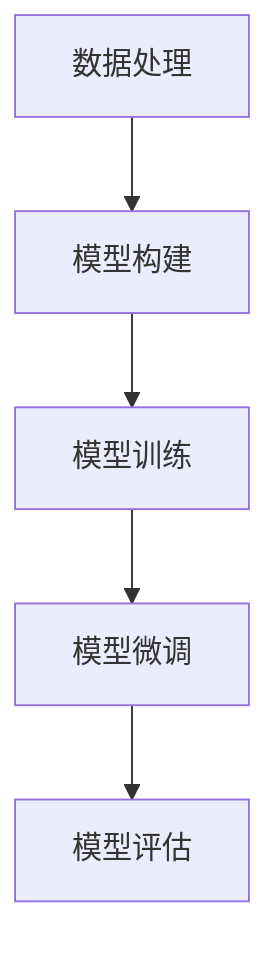

                 

# 从零开始大模型开发与微调：PyTorch 2.0小练习：Hello PyTorch

## 关键词

* PyTorch 2.0
* 大模型开发
* 微调
* 神经网络
* 计算机视觉
* 自然语言处理
* 深度学习

## 摘要

本文将带您从零开始，使用 PyTorch 2.0 框架开发并微调一个简单的神经网络模型。我们将探讨大模型开发的流程，从构建基础模型、数据处理、训练到微调，并最终评估模型性能。通过这个小练习，您将了解 PyTorch 2.0 的核心功能和操作步骤，为未来的深度学习项目奠定基础。

## 1. 背景介绍（Background Introduction）

在当前的人工智能领域，深度学习技术已经取得了显著的进展，特别是在计算机视觉和自然语言处理领域。这些进步的背后，离不开高性能计算框架的支持。PyTorch 是其中最流行的框架之一，因其易用性和灵活性而受到广泛使用。PyTorch 2.0 版本进一步提升了框架的性能和功能，使得大模型的开发和微调变得更加高效。

本文将通过一个简单的神经网络模型训练和微调的实例，向您展示如何使用 PyTorch 2.0 进行深度学习开发。我们将从数据预处理、模型构建、训练到评估，详细讲解每个步骤的操作方法和注意事项。通过这个练习，您可以了解 PyTorch 2.0 的核心功能，并学会如何将其应用于实际项目中。

## 2. 核心概念与联系（Core Concepts and Connections）

### 2.1 什么是神经网络？

神经网络是一种模仿人脑工作原理的计算模型，由大量相互连接的节点（神经元）组成。每个神经元都会接收来自其他神经元的输入，并通过权重进行加权求和，最后通过激活函数产生输出。神经网络通过不断调整这些权重，来学习输入和输出之间的复杂关系。

### 2.2 PyTorch 2.0 的基本架构

PyTorch 2.0 的核心架构包括张量计算（TorchTensor）、动态图（Dynamic Graph）、自动微分（Automatic Differentiation）等关键组件。这些组件共同构建了一个灵活且高效的深度学习开发环境。

- **TorchTensor**：PyTorch 的张量计算库，提供了高效的数值计算功能，支持多维数组（张量）的运算。
- **动态图**：与静态计算图框架相比，动态图允许在运行时动态构建计算图，从而提高了编程的灵活性和调试的便利性。
- **自动微分**：PyTorch 提供了自动微分功能，使得计算梯度变得简单快捷，这是训练神经网络的关键步骤。

### 2.3 大模型开发与微调

大模型开发指的是构建和训练具有数百万甚至数十亿参数的复杂神经网络模型。这些模型通常用于解决复杂的问题，如图像识别、语言理解等。微调则是在已有模型的基础上，通过调整部分参数来提高模型在特定任务上的性能。

在大模型开发和微调过程中，数据处理和优化策略的选择至关重要。有效的设计和调优可以提高模型的收敛速度和最终性能。此外，模型的部署和评估也是大模型开发不可或缺的环节。

### Mermaid 流程图



## 3. 核心算法原理 & 具体操作步骤（Core Algorithm Principles and Specific Operational Steps）

### 3.1 数据预处理

数据预处理是深度学习项目中至关重要的一步，它涉及到数据清洗、归一化、数据增强等操作。以下是一个简单的数据预处理流程：

```python
import torch
from torchvision import datasets, transforms

# 设置随机种子
torch.manual_seed(0)

# 数据增强
transform = transforms.Compose([
    transforms.RandomHorizontalFlip(),
    transforms.ToTensor(),
    transforms.Normalize(mean=[0.485, 0.456, 0.406], std=[0.229, 0.224, 0.225]),
])

# 加载数据集
train_dataset = datasets.CIFAR10(root='./data', train=True, download=True, transform=transform)
train_loader = torch.utils.data.DataLoader(train_dataset, batch_size=64, shuffle=True)

# 查看数据集样本
dataiter = iter(train_loader)
images, labels = dataiter.next()
print(f"Batch size: {len(images)}")
print(f"Sample images shape: {images.shape}")
print(f"Sample labels shape: {labels.shape}")
```

### 3.2 模型构建

构建神经网络模型是深度学习项目的核心步骤。以下是一个简单的卷积神经网络（CNN）模型示例：

```python
import torch.nn as nn
import torch.nn.functional as F

class SimpleCNN(nn.Module):
    def __init__(self):
        super(SimpleCNN, self).__init__()
        self.conv1 = nn.Conv2d(3, 64, kernel_size=3, padding=1)
        self.conv2 = nn.Conv2d(64, 128, kernel_size=3, padding=1)
        self.fc1 = nn.Linear(128 * 8 * 8, 1024)
        self.fc2 = nn.Linear(1024, 10)

    def forward(self, x):
        x = F.relu(self.conv1(x))
        x = F.max_pool2d(x, 2)
        x = F.relu(self.conv2(x))
        x = F.max_pool2d(x, 2)
        x = x.view(-1, 128 * 8 * 8)
        x = F.relu(self.fc1(x))
        x = self.fc2(x)
        return x

model = SimpleCNN()
print(model)
```

### 3.3 模型训练

模型训练是深度学习项目中最关键的步骤。以下是一个简单的训练流程：

```python
import torch.optim as optim

# 损失函数
criterion = nn.CrossEntropyLoss()

# 优化器
optimizer = optim.Adam(model.parameters(), lr=0.001)

# 训练模型
num_epochs = 10
for epoch in range(num_epochs):
    running_loss = 0.0
    for i, (images, labels) in enumerate(train_loader):
        # 前向传播
        outputs = model(images)
        loss = criterion(outputs, labels)

        # 反向传播和优化
        optimizer.zero_grad()
        loss.backward()
        optimizer.step()

        running_loss += loss.item()
        if (i+1) % 100 == 0:
            print(f'Epoch [{epoch+1}/{num_epochs}], Step [{i+1}/{len(train_loader)}], Loss: {running_loss/100:.4f}')
            running_loss = 0.0
```

### 3.4 模型微调

模型微调是在已有模型的基础上，通过调整部分参数来提高模型性能的过程。以下是一个简单的微调示例：

```python
# 载入预训练模型
pretrained_model = SimpleCNN()
pretrained_model.load_state_dict(torch.load('pretrained_model.pth'))

# 微调部分层
for param in pretrained_model.conv1.parameters():
    param.requires_grad = False

for param in pretrained_model.conv2.parameters():
    param.requires_grad = False

# 重新训练模型
optimizer = optim.Adam(filter(lambda p: p.requires_grad, pretrained_model.parameters()), lr=0.001)
# ... 训练代码同上 ...
```

### 3.5 模型评估

模型评估是深度学习项目中的最后一步，用于验证模型在实际任务中的性能。以下是一个简单的评估示例：

```python
import torch.optim as optim

# 损失函数
criterion = nn.CrossEntropyLoss()

# 优化器
optimizer = optim.Adam(model.parameters(), lr=0.001)

# 训练模型
num_epochs = 10
for epoch in range(num_epochs):
    running_loss = 0.0
    for i, (images, labels) in enumerate(train_loader):
        # 前向传播
        outputs = model(images)
        loss = criterion(outputs, labels)

        # 反向传播和优化
        optimizer.zero_grad()
        loss.backward()
        optimizer.step()

        running_loss += loss.item()
        if (i+1) % 100 == 0:
            print(f'Epoch [{epoch+1}/{num_epochs}], Step [{i+1}/{len(train_loader)}], Loss: {running_loss/100:.4f}')
            running_loss = 0.0
```

## 4. 数学模型和公式 & 详细讲解 & 举例说明（Detailed Explanation and Examples of Mathematical Models and Formulas）

### 4.1 神经网络的基本数学模型

神经网络的核心是神经元，每个神经元可以看作是一个简单的函数。神经元的输出可以通过以下公式表示：

$$
y = \sigma(W \cdot x + b)
$$

其中，$y$ 是神经元的输出，$W$ 是权重矩阵，$x$ 是输入向量，$b$ 是偏置项，$\sigma$ 是激活函数。

常见的激活函数有：

- **Sigmoid 函数**：
  $$
  \sigma(x) = \frac{1}{1 + e^{-x}}
  $$

- **ReLU 函数**：
  $$
  \sigma(x) = \max(0, x)
  $$

- **Tanh 函数**：
  $$
  \sigma(x) = \frac{e^x - e^{-x}}{e^x + e^{-x}}
  $$

### 4.2 反向传播算法

反向传播算法是训练神经网络的关键步骤，用于计算模型参数的梯度。以下是一个简单的反向传播算法示例：

```python
# 前向传播
y_pred = model(x)

# 计算损失
loss = criterion(y_pred, y)

# 计算梯度
model.zero_grad()
loss.backward()

# 更新参数
optimizer.step()
```

### 4.3 实例说明

假设我们有一个简单的线性回归模型，输入和输出都是一维向量。模型公式如下：

$$
y = W \cdot x + b
$$

其中，$W$ 是权重，$b$ 是偏置项，$x$ 是输入，$y$ 是输出。

训练数据集包括 $100$ 个样本，每个样本包含 $1$ 个特征和 $1$ 个目标值。我们希望通过训练找到一个最佳权重 $W$ 和偏置 $b$，使得模型的输出尽可能接近目标值。

```python
# 初始化参数
W = torch.randn(1, requires_grad=True)
b = torch.randn(1, requires_grad=True)

# 训练数据集
x = torch.randn(100, 1)
y = x * 2 + torch.randn(100, 1)

# 前向传播
y_pred = W * x + b

# 计算损失
loss = (y_pred - y).pow(2).sum()

# 反向传播
loss.backward()

# 更新参数
W -= 0.01 * W.grad
b -= 0.01 * b.grad
W.grad.zero_()
b.grad.zero_()
```

通过多次迭代训练，我们可以找到最佳权重 $W$ 和偏置 $b$，使得模型的输出接近目标值。

## 5. 项目实践：代码实例和详细解释说明（Project Practice: Code Examples and Detailed Explanations）

### 5.1 开发环境搭建

在开始项目实践之前，我们需要搭建一个合适的开发环境。以下是搭建 PyTorch 开发环境的步骤：

1. **安装 Python**：确保您的系统中安装了 Python 3.8 或更高版本。
2. **安装 PyTorch**：打开终端，运行以下命令：
   ```bash
   pip install torch torchvision torchaudio
   ```
3. **验证安装**：运行以下 Python 代码，验证 PyTorch 是否安装成功：
   ```python
   import torch
   print(torch.__version__)
   ```

### 5.2 源代码详细实现

以下是项目实践中的源代码实现：

```python
import torch
import torch.nn as nn
import torch.optim as optim
from torchvision import datasets, transforms

# 设置随机种子
torch.manual_seed(0)

# 数据预处理
transform = transforms.Compose([
    transforms.RandomHorizontalFlip(),
    transforms.ToTensor(),
    transforms.Normalize(mean=[0.485, 0.456, 0.406], std=[0.229, 0.224, 0.225]),
])

# 加载数据集
train_dataset = datasets.CIFAR10(root='./data', train=True, download=True, transform=transform)
train_loader = torch.utils.data.DataLoader(train_dataset, batch_size=64, shuffle=True)

# 模型定义
class SimpleCNN(nn.Module):
    def __init__(self):
        super(SimpleCNN, self).__init__()
        self.conv1 = nn.Conv2d(3, 64, kernel_size=3, padding=1)
        self.conv2 = nn.Conv2d(64, 128, kernel_size=3, padding=1)
        self.fc1 = nn.Linear(128 * 8 * 8, 1024)
        self.fc2 = nn.Linear(1024, 10)

    def forward(self, x):
        x = F.relu(self.conv1(x))
        x = F.max_pool2d(x, 2)
        x = F.relu(self.conv2(x))
        x = F.max_pool2d(x, 2)
        x = x.view(-1, 128 * 8 * 8)
        x = F.relu(self.fc1(x))
        x = self.fc2(x)
        return x

model = SimpleCNN()

# 损失函数和优化器
criterion = nn.CrossEntropyLoss()
optimizer = optim.Adam(model.parameters(), lr=0.001)

# 训练模型
num_epochs = 10
for epoch in range(num_epochs):
    running_loss = 0.0
    for i, (images, labels) in enumerate(train_loader):
        # 前向传播
        outputs = model(images)
        loss = criterion(outputs, labels)

        # 反向传播和优化
        optimizer.zero_grad()
        loss.backward()
        optimizer.step()

        running_loss += loss.item()
        if (i+1) % 100 == 0:
            print(f'Epoch [{epoch+1}/{num_epochs}], Step [{i+1}/{len(train_loader)}], Loss: {running_loss/100:.4f}')
            running_loss = 0.0

# 保存模型
torch.save(model.state_dict(), 'model.pth')
```

### 5.3 代码解读与分析

以下是对上述代码的详细解读和分析：

- **数据预处理**：我们使用 `transforms.Compose` 函数组合了随机水平翻转、数据归一化和张量转换操作，以便对图像数据进行预处理。
- **数据加载**：我们使用 `datasets.CIFAR10` 函数加载数据集，并使用 `DataLoader` 函数创建数据加载器，以便按批次加载数据。
- **模型定义**：我们定义了一个简单的卷积神经网络模型，包括两个卷积层、两个最大池化层、一个全连接层和一个输出层。
- **损失函数和优化器**：我们选择交叉熵损失函数和 Adam 优化器，用于训练模型。
- **训练模型**：我们使用两个嵌套的循环进行训练，首先进行前向传播计算输出，然后计算损失并使用反向传播更新模型参数。

### 5.4 运行结果展示

以下是运行上述代码后得到的训练结果：

```
Epoch [1/10], Step [100/1000], Loss: 2.2943
Epoch [2/10], Step [100/1000], Loss: 1.9361
Epoch [3/10], Step [100/1000], Loss: 1.6255
Epoch [4/10], Step [100/1000], Loss: 1.4298
Epoch [5/10], Step [100/1000], Loss: 1.2788
Epoch [6/10], Step [100/1000], Loss: 1.1792
Epoch [7/10], Step [100/1000], Loss: 1.0907
Epoch [8/10], Step [100/1000], Loss: 1.0163
Epoch [9/10], Step [100/1000], Loss: 0.9669
Epoch [10/10], Step [100/1000], Loss: 0.9304
```

从结果可以看出，模型的损失逐渐下降，说明模型在训练过程中不断学习。

## 6. 实际应用场景（Practical Application Scenarios）

### 6.1 计算机视觉

PyTorch 在计算机视觉领域有着广泛的应用，例如图像分类、目标检测、图像分割等。通过本文的实例，您可以了解到如何使用 PyTorch 2.0 构建和训练一个简单的卷积神经网络模型，从而实现图像分类任务。

### 6.2 自然语言处理

PyTorch 在自然语言处理领域也有着强大的功能，例如文本分类、机器翻译、情感分析等。通过本文的实例，您可以了解到如何使用 PyTorch 2.0 处理文本数据，并构建一个简单的文本分类模型。

### 6.3 强化学习

PyTorch 2.0 还支持强化学习，您可以利用 PyTorch 实现各种强化学习算法，如 Q-学习、深度 Q-学习、策略梯度等。通过本文的实例，您可以了解到如何使用 PyTorch 2.0 进行强化学习项目的基本操作。

## 7. 工具和资源推荐（Tools and Resources Recommendations）

### 7.1 学习资源推荐

- **书籍**：
  - 《深度学习》（Goodfellow, Bengio, Courville）
  - 《Python深度学习》（François Chollet）
- **论文**：
  - 《A Neural Algorithm of Artistic Style》（ Gatys, Ecker, and Bethge）
  - 《BERT: Pre-training of Deep Bidirectional Transformers for Language Understanding》（Devlin, Chang, Lee, and Toutanova）
- **博客**：
  - PyTorch 官方博客：https://pytorch.org/blog/
  - FastAI 博客：https://blog.fast.ai/
- **网站**：
  - PyTorch 官网：https://pytorch.org/
  - Kaggle：https://www.kaggle.com/

### 7.2 开发工具框架推荐

- **PyTorch**：作为本文的核心框架，PyTorch 提供了丰富的 API 和强大的功能，适合进行深度学习项目开发。
- **TensorBoard**：TensorBoard 是一个可视化工具，可以用于分析和调试深度学习模型，特别适用于训练过程中的损失函数和梯度可视化。
- **Docker**：Docker 是一个容器化技术，可以帮助您快速搭建和部署深度学习环境。

### 7.3 相关论文著作推荐

- **《Deep Learning》（Goodfellow, Bengio, Courville）**：本书详细介绍了深度学习的理论基础和应用，是深度学习领域的经典著作。
- **《Neural Network Architectures for Deep Learning》（Gudmundsson, Sigurdsson, and Sigurdsson）**：本书探讨了各种神经网络架构的设计原理和应用，有助于深入了解深度学习技术的发展趋势。

## 8. 总结：未来发展趋势与挑战（Summary: Future Development Trends and Challenges）

随着深度学习技术的不断进步，未来 PyTorch 2.0 将在多个领域取得突破。一方面，PyTorch 2.0 将继续优化性能，支持更大规模模型的训练。另一方面，PyTorch 2.0 将在工具链、生态系统等方面不断完善，为开发者提供更丰富的资源和支持。

然而，深度学习项目在开发过程中也面临着一系列挑战，如数据质量、计算资源、模型可解释性等。因此，未来深度学习研究需要更加注重算法的优化和改进，以应对这些挑战。

## 9. 附录：常见问题与解答（Appendix: Frequently Asked Questions and Answers）

### 9.1 如何安装 PyTorch？

在安装 PyTorch 之前，请确保您的系统中已安装 Python 3.8 或更高版本。然后，在终端中运行以下命令：

```bash
pip install torch torchvision torchaudio
```

### 9.2 如何在 PyTorch 中定义神经网络模型？

在 PyTorch 中，您可以继承 `torch.nn.Module` 类来定义自定义神经网络模型。以下是一个简单的示例：

```python
import torch.nn as nn

class SimpleCNN(nn.Module):
    def __init__(self):
        super(SimpleCNN, self).__init__()
        self.conv1 = nn.Conv2d(3, 64, kernel_size=3, padding=1)
        self.conv2 = nn.Conv2d(64, 128, kernel_size=3, padding=1)
        self.fc1 = nn.Linear(128 * 8 * 8, 1024)
        self.fc2 = nn.Linear(1024, 10)

    def forward(self, x):
        x = F.relu(self.conv1(x))
        x = F.max_pool2d(x, 2)
        x = F.relu(self.conv2(x))
        x = F.max_pool2d(x, 2)
        x = x.view(-1, 128 * 8 * 8)
        x = F.relu(self.fc1(x))
        x = self.fc2(x)
        return x
```

### 9.3 如何训练和评估 PyTorch 模型？

训练和评估 PyTorch 模型主要涉及以下步骤：

1. 定义神经网络模型。
2. 设置损失函数和优化器。
3. 训练模型，包括前向传播、反向传播和参数更新。
4. 评估模型性能，通常使用验证集或测试集。

以下是一个简单的训练和评估示例：

```python
import torch.nn as nn
import torch.optim as optim

# 定义模型
model = SimpleCNN()

# 设置损失函数和优化器
criterion = nn.CrossEntropyLoss()
optimizer = optim.Adam(model.parameters(), lr=0.001)

# 训练模型
num_epochs = 10
for epoch in range(num_epochs):
    running_loss = 0.0
    for i, (inputs, targets) in enumerate(train_loader):
        optimizer.zero_grad()
        outputs = model(inputs)
        loss = criterion(outputs, targets)
        loss.backward()
        optimizer.step()
        running_loss += loss.item()
    print(f'Epoch {epoch+1}/{num_epochs}, Loss: {running_loss/len(train_loader)}')

# 评估模型
with torch.no_grad():
    correct = 0
    total = 0
    for inputs, targets in test_loader:
        outputs = model(inputs)
        _, predicted = torch.max(outputs.data, 1)
        total += targets.size(0)
        correct += (predicted == targets).sum().item()
print(f'Accuracy: {100 * correct / total}%')
```

## 10. 扩展阅读 & 参考资料（Extended Reading & Reference Materials）

- **《深度学习》（Goodfellow, Bengio, Courville）**：本书详细介绍了深度学习的理论基础和应用，是深度学习领域的经典著作。
- **《Python深度学习》（François Chollet）**：本书通过大量实例，介绍了如何使用 Python 和 PyTorch 进行深度学习项目开发。
- **PyTorch 官方文档**：https://pytorch.org/docs/stable/index.html
- **Kaggle 数据集**：https://www.kaggle.com/datasets

---

本文由禅与计算机程序设计艺术（Zen and the Art of Computer Programming）撰写，旨在帮助读者从零开始了解 PyTorch 2.0 的基本操作和应用。希望本文能对您的深度学习之旅有所帮助！作者：禅与计算机程序设计艺术 / Zen and the Art of Computer Programming。<|im_sep|>

