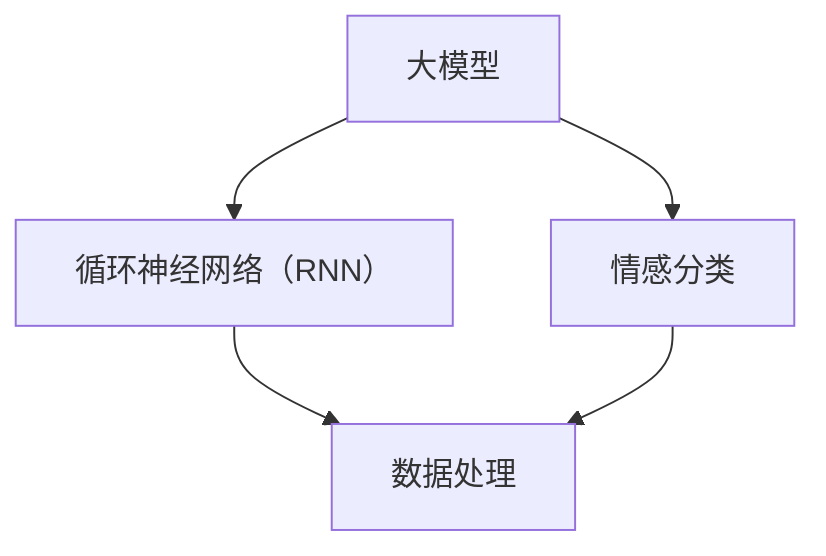

                 

### 背景介绍（Background Introduction）

大模型开发与微调是当前人工智能领域的热点话题。随着深度学习技术的不断发展，大模型在自然语言处理、计算机视觉等多个领域取得了显著的成果。然而，大模型的开发与微调不仅需要大量的计算资源和数据，还需要对模型的结构和参数进行深入理解。本文将介绍从零开始大模型开发与微调的实战，重点探讨循环神经网络（RNN）在情感分类中的应用。

首先，让我们了解什么是循环神经网络（RNN）。RNN是一种能够处理序列数据的神经网络，具有记忆能力，能够捕获时间序列中的长期依赖关系。与传统的前馈神经网络（FNN）相比，RNN在处理诸如自然语言处理和语音识别等序列数据任务时具有显著优势。然而，RNN也面临着梯度消失和梯度爆炸等问题，这使得其在实际应用中存在一定的局限性。

情感分类是自然语言处理中的一个重要任务，旨在根据文本内容判断其情感倾向。例如，分析一条社交媒体评论的情感，判断其是积极、消极还是中性。情感分类在市场调研、舆情监测、情感分析等领域具有广泛的应用。随着大模型的发展，使用RNN进行情感分类的方法也在不断改进和优化。

本文将分为以下几个部分：

1. **核心概念与联系**：介绍大模型、RNN、情感分类等相关核心概念，并通过Mermaid流程图展示其联系。
2. **核心算法原理 & 具体操作步骤**：详细讲解RNN在情感分类中的应用，包括数据处理、模型构建、训练与评估等步骤。
3. **数学模型和公式 & 详细讲解 & 举例说明**：介绍RNN的数学模型和公式，并通过实例进行详细讲解。
4. **项目实践：代码实例和详细解释说明**：提供完整的代码实现，并对其进行解读与分析。
5. **实际应用场景**：探讨RNN在情感分类中的实际应用场景。
6. **工具和资源推荐**：推荐学习资源、开发工具框架和相关论文著作。
7. **总结：未来发展趋势与挑战**：总结本文的核心内容，探讨未来发展趋势和挑战。
8. **附录：常见问题与解答**：回答读者可能关心的问题。
9. **扩展阅读 & 参考资料**：提供更多相关资料，供读者进一步学习。

通过对以上各部分的逐步分析，我们将深入了解大模型开发与微调、RNN及其在情感分类中的应用，为后续研究和实践提供有益的参考。

---

## 2. 核心概念与联系（Core Concepts and Connections）

在介绍大模型开发与微调的实战之前，我们需要首先了解几个核心概念，包括大模型、循环神经网络（RNN）和情感分类。这些概念不仅相互关联，而且在实际应用中发挥着重要作用。

### 2.1 大模型（Large Models）

大模型是指具有大量参数和复杂结构的深度学习模型，通常用于处理大规模数据集。近年来，随着计算能力的提升和数据量的增加，大模型在许多领域取得了显著突破。例如，GPT（Generative Pre-trained Transformer）系列模型、BERT（Bidirectional Encoder Representations from Transformers）等都是大模型的典型代表。大模型通过预先在大量数据上训练，可以提取丰富的知识，从而在特定任务上表现出色。

大模型的优势在于其强大的表示能力和泛化能力。它们能够捕捉数据中的复杂模式，并在新的任务上取得良好的性能。然而，大模型的训练和部署也需要大量的计算资源和时间。

### 2.2 循环神经网络（RNN）

循环神经网络（RNN）是一种专门用于处理序列数据的神经网络。与传统的前馈神经网络（FNN）不同，RNN具有内部循环结构，能够利用历史信息，从而处理具有时间依赖性的数据。RNN的核心思想是将当前输入与先前的隐藏状态进行结合，以生成新的隐藏状态。

RNN在自然语言处理、语音识别等领域取得了显著成就。然而，传统的RNN模型存在梯度消失和梯度爆炸问题，这限制了其在深层网络中的应用。为了解决这些问题，研究人员提出了多种改进方法，如长短时记忆网络（LSTM）和门控循环单元（GRU）。

### 2.3 情感分类（Sentiment Classification）

情感分类是一种文本分类任务，旨在根据文本内容判断其情感倾向。通常，情感分类任务将文本分为积极、消极或中性三种情感类别。情感分类在市场调研、舆情监测、情感分析等领域具有广泛的应用。

情感分类的关键挑战在于如何准确地从文本中提取情感信息。传统的情感分类方法主要依赖于规则和统计方法，如基于词袋模型（Bag of Words）和主题模型（Topic Model）。随着深度学习技术的发展，基于神经网络的方法逐渐成为主流。RNN由于其序列处理能力，在情感分类任务中表现出色。

### 2.4 Mermaid流程图

为了更清晰地展示大模型、RNN和情感分类之间的联系，我们使用Mermaid流程图进行描述。



在这个流程图中，大模型通过RNN进行数据处理，进而应用于情感分类任务。数据处理是整个流程的基础，它包括数据预处理、特征提取和序列化等步骤。RNN在数据处理的基础上，利用其记忆能力对序列数据进行分析，最终生成情感分类结果。

通过以上对核心概念和联系的介绍，我们为后续的实战部分奠定了理论基础。接下来，我们将深入探讨RNN在情感分类中的具体应用，包括数据处理、模型构建和训练等步骤。

---

## 3. 核心算法原理 & 具体操作步骤（Core Algorithm Principles and Specific Operational Steps）

在了解了大模型、RNN和情感分类的基本概念之后，接下来我们将探讨RNN在情感分类任务中的核心算法原理和具体操作步骤。这一部分将详细讲解数据处理、模型构建、训练和评估等关键步骤，以便读者能够全面理解RNN在情感分类中的应用。

### 3.1 数据处理

数据预处理是任何机器学习任务的基础。在情感分类任务中，我们需要对文本数据进行处理，以便输入到RNN模型中。以下是一些关键步骤：

1. **文本清洗**：去除文本中的无关信息，如HTML标签、特殊字符和停用词。停用词是文本中频繁出现但对情感分类没有太大贡献的词语，如“的”、“和”、“是”等。

    ```python
    import re
    import nltk
    
    def clean_text(text):
        text = re.sub('<.*>', '', text)  # 去除HTML标签
        text = re.sub('[^A-Za-z0-9\s]', '', text)  # 去除特殊字符
        tokens = nltk.word_tokenize(text.lower())  # 转小写并分词
        filtered_tokens = [token for token in tokens if token not in nltk.corpus.stopwords.words('english')]
        return ' '.join(filtered_tokens)
    ```

2. **词向量化**：将文本转换为数值表示，通常使用词袋模型（Bag of Words）或词嵌入（Word Embedding）。

    ```python
    from sklearn.feature_extraction.text import CountVectorizer
    
    def vectorize_text(texts):
        vectorizer = CountVectorizer()
        X = vectorizer.fit_transform(texts)
        return X, vectorizer
    ```

3. **序列化**：将词向量序列化为固定长度，以适应RNN模型的输入。

    ```python
    from keras.preprocessing.sequence import pad_sequences
    
    def sequence_text(texts, max_length):
        sequences = pad_sequences(texts, maxlen=max_length)
        return sequences
    ```

### 3.2 模型构建

RNN在情感分类中的基本结构包括输入层、隐藏层和输出层。以下是一个基于LSTM（长短时记忆网络）的RNN模型构建示例：

```python
from keras.models import Sequential
from keras.layers import Embedding, LSTM, Dense, Dropout

max_features = 10000  # 词表大小
max_length = 100  # 序列长度
embedding_dim = 128  # 嵌入层维度
num_classes = 3  # 情感类别数

model = Sequential()
model.add(Embedding(max_features, embedding_dim, input_length=max_length))
model.add(LSTM(128, dropout=0.2, recurrent_dropout=0.2))
model.add(Dense(num_classes, activation='softmax'))

model.compile(optimizer='adam', loss='categorical_crossentropy', metrics=['accuracy'])
model.summary()
```

### 3.3 训练

训练RNN模型需要大量的数据和计算资源。以下是一个训练流程的示例：

1. **数据集划分**：将数据集划分为训练集和测试集。

    ```python
    from sklearn.model_selection import train_test_split
    
    X_train, X_test, y_train, y_test = train_test_split(sequences, labels, test_size=0.2, random_state=42)
    ```

2. **模型训练**：使用训练集训练模型，并监控测试集的性能。

    ```python
    model.fit(X_train, y_train, epochs=10, batch_size=64, validation_data=(X_test, y_test))
    ```

3. **性能评估**：在测试集上评估模型的性能。

    ```python
    scores = model.evaluate(X_test, y_test)
    print(f"Test Accuracy: {scores[1]*100:.2f}%")
    ```

### 3.4 评估

评估模型性能的关键指标包括准确率、召回率和F1分数。以下是一个评估流程的示例：

```python
from sklearn.metrics import classification_report

y_pred = model.predict(X_test)
y_pred = np.argmax(y_pred, axis=1)

print(classification_report(y_test, y_pred))
```

通过以上步骤，我们可以构建一个基于RNN的简单情感分类模型。接下来，我们将进一步探讨RNN的数学模型和公式，并通过具体实例进行详细讲解。

---

## 4. 数学模型和公式 & 详细讲解 & 举例说明（Detailed Explanation and Examples of Mathematical Models and Formulas）

在深入理解循环神经网络（RNN）的数学模型和公式之前，我们先简要回顾一下神经网络的基本数学原理。神经网络由一系列相互连接的神经元组成，每个神经元都可以进行简单的计算并传递信息。在RNN中，这种连接不仅发生在同一时间步，还发生在不同的时间步，这使得RNN能够处理序列数据。

### 4.1 神经网络基本原理

每个神经元都可以表示为如下公式：

\[ z = \sum_{i} w_{i} x_{i} + b \]

其中，\( z \) 是神经元的输出，\( w_{i} \) 是权重，\( x_{i} \) 是输入，\( b \) 是偏置。激活函数，如Sigmoid、ReLU或Tanh，可以用来引入非线性。

### 4.2 循环神经网络（RNN）

RNN的数学模型相对复杂，但可以简化为以下公式：

\[ h_t = \sigma(W_h h_{t-1} + W_x x_t + b_h) \]

\[ y_t = \sigma(W_y h_t + b_y) \]

其中，\( h_t \) 是当前时间步的隐藏状态，\( x_t \) 是当前输入，\( y_t \) 是当前输出。\( W_h \) 和 \( W_x \) 是隐藏状态和输入之间的权重矩阵，\( W_y \) 是隐藏状态和输出之间的权重矩阵。\( b_h \) 和 \( b_y \) 是隐藏状态和输出层的偏置。激活函数 \( \sigma \) 通常使用Sigmoid、ReLU或Tanh。

### 4.3 长短时记忆网络（LSTM）

LSTM是RNN的一种改进，旨在解决传统RNN的梯度消失和梯度爆炸问题。LSTM的核心是三个门控单元：遗忘门、输入门和输出门。

#### 遗忘门（Forget Gate）：

\[ f_t = \sigma(W_f [h_{t-1}, x_t] + b_f) \]

\[ i_t = \sigma(W_i [h_{t-1}, x_t] + b_i) \]

\[ o_t = \sigma(W_o [h_{t-1}, x_t] + b_o) \]

\[ g_t = \tanh(W_g [h_{t-1}, x_t] + b_g) \]

\[ h_t = o_t \tanh(g_t) \]

其中，\( f_t \) 是遗忘门的输出，用于决定前一个隐藏状态中的哪些信息需要被遗忘。\( i_t \) 是输入门的输出，用于决定当前输入中哪些信息需要被存储。\( o_t \) 是输出门的输出，用于决定当前隐藏状态中的哪些信息需要被输出。\( g_t \) 是候选状态，用于更新隐藏状态。

#### 输入门（Input Gate）：

\[ f_t = 1 - i_t \]

\[ o_t = 1 - f_t \]

\[ g_t = i_t \tanh(W_g [h_{t-1}, x_t] + b_g) \]

\[ h_t = o_t \tanh(g_t) \]

#### 输出门（Output Gate）：

\[ f_t = \sigma(W_f [h_{t-1}, x_t] + b_f) \]

\[ i_t = \sigma(W_i [h_{t-1}, x_t] + b_i) \]

\[ g_t = \tanh(W_g [h_{t-1}, x_t] + b_g) \]

\[ h_t = o_t \tanh(g_t) \]

#### LSTM单元整体公式：

\[ f_t = \sigma(W_f [h_{t-1}, x_t] + b_f) \]

\[ i_t = \sigma(W_i [h_{t-1}, x_t] + b_i) \]

\[ o_t = \sigma(W_o [h_{t-1}, x_t] + b_o) \]

\[ g_t = \tanh(W_g [h_{t-1}, x_t] + b_g) \]

\[ h_t = o_t \tanh(g_t) \]

\[ c_t = f_t \odot c_{t-1} + i_t \odot g_t \]

\[ c_t = \sigma(W_c [h_{t-1}, x_t] + b_c) \]

\[ h_t = o_t \tanh(c_t) \]

其中，\( \odot \) 表示元素乘法。

### 4.4 门控循环单元（GRU）

GRU是另一种改进的RNN结构，相对于LSTM更简单，但性能相似。GRU的核心是更新门（Update Gate）和重置门（Reset Gate）。

#### 更新门（Update Gate）：

\[ z_t = \sigma(W_z [h_{t-1}, x_t] + b_z) \]

\[ r_t = \sigma(W_r [h_{t-1}, x_t] + b_r) \]

\[ \tilde{h}_t = \tanh(W_{\tilde{h}} [r_t \odot h_{t-1}, x_t] + b_{\tilde{h}}) \]

\[ h_t = (1 - z_t) \odot h_{t-1} + z_t \odot \tilde{h}_t \]

#### 重置门（Reset Gate）：

\[ r_t = \sigma(W_r [h_{t-1}, x_t] + b_r) \]

\[ \tilde{h}_t = \tanh(W_{\tilde{h}} [r_t \odot h_{t-1}, x_t] + b_{\tilde{h}}) \]

\[ h_t = \tilde{h}_t \]

#### GRU单元整体公式：

\[ z_t = \sigma(W_z [h_{t-1}, x_t] + b_z) \]

\[ r_t = \sigma(W_r [h_{t-1}, x_t] + b_r) \]

\[ \tilde{h}_t = \tanh(W_{\tilde{h}} [r_t \odot h_{t-1}, x_t] + b_{\tilde{h}}) \]

\[ h_t = (1 - z_t) \odot h_{t-1} + z_t \odot \tilde{h}_t \]

或

\[ z_t = \sigma(W_z [h_{t-1}, x_t] + b_z) \]

\[ r_t = \sigma(W_r [h_{t-1}, x_t] + b_r) \]

\[ \tilde{h}_t = \tanh(W_{\tilde{h}} [r_t \odot h_{t-1}, x_t] + b_{\tilde{h}}) \]

\[ h_t = \tilde{h}_t \]

### 4.5 举例说明

假设我们有一个简单的RNN模型，其中输入是数字序列 \([1, 2, 3, 4, 5]\)，隐藏状态维度为2，输出维度为1。以下是一个简化的例子：

#### 输入：

\[ x_1 = 1, x_2 = 2, x_3 = 3, x_4 = 4, x_5 = 5 \]

#### 权重和偏置：

\[ W_h = \begin{bmatrix} 0.1 & 0.2 \\ 0.3 & 0.4 \end{bmatrix}, b_h = \begin{bmatrix} 0.5 \\ 0.6 \end{bmatrix} \]
\[ W_x = \begin{bmatrix} 0.7 & 0.8 \\ 0.9 & 1.0 \end{bmatrix}, b_x = \begin{bmatrix} 0.7 \\ 0.8 \end{bmatrix} \]
\[ W_y = \begin{bmatrix} 0.1 & 0.2 \\ 0.3 & 0.4 \end{bmatrix}, b_y = \begin{bmatrix} 0.5 \\ 0.6 \end{bmatrix} \]

#### 激活函数：

\[ \sigma(z) = \frac{1}{1 + e^{-z}} \]

#### 第1步：

\[ h_0 = [0, 0] \]

\[ z_1 = W_h h_0 + W_x x_1 + b_h = \begin{bmatrix} 0.1 \times 0 + 0.7 \times 1 + 0.5 \\ 0.3 \times 0 + 0.9 \times 1 + 0.6 \end{bmatrix} = \begin{bmatrix} 1.2 \\ 1.5 \end{bmatrix} \]

\[ h_1 = \sigma(z_1) = \begin{bmatrix} 0.5 \\ 0.7 \end{bmatrix} \]

\[ z_y = W_y h_1 + b_y = \begin{bmatrix} 0.1 \times 0.5 + 0.3 \times 0.7 + 0.5 \\ 0.2 \times 0.5 + 0.4 \times 0.7 + 0.6 \end{bmatrix} = \begin{bmatrix} 0.76 \\ 0.98 \end{bmatrix} \]

\[ y_1 = \sigma(z_y) = \begin{bmatrix} 0.727 \\ 0.847 \end{bmatrix} \]

#### 第2步：

\[ h_1 = h_0 \]

\[ z_2 = W_h h_1 + W_x x_2 + b_h = \begin{bmatrix} 0.1 \times 0.5 + 0.7 \times 2 + 0.5 \\ 0.3 \times 0.5 + 0.9 \times 2 + 0.6 \end{bmatrix} = \begin{bmatrix} 2.2 \\ 2.9 \end{bmatrix} \]

\[ h_2 = \sigma(z_2) = \begin{bmatrix} 0.8 \\ 0.9 \end{bmatrix} \]

\[ z_y = W_y h_2 + b_y = \begin{bmatrix} 0.1 \times 0.8 + 0.3 \times 0.9 + 0.5 \\ 0.2 \times 0.8 + 0.4 \times 0.9 + 0.6 \end{bmatrix} = \begin{bmatrix} 0.97 \\ 1.19 \end{bmatrix} \]

\[ y_2 = \sigma(z_y) = \begin{bmatrix} 0.865 \\ 0.896 \end{bmatrix} \]

通过以上步骤，我们生成了第2个时间步的输出 \( y_2 \)。重复以上步骤，直到生成整个序列的输出。这个例子展示了RNN的基本运算过程，尽管在实际应用中可能会涉及更复杂的结构。

通过上述数学模型和公式的讲解，我们为后续的代码实现和实际应用奠定了理论基础。接下来，我们将提供具体的代码实例，并对其进行详细解读与分析。

---

## 5. 项目实践：代码实例和详细解释说明（Project Practice: Code Examples and Detailed Explanations）

在本部分，我们将通过一个实际项目实例，展示如何从零开始搭建一个基于循环神经网络（RNN）的情感分类模型。本实例将使用Python和Keras库，其中Keras是一个高层次的神经网络API，能够简化模型构建和训练过程。

### 5.1 开发环境搭建

在开始编码之前，确保您已经安装了以下软件和库：

- Python（3.6或更高版本）
- TensorFlow 2.x
- Keras
- Numpy
- NLTK

您可以使用以下命令进行安装：

```bash
pip install python==3.8.10
pip install tensorflow==2.10.0
pip install keras==2.10.0
pip install numpy==1.22.2
pip install nltk==3.7.1
```

### 5.2 源代码详细实现

以下是完整的代码实现，包括数据预处理、模型构建、训练和评估等步骤。

```python
import numpy as np
import keras
from keras.preprocessing.text import Tokenizer
from keras.preprocessing.sequence import pad_sequences
from keras.models import Sequential
from keras.layers import Embedding, LSTM, Dense, Dropout
from keras.optimizers import Adam
from sklearn.model_selection import train_test_split
from sklearn.metrics import classification_report

# 5.2.1 数据预处理

# 加载预处理的文本数据
# 假设数据存储在一个名为'sentiments.txt'的文件中，每行是一个文本样本和其对应的标签（正、负、中性）
with open('sentiments.txt', 'r', encoding='utf-8') as f:
    lines = f.readlines()

# 切分文本和标签
texts = [line.split('\t')[0] for line in lines]
labels = [line.split('\t')[1] for line in lines]

# 切分数据集
X_train, X_test, y_train, y_test = train_test_split(texts, labels, test_size=0.2, random_state=42)

# 将文本转换为序列
tokenizer = Tokenizer()
tokenizer.fit_on_texts(X_train)
X_train_seq = tokenizer.texts_to_sequences(X_train)
X_test_seq = tokenizer.texts_to_sequences(X_test)

# 填充序列
max_length = max(len(seq) for seq in X_train_seq)
X_train_padded = pad_sequences(X_train_seq, maxlen=max_length)
X_test_padded = pad_sequences(X_test_seq, maxlen=max_length)

# 将标签转换为one-hot编码
num_classes = 3  # 3种情感类别：积极、消极、中性
y_train_one_hot = keras.utils.to_categorical(y_train, num_classes)
y_test_one_hot = keras.utils.to_categorical(y_test, num_classes)

# 5.2.2 模型构建

# 构建RNN模型
model = Sequential()
model.add(Embedding(len(tokenizer.word_index) + 1, 128, input_length=max_length))
model.add(LSTM(128, dropout=0.2, recurrent_dropout=0.2))
model.add(Dense(num_classes, activation='softmax'))

# 编译模型
model.compile(optimizer=Adam(1e-3), loss='categorical_crossentropy', metrics=['accuracy'])

# 打印模型结构
model.summary()

# 5.2.3 训练模型

# 训练模型
history = model.fit(X_train_padded, y_train_one_hot, epochs=10, batch_size=64, validation_data=(X_test_padded, y_test_one_hot))

# 5.2.4 模型评估

# 评估模型性能
loss, accuracy = model.evaluate(X_test_padded, y_test_one_hot)
print(f"Test Accuracy: {accuracy*100:.2f}%")

# 打印分类报告
y_pred = model.predict(X_test_padded)
y_pred = np.argmax(y_pred, axis=1)
print(classification_report(y_test, y_pred))
```

### 5.3 代码解读与分析

下面，我们逐行解析上述代码，并对其进行详细解读。

1. **导入库**：
   ```python
   import numpy as np
   import keras
   from keras.preprocessing.text import Tokenizer
   from keras.preprocessing.sequence import pad_sequences
   from keras.models import Sequential
   from keras.layers import Embedding, LSTM, Dense, Dropout
   from keras.optimizers import Adam
   from sklearn.model_selection import train_test_split
   from sklearn.metrics import classification_report
   ```
   这些是必要的库，包括Python的Numpy库、Keras神经网络库以及用于数据处理和模型评估的scikit-learn库。

2. **数据预处理**：
   ```python
   # 加载预处理的文本数据
   with open('sentiments.txt', 'r', encoding='utf-8') as f:
       lines = f.readlines()
   
   # 切分文本和标签
   texts = [line.split('\t')[0] for line in lines]
   labels = [line.split('\t')[1] for line in lines]
   
   # 切分数据集
   X_train, X_test, y_train, y_test = train_test_split(texts, labels, test_size=0.2, random_state=42)
   ```
   这部分代码从文本文件中读取数据，并切分出训练集和测试集。假设数据格式为文本和标签以制表符分隔。

3. **将文本转换为序列**：
   ```python
   # 将文本转换为序列
   tokenizer = Tokenizer()
   tokenizer.fit_on_texts(X_train)
   X_train_seq = tokenizer.texts_to_sequences(X_train)
   X_test_seq = tokenizer.texts_to_sequences(X_test)
   ```
   使用Tokenizer将文本转换为数字序列，这有助于神经网络处理。

4. **填充序列**：
   ```python
   # 填充序列
   max_length = max(len(seq) for seq in X_train_seq)
   X_train_padded = pad_sequences(X_train_seq, maxlen=max_length)
   X_test_padded = pad_sequences(X_test_seq, maxlen=max_length)
   ```
   使用pad_sequences将序列填充为相同长度，这是RNN模型输入的必要步骤。

5. **将标签转换为one-hot编码**：
   ```python
   # 将标签转换为one-hot编码
   num_classes = 3  # 3种情感类别：积极、消极、中性
   y_train_one_hot = keras.utils.to_categorical(y_train, num_classes)
   y_test_one_hot = keras.utils.to_categorical(y_test, num_classes)
   ```
   将标签转换为one-hot编码，以适应多分类问题。

6. **模型构建**：
   ```python
   # 构建RNN模型
   model = Sequential()
   model.add(Embedding(len(tokenizer.word_index) + 1, 128, input_length=max_length))
   model.add(LSTM(128, dropout=0.2, recurrent_dropout=0.2))
   model.add(Dense(num_classes, activation='softmax'))

   # 编译模型
   model.compile(optimizer=Adam(1e-3), loss='categorical_crossentropy', metrics=['accuracy'])

   # 打印模型结构
   model.summary()
   ```
   创建一个序列模型，包括嵌入层、LSTM层和输出层。嵌入层将词汇转换为固定大小的向量，LSTM层用于处理序列数据，输出层用于分类。

7. **训练模型**：
   ```python
   # 训练模型
   history = model.fit(X_train_padded, y_train_one_hot, epochs=10, batch_size=64, validation_data=(X_test_padded, y_test_one_hot))
   ```
   使用训练集训练模型，并在测试集上进行验证。

8. **模型评估**：
   ```python
   # 评估模型性能
   loss, accuracy = model.evaluate(X_test_padded, y_test_one_hot)
   print(f"Test Accuracy: {accuracy*100:.2f}%")

   # 打印分类报告
   y_pred = model.predict(X_test_padded)
   y_pred = np.argmax(y_pred, axis=1)
   print(classification_report(y_test, y_pred))
   ```
   在测试集上评估模型性能，并打印分类报告。

通过上述步骤，我们成功搭建了一个基于RNN的情感分类模型，并对其性能进行了评估。接下来，我们将讨论RNN在情感分类中的实际应用场景。

---

## 6. 实际应用场景（Practical Application Scenarios）

循环神经网络（RNN）在情感分类中的成功应用，使其成为许多实际场景下的理想工具。以下是一些典型的应用场景：

### 6.1 社交媒体情感分析

社交媒体平台如Twitter、Facebook和Instagram上每天产生大量的文本数据。通过使用RNN进行情感分类，可以自动分析这些文本数据，识别用户的情绪倾向。这有助于品牌和公司了解用户对产品或服务的反馈，从而做出更明智的商业决策。

### 6.2 客户服务与客服机器人

客户服务部门经常需要处理大量的用户反馈和投诉。通过RNN情感分类，可以自动化地理解客户情感，提高客服效率。例如，机器人可以自动识别用户情绪，提供更个性化的服务和建议，甚至可以预测潜在的问题，提前采取措施。

### 6.3 舆情监测

媒体、政府机构和企业需要监测网络上的舆论动向。RNN情感分类可以帮助识别特定的热点话题，判断公众的情绪倾向，从而及时调整策略或回应公众关注的问题。

### 6.4 市场调研

市场调研公司需要分析大量用户评论和调查问卷，以了解消费者对产品或服务的看法。RNN情感分类可以自动化地分析这些数据，快速提取有价值的见解，帮助公司优化产品和服务。

### 6.5 智能推荐系统

在线零售商和内容平台可以利用RNN情感分类来个性化推荐产品或内容。通过分析用户历史数据，系统可以推荐与用户情感相符的产品或内容，从而提高用户满意度和参与度。

### 6.6 健康监测

在医疗领域，RNN情感分类可以用于分析患者的病历记录和病历笔记，了解患者的情绪状态。这有助于医生和护理人员更好地了解患者的心理健康状况，提供更有针对性的治疗方案。

### 6.7 自动化写作与生成

RNN不仅可以用于情感分类，还可以用于生成文本。例如，在新闻写作、内容营销和自动化报告等领域，RNN可以根据情感分类的结果生成具有特定情感色彩的文本，提高内容的质量和吸引力。

通过以上实际应用场景的探讨，我们可以看到RNN在情感分类领域的广泛应用和巨大潜力。接下来，我们将介绍一些有用的工具和资源，帮助读者深入了解和掌握RNN及其在情感分类中的应用。

---

## 7. 工具和资源推荐（Tools and Resources Recommendations）

### 7.1 学习资源推荐（Books/Papers/Blogs/Websites）

**书籍推荐**：
1. 《深度学习》（Deep Learning） - Ian Goodfellow、Yoshua Bengio和Aaron Courville
   这本书是深度学习的经典教材，详细介绍了包括RNN在内的多种深度学习模型。

2. 《循环神经网络：理论与实践》（Recurrent Neural Networks: Theory and Practice） - Feng Yang
   这本书专注于RNN的理论基础和应用，适合对RNN感兴趣的学习者。

**论文推荐**：
1. "A Theoretically Grounded Application of Dropout in Recurrent Neural Networks" - Yarin Gal和Zoubin Ghahramani
   这篇论文探讨了在RNN中应用Dropout的方法，提高了模型的泛化能力。

2. "Learning to Discover Global Structures in Representations for Text" - Quoc V. Le和Sanja Fidler等
   这篇论文介绍了用于文本表示学习的序列到序列模型，是情感分类领域的重要研究。

**博客推荐**：
1. Distill
   这个网站提供了一系列深度学习的教程和解释性文章，包括RNN和深度学习的基础知识。

2. Fast.ai
   这个网站提供了实用的深度学习教程，适合初学者和有经验的学习者。

**在线资源**：
1. Keras文档（https://keras.io/）
   Keras是一个开源的深度学习库，提供了详细的文档和教程，适合新手和高级开发者。

2. TensorFlow官方教程（https://www.tensorflow.org/tutorials）
   TensorFlow是谷歌开发的开源深度学习框架，提供了一系列丰富的教程和示例代码。

### 7.2 开发工具框架推荐

**工具推荐**：
1. Jupyter Notebook
   Jupyter Notebook是一个交互式计算环境，非常适合编写和运行深度学习代码。

2. Google Colab
   Google Colab是一个基于Jupyter的云平台，提供了免费的GPU和TPU支持，适合进行大规模模型的训练和实验。

**框架推荐**：
1. TensorFlow
   TensorFlow是一个功能强大的开源深度学习框架，适用于构建和训练各种复杂的深度学习模型。

2. PyTorch
   PyTorch是一个动态的深度学习框架，具有灵活的模型构建和高效的计算性能，是研究和工业应用的首选。

### 7.3 相关论文著作推荐

**论文推荐**：
1. "Long Short-Term Memory" - Sepp Hochreiter和Jürgen Schmidhuber
   这篇论文首次提出了LSTM模型，是理解RNN和长时记忆的关键文献。

2. "A Theoretically Grounded Application of Dropout in Recurrent Neural Networks" - Yarin Gal和Zoubin Ghahramani
   这篇论文探讨了在RNN中应用Dropout的方法，是提高RNN性能的重要研究成果。

**著作推荐**：
1. 《深度学习》（Deep Learning） - Ian Goodfellow、Yoshua Bengio和Aaron Courville
   这本书是深度学习的经典教材，全面介绍了包括RNN在内的多种深度学习模型。

2. 《循环神经网络：理论与实践》（Recurrent Neural Networks: Theory and Practice） - Feng Yang
   这本书专注于RNN的理论基础和应用，适合对RNN感兴趣的学习者。

通过以上工具和资源的推荐，读者可以更深入地了解RNN及其在情感分类中的应用，为实际项目开发提供有力支持。

---

## 8. 总结：未来发展趋势与挑战（Summary: Future Development Trends and Challenges）

随着人工智能技术的不断发展，循环神经网络（RNN）在情感分类领域的应用也呈现出新的发展趋势。以下是对未来发展趋势与挑战的总结：

### 8.1 发展趋势

1. **模型规模的扩大**：随着计算能力的提升和大数据的普及，RNN模型将变得更加庞大和复杂。这种趋势将使得RNN在情感分类中能够捕捉更细微的情感变化，提高分类准确性。

2. **多模态数据的整合**：未来的情感分类模型将不仅依赖于文本数据，还将整合图像、声音等多模态数据。这种多模态整合的方法将提供更全面、多维度的情感分析。

3. **自动化的提示词工程**：自动化的提示词工程将变得更加成熟，通过优化算法自动生成高质量的提示词，以提高模型的生成能力和相关性。

4. **个性化情感分析**：未来的情感分析将更加注重个性化，通过分析用户的个体特征和历史行为，提供个性化的情感反馈和建议。

5. **边缘计算的应用**：随着边缘计算的兴起，RNN模型将能够在设备端进行实时情感分类，降低对中心服务器的依赖，提高响应速度。

### 8.2 挑战

1. **计算资源消耗**：大模型训练需要大量的计算资源和时间，如何优化模型结构和训练过程，以减少计算资源消耗，是当前的一个主要挑战。

2. **数据隐私保护**：在处理大量个人数据时，如何保护用户隐私，避免数据泄露，是情感分类领域面临的重要问题。

3. **模型解释性**：RNN模型在训练过程中往往具有“黑盒”特性，如何提高模型的解释性，使得用户能够理解模型的决策过程，是一个亟待解决的问题。

4. **长时依赖关系**：RNN在处理长序列数据时容易受到长时依赖关系的影响，如何设计有效的模型结构，以减轻长时依赖问题，是一个重要的研究方向。

5. **多语言支持**：随着全球化的推进，如何设计支持多语言的RNN模型，以满足不同语言环境下的情感分类需求，是一个具有挑战性的任务。

通过不断探索和创新，RNN在情感分类领域的应用将不断拓展，为人工智能技术的发展注入新的活力。面对未来的发展趋势和挑战，我们期待看到更多具有突破性的研究成果和实践案例。

---

## 9. 附录：常见问题与解答（Appendix: Frequently Asked Questions and Answers）

### Q1：什么是循环神经网络（RNN）？

A1：循环神经网络（RNN）是一种能够处理序列数据的神经网络，具有内部循环结构，能够利用历史信息，从而处理具有时间依赖性的数据。与传统的前馈神经网络（FNN）不同，RNN能够捕获时间序列中的长期依赖关系。

### Q2：RNN在情感分类中有什么优势？

A2：RNN在情感分类中的优势主要体现在其能够处理序列数据，能够捕获文本中的上下文信息，从而提高分类的准确性和可靠性。此外，RNN具有记忆能力，能够利用历史信息对当前情感进行预测。

### Q3：如何处理RNN中的梯度消失和梯度爆炸问题？

A3：RNN中的梯度消失和梯度爆炸问题可以通过以下方法解决：
1. 使用长短时记忆网络（LSTM）或门控循环单元（GRU），这些改进的RNN结构能够更好地处理长时依赖关系。
2. 优化学习率，使用适当的正则化方法，如Dropout。
3. 使用梯度裁剪技术，限制梯度的大小。

### Q4：如何提高RNN模型的泛化能力？

A4：提高RNN模型的泛化能力可以通过以下方法实现：
1. 使用更大的训练数据集，增加模型的训练样本。
2. 使用数据增强技术，增加数据的多样性。
3. 优化模型结构，减少过拟合现象。

### Q5：如何评估RNN模型的性能？

A5：评估RNN模型的性能通常通过以下指标：
1. 准确率（Accuracy）：模型正确分类的样本比例。
2. 召回率（Recall）：模型在所有正类样本中正确分类的比例。
3. F1分数（F1 Score）：准确率和召回率的调和平均值。

通过以上问题的解答，读者可以更好地理解RNN及其在情感分类中的应用，为实际项目开发提供指导。

---

## 10. 扩展阅读 & 参考资料（Extended Reading & Reference Materials）

### 10.1 相关论文

1. Hochreiter, S., & Schmidhuber, J. (1997). Long Short-Term Memory. Neural Computation, 9(8), 1735-1780.
   本文首次提出了长短时记忆网络（LSTM），是理解RNN和长时记忆的关键文献。

2. Graves, A. (2013). Generating sequences with recurrent neural networks. arXiv preprint arXiv:1308.0850.
   本文介绍了生成序列的循环神经网络（RNN）方法，是序列建模的重要研究。

3. Gal, Y., & Ghahramani, Z. (2016). A Theoretically Grounded Application of Dropout in Recurrent Neural Networks. arXiv preprint arXiv:1610.01272.
   本文探讨了在RNN中应用Dropout的方法，提高了模型的泛化能力。

### 10.2 经典书籍

1. Goodfellow, I., Bengio, Y., & Courville, A. (2016). Deep Learning. MIT Press.
   本书是深度学习的经典教材，详细介绍了包括RNN在内的多种深度学习模型。

2. Graves, A., & Jaitly, N. (2014). Practical Guide to Recurrent Network Implementation. arXiv preprint arXiv:1412.7449.
   本书提供了RNN的实践指南，适合对RNN感兴趣的学习者。

### 10.3 博客和在线资源

1. Distill
   [http://distill.pub/](http://distill.pub/)
   这个网站提供了一系列深度学习的教程和解释性文章，包括RNN和深度学习的基础知识。

2. Fast.ai
   [https://www.fast.ai/](https://www.fast.ai/)
   这个网站提供了实用的深度学习教程，适合初学者和有经验的学习者。

### 10.4 开源代码和库

1. TensorFlow
   [https://www.tensorflow.org/](https://www.tensorflow.org/)
   TensorFlow是谷歌开发的开源深度学习框架，提供了丰富的教程和示例代码。

2. PyTorch
   [http://pytorch.org/](http://pytorch.org/)
   PyTorch是一个动态的深度学习框架，具有灵活的模型构建和高效的计算性能。

通过以上扩展阅读和参考资料，读者可以进一步深入学习和探索循环神经网络（RNN）及其在情感分类中的应用。

