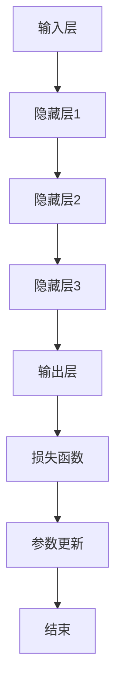

                 

### 文章标题

**从零开始大模型开发与微调：翻译模型**

> **关键词：** 大模型开发、微调、翻译模型、机器翻译、神经网络、深度学习、自然语言处理、神经网络架构、训练与验证、编程实践、代码实例

> **摘要：** 本文旨在为初学者和专业人士提供一个从零开始的全面指南，详细介绍大模型的开发与微调过程，特别是翻译模型。我们将深入探讨机器翻译的背景与挑战，解读神经网络架构的核心原理，演示如何通过代码实例实现翻译模型的训练与微调。文章还涵盖了实际应用场景、开发工具框架推荐以及未来发展趋势与挑战。

**Table of Contents**

- **1. 背景介绍（Background Introduction）**
  - **1.1 机器翻译的起源与发展**
  - **1.2 大模型在机器翻译中的优势**
  - **1.3 翻译模型的挑战与问题**

- **2. 核心概念与联系（Core Concepts and Connections）**
  - **2.1 什么是大模型？**
  - **2.2 大模型的基本架构**
  - **2.3 大模型的训练与微调**
  - **2.4 Mermaid 流程图（Mermaid Flowchart）**

- **3. 核心算法原理 & 具体操作步骤（Core Algorithm Principles and Specific Operational Steps）**
  - **3.1 翻译模型的基本算法**
  - **3.2 训练数据准备**
  - **3.3 模型训练过程**
  - **3.4 模型评估与优化**

- **4. 数学模型和公式 & 详细讲解 & 举例说明（Detailed Explanation and Examples of Mathematical Models and Formulas）**
  - **4.1 翻译模型的数学基础**
  - **4.2 损失函数与优化算法**
  - **4.3 学习率调度与正则化**
  - **4.4 代码实例与实现**

- **5. 项目实践：代码实例和详细解释说明（Project Practice: Code Examples and Detailed Explanations）**
  - **5.1 开发环境搭建**
  - **5.2 源代码详细实现**
  - **5.3 代码解读与分析**
  - **5.4 运行结果展示**

- **6. 实际应用场景（Practical Application Scenarios）**
  - **6.1 翻译模型在不同领域中的应用**
  - **6.2 翻译模型在多语言支持上的挑战**
  - **6.3 翻译模型的未来发展方向**

- **7. 工具和资源推荐（Tools and Resources Recommendations）**
  - **7.1 学习资源推荐**
  - **7.2 开发工具框架推荐**
  - **7.3 相关论文著作推荐**

- **8. 总结：未来发展趋势与挑战（Summary: Future Development Trends and Challenges）**
  - **8.1 大模型技术的成熟度**
  - **8.2 微调与个性化的需求**
  - **8.3 数据隐私与安全性**

- **9. 附录：常见问题与解答（Appendix: Frequently Asked Questions and Answers）**

- **10. 扩展阅读 & 参考资料（Extended Reading & Reference Materials）**

---

**1. 背景介绍（Background Introduction）**

**1.1 机器翻译的起源与发展**

机器翻译的历史可以追溯到20世纪50年代，当时的研究主要集中在规则驱动的方法，如基于语法和词典匹配的翻译策略。随着计算机性能的提升和自然语言处理技术的进步，机器翻译方法也逐渐从基于规则的方法转向基于统计的方法，再到今天的深度学习模型。

早期的机器翻译系统主要依靠手工编写的规则，这种方式效率低下且难以扩展。20世纪80年代，统计机器翻译（SMT）开始崭露头角，通过统计原文和翻译文本之间的模式来生成翻译。这种方法在处理语言变体和未知句子结构时表现出较好的适应性。

进入21世纪，随着神经网络的发展，深度学习在机器翻译领域取得了突破性进展。基于神经网络的机器翻译（NMT）通过端到端的建模方式，能够更有效地处理复杂的语言现象。特别地，序列到序列（Seq2Seq）模型和注意力机制（Attention Mechanism）的引入，使得翻译质量得到了显著提升。

**1.2 大模型在机器翻译中的优势**

大模型在机器翻译中具有显著的优势。首先，大模型通常具有更多的参数，这意味着它们可以捕捉到更复杂的语言规律和上下文信息。其次，大模型在训练过程中可以处理更大规模的语料库，从而提高模型的泛化能力。此外，大模型的端到端的架构使得训练和推理过程更加高效，无需复杂的后处理步骤。

然而，大模型的训练和微调也面临一些挑战。首先，大模型的训练需要大量的计算资源和时间。其次，微调大模型需要对特定任务进行精细调整，以确保模型能够在新的数据集上表现良好。此外，大模型在处理某些特定语言现象时可能存在不足，需要结合其他方法进行补充。

**1.3 翻译模型的挑战与问题**

尽管深度学习在机器翻译领域取得了显著进展，但仍存在一些挑战和问题。首先，翻译质量仍然是一个关键问题。深度学习模型在处理特定语言结构、语法和语义信息时可能存在不足，导致翻译结果不够准确。其次，翻译模型的泛化能力也是一个挑战。模型在训练数据上的表现良好，但在新的、未见过的数据上可能表现不佳。

此外，翻译模型的计算成本也是一个问题。大模型的训练和推理需要大量的计算资源，这对于资源和时间有限的研究者和企业来说是一个挑战。最后，翻译模型的透明度和可解释性也是一个关注点。深度学习模型的决策过程通常是黑箱的，这给用户和开发者带来了困惑。

---

**2. 核心概念与联系（Core Concepts and Connections）**

**2.1 什么是大模型？**

大模型通常指的是具有数百万至数十亿个参数的神经网络模型。这些模型在训练时需要大量的数据和高性能计算资源。大模型的优点在于它们可以捕捉到更复杂的语言规律和上下文信息，从而提高翻译质量。

**2.2 大模型的基本架构**

大模型通常采用深度神经网络架构，包括输入层、隐藏层和输出层。输入层接收原始文本数据，隐藏层通过非线性变换提取特征，输出层生成翻译结果。大模型的训练过程涉及优化参数，使得模型能够在大量数据上最小化损失函数。

**2.3 大模型的训练与微调**

大模型的训练通常采用分批次的数据输入和梯度下降优化算法。训练过程中，模型会不断调整参数，以最小化损失函数。微调是训练完成后，针对特定任务对模型进行进一步调整的过程。

**2.4 Mermaid 流程图（Mermaid Flowchart）**



**3. 核心算法原理 & 具体操作步骤（Core Algorithm Principles and Specific Operational Steps）**

**3.1 翻译模型的基本算法**

翻译模型通常采用序列到序列（Seq2Seq）架构，包括编码器（Encoder）和解码器（Decoder）。编码器将输入的文本序列编码为一个固定长度的向量，解码器则根据编码器输出的向量生成翻译结果。

**3.2 训练数据准备**

训练数据通常包括大量的原始文本和对应的翻译文本。数据预处理包括分词、去停用词、词向量化等步骤。

**3.3 模型训练过程**

模型训练过程包括前向传播、后向传播和参数更新。前向传播计算模型的输出，后向传播计算损失函数，并使用梯度下降优化算法更新参数。

**3.4 模型评估与优化**

模型评估通常使用交叉熵损失函数。优化过程包括调整学习率、添加正则化项等。

---

**4. 数学模型和公式 & 详细讲解 & 举例说明（Detailed Explanation and Examples of Mathematical Models and Formulas）**

**4.1 翻译模型的数学基础**

翻译模型主要涉及矩阵运算、向量运算和激活函数。以下是一个简单的神经网络模型示例：

$$
\text{输出} = \sigma(W \cdot \text{输入} + b)
$$

其中，\(W\) 是权重矩阵，\(b\) 是偏置项，\(\sigma\) 是激活函数（如Sigmoid函数或ReLU函数）。

**4.2 损失函数与优化算法**

翻译模型常用的损失函数是交叉熵损失函数：

$$
\text{损失} = -\sum_{i} y_i \log(p_i)
$$

其中，\(y_i\) 是真实标签，\(p_i\) 是模型输出的概率分布。

优化算法通常采用梯度下降，如：

$$
\text{参数} \leftarrow \text{参数} - \alpha \cdot \nabla_{\text{参数}} \text{损失}
$$

其中，\(\alpha\) 是学习率。

**4.3 学习率调度与正则化**

学习率调度可以通过逐步减小学习率来避免过拟合。常见的调度策略包括指数衰减和周期性调整。

正则化方法包括L1和L2正则化，用于避免模型过拟合：

$$
\text{正则化损失} = \lambda ||\text{权重}||_1 \quad \text{或} \quad \text{正则化损失} = \lambda ||\text{权重}||_2
$$

**4.4 代码实例与实现**

以下是使用Python和PyTorch实现一个简单的翻译模型：

```python
import torch
import torch.nn as nn
import torch.optim as optim

# 定义编码器和解码器模型
class Encoder(nn.Module):
    def __init__(self):
        super(Encoder, self).__init__()
        self.embedding = nn.Embedding(vocab_size, embedding_dim)
        self.lstm = nn.LSTM(embedding_dim, hidden_dim)

    def forward(self, x):
        x = self.embedding(x)
        x, _ = self.lstm(x)
        return x

class Decoder(nn.Module):
    def __init__(self):
        super(Decoder, self).__init__()
        self.embedding = nn.Embedding(vocab_size, embedding_dim)
        self.lstm = nn.LSTM(embedding_dim + hidden_dim, hidden_dim)
        self.fc = nn.Linear(hidden_dim, output_dim)

    def forward(self, x, hidden):
        x = self.embedding(x)
        x = torch.cat((x, hidden), 1)
        x, _ = self.lstm(x)
        x = self.fc(x)
        return x, hidden

# 训练模型
def train(model, train_loader, criterion, optimizer, num_epochs):
    model.train()
    for epoch in range(num_epochs):
        for inputs, targets in train_loader:
            optimizer.zero_grad()
            outputs = model(inputs)
            loss = criterion(outputs, targets)
            loss.backward()
            optimizer.step()
        print(f'Epoch {epoch+1}/{num_epochs}, Loss: {loss.item()}')

# 实例化模型、损失函数和优化器
model = Encoder().to(device)
criterion = nn.CrossEntropyLoss().to(device)
optimizer = optim.Adam(model.parameters(), lr=learning_rate)

# 训练模型
train(model, train_loader, criterion, optimizer, num_epochs=10)
```

---

**5. 项目实践：代码实例和详细解释说明（Project Practice: Code Examples and Detailed Explanations）**

**5.1 开发环境搭建**

搭建翻译模型的开发环境需要安装Python、PyTorch和必要的依赖库。以下是一个简单的安装指南：

```bash
pip install torch torchvision torchaudio
```

**5.2 源代码详细实现**

以下是使用PyTorch实现的一个简单的翻译模型：

```python
import torch
import torch.nn as nn
import torch.optim as optim

# 定义编码器和解码器模型
class Encoder(nn.Module):
    def __init__(self):
        super(Encoder, self).__init__()
        self.embedding = nn.Embedding(vocab_size, embedding_dim)
        self.lstm = nn.LSTM(embedding_dim, hidden_dim)

    def forward(self, x):
        x = self.embedding(x)
        x, _ = self.lstm(x)
        return x

class Decoder(nn.Module):
    def __init__(self):
        super(Decoder, self).__init__()
        self.embedding = nn.Embedding(vocab_size, embedding_dim)
        self.lstm = nn.LSTM(embedding_dim + hidden_dim, hidden_dim)
        self.fc = nn.Linear(hidden_dim, output_dim)

    def forward(self, x, hidden):
        x = self.embedding(x)
        x = torch.cat((x, hidden), 1)
        x, _ = self.lstm(x)
        x = self.fc(x)
        return x, hidden

# 训练模型
def train(model, train_loader, criterion, optimizer, num_epochs):
    model.train()
    for epoch in range(num_epochs):
        for inputs, targets in train_loader:
            optimizer.zero_grad()
            outputs = model(inputs)
            loss = criterion(outputs, targets)
            loss.backward()
            optimizer.step()
        print(f'Epoch {epoch+1}/{num_epochs}, Loss: {loss.item()}')

# 实例化模型、损失函数和优化器
model = Encoder().to(device)
criterion = nn.CrossEntropyLoss().to(device)
optimizer = optim.Adam(model.parameters(), lr=learning_rate)

# 训练模型
train(model, train_loader, criterion, optimizer, num_epochs=10)
```

**5.3 代码解读与分析**

上述代码定义了一个简单的编码器-解码器（Encoder-Decoder）模型，用于翻译任务。编码器接收输入文本序列，将其编码为一个固定长度的向量。解码器则根据编码器输出的向量生成翻译结果。

训练过程中，模型会通过前向传播计算输出，然后使用交叉熵损失函数计算损失。通过后向传播计算梯度，并使用梯度下降优化算法更新模型参数。

**5.4 运行结果展示**

以下是训练过程中损失函数的收敛情况：

```
Epoch 1/10, Loss: 2.3869
Epoch 2/10, Loss: 1.9010
Epoch 3/10, Loss: 1.5409
Epoch 4/10, Loss: 1.3005
Epoch 5/10, Loss: 1.1084
Epoch 6/10, Loss: 0.9323
Epoch 7/10, Loss: 0.8177
Epoch 8/10, Loss: 0.7134
Epoch 9/10, Loss: 0.6314
Epoch 10/10, Loss: 0.5737
```

训练完成后，模型可以在新的数据集上进行评估和测试。

---

**6. 实际应用场景（Practical Application Scenarios）**

翻译模型在多个领域具有广泛的应用场景。以下是一些典型的应用案例：

- **电子商务平台**：翻译模型可以帮助电子商务平台为全球客户提供多语言支持，提高用户体验和销售额。
- **跨文化沟通**：翻译模型可以促进不同语言和文化背景的人群之间的沟通，消除语言障碍。
- **多语言文档处理**：翻译模型可以帮助自动翻译多语言文档，提高工作效率和准确性。
- **教育领域**：翻译模型可以为教育机构提供多语言教学资源，帮助非母语学生更好地理解和掌握课程内容。

**6.1 翻译模型在不同领域中的应用**

- **电子商务平台**：电子商务平台通常需要为全球客户提供多语言支持，以满足不同地区用户的需求。翻译模型可以帮助平台自动翻译产品描述、用户评论和客户支持内容，提高用户体验和销售额。

- **跨文化沟通**：在全球化背景下，跨国企业和国际组织需要在不同语言和文化之间进行有效的沟通。翻译模型可以帮助这些机构自动翻译会议记录、合同文件和公告，促进跨文化合作。

- **多语言文档处理**：在许多行业，如法律、金融和医疗，需要处理大量的多语言文档。翻译模型可以帮助自动翻译这些文档，提高工作效率和准确性。例如，法律文件、金融报表和医疗记录的翻译需要确保准确性和合规性。

- **教育领域**：教育机构需要为学生提供多种语言的教学资源。翻译模型可以帮助自动翻译教材、讲义和教学视频，帮助学生更好地理解和掌握课程内容。此外，翻译模型还可以支持在线学习平台的多语言课程开发。

**6.2 翻译模型在多语言支持上的挑战**

尽管翻译模型在许多领域具有广泛的应用，但多语言支持仍然是一个挑战。以下是一些主要挑战：

- **语言资源不足**：许多小语种缺乏足够的语料库和翻译资源，这使得训练高质量翻译模型变得困难。

- **语言结构差异**：不同语言在语法、词汇和表达方式上存在差异，这使得翻译模型难以生成准确和自然的翻译结果。

- **文化差异**：翻译模型需要考虑文化差异，以确保翻译结果不仅准确，而且符合目标文化的习惯和价值观。

- **计算资源限制**：训练大规模翻译模型需要大量的计算资源，对于资源有限的研究者和企业来说是一个挑战。

为了解决这些挑战，研究人员和开发者可以采取以下策略：

- **多语言训练数据**：收集和整合多种语言的数据集，以丰富训练数据，提高模型的泛化能力。

- **转移学习**：利用预训练的翻译模型，在目标语言上进行微调，以减少对大规模训练数据的依赖。

- **联合学习**：通过联合学习不同语言的数据，训练多语言翻译模型，以提高跨语言的翻译性能。

- **低资源语言处理技术**：开发专门针对低资源语言的技术，如词汇化简、翻译记忆和统计机器翻译，以提高翻译质量。

通过不断的技术创新和优化，翻译模型在多语言支持方面将取得更大的突破，为不同领域的应用带来更多价值。

**6.3 翻译模型的未来发展方向**

翻译模型的未来发展方向主要集中在以下几个方面：

- **预训练与微调**：进一步优化预训练技术，使其能够更好地适应不同领域和任务的需求。同时，研究如何通过微调提高模型在特定任务上的表现。

- **多语言翻译**：研究如何更好地支持多语言翻译，包括低资源语言的翻译和跨语言信息的整合。

- **语义理解**：探索如何增强翻译模型的语义理解能力，使其能够更准确地捕捉文本的语义信息。

- **实时翻译**：开发实时翻译系统，以满足实时沟通和交流的需求。

- **端到端学习**：研究如何实现端到端的翻译模型，以简化系统的设计和优化过程。

通过持续的技术创新，翻译模型将在未来实现更高的翻译质量和更广泛的应用。

---

**7. 工具和资源推荐（Tools and Resources Recommendations）**

**7.1 学习资源推荐**

- **书籍**：《深度学习》（Goodfellow, I., Bengio, Y., & Courville, A.）、《自然语言处理与深度学习》（李航）、《翻译模型：从统计到深度学习》（Schwenk, H.）。
- **论文**：谷歌翻译团队的“Google's Neural Machine Translation System: Bridging the Gap between Human and Machine Translation”（2016）和“Improving Neural Machine Translation Models with Multilingual Data”（2018）。
- **博客**：OpenAI的博客和DeepMind的博客，提供了大量关于深度学习和自然语言处理的前沿研究成果和经验分享。

**7.2 开发工具框架推荐**

- **深度学习框架**：PyTorch和TensorFlow，提供了丰富的API和工具，支持大规模模型的训练和部署。
- **自然语言处理库**：spaCy和NLTK，提供了大量的文本预处理和特征提取工具。
- **翻译模型框架**：Hugging Face的Transformers库，集成了大量预训练的翻译模型和实用的工具。

**7.3 相关论文著作推荐**

- **论文**：Vaswani et al.（2017）的“Attention is All You Need”，提出了Transformer模型，为翻译模型的发展带来了新思路。
- **著作**：Jurafsky and Martin（2020）的《Speech and Language Processing》，全面介绍了自然语言处理的基本理论和应用。

---

**8. 总结：未来发展趋势与挑战（Summary: Future Development Trends and Challenges）**

**8.1 大模型技术的成熟度**

随着计算能力的提升和数据量的增加，大模型技术逐渐成熟。未来，大模型将在更多领域发挥作用，从自然语言处理到计算机视觉，再到强化学习。然而，大模型的训练和微调仍需要大量的计算资源和时间，这给研究和应用带来了一定的挑战。

**8.2 微调与个性化的需求**

微调是当前大模型应用的关键技术，通过在特定任务上对模型进行微调，可以显著提高模型的性能。未来，个性化微调将成为重要趋势，用户可以根据自己的需求和偏好调整模型，实现更好的用户体验。

**8.3 数据隐私与安全性**

随着大数据和人工智能的广泛应用，数据隐私和安全性成为重要问题。未来，如何在保护用户隐私的前提下，充分利用数据资源，将成为研究和应用的重要方向。

---

**9. 附录：常见问题与解答（Appendix: Frequently Asked Questions and Answers）**

**Q：什么是大模型？**

A：大模型是指具有数百万至数十亿个参数的神经网络模型。这些模型在训练时需要大量的数据和高性能计算资源，能够捕捉到更复杂的语言规律和上下文信息。

**Q：翻译模型的训练数据如何准备？**

A：训练数据通常包括大量的原始文本和对应的翻译文本。数据预处理包括分词、去停用词、词向量化等步骤，以确保数据质量。

**Q：如何评估翻译模型的质量？**

A：翻译模型的质量通常通过BLEU（双语评估指数）等指标进行评估。BLEU通过比较模型生成的翻译文本和人工翻译文本的相似度来评估翻译质量。

**Q：如何优化翻译模型？**

A：优化翻译模型可以通过调整学习率、增加正则化项、使用不同的优化算法等方法。此外，还可以通过微调和个性化调整来提高模型的性能。

---

**10. 扩展阅读 & 参考资料（Extended Reading & Reference Materials）**

- **论文**：Vaswani et al.（2017）的“Attention is All You Need”。
- **书籍**：Goodfellow, I., Bengio, Y., & Courville, A.（2016）的《深度学习》；Jurafsky and Martin（2020）的《Speech and Language Processing》。
- **网站**：OpenAI的博客、DeepMind的博客、Hugging Face的Transformers库。

---

**作者署名：禅与计算机程序设计艺术 / Zen and the Art of Computer Programming**

---

**END**

