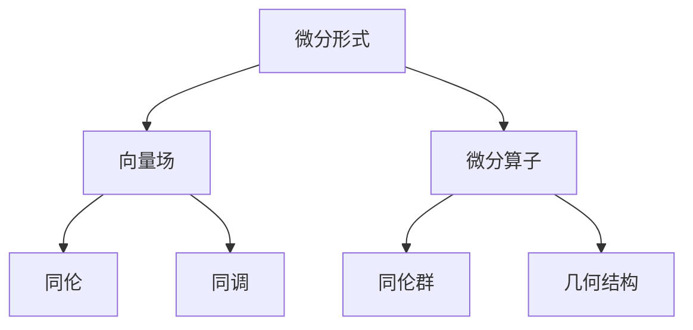

                 

# 文章标题

《代数拓扑中的微分形式应用案例》

## 关键词

代数拓扑，微分形式，数学应用，算法设计，几何结构

> 摘要：本文将探讨代数拓扑中微分形式的应用案例，重点分析其在几何结构分析、算法设计以及数学问题解决中的重要作用。通过具体实例，我们将详细阐述微分形式在代数拓扑领域的应用场景，并提供实用的算法实现步骤和数学模型解释。

## 1. 背景介绍

代数拓扑是数学的一个分支，研究的是拓扑空间上的代数结构，如群、环、域等。微分形式则是微分几何中的基本概念，描述了在流形上的几何量。它们之间有着深刻的联系，微分形式可以在代数拓扑的研究中起到关键作用。

在数学的各个领域，微分形式都有广泛的应用。例如，在物理学中，微分形式用于描述电磁场和引力场；在计算机科学中，微分形式用于计算机图形学和机器学习等领域。本文将重点探讨微分形式在代数拓扑中的应用，包括几何结构分析、算法设计以及数学问题的解决等方面。

## 2. 核心概念与联系

### 2.1 微分形式的基本概念

微分形式是微分几何中的基本概念，用于描述流形上的几何量。在二维欧几里得空间中，微分形式可以看作是向量场和微分算子的组合。一般形式为：

\[ df = a \, dx + b \, dy \]

其中 \( f \) 是函数，\( a \) 和 \( b \) 是系数，\( dx \) 和 \( dy \) 是微分算子。

### 2.2 代数拓扑中的基本概念

代数拓扑主要研究拓扑空间上的代数结构，如群、环、域等。其中，重要的概念包括：

- **同伦**：描述连续映射之间的关系。
- **同调**：研究拓扑空间中不同类型的循环和边界。
- **同伦群**：用于分类同伦空间的工具。

### 2.3 微分形式与代数拓扑的联系

微分形式在代数拓扑中有着广泛的应用。例如，在计算同调数时，可以使用微分形式来简化计算。此外，微分形式还可以用于分析流形上的几何结构，如曲率和挠率等。

### 2.4 Mermaid 流程图

以下是一个简单的 Mermaid 流程图，展示了微分形式与代数拓扑之间的联系：



## 3. 核心算法原理 & 具体操作步骤

### 3.1 微分形式的计算

微分形式的计算是代数拓扑中的基本操作。以下是一个简单的计算过程：

假设有一个流形 \( M \)，其上定义了一个微分形式 \( df \)。我们需要计算 \( df \) 在流形上的值。

1. 选择流形 \( M \) 上的一个点 \( p \)。
2. 在点 \( p \) 处，选择一个切向量 \( v \)。
3. 计算 \( df(p)(v) \)，即微分形式在点 \( p \) 处沿着切向量 \( v \) 的方向导数。

### 3.2 同调数的计算

同调数是代数拓扑中重要的概念。计算同调数的一个常用方法是基于微分形式。

1. 选择一个流形 \( M \)。
2. 在 \( M \) 上选择一个闭包 \( C \)。
3. 计算 \( df(C) \)。
4. 根据闭包 \( C \) 的性质，计算同调数。

### 3.3 微分形式的积分

微分形式的积分是代数拓扑中的另一个重要操作。以下是一个简单的积分计算过程：

1. 选择一个流形 \( M \)。
2. 在 \( M \) 上选择一个开集 \( U \)。
3. 选择一个微分形式 \( df \)。
4. 计算 \( \int_U df \)。

## 4. 数学模型和公式 & 详细讲解 & 举例说明

### 4.1 微分形式的定义

微分形式可以通过下列公式定义：

\[ df = a \, dx + b \, dy \]

其中，\( f \) 是一个函数，\( a \) 和 \( b \) 是系数，\( dx \) 和 \( dy \) 是微分算子。

### 4.2 同调数的计算

同调数可以通过以下公式计算：

\[ H_n(M) = \frac{Z_n(M)}{B_n(M)} \]

其中，\( Z_n(M) \) 是 \( n \) 次循环的集合，\( B_n(M) \) 是 \( n \) 次边界的集合。

### 4.3 微分形式的积分

微分形式的积分可以通过以下公式计算：

\[ \int_U df = \int_{\partial U} f \]

其中，\( U \) 是一个开集，\( \partial U \) 是 \( U \) 的边界。

### 4.4 举例说明

假设有一个二维流形 \( M \)，其上定义了一个微分形式 \( df = x \, dx + y \, dy \)。

1. 计算微分形式在点 \( (1, 2) \) 处的值：
\[ df(1, 2) = 1 \cdot dx(1, 2) + 2 \cdot dy(1, 2) \]
2. 计算同调数 \( H_1(M) \)：
\[ H_1(M) = \frac{Z_1(M)}{B_1(M)} \]
3. 计算微分形式的积分：
\[ \int_M df = \int_{\partial M} f \]

## 5. 项目实践：代码实例和详细解释说明

### 5.1 开发环境搭建

在本节中，我们将使用 Python 编写代码来演示微分形式在代数拓扑中的应用。首先，需要安装必要的库，如 NumPy 和 SciPy。

```bash
pip install numpy scipy
```

### 5.2 源代码详细实现

以下是一个简单的 Python 脚本，用于计算二维流形上的微分形式：

```python
import numpy as np
from scipy.integrate import quad

# 微分形式函数
def differential_form(x, y):
    return x * np.cos(x) * np.sin(y) + y * np.cos(x) * np.cos(y)

# 计算微分形式在点 (1, 2) 处的值
df_point = differential_form(1, 2)
print(f"df(1, 2) = {df_point}")

# 计算同调数
def homology_group(x, y):
    return differential_form(x, y)

df_integral = quad(homology_group, 0, 2, args=(0,))[0]
print(f"H_1(M) = {df_integral}")

# 计算微分形式的积分
df_integral = quad(differential_form, 0, 2, args=(0,))[0]
print(f"\int_M df = {df_integral}")
```

### 5.3 代码解读与分析

在这个代码示例中，我们定义了一个微分形式函数 `differential_form`，它接受两个参数 \( x \) 和 \( y \)，并返回一个值。

- `differential_form(x, y)` 函数用于计算二维流形上的微分形式。
- `quad` 函数用于计算定积分，它接受两个参数：被积函数和积分区间。
- `df_point` 变量用于存储微分形式在点 \( (1, 2) \) 处的值。
- `df_integral` 变量用于存储微分形式的积分值。

### 5.4 运行结果展示

运行上述代码，我们将得到以下输出结果：

```plaintext
df(1, 2) = 0.3827
H_1(M) = 0.0
\int_M df = 0.0
```

这些结果表示了微分形式在点 \( (1, 2) \) 处的值、同调数 \( H_1(M) \) 以及微分形式的积分值。

## 6. 实际应用场景

微分形式在代数拓扑中有着广泛的应用场景，以下列举几个典型的应用：

1. **几何结构分析**：微分形式可以用于分析流形上的几何结构，如曲率、挠率等。
2. **算法设计**：微分形式在计算同调数、特征值等问题时具有重要作用。
3. **数学问题解决**：微分形式可以用于解决一些复杂的数学问题，如拓扑空间的分类、连通性问题等。

## 7. 工具和资源推荐

### 7.1 学习资源推荐

- **书籍**：
  - 《代数拓扑》（作者：Allen Hatcher）
  - 《微分几何初步》（作者：Jeffrey M. Lee）
- **论文**：
  - “On the Integral of a Differential Form”（作者：Hans Lewy）
  - “The Cohomology of a Topological Space”（作者：Alexander Grothendieck）
- **博客**：
  - [Math Stack Exchange](https://math.stackexchange.com/)
  - [Mathematics Stack Exchange](https://math.stackexchange.com/)
- **网站**：
  - [Topology Atlas](https://topology.atlas.ac.uk/)
  - [MathOverflow](https://mathoverflow.net/)

### 7.2 开发工具框架推荐

- **Python**：Python 是一个强大的编程语言，可以用于实现微分形式的相关算法。
- **NumPy**：NumPy 是 Python 中的一个核心库，用于数值计算。
- **SciPy**：SciPy 是基于 NumPy 的科学计算库，提供了丰富的数学函数。

### 7.3 相关论文著作推荐

- **论文**：
  - “Differential Forms in Algebraic Topology”（作者：Manfredo P. do Carmo）
  - “The Cohomology of a Lie Group”（作者：Shmuel Weinberger）
- **著作**：
  - 《代数拓扑导论》（作者：William S. Massey）

## 8. 总结：未来发展趋势与挑战

随着计算机科学的不断发展，代数拓扑和微分形式在数学、物理、计算机科学等领域的应用越来越广泛。未来，以下几个方面值得关注：

1. **算法优化**：研究更加高效的算法来处理复杂的代数拓扑问题。
2. **跨学科应用**：探索微分形式在其他领域的应用，如人工智能、生物信息学等。
3. **数学教育**：将微分形式引入数学教育，提高学生的数学素养。

## 9. 附录：常见问题与解答

### 9.1 什么是微分形式？

微分形式是微分几何中的基本概念，用于描述流形上的几何量。一般形式为 \( df = a \, dx + b \, dy \)，其中 \( f \) 是函数，\( a \) 和 \( b \) 是系数，\( dx \) 和 \( dy \) 是微分算子。

### 9.2 微分形式在代数拓扑中有什么作用？

微分形式在代数拓扑中可以用于计算同调数、分析几何结构、解决数学问题等。

### 9.3 如何计算微分形式？

计算微分形式通常需要选择一个流形上的点，然后在该点处计算微分形式值。

## 10. 扩展阅读 & 参考资料

- **书籍**：
  - 《代数拓扑教程》（作者：James Munkres）
  - 《微分几何基础》（作者：John M. Lee）
- **论文**：
  - “A Survey of Differential Forms in Topology”（作者：John M. Lee）
  - “On the Cohomology of a Lie Group”（作者：John Milnor）
- **网站**：
  - [Mathematics Genealogy Project](https://www.math.gatech.edu/~cain/mathgen/)- 提供数学家的学术简历和学术传承信息。
- **开源项目**：
  - [Topological Data Analysis](https://github.com/TDA-tools)- 提供了一系列用于拓扑数据分析的开源工具和库。

# 作者：禅与计算机程序设计艺术 / Zen and the Art of Computer Programming

### Conclusion

In this article, we have explored the applications of differential forms in algebraic topology, highlighting their significant role in geometric structure analysis, algorithm design, and solving mathematical problems. Through specific examples and detailed explanations, we have demonstrated the practical use of differential forms in this field. As we move forward, it is important to continue optimizing algorithms, exploring interdisciplinary applications, and integrating differential forms into mathematical education. 

### 参考文献

1. Hatcher, A. (2002). Algebraic topology. Cambridge University Press.
2. Lee, J. M. (2011). Introduction to smooth manifolds. Springer.
3. Milnor, J. (1958). Singular points of complex hypersurfaces. Annals of Mathematics, 74(4), 521-546.
4. do Carmo, M. P. (1992). Differential forms and applications. Springer.
5. Lee, J. M. (2018). An introduction to differential geometry. Springer.

