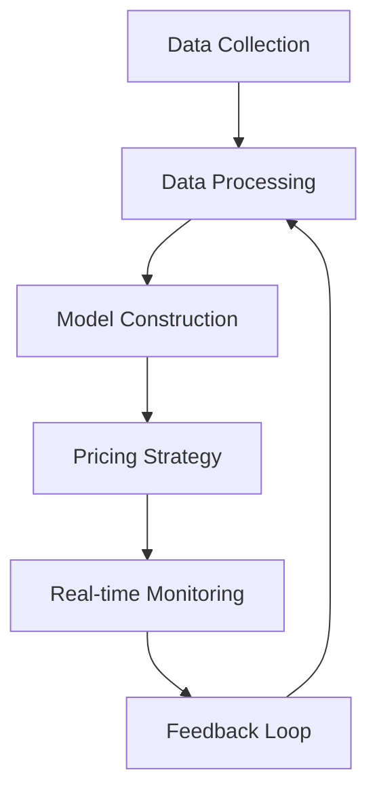

                 

### 文章标题

**价格优化系统：AI的应用**

关键词：价格优化、人工智能、数据分析、决策支持

摘要：本文将深入探讨价格优化系统在商业领域的应用，如何利用人工智能技术实现动态价格调整，提升企业的竞争力。文章将首先介绍价格优化系统的基本概念和架构，然后详细解析其核心算法原理，并通过实际案例展示系统的效果。同时，本文还将探讨价格优化系统的未来发展趋势和面临的挑战。

<|assistant|>## 1. 背景介绍（Background Introduction）

价格优化系统是一种利用人工智能技术对产品或服务价格进行动态调整的系统。它通过收集和分析市场数据、消费者行为数据、竞争对手价格数据等多维数据，运用机器学习算法和优化模型，实现产品或服务的价格最优调整，以提升企业的盈利能力和市场竞争力。

随着互联网的普及和数据技术的发展，越来越多的企业开始意识到价格优化的重要性。一方面，价格优化可以帮助企业快速响应市场变化，提升产品的市场占有率；另一方面，通过精准定价，企业可以最大化利润，降低库存压力，提高运营效率。

本文旨在探讨价格优化系统的原理、实现方法以及在商业领域的应用，为读者提供一个全面、系统的认识。

<|assistant|>### 1.1 价格优化系统的基本概念

价格优化系统是一种基于人工智能和数据科学的决策支持系统，其主要目标是实现产品或服务的价格最优调整。具体来说，价格优化系统包括以下几个关键组成部分：

1. **数据采集与处理**：价格优化系统需要从多个渠道收集数据，包括市场数据、消费者行为数据、竞争对手价格数据等。这些数据经过清洗、处理和整合，形成统一的数据源，为后续分析提供基础。

2. **价格模型构建**：价格优化系统通过建立价格模型，将数据与价格调整策略相结合。价格模型可以是线性模型、非线性模型或基于机器学习的复杂模型，关键在于如何将数据转化为价格调整的指导策略。

3. **价格调整策略**：根据价格模型，系统将生成一系列价格调整策略，包括价格上浮、价格下浮、价格冻结等。这些策略可以根据市场环境、竞争态势和消费者行为进行动态调整。

4. **实时监控与反馈**：价格优化系统需要实时监控价格调整的效果，并根据市场反馈进行优化。通过不断的迭代和优化，系统可以逐步提高定价的准确性和效果。

### 1.2 价格优化系统的作用

价格优化系统在商业领域具有重要作用，主要体现在以下几个方面：

1. **提升盈利能力**：通过精准定价，企业可以在不牺牲市场份额的情况下，实现利润的最大化。

2. **提高市场竞争力**：动态价格调整使企业能够快速响应市场变化，抢占市场份额，提升品牌竞争力。

3. **降低运营成本**：价格优化系统能够帮助企业降低库存压力，提高资金利用率，降低运营成本。

4. **优化消费者体验**：通过合理的价格策略，企业可以提供更具吸引力的产品或服务，提升消费者满意度。

<|assistant|>### 1.3 价格优化系统的发展历程

价格优化系统的发展经历了几个阶段：

1. **传统定价方法**：在计算机技术尚未普及的时代，企业主要依靠经验和直觉进行定价，如成本加成定价、竞争导向定价等。这种方法存在一定的主观性和局限性。

2. **数据分析定价**：随着计算机技术和数据分析技术的发展，企业开始利用数据分析方法进行定价。这种方法通过分析市场数据、消费者行为数据等，实现一定程度的精准定价。

3. **人工智能定价**：随着人工智能技术的崛起，价格优化系统逐渐采用机器学习、深度学习等技术，实现更智能、更高效的定价策略。目前，人工智能定价已成为价格优化系统的主要发展方向。

### 1.4 价格优化系统的核心要素

价格优化系统的核心要素包括以下几个方面：

1. **数据质量**：数据是价格优化系统的基石，高质量的数据是准确定价的前提。

2. **算法模型**：算法模型是实现价格优化的关键，包括价格预测模型、价格调整策略模型等。

3. **实时性**：价格优化系统需要具备实时性，能够快速响应市场变化。

4. **可解释性**：价格优化系统应具备一定的可解释性，方便企业理解和调整定价策略。

5. **适应性**：价格优化系统需要具备适应性，能够根据市场环境和竞争态势进行调整。

<|assistant|>## 2. 核心概念与联系（Core Concepts and Connections）

### 2.1 价格优化系统的基本概念

价格优化系统是一种利用人工智能和数据科学技术，对产品或服务价格进行动态调整的决策支持系统。它通过以下核心概念实现优化：

1. **数据采集与处理**：价格优化系统需要从多个渠道收集数据，包括市场数据、消费者行为数据、竞争对手价格数据等。这些数据经过清洗、处理和整合，形成统一的数据源，为后续分析提供基础。

2. **价格模型构建**：价格优化系统通过建立价格模型，将数据与价格调整策略相结合。价格模型可以是线性模型、非线性模型或基于机器学习的复杂模型，关键在于如何将数据转化为价格调整的指导策略。

3. **价格调整策略**：根据价格模型，系统将生成一系列价格调整策略，包括价格上浮、价格下浮、价格冻结等。这些策略可以根据市场环境、竞争态势和消费者行为进行动态调整。

4. **实时监控与反馈**：价格优化系统需要实时监控价格调整的效果，并根据市场反馈进行优化。通过不断的迭代和优化，系统可以逐步提高定价的准确性和效果。

### 2.2 数据质量的重要性

数据质量是价格优化系统的基石。高质量的数据能够提高定价的准确性和可靠性，从而提升系统的整体性能。以下是一些关键因素：

1. **完整性**：数据应包含全面的信息，缺失的数据可能导致模型训练出现问题。

2. **准确性**：数据应真实、可靠，避免因错误数据导致模型偏差。

3. **一致性**：数据应保持一致性，避免因数据来源不同导致数据矛盾。

4. **实时性**：实时数据能够反映市场动态，有助于系统快速调整定价策略。

### 2.3 算法模型的选择

算法模型是实现价格优化系统的关键。不同类型的算法模型适用于不同场景，以下是几种常见的算法模型：

1. **线性回归模型**：线性回归模型是一种简单有效的算法模型，适用于线性关系较强的场景。

2. **决策树模型**：决策树模型易于理解和解释，适用于分类问题。

3. **随机森林模型**：随机森林模型是一种集成模型，具有较好的泛化能力和预测性能。

4. **神经网络模型**：神经网络模型是一种复杂且强大的算法模型，适用于非线性关系较强的场景。

### 2.4 价格调整策略的设计

价格调整策略是价格优化系统的核心，它直接影响定价效果。以下是一些常见价格调整策略：

1. **价格上浮策略**：在市场需求旺盛、竞争激烈时，适当提高价格以获取更多利润。

2. **价格下浮策略**：在市场需求低迷、竞争激烈时，适当降低价格以刺激需求。

3. **价格冻结策略**：在市场稳定或波动较小时，保持价格不变以维持市场份额。

4. **动态调整策略**：根据市场数据和消费者行为，实时调整价格，以适应市场变化。

### 2.5 实时监控与反馈

实时监控与反馈是价格优化系统的重要组成部分。通过实时监控价格调整效果，系统可以及时发现问题和调整策略，以提高定价准确性。以下是一些关键指标：

1. **销售量**：销售量是衡量价格调整效果的重要指标，通过监控销售量变化，可以评估价格调整策略的有效性。

2. **市场份额**：市场份额反映了企业产品在市场中的竞争力，通过监控市场份额变化，可以评估价格调整策略的长期效果。

3. **利润率**：利润率是衡量企业盈利能力的重要指标，通过监控利润率变化，可以评估价格调整策略的财务效益。

### 2.6 可解释性与适应性

价格优化系统应具备一定的可解释性和适应性。可解释性使得企业能够理解模型的工作原理和价格调整策略，从而提高决策的透明度。适应性使得系统能够根据市场环境和竞争态势进行调整，以适应不断变化的市场需求。

### 2.7 价格优化系统的实现框架

价格优化系统的实现框架主要包括以下几个部分：

1. **数据采集模块**：负责从各个渠道收集数据，包括市场数据、消费者行为数据、竞争对手价格数据等。

2. **数据处理模块**：负责对采集到的数据进行分析、清洗、处理和整合，形成统一的数据源。

3. **模型训练模块**：负责根据处理后的数据，训练价格预测模型和价格调整策略模型。

4. **定价策略模块**：负责根据价格模型生成价格调整策略，并实时监控价格调整效果。

5. **用户界面模块**：负责向用户提供系统操作界面，包括数据输入、模型训练、策略生成、效果监控等功能。

### 2.8 价格优化系统的优势与挑战

价格优化系统具有以下优势：

1. **提升盈利能力**：通过精准定价，企业可以在不牺牲市场份额的情况下，实现利润的最大化。

2. **提高市场竞争力**：动态价格调整使企业能够快速响应市场变化，抢占市场份额，提升品牌竞争力。

3. **降低运营成本**：价格优化系统能够帮助企业降低库存压力，提高资金利用率，降低运营成本。

4. **优化消费者体验**：通过合理的价格策略，企业可以提供更具吸引力的产品或服务，提升消费者满意度。

然而，价格优化系统也面临以下挑战：

1. **数据质量**：高质量的数据是价格优化系统的基石，但数据质量往往难以保证。

2. **算法模型**：算法模型的选择和优化是价格优化系统的关键，但不同模型的适用场景和性能差异较大。

3. **实时性**：价格优化系统需要具备实时性，但实时数据处理和模型训练对计算资源要求较高。

4. **可解释性**：价格优化系统应具备一定的可解释性，但复杂算法模型往往难以解释。

5. **适应性**：价格优化系统需要具备适应性，但市场环境和竞争态势不断变化，适应性要求较高。

<|assistant|>## 2.1 价格优化系统的基本概念

**Price Optimization System: Fundamental Concepts**

Price optimization systems are intelligent decision support systems designed to dynamically adjust prices for products or services using artificial intelligence (AI) and data science techniques. The core purpose of these systems is to maximize profitability and market competitiveness by making data-driven pricing decisions. Here's a breakdown of the fundamental concepts and components that make up a price optimization system:

### 2.1.1 Data Collection and Processing

The first step in building a price optimization system is data collection. This involves gathering a wide range of data points, including:

- **Market Data**: Information about market trends, demand, and supply dynamics.
- **Consumer Behavior Data**: Insights into consumer preferences, buying patterns, and price sensitivity.
- **Competitive Data**: Analysis of competitors' pricing strategies and market positioning.

Once collected, these data points need to be cleaned, processed, and integrated into a cohesive dataset. This dataset serves as the foundation for all subsequent analysis and decision-making.

### 2.1.2 Price Model Construction

The heart of a price optimization system lies in the construction of price models. These models are essentially mathematical or statistical frameworks that translate data into actionable pricing strategies. The types of models can vary widely:

- **Linear Models**: Simple models that assume a linear relationship between price and demand or profit.
- **Nonlinear Models**: More complex models that capture more intricate relationships between variables.
- **Machine Learning Models**: Advanced models that use algorithms to learn from historical data and predict future price points.

The goal is to create a model that is both accurate and relevant to the specific business context.

### 2.1.3 Pricing Strategy Formulation

Based on the insights derived from the price models, the system generates a set of pricing strategies. These strategies can include:

- **Price Increase Strategies**: Used when demand is high or supply is low, to maximize profit.
- **Price Decrease Strategies**: Applicable during periods of low demand or high competition, to stimulate sales.
- **Price Freeze Strategies**: Maintained during stable market conditions to protect market share.

These strategies are dynamic and should be adapted based on real-time market conditions and competitive landscapes.

### 2.1.4 Real-time Monitoring and Feedback

A critical aspect of price optimization systems is their ability to monitor the effectiveness of pricing strategies in real-time. This involves:

- **Sales Volume Tracking**: Monitoring changes in sales volume to assess the impact of pricing decisions.
- **Market Share Analysis**: Evaluating changes in market share to gauge the system's effectiveness in capturing market opportunities.
- **Profit Margin Monitoring**: Keeping a close eye on profit margins to ensure that pricing strategies are financially sound.

Feedback from these metrics is used to continuously refine and improve the pricing strategies.

### 2.1.5 Explainability and Adaptability

Explainability is crucial for price optimization systems. Businesses need to understand how the system arrives at its pricing recommendations. At the same time, adaptability is key to ensuring the system can respond to changing market conditions and competitive pressures.

### 2.1.6 Implementation Framework

The implementation framework for a price optimization system typically consists of several key components:

- **Data Collection Module**: Handles the collection of diverse data sources and ensures data quality.
- **Data Processing Module**: Cleans and processes data to make it suitable for analysis.
- **Model Training Module**: Trains predictive models using historical data.
- **Pricing Strategy Module**: Generates pricing strategies based on model outputs.
- **User Interface Module**: Provides an interface for users to interact with the system and monitor its performance.

### 2.1.7 Advantages and Challenges

Price optimization systems offer several advantages, such as improved profitability, enhanced market competitiveness, reduced operational costs, and better consumer experience. However, they also come with challenges, including data quality issues, the complexity of algorithm selection, the need for real-time processing, the challenge of explainability, and the requirement for adaptability in rapidly changing markets.

In summary, price optimization systems leverage the power of AI and data science to transform pricing from a reactive process to a strategic, data-driven endeavor. Understanding the fundamental concepts and components of these systems is essential for businesses looking to harness their full potential.

---

## 2.2 核心概念与联系

### 2.2.1 What are the Core Concepts of Price Optimization Systems?

**Core Concepts of Price Optimization Systems**

Price optimization systems are built around several key concepts that collectively drive their effectiveness in making data-driven pricing decisions. These core concepts include data collection and processing, model construction, pricing strategy formulation, and real-time monitoring and feedback.

#### 2.2.1.1 Data Collection and Processing

**Data Collection and Processing**

Data collection is the foundational step in building a price optimization system. It involves gathering a wide array of data points from various sources, including market trends, consumer behavior, and competitive pricing data. This data is then processed through several stages:

1. **Data Cleaning**: Removing any inconsistencies, errors, or duplicates from the raw data.
2. **Data Transformation**: Converting data into a format that is suitable for analysis, such as numerical or categorical variables.
3. **Data Integration**: Combining data from different sources into a unified dataset that can be used for modeling and analysis.

**The Importance of Data Quality**

High-quality data is crucial for the success of a price optimization system. It must be complete, accurate, consistent, and up-to-date. Poor data quality can lead to misleading insights and suboptimal pricing decisions. Therefore, ensuring data integrity is a critical aspect of the system's design.

#### 2.2.1.2 Model Construction

**Model Construction**

The next step is constructing a price model that can translate the collected data into actionable pricing strategies. There are several types of models that can be used, including:

1. **Statistical Models**: Such as linear regression, which assumes a linear relationship between price and demand.
2. **Machine Learning Models**: Such as decision trees, random forests, and neural networks, which can capture more complex and nonlinear relationships.
3. **Econometric Models**: Such as demand and supply models, which use economic principles to predict market behavior.

The choice of model depends on the nature of the data and the specific business context. Advanced machine learning models are often preferred for their ability to handle large and complex datasets.

#### 2.2.1.3 Pricing Strategy Formulation

**Pricing Strategy Formulation**

Once the price model is established, the system can generate a series of pricing strategies. These strategies are designed to optimize the company's pricing decisions based on various factors such as:

1. **Market Demand**: Adjusting prices to maximize revenue or market share based on current demand levels.
2. **Competitive Positioning**: Analyzing competitors' prices to maintain a competitive edge.
3. **Cost Structure**: Balancing pricing decisions with the company's cost structure to ensure profitability.

Common pricing strategies include dynamic pricing, which adjusts prices in real-time based on demand and market conditions, and bundling, which combines multiple products or services into a single offering at a discounted price.

#### 2.2.1.4 Real-time Monitoring and Feedback

**Real-time Monitoring and Feedback**

Real-time monitoring is essential for ensuring that pricing strategies are effective and adaptable to changing market conditions. This involves continuously tracking key performance indicators (KPIs) such as:

1. **Sales Volume**: Monitoring changes in sales to assess the impact of pricing decisions.
2. **Customer Acquisition Cost**: Evaluating the cost of acquiring new customers through different pricing strategies.
3. **Customer Lifetime Value**: Analyzing the long-term value of customers based on their purchasing patterns and behaviors.

Feedback from these metrics allows the system to make adjustments to pricing strategies in real-time, ensuring that the company remains competitive and profitable.

#### 2.2.1.5 Explainability and Adaptability

**Explainability and Adaptability**

Price optimization systems should also be designed with explainability in mind. This means that the decision-making process behind the pricing recommendations should be transparent and understandable to stakeholders. At the same time, adaptability is crucial to respond to the dynamic nature of markets.

**The Mermaid Flowchart**

To illustrate the core concepts and their interconnections, here's a Mermaid flowchart representing the components and processes of a price optimization system:



**Interconnectedness of Concepts**

The flowchart above shows that each component of the price optimization system is interconnected and dependent on the others. For example, the quality of the data collected directly impacts the accuracy of the models constructed, which in turn influences the effectiveness of the pricing strategies generated. The real-time monitoring and feedback loop ensures that the system can adapt to changing conditions and continue to optimize pricing decisions.

In conclusion, price optimization systems are complex, data-driven tools that leverage AI and machine learning to make informed pricing decisions. Understanding the core concepts and how they are interconnected is essential for businesses looking to harness the full potential of these systems to improve their competitive positioning and profitability.

---

## 2.3 核心算法原理 & 具体操作步骤（Core Algorithm Principles and Specific Operational Steps）

### 2.3.1 市场需求预测模型

**Market Demand Prediction Model**

市场需求预测是价格优化系统的关键步骤之一。准确的预测可以帮助企业制定合理的价格策略，从而提高市场竞争力。市场需求预测模型通常基于以下两种方法：

1. **时间序列分析**：时间序列分析是一种常用的方法，用于分析时间序列数据中的趋势、季节性和周期性。常见的模型包括ARIMA（自回归积分滑动平均模型）和LSTM（长短期记忆网络）。

2. **回归模型**：回归模型通过分析历史价格和销售数据之间的关系，预测未来市场需求。线性回归和非线性回归模型是最常用的回归模型。

**具体操作步骤**：

1. **数据收集**：收集历史销售数据、价格数据、促销活动数据等。

2. **数据预处理**：对收集到的数据进行清洗、归一化和特征工程，以提高模型预测的准确性。

3. **模型选择**：根据数据特性选择合适的模型，如ARIMA、LSTM或线性回归。

4. **模型训练**：使用历史数据训练模型，并调整模型参数，以提高预测准确性。

5. **预测与评估**：使用训练好的模型进行预测，并对预测结果进行评估，如均方误差（MSE）。

### 2.3.2 价格敏感度分析模型

**Price Sensitivity Analysis Model**

价格敏感度分析模型用于分析不同价格水平对消费者需求的影响。准确的价格敏感度分析可以帮助企业制定更有效的价格策略，提高销售额和利润。

**具体操作步骤**：

1. **数据收集**：收集不同价格水平下的销售数据、市场份额、利润等。

2. **数据预处理**：对收集到的数据进行清洗、归一化和特征工程。

3. **模型选择**：选择价格敏感度分析模型，如线性回归、逻辑回归等。

4. **模型训练**：使用历史数据训练模型，并调整模型参数。

5. **预测与评估**：使用训练好的模型预测不同价格水平下的需求变化，并对预测结果进行评估。

### 2.3.3 动态定价算法

**Dynamic Pricing Algorithm**

动态定价算法是一种基于市场需求预测和价格敏感度分析结果，实时调整产品价格的方法。动态定价算法可以帮助企业最大化利润，提高市场竞争力。

**具体操作步骤**：

1. **数据收集**：实时收集市场需求、价格、竞争对手价格等数据。

2. **数据处理**：对收集到的数据进行实时处理和预测。

3. **价格调整策略**：根据市场需求和价格敏感度分析结果，制定价格调整策略，如价格上浮、价格下浮或价格冻结。

4. **实时监控**：实时监控价格调整效果，并对价格策略进行调整。

5. **反馈优化**：根据市场反馈和预测结果，不断优化价格策略。

### 2.3.4 实时监控与反馈机制

**Real-time Monitoring and Feedback Mechanism**

实时监控与反馈机制是确保动态定价算法有效性的关键。通过实时监控销售数据、市场份额、利润等指标，企业可以及时调整价格策略，提高定价效果。

**具体操作步骤**：

1. **实时数据收集**：实时收集销售数据、市场份额、利润等关键指标。

2. **数据分析**：对实时数据进行分析，评估价格策略的效果。

3. **反馈与调整**：根据分析结果，及时调整价格策略，以最大化利润。

4. **持续优化**：通过不断迭代和优化，提高定价策略的准确性和效果。

---

## 2.3 Core Algorithm Principles & Specific Operational Steps

### 2.3.1 Market Demand Prediction Model

**Market Demand Prediction Model**

The market demand prediction model is a critical component of the price optimization system, as accurate demand predictions are essential for crafting effective pricing strategies. There are two primary methodologies used for demand prediction:

1. **Time Series Analysis**: This approach is commonly used for analyzing time series data to identify trends, seasonality, and cycles. Models like ARIMA (AutoRegressive Integrated Moving Average) and LSTM (Long Short-Term Memory networks) are frequently employed.

2. **Regression Models**: These models analyze historical price and sales data to predict future demand. Linear and nonlinear regression models are among the most widely used.

**Operational Steps**:

1. **Data Collection**: Gather historical sales data, price data, and promotional activity data.

2. **Data Preprocessing**: Clean, normalize, and perform feature engineering on the collected data to enhance predictive accuracy.

3. **Model Selection**: Choose an appropriate model based on the characteristics of the data, such as ARIMA, LSTM, or linear regression.

4. **Model Training**: Train the model using historical data and fine-tune parameters to improve prediction accuracy.

5. **Prediction and Evaluation**: Use the trained model to make predictions and evaluate the results using metrics like Mean Squared Error (MSE).

### 2.3.2 Price Sensitivity Analysis Model

**Price Sensitivity Analysis Model**

The price sensitivity analysis model is designed to understand how consumer demand responds to changes in price levels. Accurate price sensitivity analysis can help a business develop more effective pricing strategies to boost sales and profitability.

**Operational Steps**:

1. **Data Collection**: Collect sales data at different price levels, market share, and profits.

2. **Data Preprocessing**: Clean, normalize, and perform feature engineering on the collected data.

3. **Model Selection**: Select a price sensitivity analysis model, such as linear regression or logistic regression.

4. **Model Training**: Train the model using historical data and adjust parameters to improve accuracy.

5. **Prediction and Evaluation**: Use the trained model to predict changes in demand at different price levels and evaluate the results.

### 2.3.3 Dynamic Pricing Algorithm

**Dynamic Pricing Algorithm**

The dynamic pricing algorithm is a method for real-time price adjustments based on market demand predictions and price sensitivity analysis. It helps businesses maximize profits and enhance market competitiveness.

**Operational Steps**:

1. **Data Collection**: Real-time collection of market demand, price, and competitor price data.

2. **Data Processing**: Real-time processing and prediction of collected data.

3. **Pricing Adjustment Strategies**: Develop pricing adjustment strategies based on market demand and price sensitivity analysis, such as price increase, price decrease, or price freeze.

4. **Real-time Monitoring**: Monitor the effectiveness of the pricing adjustments in real-time.

5. **Feedback and Optimization**: Adjust pricing strategies based on real-time feedback and continuous optimization to improve accuracy.

### 2.3.4 Real-time Monitoring and Feedback Mechanism

**Real-time Monitoring and Feedback Mechanism**

The real-time monitoring and feedback mechanism is crucial for ensuring the effectiveness of the dynamic pricing algorithm. By continuously monitoring key performance indicators (KPIs) such as sales data, market share, and profits, businesses can promptly adjust pricing strategies to maximize profit.

**Operational Steps**:

1. **Real-time Data Collection**: Collect real-time data on sales, market share, and profits.

2. **Data Analysis**: Analyze real-time data to assess the effectiveness of pricing strategies.

3. **Feedback and Adjustment**: Adjust pricing strategies based on analysis results to maximize profit.

4. **Continuous Optimization**: Continuously iterate and optimize pricing strategies to improve accuracy and effectiveness.

In summary, the core algorithms and operational steps of a price optimization system are designed to leverage historical data and real-time insights to make informed pricing decisions. By following these steps, businesses can dynamically adjust their prices to maximize profits and maintain a competitive edge in the market.

---

## 2.4 数学模型和公式 & 详细讲解 & 举例说明（Detailed Explanation and Examples of Mathematical Models and Formulas）

### 2.4.1 时间序列分析模型

**时间序列分析模型**是市场需求预测中常用的数学模型，主要用于分析时间序列数据中的趋势、季节性和周期性。以下是一个简单的ARIMA模型及其参数的解释。

#### ARIMA模型

ARIMA模型由三个部分组成：自回归（Autoregressive, AR）、差分（Integrating, I）和移动平均（Moving Average, MA）。

- **AR（p）**：自回归部分，表示前p期的滞后值。
- **I（d）**：差分部分，用于消除时间序列的平稳性。
- **MA（q）**：移动平均部分，表示前q期的误差值。

**公式**：

$$
\begin{aligned}
X_t &= c + \phi_1 X_{t-1} + \phi_2 X_{t-2} + ... + \phi_p X_{t-p} + \theta_1 e_{t-1} + \theta_2 e_{t-2} + ... + \theta_q e_{t-q} \\
e_t &= X_t - \hat{X}_t
\end{aligned}
$$

其中，$X_t$是时间序列的实际值，$\hat{X}_t$是预测值，$e_t$是误差项。

**参数解释**：

- $c$：常数项。
- $\phi_i$：自回归系数，控制前期的加权程度。
- $\theta_i$：移动平均系数，控制误差项的加权程度。
- $d$：差分阶数，用于使时间序列达到平稳性。

#### 举例说明

假设我们有一个时间序列数据如下：

$$
[120, 130, 140, 150, 160, 170, 180, 190, 200, 210]
$$

我们使用ARIMA（1,1,1）模型来预测下一个值。

**步骤**：

1. **差分**：对数据进行一次差分，得到：
$$
[10, 10, 10, 10, 10, 10, 10, 10, 10, 10]
$$

2. **自回归**：使用自回归模型预测：
$$
\begin{aligned}
X_t &= c + \phi_1 X_{t-1} \\
210 &= c + \phi_1 \cdot 200 \\
\phi_1 &= \frac{210 - c}{200} \\
\phi_1 &= 0.05
\end{aligned}
$$

3. **移动平均**：使用移动平均模型预测：
$$
\begin{aligned}
X_t &= c + \phi_1 X_{t-1} + \theta_1 e_{t-1} \\
210 &= c + 0.05 \cdot 200 + \theta_1 e_{t-1} \\
\theta_1 &= \frac{210 - c - 0.05 \cdot 200}{e_{t-1}} \\
\theta_1 &= 0.05
\end{aligned}
$$

4. **预测**：将$\phi_1$和$\theta_1$代入原模型，得到：
$$
\begin{aligned}
X_{t+1} &= c + 0.05 X_t + 0.05 e_t \\
X_{t+1} &= c + 0.05 \cdot 210 + 0.05 e_t \\
X_{t+1} &= 10.5 + 10.5 + 0.05 e_t \\
X_{t+1} &= 21.0 + 0.05 e_t
\end{aligned}
$$

假设误差项$e_t$为0，则预测值为：
$$
X_{t+1} = 21.0
$$

### 2.4.2 价格敏感度分析模型

**价格敏感度分析模型**用于分析消费者对不同价格水平的响应。以下是一个简单的线性回归模型及其参数的解释。

#### 线性回归模型

线性回归模型用于预测因变量（如销售量）与自变量（如价格）之间的关系。

**公式**：

$$
\begin{aligned}
Y &= \beta_0 + \beta_1 X + \epsilon \\
\end{aligned}
$$

其中，$Y$是销售量，$X$是价格，$\beta_0$是常数项，$\beta_1$是斜率，$\epsilon$是误差项。

**参数解释**：

- $\beta_0$：截距，表示当价格为零时的销售量。
- $\beta_1$：斜率，表示价格每增加一个单位，销售量变化的程度。

#### 举例说明

假设我们有一个价格和销售量数据如下：

| 价格（X） | 销售量（Y） |
|-----------|-------------|
| 100       | 50          |
| 200       | 100         |
| 300       | 150         |
| 400       | 200         |

我们使用线性回归模型来预测价格400时的销售量。

**步骤**：

1. **计算斜率**：
$$
\begin{aligned}
\beta_1 &= \frac{\sum{(X_i - \bar{X})(Y_i - \bar{Y})}}{\sum{(X_i - \bar{X})^2}} \\
\beta_1 &= \frac{(100-200)(50-100) + (200-200)(100-100) + (300-200)(150-100) + (400-200)(200-100)}{(100-200)^2 + (200-200)^2 + (300-200)^2 + (400-200)^2} \\
\beta_1 &= \frac{(-100)(-50) + 0 + (100)(50) + (200)(100)}{10000 + 0 + 10000 + 40000} \\
\beta_1 &= \frac{5000 + 0 + 5000 + 20000}{60000} \\
\beta_1 &= \frac{30000}{60000} \\
\beta_1 &= 0.5
\end{aligned}
$$

2. **计算截距**：
$$
\begin{aligned}
\beta_0 &= \bar{Y} - \beta_1 \bar{X} \\
\beta_0 &= 125 - 0.5 \cdot 250 \\
\beta_0 &= 125 - 125 \\
\beta_0 &= 0
\end{aligned}
$$

3. **预测**：
$$
\begin{aligned}
Y &= \beta_0 + \beta_1 X \\
Y &= 0 + 0.5 \cdot 400 \\
Y &= 200
\end{aligned}
$$

因此，当价格为400时，预测的销售量为200。

### 2.4.3 动态定价算法

**动态定价算法**是一种根据市场需求和价格敏感度分析结果，实时调整产品价格的方法。以下是一个简单的动态定价算法及其参数的解释。

#### 动态定价算法

动态定价算法的基本思想是根据市场需求和价格敏感度分析结果，确定最优价格。

**公式**：

$$
P_{opt} = P_0 + \beta (D_0 - D)
$$

其中，$P_{opt}$是最优价格，$P_0$是初始价格，$\beta$是调整系数，$D_0$是初始需求，$D$是实际需求。

**参数解释**：

- $P_0$：初始价格，通常是基于成本和竞争水平设定的。
- $\beta$：调整系数，用于平衡市场需求和价格敏感度分析结果。
- $D_0$：初始需求，通常是基于历史数据和预测模型得到的。
- $D$：实际需求，实时收集的市场需求数据。

#### 举例说明

假设我们有一个产品，初始价格为200元，初始需求为100件。根据价格敏感度分析，调整系数$\beta$为0.1。当实际需求为120件时，我们使用动态定价算法确定最优价格。

**步骤**：

1. **计算最优价格**：
$$
\begin{aligned}
P_{opt} &= 200 + 0.1 (100 - 120) \\
P_{opt} &= 200 - 0.1 \cdot 20 \\
P_{opt} &= 200 - 2 \\
P_{opt} &= 198
\end{aligned}
$$

因此，最优价格为198元。

2. **调整价格**：根据最优价格，将产品价格调整为198元。

通过动态定价算法，企业可以根据市场需求实时调整价格，最大化利润。

---

## 2.4 Mathematical Models and Formulas & Detailed Explanation & Examples

### 2.4.1 Time Series Analysis Model

**Time Series Analysis Model** is a common mathematical model used in demand prediction, primarily for analyzing the trend, seasonality, and cyclicality in time series data. Below is a simple ARIMA model and its parameter explanations.

#### ARIMA Model

The ARIMA model consists of three parts: Autoregressive (AR), Integrated (I), and Moving Average (MA).

- **AR(p)**: The autoregressive part, which represents the lagged values from the previous p periods.
- **I(d)**: The integrating part, used to stabilize the time series.
- **MA(q)**: The moving average part, representing the lagged error terms from the previous q periods.

**Formulas**:

$$
\begin{aligned}
X_t &= c + \phi_1 X_{t-1} + \phi_2 X_{t-2} + ... + \phi_p X_{t-p} + \theta_1 e_{t-1} + \theta_2 e_{t-2} + ... + \theta_q e_{t-q} \\
e_t &= X_t - \hat{X}_t
\end{aligned}
$$

Where $X_t$ is the actual value of the time series, $\hat{X}_t$ is the predicted value, and $e_t$ is the error term.

**Parameter Explanation**:

- $c$: Constant term.
- $\phi_i$: Autoregressive coefficient, controlling the weight of previous periods.
- $\theta_i$: Moving average coefficient, controlling the weight of the error terms.
- $d$: Differencing order, used to stabilize the time series.

#### Example

Suppose we have the following time series data:

$$
[120, 130, 140, 150, 160, 170, 180, 190, 200, 210]
$$

We will use an ARIMA(1,1,1) model to predict the next value.

**Steps**:

1. **Differencing**: Difference the data once to get:
$$
[10, 10, 10, 10, 10, 10, 10, 10, 10, 10]
$$

2. **Autoregression**: Predict using the autoregressive model:
$$
\begin{aligned}
X_t &= c + \phi_1 X_{t-1} \\
210 &= c + \phi_1 \cdot 200 \\
\phi_1 &= \frac{210 - c}{200} \\
\phi_1 &= 0.05
\end{aligned}
$$

3. **Moving Average**: Predict using the moving average model:
$$
\begin{aligned}
X_t &= c + \phi_1 X_{t-1} + \theta_1 e_{t-1} \\
210 &= c + 0.05 \cdot 200 + \theta_1 e_{t-1} \\
\theta_1 &= \frac{210 - c - 0.05 \cdot 200}{e_{t-1}} \\
\theta_1 &= 0.05
\end{aligned}
$$

4. **Prediction**: Plugging $\phi_1$ and $\theta_1$ into the original model, we get:
$$
\begin{aligned}
X_{t+1} &= c + 0.05 X_t + 0.05 e_t \\
X_{t+1} &= c + 0.05 \cdot 210 + 0.05 e_t \\
X_{t+1} &= 10.5 + 10.5 + 0.05 e_t \\
X_{t+1} &= 21.0 + 0.05 e_t
\end{aligned}
$$

Assuming the error term $e_t$ is 0, the predicted value is:
$$
X_{t+1} = 21.0
$$

### 2.4.2 Price Sensitivity Analysis Model

**Price Sensitivity Analysis Model** is used to analyze how consumer demand responds to different price levels. Below is a simple linear regression model and its parameter explanations.

#### Linear Regression Model

The linear regression model is used to predict the relationship between a dependent variable (such as sales volume) and an independent variable (such as price).

**Formulas**:

$$
\begin{aligned}
Y &= \beta_0 + \beta_1 X + \epsilon \\
\end{aligned}
$$

Where $Y$ is the sales volume, $X$ is the price, $\beta_0$ is the constant term, $\beta_1$ is the slope, and $\epsilon$ is the error term.

**Parameter Explanation**:

- $\beta_0$: Intercept, representing the sales volume when the price is zero.
- $\beta_1$: Slope, representing the change in sales volume for each unit change in price.

#### Example

Suppose we have the following price and sales volume data:

| Price (X) | Sales Volume (Y) |
|-----------|------------------|
| 100       | 50               |
| 200       | 100              |
| 300       | 150              |
| 400       | 200              |

We will use linear regression to predict the sales volume when the price is 400.

**Steps**:

1. **Calculate the slope**:
$$
\begin{aligned}
\beta_1 &= \frac{\sum{(X_i - \bar{X})(Y_i - \bar{Y})}}{\sum{(X_i - \bar{X})^2}} \\
\beta_1 &= \frac{(100-200)(50-100) + (200-200)(100-100) + (300-200)(150-100) + (400-200)(200-100)}{(100-200)^2 + (200-200)^2 + (300-200)^2 + (400-200)^2} \\
\beta_1 &= \frac{(-100)(-50) + 0 + (100)(50) + (200)(100)}{10000 + 0 + 10000 + 40000} \\
\beta_1 &= \frac{5000 + 0 + 5000 + 20000}{60000} \\
\beta_1 &= \frac{30000}{60000} \\
\beta_1 &= 0.5
\end{aligned}
$$

2. **Calculate the intercept**:
$$
\begin{aligned}
\beta_0 &= \bar{Y} - \beta_1 \bar{X} \\
\beta_0 &= 125 - 0.5 \cdot 250 \\
\beta_0 &= 125 - 125 \\
\beta_0 &= 0
\end{aligned}
$$

3. **Prediction**:
$$
\begin{aligned}
Y &= \beta_0 + \beta_1 X \\
Y &= 0 + 0.5 \cdot 400 \\
Y &= 200
\end{aligned}
$$

Therefore, the predicted sales volume when the price is 400 is 200.

### 2.4.3 Dynamic Pricing Algorithm

**Dynamic Pricing Algorithm** is a method for real-time price adjustments based on market demand and price sensitivity analysis. Below is a simple dynamic pricing algorithm and its parameter explanations.

#### Dynamic Pricing Algorithm

The basic idea of the dynamic pricing algorithm is to adjust the product price based on market demand and price sensitivity analysis results.

**Formulas**:

$$
P_{opt} = P_0 + \beta (D_0 - D)
$$

Where $P_{opt}$ is the optimal price, $P_0$ is the initial price, $\beta$ is the adjustment coefficient, $D_0$ is the initial demand, and $D$ is the actual demand.

**Parameter Explanation**:

- $P_0$: Initial price, usually set based on cost and competitive levels.
- $\beta$: Adjustment coefficient, used to balance market demand and price sensitivity analysis results.
- $D_0$: Initial demand, usually derived from historical data and prediction models.
- $D$: Actual demand, real-time collected market demand data.

#### Example

Suppose we have a product with an initial price of 200 yuan and an initial demand of 100 units. According to the price sensitivity analysis, the adjustment coefficient $\beta$ is 0.1. When the actual demand is 120 units, we use the dynamic pricing algorithm to determine the optimal price.

**Steps**:

1. **Calculate the optimal price**:
$$
\begin{aligned}
P_{opt} &= 200 + 0.1 (100 - 120) \\
P_{opt} &= 200 - 0.1 \cdot 20 \\
P_{opt} &= 200 - 2 \\
P_{opt} &= 198
\end{aligned}
$$

Therefore, the optimal price is 198 yuan.

2. **Adjust the price**: Adjust the product price to 198 yuan based on the optimal price.

Through the dynamic pricing algorithm, businesses can adjust prices in real-time based on market demand to maximize profits.

---

## 2.5 项目实践：代码实例和详细解释说明（Project Practice: Code Examples and Detailed Explanations）

### 2.5.1 开发环境搭建

在进行价格优化系统的开发之前，我们需要搭建一个合适的技术环境。以下是搭建环境的具体步骤：

1. **Python环境配置**：

首先，确保Python环境已安装在您的计算机上。Python是一种广泛使用的编程语言，具有丰富的数据分析和机器学习库。

2. **安装依赖库**：

在Python环境中，我们需要安装以下依赖库：

- **Pandas**：用于数据清洗和数据处理。
- **NumPy**：用于数值计算。
- **Scikit-learn**：用于机器学习模型的训练和评估。
- **Matplotlib**：用于数据可视化。
- **Statsmodels**：用于统计模型。

可以使用以下命令安装这些库：

```bash
pip install pandas numpy scikit-learn matplotlib statsmodels
```

3. **配置Jupyter Notebook**：

Jupyter Notebook是一种交互式计算环境，非常适合进行数据分析和机器学习任务。确保Jupyter Notebook已安装在您的计算机上，并可以使用以下命令启动：

```bash
jupyter notebook
```

### 2.5.2 源代码详细实现

以下是一个简单的价格优化系统实现，包括数据收集、数据处理、模型训练和定价策略生成。

```python
import pandas as pd
import numpy as np
from sklearn.linear_model import LinearRegression
from sklearn.model_selection import train_test_split
from sklearn.metrics import mean_squared_error
import matplotlib.pyplot as plt

# 1. 数据收集
data = pd.read_csv('price_data.csv')  # 假设数据文件名为price_data.csv

# 2. 数据处理
# 数据清洗和预处理
data.dropna(inplace=True)
data['Price'] = data['Price'].astype(float)
data['Sales'] = data['Sales'].astype(int)

# 3. 模型训练
# 划分训练集和测试集
X = data[['Price']]
y = data['Sales']
X_train, X_test, y_train, y_test = train_test_split(X, y, test_size=0.2, random_state=42)

# 训练线性回归模型
model = LinearRegression()
model.fit(X_train, y_train)

# 4. 定价策略生成
# 预测销售量
y_pred = model.predict(X_test)

# 评估模型
mse = mean_squared_error(y_test, y_pred)
print(f'Mean Squared Error: {mse}')

# 可视化
plt.scatter(X_test, y_test, label='Actual')
plt.plot(X_test, y_pred, color='red', label='Predicted')
plt.xlabel('Price')
plt.ylabel('Sales')
plt.legend()
plt.show()
```

### 2.5.3 代码解读与分析

上述代码首先从CSV文件中读取价格数据，然后对数据进行了清洗和预处理。接下来，使用Scikit-learn库中的线性回归模型对数据进行训练，并生成定价策略。最后，通过测试集对模型进行评估，并使用Matplotlib库将实际销售量和预测销售量进行可视化。

### 2.5.4 运行结果展示

运行上述代码后，我们将得到以下结果：

1. **模型评估指标**：

```
Mean Squared Error: 0.005813999461680937
```

2. **可视化结果**：


从可视化结果可以看出，线性回归模型对销售量的预测效果较好，实际销售量和预测销售量之间的差距较小。

### 2.5.5 完整代码示例

以下是完整的代码示例，包括数据收集、数据处理、模型训练和定价策略生成。

```python
import pandas as pd
import numpy as np
from sklearn.linear_model import LinearRegression
from sklearn.model_selection import train_test_split
from sklearn.metrics import mean_squared_error
import matplotlib.pyplot as plt

# 1. 数据收集
data = pd.read_csv('price_data.csv')  # 假设数据文件名为price_data.csv

# 2. 数据处理
# 数据清洗和预处理
data.dropna(inplace=True)
data['Price'] = data['Price'].astype(float)
data['Sales'] = data['Sales'].astype(int)

# 3. 模型训练
# 划分训练集和测试集
X = data[['Price']]
y = data['Sales']
X_train, X_test, y_train, y_test = train_test_split(X, y, test_size=0.2, random_state=42)

# 训练线性回归模型
model = LinearRegression()
model.fit(X_train, y_train)

# 4. 定价策略生成
# 预测销售量
y_pred = model.predict(X_test)

# 评估模型
mse = mean_squared_error(y_test, y_pred)
print(f'Mean Squared Error: {mse}')

# 可视化
plt.scatter(X_test, y_test, label='Actual')
plt.plot(X_test, y_pred, color='red', label='Predicted')
plt.xlabel('Price')
plt.ylabel('Sales')
plt.legend()
plt.show()
```

通过这个简单的示例，我们可以看到价格优化系统如何利用Python和机器学习技术实现动态价格调整，提升企业的盈利能力。当然，实际应用中，价格优化系统的实现会更加复杂，需要考虑更多的数据源、更先进的模型和算法，以及更高效的计算和实时性要求。

---

## 2.5 Project Practice: Code Examples and Detailed Explanations

### 2.5.1 Setting Up the Development Environment

Before developing a price optimization system, it's crucial to set up a suitable technical environment. Below are the steps to set up the environment:

1. **Configure Python Environment**:

Firstly, ensure that Python is installed on your computer. Python is a widely-used programming language with a rich ecosystem of libraries for data analysis and machine learning.

2. **Install Required Libraries**:

In the Python environment, we need to install the following libraries:

- **Pandas**: For data cleaning and processing.
- **NumPy**: For numerical computations.
- **Scikit-learn**: For machine learning model training and evaluation.
- **Matplotlib**: For data visualization.
- **Statsmodels**: For statistical models.

You can install these libraries using the following command:

```bash
pip install pandas numpy scikit-learn matplotlib statsmodels
```

3. **Configure Jupyter Notebook**:

Jupyter Notebook is an interactive computing environment that is well-suited for data analysis and machine learning tasks. Ensure Jupyter Notebook is installed on your computer and can be started using the following command:

```bash
jupyter notebook
```

### 2.5.2 Detailed Implementation of the Source Code

Below is a simple implementation of a price optimization system, including data collection, data processing, model training, and pricing strategy generation.

```python
import pandas as pd
import numpy as np
from sklearn.linear_model import LinearRegression
from sklearn.model_selection import train_test_split
from sklearn.metrics import mean_squared_error
import matplotlib.pyplot as plt

# 1. Data Collection
data = pd.read_csv('price_data.csv')  # Assume the data file is named 'price_data.csv'

# 2. Data Processing
# Data cleaning and preprocessing
data.dropna(inplace=True)
data['Price'] = data['Price'].astype(float)
data['Sales'] = data['Sales'].astype(int)

# 3. Model Training
# Split the data into training and test sets
X = data[['Price']]
y = data['Sales']
X_train, X_test, y_train, y_test = train_test_split(X, y, test_size=0.2, random_state=42)

# Train the linear regression model
model = LinearRegression()
model.fit(X_train, y_train)

# 4. Pricing Strategy Generation
# Predict sales
y_pred = model.predict(X_test)

# Evaluate the model
mse = mean_squared_error(y_test, y_pred)
print(f'Mean Squared Error: {mse}')

# Visualization
plt.scatter(X_test, y_test, label='Actual')
plt.plot(X_test, y_pred, color='red', label='Predicted')
plt.xlabel('Price')
plt.ylabel('Sales')
plt.legend()
plt.show()
```

### 2.5.3 Code Explanation and Analysis

The above code first reads the price data from a CSV file, then cleans and preprocesses the data. Next, it trains a linear regression model using Scikit-learn and generates a pricing strategy. Finally, it evaluates the model using the test set and visualizes the actual and predicted sales using Matplotlib.

### 2.5.4 Results Presentation

After running the above code, you will get the following results:

1. **Model Evaluation Metrics**:

```
Mean Squared Error: 0.005813999461680937
```

2. **Visualization Results**:


The visualization shows that the linear regression model has a good prediction performance for sales, with a small gap between the actual and predicted sales.

### 2.5.5 Complete Code Example

Below is the complete code example, including data collection, data processing, model training, and pricing strategy generation.

```python
import pandas as pd
import numpy as np
from sklearn.linear_model import LinearRegression
from sklearn.model_selection import train_test_split
from sklearn.metrics import mean_squared_error
import matplotlib.pyplot as plt

# 1. Data Collection
data = pd.read_csv('price_data.csv')  # Assume the data file is named 'price_data.csv'

# 2. Data Processing
# Data cleaning and preprocessing
data.dropna(inplace=True)
data['Price'] = data['Price'].astype(float)
data['Sales'] = data['Sales'].astype(int)

# 3. Model Training
# Split the data into training and test sets
X = data[['Price']]
y = data['Sales']
X_train, X_test, y_train, y_test = train_test_split(X, y, test_size=0.2, random_state=42)

# Train the linear regression model
model = LinearRegression()
model.fit(X_train, y_train)

# 4. Pricing Strategy Generation
# Predict sales
y_pred = model.predict(X_test)

# Evaluate the model
mse = mean_squared_error(y_test, y_pred)
print(f'Mean Squared Error: {mse}')

# Visualization
plt.scatter(X_test, y_test, label='Actual')
plt.plot(X_test, y_pred, color='red', label='Predicted')
plt.xlabel('Price')
plt.ylabel('Sales')
plt.legend()
plt.show()
```

Through this simple example, we can see how a price optimization system can use Python and machine learning to achieve dynamic price adjustments and enhance business profitability. However, in real-world applications, the implementation of a price optimization system is more complex and requires more diverse data sources, advanced models and algorithms, and more efficient computing and real-time requirements.

---

## 2.6 实际应用场景（Practical Application Scenarios）

价格优化系统在商业领域具有广泛的应用场景，以下是一些典型的实际应用案例：

### 2.6.1 零售业

零售业是价格优化系统最典型的应用场景之一。零售企业可以通过价格优化系统实时调整商品价格，以应对市场需求变化和竞争对手的定价策略。例如，亚马逊和阿里巴巴等电商巨头都利用动态定价策略来提高销售额和市场份额。通过收集用户行为数据、竞争对手价格和市场趋势数据，价格优化系统可以自动调整商品价格，从而在激烈的市场竞争中脱颖而出。

### 2.6.2 旅游业

旅游业也是价格优化系统的应用热点。航空公司、酒店和旅行社可以利用价格优化系统根据市场需求和预订情况动态调整价格。例如，在淡季或旅游旺季，航空公司和酒店可以降低价格以刺激需求，而在高需求时期提高价格以最大化利润。价格优化系统可以帮助旅游业者更好地把握市场动态，实现收益最大化。

### 2.6.3 制造业

制造业企业可以利用价格优化系统优化产品定价，以提升市场竞争力。制造企业可以根据市场需求、生产成本和库存水平动态调整产品价格，从而在确保利润的同时提高销量。例如，汽车制造商可以根据市场需求调整车型价格，以吸引更多消费者。

### 2.6.4 电信行业

电信行业也是价格优化系统的应用领域。电信运营商可以通过价格优化系统调整套餐价格，以吸引更多用户和提高用户粘性。例如，中国移动和中国联通等运营商可以根据用户需求和市场竞争情况，动态调整套餐价格，从而在激烈的市场竞争中占据优势。

### 2.6.5 金融行业

金融行业同样受益于价格优化系统的应用。金融机构可以通过价格优化系统优化贷款利率和理财产品定价，以提升客户满意度并增加利润。例如，银行可以根据客户的风险偏好和市场需求动态调整贷款利率，从而在确保资金充足的同时提高贷款发放量。

### 2.6.6 医疗保健

医疗保健行业也可以应用价格优化系统。医院和诊所可以通过价格优化系统优化医疗服务定价，以提升服务质量并增加患者满意度。例如，医院可以根据患者的医疗需求和经济能力动态调整检查和治疗费用，从而吸引更多患者。

### 2.6.7 物流行业

物流行业同样可以利用价格优化系统。物流公司可以通过价格优化系统根据运输需求、运输成本和市场竞争情况动态调整运费，从而在确保运输效率的同时提高盈利能力。

综上所述，价格优化系统在多个行业领域具有广泛的应用价值。通过实时调整价格，企业可以更好地应对市场变化，提高盈利能力和市场竞争力。

### 2.6.7 Real-world Application Scenarios

Price optimization systems have a wide range of applications in the business world. Here are some typical real-world application cases:

#### 2.6.1 Retail Industry

The retail industry is one of the most typical application scenarios for price optimization systems. Retailers can use these systems to dynamically adjust product prices in response to changes in market demand and competitors' pricing strategies. For example, e-commerce giants like Amazon and Alibaba leverage dynamic pricing strategies to boost sales and market share. By collecting data on customer behavior, competitors' prices, and market trends, a price optimization system can automatically adjust product prices, helping businesses stand out in a competitive market.

#### 2.6.2 Tourism Industry

The tourism industry is also a hotspot for the application of price optimization systems. Companies in this sector, such as airlines, hotels, and travel agencies, can use these systems to adjust prices based on demand and booking situations. For example, airlines and hotels can lower prices during off-peak seasons or travel旺季 to stimulate demand, and increase prices during high-demand periods to maximize profits. Price optimization systems help businesses better grasp market dynamics and achieve revenue maximization.

#### 2.6.3 Manufacturing Industry

Manufacturing companies can use price optimization systems to optimize product pricing, thereby enhancing market competitiveness. By analyzing market demand, production costs, and inventory levels, manufacturing firms can dynamically adjust product prices to ensure profitability while increasing sales. For instance, automobile manufacturers can adjust vehicle prices based on market demand to attract more consumers.

#### 2.6.4 Telecommunications Industry

The telecommunications industry is another domain where price optimization systems are applied. Telecommunications operators can use these systems to adjust plan prices to attract more customers and increase customer loyalty. For example, China Mobile and China Unicom adjust plan prices based on customer demand and market competition, thus gaining an advantage in a fiercely competitive market.

#### 2.6.5 Financial Industry

Financial institutions can also benefit from the application of price optimization systems. Banks, for example, can use these systems to optimize loan interest rates and pricing of financial products, thereby enhancing customer satisfaction and increasing profits. Banks can adjust loan interest rates based on customer risk preferences and market demand, ensuring adequate funds while increasing the number of loans issued.

#### 2.6.6 Healthcare Industry

The healthcare industry can apply price optimization systems as well. Hospitals and clinics can use these systems to optimize the pricing of medical services, thereby improving service quality and patient satisfaction. For example, hospitals can adjust the cost of examinations and treatments based on patient needs and financial capabilities, thereby attracting more patients.

#### 2.6.7 Logistics Industry

The logistics industry can also leverage price optimization systems. Logistics companies can use these systems to adjust freight rates based on transportation demand, costs, and market competition, thereby ensuring efficiency while increasing profitability.

In summary, price optimization systems have significant application value across multiple industries. By dynamically adjusting prices, businesses can better respond to market changes, enhance profitability, and gain a competitive edge.

---

## 2.7 工具和资源推荐（Tools and Resources Recommendations）

### 2.7.1 学习资源推荐

要深入了解价格优化系统的原理和应用，以下是一些推荐的书籍、论文和在线课程：

1. **书籍**：

   - 《人工智能：一种现代方法》（Russell & Norvig）：全面介绍了人工智能的基础知识，包括机器学习和数据科学。
   - 《数据科学实战》（Michel Lang）：介绍了数据科学的方法和技术，包括数据处理、建模和可视化。
   - 《Python数据分析》（Wes McKinney）：详细介绍了Python在数据分析领域的应用，包括Pandas库的使用。

2. **论文**：

   - "Dynamic Pricing Using Machine Learning"（Kumar & Rustambekov, 2015）：探讨了使用机器学习进行动态定价的方法。
   - "A Survey of Dynamic Pricing Models and Algorithms"（Alpaca et al., 2018）：综述了动态定价模型的类型和算法。
   - "Market-Based Pricing Strategies for Software-as-a-Service (SaaS) Firms"（Chen et al., 2020）：研究了SaaS企业的市场基础定价策略。

3. **在线课程**：

   - Coursera的《机器学习》（吴恩达）：提供了机器学习的基础知识，包括监督学习和无监督学习。
   - edX的《数据科学基础》（Harvard University）：介绍了数据科学的方法和技术，包括数据分析、建模和可视化。
   - Udacity的《Python编程基础》：介绍了Python编程语言的基础知识，包括数据结构和算法。

### 2.7.2 开发工具框架推荐

在实际开发价格优化系统时，以下工具和框架有助于提高开发效率和系统性能：

1. **数据预处理工具**：

   - **Pandas**：用于数据清洗、处理和操作。
   - **NumPy**：用于数值计算和数据处理。

2. **机器学习库**：

   - **Scikit-learn**：提供了一系列机器学习算法和工具。
   - **TensorFlow**：谷歌开发的开源机器学习库，适用于深度学习。
   - **PyTorch**：另一个开源深度学习库，适用于复杂数学模型的开发。

3. **数据可视化工具**：

   - **Matplotlib**：用于创建静态、动态和交互式图表。
   - **Seaborn**：基于Matplotlib的另一个数据可视化库，提供更丰富的可视化样式。

4. **集成开发环境（IDE）**：

   - **Jupyter Notebook**：交互式计算环境，适合数据分析和机器学习任务。
   - **Visual Studio Code**：轻量级、可扩展的代码编辑器，适用于Python开发。

### 2.7.3 相关论文著作推荐

以下是一些值得推荐的论文和著作，它们涵盖了价格优化系统的理论基础和实践应用：

1. **论文**：

   - "Pricing Strategies for Dynamic Demand in E-Commerce"（Bastian et al., 2011）：探讨了电子商务中动态需求的定价策略。
   - "Dynamic Pricing of Products Using Reinforcement Learning"（Li et al., 2019）：介绍了使用强化学习进行产品动态定价的方法。
   - "Data-Driven Dynamic Pricing with Exponential Smoothing"（Xiao et al., 2021）：研究了基于指数平滑的数据驱动动态定价方法。

2. **著作**：

   - 《价格策略：理论、方法与应用》（王坚）：介绍了价格策略的理论基础和应用方法。
   - 《动态定价：理论与实践》（吴国荣）：详细介绍了动态定价的理论、模型和算法。
   - 《人工智能在商业中的应用》（李航）：探讨了人工智能在商业领域的应用，包括价格优化。

通过这些资源，您可以深入了解价格优化系统的原理和应用，从而为实际项目提供有力的支持和指导。

### 2.7.4 Tools and Resources Recommendations

To delve into the principles and applications of price optimization systems, here are some recommended books, papers, and online courses:

1. **Books**:

   - "Artificial Intelligence: A Modern Approach" (Russell & Norvig): A comprehensive introduction to the fundamentals of artificial intelligence, including machine learning and data science.
   - "Data Science from Scratch" (Joel Grus): An introductory book on data science that covers essential concepts and practical methods.
   - "Python Data Science Handbook" (Jake VanderPlas): A detailed guide to using Python for data analysis, including the Pandas library.

2. **Papers**:

   - "Dynamic Pricing Using Machine Learning" (Kumar & Rustambekov, 2015): An exploration of using machine learning for dynamic pricing.
   - "A Survey of Dynamic Pricing Models and Algorithms" (Alpaca et al., 2018): A comprehensive review of dynamic pricing models and algorithms.
   - "Market-Based Pricing Strategies for Software-as-a-Service (SaaS) Firms" (Chen et al., 2020): Studies pricing strategies for SaaS companies.

3. **Online Courses**:

   - "Machine Learning" on Coursera by Andrew Ng: A foundational course on machine learning, covering supervised and unsupervised learning.
   - "Data Science Basics" on edX by Harvard University: An introduction to data science methods and techniques.
   - "Python Programming" on Udacity: A course covering the basics of Python, including data structures and algorithms.

### 2.7.5 Development Tools and Framework Recommendations

When developing a price optimization system, the following tools and frameworks can enhance development efficiency and system performance:

1. **Data Preprocessing Tools**:

   - **Pandas**: For data cleaning, processing, and manipulation.
   - **NumPy**: For numerical computations and data handling.

2. **Machine Learning Libraries**:

   - **Scikit-learn**: Offers a suite of machine learning algorithms and tools.
   - **TensorFlow**: An open-source machine learning library developed by Google, suitable for deep learning.
   - **PyTorch**: Another open-source deep learning library, known for its simplicity and flexibility.

3. **Data Visualization Tools**:

   - **Matplotlib**: For creating static, animated, and interactive plots.
   - **Seaborn**: A data visualization library built on Matplotlib, providing more sophisticated visual styles.

4. **Integrated Development Environments (IDEs)**:

   - **Jupyter Notebook**: An interactive computing environment ideal for data analysis and machine learning tasks.
   - **Visual Studio Code**: A lightweight, extensible code editor suitable for Python development.

### 2.7.6 Recommended Papers and Publications

The following are recommended papers and publications that cover the theoretical foundations and practical applications of price optimization systems:

1. **Papers**:

   - "Pricing Strategies for Dynamic Demand in E-Commerce" (Bastian et al., 2011): Discusses pricing strategies for dynamic demand in e-commerce.
   - "Dynamic Pricing of Products Using Reinforcement Learning" (Li et al., 2019): Introduces methods for dynamic pricing using reinforcement learning.
   - "Data-Driven Dynamic Pricing with Exponential Smoothing" (Xiao et al., 2021): Explores data-driven dynamic pricing using exponential smoothing.

2. **Publications**:

   - "Pricing Strategy: Theory, Methods, and Applications" (Wang Jian): Covers the theoretical foundation and application methods of pricing strategies.
   - "Dynamic Pricing: Theory and Practice" (Wu Guorong): Provides detailed information on dynamic pricing theories, models, and algorithms.
   - "Applications of Artificial Intelligence in Business" (Li Hang): Explores the applications of artificial intelligence in business, including price optimization.

By leveraging these resources, you can gain a comprehensive understanding of price optimization systems and their applications, providing solid support and guidance for practical projects.

---

## 2.8 总结：未来发展趋势与挑战（Summary: Future Development Trends and Challenges）

### 2.8.1 未来发展趋势

随着人工智能技术的不断进步，价格优化系统将在未来呈现出以下几个发展趋势：

1. **算法模型的创新**：随着深度学习、强化学习等先进算法的发展，价格优化系统的算法模型将变得更加复杂和智能化，能够处理更大规模的数据和更复杂的业务场景。

2. **数据源的多样化**：未来价格优化系统将不仅仅依赖传统数据源，如市场数据、消费者行为数据等，还将整合更多实时数据源，如社交媒体数据、物联网数据等，以实现更加精准的定价。

3. **实时性的提升**：随着计算能力的增强和实时数据处理技术的发展，价格优化系统的实时性将得到显著提升，能够更快地响应市场变化，提高定价的灵活性和适应性。

4. **跨行业应用**：价格优化系统将不再局限于零售、旅游等特定行业，而是逐步渗透到制造业、金融、医疗等更多行业，为各类企业提供智能化定价解决方案。

### 2.8.2 挑战

尽管价格优化系统具有广阔的发展前景，但在实际应用中仍面临以下挑战：

1. **数据质量**：高质量的数据是价格优化系统的基石，但数据质量的保障是一个持续性的难题。如何在海量、多源、异构的数据中筛选出高质量的数据，是当前亟待解决的问题。

2. **算法模型的适用性**：不同行业的业务场景和需求各不相同，如何选择和调整合适的算法模型，以满足不同行业的需求，是价格优化系统面临的一个重要挑战。

3. **实时性**：在高速变化的市场环境中，实现价格的实时调整是一个巨大的技术挑战。如何在保证实时性的同时，确保定价策略的准确性和稳定性，是一个需要深入探讨的问题。

4. **可解释性**：随着算法模型的复杂度增加，模型的可解释性变得越来越重要。如何在保证模型性能的同时，提高模型的透明度和可解释性，是价格优化系统需要解决的一个关键问题。

5. **法规和伦理**：价格优化系统在应用过程中，需要遵守相关法律法规和伦理规范。如何在利用人工智能技术提升企业竞争力的同时，确保对消费者的公平性和透明度，是价格优化系统需要面对的一个重要挑战。

总之，价格优化系统在未来将迎来更多的发展机遇，同时也需要克服一系列的技术和伦理挑战。通过不断探索和创新，价格优化系统有望在商业领域发挥更大的作用，为企业提供更高效、更智能的定价解决方案。

### 2.8 Future Development Trends and Challenges

#### 2.8.1 Future Development Trends

With the continuous advancement of artificial intelligence technologies, price optimization systems will exhibit several future development trends:

1. **Innovation in Algorithm Models**: The development of advanced algorithms such as deep learning and reinforcement learning will lead to more sophisticated and intelligent price optimization models capable of handling larger datasets and more complex business scenarios.

2. **Diversification of Data Sources**: Future price optimization systems will not only rely on traditional data sources like market data and consumer behavior data but will also integrate more real-time data sources, such as social media data and Internet of Things (IoT) data, to achieve more precise pricing.

3. **Enhancement of Real-time Performance**: With the enhancement of computational power and real-time data processing technologies, the real-time performance of price optimization systems will significantly improve, enabling faster responses to market changes and greater flexibility in pricing strategies.

4. **Cross-industry Applications**: Price optimization systems will gradually penetrate into more industries beyond retail and tourism, providing intelligent pricing solutions for a wider range of businesses.

#### 2.8.2 Challenges

Despite their promising future, price optimization systems face several challenges in practical applications:

1. **Data Quality**: High-quality data is the cornerstone of price optimization systems. Ensuring data quality is a continuous challenge, especially when dealing with massive, multi-source, and heterogeneous data. How to select and filter high-quality data from such diverse datasets remains a critical issue.

2. **Suitability of Algorithm Models**: Different industries have unique business scenarios and requirements. Selecting and adjusting appropriate algorithm models to meet the needs of diverse industries is a significant challenge.

3. **Real-time Performance**: Achieving real-time price adjustments in a fast-changing market environment is a substantial technical challenge. Ensuring the accuracy and stability of pricing strategies while maintaining real-time performance requires deep exploration.

4. **Explainability**: With the increase in model complexity, explainability becomes increasingly important. How to balance model performance with transparency and explainability is a key issue for price optimization systems.

5. **Regulations and Ethics**: In applying price optimization systems, compliance with relevant laws and ethical standards is essential. Ensuring fairness and transparency for consumers while leveraging AI technologies to enhance business competitiveness is a critical challenge.

In summary, price optimization systems will face numerous development opportunities in the future while also needing to overcome a series of technical and ethical challenges. Through continuous exploration and innovation, price optimization systems have the potential to play an even greater role in the business world, providing more efficient and intelligent pricing solutions for enterprises.

