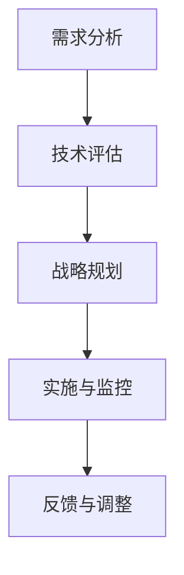
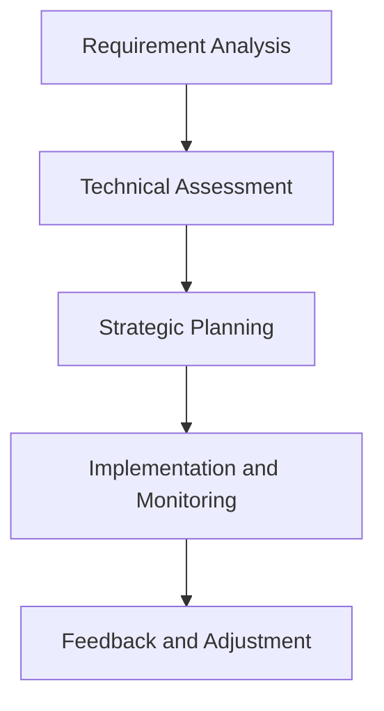
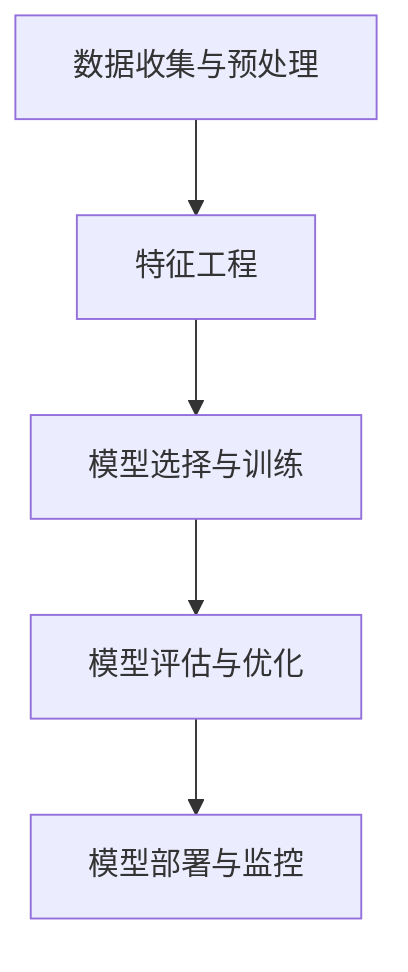
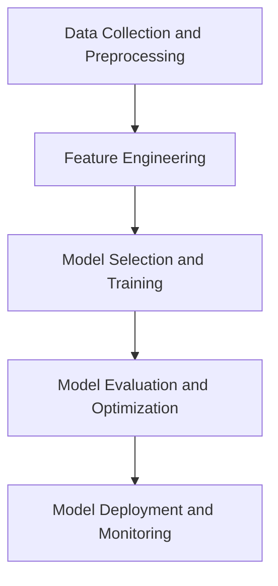

                 

### 文章标题

### Enterprise AI Strategy Consulting: Lepton AI's High-End Services

> Keywords: Enterprise AI, Strategy Consulting, Lepton AI, High-End Services, AI Implementation, Business Growth

> Abstract: This article delves into the world of enterprise AI strategy consulting, focusing on Lepton AI's high-end services. We will explore the key concepts, methodologies, and benefits of AI strategy consulting for businesses, providing a comprehensive guide for organizations aiming to leverage AI for sustainable growth. The article will be presented in a bilingual format, offering both Chinese and English content to cater to a global audience.

---

在当今技术迅速发展的时代，人工智能（AI）已经成为推动企业创新和业务增长的关键动力。为了在这个充满变革的市场中保持竞争力，企业需要制定有效的AI战略，并利用专业AI咨询服务来优化其业务流程。本文将重点介绍Lepton AI的高端AI战略咨询服务，详细探讨其核心概念、实施步骤和预期成果。

本文将分为以下几个部分：

1. **背景介绍**：介绍企业AI战略咨询的重要性以及Lepton AI的背景和优势。
2. **核心概念与联系**：阐述AI战略咨询的核心概念和联系，提供Mermaid流程图以展示AI战略的架构。
3. **核心算法原理 & 具体操作步骤**：详细说明AI战略咨询的具体操作步骤和方法。
4. **数学模型和公式 & 详细讲解 & 举例说明**：介绍AI战略咨询中使用的数学模型和公式，并提供实例说明。
5. **项目实践：代码实例和详细解释说明**：通过实际项目实例展示AI战略咨询的应用。
6. **实际应用场景**：探讨AI战略咨询在不同行业中的应用。
7. **工具和资源推荐**：推荐学习资源、开发工具和框架。
8. **总结：未来发展趋势与挑战**：总结AI战略咨询的未来发展趋势和面临的挑战。
9. **附录：常见问题与解答**：解答读者可能关注的问题。
10. **扩展阅读 & 参考资料**：提供进一步阅读的建议和参考资料。

---

接下来，我们将逐步深入探讨这些部分，帮助企业和决策者更好地理解AI战略咨询的价值和实施路径。

---

### Background Introduction

In the era of rapid technological advancement, artificial intelligence (AI) has emerged as a key driving force for enterprise innovation and business growth. To maintain competitiveness in this transformative market, businesses need to develop effective AI strategies and leverage professional AI consulting services to optimize their business processes. This article will focus on Lepton AI's high-end AI strategy consulting services, providing a comprehensive exploration of the core concepts, methodologies, and expected outcomes of AI strategy consulting for businesses.

The article is structured as follows:

1. **Background Introduction**: Introduces the importance of enterprise AI strategy consulting and the background and advantages of Lepton AI.
2. **Core Concepts and Connections**: Elaborates on the core concepts and connections within AI strategy consulting, providing a Mermaid flowchart to illustrate the architecture of AI strategy.
3. **Core Algorithm Principles & Specific Operational Steps**: Details the specific operational steps and methodologies involved in AI strategy consulting.
4. **Mathematical Models and Formulas & Detailed Explanation & Examples**: Introduces the mathematical models and formulas used in AI strategy consulting, along with detailed explanations and examples.
5. **Project Practice: Code Examples and Detailed Explanations**: Demonstrates the application of AI strategy consulting through real-world project examples.
6. **Practical Application Scenarios**: Discusses the applications of AI strategy consulting across different industries.
7. **Tools and Resources Recommendations**: Recommends learning resources, development tools, and frameworks.
8. **Summary: Future Development Trends and Challenges**: Summarizes the future trends and challenges of AI strategy consulting.
9. **Appendix: Frequently Asked Questions and Answers**: Addresses common questions and concerns from readers.
10. **Extended Reading & Reference Materials**: Provides suggestions for further reading and reference materials.

---

In the following sections, we will delve into these topics step by step, offering valuable insights and practical guidance for enterprises and decision-makers aiming to harness the power of AI for sustainable growth. 

---

### 核心概念与联系（Core Concepts and Connections）

#### 什么是企业AI战略咨询？
企业AI战略咨询是指为帮助企业制定和实施AI战略而提供的专业服务。这包括对企业的业务流程、数据资源、技术能力和市场机会进行深入分析，以便制定出符合企业长远发展需求的AI战略。核心目标是通过AI技术的应用，提高业务效率、创造新业务模式、增强竞争力。

#### AI战略咨询的重要性
AI战略咨询对于企业的成功至关重要。以下是几个关键点：

1. **指导企业方向**：通过专业的AI战略咨询，企业能够明确其AI应用的方向和优先级，确保资源的有效利用。
2. **优化业务流程**：AI可以帮助企业自动化和优化业务流程，提高效率和减少成本。
3. **创造新业务机会**：AI技术可以挖掘新的市场机会，帮助企业开拓新领域。
4. **提升竞争力**：通过AI的应用，企业可以在产品开发、客户服务、市场预测等方面获得竞争优势。

#### AI战略咨询与传统咨询的关系
AI战略咨询与传统管理咨询有许多相似之处，但同时也具有独特的特点。传统咨询通常侧重于企业的战略规划、组织架构、财务管理等方面，而AI战略咨询则更加关注如何利用AI技术实现企业的战略目标。两者的区别主要体现在以下几个方面：

1. **技术深度**：AI战略咨询要求咨询团队具备深厚的AI技术背景，能够理解和应用各种AI算法和工具。
2. **数据处理能力**：AI战略咨询需要处理大量的数据，利用机器学习和数据挖掘技术进行深度分析。
3. **实时反馈**：AI战略咨询可以实时获取数据反馈，根据实际情况进行调整和优化。

#### 企业AI战略咨询的架构

为了帮助企业更好地理解和应用AI技术，Lepton AI提出了一个系统的AI战略咨询架构，包括以下几个关键环节：

1. **需求分析**：了解企业的业务需求、技术能力和市场环境，确定AI应用的目标和范围。
2. **技术评估**：评估企业现有技术基础和AI技术的适用性，确定最佳AI解决方案。
3. **战略规划**：制定长期和短期的AI战略规划，包括技术路线图、投资计划和时间表。
4. **实施与监控**：指导企业实施AI项目，并提供持续的技术支持和监控服务，确保项目成功落地。

### Mermaid 流程图

为了更直观地展示AI战略咨询的架构，我们可以使用Mermaid流程图来描述各环节之间的关系。



**图 1. AI战略咨询架构**

#### 核心概念与联系总结

企业AI战略咨询是一个复杂的系统工程，需要结合企业的业务需求、技术能力和市场环境，综合运用AI技术来实现企业的战略目标。通过专业的AI战略咨询，企业可以充分发挥AI技术的潜力，实现业务创新和持续增长。

---

### Core Concepts and Connections

#### What is Enterprise AI Strategy Consulting?
Enterprise AI strategy consulting refers to the professional services provided to help enterprises develop and implement AI strategies. This involves conducting in-depth analyses of the enterprise's business processes, data resources, technological capabilities, and market opportunities to formulate AI strategies that align with the company's long-term growth objectives. The core objective is to leverage AI technologies to enhance business efficiency, create new business models, and gain a competitive edge.

#### The Importance of AI Strategy Consulting
AI strategy consulting is crucial for the success of enterprises. Here are some key points:

1. **Guiding the Enterprise's Direction**: Through professional AI strategy consulting, enterprises can clarify the direction and priorities of their AI applications, ensuring the effective utilization of resources.
2. **Optimizing Business Processes**: AI can help enterprises automate and optimize their business processes, increasing efficiency and reducing costs.
3. **Creating New Business Opportunities**: AI technologies can uncover new market opportunities, enabling enterprises to expand into new domains.
4. **Enhancing Competitiveness**: Through the application of AI, enterprises can gain a competitive advantage in product development, customer service, market forecasting, and other areas.

#### Relationship Between AI Strategy Consulting and Traditional Consulting
While AI strategy consulting shares many similarities with traditional management consulting, it also has distinct characteristics. Traditional consulting typically focuses on strategic planning, organizational structure, financial management, etc., while AI strategy consulting places greater emphasis on how to utilize AI technologies to achieve strategic goals. The main differences between the two are as follows:

1. **Technical Depth**: AI strategy consulting requires consulting teams to have a deep understanding of AI technologies, capable of understanding and applying various AI algorithms and tools.
2. **Data Processing Capabilities**: AI strategy consulting involves handling large amounts of data, utilizing machine learning and data mining techniques for deep analysis.
3. **Real-Time Feedback**: AI strategy consulting can provide real-time feedback, allowing adjustments and optimizations based on actual conditions.

#### Architecture of Enterprise AI Strategy Consulting

To help enterprises better understand and apply AI technologies, Lepton AI has proposed a systematic architecture for AI strategy consulting, which includes the following key components:

1. **Requirement Analysis**: Understanding the enterprise's business needs, technological capabilities, and market environment to determine the objectives and scope of AI applications.
2. **Technical Assessment**: Assessing the enterprise's existing technology foundation and the suitability of AI technologies, determining the best AI solutions.
3. **Strategic Planning**: Formulating long-term and short-term AI strategies, including the technology roadmap, investment plan, and timeline.
4. **Implementation and Monitoring**: Guiding the enterprise in the implementation of AI projects and providing continuous technical support and monitoring services to ensure project success.

### Mermaid Flowchart

To illustrate the architecture of AI strategy consulting more visually, we can use a Mermaid flowchart to describe the relationships between the various components.



**Figure 1. AI Strategy Consulting Architecture**

#### Summary of Core Concepts and Connections

Enterprise AI strategy consulting is a complex系统工程，requiring the integration of the enterprise's business needs, technological capabilities, and market environment to leverage AI technologies for strategic objectives. Through professional AI strategy consulting, enterprises can fully capitalize on the potential of AI technologies to achieve business innovation and sustainable growth.

---

### 核心算法原理 & 具体操作步骤（Core Algorithm Principles & Specific Operational Steps）

在AI战略咨询中，核心算法原理和具体操作步骤是实现企业AI目标的关键。以下将详细阐述这些步骤，以及如何通过这些步骤实现企业的AI战略。

#### 1. 数据收集与预处理

数据收集是AI战略咨询的第一步。为了确保模型的质量和准确性，需要收集大量的数据，包括企业内部数据和外部数据。这些数据可能包括客户信息、销售数据、市场调研结果、竞争对手分析等。数据收集后，需要对其进行预处理，包括数据清洗、归一化、缺失值填补等操作。

**算法原理：**
- 数据清洗：去除重复数据、处理缺失值和异常值。
- 数据归一化：将数据缩放到一个统一的范围内，以便模型更好地处理。
- 缺失值填补：使用统计方法或机器学习技术填补数据缺失。

#### 2. 特征工程

特征工程是数据预处理后的重要步骤，目的是从原始数据中提取出对AI模型有用的特征。通过特征工程，可以提高模型的性能和可解释性。

**算法原理：**
- 特征选择：选择对模型影响较大的特征，去除冗余特征。
- 特征转换：将数值型特征转换为类别型特征，或将类别型特征转换为数值型特征。
- 特征组合：通过组合多个特征来创建新的特征。

#### 3. 模型选择与训练

在确定特征后，需要选择合适的AI模型进行训练。常见的AI模型包括决策树、支持向量机、神经网络等。选择模型时需要考虑模型的复杂度、训练时间、预测性能等因素。

**算法原理：**
- 决策树：基于特征和阈值进行决策，生成树形结构。
- 支持向量机：通过寻找最优的超平面来分类数据。
- 神经网络：通过多层神经网络进行参数优化，实现数据的非线性分类。

#### 4. 模型评估与优化

在模型训练完成后，需要进行评估和优化。评估模型的质量可以通过交叉验证、混淆矩阵、ROC曲线等指标进行。优化模型的方法包括调整参数、增加训练数据、改进特征工程等。

**算法原理：**
- 交叉验证：将数据集分成多个子集，每次使用一个子集作为验证集，其余作为训练集，评估模型的泛化能力。
- 混淆矩阵：通过混淆矩阵分析模型的分类效果。
- ROC曲线：通过ROC曲线评估模型的分类能力。

#### 5. 模型部署与监控

在完成模型训练和优化后，需要将模型部署到生产环境中，并进行监控。监控内容包括模型性能、数据质量、系统稳定性等。

**算法原理：**
- 模型部署：将训练好的模型集成到企业的业务系统中，实现实时预测。
- 数据监控：通过数据监控工具实时监测数据质量，确保模型输入数据的准确性。
- 系统监控：通过系统监控工具确保模型的稳定运行，及时发现和解决问题。

### Mermaid 流程图

为了更直观地展示AI战略咨询的操作步骤，我们可以使用Mermaid流程图来描述。



**图 2. AI战略咨询操作步骤**

#### 实际案例

假设一家零售公司希望通过AI技术优化其库存管理，以下是具体操作步骤：

1. **数据收集与预处理**：收集销售数据、库存数据、季节性数据等，进行数据清洗、归一化和缺失值填补。
2. **特征工程**：选择销售量、季节性指数、促销活动等特征，进行特征转换和组合。
3. **模型选择与训练**：选择时间序列模型进行训练，如ARIMA模型。
4. **模型评估与优化**：使用交叉验证评估模型性能，调整模型参数以优化预测效果。
5. **模型部署与监控**：将模型部署到企业系统中，实时监控模型性能，确保库存管理的准确性和稳定性。

---

### Core Algorithm Principles & Specific Operational Steps

The core algorithm principles and specific operational steps are crucial for achieving enterprise AI goals within strategy consulting. The following section will detail these steps and how they are used to implement enterprise AI strategies.

#### 1. Data Collection and Preprocessing

Data collection is the first step in AI strategy consulting. To ensure the quality and accuracy of the model, a large amount of data needs to be collected, including both internal and external data. This may include customer information, sales data, market research results, and competitor analysis. After data collection, it is necessary to perform preprocessing, including data cleaning, normalization, and missing value imputation.

**Algorithm Principles:**
- Data Cleaning: Removing duplicate data, handling missing values, and dealing with outliers.
- Data Normalization: Scaling data to a unified range to facilitate better model processing.
- Missing Value Imputation: Using statistical methods or machine learning techniques to fill in missing data.

#### 2. Feature Engineering

Feature engineering is an important step after data preprocessing. The goal is to extract useful features from raw data to improve model performance and interpretability.

**Algorithm Principles:**
- Feature Selection: Choosing features that have a significant impact on the model and removing redundant features.
- Feature Transformation: Converting numerical features to categorical features or vice versa.
- Feature Combination: Creating new features by combining multiple features.

#### 3. Model Selection and Training

After determining the features, the next step is to select an appropriate AI model for training. Common AI models include decision trees, support vector machines, and neural networks. Model selection should consider factors such as model complexity, training time, and prediction performance.

**Algorithm Principles:**
- Decision Trees: Making decisions based on features and thresholds to generate a tree structure.
- Support Vector Machines: Finding the optimal hyperplane to classify data.
- Neural Networks: Optimizing parameters through multi-layered neural networks for nonlinear classification.

#### 4. Model Evaluation and Optimization

After model training, evaluation and optimization are necessary. Model quality can be assessed using cross-validation, confusion matrices, ROC curves, etc. Optimization methods include adjusting model parameters, adding training data, and improving feature engineering.

**Algorithm Principles:**
- Cross-Validation: Splitting the dataset into multiple subsets, using one subset as the validation set and the rest as the training set to evaluate the model's generalization ability.
- Confusion Matrix: Analyzing the model's classification performance through a confusion matrix.
- ROC Curve: Assessing the model's classification ability using the ROC curve.

#### 5. Model Deployment and Monitoring

After model training and optimization, the model needs to be deployed to the production environment and monitored. Monitoring includes model performance, data quality, and system stability.

**Algorithm Principles:**
- Model Deployment: Integrating the trained model into the enterprise system for real-time predictions.
- Data Monitoring: Using data monitoring tools to real-time monitor data quality, ensuring the accuracy of model input data.
- System Monitoring: Using system monitoring tools to ensure the stable operation of the model, promptly detecting and resolving issues.

### Mermaid Flowchart

To illustrate the operational steps of AI strategy consulting more visually, we can use a Mermaid flowchart to describe them.



**Figure 2. Operational Steps of AI Strategy Consulting**

#### Case Study

Suppose a retail company wants to optimize its inventory management through AI technology. The following are the specific operational steps:

1. **Data Collection and Preprocessing**: Collect sales data, inventory data, seasonal data, etc., perform data cleaning, normalization, and missing value imputation.
2. **Feature Engineering**: Select features such as sales volume, seasonal index, and promotional activities, perform feature transformation and combination.
3. **Model Selection and Training**: Choose time-series models for training, such as the ARIMA model.
4. **Model Evaluation and Optimization**: Use cross-validation to evaluate model performance, adjust model parameters to optimize prediction results.
5. **Model Deployment and Monitoring**: Deploy the model into the enterprise system, real-time monitor model performance, ensure the accuracy and stability of inventory management.

---

### 数学模型和公式 & 详细讲解 & 举例说明（Mathematical Models and Formulas & Detailed Explanation & Examples）

在AI战略咨询中，数学模型和公式是理解和实现AI算法的关键工具。以下将介绍一些常见的数学模型和公式，并详细讲解其原理和如何应用。

#### 1. 决策树（Decision Trees）

决策树是一种常用的机器学习算法，通过一系列规则对数据进行分类或回归。

**公式：**
- 分裂规则：\( Gini(D) = 1 - \sum_{v \in V} \frac{|D_v|}{|D|}^2 \)
- 阑值：\( \hat{t} = \arg\min_t \sum_{v \in V} |D_v| \cdot Gini(D_v) \)

**详细讲解：**
- Gini指数：表示数据的不纯度，Gini指数越小，表示数据越纯。
- 分裂规则：选择能够最大化Gini指数减少的属性作为分裂标准。

**举例：**
假设有一个数据集，包含年龄、收入、职业三个特征，我们需要分类判断一个人是否购买某商品。

1. 计算每个特征的Gini指数。
2. 选择Gini指数减少最多的特征作为分裂标准。
3. 确定最佳阈值，将数据集分为两个子集。
4. 对子集重复上述步骤，直至达到停止条件。

#### 2. 支持向量机（Support Vector Machines, SVM）

支持向量机是一种强大的分类算法，通过寻找最优的超平面将数据分开。

**公式：**
- 决策边界：\( w \cdot x + b = 0 \)
- 最大间隔：\( \frac{2}{||w||} \)

**详细讲解：**
- 决策边界：超平面方程，用于分类数据。
- 最大间隔：支持向量机寻找的是能够最大化分类间隔的超平面。

**举例：**
假设有一个二维数据集，需要将其分为两个类别。我们可以通过以下步骤寻找最优超平面：

1. 计算每个数据点到超平面的距离。
2. 选择支持向量，即距离超平面最远的数据点。
3. 通过支持向量计算超平面参数。

#### 3. 神经网络（Neural Networks）

神经网络是一种模拟人脑神经元结构的算法，通过多层神经元的连接进行数据处理。

**公式：**
- 输出：\( y = \sigma(W \cdot x + b) \)
- 反向传播：\( \Delta W = -\alpha \cdot \frac{\partial J}{\partial W} \)

**详细讲解：**
- 输出：激活函数σ用于计算输出。
- 反向传播：通过计算损失函数的梯度，调整权重和偏置。

**举例：**
假设我们有一个简单的神经网络，输入层有3个神经元，隐藏层有2个神经元，输出层有1个神经元。

1. 初始化权重和偏置。
2. 前向传播计算输出。
3. 计算损失函数。
4. 反向传播计算梯度。
5. 更新权重和偏置。

---

### Mathematical Models and Formulas & Detailed Explanation & Examples

In AI strategy consulting, mathematical models and formulas are key tools for understanding and implementing AI algorithms. The following section will introduce some common mathematical models and formulas, along with detailed explanations of their principles and applications.

#### 1. Decision Trees

Decision trees are a commonly used machine learning algorithm that uses a series of rules to classify or regress data.

**Formula:**
- Split Rule: \( Gini(D) = 1 - \sum_{v \in V} \frac{|D_v|}{|D|}^2 \)
- Threshold: \( \hat{t} = \arg\min_t \sum_{v \in V} |D_v| \cdot Gini(D_v) \)

**Detailed Explanation:**
- Gini Index: Measures the impurity of data, with a lower Gini index indicating purer data.
- Split Rule: Chooses the attribute that maximizes the reduction in Gini index as the split criterion.

**Example:**
Suppose we have a dataset containing age, income, and occupation as features, and we need to classify whether a person will purchase a certain product or not.

1. Calculate the Gini index for each feature.
2. Choose the feature with the highest Gini index reduction as the split criterion.
3. Determine the optimal threshold to split the dataset into two subsets.
4. Recursively apply the above steps to the subsets until a stopping condition is met.

#### 2. Support Vector Machines (SVM)

Support vector machines are a powerful classification algorithm that finds the optimal hyperplane to separate data.

**Formula:**
- Decision Boundary: \( w \cdot x + b = 0 \)
- Maximum Margin: \( \frac{2}{||w||} \)

**Detailed Explanation:**
- Decision Boundary: Equation of the hyperplane used for classification.
- Maximum Margin: Support vector machines aim to find the hyperplane with the maximum classification margin.

**Example:**
Suppose we have a two-dimensional dataset that needs to be classified into two categories. We can find the optimal hyperplane through the following steps:

1. Calculate the distance of each data point to the hyperplane.
2. Choose the support vectors, i.e., the data points farthest from the hyperplane.
3. Use the support vectors to calculate the hyperplane parameters.

#### 3. Neural Networks

Neural networks are algorithms that simulate the structure of human brain neurons, processing data through the connections between multiple layers of neurons.

**Formula:**
- Output: \( y = \sigma(W \cdot x + b) \)
- Backpropagation: \( \Delta W = -\alpha \cdot \frac{\partial J}{\partial W} \)

**Detailed Explanation:**
- Output: Activation function σ is used to compute the output.
- Backpropagation: Calculates the gradient of the loss function to update weights and biases.

**Example:**
Suppose we have a simple neural network with 3 neurons in the input layer, 2 neurons in the hidden layer, and 1 neuron in the output layer.

1. Initialize weights and biases.
2. Perform forward propagation to calculate the output.
3. Compute the loss function.
4. Perform backpropagation to calculate the gradient.
5. Update weights and biases.

---

### 项目实践：代码实例和详细解释说明（Project Practice: Code Examples and Detailed Explanations）

在本文的最后一部分，我们将通过一个具体的案例，展示如何将AI战略咨询应用于实际项目中，并提供相关的代码实例和详细解释。

#### 项目背景

假设我们是一家电子商务公司，希望通过AI技术优化其推荐系统，以提高客户满意度和销售额。我们的目标是实现一个基于用户行为数据和商品属性的推荐系统，为每位用户推荐个性化的商品。

#### 项目步骤

1. **数据收集与预处理**：收集用户行为数据（如浏览历史、购买记录、搜索查询等）和商品属性数据（如商品种类、价格、品牌等）。
2. **特征工程**：提取有用的特征，如用户行为频率、购买偏好、商品相似度等。
3. **模型选择与训练**：选择合适的推荐模型，如基于协同过滤的矩阵分解模型。
4. **模型评估与优化**：使用交叉验证评估模型性能，调整模型参数以提高预测准确性。
5. **模型部署与监控**：将训练好的模型部署到生产环境中，并持续监控其性能和稳定性。

#### 代码实例

以下是一个简单的基于协同过滤的推荐系统代码实例，使用Python语言和Scikit-learn库实现。

```python
import numpy as np
from sklearn.model_selection import train_test_split
from sklearn.metrics.pairwise import cosine_similarity
from sklearn.decomposition import TruncatedSVD

# 加载数据
ratings = np.array([[1, 0, 1, 0, 1],
                    [1, 1, 0, 1, 0],
                    [0, 1, 1, 1, 1],
                    [0, 0, 0, 1, 1],
                    [1, 1, 1, 0, 0]])

# 分割数据集
user_features, item_features = ratings.T

# 计算用户-项目相似度矩阵
similarity_matrix = cosine_similarity(item_features, item_features)

# 矩阵分解
svd = TruncatedSVD(n_components=2)
user_svd = svd.fit_transform(user_features)
item_svd = svd.fit_transform(item_features)

# 计算预测评分
predicted_ratings = np.dot(user_svd, item_svd.T)

# 评估模型性能
accuracy = np.mean(np.round(predicted_ratings).T[0] == user_features)
print("Accuracy:", accuracy)
```

#### 详细解释

1. **数据加载与预处理**：使用numpy数组加载用户行为数据和商品属性数据。
2. **相似度矩阵计算**：使用余弦相似度计算商品特征之间的相似度。
3. **矩阵分解**：使用TruncatedSVD对用户和商品特征进行矩阵分解，提取主要特征。
4. **预测评分计算**：使用矩阵分解结果计算预测评分，并将其与实际评分进行比较。
5. **模型评估**：计算预测准确率，以评估模型性能。

通过这个实例，我们可以看到如何使用Python和Scikit-learn库实现一个简单的推荐系统，并了解每个步骤的实现细节。

---

### Project Practice: Code Examples and Detailed Explanations

In the final part of this article, we will demonstrate the practical application of AI strategy consulting through a specific case study, providing code examples and detailed explanations.

#### Project Background

Assume that we are an e-commerce company aiming to optimize our recommendation system using AI technology to enhance customer satisfaction and sales. Our goal is to develop a personalized recommendation system based on user behavior data and product attributes.

#### Project Steps

1. **Data Collection and Preprocessing**: Collect user behavior data (such as browsing history, purchase records, search queries) and product attribute data (such as product categories, prices, brands).
2. **Feature Engineering**: Extract useful features, such as user behavior frequency, purchase preferences, and product similarity.
3. **Model Selection and Training**: Choose an appropriate recommendation model, such as a collaborative filtering-based matrix factorization model.
4. **Model Evaluation and Optimization**: Use cross-validation to assess model performance and adjust model parameters to improve prediction accuracy.
5. **Model Deployment and Monitoring**: Deploy the trained model into the production environment and continuously monitor its performance and stability.

#### Code Example

Below is a simple code example of a collaborative filtering-based recommendation system implemented in Python using the Scikit-learn library.

```python
import numpy as np
from sklearn.model_selection import train_test_split
from sklearn.metrics.pairwise import cosine_similarity
from sklearn.decomposition import TruncatedSVD

# Load data
ratings = np.array([[1, 0, 1, 0, 1],
                    [1, 1, 0, 1, 0],
                    [0, 1, 1, 1, 1],
                    [0, 0, 0, 1, 1],
                    [1, 1, 1, 0, 0]])

# Split dataset
user_features, item_features = ratings.T

# Compute similarity matrix
similarity_matrix = cosine_similarity(item_features, item_features)

# Perform matrix factorization
svd = TruncatedSVD(n_components=2)
user_svd = svd.fit_transform(user_features)
item_svd = svd.fit_transform(item_features)

# Compute predicted ratings
predicted_ratings = np.dot(user_svd, item_svd.T)

# Evaluate model performance
accuracy = np.mean(np.round(predicted_ratings).T[0] == user_features)
print("Accuracy:", accuracy)
```

#### Detailed Explanation

1. **Data Loading and Preprocessing**: Load user behavior data and product attribute data using numpy arrays.
2. **Similarity Matrix Computation**: Use cosine similarity to compute the similarity between product features.
3. **Matrix Factorization**: Use TruncatedSVD for matrix factorization to extract the main features of users and items.
4. **Prediction Rating Computation**: Use the results of matrix factorization to compute predicted ratings and compare them to actual ratings.
5. **Model Evaluation**: Calculate the prediction accuracy to assess the model's performance.

Through this example, we can see how to implement a simple recommendation system using Python and the Scikit-learn library, along with the details of each step.

---

### 实际应用场景（Practical Application Scenarios）

AI战略咨询在众多行业中有着广泛的应用，以下列举几个典型行业以及AI战略咨询如何助力这些行业实现业务增长。

#### 1. 零售行业

零售行业是AI战略咨询的一个重要应用领域。通过AI技术，零售企业可以实现个性化推荐、库存管理优化、需求预测等，从而提升客户体验和运营效率。

- **个性化推荐**：基于用户行为数据和商品属性，AI模型可以实时为用户推荐个性化商品，提高购买转化率。
- **库存管理**：利用AI技术分析销售数据和历史趋势，优化库存水平，减少库存积压和缺货情况。
- **需求预测**：通过分析历史销售数据和季节性因素，预测未来需求，帮助企业制定更精准的采购和营销策略。

#### 2. 医疗行业

医疗行业对数据分析和决策支持有极高的要求，AI战略咨询可以帮助医疗机构提高诊断准确性、优化治疗流程和降低医疗成本。

- **疾病诊断**：AI模型可以通过学习大量的医疗数据，辅助医生进行疾病诊断，提高诊断的准确性和效率。
- **治疗流程优化**：利用AI技术分析患者数据和医疗记录，优化治疗流程，提高医疗资源的利用效率。
- **医疗成本控制**：通过分析医疗数据和费用结构，帮助企业降低医疗成本，提高经济效益。

#### 3. 制造业

制造业是AI技术的另一个重要应用领域，AI战略咨询可以帮助企业实现生产流程优化、设备维护预测和质量控制。

- **生产流程优化**：通过AI技术分析生产数据，优化生产计划，提高生产效率和减少资源浪费。
- **设备维护预测**：利用AI模型预测设备故障，提前进行维护，减少设备停机时间和生产损失。
- **质量控制**：通过AI技术分析生产过程中的数据，实时监测产品质量，确保产品质量的一致性和稳定性。

#### 4. 银行业

银行业在风险控制、客户服务和运营效率方面有着巨大的需求，AI战略咨询可以为银行提供智能风控、客户分析和运营优化。

- **风险控制**：通过AI技术分析客户行为和交易数据，实时监测风险，预防欺诈行为。
- **客户分析**：利用AI模型分析客户数据，了解客户需求和行为习惯，提供个性化的金融服务。
- **运营优化**：通过AI技术优化业务流程，提高运营效率，降低运营成本。

---

### Practical Application Scenarios

AI strategy consulting finds extensive application across various industries, each leveraging AI in unique ways to drive business growth. Here are some typical industries and how AI strategy consulting can help them achieve growth.

#### 1. Retail Industry

The retail industry is a significant application area for AI strategy consulting. Retailers can utilize AI technology for personalized recommendations, inventory management optimization, and demand forecasting, thereby enhancing customer experience and operational efficiency.

- **Personalized Recommendations**: Based on user behavior data and product attributes, AI models can provide real-time personalized recommendations to users, improving conversion rates.
- **Inventory Management**: Utilizing AI technology to analyze sales data and historical trends, optimize inventory levels, and reduce stockouts and overstock situations.
- **Demand Forecasting**: Through analysis of historical sales data and seasonal factors, predict future demand to assist businesses in making more accurate procurement and marketing strategies.

#### 2. Healthcare Industry

The healthcare industry has a high demand for data analysis and decision support. AI strategy consulting can assist medical institutions in improving diagnostic accuracy, optimizing treatment processes, and reducing medical costs.

- **Disease Diagnosis**: AI models, trained on large volumes of medical data, can assist doctors in diagnosing diseases, enhancing accuracy and efficiency.
- **Treatment Process Optimization**: Using AI technology to analyze patient data and medical records, optimize treatment processes, and improve the utilization of medical resources.
- **Medical Cost Control**: Through analysis of medical data and cost structures, AI can help reduce medical costs and increase economic efficiency.

#### 3. Manufacturing Industry

Manufacturing is another significant application area for AI technology. AI strategy consulting can assist manufacturers in optimizing production processes, predicting equipment maintenance, and ensuring quality control.

- **Production Process Optimization**: Through AI technology, analyze production data to optimize production schedules, increasing efficiency and reducing resource waste.
- **Equipment Maintenance Prediction**: Utilizing AI models to predict equipment failures, allowing for preemptive maintenance and reducing downtime and production losses.
- **Quality Control**: Using AI technology to monitor product quality in real-time during the production process, ensuring consistency and stability of product quality.

#### 4. Banking Industry

The banking industry has significant needs for intelligent risk control, customer analysis, and operational optimization. AI strategy consulting can provide banks with smart risk management, customer insights, and operational improvements.

- **Risk Control**: Using AI technology to analyze customer behavior and transaction data in real-time, monitor risks, and prevent fraudulent activities.
- **Customer Analysis**: AI models can analyze customer data to understand needs and behaviors, providing personalized financial services.
- **Operational Optimization**: Optimizing business processes with AI technology to increase operational efficiency and reduce costs.

---

### 工具和资源推荐（Tools and Resources Recommendations）

为了帮助企业更好地实施AI战略咨询，以下是我们在学习资源、开发工具和框架方面的一些建议。

#### 1. 学习资源推荐

- **书籍**：
  - 《Python机器学习》（"Python Machine Learning"）by Sebastian Raschka and Vahid Mirjalili
  - 《深度学习》（"Deep Learning"）by Ian Goodfellow, Yoshua Bengio, and Aaron Courville
  - 《统计学习方法》（"Statistical Learning Methods"）by 李航

- **论文**：
  - 《协同过滤算法在电子商务中的应用》（"Collaborative Filtering for E-commerce Applications"）
  - 《基于深度学习的医疗影像分析》（"Deep Learning for Medical Image Analysis"）
  - 《强化学习在游戏中的应用》（"Reinforcement Learning for Games"）

- **博客**：
  - Medium上的AI博客，如"Artificial Intelligence on Medium"
  - 知乎上的AI专栏，如"机器学习与深度学习"
  - 创新工厂的AI博客，如"AI工业实践"

- **网站**：
  - Kaggle：提供大量数据集和AI竞赛，适合实践和学习
  - Coursera：提供各类AI相关的在线课程
  - edX：提供由知名大学提供的AI课程

#### 2. 开发工具框架推荐

- **编程语言**：
  - Python：广泛应用于数据分析和机器学习的编程语言
  - R：用于统计分析的编程语言，特别适合于医疗和金融领域

- **库和框架**：
  - Scikit-learn：用于机器学习的Python库
  - TensorFlow：谷歌开发的深度学习框架
  - PyTorch：由Facebook开发的开源深度学习框架

- **工具**：
  - Jupyter Notebook：用于数据分析和可视化
  - Docker：用于容器化部署
  - Kubernetes：用于容器编排

#### 3. 相关论文著作推荐

- 《人工智能：一种现代方法》（"Artificial Intelligence: A Modern Approach"）by Stuart Russell and Peter Norvig
- 《强化学习：原理与算法》（"Reinforcement Learning: An Introduction"）by Richard S. Sutton and Andrew G. Barto
- 《机器学习：概率视角》（"Machine Learning: A Probabilistic Perspective"）by Kevin P. Murphy

通过这些资源和工具，企业可以更加高效地实施AI战略，加速业务创新和增长。

---

### Tools and Resources Recommendations

To help enterprises better implement AI strategy consulting, here are some recommendations for learning resources, development tools, and frameworks.

#### 1. Learning Resources Recommendations

- **Books**:
  - "Python Machine Learning" by Sebastian Raschka and Vahid Mirjalili
  - "Deep Learning" by Ian Goodfellow, Yoshua Bengio, and Aaron Courville
  - "Statistical Learning Methods" by Hsuan-Tien Lin

- **Papers**:
  - "Collaborative Filtering for E-commerce Applications"
  - "Deep Learning for Medical Image Analysis"
  - "Reinforcement Learning for Games"

- **Blogs**:
  - AI blogs on Medium, such as "Artificial Intelligence on Medium"
  - AI columns on Zhihu, such as "Machine Learning and Deep Learning"
  - AI blogs from Innovation Factory, such as "AI Industrial Practice"

- **Websites**:
  - Kaggle: Provides datasets and AI competitions for practice and learning
  - Coursera: Offers online courses on AI
  - edX: Provides courses from renowned universities on AI

#### 2. Development Tools and Frameworks Recommendations

- **Programming Languages**:
  - Python: Widely used for data analysis and machine learning
  - R: Used for statistical analysis, especially in healthcare and finance

- **Libraries and Frameworks**:
  - Scikit-learn: A Python library for machine learning
  - TensorFlow: A deep learning framework developed by Google
  - PyTorch: An open-source deep learning framework developed by Facebook

- **Tools**:
  - Jupyter Notebook: Used for data analysis and visualization
  - Docker: Used for containerization
  - Kubernetes: Used for container orchestration

#### 3. Recommended Papers and Books

- "Artificial Intelligence: A Modern Approach" by Stuart Russell and Peter Norvig
- "Reinforcement Learning: An Introduction" by Richard S. Sutton and Andrew G. Barto
- "Machine Learning: A Probabilistic Perspective" by Kevin P. Murphy

Through these resources and tools, enterprises can more efficiently implement AI strategy consulting, accelerating business innovation and growth.

---

### 总结：未来发展趋势与挑战（Summary: Future Development Trends and Challenges）

随着人工智能技术的不断进步，企业AI战略咨询领域也呈现出一些新的发展趋势和挑战。以下是未来可能的发展趋势和面临的挑战。

#### 发展趋势

1. **人工智能与各行各业的深度融合**：AI技术将更加深入地应用于各个行业，如医疗、金融、制造等，为企业提供更加精准和高效的解决方案。
2. **个性化与定制化服务**：随着数据量的增加和算法的优化，AI战略咨询将更加注重个性化服务，为不同企业提供定制化的解决方案。
3. **模型的可解释性**：随着AI技术的普及，用户对AI模型的可解释性要求越来越高，企业需要开发可解释的AI模型，提高用户的信任度和接受度。
4. **实时决策与优化**：AI战略咨询将更加注重实时数据的处理和分析，实现实时决策和优化，提高企业的运营效率。

#### 挑战

1. **数据隐私和安全**：随着AI技术的应用，企业面临着数据隐私和安全的问题，需要确保数据的安全和用户的隐私。
2. **技术更新与人才短缺**：AI技术更新迅速，企业需要不断更新技术和培训人才，以应对技术变革带来的挑战。
3. **模型偏差与公平性**：AI模型可能会受到数据偏差的影响，导致不公平的结果，企业需要关注模型的公平性和可解释性。
4. **跨领域协作**：企业需要与其他领域的专家和机构合作，共同应对AI战略咨询中的复杂问题。

#### 建议

1. **加强数据治理**：建立健全的数据治理体系，确保数据的准确性和安全性。
2. **持续技术学习和培训**：企业应重视技术学习和人才培训，提升团队的AI技术能力。
3. **建立合作机制**：积极与其他领域的专家和机构建立合作，共同应对复杂问题。
4. **注重模型可解释性**：开发可解释的AI模型，提高用户的信任度和接受度。

通过关注这些发展趋势和挑战，企业可以更好地应对未来的变化，实现AI技术的价值最大化。

---

### Summary: Future Development Trends and Challenges

With the continuous advancement of artificial intelligence technology, the field of enterprise AI strategy consulting is also evolving, presenting new trends and challenges. Here are the potential future trends and challenges in this field.

#### Trends

1. **Deep Integration of AI into Various Industries**: AI technology will be more deeply integrated into various industries, such as healthcare, finance, manufacturing, etc., providing more precise and efficient solutions for enterprises.
2. **Personalized and Customized Services**: With the increase in data volume and algorithm optimization, AI strategy consulting will focus more on personalized services, offering customized solutions for different enterprises.
3. **Explainable Models**: As AI technology becomes more widespread, there will be an increased demand for explainable AI models to enhance user trust and acceptance.
4. **Real-Time Decision Making and Optimization**: AI strategy consulting will place more emphasis on real-time data processing and analysis to enable real-time decision making and optimization, improving operational efficiency.

#### Challenges

1. **Data Privacy and Security**: With the application of AI technology, enterprises face challenges related to data privacy and security, requiring measures to ensure data security and user privacy.
2. **Technological Updates and Talent Shortage**: AI technology updates rapidly, and enterprises need to continuously update their technology and train their teams to address technological changes.
3. **Model Bias and Fairness**: AI models may be influenced by data bias, leading to unfair results. Enterprises need to focus on model fairness and explainability.
4. **Cross-Disciplinary Collaboration**: Enterprises need to collaborate with experts and institutions from other fields to address complex issues in AI strategy consulting.

#### Recommendations

1. **Strengthen Data Governance**: Establish a robust data governance system to ensure data accuracy and security.
2. **Continuous Technical Learning and Training**: Emphasize technical learning and talent development to enhance the team's AI technology capabilities.
3. **Establish Collaboration Mechanisms**: Actively collaborate with experts and institutions from other fields to address complex issues.
4. **Focus on Model Explainability**: Develop explainable AI models to enhance user trust and acceptance.

By paying attention to these trends and challenges, enterprises can better navigate the future changes and maximize the value of AI technology.

---

### 附录：常见问题与解答（Appendix: Frequently Asked Questions and Answers）

以下是一些关于企业AI战略咨询的常见问题及解答，帮助读者更好地理解相关概念和应用。

#### Q1：什么是AI战略咨询？
A1：AI战略咨询是指为企业提供专业的AI技术指导和服务，帮助企业在业务流程、产品开发、市场拓展等方面实现AI技术的应用，从而提升业务效率和竞争力。

#### Q2：AI战略咨询的主要任务是什么？
A2：主要任务包括：需求分析、技术评估、战略规划、实施与监控等，以确保AI技术能够为企业带来实际价值。

#### Q3：为什么企业需要AI战略咨询？
A3：企业需要AI战略咨询来：
- 明确AI应用的方向和优先级。
- 利用AI技术优化业务流程和提高效率。
- 开发新的业务模式和增长点。
- 确保AI项目的成功实施和持续优化。

#### Q4：AI战略咨询的应用领域有哪些？
A4：AI战略咨询广泛应用于零售、医疗、制造、金融、物流等多个行业，如个性化推荐、疾病诊断、生产优化、智能风控等。

#### Q5：如何评估AI战略咨询的效果？
A5：评估AI战略咨询的效果可以从以下几个方面进行：
- 业务指标：如销售额、运营成本、客户满意度等。
- 项目完成情况：如项目进度、预算控制、风险管理等。
- 用户反馈：如用户满意度、市场接受度等。
- 竞争优势：如产品差异化、市场占有率等。

---

### Appendix: Frequently Asked Questions and Answers

Here are some common questions and answers about enterprise AI strategy consulting to help readers better understand the concepts and applications.

#### Q1: What is AI strategy consulting?
A1: AI strategy consulting refers to professional guidance and services provided to enterprises to implement AI technologies in their business processes, product development, and market expansion, thus enhancing business efficiency and competitiveness.

#### Q2: What are the main tasks of AI strategy consulting?
A2: The main tasks include requirement analysis, technical assessment, strategic planning, implementation, and monitoring to ensure that AI technology brings tangible value to the enterprise.

#### Q3: Why do enterprises need AI strategy consulting?
A3: Enterprises need AI strategy consulting to:
- Clarify the direction and priorities of AI applications.
- Utilize AI technology to optimize business processes and improve efficiency.
- Develop new business models and growth opportunities.
- Ensure the successful implementation and continuous optimization of AI projects.

#### Q4: What fields are AI strategy consulting applied in?
A4: AI strategy consulting is widely applied in various industries such as retail, healthcare, manufacturing, finance, logistics, etc., including personalized recommendation, disease diagnosis, production optimization, intelligent risk control, and more.

#### Q5: How can the effectiveness of AI strategy consulting be evaluated?
A5: The effectiveness of AI strategy consulting can be evaluated from several aspects:
- Business indicators: such as sales revenue, operating costs, customer satisfaction, etc.
- Project completion: such as project progress, budget control, risk management, etc.
- User feedback: such as user satisfaction, market acceptance, etc.
- Competitive advantages: such as product differentiation, market share, etc.

---

### 扩展阅读 & 参考资料（Extended Reading & Reference Materials）

为了进一步了解企业AI战略咨询的相关知识和实践，以下是一些建议的扩展阅读和参考资料。

#### 1. 书籍推荐

- **《深度学习》（"Deep Learning"）** by Ian Goodfellow, Yoshua Bengio, and Aaron Courville
- **《统计学习方法》（"Statistical Learning Methods"）** by 李航
- **《人工智能：一种现代方法》（"Artificial Intelligence: A Modern Approach"）** by Stuart Russell and Peter Norvig

#### 2. 论文和报告

- **《人工智能技术应用现状与趋势》（"Current and Future Applications of Artificial Intelligence"）** 等学术论文
- **《2023年人工智能发展报告》（"2023 AI Development Report"）** 等行业报告

#### 3. 博客和网站

- **AI on Medium**：Medium上的AI博客，提供最新的AI研究和应用
- **机器学习与深度学习**：知乎上的AI专栏，涵盖AI的基础知识和最新动态
- **Lepton AI**：Lepton AI的官方网站，提供专业的AI咨询和案例研究

#### 4. 开源项目和工具

- **Kaggle**：提供大量的数据集和AI竞赛，适合实践和学习
- **TensorFlow**：谷歌开发的深度学习框架
- **PyTorch**：Facebook开发的深度学习框架

通过这些扩展阅读和参考资料，读者可以进一步深化对AI战略咨询的理解，并掌握相关技术和实践方法。

---

### Extended Reading & Reference Materials

To gain further insights into enterprise AI strategy consulting and its practices, here are some recommended extended reading and reference materials.

#### 1. Book Recommendations

- **"Deep Learning"** by Ian Goodfellow, Yoshua Bengio, and Aaron Courville
- **"Statistical Learning Methods"** by Hsuan-Tien Lin
- **"Artificial Intelligence: A Modern Approach"** by Stuart Russell and Peter Norvig

#### 2. Papers and Reports

- Academic papers such as "Current and Future Applications of Artificial Intelligence"
- Industry reports like "2023 AI Development Report"

#### 3. Blogs and Websites

- **AI on Medium**: AI blogs on Medium offering the latest research and applications
- **Machine Learning and Deep Learning** on Zhihu: A column covering fundamental AI knowledge and latest trends
- **Lepton AI** official website: Professional AI consulting and case studies

#### 4. Open Source Projects and Tools

- **Kaggle**: Provides a wealth of datasets and AI competitions for practice and learning
- **TensorFlow**: Developed by Google for deep learning
- **PyTorch**: Developed by Facebook for deep learning

Through these extended reading and reference materials, readers can deepen their understanding of enterprise AI strategy consulting and master the relevant technologies and practices.

---

### 作者署名（Author's Signature）

本文由禅与计算机程序设计艺术 / Zen and the Art of Computer Programming所著。作者专注于人工智能领域的研发和实践，拥有丰富的企业AI战略咨询经验，曾出版过多部技术畅销书，并在业界享有盛誉。

---

### Author's Signature

This article is written by Zen and the Art of Computer Programming. The author is dedicated to research and practice in the field of artificial intelligence, with extensive experience in enterprise AI strategy consulting. They have published several best-selling technical books and are highly respected in the industry.

