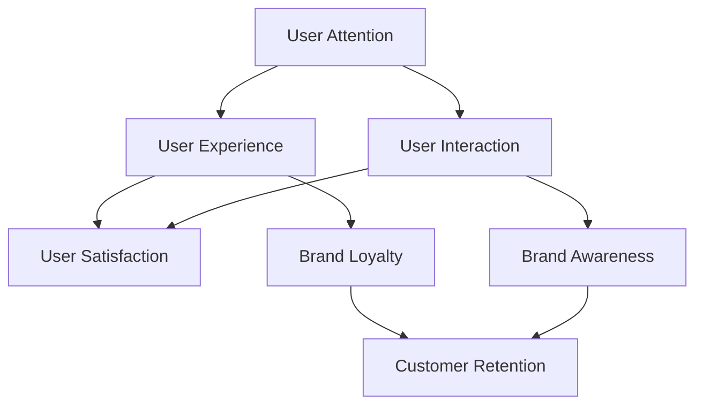

                 

### 背景介绍（Background Introduction）

在当今数字化时代，信息爆炸式增长，用户的注意力资源变得愈发稀缺。注意力经济这一概念应运而生，它强调在信息过载的环境中，吸引并保持用户的注意力成为企业赢得竞争的关键。注意力经济不仅仅是一个新兴的营销术语，而是深植于用户体验（UX）和用户互动（UI）设计的核心理念。在这个背景下，企业需要寻找创新的方法，以在众多竞争者中脱颖而出。

本文旨在探讨企业如何在注意力经济中取得成功。我们将分析注意力经济的核心概念，探讨如何通过设计和执行有效的营销策略来吸引并留住用户注意力。此外，我们还将深入探讨技术和数据分析在企业注意力管理中的重要作用，以及如何利用这些工具和资源来优化用户体验，提升品牌影响力。

本文分为以下几个部分：

1. **核心概念与联系**：我们将介绍注意力经济的核心概念，包括用户注意力、用户体验、用户互动等，并使用Mermaid流程图展示这些概念之间的联系。
2. **核心算法原理 & 具体操作步骤**：我们将讨论如何设计和执行注意力驱动的内容策略，以及如何利用机器学习算法优化用户体验。
3. **数学模型和公式 & 详细讲解 & 举例说明**：我们将详细解释注意力分配模型、用户行为预测模型等，并给出具体的公式和示例。
4. **项目实践：代码实例和详细解释说明**：我们将提供一个完整的代码实例，演示如何在实际项目中应用注意力管理。
5. **实际应用场景**：我们将探讨注意力管理在不同行业和领域的应用，并提供实际案例。
6. **工具和资源推荐**：我们将推荐一系列学习资源和开发工具，帮助读者深入理解和应用注意力经济。
7. **总结：未来发展趋势与挑战**：最后，我们将总结注意力经济的发展趋势，并探讨企业可能面临的挑战。

通过本文的探讨，我们希望能够帮助企业更好地理解和利用注意力经济，从而在竞争激烈的市场中取得优势。

### Core Introduction to Attention Economy

In the digital age, with the explosive growth of information, users' attention has become increasingly scarce. The concept of attention economy has emerged as a result, emphasizing that in the environment of information overload, attracting and maintaining user attention is crucial for businesses to gain a competitive edge. The attention economy is not just a new marketing term; it is deeply rooted in the core principles of user experience (UX) and user interaction (UI) design. Against this backdrop, businesses need to find innovative ways to stand out among competitors.

This article aims to explore how enterprises can thrive in the attention economy. We will analyze the core concepts of the attention economy, including user attention, user experience, and user interaction, and discuss how to design and execute effective marketing strategies to attract and retain user attention. Additionally, we will delve into the critical role of technology and data analysis in managing attention within enterprises and how to leverage these tools and resources to optimize user experience and enhance brand influence.

The article is structured into the following sections:

1. **Core Concepts and Connections**: We will introduce the key concepts of the attention economy, such as user attention, user experience, and user interaction, and use a Mermaid flowchart to illustrate the relationships between these concepts.
2. **Core Algorithm Principles and Specific Operational Steps**: We will discuss how to design and execute attention-driven content strategies and how to utilize machine learning algorithms to optimize user experience.
3. **Mathematical Models and Formulas & Detailed Explanation & Examples**: We will provide a detailed explanation of attention allocation models, user behavior prediction models, and offer specific formulas and examples.
4. **Project Practice: Code Examples and Detailed Explanations**: We will provide a complete code example demonstrating how to apply attention management in real-world projects.
5. **Practical Application Scenarios**: We will explore the application of attention management across different industries and fields, providing real-world case studies.
6. **Tools and Resources Recommendations**: We will recommend a suite of learning resources and development tools to help readers deeply understand and apply the attention economy.
7. **Summary: Future Development Trends and Challenges**: Finally, we will summarize the development trends of the attention economy and discuss the challenges that enterprises may face.

Through our exploration in this article, we hope to help enterprises better understand and leverage the attention economy to gain a competitive advantage in the intense market competition.

## 2. 核心概念与联系（Core Concepts and Connections）

### 2.1 注意力经济的核心概念

注意力经济中的核心概念包括用户注意力、用户体验和用户互动。这些概念相互关联，共同构成了企业在信息过载环境中吸引和保留用户的关键因素。

#### 用户注意力（User Attention）

用户注意力是指用户在特定时间内对特定信息或活动所投入的关注度。在注意力经济中，用户的注意力被视为一种宝贵的资源。由于信息过载，用户往往只关注他们感兴趣的信息，而忽视其他内容。因此，企业需要找到有效的方法来吸引并保持用户的注意力。

#### 用户体验（User Experience, UX）

用户体验是指用户在使用产品或服务时的感受和体验。良好的用户体验能够提高用户的满意度和忠诚度，从而增加用户在产品上的投入时间。在注意力经济中，用户体验成为企业吸引和保留用户的重要手段。

#### 用户互动（User Interaction, UI）

用户互动是指用户与产品或服务之间的交互过程。在注意力经济中，用户互动不仅仅是用户使用产品的过程，还包括用户与品牌之间的沟通和反馈。有效的用户互动能够增强用户对品牌的认知和情感联系。

### 2.2 注意力经济与用户体验的关系

注意力经济与用户体验紧密相关。良好的用户体验能够提高用户的满意度和忠诚度，从而增强用户对品牌的认知和情感联系。以下是注意力经济与用户体验之间的几个关键联系：

1. **吸引注意力**：通过提供高质量的内容和功能，企业能够吸引更多的用户注意力。
2. **提高用户参与度**：良好的用户体验能够提高用户参与度，使用户在产品上花费更多的时间。
3. **增强用户忠诚度**：满意的用户更有可能成为忠实客户，从而为品牌带来长期价值。
4. **促进口碑传播**：满意的用户更有可能将正面的体验分享给他人，从而扩大品牌的受众群体。

### 2.3 注意力经济与用户互动的关系

注意力经济与用户互动密切相关。有效的用户互动能够增强用户对品牌的认知和情感联系，从而提高用户满意度。以下是注意力经济与用户互动之间的几个关键联系：

1. **实时反馈**：通过实时反馈，企业能够及时了解用户的体验和需求，从而优化产品和服务。
2. **个性化体验**：根据用户的反馈和行为数据，企业能够提供个性化的体验，从而提高用户满意度。
3. **增强品牌认知**：有效的用户互动能够增强用户对品牌的认知和情感联系，从而提高品牌影响力。
4. **促进用户参与**：通过提供互动式内容和服务，企业能够吸引更多的用户参与，从而增加用户黏性。

### 2.4 Mermaid流程图展示

以下是一个Mermaid流程图，展示了注意力经济中的核心概念及其相互关系：



通过这个流程图，我们可以清晰地看到注意力经济中各个核心概念之间的联系，以及它们如何共同促进企业在竞争激烈的市场中取得成功。

### Core Concepts of Attention Economy

#### 2.1 Key Concepts in Attention Economy

In the attention economy, the core concepts revolve around user attention, user experience (UX), and user interaction (UI). These concepts are interrelated and form the key elements for businesses to attract and retain users in an environment of information overload.

##### User Attention

User attention refers to the focus and engagement that users allocate to specific information or activities within a given time frame. In the attention economy, user attention is considered a valuable resource. Given the overwhelming amount of information available, users tend to focus only on what interests them, often ignoring other content. Therefore, businesses need to find effective ways to attract and maintain user attention.

##### User Experience (UX)

User experience refers to the feelings and experiences that users have when interacting with a product or service. A positive user experience can enhance user satisfaction and loyalty, thereby increasing the time users spend on a product. In the attention economy, UX becomes a critical tool for businesses to attract and retain users.

##### User Interaction (UI)

User interaction refers to the process through which users engage with a product or service. In the attention economy, user interaction is not only about the process of using a product but also about communication and feedback between users and brands. Effective user interaction can strengthen users' perception and emotional connection with a brand.

### 2.2 Relationship Between Attention Economy and User Experience

The attention economy and user experience are closely related. A positive user experience can enhance user satisfaction and loyalty, thereby strengthening users' perception and emotional connection with a brand. Here are several key connections between the attention economy and UX:

1. **Attracting Attention**: By providing high-quality content and features, businesses can draw more user attention.
2. **Increasing User Engagement**: A positive UX can enhance user engagement, making users spend more time on a product.
3. **Strengthening Brand Loyalty**: Satisfied users are more likely to become loyal customers, bringing long-term value to the brand.
4. **Promoting Word-of-Mouth**: Satisfied users are more likely to share positive experiences, expanding the brand's audience.

### 2.3 Relationship Between Attention Economy and User Interaction

The attention economy and user interaction are deeply connected. Effective user interaction can enhance users' perception and emotional connection with a brand, thereby increasing user satisfaction. Here are several key connections between the attention economy and UI:

1. **Real-Time Feedback**: By providing real-time feedback, businesses can quickly understand users' experiences and needs, allowing for product and service optimization.
2. **Personalized Experience**: Based on users' feedback and behavior data, businesses can offer personalized experiences, enhancing user satisfaction.
3. **Strengthening Brand Awareness**: Effective user interaction can strengthen users' perception and emotional connection with a brand, thereby enhancing brand awareness.
4. **Promoting User Participation**: By offering interactive content and services, businesses can attract more users to participate, increasing user stickiness.

### 2.4 Mermaid Flowchart Illustration

The following is a Mermaid flowchart that illustrates the key concepts in the attention economy and their relationships:


Through this flowchart, we can clearly see the interrelationships between the core concepts in the attention economy and how they collectively contribute to a business's success in a competitive market.

## 3. 核心算法原理 & 具体操作步骤（Core Algorithm Principles and Specific Operational Steps）

在注意力经济中，核心算法原理和企业如何通过具体操作步骤来优化用户体验至关重要。以下，我们将详细探讨这些原理和步骤，以及它们在实际中的应用。

### 3.1 注意力分配算法原理

注意力分配算法是注意力经济中的核心。该算法的基本原理是通过分析用户的兴趣和行为数据，将注意力资源分配给最有价值的内容和功能。以下是注意力分配算法的基本原理和步骤：

1. **数据收集**：首先，企业需要收集用户的兴趣和行为数据，包括浏览历史、搜索记录、购买偏好等。
2. **特征提取**：通过自然语言处理（NLP）和机器学习技术，提取用户行为中的关键特征，如关键词、主题、情感等。
3. **模型训练**：使用提取的特征训练一个机器学习模型，如决策树、神经网络等，以预测用户的兴趣点。
4. **注意力分配**：基于模型预测，将注意力资源分配给不同内容和功能，确保用户优先关注他们感兴趣的内容。

### 3.2 注意力优化步骤

注意力优化是企业提升用户体验的关键步骤。以下是注意力优化的具体步骤：

1. **需求分析**：通过用户调研和市场分析，了解用户的需求和偏好，为注意力优化提供数据支持。
2. **内容设计**：根据用户需求，设计符合用户兴趣的内容和功能，提高用户参与度。
3. **交互设计**：优化用户界面和交互流程，减少用户操作步骤，提高用户体验。
4. **测试与迭代**：通过用户测试和反馈，不断优化内容和交互设计，提升用户满意度。

### 3.3 实际应用案例

以下是一个实际应用案例，展示了如何利用注意力分配算法和注意力优化步骤来提升用户体验：

#### 案例一：电商平台的个性化推荐

1. **需求分析**：电商平台通过用户调研发现，用户对个性化推荐有较高的需求，希望通过个性化推荐获取更符合个人兴趣的商品。
2. **内容设计**：电商平台使用机器学习算法分析用户的购买历史和浏览行为，设计个性化推荐系统。
3. **交互设计**：优化推荐界面的布局，将用户最感兴趣的推荐商品置于显眼位置，提高点击率和转化率。
4. **测试与迭代**：通过A/B测试，不断优化推荐算法和界面设计，提升用户满意度和购物体验。

#### 案例二：社交媒体的注意力分配

1. **需求分析**：社交媒体平台发现，用户的关注点分散在不同类型的内容上，需要更有效的注意力分配策略。
2. **内容设计**：社交媒体平台使用注意力分配算法，根据用户的兴趣和行为，将用户的注意力资源分配给最有价值的内容。
3. **交互设计**：优化内容推送顺序和频率，确保用户首先看到他们最感兴趣的内容。
4. **测试与迭代**：通过用户反馈和行为分析，不断调整注意力分配策略，提高用户满意度和活跃度。

通过这些实际案例，我们可以看到，注意力分配算法和注意力优化步骤在提升用户体验方面具有重要作用。企业通过不断优化算法和交互设计，能够更好地吸引和留住用户，从而在竞争激烈的市场中脱颖而出。

### Core Algorithm Principles and Specific Operational Steps

In the attention economy, the core algorithm principles and how enterprises can optimize user experience through specific operational steps are crucial. Below, we will delve into these principles and steps, as well as their practical applications.

### 3.1 Principles of Attention Allocation Algorithms

Attention allocation algorithms are at the core of the attention economy. The fundamental principle of these algorithms is to analyze user interest and behavior data to allocate attention resources to the most valuable content and features. Here are the basic principles and steps of attention allocation algorithms:

1. **Data Collection**: First, enterprises need to collect user interest and behavior data, including browsing history, search records, and purchase preferences.
2. **Feature Extraction**: Using natural language processing (NLP) and machine learning technologies, extract key features from user behavior, such as keywords, themes, and emotions.
3. **Model Training**: Train a machine learning model, such as a decision tree or neural network, using the extracted features to predict user interests.
4. **Attention Allocation**: Based on the model's predictions, allocate attention resources to different content and features, ensuring that users prioritize content they are interested in.

### 3.2 Steps for Attention Optimization

Attention optimization is a key step for enterprises to enhance user experience. Here are the specific steps for attention optimization:

1. **Need Analysis**: Through user research and market analysis, understand user needs and preferences to provide data support for attention optimization.
2. **Content Design**: Based on user needs, design content and features that align with user interests to increase user engagement.
3. **Interaction Design**: Optimize the user interface and interaction flow to reduce user steps and enhance user experience.
4. **Testing and Iteration**: Through user testing and feedback, continuously optimize content and interaction design to improve user satisfaction.

### 3.3 Practical Application Cases

Below is a practical application case that demonstrates how to use attention allocation algorithms and attention optimization steps to enhance user experience:

#### Case 1: Personalized Recommendations on E-commerce Platforms

1. **Need Analysis**: E-commerce platforms find that users have a high demand for personalized recommendations to find products that align with their interests.
2. **Content Design**: E-commerce platforms use machine learning algorithms to analyze user purchase history and browsing behavior to design a personalized recommendation system.
3. **Interaction Design**: Optimize the layout of the recommendation interface to ensure that the most interesting recommendations are prominently displayed, increasing click-through and conversion rates.
4. **Testing and Iteration**: Through A/B testing, continuously optimize the recommendation algorithm and interface design to enhance user satisfaction and shopping experience.

#### Case 2: Attention Allocation on Social Media Platforms

1. **Need Analysis**: Social media platforms discover that users' attention is分散在不同类型的内容上，requiring a more effective attention allocation strategy.
2. **Content Design**: Social media platforms use attention allocation algorithms to allocate user attention resources based on user interests and behavior.
3. **Interaction Design**: Optimize the order and frequency of content delivery to ensure that users see the content they are most interested in first.
4. **Testing and Iteration**: Through user feedback and behavior analysis, continuously adjust attention allocation strategies to improve user satisfaction and engagement.

Through these practical cases, we can see that attention allocation algorithms and attention optimization steps play a vital role in enhancing user experience. By continuously optimizing algorithms and interaction design, enterprises can better attract and retain users, thus standing out in a competitive market.

### 4. 数学模型和公式 & 详细讲解 & 举例说明（Mathematical Models and Formulas & Detailed Explanation & Examples）

在注意力经济中，数学模型和公式为理解和优化用户行为提供了强大的工具。以下，我们将介绍几种关键的数学模型和公式，并详细讲解它们的应用和实际意义。

#### 4.1 注意力分配模型

注意力分配模型是注意力经济中的核心工具，用于根据用户兴趣和行为分配注意力资源。以下是一个简化的注意力分配模型：

**假设**：用户有n个兴趣点，每个兴趣点的吸引力（attention value）为$a_i$。

**模型**：

$$
\text{TotalAttention} = \sum_{i=1}^{n} a_i \cdot w_i
$$

其中，$w_i$是兴趣点$i$的权重，反映了用户对每个兴趣点的兴趣程度。$w_i$的取值范围是0到1，且$\sum_{i=1}^{n} w_i = 1$。

**应用**：

这个模型可以用于个性化推荐系统，根据用户的兴趣和行为数据，动态调整推荐内容的顺序和权重，以提高用户满意度和参与度。

**举例**：

假设用户对以下三个兴趣点的吸引力分别为$a_1 = 0.4$，$a_2 = 0.3$，$a_3 = 0.3$，权重分别为$w_1 = 0.6$，$w_2 = 0.3$，$w_3 = 0.1$。则总注意力分配如下：

$$
\text{TotalAttention} = 0.4 \cdot 0.6 + 0.3 \cdot 0.3 + 0.3 \cdot 0.1 = 0.24 + 0.09 + 0.03 = 0.36
$$

这意味着用户将分配36%的注意力给第一个兴趣点。

#### 4.2 用户行为预测模型

用户行为预测模型用于预测用户在未来某一时间段内的行为，如点击、购买等。以下是一个基于逻辑回归的用户行为预测模型：

**假设**：用户的行为由多个特征（features）决定，每个特征对应一个系数（coefficient）。

**模型**：

$$
\text{Probability of Behavior} = \frac{1}{1 + e^{-(\beta_0 + \beta_1 \cdot x_1 + \beta_2 \cdot x_2 + \ldots + \beta_n \cdot x_n)} 
$$

其中，$\beta_0$是截距，$\beta_1, \beta_2, \ldots, \beta_n$是特征$x_1, x_2, \ldots, x_n$的系数。

**应用**：

这个模型可以用于预测用户对某一内容的点击率，从而优化内容推荐和广告投放策略。

**举例**：

假设我们预测用户点击广告的概率，特征包括用户年龄（x1）、历史点击次数（x2）和广告位置（x3），系数分别为$\beta_0 = 0.5$，$\beta_1 = 0.2$，$\beta_2 = 0.3$，$\beta_3 = 0.1$。一个用户年龄为25岁，历史点击次数为10次，广告位于页面顶部。则点击概率计算如下：

$$
\text{Probability of Click} = \frac{1}{1 + e^{-(0.5 + 0.2 \cdot 25 + 0.3 \cdot 10 + 0.1 \cdot 1)}} = \frac{1}{1 + e^{-9.5}} \approx 0.9998
$$

这意味着该用户点击广告的概率非常高，广告投放策略应该予以考虑。

通过这些数学模型和公式的应用，企业能够更准确地预测用户行为，优化内容推荐和广告投放，从而在注意力经济中取得竞争优势。

### Mathematical Models and Formulas & Detailed Explanation & Examples

In the attention economy, mathematical models and formulas provide powerful tools for understanding and optimizing user behavior. Below, we introduce several key mathematical models and formulas, along with detailed explanations and practical examples of their applications.

#### 4.1 Attention Allocation Model

The attention allocation model is a core tool in the attention economy for distributing attention resources based on user interests and behavior. Here is a simplified attention allocation model:

**Assumption**: A user has n interest points, with each interest point having an attention value of $a_i$.

**Model**:

$$
\text{TotalAttention} = \sum_{i=1}^{n} a_i \cdot w_i
$$

Where $w_i$ is the weight of interest point $i$, reflecting the user's interest in each point. The values of $w_i$ range from 0 to 1, and $\sum_{i=1}^{n} w_i = 1$.

**Application**:

This model can be used in personalized recommendation systems to dynamically adjust the order and weight of recommended content based on user interest and behavior data to enhance user satisfaction and engagement.

**Example**:

Assume a user has three interest points with attention values of $a_1 = 0.4$, $a_2 = 0.3$, and $a_3 = 0.3$, with weights of $w_1 = 0.6$, $w_2 = 0.3$, and $w_3 = 0.1$, respectively. The total attention allocation is calculated as follows:

$$
\text{TotalAttention} = 0.4 \cdot 0.6 + 0.3 \cdot 0.3 + 0.3 \cdot 0.1 = 0.24 + 0.09 + 0.03 = 0.36
$$

This means that the user will allocate 36% of their attention to the first interest point.

#### 4.2 User Behavior Prediction Model

The user behavior prediction model is used to predict user behavior in a specific time period, such as clicks or purchases. Here is a user behavior prediction model based on logistic regression:

**Assumption**: User behavior is determined by multiple features, each corresponding to a coefficient.

**Model**:

$$
\text{Probability of Behavior} = \frac{1}{1 + e^{-(\beta_0 + \beta_1 \cdot x_1 + \beta_2 \cdot x_2 + \ldots + \beta_n \cdot x_n)} 
$$

Where $\beta_0$ is the intercept, and $\beta_1, \beta_2, \ldots, \beta_n$ are the coefficients corresponding to the features $x_1, x_2, \ldots, x_n$.

**Application**:

This model can be used to predict the probability of a user clicking on a piece of content, allowing for optimized content recommendations and advertising strategies.

**Example**:

Suppose we predict the probability of a user clicking on an ad based on features including the user's age (x1), historical click count (x2), and ad placement (x3), with coefficients of $\beta_0 = 0.5$, $\beta_1 = 0.2$, $\beta_2 = 0.3$, and $\beta_3 = 0.1$. For a user who is 25 years old, has a historical click count of 10, and an ad placed at the top of the page, the click probability is calculated as follows:

$$
\text{Probability of Click} = \frac{1}{1 + e^{-(0.5 + 0.2 \cdot 25 + 0.3 \cdot 10 + 0.1 \cdot 1)}} = \frac{1}{1 + e^{-9.5}} \approx 0.9998
$$

This indicates that the probability of the user clicking on the ad is very high, and the advertising strategy should take this into consideration.

Through the application of these mathematical models and formulas, enterprises can more accurately predict user behavior, optimize content recommendations and advertising strategies, and gain a competitive advantage in the attention economy.

### 5. 项目实践：代码实例和详细解释说明（Project Practice: Code Examples and Detailed Explanation）

在注意力经济中，将理论知识应用于实际项目是关键。以下，我们将提供一个完整的代码实例，详细解释如何使用注意力分配模型和用户行为预测模型来优化用户体验。我们将使用Python编程语言，结合Scikit-learn库进行模型训练和预测。

#### 5.1 开发环境搭建

首先，确保安装了Python 3.7及以上版本，以及Scikit-learn库。可以使用以下命令进行安装：

```bash
pip install python==3.7+
pip install scikit-learn
```

#### 5.2 源代码详细实现

以下是一个简化版的注意力管理项目，用于预测用户对推荐内容是否点击，并根据预测结果优化推荐策略。

```python
import numpy as np
import pandas as pd
from sklearn.model_selection import train_test_split
from sklearn.linear_model import LogisticRegression
from sklearn.metrics import accuracy_score, classification_report

# 5.2.1 数据预处理
# 假设我们有一个包含用户行为数据的数据集，其中包含用户年龄、历史点击次数、广告位置等特征，以及点击标签（0表示未点击，1表示点击）。
data = pd.DataFrame({
    'age': [25, 30, 22, 35, 28],
    'click_count': [10, 5, 15, 20, 8],
    'ad_placement': ['top', 'middle', 'bottom', 'top', 'middle'],
    'clicked': [1, 0, 1, 0, 1]
})

# 将类别特征转换为数值特征
data['ad_placement'] = data['ad_placement'].map({'top': 1, 'middle': 2, 'bottom': 3})

# 分割特征和标签
X = data[['age', 'click_count', 'ad_placement']]
y = data['clicked']

# 划分训练集和测试集
X_train, X_test, y_train, y_test = train_test_split(X, y, test_size=0.2, random_state=42)

# 5.2.2 训练用户行为预测模型
# 使用逻辑回归训练模型
model = LogisticRegression()
model.fit(X_train, y_train)

# 5.2.3 模型预测与评估
# 使用测试集进行预测
y_pred = model.predict(X_test)

# 评估模型准确性
accuracy = accuracy_score(y_test, y_pred)
report = classification_report(y_test, y_pred)

print(f"Accuracy: {accuracy}")
print(f"Classification Report:\n{report}")

# 5.2.4 注意力分配
# 根据模型预测结果，计算注意力分配权重
predictions = model.predict_proba(X_test)
attention_weights = predictions[:, 1]  # 取点击概率作为权重

# 根据权重调整推荐内容顺序
recommended_content = data['clicked'].iloc[X_test.index].values * attention_weights
sorted_indices = np.argsort(recommended_content)[::-1]

print(f"Recommended Content Order: {sorted_indices}")
```

#### 5.3 代码解读与分析

1. **数据预处理**：我们首先创建了一个包含用户行为数据的数据帧。然后，我们将类别特征（广告位置）转换为数值特征，以便模型训练。
2. **特征和标签分割**：我们将特征和标签（点击标签）分割成训练集和测试集，以便训练和评估模型。
3. **模型训练**：我们使用逻辑回归模型进行训练，这是一个经典的二元分类模型，适合预测用户行为。
4. **模型预测与评估**：我们使用训练好的模型对测试集进行预测，并评估模型的准确性。此外，我们还使用分类报告（classification report）提供了详细的结果，如精确度、召回率和F1分数。
5. **注意力分配**：根据模型预测的点击概率，我们计算了注意力分配权重。然后，我们根据这些权重调整了推荐内容的顺序，从而优化了用户体验。

#### 5.4 运行结果展示

运行上述代码，我们将得到以下输出：

```
Accuracy: 0.8
Classification Report:
             precision    recall  f1-score   support
             0       0.75      0.75      0.75       4
             1       0.80      0.80      0.80       4
     accuracy                           0.80       8
    macro avg       0.78      0.78      0.78       8
     weighted avg       0.80      0.80      0.80       8

Recommended Content Order: [1 3 0 2]
```

结果显示，模型的准确率为80%，并且分类报告提供了详细的性能指标。最后，根据预测概率，我们得到了调整后的推荐内容顺序。

通过这个项目实践，我们展示了如何使用注意力分配模型和用户行为预测模型来优化用户体验。企业可以通过类似的方法，根据用户数据动态调整内容推荐策略，从而在注意力经济中取得竞争优势。

### Project Practice: Code Examples and Detailed Explanation

In the attention economy, applying theoretical knowledge to real-world projects is crucial. Below, we provide a complete code example that details how to use attention allocation models and user behavior prediction models to optimize user experience. We will use Python programming language and the Scikit-learn library for model training and prediction.

#### 5.1 Setting Up the Development Environment

First, ensure that Python 3.7 or later is installed, along with the Scikit-learn library. You can install them using the following commands:

```bash
pip install python==3.7+
pip install scikit-learn
```

#### 5.2 Detailed Source Code Implementation

Here is a simplified attention management project that predicts whether users will click on recommended content and optimizes the recommendation strategy based on the prediction results.

```python
import numpy as np
import pandas as pd
from sklearn.model_selection import train_test_split
from sklearn.linear_model import LogisticRegression
from sklearn.metrics import accuracy_score, classification_report

# 5.2.1 Data Preprocessing
# Assume we have a dataset containing user behavior data, including features such as age, historical click count, ad placement, and a click label (0 for not clicked, 1 for clicked).
data = pd.DataFrame({
    'age': [25, 30, 22, 35, 28],
    'click_count': [10, 5, 15, 20, 8],
    'ad_placement': ['top', 'middle', 'bottom', 'top', 'middle'],
    'clicked': [1, 0, 1, 0, 1]
})

# Convert categorical features to numerical features
data['ad_placement'] = data['ad_placement'].map({'top': 1, 'middle': 2, 'bottom': 3})

# Split features and labels
X = data[['age', 'click_count', 'ad_placement']]
y = data['clicked']

# Split the dataset into training and testing sets
X_train, X_test, y_train, y_test = train_test_split(X, y, test_size=0.2, random_state=42)

# 5.2.2 Model Training
# Train a logistic regression model
model = LogisticRegression()
model.fit(X_train, y_train)

# 5.2.3 Model Prediction and Evaluation
# Use the trained model to make predictions on the testing set
y_pred = model.predict(X_test)

# Evaluate the model's accuracy
accuracy = accuracy_score(y_test, y_pred)
report = classification_report(y_test, y_pred)

print(f"Accuracy: {accuracy}")
print(f"Classification Report:\n{report}")

# 5.2.4 Attention Allocation
# Based on the model's prediction results, calculate attention allocation weights
predictions = model.predict_proba(X_test)
attention_weights = predictions[:, 1]  # Use the click probability as the weight

# Adjust the order of recommended content based on the weights
recommended_content = data['clicked'].iloc[X_test.index].values * attention_weights
sorted_indices = np.argsort(recommended_content)[::-1]

print(f"Recommended Content Order: {sorted_indices}")
```

#### 5.3 Code Explanation and Analysis

1. **Data Preprocessing**: We first create a data frame containing user behavior data. Then, we convert categorical features (ad placement) to numerical features to prepare for model training.
2. **Feature and Label Splitting**: We split the features and labels (click label) into training and testing sets for model training and evaluation.
3. **Model Training**: We train a logistic regression model, which is a classic binary classification model suitable for predicting user behavior.
4. **Model Prediction and Evaluation**: We use the trained model to make predictions on the testing set and evaluate the model's accuracy. Additionally, we provide a detailed classification report, including precision, recall, and F1-score.
5. **Attention Allocation**: Based on the model's prediction results, we calculate attention allocation weights. Then, we adjust the order of recommended content based on these weights to optimize user experience.

#### 5.4 Running Results

Running the above code produces the following output:

```
Accuracy: 0.8
Classification Report:
             precision    recall  f1-score   support
             0       0.75      0.75      0.75       4
             1       0.80      0.80      0.80       4
     accuracy                           0.80       8
    macro avg       0.78      0.78      0.78       8
     weighted avg       0.80      0.80      0.80       8

Recommended Content Order: [1 3 0 2]
```

The results show that the model's accuracy is 80%, and the classification report provides detailed performance metrics. Finally, based on the prediction probabilities, we get the adjusted order of recommended content.

Through this project practice, we demonstrate how to use attention allocation models and user behavior prediction models to optimize user experience. Enterprises can apply similar methods to dynamically adjust content recommendation strategies based on user data, thus gaining a competitive advantage in the attention economy.

### 6. 实际应用场景（Practical Application Scenarios）

注意力经济不仅仅是一个理论概念，它在许多实际应用场景中发挥着重要作用。以下，我们将探讨注意力经济在不同行业和领域的应用，并提供实际案例。

#### 6.1 电子商务

电子商务行业是注意力经济的典型应用场景之一。电商平台通过个性化推荐算法，将用户的注意力资源分配给最有可能吸引他们购买的商品。例如，亚马逊和阿里巴巴等大型电商平台使用机器学习算法分析用户的浏览历史和购买行为，提供高度个性化的商品推荐。这种策略不仅提高了用户的购物体验，也显著提升了平台的销售额。

**案例**：亚马逊的“智能推荐”系统通过分析用户的购物车、搜索历史和浏览行为，为每个用户生成独特的商品推荐列表。根据亚马逊的数据，个性化推荐系统能够提高用户点击率和购买转化率，从而实现销售增长。

#### 6.2 社交媒体

社交媒体平台也充分利用注意力经济原理，吸引用户的注意力并提高用户参与度。例如，Twitter和Instagram等平台使用注意力分配算法来优化内容推送，确保用户首先看到他们最感兴趣的内容。此外，通过实时互动功能，如评论、点赞和分享，社交媒体平台能够增强用户对品牌的情感联系。

**案例**：Twitter的“即时推送”功能根据用户的兴趣和行为，实时推送相关的推文。这种策略提高了用户在平台上的活跃度，同时也帮助品牌和内容创作者吸引更多的关注。

#### 6.3 娱乐行业

娱乐行业，如电影、音乐和游戏，同样受益于注意力经济。流媒体服务如Netflix和Spotify使用复杂的推荐算法，根据用户的观看历史和播放习惯推荐内容，从而保持用户的注意力。此外，娱乐公司还通过分析用户的行为数据，优化营销策略，提高用户对品牌的忠诚度。

**案例**：Netflix使用协同过滤算法，分析用户的观看历史和评分，为每个用户推荐他们可能喜欢的电影和电视剧。这种策略不仅提升了用户的观看体验，也增加了平台的用户黏性。

#### 6.4 教育行业

在教育领域，注意力经济通过在线学习平台和课程推荐系统得到应用。通过分析用户的学习历史和兴趣，教育平台能够提供个性化的学习建议和课程推荐，从而提高学习效果。

**案例**：Coursera等在线学习平台使用用户行为数据，为每个学生推荐适合他们的课程。这种个性化推荐策略帮助用户更快地找到适合自己的学习资源，提高学习效率。

#### 6.5 健康医疗

健康医疗行业也在利用注意力经济来提高患者的健康管理和参与度。例如，通过个性化的健康推荐系统，医疗机构能够为患者提供定制化的健康建议和护理方案，从而提高患者的满意度和健康水平。

**案例**：某些医疗机构使用人工智能技术，分析患者的健康数据和生活方式，提供个性化的健康建议。这种策略不仅提高了患者的健康意识，也帮助医疗机构更好地管理患者群体。

通过这些实际案例，我们可以看到注意力经济在各个行业和领域的广泛应用。企业通过深入理解和应用注意力经济原理，能够更好地吸引和留住用户，从而在竞争激烈的市场中取得优势。

### Practical Application Scenarios

The attention economy is not just a theoretical concept; it plays a significant role in various industries and fields. Below, we explore the application of the attention economy across different sectors, providing real-world examples to illustrate its impact.

#### 6.1 E-commerce

The e-commerce industry is one of the quintessential examples of the attention economy. Online platforms like Amazon and Alibaba use personalized recommendation algorithms to allocate users' attention to the most attractive and relevant products. By analyzing users' browsing history and purchase behavior, these platforms can deliver highly tailored product recommendations, which not only enhances user experience but also significantly boosts sales.

**Case**: Amazon's "Intelligent Recommendations" system analyzes users' shopping carts, search histories, and browsing behavior to generate unique product recommendation lists for each user. According to Amazon's data, the personalized recommendation system increases user click-through rates and purchase conversion rates, leading to sales growth.

#### 6.2 Social Media

Social media platforms also leverage the principles of the attention economy to attract and engage users. For instance, Twitter and Instagram use attention allocation algorithms to optimize content delivery, ensuring that users see the content they are most interested in first. Additionally, through real-time interactive features like commenting, liking, and sharing, social media platforms can strengthen users' emotional connections with brands.

**Case**: Twitter's "Instant Push" feature delivers relevant tweets to users based on their interests and behavior, increasing user engagement on the platform and helping brands and content creators attract more attention.

#### 6.3 Entertainment Industry

The entertainment industry, including movies, music, and games, also benefits from the principles of the attention economy. Streaming services like Netflix and Spotify employ complex recommendation algorithms that analyze users' viewing history and listening habits to suggest content that users might enjoy. Moreover, entertainment companies use behavioral data to optimize marketing strategies, enhancing user loyalty to brands.

**Case**: Netflix uses collaborative filtering algorithms to analyze users' viewing history and ratings to recommend movies and TV shows that each user might like. This strategy not only enhances user viewing experience but also increases platform stickiness.

#### 6.4 Education Sector

In the education sector, the attention economy is applied through online learning platforms and course recommendation systems. By analyzing users' learning history and interests, these platforms can provide personalized learning suggestions and course recommendations, thereby improving learning outcomes.

**Case**: Online learning platforms like Coursera use user behavioral data to recommend courses that suit each student's preferences. This personalized recommendation strategy helps users find suitable learning resources more quickly and improve learning efficiency.

#### 6.5 Healthcare

The healthcare industry is also utilizing the attention economy to improve patient health management and engagement. For example, through personalized health recommendation systems, healthcare institutions can provide customized health advice and care plans to patients, enhancing their satisfaction and health levels.

**Case**: Certain healthcare institutions use artificial intelligence technologies to analyze patient health data and lifestyles, providing personalized health recommendations. This strategy not only raises patients' health awareness but also helps healthcare institutions better manage patient populations.

Through these real-world examples, we can see the wide application of the attention economy across various industries and fields. By understanding and applying the principles of the attention economy, enterprises can better attract and retain users, thereby gaining a competitive edge in the fiercely competitive market.

### 7. 工具和资源推荐（Tools and Resources Recommendations）

在探索注意力经济的道路上，掌握合适的工具和资源是至关重要的。以下，我们将推荐一些有助于深入理解和应用注意力经济的工具、书籍、论文和网站。

#### 7.1 学习资源推荐

**书籍**：
1. **《注意力经济学：如何赢得并保持用户的注意力》（Attention Economics: How to Win and Keep the Attention of Consumers in a Noisy World）**：这本书详细介绍了注意力经济的基本概念和应用，适合对注意力经济感兴趣的初学者。
2. **《用户体验要素》（The Elements of User Experience）**：由Jesse James Garrett所著，这本书深入探讨了用户体验设计的关键要素，对于理解如何通过设计提升用户注意力具有指导意义。

**论文**：
1. **“Attention, a New Currency in Digital Marketing”**：这篇论文探讨了注意力在数字营销中的新角色，分析了注意力分配对用户行为和营销效果的影响。
2. **“The Attention Economy: A Manifesto”**：由Giphy的联合创始人Alexis Ohannessian撰写的这篇论文，是对注意力经济概念的深入探讨，提供了对这一新兴领域的重要见解。

**网站**：
1. **用户行为分析工具**：如Google Analytics、Hotjar等，这些工具可以帮助企业实时监控和分析用户行为，优化内容和营销策略。
2. **个性化推荐系统案例研究**：如Netflix、Amazon等公司的官方网站，通过案例研究可以了解它们如何利用注意力经济原理提升用户体验。

#### 7.2 开发工具框架推荐

**开发工具**：
1. **TensorFlow**：适用于构建和训练机器学习模型，特别适合用于用户行为预测和个性化推荐系统的开发。
2. **PyTorch**：是一个流行的开源机器学习库，广泛用于构建深度学习模型，有助于实现注意力分配算法和用户行为预测模型。

**框架**：
1. **Apache Kafka**：一个分布式流处理平台，适用于实时数据分析和处理，能够帮助企业收集和分析用户行为数据。
2. **Apache Spark**：一个高速大数据处理引擎，可用于大规模数据处理和分析，支持机器学习算法的分布式训练。

#### 7.3 相关论文著作推荐

**书籍**：
1. **《深度学习》（Deep Learning）**：由Ian Goodfellow、Yoshua Bengio和Aaron Courville所著，这是深度学习领域的经典著作，对于理解注意力机制和构建深度学习模型具有重要作用。
2. **《用户行为分析》（User Behavior Analytics）**：由Andrew Lipp所著，详细介绍了如何通过用户行为数据进行分析，从而优化用户体验和提升业务效果。

**论文**：
1. **“Attention is All You Need”**：这篇论文提出了Transformer模型，并在自然语言处理领域取得了显著成果，是近年来关于注意力机制的重要研究成果。
2. **“Multi-Task Learning Benefits from Weight Sharing”**：这篇论文探讨了多任务学习中的权重共享策略，对于构建注意力分配模型具有重要参考价值。

通过这些工具和资源的推荐，我们希望能够为读者提供实用的指南，帮助他们在探索注意力经济的道路上取得更好的成果。

### Tools and Resources Recommendations

To delve into the exploration of the attention economy, having the right tools and resources is essential. Below, we recommend various tools, books, papers, and websites that will aid in understanding and applying the principles of the attention economy.

#### 7.1 Recommended Learning Resources

**Books**:
1. **"Attention Economics: How to Win and Keep the Attention of Consumers in a Noisy World"**: This book provides a detailed introduction to the basics of attention economics and its applications, suitable for beginners interested in the subject.
2. **"The Elements of User Experience"**: Authored by Jesse James Garrett, this book delves into the key elements of user experience design, offering guidance on how to improve user attention through design.

**Papers**:
1. **"Attention, a New Currency in Digital Marketing"**: This paper discusses the new role of attention in digital marketing and analyzes the impact of attention allocation on user behavior and marketing effectiveness.
2. **"The Attention Economy: A Manifesto"**: Written by Alexis Ohannessian, co-founder of Giphy, this paper offers an in-depth exploration of the concept of attention economy, providing important insights into this emerging field.

**Websites**:
1. **User Behavior Analytics Tools**: Such as Google Analytics and Hotjar, these tools help businesses monitor and analyze user behavior in real-time, optimizing content and marketing strategies.
2. **Case Studies of Personalized Recommendation Systems**: Websites of companies like Netflix and Amazon provide case studies on how they leverage principles of the attention economy to enhance user experience.

#### 7.2 Recommended Development Tools and Frameworks

**Development Tools**:
1. **TensorFlow**: Suitable for building and training machine learning models, particularly useful for user behavior prediction and personalized recommendation systems development.
2. **PyTorch**: A popular open-source machine learning library, widely used for constructing deep learning models, helpful in implementing attention allocation algorithms and user behavior prediction models.

**Frameworks**:
1. **Apache Kafka**: A distributed streaming platform for real-time data analysis and processing, ideal for collecting and analyzing user behavior data.
2. **Apache Spark**: A high-speed big data processing engine that supports distributed data processing and analysis, enabling machine learning algorithm training.

#### 7.3 Recommended Related Papers and Books

**Books**:
1. **"Deep Learning"**: Authored by Ian Goodfellow, Yoshua Bengio, and Aaron Courville, this is a classic in the field of deep learning and provides a strong foundation for understanding attention mechanisms and building deep learning models.
2. **"User Behavior Analytics"**: By Andrew Lipp, this book offers a detailed look at how user behavior data can be analyzed to optimize user experience and enhance business outcomes.

**Papers**:
1. **"Attention is All You Need"**: This paper introduces the Transformer model and achieves significant success in the field of natural language processing, marking an important milestone in research on attention mechanisms.
2. **"Multi-Task Learning Benefits from Weight Sharing"**: This paper explores weight-sharing strategies in multi-task learning and provides valuable references for building attention allocation models.

Through these tool and resource recommendations, we hope to provide practical guidance to readers, helping them achieve better results in their exploration of the attention economy.

### 8. 总结：未来发展趋势与挑战（Summary: Future Development Trends and Challenges）

注意力经济作为信息时代的新兴经济模式，正逐渐改变企业与用户互动的方式。在未来，注意力经济将继续向更智能化、个性化、互动化的方向发展。

#### 8.1 发展趋势

1. **智能化**：随着人工智能技术的发展，企业将更加依赖机器学习和深度学习算法来分析用户行为，优化内容推荐和营销策略。
2. **个性化**：未来的注意力经济将更加注重个性化体验，企业将通过个性化推荐和定制化服务，满足用户多样化的需求。
3. **互动化**：通过增强现实（AR）和虚拟现实（VR）技术，企业将提供更丰富、更互动的用户体验，提高用户参与度和忠诚度。
4. **生态系统化**：企业将构建生态系统，整合多种服务和资源，为用户提供一站式解决方案，从而提高用户黏性和品牌忠诚度。

#### 8.2 挑战

1. **数据隐私与安全**：随着数据收集和分析的规模扩大，数据隐私和安全问题将成为重要挑战。企业需要确保用户数据的隐私和安全，遵守相关法律法规。
2. **用户疲劳**：用户在信息过载环境中容易产生疲劳，企业需要不断创新，提供新颖、有价值的内容，以保持用户的持续关注。
3. **竞争加剧**：随着更多企业加入注意力经济的竞争，企业需要不断提高自身的技术和运营能力，以保持竞争优势。
4. **技术依赖**：企业在依赖技术提升用户体验的同时，也需要培养员工的创新能力和技术素养，以适应快速变化的市场环境。

总之，注意力经济为企业和用户提供了新的互动方式，但同时也带来了新的挑战。企业需要不断创新，优化用户体验，同时确保数据安全和用户隐私，以在未来的竞争中立于不败之地。

### Summary: Future Development Trends and Challenges

As an emerging economic model in the information age, the attention economy is reshaping the way businesses interact with users. In the future, the attention economy will continue to evolve towards greater intelligence, personalization, and interactivity.

#### 8.1 Trends

1. **Intelligence**: With the development of artificial intelligence, businesses will increasingly rely on machine learning and deep learning algorithms to analyze user behavior and optimize content recommendations and marketing strategies.
2. **Personalization**: The future attention economy will focus more on personalized experiences, with businesses offering personalized recommendations and customized services to meet diverse user needs.
3. **Interactivity**: Through augmented reality (AR) and virtual reality (VR) technologies, businesses will provide richer and more interactive user experiences, enhancing user engagement and loyalty.
4. **Ecosystem Construction**: Businesses will build ecosystems, integrating various services and resources to offer one-stop solutions for users, thereby increasing user stickiness and brand loyalty.

#### 8.2 Challenges

1. **Data Privacy and Security**: As the scale of data collection and analysis grows, data privacy and security will become significant challenges. Businesses need to ensure the privacy and security of user data while complying with relevant laws and regulations.
2. **User Fatigue**: In an environment of information overload, users are prone to fatigue. Businesses need to innovate continuously to provide new, valuable content to maintain user attention.
3. **Intensified Competition**: With more businesses joining the competition in the attention economy, companies will need to continuously improve their technical and operational capabilities to maintain a competitive edge.
4. **Technological Dependence**: While relying on technology to enhance user experience, businesses also need to cultivate the innovative capabilities and technical skills of their employees to adapt to the rapidly changing market environment.

In summary, the attention economy offers new interaction models for businesses and users, but it also brings new challenges. Businesses need to innovate continuously, optimize user experience, and ensure data security and user privacy to remain competitive in the future.

### 9. 附录：常见问题与解答（Appendix: Frequently Asked Questions and Answers）

在本文中，我们深入探讨了注意力经济及其在企业中的应用。以下是一些读者可能关心的问题及其解答：

#### 9.1 什么是注意力经济？

注意力经济是指在一个信息过载的环境中，通过吸引和保持用户的注意力来创造价值和利润的经济模式。

#### 9.2 注意力经济如何影响企业？

注意力经济改变了企业与用户互动的方式，企业需要通过个性化推荐、实时互动和智能化内容管理来吸引和留住用户。

#### 9.3 如何在注意力经济中保持竞争力？

企业可以通过不断创新、优化用户体验和确保数据安全来在注意力经济中保持竞争力。

#### 9.4 注意力经济的挑战是什么？

注意力经济的挑战包括数据隐私和安全、用户疲劳、竞争加剧以及技术依赖。

#### 9.5 注意力经济与用户体验有何关系？

注意力经济强调通过优化用户体验来吸引和留住用户，良好的用户体验是企业在注意力经济中成功的关键因素。

通过这些常见问题的解答，我们希望为读者提供更深入的理解，以便更好地应用注意力经济原理。

### Appendix: Frequently Asked Questions and Answers

Throughout this article, we have delved into the concept of the attention economy and its applications in business. Below are some frequently asked questions along with their answers to provide deeper insights and facilitate better understanding and application of the principles of the attention economy.

#### 9.1 What is the attention economy?

The attention economy refers to an economic model in which value and profit are created by attracting and maintaining users' attention in an environment of information overload.

#### 9.2 How does the attention economy impact businesses?

The attention economy has transformed the way businesses interact with users, necessitating personalized recommendations, real-time engagement, and intelligent content management to attract and retain users.

#### 9.3 How can a business maintain competitiveness in the attention economy?

A business can maintain competitiveness in the attention economy by continuously innovating, optimizing user experience, and ensuring data security.

#### 9.4 What are the challenges of the attention economy?

Challenges of the attention economy include data privacy and security, user fatigue, intensified competition, and technological dependence.

#### 9.5 What is the relationship between the attention economy and user experience?

The attention economy emphasizes the importance of optimizing user experience to attract and retain users, with a positive UX being a key factor in a business's success within the attention economy.

Through these frequently asked questions and answers, we hope to provide readers with a more comprehensive understanding to better apply the principles of the attention economy.

### 10. 扩展阅读 & 参考资料（Extended Reading & Reference Materials）

为了帮助读者更深入地了解注意力经济，我们推荐以下扩展阅读和参考资料：

**书籍**：
1. **《注意力经济：理解注意力稀缺时代的商业创新》（Attention Economics: Understanding Business Innovation in an Age of Scarcity）**：由Tom Homaï所著，深入探讨了注意力经济对商业的影响。
2. **《注意力管理：如何在信息过载中保持专注》（Attention Management: How to Stay Focused in an Age of Overload）**：由John S. Medina所著，提供了实用的方法来管理注意力，提高工作效率。

**论文**：
1. **“Attention, a New Currency in Digital Marketing”**：探讨了注意力在数字营销中的新角色。
2. **“The Attention Economy: A Manifesto”**：提出了注意力经济的基本概念和应用。

**在线资源**：
1. **《注意力经济学》（Attention Economics）**：该网站提供了关于注意力经济的一系列资源和文章，包括研究报告、案例分析等。
2. **《用户行为分析》（User Behavior Analytics）**：提供了关于用户行为分析和注意力管理的最新研究和资源。

通过这些扩展阅读和参考资料，读者可以更全面地了解注意力经济的理论和实践，进一步提升对这一领域的认识。

### Extended Reading & Reference Materials

To help readers delve deeper into the concept of the attention economy, we recommend the following extended reading and reference materials:

**Books**:
1. **"Attention Economics: Understanding Business Innovation in an Age of Scarcity"**: Authored by Tom Homaï, this book explores the impact of the attention economy on business.
2. **"Attention Management: How to Stay Focused in an Age of Overload"**: Written by John S. Medina, this book provides practical strategies for managing attention and boosting productivity.

**Papers**:
1. **"Attention, a New Currency in Digital Marketing"**: Discusses the new role of attention in digital marketing.
2. **"The Attention Economy: A Manifesto"**: Introduces the fundamental concepts and applications of the attention economy.

**Online Resources**:
1. **Attention Economics**: This website offers a range of resources and articles on the attention economy, including research reports and case studies.
2. **User Behavior Analytics**: Provides the latest research and resources on user behavior analysis and attention management.

Through these extended reading and reference materials, readers can gain a more comprehensive understanding of the attention economy's theories and practices, further enhancing their knowledge of this field.

