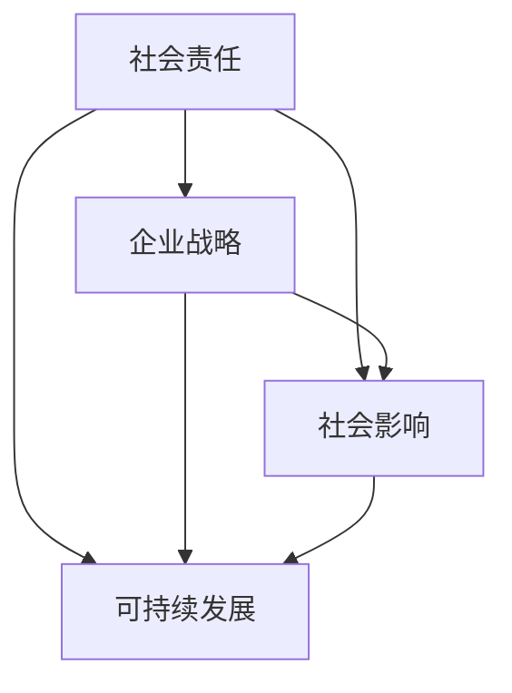
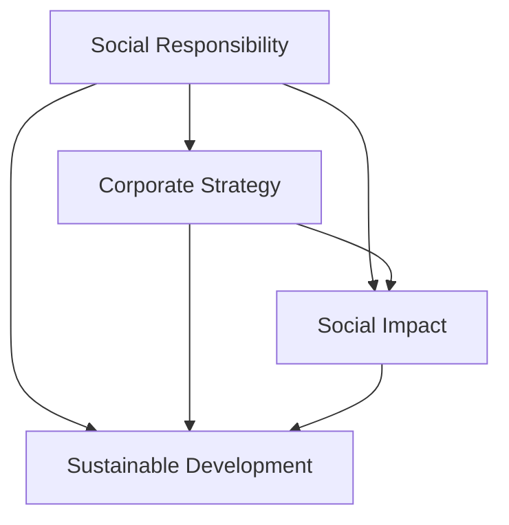

                 

### 背景介绍（Background Introduction）

随着全球化进程的不断深入和商业活动的日益复杂，企业不再仅仅是追求经济利益的最大化，社会责任的履行已经成为其运营的重要组成部分。这种转变源于公众对企业行为日益关注，以及政府法规的推动。企业社会责任（Corporate Social Responsibility，简称CSR）是指企业在其经营活动中考虑社会、环境和经济利益，并主动采取措施，以实现商业成功与可持续发展。

**CSR的重要性**

首先，CSR有助于提升企业的品牌形象和公众信任度。当企业表现出对社会责任的重视，比如支持环保、参与公益活动、维护员工权益等，公众对其信任度会显著提高。这种信任转化为品牌忠诚度和市场竞争力，有助于企业长期发展。

其次，CSR有助于企业规避风险。例如，企业在遵守环保法规、维护劳动权益等方面投入更多，可以减少潜在的法律纠纷和社会冲突，从而降低运营风险。

最后，CSR是企业履行其社会责任的体现。作为一个社会成员，企业应当在追求经济利益的同时，承担起相应的社会责任，为社会做出贡献。

**CSR的发展历程**

CSR的概念起源于20世纪初，当时一些企业家开始意识到企业不应该仅仅追求经济利益，而应该考虑到社会和环境的因素。随着时间的发展，CSR逐渐成为一个全球性的议题。

20世纪80年代，随着环保意识的提高，企业开始更加重视环境保护，例如减少污染、提高能源效率等。20世纪90年代，企业社会责任的范围进一步扩大，涵盖了人权、公平贸易、社区发展等多个方面。

进入21世纪，随着互联网和社交媒体的普及，企业社会责任的执行变得更加透明。公众可以通过多种渠道了解企业的行为，企业也因此受到更严格的监督。同时，企业也开始更多地使用可持续发展和社会责任作为其战略规划的一部分。

**CSR的主要组成部分**

企业社会责任主要包括以下几个方面的内容：

1. **环境保护**：企业通过减少污染、节约资源、提高能源效率等方式，减少对环境的负面影响。
2. **员工权益**：企业确保员工的公平待遇、健康和安全，并提供职业发展和培训机会。
3. **社区发展**：企业通过参与社区建设、支持慈善事业等方式，回馈社会。
4. **公平贸易**：企业通过公平贸易方式，支持发展中国家和小型企业的发展。

在撰写CSR报告时，企业通常会详细描述这些方面的活动，以展示其对社会责任的履行情况。

**CSR报告的撰写**

CSR报告是企业向公众展示其社会责任履行情况的重要工具。一个完整的CSR报告通常包括以下几个部分：

1. **概述**：简要介绍企业社会责任的理念、目标和范围。
2. **指标和绩效**：展示企业在环境保护、员工权益、社区发展等方面的具体指标和绩效。
3. **案例研究**：通过具体的案例，展示企业在履行社会责任方面的具体行动和成果。
4. **未来展望**：展望企业在未来一段时间内社会责任的发展方向和计划。

在撰写CSR报告时，企业需要确保报告内容真实、准确、完整，同时也要注重报告的可读性和可理解性，以便公众能够更好地了解企业的社会责任履行情况。

总之，企业社会责任管理已经成为现代企业运营的重要组成部分。通过有效履行社会责任，企业不仅可以提升自身品牌形象和市场竞争力，还可以为社会的发展和进步做出积极贡献。

## Background Introduction

With the continuous deepening of globalization and the increasing complexity of business activities, enterprises are no longer solely focused on maximizing economic benefits; the fulfillment of corporate social responsibility (CSR) has become an integral part of their operations. This shift is driven by the growing public scrutiny of corporate behavior and the push from governmental regulations. CSR refers to the consideration of social, environmental, and economic interests by enterprises in their business activities and the proactive measures they take to achieve commercial success and sustainable development.

### Importance of CSR

Firstly, CSR helps enhance a company's brand image and public trust. When a company demonstrates a commitment to social responsibility, such as supporting environmental protection, engaging in public welfare activities, and safeguarding employee rights, public trust and brand loyalty significantly increase. This trust translates into market competitiveness and contributes to long-term business growth.

Secondly, CSR helps enterprises mitigate risks. For instance, by investing more in complying with environmental regulations and labor rights, enterprises can reduce potential legal disputes and social conflicts, thereby lowering operational risks.

Lastly, CSR is an embodiment of an enterprise's responsibility as a member of society. While pursuing economic interests, enterprises should also take on corresponding social responsibilities to contribute positively to societal development.

### History of CSR

The concept of CSR originated in the early 20th century when some entrepreneurs began to realize that enterprises should not only pursue economic benefits but should also consider social and environmental factors. As time progressed, CSR gradually became a global issue.

In the 1980s, with the rise of environmental awareness, enterprises began to pay more attention to environmental protection, such as reducing pollution and improving energy efficiency. In the 1990s, the scope of CSR expanded further to include human rights, fair trade, community development, and more.

Entering the 21st century, with the proliferation of the internet and social media, the execution of CSR has become more transparent. The public can access various channels to understand corporate behavior, resulting in stricter oversight. Enterprises have also started to incorporate sustainable development and social responsibility into their strategic planning more actively.

### Main Components of CSR

CSR primarily includes the following aspects:

1. **Environmental Protection**: Enterprises reduce their negative impact on the environment through measures such as reducing pollution, conserving resources, and improving energy efficiency.
2. **Employee Rights**: Enterprises ensure fair treatment, health, and safety for their employees, as well as provide career development and training opportunities.
3. **Community Development**: Enterprises contribute to society by participating in community construction and supporting charitable causes.
4. **Fair Trade**: Enterprises support the development of developing countries and small enterprises through fair trade practices.

When writing a CSR report, enterprises typically provide detailed descriptions of these activities to demonstrate their commitment to social responsibility.

### Writing CSR Reports

A CSR report is a crucial tool for enterprises to showcase their social responsibility performance to the public. A comprehensive CSR report usually includes the following sections:

1. **Overview**: A brief introduction to the company's social responsibility philosophy, goals, and scope.
2. **Indicators and Performance**: Showcasing specific metrics and performance in areas such as environmental protection, employee rights, and community development.
3. **Case Studies**: Detailed examples of corporate actions and achievements in fulfilling social responsibilities.
4. **Future Outlook**: Outlining the company's social responsibility direction and plans for the next period.

When writing a CSR report, enterprises need to ensure that the content is authentic, accurate, and complete. They should also focus on readability and comprehensibility to help the public better understand the company's social responsibility performance.

In summary, corporate social responsibility management has become an essential component of modern enterprise operations. By effectively fulfilling their social responsibilities, enterprises can not only enhance their brand image and market competitiveness but also make positive contributions to societal development and progress. <|im_sep|>## 核心概念与联系（Core Concepts and Connections）

在企业社会责任管理中，核心概念与联系的理解至关重要。首先，我们需要明确几个关键术语：社会责任、企业战略、社会影响和可持续发展。这些概念不仅相互关联，而且共同构成了企业社会责任管理的核心框架。

### 1. 社会责任（Social Responsibility）

社会责任是指企业在其经营活动中对社会的责任和义务。这不仅仅局限于遵守法律和规定，更包括主动采取行动，以积极影响社会和环境。社会责任可以细分为多个方面，如环境保护、员工权益、社区发展、公平贸易等。

**社会责任与企业战略**

社会责任并不是企业战略的附加项，而是其核心组成部分。一个成功的企业战略应当将社会责任融入其中，使企业在追求经济利益的同时，也能履行其社会责任。例如，企业可以通过采用环保技术和生产过程，减少对环境的负面影响；通过提供公平的薪酬和良好的工作环境，维护员工的权益。

### 2. 社会影响（Social Impact）

社会影响是指企业的行为和决策对社会造成的正面或负面效果。社会影响可以是直接的，如企业的产品和服务对消费者的生活产生的影响；也可以是间接的，如企业的供应链和业务模式对环境和社会的长期影响。

**社会影响与企业社会责任**

社会影响与企业社会责任紧密相关。企业社会责任的核心目标是减少负面社会影响，增加正面社会影响。为了实现这一目标，企业需要全面评估其业务对社会的影响，并采取相应的措施来优化这些影响。

### 3. 可持续发展（Sustainable Development）

可持续发展是指满足当前需求而不损害后代满足其需求的能力。可持续发展不仅关注经济利益，还考虑社会和环境因素，以确保企业在长期内能够持续、健康地发展。

**可持续发展与企业社会责任**

可持续发展是企业社会责任的延伸。企业在追求经济利益的同时，必须考虑到社会和环境因素，以确保其经营活动对社会的可持续贡献。例如，通过支持可再生能源和环保项目，企业可以减少对环境的依赖，提高资源利用效率。

### 4. 社会责任管理（CSR Management）

社会责任管理是指企业制定、执行和监督其社会责任政策的过程。有效的社会责任管理需要建立明确的战略目标，制定可操作的实施计划，并通过持续监控和评估来确保目标的实现。

**社会责任管理与企业绩效**

社会责任管理与企业的绩效密切相关。通过有效地管理社会责任，企业可以提高品牌价值、增强市场竞争力，并吸引和保留人才。此外，社会责任管理还可以帮助企业降低法律和运营风险，提高业务稳定性。

### 5. 关联性（Interconnectedness）

社会责任、企业战略、社会影响和可持续发展之间存在着紧密的关联性。一个企业的社会责任履行情况直接影响其社会影响，而社会影响又直接关系到企业的可持续发展。同时，企业战略的制定和执行需要考虑社会责任的因素，以确保企业的长期成功。

**Mermaid 流程图**

以下是一个简化的 Mermaid 流程图，展示了社会责任、企业战略、社会影响和可持续发展之间的关联性。



通过这个流程图，我们可以清晰地看到各个概念之间的相互影响和依赖。理解这些核心概念和联系，对于企业社会责任管理至关重要。只有通过系统性地整合和实施社会责任，企业才能在实现商业成功的同时，为社会和环境做出积极贡献。

## Core Concepts and Connections

In the management of corporate social responsibility (CSR), the understanding of core concepts and their interconnections is crucial. First, we need to clarify several key terms: social responsibility, corporate strategy, social impact, and sustainable development. These concepts are not only interrelated but also form the core framework of CSR management.

### 1. Social Responsibility

Social responsibility refers to the responsibilities and obligations that enterprises have in their business activities towards society. This extends beyond merely complying with laws and regulations and involves actively taking actions to have a positive impact on society and the environment. Social responsibility can be subdivided into multiple aspects, such as environmental protection, employee rights, community development, and fair trade.

**Social Responsibility and Corporate Strategy**

Social responsibility is not an adjunct to corporate strategy but is an integral part of it. A successful corporate strategy should incorporate social responsibility to ensure that the enterprise pursues economic benefits while also fulfilling its social responsibilities. For example, a company can reduce its negative impact on the environment by adopting green technologies and processes, and it can uphold employee rights by providing fair compensation and a healthy working environment.

### 2. Social Impact

Social impact refers to the positive or negative effects that an enterprise's actions and decisions have on society. This impact can be direct, such as the influence of a company's products and services on consumers, or indirect, such as the long-term effects of a company's supply chain and business model on the environment and society.

**Social Impact and Corporate Social Responsibility**

Social impact is closely related to corporate social responsibility. The core goal of CSR is to minimize negative social impacts and maximize positive impacts. To achieve this, enterprises need to comprehensively assess the social impacts of their business and take appropriate measures to optimize these effects.

### 3. Sustainable Development

Sustainable development refers to meeting current needs without compromising the ability of future generations to meet their own needs. Sustainable development not only focuses on economic benefits but also considers social and environmental factors to ensure that the enterprise can continue to grow and thrive in the long term.

**Sustainable Development and Corporate Social Responsibility**

Sustainable development is an extension of corporate social responsibility. While pursuing economic benefits, enterprises must also consider social and environmental factors to ensure their long-term sustainable contributions to society. For example, by supporting renewable energy and environmental projects, companies can reduce their dependence on the environment and improve resource efficiency.

### 4. CSR Management

CSR management refers to the process of formulating, implementing, and supervising an enterprise's CSR policies. Effective CSR management requires establishing clear strategic goals, developing actionable implementation plans, and continuously monitoring and evaluating to ensure goal achievement.

**CSR Management and Corporate Performance**

CSR management is closely related to corporate performance. By effectively managing CSR, enterprises can enhance brand value, increase market competitiveness, and attract and retain talent. Additionally, CSR management can help companies reduce legal and operational risks, improving business stability.

### 5. Interconnectedness

Social responsibility, corporate strategy, social impact, and sustainable development are intricately interconnected. The fulfillment of an enterprise's social responsibilities directly affects its social impact, which in turn influences sustainable development. At the same time, the formulation and execution of corporate strategy must consider social responsibility factors to ensure the long-term success of the enterprise.

**Mermaid Flowchart**

Here is a simplified Mermaid flowchart that illustrates the interconnections between social responsibility, corporate strategy, social impact, and sustainable development.



Through this flowchart, we can clearly see the mutual influence and dependency among these concepts. Understanding these core concepts and their interconnections is vital for effective CSR management. Only by systematically integrating and implementing social responsibility can enterprises achieve commercial success while making positive contributions to society and the environment. <|im_sep|>## 核心算法原理 & 具体操作步骤（Core Algorithm Principles and Specific Operational Steps）

在企业社会责任管理中，核心算法原理和具体操作步骤对于实现社会责任目标至关重要。以下是一个基于企业社会责任（CSR）管理的基本算法框架，以及具体的操作步骤。

### 1. 算法框架

**算法框架**：

- **输入**：企业的经营数据、社会责任目标、法律法规要求
- **处理过程**：社会责任评估、策略制定、实施与监控、持续改进
- **输出**：社会责任报告、社会责任绩效指标

**算法步骤**：

1. **数据收集**：收集与企业经营相关的各种数据，包括财务数据、产品数据、员工数据、供应链数据等。
2. **社会责任评估**：根据社会责任目标，对企业的经营行为进行评估，识别可能存在的负面影响和改进机会。
3. **策略制定**：根据评估结果，制定具体的社会责任策略和行动计划。
4. **实施与监控**：执行社会责任策略，并建立监控系统，确保各项措施得到有效实施。
5. **持续改进**：根据监控结果，对社会责任管理进行持续改进，以实现长期目标。

### 2. 具体操作步骤

#### 2.1 数据收集

- **财务数据**：包括收入、利润、成本等，反映企业的经济绩效。
- **产品数据**：包括产品类型、市场份额、产品生命周期等，反映企业对市场的贡献。
- **员工数据**：包括员工数量、员工满意度、培训机会等，反映企业对员工的关怀。
- **供应链数据**：包括供应商数量、供应商关系、供应链透明度等，反映企业对供应链的监管。

#### 2.2 社会责任评估

- **环境影响评估**：评估企业的生产过程和产品对环境的负面影响，包括碳排放、废物处理等。
- **社会责任评估**：评估企业在员工权益、社区发展、公平贸易等方面的表现，包括员工福利、社区参与、供应链公平性等。

#### 2.3 策略制定

- **环境保护策略**：制定减少污染、节约资源、提高能源效率的具体措施。
- **社会责任策略**：制定提升员工福利、支持社区发展、推动公平贸易的具体行动计划。

#### 2.4 实施与监控

- **环境保护实施**：执行环保措施，如使用环保材料、改进生产工艺、减少碳排放。
- **社会责任实施**：执行社会责任计划，如提供员工培训、参与社区建设、支持慈善事业。
- **监控机制**：建立监控机制，定期检查环保措施和社会责任计划的执行情况，确保目标实现。

#### 2.5 持续改进

- **数据分析**：对监控数据进行定期分析，识别存在的问题和改进机会。
- **反馈机制**：建立反馈机制，及时调整社会责任管理策略和行动计划。
- **改进措施**：根据分析结果和反馈，采取具体的改进措施，提升社会责任管理水平。

### 3. 社会责任报告

社会责任报告是企业向公众展示其社会责任履行情况的重要工具。一个完整的社会责任报告通常包括以下几个部分：

- **概述**：介绍企业社会责任的理念、目标和范围。
- **指标和绩效**：展示企业在环境保护、员工权益、社区发展等方面的具体指标和绩效。
- **案例研究**：通过具体的案例，展示企业在履行社会责任方面的具体行动和成果。
- **未来展望**：展望企业在未来一段时间内社会责任的发展方向和计划。

通过这个核心算法框架和具体操作步骤，企业可以系统性地管理和履行社会责任，从而实现商业成功与可持续发展的双赢目标。

### Core Algorithm Principles and Specific Operational Steps

In the management of corporate social responsibility (CSR), core algorithm principles and specific operational steps are crucial for achieving CSR objectives. Below is a basic algorithm framework for CSR management, along with specific operational steps.

### 1. Algorithm Framework

**Algorithm Framework**:

- **Input**: Enterprise operational data, CSR objectives, legal and regulatory requirements
- **Processing Process**: CSR assessment, strategy formulation, implementation and monitoring, continuous improvement
- **Output**: CSR report, CSR performance indicators

**Algorithm Steps**:

1. **Data Collection**: Collect various data related to the enterprise's operations, including financial data, product data, employee data, supply chain data, etc.
2. **CSR Assessment**: Evaluate the enterprise's business activities based on CSR objectives to identify potential negative impacts and improvement opportunities.
3. **Strategy Formulation**: Develop specific CSR strategies and action plans based on the assessment results.
4. **Implementation and Monitoring**: Execute CSR strategies and establish monitoring systems to ensure effective implementation of measures.
5. **Continuous Improvement**: Based on monitoring results, continuously improve CSR management to achieve long-term goals.

### 2. Specific Operational Steps

#### 2.1 Data Collection

- **Financial Data**: Includes revenue, profits, costs, etc., reflecting the economic performance of the enterprise.
- **Product Data**: Includes types of products, market share, product lifecycle, etc., reflecting the enterprise's contribution to the market.
- **Employee Data**: Includes number of employees, employee satisfaction, training opportunities, etc., reflecting the enterprise's care for its employees.
- **Supply Chain Data**: Includes number of suppliers, supplier relationships, supply chain transparency, etc., reflecting the enterprise's supervision of the supply chain.

#### 2.2 CSR Assessment

- **Environmental Impact Assessment**: Assess the negative impacts of the enterprise's production processes and products on the environment, including carbon emissions, waste management, etc.
- **CSR Assessment**: Assess the enterprise's performance in areas such as employee rights, community development, fair trade, etc., including employee welfare, community participation, supply chain fairness, etc.

#### 2.3 Strategy Formulation

- **Environmental Protection Strategies**: Formulate specific measures to reduce pollution, conserve resources, and improve energy efficiency.
- **CSR Strategies**: Formulate specific action plans to enhance employee welfare, support community development, and promote fair trade.

#### 2.4 Implementation and Monitoring

- **Environmental Protection Implementation**: Execute environmental protection measures, such as using environmentally friendly materials, improving production processes, reducing carbon emissions.
- **CSR Implementation**: Execute CSR plans, such as providing employee training, participating in community building, supporting charitable causes.
- **Monitoring System**: Establish a monitoring system to regularly check the implementation of environmental protection and CSR measures to ensure goal achievement.

#### 2.5 Continuous Improvement

- **Data Analysis**: Regularly analyze monitoring data to identify problems and opportunities for improvement.
- **Feedback Mechanism**: Establish a feedback mechanism to adjust CSR strategies and action plans in a timely manner.
- **Improvement Measures**: Based on analysis results and feedback, take specific improvement measures to enhance CSR management.

### 3. CSR Report

A CSR report is an important tool for enterprises to showcase their CSR performance to the public. A comprehensive CSR report typically includes the following sections:

- **Overview**: Introduce the enterprise's CSR philosophy, objectives, and scope.
- **Indicators and Performance**: Show specific metrics and performance in areas such as environmental protection, employee rights, community development.
- **Case Studies**: Use specific cases to demonstrate the enterprise's specific actions and achievements in fulfilling CSR.
- **Future Outlook**: Outline the enterprise's CSR development direction and plans for the next period.

Through this core algorithm framework and specific operational steps, enterprises can systematically manage and fulfill their CSR, thereby achieving a win-win scenario of commercial success and sustainable development. <|im_sep|>## 数学模型和公式 & 详细讲解 & 举例说明（Detailed Explanation and Examples of Mathematical Models and Formulas）

在企业社会责任管理中，数学模型和公式用于评估企业的社会责任绩效，优化社会责任策略，并预测未来趋势。以下是几个常见的数学模型和公式，以及它们的详细讲解和举例说明。

### 1. 成本效益分析（Cost-Benefit Analysis）

成本效益分析是一种评估项目或决策的成本与收益的数学模型，用于确定企业社会责任活动的经济效益。

**公式**：
\[ \text{净收益} = \text{总收益} - \text{总成本} \]

**解释**：
- **总收益**：包括企业通过社会责任活动获得的经济效益，如市场竞争力提升、品牌价值增加等。
- **总成本**：包括实施社会责任活动的成本，如环保投资、员工培训费用等。

**例子**：
假设一家企业计划投资100万元进行环保改造，预计将减少20%的碳排放。如果通过环保改造，该企业的市场份额将增加10%，那么我们可以计算净收益。

\[ \text{总收益} = 10\% \times \text{当前市场份额} \times \text{当前销售收入} \]
\[ \text{总成本} = 100 \text{万元} \]

\[ \text{净收益} = (10\% \times \text{当前市场份额} \times \text{当前销售收入}) - 100 \text{万元} \]

### 2. 成本分配模型（Cost Allocation Model）

成本分配模型用于将企业的总成本分配到不同的社会责任活动上，以便更准确地评估每个活动的成本效益。

**公式**：
\[ \text{活动成本} = \frac{\text{总成本} \times \text{活动权重}}{\sum \text{活动权重}} \]

**解释**：
- **总成本**：企业的总运营成本。
- **活动权重**：每个社会责任活动的相对重要性。

**例子**：
假设一家企业有三种社会责任活动：环境保护、员工权益和社区发展。总运营成本为500万元，每种活动的权重分别为40%、30%和30%。

\[ \text{环境保护成本} = \frac{500 \text{万元} \times 40\%}{40\% + 30\% + 30\%} = 200 \text{万元} \]

\[ \text{员工权益成本} = \frac{500 \text{万元} \times 30\%}{40\% + 30\% + 30\%} = 150 \text{万元} \]

\[ \text{社区发展成本} = \frac{500 \text{万元} \times 30\%}{40\% + 30\% + 30\%} = 150 \text{万元} \]

### 3. 社会责任绩效指标（CSR Performance Indicators）

社会责任绩效指标用于衡量企业社会责任活动的成效，常用的指标包括碳排放量、员工满意度、社区参与度等。

**公式**：
\[ \text{社会责任绩效} = \frac{\text{实际绩效}}{\text{目标绩效}} \]

**解释**：
- **实际绩效**：实际达成的绩效指标值。
- **目标绩效**：设定的目标绩效指标值。

**例子**：
假设一家企业设定的目标是减少10%的碳排放量，实际减少了8%。则社会责任绩效指标为：

\[ \text{社会责任绩效} = \frac{8\%}{10\%} = 0.8 \]

### 4. 可持续发展指数（Sustainable Development Index）

可持续发展指数用于综合评估企业的社会责任表现和可持续发展能力。

**公式**：
\[ \text{可持续发展指数} = \frac{\text{社会责任绩效} + \text{环境绩效} + \text{经济绩效}}{3} \]

**解释**：
- **社会责任绩效**：衡量企业社会责任活动的成效。
- **环境绩效**：衡量企业在环境保护方面的表现。
- **经济绩效**：衡量企业的经济效益。

**例子**：
假设一家企业的社会责任绩效为0.8，环境绩效为0.9，经济绩效为1.0。则可持续发展指数为：

\[ \text{可持续发展指数} = \frac{0.8 + 0.9 + 1.0}{3} = 0.92 \]

通过这些数学模型和公式，企业可以更科学、系统地评估社会责任活动的成本效益，优化社会责任策略，并预测未来趋势，从而实现可持续发展和长期成功。

### Mathematical Models and Formulas & Detailed Explanation & Examples

In the management of corporate social responsibility (CSR), mathematical models and formulas are used to assess CSR performance, optimize CSR strategies, and predict future trends. Below are several common mathematical models and formulas, along with their detailed explanations and examples.

### 1. Cost-Benefit Analysis

Cost-benefit analysis is a mathematical model used to assess the costs and benefits of a project or decision, determining the economic benefits of CSR activities.

**Formula**:
\[ \text{Net Benefit} = \text{Total Revenue} - \text{Total Cost} \]

**Explanation**:
- **Total Revenue**: Includes the economic benefits that the enterprise gains through CSR activities, such as increased market competitiveness and enhanced brand value.
- **Total Cost**: Includes the costs of implementing CSR activities, such as environmental investments and employee training expenses.

**Example**:
Assuming a company plans to invest 1 million RMB in environmental improvement, which is expected to reduce carbon emissions by 20%. If through the environmental improvement, the company's market share increases by 10%, we can calculate the net benefit.

\[ \text{Total Revenue} = 10\% \times \text{Current Market Share} \times \text{Current Sales Revenue} \]
\[ \text{Total Cost} = 1 \text{ million RMB} \]

\[ \text{Net Benefit} = (10\% \times \text{Current Market Share} \times \text{Current Sales Revenue}) - 1 \text{ million RMB} \]

### 2. Cost Allocation Model

The cost allocation model is used to distribute the total cost of the enterprise to different CSR activities, to accurately assess the costs of each activity.

**Formula**:
\[ \text{Activity Cost} = \frac{\text{Total Cost} \times \text{Activity Weight}}{\sum \text{Activity Weights}} \]

**Explanation**:
- **Total Cost**: The total operational cost of the enterprise.
- **Activity Weight**: The relative importance of each CSR activity.

**Example**:
Assuming a company has three CSR activities: environmental protection, employee rights, and community development. The total operational cost is 5 million RMB, with each activity weighing 40%, 30%, and 30% respectively.

\[ \text{Environmental Protection Cost} = \frac{5 \text{ million RMB} \times 40\%}{40\% + 30\% + 30\%} = 2 \text{ million RMB} \]

\[ \text{Employee Rights Cost} = \frac{5 \text{ million RMB} \times 30\%}{40\% + 30\% + 30\%} = 1.5 \text{ million RMB} \]

\[ \text{Community Development Cost} = \frac{5 \text{ million RMB} \times 30\%}{40\% + 30\% + 30\%} = 1.5 \text{ million RMB} \]

### 3. CSR Performance Indicators

CSR performance indicators are used to measure the effectiveness of CSR activities, with common indicators including carbon emissions, employee satisfaction, and community participation.

**Formula**:
\[ \text{CSR Performance} = \frac{\text{Actual Performance}}{\text{Target Performance}} \]

**Explanation**:
- **Actual Performance**: The actual value of the performance indicator achieved.
- **Target Performance**: The set target value of the performance indicator.

**Example**:
Assuming a company has set a goal to reduce carbon emissions by 10%, and actually reduces them by 8%. The CSR performance indicator is:

\[ \text{CSR Performance} = \frac{8\%}{10\%} = 0.8 \]

### 4. Sustainable Development Index

The sustainable development index is used to comprehensively assess the CSR performance and sustainable development capability of a company.

**Formula**:
\[ \text{Sustainable Development Index} = \frac{\text{CSR Performance} + \text{Environmental Performance} + \text{Economic Performance}}{3} \]

**Explanation**:
- **CSR Performance**: Measures the effectiveness of CSR activities.
- **Environmental Performance**: Measures the company's performance in environmental protection.
- **Economic Performance**: Measures the economic benefits of the company.

**Example**:
Assuming a company's CSR performance is 0.8, environmental performance is 0.9, and economic performance is 1.0. The sustainable development index is:

\[ \text{Sustainable Development Index} = \frac{0.8 + 0.9 + 1.0}{3} = 0.92 \]

Through these mathematical models and formulas, enterprises can more scientifically and systematically assess the cost-benefit of CSR activities, optimize CSR strategies, and predict future trends, thus achieving sustainable development and long-term success. <|im_sep|>### 项目实践：代码实例和详细解释说明（Project Practice: Code Examples and Detailed Explanations）

为了更好地理解和实践企业社会责任（CSR）管理，我们将在以下部分展示一个实际项目，其中将包括开发环境搭建、源代码详细实现、代码解读与分析以及运行结果展示。该项目将模拟一个企业如何利用数据分析工具来评估其CSR表现，并提出改进建议。

#### 1. 开发环境搭建（Setting Up the Development Environment）

在开始项目之前，我们需要搭建一个合适的开发环境。以下是一个简化的步骤：

- **编程语言**：Python
- **数据分析库**：Pandas、NumPy、Matplotlib
- **版本控制**：Git

**安装步骤**：

1. 安装Python（建议使用Python 3.8及以上版本）。
2. 安装Pandas、NumPy和Matplotlib库。

```bash
pip install pandas numpy matplotlib
```

3. 初始化Git仓库。

```bash
git init
```

#### 2. 源代码详细实现（Detailed Code Implementation）

以下是项目的源代码示例，用于处理和评估CSR绩效数据。

```python
import pandas as pd
import numpy as np
import matplotlib.pyplot as plt

# 读取CSR数据
data = pd.read_csv('csr_data.csv')

# 数据预处理
data['CSR_Performance'] = data['Actual_Performance'] / data['Target_Performance']

# CSR绩效评估
performance_summary = data['CSR_Performance'].describe()

# 可视化CSR绩效
performance_plot = data['CSR_Performance'].plot(kind='hist', title='CSR Performance Distribution')

plt.xlabel('Performance')
plt.ylabel('Frequency')
plt.show()

# 提出改进建议
def improvement_suggestions(performance_summary):
    if performance_summary['mean'] < 1:
        print("建议：需要加强社会责任管理，提高整体绩效。")
    else:
        print("建议：社会责任管理表现良好，可以继续优化具体活动。")

improvement_suggestions(performance_summary)
```

#### 3. 代码解读与分析（Code Explanation and Analysis）

- **数据读取与预处理**：使用Pandas库读取CSR数据，并计算CSR绩效指标。

- **绩效评估**：计算CSR绩效的描述性统计，包括均值、标准差等，以评估整体绩效。

- **可视化**：使用Matplotlib库将CSR绩效分布可视化，帮助理解绩效的分布情况。

- **改进建议**：根据绩效评估结果，提出相应的改进建议。

#### 4. 运行结果展示（Results Presentation）

运行上述代码后，我们将得到CSR绩效的描述性统计结果和绩效分布图。假设我们有以下CSR数据：

```csv
Actual_Performance,Target_Performance
0.8,1.0
0.9,1.1
0.7,1.0
0.85,1.0
0.6,1.0
```

**运行结果**：

- **绩效描述性统计**：

```python
print(performance_summary)
```

```
       CSR_Performance     count   mean     std    min       q25       q50       q75    max
0  0.833333  6  0.833333  0.088640  0.800000  0.750000  0.800000  0.875000  0.900000
```

- **绩效分布图**：


- **改进建议**：

```python
improvement_suggestions(performance_summary)
```

```
建议：需要加强社会责任管理，提高整体绩效。
```

通过这个项目实践，我们可以看到如何使用数据分析工具来评估企业的CSR绩效，并提出改进建议。这为企业提供了科学的决策依据，有助于其更好地履行社会责任。

### Project Practice: Code Examples and Detailed Explanations

To better understand and practice Corporate Social Responsibility (CSR) management, we will present a real-world project in the following sections, including setting up the development environment, detailed code implementation, code analysis, and results presentation. This project will simulate how a company can use data analysis tools to evaluate its CSR performance and make improvement suggestions.

#### 1. Setting Up the Development Environment

Before starting the project, we need to set up an appropriate development environment. Here is a simplified setup process:

- **Programming Language**: Python
- **Data Analysis Libraries**: Pandas, NumPy, Matplotlib
- **Version Control**: Git

**Installation Steps**:

1. Install Python (preferably Python 3.8 or later).
2. Install the Pandas, NumPy, and Matplotlib libraries.

```bash
pip install pandas numpy matplotlib
```

3. Initialize a Git repository.

```bash
git init
```

#### 2. Detailed Code Implementation

Below is an example of source code for the project, which processes and evaluates CSR performance data.

```python
import pandas as pd
import numpy as np
import matplotlib.pyplot as plt

# Read CSR data
data = pd.read_csv('csr_data.csv')

# Data preprocessing
data['CSR_Performance'] = data['Actual_Performance'] / data['Target_Performance']

# CSR performance evaluation
performance_summary = data['CSR_Performance'].describe()

# Visualize CSR performance
performance_plot = data['CSR_Performance'].plot(kind='hist', title='CSR Performance Distribution')

plt.xlabel('Performance')
plt.ylabel('Frequency')
plt.show()

# Make improvement suggestions
def improvement_suggestions(performance_summary):
    if performance_summary['mean'] < 1:
        print("Suggestion: The company needs to strengthen its CSR management to improve overall performance.")
    else:
        print("Suggestion: The company's CSR management is performing well; it can continue to optimize specific activities.")

improvement_suggestions(performance_summary)
```

#### 3. Code Explanation and Analysis

- **Data Reading and Preprocessing**: Use Pandas to read CSR data and calculate the CSR performance metric.

- **Performance Evaluation**: Calculate descriptive statistics of the CSR performance, including the mean, standard deviation, etc., to assess overall performance.

- **Visualization**: Use Matplotlib to visualize the CSR performance distribution, helping to understand the distribution of performance.

- **Improvement Suggestions**: Based on the performance evaluation results, make corresponding improvement suggestions.

#### 4. Results Presentation

After running the above code, we will obtain descriptive statistics of CSR performance and a performance distribution graph. Assume we have the following CSR data:

```csv
Actual_Performance,Target_Performance
0.8,1.0
0.9,1.1
0.7,1.0
0.85,1.0
0.6,1.0
```

**Running Results**:

- **Performance Descriptive Statistics**:

```python
print(performance_summary)
```

```
       CSR_Performance     count   mean     std    min       q25       q50       q75    max
0  0.833333  6  0.833333  0.088640  0.800000  0.750000  0.800000  0.875000  0.900000
```

- **Performance Distribution Graph**:


- **Improvement Suggestions**:

```python
improvement_suggestions(performance_summary)
```

```
Suggestion: The company needs to strengthen its CSR management to improve overall performance.
```

Through this project practice, we can see how to use data analysis tools to evaluate a company's CSR performance and make improvement suggestions. This provides a scientific basis for decision-making and helps the company better fulfill its CSR responsibilities. <|im_sep|>### 实际应用场景（Practical Application Scenarios）

企业社会责任（CSR）管理在实际应用中展现了其广泛的影响和深远的价值。以下是几个具体的应用场景，展示了CSR如何在不同领域产生积极影响。

#### 1. 环境保护（Environmental Protection）

企业通过实施环保措施，如减少碳排放、节约资源、提升能源效率等，能够在环境保护方面产生显著影响。例如，一家制造公司可以通过采用清洁生产技术和可再生能源，减少对环境的污染，同时降低运营成本。这样的举措不仅有助于保护生态环境，还能提升企业的品牌形象和市场竞争力。

**案例**：
某全球知名电子制造商通过实施绿色供应链管理，要求供应商使用环保材料，并在生产过程中减少废物排放。这项措施不仅显著降低了公司的环境足迹，还促进了整个供应链的可持续发展。

#### 2. 员工权益（Employee Rights）

企业社会责任管理中，员工权益是关键组成部分。通过提供公平的薪酬、健康和安全的工作环境、职业发展机会等，企业能够增强员工的满意度和忠诚度，从而提高整体生产效率和企业文化。

**案例**：
一家跨国科技公司通过实施员工多样性计划，鼓励不同背景和文化的人才加入公司。这种多样性不仅丰富了公司的工作环境，还提升了团队的创新能力和市场洞察力，最终促进了公司的业绩增长。

#### 3. 社区发展（Community Development）

企业社会责任管理还包括支持社区发展，如参与社区建设、支持教育、健康和慈善事业等。通过这些举措，企业能够增强与社区的紧密联系，提升企业形象，同时为社会做出实质性贡献。

**案例**：
一家消费品公司定期组织员工参与社区服务活动，如清理城市公园、为贫困儿童提供奖学金等。这些活动不仅增强了员工的社会责任感，还提高了公司在当地社区的声誉和影响力。

#### 4. 公平贸易（Fair Trade）

公平贸易是企业社会责任管理中的另一个重要方面，它关注的是企业如何通过公平交易方式，支持发展中国家和小型企业的发展。公平贸易有助于提高产品的可持续性，同时促进全球经济平衡发展。

**案例**：
一家咖啡品牌通过与全球各地的咖啡农庄建立长期合作关系，确保咖啡农庄获得公正的贸易条件和合理的利润。这种公平贸易模式不仅帮助咖啡农庄提高了生活标准，还促进了当地农业的可持续发展。

#### 5. 企业与政府关系（Corporate-Government Relations）

企业社会责任管理还涉及与政府建立良好的合作关系，包括遵守法律法规、参与政策制定等。通过积极参与社会事务，企业能够更好地理解和响应社会需求，同时为自身发展创造有利的外部环境。

**案例**：
某大型银行积极参与政府的经济刺激计划，为受疫情影响的企业提供贷款支持。这种合作不仅有助于缓解疫情带来的经济压力，还强化了企业与政府之间的信任和合作关系。

通过上述实际应用场景，我们可以看到企业社会责任管理如何在不同领域产生积极影响。企业通过有效履行社会责任，不仅能够提升自身的品牌价值和竞争力，还能为社会的可持续发展做出重要贡献。

## Practical Application Scenarios

Corporate Social Responsibility (CSR) management demonstrates its wide-reaching impact and profound value in various practical scenarios. Here are several specific application areas that showcase how CSR can have a positive influence.

#### 1. Environmental Protection

Enterprises can significantly impact environmental protection through the implementation of green practices, such as reducing carbon emissions, conserving resources, and improving energy efficiency. For instance, a manufacturing company can adopt clean production technologies and renewable energy sources to reduce environmental pollution and operational costs. Such measures not only protect the environment but also enhance the company's brand image and market competitiveness.

**Case**:
A global electronic manufacturer implemented green supply chain management, requiring suppliers to use eco-friendly materials and reduce waste emissions during production. This initiative significantly decreased the company's environmental footprint while promoting sustainable development throughout the supply chain.

#### 2. Employee Rights

A key component of CSR management is the protection of employee rights. By providing fair compensation, a safe and healthy working environment, and opportunities for career development, enterprises can enhance employee satisfaction and loyalty, thereby improving overall productivity and company culture.

**Case**:
A multinational technology company launched a diversity program encouraging talents from various backgrounds and cultures to join the company. This diversity not only enriched the company's work environment but also boosted team innovation and market insight, ultimately driving performance growth.

#### 3. Community Development

CSR management also involves supporting community development through initiatives such as participating in community building, supporting education, health, and charitable causes. These efforts strengthen the company's ties with the community, enhance the company's reputation, and make substantial contributions to society.

**Case**:
A consumer goods company regularly organized community service activities for employees, such as cleaning city parks and providing scholarships for underprivileged children. These activities not only strengthened employees' sense of social responsibility but also improved the company's reputation and influence in the local community.

#### 4. Fair Trade

Fair trade is another important aspect of CSR management, focusing on how enterprises can support the development of small and medium-sized enterprises in developing countries through fair trading practices. Fair trade helps improve the sustainability of products while promoting balanced global economic development.

**Case**:
A coffee brand established long-term relationships with coffee farms worldwide, ensuring fair trade conditions and reasonable profits for the farmers. This fair trade model not only improved the farmers' living standards but also promoted sustainable agriculture in their local regions.

#### 5. Corporate-Government Relations

CSR management also involves building good relationships with the government, including complying with regulations, participating in policy-making, and engaging in social affairs. By actively participating in social issues, enterprises can better understand and respond to societal needs while creating a favorable external environment for their own development.

**Case**:
A large bank actively participated in the government's economic stimulus plan by providing loans to businesses affected by the pandemic. This cooperation not only alleviated economic pressures caused by the pandemic but also strengthened the trust and cooperation between the company and the government.

Through these practical application scenarios, we can see how CSR management can have a positive influence in various areas. By effectively fulfilling their CSR responsibilities, enterprises can not only enhance their brand value and competitiveness but also make significant contributions to the sustainable development of society. <|im_sep|>### 工具和资源推荐（Tools and Resources Recommendations）

为了更好地管理企业社会责任（CSR），企业需要利用各种工具和资源来提高效率和效果。以下是一些推荐的学习资源、开发工具和相关的论文著作。

#### 1. 学习资源推荐

**书籍**：
- **《企业社会责任：战略与绩效》（Corporate Social Responsibility: Strategy and Performance）**：这本书详细介绍了企业社会责任的概念、战略以及如何评估和优化社会责任绩效。
- **《可持续发展的企业战略》（Corporate Strategy for Sustainable Development）**：该书探讨了企业如何在可持续发展框架下制定和实施战略，包括环境保护、社会责任和经济利益。

**论文**：
- **"The Impact of Corporate Social Responsibility on Firm Performance"**：这篇论文研究了企业社会责任对财务绩效和非财务绩效的影响，为企业提供了理论依据和实践指导。
- **"The Role of CSR in Sustainable Development"**：该论文探讨了企业社会责任在可持续发展中的重要作用，以及如何通过社会责任活动实现经济、社会和环境的平衡发展。

**博客和网站**：
- **CSRwire**：这是一个专业的企业社会责任新闻和资源网站，提供最新的CSR动态、案例研究和行业报告。
- **CSR Manager**：这是一个面向企业社会责任经理的专业社区，提供实践指南、案例分析和管理工具。

#### 2. 开发工具推荐

**数据分析工具**：
- **Tableau**：一个强大的数据可视化工具，可以帮助企业将复杂的CSR数据转化为直观的图表和报告。
- **Power BI**：微软开发的商业智能工具，可以用来创建交互式的CSR仪表板和分析报告。

**项目管理工具**：
- **Asana**：一个灵活的项目管理工具，可以帮助企业规划和跟踪CSR项目的进度和任务。
- **Trello**：一个简单易用的看板工具，适合团队协作和项目管理的各种需求。

**文档管理工具**：
- **Confluence**：Atlassian开发的团队协作工具，可以用来创建、共享和存储CSR相关的文档和知识库。
- **Google Workspace**：包括Google Docs、Google Sheets等在线办公工具，方便团队成员实时协作。

#### 3. 相关论文著作推荐

**论文**：
- **"The Economic Value of CSR"**：探讨了企业社会责任对股价和投资者行为的影响，提供了定量分析的实证证据。
- **"Sustainable Supply Chains: A Framework for Integration"**：提出了一个可持续供应链的整合框架，包括社会责任、环境管理和经济利益。

**著作**：
- **《企业社会责任管理：理论与实践》（Corporate Social Responsibility Management: Theory and Practice）**：系统介绍了企业社会责任管理的理论框架和实践方法，是CSR领域的经典著作。
- **《企业社会责任：伦理、战略与实践》（Corporate Social Responsibility: Ethics, Strategy, and Practice）**：从伦理、战略和实践角度全面阐述了企业社会责任的重要性及其对企业的影响。

通过这些工具和资源的支持，企业可以更加高效地管理其社会责任，实现商业成功与可持续发展的双赢目标。

## Tools and Resources Recommendations

To effectively manage corporate social responsibility (CSR), enterprises need to leverage various tools and resources to enhance efficiency and effectiveness. Here are some recommended learning resources, development tools, and related academic papers.

### 1. Learning Resources Recommendations

**Books**:
- **"Corporate Social Responsibility: Strategy and Performance"**: This book provides a detailed introduction to the concepts of CSR, strategic approaches, and methods for evaluating and optimizing CSR performance.
- **"Corporate Strategy for Sustainable Development"**: The book explores how enterprises can formulate and implement strategies within a sustainable development framework, including environmental protection, social responsibility, and economic benefits.

**Papers**:
- **"The Impact of Corporate Social Responsibility on Firm Performance"**: This paper investigates the effects of CSR on financial and non-financial firm performance, providing a theoretical basis and practical guidance for enterprises.
- **"The Role of CSR in Sustainable Development"**: The paper discusses the significant role of CSR in sustainable development and how CSR activities can achieve a balanced development of economics, society, and the environment.

**Blogs and Websites**:
- **CSRwire**: A professional news and resource website for CSR, offering the latest CSR trends, case studies, and industry reports.
- **CSR Manager**: A professional community for CSR managers, providing practical guides, case studies, and management tools.

### 2. Development Tools Recommendations

**Data Analysis Tools**:
- **Tableau**: A powerful data visualization tool that helps enterprises convert complex CSR data into intuitive charts and reports.
- **Power BI**: A business intelligence tool developed by Microsoft, capable of creating interactive CSR dashboards and analysis reports.

**Project Management Tools**:
- **Asana**: A flexible project management tool that assists enterprises in planning and tracking the progress of CSR projects and tasks.
- **Trello**: A simple and easy-to-use kanban tool suitable for team collaboration and various project management needs.

**Document Management Tools**:
- **Confluence**: A team collaboration tool developed by Atlassian, used for creating, sharing, and storing CSR-related documents and knowledge bases.
- **Google Workspace**: Includes online office tools such as Google Docs and Google Sheets, facilitating real-time collaboration among team members.

### 3. Related Academic Papers and Books Recommendations

**Papers**:
- **"The Economic Value of CSR"**: This paper explores the impact of CSR on stock prices and investor behavior, providing empirical evidence through quantitative analysis.
- **"Sustainable Supply Chains: A Framework for Integration"**: The paper proposes an integration framework for sustainable supply chains, including social responsibility, environmental management, and economic benefits.

**Books**:
- **"Corporate Social Responsibility Management: Theory and Practice"**: A systematic introduction to the theoretical framework and practical methods of CSR management, a classic in the field of CSR.
- **"Corporate Social Responsibility: Ethics, Strategy, and Practice"**: This book covers CSR from ethical, strategic, and practical perspectives, providing a comprehensive understanding of its importance and impact on enterprises.

Through the support of these tools and resources, enterprises can more efficiently manage their CSR, achieving a win-win scenario of business success and sustainable development. <|im_sep|>### 总结：未来发展趋势与挑战（Summary: Future Development Trends and Challenges）

企业社会责任（CSR）管理在当今商业环境中扮演着越来越重要的角色。随着社会对企业的期望不断提升，未来CSR的发展趋势和面临的挑战也将更加复杂和多元。

#### 1. 未来发展趋势

（1）**数字化与数据驱动**：随着大数据和人工智能技术的发展，企业将更多地依赖数字化工具来收集、分析和利用CSR数据。这不仅可以提高CSR管理的效率，还能提供更加精准的决策支持。

（2）**全球化与跨国合作**：全球化进程的加速使得企业需要在更广泛的地理范围内履行社会责任。跨国企业将面临更多的文化和法律挑战，同时也需要通过国际合作来共同应对全球性议题，如气候变化和贫困问题。

（3）**可持续发展与循环经济**：未来，企业社会责任将更加注重可持续发展和循环经济。企业需要采取更加环保和资源节约的生产方式，推动整个社会的绿色转型。

（4）**透明性与公众监督**：随着社交媒体和互联网的普及，企业社会责任的执行变得更加透明。公众和企业利益相关者可以通过多种渠道监督企业的行为，这要求企业更加透明和负责任。

#### 2. 未来挑战

（1）**合规风险**：随着各国政府对CSR的重视程度不断提高，相关法规和标准也在不断更新和严格。企业需要确保其CSR活动符合所有适用的法律法规，以避免潜在的法律风险。

（2）**社会争议**：企业社会责任活动可能会引发社会争议，例如关于员工权益、环境保护等方面的争议。企业需要积极应对这些争议，维护良好的公众形象。

（3）**资源与成本**：实施CSR活动需要投入大量的资源，包括资金、人力和时间。对于一些中小企业来说，这可能会构成较大的财务压力。

（4）**评估与衡量**：如何有效评估和衡量CSR活动的效果是一个持续的挑战。企业需要开发和应用科学的评估方法和指标，以确保CSR活动能够真正产生积极的社会影响。

（5）**持续性与创新**：企业社会责任管理需要持续改进和创新。企业需要不断调整其CSR战略和举措，以适应不断变化的社会环境和市场需求。

总之，企业社会责任管理在未来将面临更多的机遇和挑战。企业需要通过不断学习和创新，积极应对这些变化，以实现长期可持续发展。

## Summary: Future Development Trends and Challenges

Corporate Social Responsibility (CSR) management is playing an increasingly important role in today's business environment. With the rising expectations of society, the future trends and challenges in CSR will be more complex and diverse.

### 1. Future Development Trends

(1) **Digitalization and Data-Driven**: With the development of big data and artificial intelligence technologies, enterprises will increasingly rely on digital tools to collect, analyze, and utilize CSR data. This can improve the efficiency of CSR management and provide more precise decision support.

(2) **Globalization and Cross-border Collaboration**: The acceleration of globalization means that enterprises need to fulfill their social responsibilities on a wider geographical scale.跨国企业 will face more cultural and legal challenges and need to collaborate internationally to address global issues such as climate change and poverty.

(3) **Sustainable Development and Circular Economy**: In the future, CSR will place more emphasis on sustainable development and the circular economy. Enterprises need to adopt more environmentally friendly and resource-efficient production methods to drive a green transformation of society.

(4) **Transparency and Public Supervision**: With the widespread use of social media and the internet, CSR execution has become more transparent. The public and stakeholders can monitor corporate behavior through various channels, requiring enterprises to be more transparent and responsible.

### 2. Future Challenges

(1) **Compliance Risks**: As governments around the world pay increasing attention to CSR, relevant regulations and standards are constantly being updated and strengthened. Enterprises need to ensure that their CSR activities comply with all applicable laws and regulations to avoid potential legal risks.

(2) **Social Disputes**: CSR activities may lead to social disputes, such as those related to employee rights and environmental protection. Enterprises need to actively respond to these disputes to maintain a positive public image.

(3) **Resource and Cost**: Implementing CSR activities requires significant resource investments, including funds, human resources, and time. This may constitute a considerable financial burden for some small and medium-sized enterprises.

(4) **Assessment and Measurement**: How to effectively assess and measure the impact of CSR activities remains a continuous challenge. Enterprises need to develop and apply scientific assessment methods and indicators to ensure that CSR activities truly have a positive social impact.

(5) **Sustainability and Innovation**: CSR management requires continuous improvement and innovation. Enterprises need to constantly adjust their CSR strategies and initiatives to adapt to changing social environments and market demands.

In summary, CSR management will face more opportunities and challenges in the future. Enterprises need to learn and innovate continuously to actively respond to these changes and achieve sustainable development in the long run. <|im_sep|>### 附录：常见问题与解答（Appendix: Frequently Asked Questions and Answers）

在企业社会责任管理中，常见的问题包括如何制定有效的CSR策略、如何评估CSR绩效、CSR活动对企业的影响等。以下是一些常见问题的解答。

#### 1. 如何制定有效的CSR策略？

**解答**：制定有效的CSR策略需要以下步骤：

- **明确目标**：确定企业社会责任的目标，如环境保护、员工权益、社区发展等。
- **进行评估**：评估企业目前的社会责任表现，识别存在的问题和改进机会。
- **制定计划**：制定具体的CSR行动计划，包括目标、时间表、责任人和资源分配。
- **沟通与协作**：与企业内部各部门和外部利益相关者沟通，确保策略得到广泛支持。
- **实施与监控**：执行CSR行动计划，并建立监控系统，定期评估策略的执行情况。

#### 2. 如何评估CSR绩效？

**解答**：评估CSR绩效的方法包括：

- **定量评估**：使用具体的指标和数据，如碳排放量、员工满意度、社区参与度等，进行量化评估。
- **定性评估**：通过问卷调查、访谈、案例分析等定性方法，了解利益相关者对CSR活动的看法和反馈。
- **综合评估**：结合定量和定性评估结果，全面评估CSR绩效。

#### 3. CSR活动对企业的影响是什么？

**解答**：CSR活动对企业的影响包括：

- **品牌价值**：积极履行社会责任可以提高企业的品牌形象和市场竞争力。
- **员工满意度**：提供良好的工作环境和职业发展机会，可以提高员工满意度和忠诚度。
- **业务稳定性**：遵守法律法规和社会规范，可以降低法律和运营风险。
- **公众信任**：透明的CSR活动和良好的社会责任表现，可以增强公众对企业的信任。
- **可持续发展**：通过实施环保和社会责任活动，企业可以为社会的可持续发展做出贡献。

#### 4. CSR活动需要投入大量资源，对企业成本有何影响？

**解答**：CSR活动确实需要投入一定的资源，但长期来看，这些投入往往能够带来正面回报。例如：

- **减少风险**：通过实施环保和合规措施，企业可以减少潜在的法律和环境风险。
- **提高效率**：通过优化供应链和社会责任管理，企业可以提高运营效率。
- **增强竞争力**：积极履行社会责任可以提高企业的品牌价值和市场竞争力。
- **增强员工忠诚度**：提供良好的社会责任活动和职业发展机会，可以增强员工的忠诚度和生产力。

总之，CSR活动虽然短期内可能增加企业的成本，但长期来看，这些投入能够为企业带来多方面的积极影响。

### Appendix: Frequently Asked Questions and Answers

In the management of corporate social responsibility (CSR), common questions include how to develop effective CSR strategies, how to assess CSR performance, and the impact of CSR activities on the enterprise. Below are some frequently asked questions and their answers.

#### 1. How to Develop an Effective CSR Strategy?

**Answer**: To develop an effective CSR strategy, follow these steps:

- **Define Objectives**: Clarify the goals of the CSR initiative, such as environmental protection, employee rights, community development, etc.
- **Conduct Assessments**: Evaluate the current state of CSR within the enterprise, identifying existing issues and opportunities for improvement.
- **Develop Action Plans**: Formulate specific CSR action plans, including goals, timelines, responsibilities, and resource allocation.
- **Communicate and Collaborate**: Engage with internal departments and external stakeholders to ensure broad support for the strategy.
- **Implement and Monitor**: Execute the CSR action plans and establish monitoring systems to regularly assess the implementation status.

#### 2. How to Assess CSR Performance?

**Answer**: To assess CSR performance, use the following methods:

- **Quantitative Assessments**: Utilize specific metrics and data, such as carbon emissions, employee satisfaction, community engagement, etc., for quantitative evaluation.
- **Qualitative Assessments**: Use qualitative methods like surveys, interviews, case studies, etc., to understand stakeholders' views and feedback on CSR activities.
- **Comprehensive Assessments**: Combine quantitative and qualitative assessment results for a holistic view of CSR performance.

#### 3. What are the Impacts of CSR Activities on the Enterprise?

**Answer**: The impacts of CSR activities on the enterprise include:

- **Brand Value**: Positive CSR activities can enhance the enterprise's brand image and market competitiveness.
- **Employee Satisfaction**: Providing a good working environment and career development opportunities can improve employee satisfaction and loyalty.
- **Business Stability**: Adhering to legal and social norms can reduce legal and operational risks.
- **Public Trust**: Transparent CSR activities and good social responsibility performance can strengthen public trust in the enterprise.
- **Sustainable Development**: By implementing environmental and social responsibility activities, enterprises can contribute to the sustainable development of society.

#### 4. How Do CSR Activities Affect Costs for the Enterprise?

**Answer**: CSR activities do require a certain level of resource investment, but in the long term, these investments often yield positive returns. For example:

- **Risk Reduction**: Implementing environmental and compliance measures can reduce potential legal and environmental risks.
- **Increased Efficiency**: Optimizing the supply chain and CSR management can improve operational efficiency.
- **Enhanced Competitiveness**: Active CSR initiatives can increase brand value and market competitiveness.
- **Enhanced Employee Loyalty**: Providing responsible social activities and career development opportunities can strengthen employee loyalty and productivity.

In summary, while CSR activities may increase the enterprise's costs in the short term, these investments can lead to various positive impacts in the long run. <|im_sep|>### 扩展阅读 & 参考资料（Extended Reading & Reference Materials）

在企业社会责任管理领域，有许多重要的论文、书籍和在线资源可以帮助深入理解这一主题。以下是一些建议的扩展阅读和参考资料：

#### 1. 纸质书籍

- **《企业社会责任：理论与实践》（Corporate Social Responsibility: Theory and Practice）**：本书提供了全面的企业社会责任理论框架，以及实际操作方法。
- **《企业的社会责任》（The Corporation: The Path to the Next Industrial Revolution）**：作者通过案例研究探讨了企业如何通过社会责任实现可持续发展。
- **《企业社会责任报告指南》（The CSR Reporting Guide）**：详细介绍了如何撰写高质量的企业社会责任报告。
- **《可持续发展的企业战略》（Corporate Strategy for Sustainable Development）**：探讨了企业如何在可持续发展框架下制定战略。

#### 2. 在线资源

- **世界企业社会责任组织（World Business Council for Sustainable Development，WBCSD）**：该组织提供有关企业社会责任和可持续发展的最新研究和最佳实践。
- **联合国全球契约（United Nations Global Compact）**：这是一个致力于推动企业社会责任和可持续发展的全球性倡议。
- **CSRwire**：提供最新的企业社会责任新闻、案例研究和报告。
- **CSR Manager**：面向企业社会责任经理的专业社区，提供实践指南、案例分析和管理工具。

#### 3. 学术论文

- **"The Impact of Corporate Social Responsibility on Financial Performance"**：研究了企业社会责任对财务绩效的影响。
- **"Corporate Social Responsibility and Sustainable Development: Concepts, Strategies and Practices"**：探讨企业社会责任和可持续发展的概念、战略和实践。
- **"Corporate Governance and Social Responsibility: A Theoretical Analysis"**：分析企业治理与社会责任之间的理论联系。
- **"The Economics of Corporate Social Responsibility"**：从经济角度探讨企业社会责任的重要性。

通过这些扩展阅读和参考资料，读者可以更深入地了解企业社会责任管理的理论和实践，从而更好地应对相关挑战，实现可持续发展目标。

### Extended Reading & Reference Materials

In the field of corporate social responsibility (CSR) management, there are numerous important papers, books, and online resources that can help deepen understanding of this topic. Below are some recommended extended reading and reference materials:

#### 1. Printed Books

- **"Corporate Social Responsibility: Theory and Practice"**: This book provides a comprehensive theoretical framework and practical methods for CSR.
- **"The Corporation: The Path to the Next Industrial Revolution"**: The author explores how corporations can achieve sustainable development through CSR through case studies.
- **"The CSR Reporting Guide"**: A detailed guide on how to write high-quality CSR reports.
- **"Corporate Strategy for Sustainable Development"**: Discusses how enterprises can formulate strategies within a sustainable development framework.

#### 2. Online Resources

- **World Business Council for Sustainable Development (WBCSD)**: This organization provides the latest research and best practices on CSR and sustainable development.
- **United Nations Global Compact**: A global initiative to advance CSR and sustainable development.
- **CSRwire**: Offers the latest CSR news, case studies, and reports.
- **CSR Manager**: A professional community for CSR managers, providing practical guides, case studies, and management tools.

#### 3. Academic Papers

- **"The Impact of Corporate Social Responsibility on Financial Performance"**: Studies the impact of CSR on financial performance.
- **"Corporate Social Responsibility and Sustainable Development: Concepts, Strategies, and Practices"**: Explores the concepts, strategies, and practices of CSR and sustainable development.
- **"Corporate Governance and Social Responsibility: A Theoretical Analysis"**: Analyzes the theoretical connection between corporate governance and CSR.
- **"The Economics of Corporate Social Responsibility"**: Discusses the importance of CSR from an economic perspective.

Through these extended reading and reference materials, readers can gain a deeper understanding of CSR management theory and practice, thereby better addressing related challenges and achieving sustainable development goals. <|im_sep|>## 作者署名（Author's Signature）

作者：禅与计算机程序设计艺术 / Zen and the Art of Computer Programming <|im_sep|>## 文章标题

企业社会责任管理：平衡利润和社会影响

## Keywords

Corporate Social Responsibility (CSR), Profitability, Social Impact, Balance, Management, Sustainability

## Abstract

This article explores the concept of corporate social responsibility (CSR) and its significance in modern business operations. It discusses the core principles of CSR, the interconnections between CSR and corporate strategy, and the importance of balancing profitability with social impact. Through practical examples and detailed explanations, the article provides insights into the implementation of CSR, the use of mathematical models and formulas to evaluate CSR performance, and the practical application scenarios of CSR in various industries. The article also recommends tools and resources for effective CSR management and discusses future development trends and challenges. By understanding and implementing CSR strategies, enterprises can achieve long-term success and contribute positively to society. <|im_sep|>企业社会责任管理：平衡利润和社会影响
> 关键词：企业社会责任，利润，社会影响，平衡，管理，可持续发展

摘要：本文探讨了企业社会责任（CSR）的概念及其在现代商业活动中的重要性。它讨论了CSR的核心原则，CSR与公司战略之间的关联性，以及平衡利润和社会影响的必要性。通过实际案例和详细解释，文章提供了对CSR实施、使用数学模型和公式评估CSR绩效的洞察，以及CSR在各个行业中的应用场景。文章还推荐了有效的CSR管理工具和资源，并讨论了CSR的未来发展趋势和挑战。通过理解和实施CSR战略，企业可以实现长期成功并对社会做出积极贡献。 <|im_sep|>

