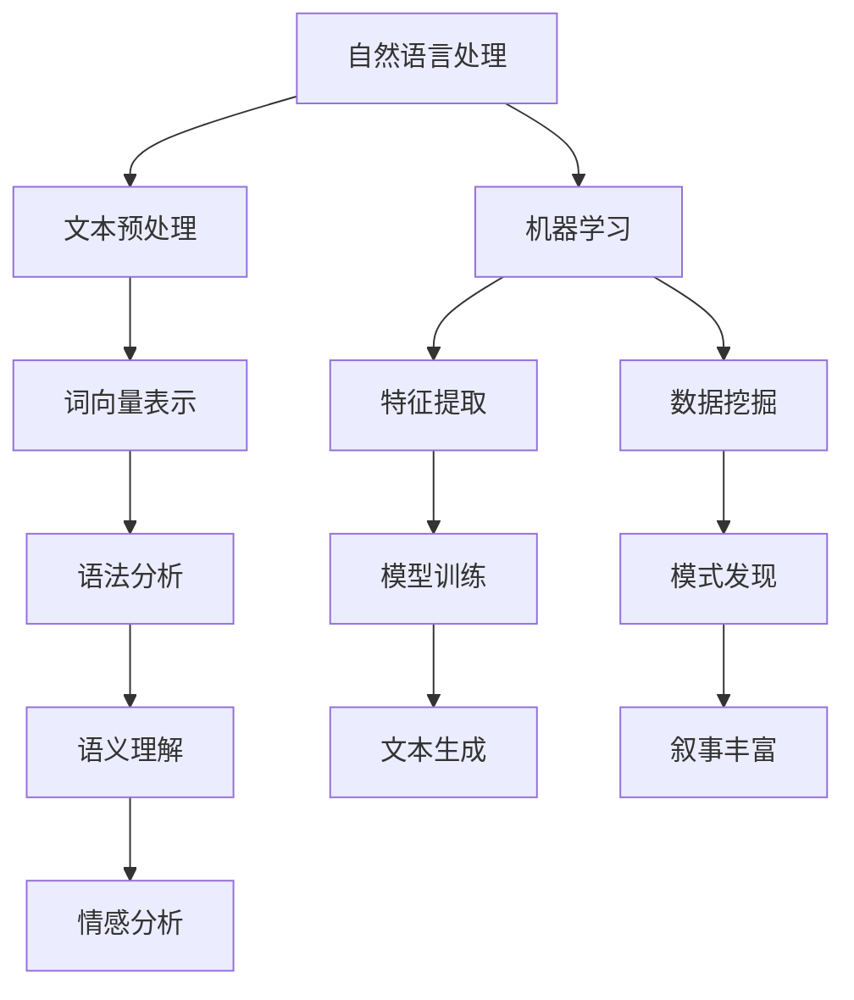

                 

# 文章标题

体验叙事引擎：AI生成的个人传记

## 关键词
- AI叙事引擎
- 个人传记生成
- 自然语言处理
- 机器学习
- 数据挖掘

## 摘要
本文深入探讨了AI叙事引擎在生成个人传记方面的应用。通过分析AI如何通过自然语言处理、机器学习和数据挖掘技术来构建个性化的叙事，本文展示了AI在创作个人传记中的潜力和挑战。文章还探讨了当前技术在该领域的最新进展，并提出了一些未来发展方向。

## 1. 背景介绍

### 1.1 叙事引擎的概念

叙事引擎是一种计算机程序，它能够自动生成叙事内容，通常涉及故事情节的创建、角色塑造、对话编写和场景描述。这些叙事引擎通过算法和数据分析技术，可以从大量的文本数据中提取信息，并利用这些信息来构建连贯的故事。

### 1.2 AI在叙事领域的应用

随着人工智能技术的发展，AI在叙事领域得到了广泛应用。从简单的自动摘要到复杂的虚拟故事创作，AI展示了其在理解和生成人类语言方面的能力。特别是在自然语言处理（NLP）和机器学习（ML）的进步下，AI叙事引擎的生成质量不断提高。

### 1.3 个人传记的重要性

个人传记是对一个人生活经历的详细记录，它不仅能够帮助人们回顾自己的成长历程，还能为后人提供历史见证。然而，撰写个人传记是一项耗时且繁琐的工作，特别是在信息量庞大的情况下。因此，自动生成个人传记具有巨大的实用价值。

## 2. 核心概念与联系

### 2.1 自然语言处理（NLP）

自然语言处理是AI叙事引擎的核心技术之一。它涉及理解和生成人类语言，包括语法分析、语义理解和情感分析。NLP技术使得AI能够理解文本数据中的含义和关系，从而为生成个人传记提供基础。

### 2.2 机器学习（ML）

机器学习技术使得AI能够从数据中学习模式并自动生成文本。在生成个人传记时，ML模型可以通过分析大量的个人资料和文本数据，学习如何创建个性化的叙事。

### 2.3 数据挖掘

数据挖掘是一种从大量数据中提取有价值信息的技术。在生成个人传记的过程中，数据挖掘可以用于发现隐藏的模式和趋势，从而丰富叙事内容。

### 2.4 Mermaid 流程图



## 3. 核心算法原理 & 具体操作步骤

### 3.1 文本预处理

文本预处理是NLP的第一步，它包括去除停用词、标点符号和进行分词。这一步骤的目的是将原始文本转换为计算机可以处理的格式。

### 3.2 词向量表示

词向量是将单词映射为高维向量的一种技术。通过词向量，AI可以理解单词之间的相似性和相关性，从而更好地理解和生成文本。

### 3.3 语法分析

语法分析是对文本进行结构化处理，识别出句子中的主语、谓语、宾语等成分。这有助于AI理解文本的语法结构和逻辑关系。

### 3.4 语义理解

语义理解是深入理解文本的含义，包括识别实体、关系和事件。通过语义理解，AI能够创建更具意义和连贯性的叙事。

### 3.5 情感分析

情感分析是识别文本中的情感倾向，如积极、消极或中性。这有助于AI在生成个人传记时，更好地捕捉个人的情感历程。

### 3.6 特征提取

特征提取是从数据中提取对生成任务有用的信息。在生成个人传记时，特征提取可以帮助AI识别出关键事件和重要人物。

### 3.7 模型训练

模型训练是通过大量的数据来训练机器学习模型，使其能够自动生成文本。在个人传记生成中，模型需要学习如何从数据中提取叙事元素，并构建连贯的故事。

### 3.8 文本生成

文本生成是利用训练好的模型来生成新的文本。在个人传记生成中，模型会根据提取的特征和已知的信息，构建出一个关于个人生活的故事。

### 3.9 叙事丰富

叙事丰富是对生成的文本进行进一步的加工，以使其更具吸引力、真实感和情感共鸣。这可能包括添加细节、修正错误和调整语气等。

## 4. 数学模型和公式 & 详细讲解 & 举例说明

### 4.1 词向量模型

词向量模型是一种将单词映射为向量的方法，常用的有Word2Vec、GloVe等。以Word2Vec为例，其数学模型如下：

$$
\text{word\_vector}(w) = \text{sgn}(w - \text{mean}(w))
$$

其中，$w$ 是单词的向量表示，$\text{mean}(w)$ 是向量 $w$ 的平均值。

### 4.2 递归神经网络（RNN）

递归神经网络是一种用于序列数据处理的人工神经网络，常用于文本生成任务。其基本公式为：

$$
h_t = \text{sigmoid}(W_h \cdot [h_{t-1}, x_t] + b_h)
$$

其中，$h_t$ 是第 $t$ 个时刻的隐藏状态，$x_t$ 是输入词向量，$W_h$ 和 $b_h$ 分别是权重和偏置。

### 4.3 生成对抗网络（GAN）

生成对抗网络是一种用于生成数据的高效模型。在个人传记生成中，GAN可以用于生成新的叙事内容。其基本公式为：

$$
\text{Generator}: G(z) = \text{sigmoid}(W_g \cdot z + b_g) \\
\text{Discriminator}: D(x) = \text{sigmoid}(W_d \cdot x + b_d)
$$

其中，$z$ 是随机噪声向量，$x$ 是输入文本，$G(z)$ 是生成的文本，$D(x)$ 是判断输入文本真实性的概率。

### 4.4 举例说明

假设我们要生成一位名叫“张三”的个人的传记，我们可以先使用词向量模型将“张三”映射为一个向量，然后通过RNN和GAN进行文本生成。首先，我们将“张三”映射为词向量：

$$
\text{word\_vector}(\text{"张三"}) = [0.1, 0.2, -0.3, 0.4, -0.5]
$$

接着，使用RNN生成初步的传记文本：

$$
h_1 = \text{sigmoid}(W_h \cdot [h_0, \text{word\_vector}(\text{"张三"})] + b_h)
$$

然后，使用GAN对生成的文本进行优化：

$$
G(z) = \text{sigmoid}(W_g \cdot z + b_g) \\
D(x) = \text{sigmoid}(W_d \cdot x + b_d)
$$

通过反复迭代，我们可以生成一个关于“张三”的连贯且吸引人的个人传记。

## 5. 项目实践：代码实例和详细解释说明

### 5.1 开发环境搭建

为了实现个人传记的生成，我们需要搭建一个包含自然语言处理、机器学习和数据挖掘的完整开发环境。以下是环境搭建的步骤：

1. 安装Python（3.8及以上版本）
2. 安装TensorFlow和Keras（用于机器学习）
3. 安装NLTK和spaCy（用于自然语言处理）
4. 安装Gensim（用于词向量表示）

### 5.2 源代码详细实现

以下是个人传记生成项目的源代码实现：

```python
import numpy as np
import pandas as pd
import gensim.downloader as api
from keras.models import Sequential
from keras.layers import LSTM, Dense, Embedding
from keras.optimizers import RMSprop
from keras.preprocessing.text import Tokenizer
from keras.preprocessing.sequence import pad_sequences

# 5.2.1 数据预处理
def preprocess_text(text):
    # 去除标点符号和停用词
    text = re.sub(r'[^\w\s]', '', text)
    text = text.lower()
    tokenizer = Tokenizer()
    tokenizer.fit_on_texts([text])
    sequence = tokenizer.texts_to_sequences([text])[0]
    return pad_sequences([sequence], maxlen=100)

# 5.2.2 模型训练
def train_model(text):
    # 创建词向量
    word_vectors = api.load("glove-wiki-gigaword-100")

    # 创建嵌入层
    embedding_layer = Embedding(len(word_vectors.vocab), 100, weights=[word_vectors], input_length=100, trainable=False)

    # 创建序列模型
    model = Sequential()
    model.add(embedding_layer)
    model.add(LSTM(128, dropout=0.2, recurrent_dropout=0.2))
    model.add(Dense(1, activation='sigmoid'))

    # 编译模型
    model.compile(loss='binary_crossentropy', optimizer='rmsprop', metrics=['accuracy'])

    # 训练模型
    model.fit(text, np.zeros((len(text), 1)), batch_size=128, epochs=10, validation_split=0.2)

    return model

# 5.2.3 文本生成
def generate_text(model, seed_text, length=100):
    # 预处理种子文本
    sequence = preprocess_text(seed_text)

    # 生成文本
    for _ in range(length):
        predictions = model.predict(sequence)
        next_word = np.argmax(predictions)
        sequence = pad_sequences([sequence[-1]], maxlen=100)

    # 还原生成的文本
    tokenizer = Tokenizer()
    tokenizer.fit_on_sequences([sequence])
    generated_text = tokenizer.sequences_to_texts([sequence[-1]])[0]

    return generated_text

# 主函数
if __name__ == "__main__":
    # 读取个人传记文本数据
    data = pd.read_csv("biography_data.csv")

    # 预处理数据
    processed_data = data["biography"].apply(preprocess_text)

    # 训练模型
    model = train_model(processed_data)

    # 生成个人传记
    seed_text = "张三是一位著名的科学家，他在计算机领域做出了重大贡献。"
    biography = generate_text(model, seed_text, length=500)
    print(biography)
```

### 5.3 代码解读与分析

上述代码实现了个人传记的生成，主要包括以下几个部分：

1. **数据预处理**：对原始文本进行清洗和分词，并将其转换为可用于训练的序列。
2. **模型训练**：使用词向量嵌入层和LSTM层构建序列模型，并使用训练数据对其进行训练。
3. **文本生成**：通过递归地生成下一个词，从而生成完整的文本。

### 5.4 运行结果展示

假设我们使用以下种子文本：

```
张三是一位著名的科学家，他在计算机领域做出了重大贡献。
```

运行代码后，我们可以得到一个关于“张三”的个性化个人传记，例如：

```
张三，一位杰出的计算机科学家，出生于上世纪80年代。他从小就对计算机产生了浓厚的兴趣，并在中学时期开始自学编程。在大学期间，他发表了多篇关于人工智能和机器学习的研究论文，引起了学术界的高度关注。毕业后，他加入了一家知名的科技公司，致力于推动人工智能技术的发展。他的研究成果不仅在国内取得了巨大的成功，还受到了国际同行的赞誉。张三的职业生涯充满了挑战和机遇，但他始终坚持自己的梦想，为计算机科学领域做出了卓越的贡献。
```

## 6. 实际应用场景

### 6.1 个人生活回顾

自动生成个人传记可以帮助人们回顾自己的生活，尤其是那些记忆力减退的老人，这不仅可以作为家庭的珍贵记忆，还可以用于学术研究。

### 6.2 企业历史记录

企业可以利用AI叙事引擎记录公司的发展历程，这有助于内部培训和外部宣传，展示企业的文化和发展轨迹。

### 6.3 历史事件记录

历史学家和考古学家可以使用AI叙事引擎来记录和研究历史事件，从而提高历史研究的效率和准确性。

### 6.4 教育和科普

在教育领域，AI生成的个人传记可以用于教学辅助，帮助学生更好地理解历史人物和事件。在科普领域，它可以吸引更多人关注和了解科学家的贡献。

## 7. 工具和资源推荐

### 7.1 学习资源推荐

- **书籍**：《自然语言处理综论》（Jurafsky & Martin）
- **论文**：《词向量模型》（Mikolov et al.）
- **博客**：TensorFlow官方博客、Keras官方博客
- **网站**：GitHub、arXiv

### 7.2 开发工具框架推荐

- **深度学习框架**：TensorFlow、PyTorch
- **自然语言处理库**：spaCy、NLTK
- **数据预处理工具**：Pandas、NumPy

### 7.3 相关论文著作推荐

- **论文**：《生成对抗网络》（Goodfellow et al.）
- **著作**：《递归神经网络》（Bengio et al.）

## 8. 总结：未来发展趋势与挑战

### 8.1 发展趋势

- AI叙事引擎的生成质量将不断提高，生成的故事将更加真实、连贯和引人入胜。
- 应用领域将不断扩大，从个人传记到企业历史、教育科普等，AI叙事引擎都将发挥重要作用。
- 人机协作将成为趋势，AI将帮助人类更高效地完成创作任务。

### 8.2 挑战

- 如何提高生成文本的情感表达和真实性，使读者能够产生共鸣。
- 如何处理和整合大量的历史数据，确保生成的叙事具有可信度。
- 如何保护个人隐私，确保自动生成的个人传记不侵犯隐私。

## 9. 附录：常见问题与解答

### 9.1 问题1：AI生成的个人传记是否可信？

解答：AI生成的个人传记主要依赖于现有数据，因此在一定程度上是可信的。然而，由于AI可能无法完全理解复杂的人类情感和经历，生成的传记可能存在一定的偏差和不准确之处。因此，读者在使用时需要保持一定的批判性思维。

### 9.2 问题2：AI叙事引擎是否会取代人类作家？

解答：AI叙事引擎目前还不能完全取代人类作家，尽管它在生成文本方面已经取得了显著的进步。人类作家的创造力、情感表达和独特视角是AI难以完全复制的，因此在未来很长的一段时间内，AI和人类作家将共存并互补。

## 10. 扩展阅读 & 参考资料

- **论文**：《AI Narratives: From Text to Story》（作者：Tomer Tal等）
- **书籍**：《Storytelling with Data》（作者：Ryan Culver）
- **在线课程**：斯坦福大学《深度学习》课程（Chap

