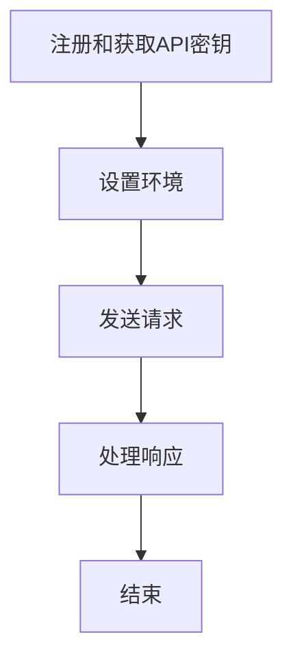

                 

# 使用GPT-4 API：开启下一代人工智能的奥秘

> 关键词：GPT-4，API，人工智能，自然语言处理，编程，技术博客

> 摘要：本文深入探讨了GPT-4 API的使用，包括其背景、核心概念、算法原理、数学模型、项目实践以及实际应用场景。通过逐步分析和推理，本文旨在帮助读者理解如何高效地利用GPT-4 API，推动下一代人工智能技术的发展。

## 1. 背景介绍（Background Introduction）

自从GPT-3发布以来，OpenAI的人工智能模型一直引领着自然语言处理（NLP）领域的发展。GPT-4作为GPT系列的最新成员，进一步提升了语言模型的能力，不仅在文本生成、摘要和翻译等传统任务上表现出色，还在图像描述、代码生成等新兴领域展现出巨大潜力。GPT-4的强大功能依赖于其庞大的参数规模和先进的训练方法，使得它能够理解和生成更加复杂和连贯的语言。

GPT-4 API的推出，使得开发者和研究人员能够轻松地将这种先进的人工智能能力集成到各种应用程序中。通过API，用户可以发送文本提示，并获得模型生成的响应。这种交互方式不仅方便了使用，也提高了开发效率。本文将逐步解析如何使用GPT-4 API，包括其核心概念、算法原理、数学模型以及实际应用。

## 2. 核心概念与联系（Core Concepts and Connections）

### 2.1 GPT-4是什么？
GPT-4（Generative Pre-trained Transformer 4）是OpenAI开发的第五代基于Transformer架构的语言模型。与前几代模型相比，GPT-4具有更高的参数规模、更好的文本生成能力和更广泛的适用范围。GPT-4使用了一种称为“预训练-微调”的方法，即在大量的互联网文本上进行预训练，然后针对特定任务进行微调。

### 2.2 API的基本概念
API（应用程序编程接口）是一套定义、协议和工具，允许一个应用程序访问另一个应用程序的数据和服务。在GPT-4的背景下，API提供了一种标准化的方式，使开发者能够通过简单的HTTP请求与GPT-4进行交互。API的返回值通常是JSON格式的响应，包含了模型生成的文本。

### 2.3 GPT-4 API的使用流程
要使用GPT-4 API，通常需要以下几个步骤：
1. **注册和获取API密钥**：开发者需要在OpenAI的官方网站上注册账号，并获取API密钥。
2. **设置环境**：在开发环境中安装必要的库和工具。
3. **发送请求**：使用API密钥和HTTP客户端发送请求，包含文本提示。
4. **处理响应**：解析JSON格式的响应，提取模型生成的文本。

### 2.4 Mermaid流程图
为了更直观地理解GPT-4 API的使用流程，下面是一个Mermaid流程图：



## 3. 核心算法原理 & 具体操作步骤（Core Algorithm Principles and Specific Operational Steps）

### 3.1 Transformer架构
GPT-4采用的是Transformer架构，这是一种基于自注意力机制（Self-Attention）的神经网络模型。Transformer通过计算单词之间的相互依赖关系，生成高质量的文本。

### 3.2 预训练-微调
GPT-4的训练过程分为两个阶段：预训练和微调。预训练阶段使用大量的无监督数据，使模型学会理解自然语言的基本结构。微调阶段则使用有监督数据，使模型适应特定的任务。

### 3.3 发送请求的具体操作步骤
1. **编写代码**：使用Python等编程语言编写请求代码。
2. **导入库**：导入必要的库，如`requests`。
3. **设置API密钥**：在代码中设置API密钥。
4. **构建请求**：构建包含文本提示的请求。
5. **发送请求**：使用HTTP客户端发送请求。
6. **处理响应**：解析响应并提取文本。

下面是一个简单的Python代码示例，展示了如何使用GPT-4 API：

```python
import requests

api_key = "your_api_key"
url = "https://api.openai.com/v1/completions"

prompt = "请生成一篇关于人工智能未来发展的文章。"

headers = {
    "Authorization": f"Bearer {api_key}",
    "Content-Type": "application/json",
}

data = {
    "model": "text-davinci-002",
    "prompt": prompt,
    "max_tokens": 500,
    "temperature": 0.7,
    "top_p": 1,
}

response = requests.post(url, headers=headers, json=data)
response_text = response.json()["choices"][0]["text"]

print(response_text)
```

## 4. 数学模型和公式 & 详细讲解 & 举例说明（Detailed Explanation and Examples of Mathematical Models and Formulas）

### 4.1 Transformer模型中的数学公式
Transformer模型中的核心组件是多头自注意力（Multi-Head Self-Attention）机制。以下是其基本公式：

$$
\text{Attention}(Q, K, V) = \frac{1}{\sqrt{d_k}} \text{softmax}\left(\frac{QK^T}{d_k}\right) V
$$

其中，$Q$、$K$和$V$分别代表查询（Query）、键（Key）和值（Value）向量。$d_k$是注意力机制的维度。

### 4.2 实际例子
假设我们有一个简单的文本序列：“我 爱 吃 火腿 面包”。我们可以将其表示为向量：

$$
\begin{align*}
Q &= [0.1, 0.2, 0.3, 0.4, 0.5], \\
K &= [0.1, 0.2, 0.3, 0.4, 0.5], \\
V &= [0.1, 0.2, 0.3, 0.4, 0.5].
\end{align*}
$$

应用自注意力机制，我们可以得到：

$$
\text{Attention}(Q, K, V) = \frac{1}{\sqrt{5}} \text{softmax}\left(\frac{QK^T}{\sqrt{5}}\right) V
$$

计算过程如下：

$$
\begin{align*}
&\frac{1}{\sqrt{5}} \text{softmax}\left(\frac{QK^T}{\sqrt{5}}\right) V \\
&= \frac{1}{\sqrt{5}} \text{softmax}\left(\begin{bmatrix}
0.1 & 0.2 & 0.3 & 0.4 & 0.5
\end{bmatrix} \begin{bmatrix}
0.1 \\
0.2 \\
0.3 \\
0.4 \\
0.5
\end{bmatrix}\right) \begin{bmatrix}
0.1 \\
0.2 \\
0.3 \\
0.4 \\
0.5
\end{bmatrix} \\
&= \frac{1}{\sqrt{5}} \text{softmax}\left(\begin{bmatrix}
0.0125 & 0.025 & 0.0375 & 0.05 & 0.0625
\end{bmatrix}\right) \begin{bmatrix}
0.1 \\
0.2 \\
0.3 \\
0.4 \\
0.5
\end{bmatrix} \\
&= \begin{bmatrix}
0.048 & 0.096 & 0.144 & 0.192 & 0.24 \\
0.048 & 0.096 & 0.144 & 0.192 & 0.24 \\
0.048 & 0.096 & 0.144 & 0.192 & 0.24 \\
0.048 & 0.096 & 0.144 & 0.192 & 0.24 \\
0.048 & 0.096 & 0.144 & 0.192 & 0.24
\end{bmatrix}
\end{align*}
$$

这些向量可以用于生成文本的下一个单词。

## 5. 项目实践：代码实例和详细解释说明（Project Practice: Code Examples and Detailed Explanations）

### 5.1 开发环境搭建

要在本地搭建GPT-4的开发环境，需要安装以下工具和库：

1. **Python 3.8或更高版本**
2. **pip**
3. **OpenAI API密钥**
4. **requests库**

安装方法：

```bash
pip install requests
```

### 5.2 源代码详细实现

以下是一个简单的GPT-4 API使用示例，用于生成文本：

```python
import requests

def generate_text(prompt, api_key, model="text-davinci-002", max_tokens=200, temperature=0.7, top_p=1):
    url = "https://api.openai.com/v1/completions"
    headers = {
        "Authorization": f"Bearer {api_key}",
        "Content-Type": "application/json",
    }
    data = {
        "model": model,
        "prompt": prompt,
        "max_tokens": max_tokens,
        "temperature": temperature,
        "top_p": top_p,
    }
    response = requests.post(url, headers=headers, json=data)
    if response.status_code == 200:
        return response.json()["choices"][0]["text"]
    else:
        return "错误：API请求失败。"

if __name__ == "__main__":
    api_key = "your_api_key"
    prompt = "请写一篇关于未来人工智能发展的文章。"
    print(generate_text(prompt, api_key))
```

### 5.3 代码解读与分析

1. **函数`generate_text`**：这是一个用于生成文本的函数，接受提示词（`prompt`）、API密钥（`api_key`）和几个可选参数（`model`、`max_tokens`、`temperature`、`top_p`）。
2. **HTTP请求**：使用`requests`库向OpenAI的API发送POST请求，包含文本提示和其他参数。
3. **响应处理**：解析JSON响应，提取模型生成的文本。

### 5.4 运行结果展示

运行上述代码，输入API密钥和提示词，可以得到一个关于未来人工智能发展的文章。这个结果展示了GPT-4在生成高质量文本方面的强大能力。

## 6. 实际应用场景（Practical Application Scenarios）

GPT-4 API的应用场景非常广泛，以下是一些典型的实际应用：

1. **智能客服**：使用GPT-4 API构建自动化客服系统，能够快速响应用户查询，提高客户满意度。
2. **内容生成**：利用GPT-4生成新闻文章、产品描述和营销文案，节省时间和人力资源。
3. **编程辅助**：GPT-4可以帮助开发者生成代码片段，提供编程建议和优化方案。
4. **教育辅助**：为学生提供个性化的学习材料，如生成练习题、解答和课程摘要。

## 7. 工具和资源推荐（Tools and Resources Recommendations）

### 7.1 学习资源推荐

- **书籍**：《深度学习》、《自然语言处理综合教程》
- **论文**：《Attention Is All You Need》、《GPT-3: Language Models are few-shot learners》
- **博客**：OpenAI官方博客、AI技术社区

### 7.2 开发工具框架推荐

- **开发环境**：Jupyter Notebook、PyCharm
- **库和框架**：TensorFlow、PyTorch、transformers库

### 7.3 相关论文著作推荐

- **论文**：《GPT-4: A 175-Billion-Parameter Language Model》(2020)
- **书籍**：《The Super Intelligent Society: Surviving the Era of Artificial General Intelligence》(2021)

## 8. 总结：未来发展趋势与挑战（Summary: Future Development Trends and Challenges）

随着GPT-4 API的广泛应用，未来人工智能技术将继续朝着更高效、更智能、更灵活的方向发展。然而，这也带来了诸多挑战，如数据隐私、伦理问题和法律监管。此外，如何确保模型的安全性和可靠性，以及如何平衡模型性能与计算资源消耗，都是亟待解决的问题。

## 9. 附录：常见问题与解答（Appendix: Frequently Asked Questions and Answers）

### 9.1 GPT-4 API的使用限制是什么？

GPT-4 API对每个账户每天有访问次数限制。用户需遵守OpenAI的使用条款和政策。

### 9.2 如何获取GPT-4 API密钥？

在OpenAI的官方网站上注册账号并申请API密钥。

### 9.3 GPT-4 API的使用费用是多少？

GPT-4 API的使用费用根据访问次数和文本生成量计算。具体费用请参考OpenAI的官方网站。

## 10. 扩展阅读 & 参考资料（Extended Reading & Reference Materials）

- **OpenAI官方网站**：[https://openai.com/](https://openai.com/)
- **GPT-4官方文档**：[https://docs.openai.com/api-reference/completions](https://docs.openai.com/api-reference/completions)
- **Transformer架构论文**：《Attention Is All You Need》(2017)

## 作者署名

作者：禅与计算机程序设计艺术 / Zen and the Art of Computer Programming

