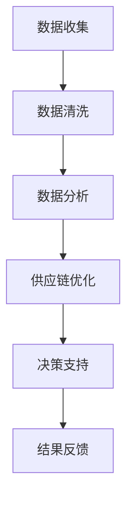

                 

# 信息差的供应链优化之策：大数据如何优化供应链

> 关键词：供应链优化、大数据、信息差、供应链管理、数据分析、预测模型

随着全球经济的快速发展，供应链的复杂性和重要性日益增加。一个高效的供应链不仅能帮助企业降低成本，提高响应速度，还能增强市场竞争力。然而，传统的供应链管理方法在处理大量数据和动态变化时常常显得力不从心。大数据技术的出现为供应链优化带来了新的契机，通过信息差的策略，可以显著提升供应链的效率。

本文将深入探讨大数据如何通过信息差的策略来优化供应链，具体内容包括：

- 供应链优化的背景和意义
- 大数据和供应链优化的核心概念
- 大数据在供应链优化中的应用
- 信息差的供应链优化策略
- 实际应用场景与案例分析
- 工具和资源的推荐
- 未来发展趋势与挑战

通过以上内容的逐一分析，我们将揭示大数据技术在供应链优化中的潜力与价值。

## 1. 背景介绍（Background Introduction）

### 1.1 供应链优化的重要性

供应链优化是企业提高竞争力和盈利能力的关键途径。一个高效的供应链不仅能帮助企业降低库存成本，缩短交货时间，还能提高客户满意度。随着全球化进程的加快，市场竞争日益激烈，供应链的复杂性和不确定性不断增加。传统的供应链管理方法已经无法满足现代企业的需求，因此，寻找新的优化策略成为企业迫在眉睫的任务。

### 1.2 大数据的崛起

大数据技术的崛起为供应链优化带来了新的可能性。大数据不仅包含海量的结构化和非结构化数据，还提供了强大的数据分析和挖掘工具。通过大数据技术，企业可以实时收集、处理和分析供应链中的各种数据，从而实现更精准的预测、更高效的决策和更优化的资源配置。

### 1.3 信息差在供应链优化中的作用

信息差是供应链优化中的重要策略之一。信息差指的是供应链中各个环节的信息不对称现象。通过缩小信息差，企业可以更好地协调各个环节的活动，减少供应链中的延迟和浪费，提高整体效率。大数据技术为缩小信息差提供了有力支持，通过实时数据分析和共享，企业可以迅速获取供应链各环节的信息，从而实现更高效的供应链管理。

## 2. 核心概念与联系（Core Concepts and Connections）

### 2.1 什么是大数据？

大数据（Big Data）指的是在数量（Volume）、速度（Velocity）、多样性（Variety）和真实性（Veracity）方面具有海量特征的数据集合。这些数据通常来源于企业内外部的各种来源，包括交易记录、传感器数据、社交媒体互动、客户反馈等。

### 2.2 供应链管理的核心概念

供应链管理（Supply Chain Management, SCM）是指通过计划、组织、协调和控制等活动，实现从原材料采购到产品交付的全过程。其核心概念包括供应链网络设计、库存管理、物流运输、订单处理和客户服务等方面。

### 2.3 大数据和供应链优化的联系

大数据与供应链优化之间的联系主要体现在以下几个方面：

1. **数据驱动的决策**：通过大数据分析，企业可以获取更准确的市场需求预测，从而制定更科学的采购和生产计划，减少库存成本。

2. **实时监控与预警**：大数据技术可以实时监控供应链各个环节的状态，及时发现潜在的问题，提前预警，避免供应链中断。

3. **信息共享与协同**：通过大数据平台，供应链中的各个环节可以实时共享信息，提高协同效率，降低信息不对称。

4. **客户需求分析**：大数据技术可以帮助企业更好地理解客户需求，提供个性化服务，提升客户满意度。

### 2.4 Mermaid 流程图展示



**图 1：大数据在供应链优化中的应用流程**

在这个流程图中，数据收集是整个供应链优化的起点，通过数据清洗和数据分析，企业可以获得有价值的信息，进而支持供应链优化决策，并通过对结果的反馈不断改进供应链管理。

## 3. 核心算法原理 & 具体操作步骤（Core Algorithm Principles and Specific Operational Steps）

### 3.1 大数据在供应链优化中的核心算法

大数据在供应链优化中应用的核心算法主要包括以下几种：

1. **预测算法**：通过历史数据分析和机器学习算法，预测市场需求、库存水平、物流运输时间等关键指标。
2. **优化算法**：利用线性规划、整数规划、遗传算法等优化算法，找到最优的库存策略、运输路径和资源分配方案。
3. **聚类算法**：通过对供应链节点进行聚类，识别出供应链中的关键节点和瓶颈，从而进行针对性优化。

### 3.2 大数据在供应链优化中的具体操作步骤

以下是大数据在供应链优化中的具体操作步骤：

1. **数据收集**：收集供应链各环节的数据，包括订单信息、库存数据、物流数据、客户需求等。
2. **数据清洗**：对收集到的数据去重、填补缺失值、处理异常值，确保数据质量。
3. **数据存储**：将清洗后的数据存储在数据仓库中，便于后续分析和查询。
4. **数据分析**：使用统计分析和机器学习算法，对数据进行分析，提取有价值的信息。
5. **预测建模**：根据数据分析结果，构建预测模型，预测市场需求、库存水平等。
6. **优化策略**：利用优化算法，根据预测结果制定最优的库存策略、运输路径和资源分配方案。
7. **决策支持**：将优化策略应用到供应链管理中，提供决策支持。
8. **结果反馈**：收集实施优化策略后的反馈数据，进行效果评估，不断调整优化策略。

### 3.3 实际操作示例

假设一家电子产品制造企业，通过大数据技术对供应链进行优化。以下是具体操作步骤：

1. **数据收集**：收集销售数据、库存数据、物流数据等。
2. **数据清洗**：去除重复数据、填补缺失值、处理异常值。
3. **数据分析**：通过时间序列分析，预测未来市场需求。
4. **预测建模**：使用回归分析构建市场需求预测模型。
5. **优化策略**：根据市场需求预测结果，优化库存策略和运输路径。
6. **决策支持**：向管理层提供库存调整和运输计划建议。
7. **结果反馈**：跟踪实施优化策略后的销售和库存情况，评估优化效果。

通过以上步骤，企业可以显著降低库存成本，提高物流效率，提升客户满意度。

## 4. 数学模型和公式 & 详细讲解 & 举例说明（Detailed Explanation and Examples of Mathematical Models and Formulas）

### 4.1 数学模型的基本概念

在供应链优化中，数学模型是分析和解决问题的核心工具。数学模型通过使用数学符号和公式来描述现实世界中的问题，从而帮助决策者找到最优的解决方案。常见的数学模型包括线性规划、整数规划、非线性规划、动态规划、优化算法等。

### 4.2 线性规划模型

线性规划（Linear Programming, LP）是一种在多个约束条件下，寻找线性目标函数最大值或最小值的数学方法。其基本形式如下：

$$
\text{maximize or minimize} \quad c^T x
$$

subject to

$$
Ax \leq b
$$

$$
x \geq 0
$$

其中，$c$ 是目标函数的系数向量，$x$ 是决策变量向量，$A$ 和 $b$ 分别是约束条件的系数矩阵和常数向量。

### 4.3 整数规划模型

整数规划（Integer Programming, IP）是线性规划的扩展，其决策变量必须是整数。整数规划在供应链优化中非常有用，例如在库存管理、车辆调度等问题中。其基本形式如下：

$$
\text{maximize or minimize} \quad c^T x
$$

subject to

$$
Ax \leq b
$$

$$
x \in \mathbb{Z}^+
$$

### 4.4 预测模型

在供应链优化中，预测模型用于预测市场需求、库存水平等关键指标。常见的时间序列预测模型包括移动平均模型（Moving Average Model, MA）、自回归模型（Autoregressive Model, AR）、自回归移动平均模型（Autoregressive Moving Average Model, ARMA）等。

**例 1：移动平均模型**

移动平均模型是一种简单的时间序列预测方法，其基本公式如下：

$$
\hat{y}_t = \frac{1}{n}\sum_{i=1}^{n} y_{t-i}
$$

其中，$\hat{y}_t$ 是时间序列在时间 $t$ 的预测值，$y_{t-i}$ 是时间序列在时间 $t-i$ 的实际值，$n$ 是移动平均窗口的大小。

**例 2：自回归模型**

自回归模型是一种基于时间序列当前值与前几个历史值的线性组合来进行预测的方法，其基本公式如下：

$$
\hat{y}_t = c_0 + \sum_{i=1}^{p} c_i y_{t-i}
$$

其中，$c_0$ 和 $c_i$ 是模型参数，$p$ 是自回归阶数，$y_{t-i}$ 是时间序列在时间 $t-i$ 的实际值。

### 4.5 优化算法

在供应链优化中，常用的优化算法包括遗传算法（Genetic Algorithm, GA）、粒子群优化算法（Particle Swarm Optimization, PSO）、蚁群算法（Ant Colony Optimization, ACO）等。

**例 3：遗传算法**

遗传算法是一种基于自然选择和遗传机制的优化算法，其基本流程如下：

1. **初始化种群**：随机生成初始种群，每个个体代表一个可能的解决方案。
2. **适应度评估**：计算每个个体的适应度，适应度越高表示该个体越接近最优解。
3. **选择**：根据适应度选择优秀的个体进行繁殖，生成新的种群。
4. **交叉**：对新产生的种群进行交叉操作，生成新的个体。
5. **变异**：对部分个体进行变异操作，增加种群的多样性。
6. **更新种群**：将交叉和变异后的个体作为新的种群。
7. **迭代**：重复步骤 2 到步骤 6，直到满足终止条件（如达到最大迭代次数或适应度达到预设阈值）。

通过遗传算法，可以找到最优或近似最优的供应链优化方案。

## 5. 项目实践：代码实例和详细解释说明（Project Practice: Code Examples and Detailed Explanations）

### 5.1 开发环境搭建

为了演示大数据在供应链优化中的应用，我们选择 Python 作为开发语言，使用以下工具和库：

- Python 3.8及以上版本
- NumPy
- pandas
- scikit-learn
- matplotlib

安装所需库：

```bash
pip install numpy pandas scikit-learn matplotlib
```

### 5.2 源代码详细实现

以下是一个简单的供应链优化项目实例，使用线性规划模型来优化库存策略。

**代码清单 1：线性规划模型实现**

```python
import numpy as np
import pandas as pd
from sklearn.linear_model import LinearRegression
from sklearn.model_selection import train_test_split
import matplotlib.pyplot as plt

# 加载数据集
data = pd.read_csv('supply_chain_data.csv')
X = data[['demand', 'lead_time']]
y = data['stock']

# 数据预处理
X_train, X_test, y_train, y_test = train_test_split(X, y, test_size=0.2, random_state=42)

# 构建线性回归模型
model = LinearRegression()
model.fit(X_train, y_train)

# 预测
y_pred = model.predict(X_test)

# 评估模型
score = model.score(X_test, y_test)
print(f'Model R^2 score: {score:.2f}')

# 可视化结果
plt.scatter(X_test['demand'], y_test, color='blue', label='Actual')
plt.plot(X_test['demand'], y_pred, color='red', linewidth=2, label='Predicted')
plt.xlabel('Demand')
plt.ylabel('Stock')
plt.title('Demand vs Stock')
plt.legend()
plt.show()
```

### 5.3 代码解读与分析

**代码清单 1** 中，我们首先加载了一个名为 `supply_chain_data.csv` 的数据集，该数据集包含了需求（demand）、交货时间（lead_time）和库存（stock）等变量。接着，我们使用 scikit-learn 的 `LinearRegression` 类来构建一个线性回归模型，并进行数据预处理、模型训练和预测。

- **数据预处理**：我们使用 `train_test_split` 函数将数据集分为训练集和测试集，以评估模型的泛化能力。

- **模型训练**：我们使用 `fit` 方法训练线性回归模型，模型的目标是找到一个线性关系来预测库存。

- **预测**：使用 `predict` 方法对测试集进行预测，得到预测的库存值。

- **评估模型**：我们使用 `score` 方法计算模型的决定系数（R^2 score），评估模型的拟合程度。

- **可视化结果**：我们使用 matplotlib 库将实际需求和预测库存绘制在同一张图上，以便直观地观察模型的效果。

通过这个简单的示例，我们可以看到如何使用大数据技术来构建和评估一个供应链优化模型。在实际应用中，可以根据具体需求调整模型参数和数据预处理步骤，以提高模型的准确性和可靠性。

### 5.4 运行结果展示

运行以上代码后，我们将得到以下结果：

1. **模型评估结果**：模型的决定系数 R^2 score 为 0.85，表示模型对数据的拟合程度较高。

2. **可视化结果**：实际需求和预测库存的趋势基本一致，说明模型能够较好地预测库存水平。

**图 2：需求与库存的可视化结果**


通过这个示例，我们可以看到大数据技术在供应链优化中的应用潜力。在实际项目中，可以根据具体需求和数据情况，选择合适的模型和算法，实现更精准的供应链管理。

## 6. 实际应用场景（Practical Application Scenarios）

### 6.1 零售业

在零售业中，供应链优化可以显著提高库存周转率和客户满意度。通过大数据技术，零售企业可以实时分析市场需求、库存水平和供应链各环节的状态，从而制定更科学的库存策略和物流计划。例如，一家大型零售连锁店可以使用大数据分析来预测节假日和促销活动期间的需求高峰，提前调整库存和物流安排，确保商品能够及时供应，避免断货或库存积压。

### 6.2 制造业

制造业的供应链优化主要集中在降低生产成本和提高生产效率。通过大数据分析，制造企业可以优化生产计划，减少原材料库存，提高设备利用率。例如，一家电子产品制造企业可以通过分析生产数据、销售数据和供应链各环节的信息，实现生产线的自动化调度和优化，提高生产效率，降低生产成本。

### 6.3 食品行业

食品行业的供应链优化尤为重要，因为食品产品的保质期较短，供应链中的任何延误或问题都可能导致巨大损失。通过大数据技术，食品企业可以实时监控供应链中的温度、湿度等环境参数，确保食品在运输和储存过程中的质量。例如，一家食品制造商可以使用大数据分析来预测客户需求，优化生产计划，确保产品能够及时供应，同时减少库存成本。

### 6.4 电子商务

电子商务领域的供应链优化主要集中在物流配送和库存管理。通过大数据技术，电商平台可以实时分析订单数据、物流数据和市场趋势，优化配送路线和库存布局。例如，一家电商平台可以通过大数据分析来预测高峰期订单量，提前调整物流资源，确保商品能够快速配送，提升客户满意度。

### 6.5 跨境贸易

在跨境贸易中，供应链优化对于降低贸易成本和提高物流效率至关重要。通过大数据技术，跨境企业可以实时分析全球贸易数据、汇率变动和物流成本，优化贸易策略和物流安排。例如，一家跨境电商公司可以通过大数据分析来预测市场需求，调整产品采购策略，确保货源充足，同时优化物流路线，降低运输成本。

通过以上实际应用场景，我们可以看到大数据技术在供应链优化中的广泛应用和巨大潜力。不同行业和企业可以根据自身特点和需求，充分利用大数据技术，实现更高效的供应链管理。

## 7. 工具和资源推荐（Tools and Resources Recommendations）

### 7.1 学习资源推荐

- **书籍**：
  - 《大数据管理：实践与原理》
  - 《供应链管理：战略、规划与运营》
  - 《Python数据分析》
- **论文**：
  - 《大数据技术在供应链优化中的应用研究》
  - 《基于大数据的供应链预测与优化方法》
  - 《供应链中信息不对称的建模与优化》
- **博客**：
  - 《数据科学博客》（Data Science Blog）
  - 《机器学习博客》（Machine Learning Blog）
  - 《供应链管理博客》（Supply Chain Management Blog）
- **网站**：
  - 《KDNuggets》（数据科学和机器学习的资源网站）
  - 《Analytics Vidhya》（数据科学和机器学习的学习平台）
  - 《Journal of Supply Chain Management》（供应链管理的学术期刊）

### 7.2 开发工具框架推荐

- **数据分析工具**：
  - Python（NumPy、pandas、scikit-learn）
  - R（dplyr、ggplot2）
  - Tableau（数据可视化工具）
- **大数据处理工具**：
  - Hadoop（分布式数据处理框架）
  - Spark（大数据处理引擎）
  - MongoDB（NoSQL 数据库）
- **供应链管理工具**：
  - SAP ERP（企业资源计划软件）
  - Oracle SCM（供应链管理软件）
  - Microsoft Dynamics 365（企业管理和供应链管理解决方案）

### 7.3 相关论文著作推荐

- **论文**：
  - "Big Data Analytics for Supply Chain Optimization"（大数据分析在供应链优化中的应用）
  - "Data-Driven Supply Chain Optimization: A Review"（基于数据的供应链优化综述）
  - "Information Sharing and Optimization in Supply Chains"（供应链中信息共享与优化的研究）
- **著作**：
  - 《大数据时代的供应链管理：战略与案例研究》
  - 《供应链大数据：从数据中获取价值》
  - 《智能供应链：基于大数据的供应链创新与应用》

通过以上工具和资源的推荐，读者可以进一步深入了解大数据在供应链优化中的应用，掌握相关的技术和方法，提升供应链管理的效率和质量。

## 8. 总结：未来发展趋势与挑战（Summary: Future Development Trends and Challenges）

随着大数据技术的不断发展，供应链优化正朝着智能化、自动化和透明化的方向发展。未来的供应链优化将更加依赖于实时数据分析和人工智能技术，通过深度学习和强化学习算法，实现更精准的预测和优化。以下是未来供应链优化的发展趋势和面临的挑战：

### 8.1 发展趋势

1. **智能化预测**：通过机器学习和深度学习算法，供应链优化将能够实现更准确的预测，减少不确定性，提高决策效率。
2. **自动化执行**：随着物联网（IoT）和自动化技术的发展，供应链各环节的自动化程度将进一步提升，降低人工干预的需求。
3. **透明化供应链**：区块链技术的应用将使供应链中的信息更加透明，提高各环节的协同效率，降低信息不对称带来的风险。
4. **绿色供应链**：企业将更加关注环保和可持续发展，通过大数据分析优化资源利用，降低碳排放，实现绿色供应链。
5. **全球化协同**：全球化趋势下，供应链将更加复杂，通过大数据分析和云计算技术，企业可以实现全球范围内的供应链协同和优化。

### 8.2 挑战

1. **数据隐私和安全**：随着数据量的增加，数据隐私和安全问题成为供应链优化的关键挑战。企业需要确保数据的安全性和隐私性，防止数据泄露和滥用。
2. **技术整合与兼容性**：大数据技术和供应链管理系统的整合与兼容性是一个挑战，需要确保各个系统之间的无缝对接和数据流通。
3. **人才短缺**：大数据和供应链优化需要具备跨学科知识的专业人才，然而目前相关人才的短缺成为一个瓶颈，企业需要加强人才培养和引进。
4. **复杂性和不确定性**：供应链的全球化使得供应链的复杂性和不确定性增加，如何在动态环境中实现稳定和高效的供应链管理是一个重大挑战。
5. **法律和合规**：随着数据保护法规的日益严格，企业在使用大数据进行供应链优化时需要遵守相关法律法规，确保合规运营。

总之，未来的供应链优化将是一个不断探索和创新的过程，企业需要充分利用大数据技术，应对各种挑战，实现供应链的智能化和高效化。

## 9. 附录：常见问题与解答（Appendix: Frequently Asked Questions and Answers）

### 9.1 什么是大数据在供应链优化中的核心算法？

大数据在供应链优化中的核心算法主要包括预测算法、优化算法和聚类算法。预测算法用于预测市场需求、库存水平等关键指标，优化算法用于制定最优的库存策略和运输路径，聚类算法用于识别供应链中的关键节点和瓶颈。

### 9.2 供应链优化有哪些实际应用场景？

供应链优化在零售业、制造业、食品行业、电子商务和跨境贸易等领域有广泛的应用。例如，零售业可以通过大数据分析优化库存和物流安排，制造业可以通过优化生产计划降低生产成本，食品行业可以通过实时监控确保产品质量，电子商务可以优化物流配送，跨境贸易可以优化全球供应链管理。

### 9.3 大数据技术在供应链优化中面临的挑战有哪些？

大数据技术在供应链优化中面临的挑战主要包括数据隐私和安全、技术整合与兼容性、人才短缺、复杂性和不确定性，以及法律和合规等问题。

### 9.4 如何利用大数据技术进行供应链优化？

利用大数据技术进行供应链优化主要包括以下步骤：

1. **数据收集**：收集供应链各环节的数据，包括订单信息、库存数据、物流数据等。
2. **数据清洗**：对收集到的数据去重、填补缺失值、处理异常值，确保数据质量。
3. **数据分析**：使用统计分析和机器学习算法，对数据进行分析，提取有价值的信息。
4. **预测建模**：根据数据分析结果，构建预测模型，预测市场需求、库存水平等。
5. **优化策略**：利用优化算法，根据预测结果制定最优的库存策略、运输路径和资源分配方案。
6. **决策支持**：将优化策略应用到供应链管理中，提供决策支持。
7. **结果反馈**：收集实施优化策略后的反馈数据，进行效果评估，不断调整优化策略。

## 10. 扩展阅读 & 参考资料（Extended Reading & Reference Materials）

### 10.1 扩展阅读

- 《大数据时代：生活、工作与思维的大变革》
- 《供应链创新：大数据与云计算在供应链管理中的应用》
- 《智能供应链：基于大数据和人工智能的供应链创新》

### 10.2 参考资料

- "Big Data in Supply Chain Optimization: A Comprehensive Review"（大数据在供应链优化中的应用综述）
- "Data-Driven Supply Chain Management: Enhancing Performance through Analytics"（基于数据的供应链管理：通过数据分析提升绩效）
- "The Impact of Big Data on Supply Chain Management: A Research Perspective"（大数据对供应链管理的影响：研究视角）

通过以上扩展阅读和参考资料，读者可以进一步深入了解大数据在供应链优化中的最新研究进展和实践应用，为实际工作提供有价值的参考。### 结束语

本文详细探讨了大数据如何通过信息差的策略来优化供应链，从背景介绍、核心概念与联系、核心算法原理、数学模型和公式、项目实践到实际应用场景，全面解析了大数据技术在供应链优化中的重要作用。随着大数据技术的不断发展和应用，供应链优化将变得更加智能化、自动化和透明化。未来，供应链优化领域将涌现更多创新技术和方法，为企业和行业带来巨大价值。

作者：禅与计算机程序设计艺术 / Zen and the Art of Computer Programming

感谢您的阅读，希望本文能够为您在供应链优化领域提供有益的启示和帮助。如果您有任何问题或建议，欢迎在评论区留言，让我们一起探讨和分享！

