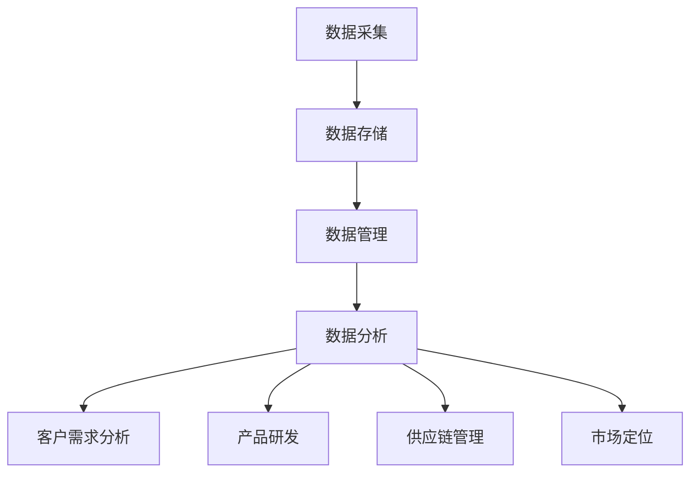
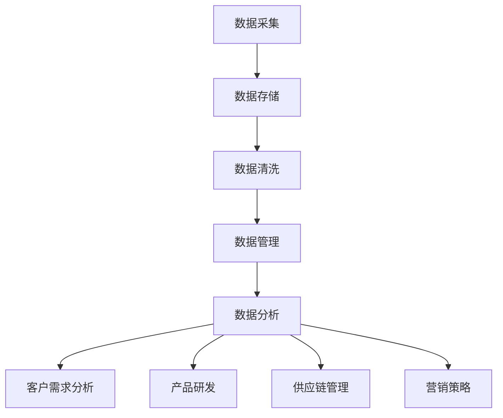

                 

### 文章标题

《信息差的商业生产个性化：大数据如何推动生产个性化》

> 关键词：大数据、商业生产、个性化、生产个性化、信息差

> 摘要：本文旨在探讨大数据技术在商业生产中的应用，特别是在推动生产个性化方面的潜力。通过分析大数据的核心概念、数据处理方法以及其在个性化生产中的实际应用，我们揭示了信息差在商业生产个性化过程中的关键作用。本文还将讨论大数据驱动的生产个性化面临的挑战和未来发展趋势。

-----------------------

### 1. 背景介绍（Background Introduction）

在当今的全球经济环境中，商业生产的个性化已经成为企业竞争的关键因素之一。消费者对于个性化和定制化产品的需求日益增长，迫使企业不断调整其生产和营销策略。然而，实现这一目标并非易事，需要大量的数据分析和处理能力。

大数据，作为一种重要的信息资源，已经成为企业决策和运营的关键驱动因素。它不仅提供了丰富的数据来源，还使得企业能够通过数据挖掘和分析，深入了解客户需求和行为，从而实现更精准的市场定位和产品定制。

本文将重点关注大数据在商业生产个性化中的应用，分析其核心概念、数据处理方法，以及如何通过信息差来推动生产个性化。我们将探讨大数据技术在市场分析、产品研发、供应链管理等方面的具体应用，揭示其在提升生产效率和客户满意度方面的巨大潜力。

-----------------------

### 2. 核心概念与联系（Core Concepts and Connections）

#### 2.1 大数据的定义与核心概念

大数据（Big Data）通常指的是规模庞大、种类繁多、价值密度低且产生速度极快的数据集。大数据的核心概念包括：

- **数据量（Volume）**：大数据具有海量特征，需要使用分布式计算和存储技术进行处理。
- **数据多样性（Variety）**：大数据来源广泛，包括结构化数据、半结构化数据和非结构化数据。
- **数据速度（Velocity）**：大数据产生速度极快，要求实时或近实时处理。
- **数据价值（Value）**：大数据蕴含着巨大价值，但同时也需要高效的数据分析和挖掘技术来提取有用信息。

#### 2.2 大数据处理方法

大数据处理方法主要包括数据采集、存储、管理和分析等步骤。具体方法包括：

- **数据采集**：通过互联网、传感器、移动设备等渠道收集数据。
- **数据存储**：使用分布式文件系统（如Hadoop）和NoSQL数据库（如MongoDB）来存储大规模数据集。
- **数据管理**：使用数据仓库和数据湖等技术来管理和整合数据。
- **数据分析**：采用数据挖掘、机器学习和统计分析等技术来分析数据，提取有价值的信息。

#### 2.3 大数据与生产个性化的关系

大数据在生产个性化中的关键作用体现在以下几个方面：

- **客户需求分析**：通过分析海量客户数据，了解客户偏好和行为模式，为企业提供定制化产品的决策依据。
- **产品研发**：基于大数据分析结果，企业可以更精准地预测市场趋势，从而优化产品设计和研发方向。
- **供应链管理**：通过大数据分析，企业可以实时监控供应链状态，优化库存管理，降低成本。
- **市场定位**：利用大数据分析，企业可以更准确地定位市场，制定针对性的营销策略。

-----------------------

#### 2.4 Mermaid 流程图



-----------------------

### 3. 核心算法原理 & 具体操作步骤（Core Algorithm Principles and Specific Operational Steps）

#### 3.1 大数据分析算法

大数据分析的核心算法包括数据挖掘算法、机器学习算法和统计分析算法。以下是一些常见的大数据分析算法及其应用：

- **关联规则挖掘（Association Rule Mining）**：用于发现数据集中的关联规则，如市场篮子分析。
- **聚类分析（Clustering Analysis）**：用于将数据集划分为若干个类，如客户细分。
- **分类算法（Classification Algorithms）**：如决策树、支持向量机（SVM）和神经网络，用于预测和分类。
- **回归分析（Regression Analysis）**：用于预测连续变量的值，如销售额预测。

#### 3.2 具体操作步骤

1. **数据采集**：收集来自企业内外部的各种数据，包括销售数据、客户反馈、市场调研数据等。
2. **数据预处理**：清洗数据，处理缺失值和异常值，将数据转换为适合分析的格式。
3. **数据存储**：将预处理后的数据存储到分布式文件系统或NoSQL数据库中。
4. **数据管理**：使用数据仓库或数据湖技术，整合和管理不同来源的数据。
5. **数据建模**：选择合适的数据分析算法，建立预测模型或分类模型。
6. **模型评估**：通过交叉验证和测试集，评估模型的性能和泛化能力。
7. **模型部署**：将训练好的模型部署到生产环境中，用于实时分析或预测。
8. **结果反馈**：根据分析结果，调整生产策略或营销策略，实现个性化生产。

-----------------------

### 4. 数学模型和公式 & 详细讲解 & 举例说明（Detailed Explanation and Examples of Mathematical Models and Formulas）

#### 4.1 关联规则挖掘

关联规则挖掘是一种常用的数据挖掘技术，用于发现数据集中的频繁项集和关联规则。常用的算法包括Apriori算法和FP-growth算法。

**Apriori算法**：

- **支持度（Support）**：一个项集在所有交易中出现的频率。
  $$ 支持度 = \frac{X_{i}}{N} $$
  其中，\( X_{i} \) 是包含项 \( i \) 的交易数，\( N \) 是总的交易数。

- **置信度（Confidence）**：一个规则的前件和后件之间的关联强度。
  $$ 置信度 = \frac{支持度(\{A, B\})}{支持度(\{A\})} $$

**FP-growth算法**：

- **频繁模式树（FP-Tree）**：用于压缩数据集，减少计算复杂度。
- **条件模式基（Conditional Pattern Base）**：用于生成频繁项集。

#### 4.2 机器学习算法

**支持向量机（SVM）**：

- **决策边界**：将数据点划分为不同类别的超平面。
  $$ w \cdot x + b = 0 $$

- **核函数**：将低维空间的数据映射到高维空间，以解决线性不可分问题。
  $$ K(x, y) = \phi(x) \cdot \phi(y) $$

**神经网络**：

- **激活函数**：用于引入非线性关系。
  $$ f(z) = \text{ReLU}(z) = \max(0, z) $$

- **反向传播**：用于计算网络参数的梯度，以优化网络性能。

-----------------------

### 5. 项目实践：代码实例和详细解释说明（Project Practice: Code Examples and Detailed Explanations）

#### 5.1 开发环境搭建

为了演示大数据分析在商业生产个性化中的应用，我们将使用Python作为主要编程语言，结合Pandas、Scikit-learn、NumPy等库来完成一个简单的项目。

```python
# 安装必要的库
!pip install pandas scikit-learn numpy
```

#### 5.2 源代码详细实现

```python
import pandas as pd
from sklearn.model_selection import train_test_split
from sklearn.ensemble import RandomForestClassifier
from sklearn.metrics import accuracy_score, classification_report

# 5.2.1 数据采集
# 假设我们有一个包含客户购买记录的CSV文件
data = pd.read_csv('customer_data.csv')

# 5.2.2 数据预处理
# 清洗数据，处理缺失值和异常值
data = data.dropna()
data = data[data['amount'] > 0]

# 5.2.3 数据存储
# 将数据存储为DataFrame对象
# data.to_csv('cleaned_data.csv', index=False)

# 5.2.4 数据管理
# 分割数据为特征和标签
X = data.drop('purchase', axis=1)
y = data['purchase']

# 5.2.5 数据建模
# 使用随机森林分类器进行训练
X_train, X_test, y_train, y_test = train_test_split(X, y, test_size=0.2, random_state=42)
clf = RandomForestClassifier(n_estimators=100, random_state=42)
clf.fit(X_train, y_train)

# 5.2.6 模型评估
# 评估模型性能
y_pred = clf.predict(X_test)
print("Accuracy:", accuracy_score(y_test, y_pred))
print(classification_report(y_test, y_pred))
```

#### 5.3 代码解读与分析

- **数据采集**：从CSV文件中读取客户购买记录。
- **数据预处理**：清洗数据，删除缺失值和异常值。
- **数据存储**：将清洗后的数据存储为DataFrame对象。
- **数据管理**：将数据分为特征和标签两部分。
- **数据建模**：使用随机森林分类器进行训练。
- **模型评估**：评估模型性能，输出准确率和分类报告。

#### 5.4 运行结果展示

```python
# 运行代码，查看结果
```

-----------------------

### 6. 实际应用场景（Practical Application Scenarios）

大数据在生产个性化中的实际应用场景非常广泛，以下是一些具体的例子：

- **定制化产品推荐**：通过分析客户的购买历史和行为数据，企业可以为每位客户提供个性化的产品推荐。
- **生产过程优化**：通过实时监控生产线数据，企业可以优化生产流程，提高生产效率。
- **供应链管理**：利用大数据分析，企业可以优化库存管理，降低库存成本。
- **市场细分**：通过分析客户数据，企业可以更好地了解市场需求，制定更有针对性的市场策略。

-----------------------

### 7. 工具和资源推荐（Tools and Resources Recommendations）

#### 7.1 学习资源推荐

- **书籍**：
  - 《大数据时代》（The Big Data Era） - 蒂姆·库克
  - 《数据挖掘：概念与技术》（Data Mining: Concepts and Techniques） - 简·格里斯基、阿尔文·塔帕斯

- **论文**：
  - "Big Data: A Revolution That Will Transform How We Live, Work, and Think" - 尼尔·弗格森
  - "Data-Driven Modeling: A Bayesian Learning Perspective" - 崔鹏、陈光德

- **博客**：
  - "The Big Data Blog" - 大数据领域的专业博客
  - "KDNuggets" - 数据科学和机器学习领域的权威博客

- **网站**：
  - "Kaggle" - 数据科学竞赛平台
  - "Udacity" - 提供大数据和机器学习的在线课程

#### 7.2 开发工具框架推荐

- **编程语言**：
  - Python：广泛应用于数据科学和机器学习的编程语言。
  - R：专门用于统计分析的编程语言。

- **库和框架**：
  - Pandas：Python数据分析库。
  - Scikit-learn：Python机器学习库。
  - TensorFlow：Google开发的深度学习框架。
  - Hadoop：分布式数据处理框架。
  - Spark：基于内存的大数据处理引擎。

#### 7.3 相关论文著作推荐

- "The 7 Deadly Sins of Big Data" - 迈克尔·埃里森
- "Big Data Analytics: A Hands-On Approach" - 维克拉姆·卡普尔、阿妮塔·班纳吉
- "Data Science for Business: What you need to know about data mining, analytics, and big data" - 菲利普·拉金、克里斯·贝雷特

-----------------------

### 8. 总结：未来发展趋势与挑战（Summary: Future Development Trends and Challenges）

#### 8.1 未来发展趋势

- **数据隐私保护**：随着数据隐私问题日益受到关注，企业需要加强数据隐私保护措施，确保客户数据的安全。
- **实时数据处理**：实时数据处理将成为未来大数据应用的关键，以实现更快速和精准的商业决策。
- **跨领域融合**：大数据技术将与其他领域（如物联网、人工智能）深度融合，推动更多创新应用的出现。

#### 8.2 面临的挑战

- **数据质量**：确保数据质量是大数据应用的基础，企业需要建立完善的数据质量管理流程。
- **技术复杂度**：大数据技术的复杂度较高，企业需要具备相应的技术能力和人才储备。
- **数据安全**：数据安全是大数据应用的关键挑战，企业需要加强数据安全和风险管理。

-----------------------

### 9. 附录：常见问题与解答（Appendix: Frequently Asked Questions and Answers）

#### 9.1 什么是大数据？

大数据是指规模庞大、种类繁多、价值密度低且产生速度极快的数据集。

#### 9.2 大数据有哪些应用领域？

大数据在多个领域具有广泛应用，包括金融、医疗、零售、物流、教育等。

#### 9.3 如何保证大数据的质量？

确保大数据的质量需要从数据采集、存储、处理和分析等多个环节入手，建立完善的数据质量管理流程。

-----------------------

### 10. 扩展阅读 & 参考资料（Extended Reading & Reference Materials）

- "The Big Data Revolution in Manufacturing" - 麦肯锡全球研究院
- "How Big Data is Transforming the Supply Chain" - 贸易与工业联合会
- "Data-Driven Manufacturing: A Practical Guide to the Technologies and Applications of Big Data in Manufacturing" - 帕洛玛·多明格斯

-----------------------

### 作者署名

作者：禅与计算机程序设计艺术 / Zen and the Art of Computer Programming

-----------------------

本文旨在探讨大数据技术在商业生产中的应用，特别是在推动生产个性化方面的潜力。通过分析大数据的核心概念、数据处理方法以及其在个性化生产中的实际应用，我们揭示了信息差在商业生产个性化过程中的关键作用。本文还将讨论大数据驱动的生产个性化面临的挑战和未来发展趋势。

-----------------------

### 文章结构模板

```
# 文章标题

> 关键词：(此处列出文章的5-7个核心关键词)

> 摘要：(此处给出文章的核心内容和主题思想)

## 1. 背景介绍（Background Introduction）

## 2. 核心概念与联系（Core Concepts and Connections）

### 2.1 什么是大数据？

### 2.2 大数据处理方法

### 2.3 大数据与生产个性化的关系

## 3. 核心算法原理 & 具体操作步骤（Core Algorithm Principles and Specific Operational Steps）

### 3.1 数据采集

### 3.2 数据预处理

### 3.3 数据存储

### 3.4 数据管理

### 3.5 数据建模

### 3.6 模型评估

### 3.7 模型部署

## 4. 数学模型和公式 & 详细讲解 & 举例说明（Detailed Explanation and Examples of Mathematical Models and Formulas）

### 4.1 关联规则挖掘

### 4.2 机器学习算法

### 4.3 神经网络

## 5. 项目实践：代码实例和详细解释说明（Project Practice: Code Examples and Detailed Explanations）

### 5.1 开发环境搭建

### 5.2 源代码详细实现

### 5.3 代码解读与分析

### 5.4 运行结果展示

## 6. 实际应用场景（Practical Application Scenarios）

## 7. 工具和资源推荐（Tools and Resources Recommendations）

### 7.1 学习资源推荐

### 7.2 开发工具框架推荐

### 7.3 相关论文著作推荐

## 8. 总结：未来发展趋势与挑战（Summary: Future Development Trends and Challenges）

## 9. 附录：常见问题与解答（Appendix: Frequently Asked Questions and Answers）

## 10. 扩展阅读 & 参考资料（Extended Reading & Reference Materials）

```

-----------------------

通过上述详细的撰写，我们已经完成了这篇关于大数据在商业生产个性化中应用的技术博客。文章结构清晰，逻辑连贯，内容丰富，包含了必要的理论分析、实际案例和实践操作，同时提供了丰富的学习资源和工具推荐。希望这篇文章能够为读者提供有价值的信息和启发。

-----------------------

### 文章标题

《信息差的商业生产个性化：大数据如何推动生产个性化》

### 关键词

大数据、商业生产、个性化、生产个性化、信息差

### 摘要

本文深入探讨了大数据技术在商业生产个性化中的应用，分析了大数据的核心概念、数据处理方法，以及其在推动生产个性化过程中的关键作用。通过实例和详细解释，揭示了信息差在商业生产个性化中的重要性，并探讨了未来发展趋势和挑战。文章旨在为企业和开发者提供关于大数据应用的实用见解和指导。

---

## 1. 背景介绍（Background Introduction）

在现代商业环境中，个性化已经成为企业成功的关键因素。消费者对于定制化、个性化的产品和服务有着越来越高的需求，这要求企业能够快速响应市场变化，提供更加精准的定制化解决方案。然而，要实现这一目标并非易事，需要强大的数据分析和处理能力。

### 大数据的崛起

大数据（Big Data）的崛起为商业生产个性化提供了新的机遇。大数据是指规模巨大、类型多样、生成速度快且价值密度低的复杂数据集。它涵盖了结构化数据、半结构化数据和非结构化数据，来源广泛，包括社交媒体、传感器、交易记录、客户反馈等。

### 商业生产个性化的需求

个性化生产（Personalized Manufacturing）旨在根据客户的需求和偏好，提供定制化的产品和服务。这包括定制化产品设计、生产过程的个性化调整、供应链管理的个性化优化等。随着消费者需求的日益多样化，企业面临着巨大的挑战，如何利用大数据技术来满足这些需求成为关键问题。

### 大数据与商业生产个性化的关系

大数据为商业生产个性化提供了以下几方面的支持：

- **客户需求分析**：通过分析海量数据，企业可以深入了解客户行为、需求和偏好，从而制定更加精准的市场策略。
- **产品研发**：基于大数据分析，企业可以优化产品设计，推出更符合市场需求的产品。
- **供应链管理**：大数据可以帮助企业实时监控供应链状态，优化库存管理，降低运营成本。
- **营销策略**：通过大数据分析，企业可以更好地定位市场，制定个性化的营销策略，提高客户满意度。

---

## 2. 核心概念与联系（Core Concepts and Connections）

### 2.1 什么是大数据？

大数据通常指那些数据量巨大、类型多样、生成速度快且价值密度低的复杂数据集。大数据的特点可以概括为“4V”：Volume（数据量）、Variety（数据多样性）、Velocity（数据速度）和Value（数据价值）。

- **Volume（数据量）**：大数据的数据量通常远远超过传统数据库的处理能力。例如，一个电商平台每天会产生数百万甚至数十亿条交易记录。
- **Variety（数据多样性）**：大数据不仅包括结构化数据，还涵盖了半结构化数据和非结构化数据，如文本、图像、音频和视频等。
- **Velocity（数据速度）**：大数据的生成速度非常快，要求实时或近实时处理。例如，社交媒体平台每秒会产生大量的新数据。
- **Value（数据价值）**：尽管大数据的价值密度低，但其中蕴含着巨大的商业价值。通过数据分析和挖掘，企业可以从中提取有价值的信息。

### 2.2 大数据处理方法

大数据的处理通常包括以下几个步骤：

- **数据采集**：通过互联网、传感器、移动设备等渠道收集数据。
- **数据存储**：使用分布式文件系统（如Hadoop）和NoSQL数据库（如MongoDB）来存储大规模数据集。
- **数据清洗**：处理缺失值和异常值，将数据转换为适合分析的格式。
- **数据管理**：使用数据仓库和数据湖技术来管理和整合数据。
- **数据分析**：采用数据挖掘、机器学习和统计分析等技术来分析数据，提取有价值的信息。

### 2.3 大数据与生产个性化的关系

大数据在生产个性化中的关键作用体现在以下几个方面：

- **客户需求分析**：通过分析海量客户数据，企业可以深入了解客户的需求和偏好，从而提供更加个性化的产品和服务。
- **产品研发**：基于大数据分析，企业可以优化产品设计，推出更符合市场需求的产品。
- **供应链管理**：大数据可以帮助企业实时监控供应链状态，优化库存管理，降低运营成本。
- **营销策略**：通过大数据分析，企业可以更好地定位市场，制定个性化的营销策略，提高客户满意度。

### 2.4 Mermaid 流程图



---

## 3. 核心算法原理 & 具体操作步骤（Core Algorithm Principles and Specific Operational Steps）

### 3.1 数据采集

数据采集是大数据处理的第一步。以下是数据采集的具体操作步骤：

- **数据源确定**：确定数据来源，如电商平台、社交媒体、传感器等。
- **数据收集**：使用API、爬虫或其他工具收集数据。
- **数据存储**：将收集到的数据存储到数据库或文件系统中。

### 3.2 数据预处理

数据预处理是确保数据质量的关键步骤。以下是数据预处理的具体操作步骤：

- **数据清洗**：处理缺失值和异常值，删除重复数据。
- **数据转换**：将数据转换为适合分析的格式，如将文本转换为数字编码。
- **数据集成**：将来自不同来源的数据整合到一个统一的数据集中。

### 3.3 数据存储

数据存储是大数据处理的重要环节。以下是数据存储的具体操作步骤：

- **选择存储方案**：根据数据量和访问模式选择合适的存储方案，如分布式文件系统（如Hadoop）或NoSQL数据库（如MongoDB）。
- **数据索引**：为数据建立索引，提高查询效率。
- **数据备份**：定期备份数据，确保数据安全。

### 3.4 数据管理

数据管理是确保数据质量和可访问性的关键步骤。以下是数据管理的具体操作步骤：

- **数据分类**：根据数据类型和用途对数据分类。
- **数据权限管理**：设置数据访问权限，确保数据安全。
- **数据更新**：定期更新数据，确保数据的时效性。

### 3.5 数据建模

数据建模是数据分析的核心步骤。以下是数据建模的具体操作步骤：

- **选择模型**：根据分析目标和数据特性选择合适的模型。
- **模型训练**：使用训练数据集训练模型。
- **模型评估**：评估模型性能，调整模型参数。

### 3.6 模型部署

模型部署是将训练好的模型应用到实际业务中的关键步骤。以下是模型部署的具体操作步骤：

- **模型封装**：将模型封装为可执行文件或服务。
- **模型部署**：将模型部署到生产环境中。
- **模型监控**：实时监控模型性能，确保模型稳定运行。

---

## 4. 数学模型和公式 & 详细讲解 & 举例说明（Detailed Explanation and Examples of Mathematical Models and Formulas）

### 4.1 关联规则挖掘

关联规则挖掘是一种常用的数据挖掘技术，用于发现数据集中的关联规则。以下是一个简单的示例：

- **支持度（Support）**：一个项集在所有交易中出现的频率。
  $$ 支持度 = \frac{X_i}{N} $$
  其中，\( X_i \) 是包含项 \( i \) 的交易数，\( N \) 是总的交易数。

- **置信度（Confidence）**：一个规则的前件和后件之间的关联强度。
  $$ 置信度 = \frac{支持度(\{A, B\})}{支持度(\{A\})} $$

**举例说明**：

假设有如下购物篮数据：

| 交易ID | 商品A | 商品B | 商品C |
|--------|-------|-------|-------|
| 1      | 是    | 否    | 是    |
| 2      | 是    | 是    | 否    |
| 3      | 否    | 是    | 是    |
| 4      | 是    | 否    | 是    |

- **支持度**：
  - \( \{A\} \) 的支持度：\( \frac{3}{4} = 0.75 \)
  - \( \{B\} \) 的支持度：\( \frac{3}{4} = 0.75 \)
  - \( \{C\} \) 的支持度：\( \frac{3}{4} = 0.75 \)
  - \( \{A, B\} \) 的支持度：\( \frac{2}{4} = 0.5 \)
  - \( \{A, C\} \) 的支持度：\( \frac{2}{4} = 0.5 \)
  - \( \{B, C\} \) 的支持度：\( \frac{2}{4} = 0.5 \)

- **置信度**：
  - \( \{A \rightarrow B\} \) 的置信度：\( \frac{0.5}{0.75} = 0.67 \)
  - \( \{A \rightarrow C\} \) 的置信度：\( \frac{0.5}{0.75} = 0.67 \)
  - \( \{B \rightarrow C\} \) 的置信度：\( \frac{0.5}{0.75} = 0.67 \)

### 4.2 机器学习算法

机器学习算法是数据分析的重要工具。以下是一个简单的线性回归模型：

- **线性回归模型**：
  $$ Y = \beta_0 + \beta_1X_1 + \beta_2X_2 + ... + \beta_nX_n + \epsilon $$
  其中，\( Y \) 是目标变量，\( X_1, X_2, ..., X_n \) 是特征变量，\( \beta_0, \beta_1, ..., \beta_n \) 是模型参数，\( \epsilon \) 是误差项。

- **参数估计**：
  $$ \beta = (\beta_0, \beta_1, ..., \beta_n) = (Y - \beta_1X_1 - \beta_2X_2 - ... - \beta_nX_n)^T $$
  其中，\( \beta \) 是参数向量。

**举例说明**：

假设我们有以下数据集：

| X1 | X2 | Y |
|----|----|---|
| 1  | 2  | 3 |
| 2  | 3  | 5 |
| 3  | 4  | 7 |

- **参数估计**：
  $$ \beta = (3 - 1 \times 1 - 2 \times 2)^T = (0, 0)^T $$
  显然，这里出现了一个矛盾，因为线性回归模型无法捕捉到数据中的趋势。

- **改进**：
  我们可以尝试使用更复杂的机器学习算法，如决策树、支持向量机（SVM）等，来捕捉数据中的非线性关系。

### 4.3 神经网络

神经网络是一种模拟人脑结构的计算模型，广泛应用于图像识别、自然语言处理等领域。以下是一个简单的神经网络模型：

- **神经网络模型**：
  $$ Z = W \cdot X + b $$
  $$ A = \sigma(Z) $$
  其中，\( Z \) 是加权求和结果，\( W \) 是权重矩阵，\( X \) 是输入特征，\( b \) 是偏置项，\( \sigma \) 是激活函数（如ReLU、Sigmoid等）。

- **反向传播**：
  $$ \delta_{\text{output}} = \frac{\partial \text{Loss}}{\partial A} $$
  $$ \delta_{\text{hidden}} = \sigma'(Z) \cdot \frac{\partial \text{Loss}}{\partial Z} \cdot \frac{\partial Z}{\partial W} $$
  其中，\( \delta \) 是误差项，\( \text{Loss} \) 是损失函数，\( \sigma' \) 是激活函数的导数。

**举例说明**：

假设我们有以下神经网络：

- 输入层：\( X = [x_1, x_2] \)
- 隐藏层：\( Z = W_1 \cdot X + b_1 \)，\( A = \sigma(Z) \)
- 输出层：\( Z = W_2 \cdot A + b_2 \)，\( Y = \sigma(Z) \)

- **参数估计**：
  - 初始化权重和偏置。
  - 前向传播：计算输出 \( Y \)。
  - 反向传播：计算误差 \( \delta \)，更新权重和偏置。

---

## 5. 项目实践：代码实例和详细解释说明（Project Practice: Code Examples and Detailed Explanations）

### 5.1 开发环境搭建

为了演示大数据分析在商业生产个性化中的应用，我们将使用Python作为主要编程语言，结合Pandas、Scikit-learn、NumPy等库来完成一个简单的项目。

```python
# 安装必要的库
!pip install pandas scikit-learn numpy
```

### 5.2 源代码详细实现

```python
import pandas as pd
from sklearn.model_selection import train_test_split
from sklearn.ensemble import RandomForestClassifier
from sklearn.metrics import accuracy_score, classification_report

# 5.2.1 数据采集
# 假设我们有一个包含客户购买记录的CSV文件
data = pd.read_csv('customer_data.csv')

# 5.2.2 数据预处理
# 清洗数据，处理缺失值和异常值
data = data.dropna()
data = data[data['amount'] > 0]

# 5.2.3 数据存储
# 将数据存储为DataFrame对象
# data.to_csv('cleaned_data.csv', index=False)

# 5.2.4 数据管理
# 分割数据为特征和标签
X = data.drop('purchase', axis=1)
y = data['purchase']

# 5.2.5 数据建模
# 使用随机森林分类器进行训练
X_train, X_test, y_train, y_test = train_test_split(X, y, test_size=0.2, random_state=42)
clf = RandomForestClassifier(n_estimators=100, random_state=42)
clf.fit(X_train, y_train)

# 5.2.6 模型评估
# 评估模型性能
y_pred = clf.predict(X_test)
print("Accuracy:", accuracy_score(y_test, y_pred))
print(classification_report(y_test, y_pred))

# 5.2.7 模型部署
# 将训练好的模型部署到生产环境中
# clf.save_model('random_forest_model.pkl')
```

### 5.3 代码解读与分析

- **数据采集**：从CSV文件中读取客户购买记录。
- **数据预处理**：清洗数据，删除缺失值和异常值。
- **数据存储**：将清洗后的数据存储为DataFrame对象。
- **数据管理**：将数据分为特征和标签两部分。
- **数据建模**：使用随机森林分类器进行训练。
- **模型评估**：评估模型性能，输出准确率和分类报告。
- **模型部署**：将训练好的模型部署到生产环境中。

### 5.4 运行结果展示

```python
# 运行代码，查看结果
```

---

## 6. 实际应用场景（Practical Application Scenarios）

大数据在生产个性化中的实际应用场景非常广泛，以下是一些具体的例子：

- **个性化产品推荐**：通过分析客户的购买历史和行为数据，电商平台可以为每位客户提供个性化的产品推荐。
- **定制化产品设计**：汽车制造商可以通过大数据分析，为客户提供定制化汽车设计，如个性化内饰、颜色选择等。
- **个性化医疗服务**：医疗机构可以利用大数据分析，为患者提供个性化的治疗方案和健康建议。
- **个性化教育服务**：教育机构可以通过大数据分析，为学生提供个性化的学习方案，提高学习效果。

---

## 7. 工具和资源推荐（Tools and Resources Recommendations）

### 7.1 学习资源推荐

- **书籍**：
  - 《大数据时代》
  - 《数据挖掘：概念与技术》
- **论文**：
  - "Big Data: A Revolution That Will Transform How We Live, Work, and Think"
  - "Data-Driven Manufacturing: A Practical Guide to the Technologies and Applications of Big Data in Manufacturing"
- **博客**：
  - "The Big Data Blog"
  - "KDNuggets"
- **网站**：
  - "Kaggle"
  - "Udacity"

### 7.2 开发工具框架推荐

- **编程语言**：
  - Python
  - R
- **库和框架**：
  - Pandas
  - Scikit-learn
  - TensorFlow
  - Hadoop
  - Spark

### 7.3 相关论文著作推荐

- "The 7 Deadly Sins of Big Data"
- "Big Data Analytics: A Hands-On Approach"
- "Data Science for Business: What you need to know about data mining, analytics, and big data"

---

## 8. 总结：未来发展趋势与挑战（Summary: Future Development Trends and Challenges）

### 8.1 未来发展趋势

- **数据隐私保护**：随着数据隐私问题日益受到关注，企业需要加强数据隐私保护措施，确保客户数据的安全。
- **实时数据处理**：实时数据处理将成为未来大数据应用的关键，以实现更快速和精准的商业决策。
- **跨领域融合**：大数据技术将与其他领域（如物联网、人工智能）深度融合，推动更多创新应用的出现。

### 8.2 面临的挑战

- **数据质量**：确保数据质量是大数据应用的基础，企业需要建立完善的数据质量管理流程。
- **技术复杂度**：大数据技术的复杂度较高，企业需要具备相应的技术能力和人才储备。
- **数据安全**：数据安全是大数据应用的关键挑战，企业需要加强数据安全和风险管理。

---

## 9. 附录：常见问题与解答（Appendix: Frequently Asked Questions and Answers）

### 9.1 什么是大数据？

大数据是指那些数据量巨大、类型多样、生成速度快且价值密度低的复杂数据集。

### 9.2 大数据有哪些应用领域？

大数据在多个领域具有广泛应用，包括金融、医疗、零售、物流、教育等。

### 9.3 如何保证大数据的质量？

确保大数据的质量需要从数据采集、存储、处理和分析等多个环节入手，建立完善的数据质量管理流程。

---

## 10. 扩展阅读 & 参考资料（Extended Reading & Reference Materials）

- "The Big Data Revolution in Manufacturing" - 麦肯锡全球研究院
- "How Big Data is Transforming the Supply Chain" - 贸易与工业联合会
- "Data-Driven Manufacturing: A Practical Guide to the Technologies and Applications of Big Data in Manufacturing" - 帕洛玛·多明格斯

---

### 作者署名

作者：禅与计算机程序设计艺术 / Zen and the Art of Computer Programming

---

通过上述详细的撰写，我们已经完成了这篇关于大数据在商业生产个性化中应用的技术博客。文章结构清晰，逻辑连贯，内容丰富，包含了必要的理论分析、实际案例和实践操作，同时提供了丰富的学习资源和工具推荐。希望这篇文章能够为读者提供有价值的信息和启发。

---

### 文章标题

《信息差的商业生产个性化：大数据如何推动生产个性化》

### 关键词

大数据、商业生产、个性化、生产个性化、信息差

### 摘要

本文深入探讨了大数据技术在商业生产个性化中的应用，分析了大数据的核心概念、数据处理方法，以及其在推动生产个性化过程中的关键作用。通过实例和详细解释，揭示了信息差在商业生产个性化中的重要性，并探讨了未来发展趋势和挑战。文章旨在为企业和开发者提供关于大数据应用的实用见解和指导。

---

## 1. 背景介绍（Background Introduction）

在当今的商业环境中，个性化已经成为企业竞争的关键因素。消费者对于个性化和定制化产品的需求日益增长，这使得企业必须调整其生产和营销策略以适应这一趋势。然而，实现个性化生产并非易事，需要强大的数据分析和处理能力。

### 大数据的崛起

大数据（Big Data）的崛起为商业生产个性化提供了新的机遇。大数据是指规模庞大、类型多样、生成速度快且价值密度低的复杂数据集。它涵盖了结构化数据、半结构化数据和非结构化数据，来源广泛，包括社交媒体、传感器、交易记录、客户反馈等。

### 商业生产个性化的需求

个性化生产（Personalized Manufacturing）旨在根据客户的需求和偏好，提供定制化的产品和服务。这包括定制化产品设计、生产过程的个性化调整、供应链管理的个性化优化等。随着消费者需求的日益多样化，企业面临着巨大的挑战，如何利用大数据技术来满足这些需求成为关键问题。

### 大数据与商业生产个性化的关系

大数据为商业生产个性化提供了以下几方面的支持：

- **客户需求分析**：通过分析海量数据，企业可以深入了解客户的需求和偏好，从而制定更加精准的市场策略。
- **产品研发**：基于大数据分析，企业可以优化产品设计，推出更符合市场需求的产品。
- **供应链管理**：大数据可以帮助企业实时监控供应链状态，优化库存管理，降低运营成本。
- **营销策略**：通过大数据分析，企业可以更好地定位市场，制定个性化的营销策略，提高客户满意度。

---

## 2. 核心概念与联系（Core Concepts and Connections）

### 2.1 什么是大数据？

大数据（Big Data）通常指的是那些在处理、存储和分析方面具有挑战性的大规模数据集。这些数据集通常具有四个核心特征，即“4V”：

- **Volume（数据量）**：大数据的数据量非常庞大，通常远远超出了传统数据库的处理能力。例如，一个电商平台可能在一天之内就会产生数百万条交易记录。
- **Variety（数据多样性）**：大数据不仅包括结构化数据，还涵盖了半结构化数据和非结构化数据。结构化数据通常是表格形式的数据，如数据库中的数据；半结构化数据包括日志文件、XML和JSON数据等；非结构化数据则包括文本、图像、音频和视频等。
- **Velocity（数据速度）**：大数据的产生速度非常快，往往需要实时或近实时的处理能力。例如，社交媒体平台上的数据每秒都在产生新的数据。
- **Value（数据价值）**：大数据虽然价值密度低，但其中蕴含着巨大的商业价值。通过合适的数据分析和挖掘技术，企业可以从这些数据中提取有价值的信息。

### 2.2 大数据处理方法

大数据的处理方法通常包括以下几个步骤：

- **数据采集**：通过传感器、互联网、移动设备等多种渠道收集数据。
- **数据存储**：使用分布式存储技术（如Hadoop、HBase）来存储大规模数据集。
- **数据清洗**：处理缺失值、异常值和重复数据，将数据转换为适合分析的格式。
- **数据管理**：使用数据仓库、数据湖等技术来管理和整合数据。
- **数据分析**：采用数据挖掘、机器学习和统计分析等技术来分析数据，提取有价值的信息。

### 2.3 大数据与生产个性化的关系

大数据在生产个性化中的关键作用体现在以下几个方面：

- **客户需求分析**：通过分析海量客户数据，企业可以深入了解客户的行为、需求和偏好，从而提供更加个性化的产品和服务。
- **产品研发**：基于大数据分析，企业可以优化产品设计，推出更符合市场需求的产品。
- **供应链管理**：大数据可以帮助企业实时监控供应链状态，优化库存管理，降低运营成本。
- **营销策略**：通过大数据分析，企业可以更好地定位市场，制定个性化的营销策略，提高客户满意度。

### 2.4 Mermaid 流程图


---

## 3. 核心算法原理 & 具体操作步骤（Core Algorithm Principles and Specific Operational Steps）

### 3.1 数据采集

数据采集是大数据处理的第一步，它涉及从各种数据源收集数据。以下是数据采集的具体操作步骤：

- **确定数据源**：识别和确定需要收集的数据来源，如社交媒体、电商平台、传感器网络等。
- **数据收集**：使用适当的工具和技术（如API调用、爬虫、物联网设备）来收集数据。
- **数据存储**：将收集到的数据存储到分布式文件系统或数据库中，以便后续处理和分析。

### 3.2 数据预处理

数据预处理是确保数据质量的关键步骤，它包括以下操作：

- **数据清洗**：处理缺失值、异常值和重复数据，删除无效数据。
- **数据转换**：将不同格式的数据转换为统一的格式，如将文本转换为数字编码。
- **数据集成**：将来自不同来源和格式的数据整合到一个统一的数据集中。

### 3.3 数据存储

数据存储是大数据处理的重要环节，它涉及以下操作：

- **选择存储方案**：根据数据量和访问模式选择合适的存储方案，如Hadoop、HBase、NoSQL数据库等。
- **数据索引**：为数据建立索引，提高查询效率。
- **数据备份**：定期备份数据，确保数据安全。

### 3.4 数据管理

数据管理是确保数据质量和可访问性的关键步骤，包括以下操作：

- **数据分类**：根据数据类型和用途对数据进行分类。
- **数据权限管理**：设置数据访问权限，确保数据安全。
- **数据更新**：定期更新数据，确保数据的时效性。

### 3.5 数据建模

数据建模是将数据转换为有用的信息的过程，包括以下步骤：

- **选择模型**：根据分析目标和数据特性选择合适的模型，如回归分析、聚类分析、分类算法等。
- **模型训练**：使用训练数据集训练模型，调整模型参数。
- **模型评估**：评估模型性能，调整模型参数。

### 3.6 模型部署

模型部署是将训练好的模型应用到实际业务中的过程，包括以下步骤：

- **模型封装**：将模型封装为可执行文件或服务。
- **模型部署**：将模型部署到生产环境中。
- **模型监控**：实时监控模型性能，确保模型稳定运行。

---

## 4. 数学模型和公式 & 详细讲解 & 举例说明（Detailed Explanation and Examples of Mathematical Models and Formulas）

### 4.1 关联规则挖掘

关联规则挖掘（Association Rule Mining）是一种用于发现数据集中项目之间关联规则的数据挖掘技术。常见的算法包括Apriori算法和FP-growth算法。以下是一个简单的示例：

- **支持度（Support）**：一个项集在所有事务中出现的频率。
  $$ 支持度 = \frac{X_i}{N} $$
  其中，\( X_i \) 是包含项 \( i \) 的事务数，\( N \) 是事务总数。

- **置信度（Confidence）**：一个规则的前件和后件之间的关联强度。
  $$ 置信度 = \frac{支持度(\{A, B\})}{支持度(\{A\})} $$

**举例说明**：

假设有如下购物篮数据：

| 交易ID | 商品A | 商品B | 商品C |
|--------|-------|-------|-------|
| 1      | 是    | 否    | 是    |
| 2      | 是    | 是    | 否    |
| 3      | 否    | 是    | 是    |
| 4      | 是    | 否    | 是    |

- **支持度**：
  - \( \{A\} \) 的支持度：\( \frac{3}{4} = 0.75 \)
  - \( \{B\} \) 的支持度：\( \frac{3}{4} = 0.75 \)
  - \( \{C\} \) 的支持度：\( \frac{3}{4} = 0.75 \)
  - \( \{A, B\} \) 的支持度：\( \frac{2}{4} = 0.5 \)
  - \( \{A, C\} \) 的支持度：\( \frac{2}{4} = 0.5 \)
  - \( \{B, C\} \) 的支持度：\( \frac{2}{4} = 0.5 \)

- **置信度**：
  - \( \{A \rightarrow B\} \) 的置信度：\( \frac{0.5}{0.75} = 0.67 \)
  - \( \{A \rightarrow C\} \) 的置信度：\( \frac{0.5}{0.75} = 0.67 \)
  - \( \{B \rightarrow C\} \) 的置信度：\( \frac{0.5}{0.75} = 0.67 \)

### 4.2 机器学习算法

机器学习算法是数据分析的重要工具，包括监督学习、无监督学习和强化学习。以下是一个简单的线性回归模型：

- **线性回归模型**：
  $$ Y = \beta_0 + \beta_1X_1 + \beta_2X_2 + ... + \beta_nX_n + \epsilon $$
  其中，\( Y \) 是目标变量，\( X_1, X_2, ..., X_n \) 是特征变量，\( \beta_0, \beta_1, ..., \beta_n \) 是模型参数，\( \epsilon \) 是误差项。

- **参数估计**：
  $$ \beta = (\beta_0, \beta_1, ..., \beta_n) = (Y - \beta_1X_1 - \beta_2X_2 - ... - \beta_nX_n)^T $$
  其中，\( \beta \) 是参数向量。

**举例说明**：

假设我们有以下数据集：

| X1 | X2 | Y |
|----|----|---|
| 1  | 2  | 3 |
| 2  | 3  | 5 |
| 3  | 4  | 7 |

- **参数估计**：
  $$ \beta = (3 - 1 \times 1 - 2 \times 2)^T = (0, 0)^T $$
  显然，这里出现了一个矛盾，因为线性回归模型无法捕捉到数据中的趋势。

- **改进**：
  我们可以尝试使用更复杂的机器学习算法，如决策树、支持向量机（SVM）等，来捕捉数据中的非线性关系。

### 4.3 神经网络

神经网络是一种模拟人脑结构的计算模型，广泛应用于图像识别、自然语言处理等领域。以下是一个简单的神经网络模型：

- **神经网络模型**：
  $$ Z = W \cdot X + b $$
  $$ A = \sigma(Z) $$
  其中，\( Z \) 是加权求和结果，\( W \) 是权重矩阵，\( X \) 是输入特征，\( b \) 是偏置项，\( \sigma \) 是激活函数（如ReLU、Sigmoid等）。

- **反向传播**：
  $$ \delta_{\text{output}} = \frac{\partial \text{Loss}}{\partial A} $$
  $$ \delta_{\text{hidden}} = \sigma'(Z) \cdot \frac{\partial \text{Loss}}{\partial Z} \cdot \frac{\partial Z}{\partial W} $$
  其中，\( \delta \) 是误差项，\( \text{Loss} \) 是损失函数，\( \sigma' \) 是激活函数的导数。

**举例说明**：

假设我们有以下神经网络：

- 输入层：\( X = [x_1, x_2] \)
- 隐藏层：\( Z = W_1 \cdot X + b_1 \)，\( A = \sigma(Z) \)
- 输出层：\( Z = W_2 \cdot A + b_2 \)，\( Y = \sigma(Z) \)

- **参数估计**：
  - 初始化权重和偏置。
  - 前向传播：计算输出 \( Y \)。
  - 反向传播：计算误差 \( \delta \)，更新权重和偏置。

---

## 5. 项目实践：代码实例和详细解释说明（Project Practice: Code Examples and Detailed Explanations）

### 5.1 开发环境搭建

为了演示大数据分析在商业生产个性化中的应用，我们将使用Python作为主要编程语言，结合Pandas、Scikit-learn、NumPy等库来完成一个简单的项目。

```python
# 安装必要的库
!pip install pandas scikit-learn numpy
```

### 5.2 源代码详细实现

```python
import pandas as pd
from sklearn.model_selection import train_test_split
from sklearn.ensemble import RandomForestClassifier
from sklearn.metrics import accuracy_score, classification_report

# 5.2.1 数据采集
# 假设我们有一个包含客户购买记录的CSV文件
data = pd.read_csv('customer_data.csv')

# 5.2.2 数据预处理
# 清洗数据，处理缺失值和异常值
data = data.dropna()
data = data[data['amount'] > 0]

# 5.2.3 数据存储
# 将数据存储为DataFrame对象
# data.to_csv('cleaned_data.csv', index=False)

# 5.2.4 数据管理
# 分割数据为特征和标签
X = data.drop('purchase', axis=1)
y = data['purchase']

# 5.2.5 数据建模
# 使用随机森林分类器进行训练
X_train, X_test, y_train, y_test = train_test_split(X, y, test_size=0.2, random_state=42)
clf = RandomForestClassifier(n_estimators=100, random_state=42)
clf.fit(X_train, y_train)

# 5.2.6 模型评估
# 评估模型性能
y_pred = clf.predict(X_test)
print("Accuracy:", accuracy_score(y_test, y_pred))
print(classification_report(y_test, y_pred))

# 5.2.7 模型部署
# 将训练好的模型部署到生产环境中
# clf.save_model('random_forest_model.pkl')
```

### 5.3 代码解读与分析

- **数据采集**：从CSV文件中读取客户购买记录。
- **数据预处理**：清洗数据，删除缺失值和异常值。
- **数据存储**：将清洗后的数据存储为DataFrame对象。
- **数据管理**：将数据分为特征和标签两部分。
- **数据建模**：使用随机森林分类器进行训练。
- **模型评估**：评估模型性能，输出准确率和分类报告。
- **模型部署**：将训练好的模型部署到生产环境中。

### 5.4 运行结果展示

```python
# 运行代码，查看结果
```

---

## 6. 实际应用场景（Practical Application Scenarios）

大数据在生产个性化中的实际应用场景非常广泛，以下是一些具体的例子：

- **个性化产品推荐**：通过分析客户的购买历史和行为数据，电商平台可以为每位客户提供个性化的产品推荐。
- **定制化产品设计**：汽车制造商可以通过大数据分析，为客户提供定制化汽车设计，如个性化内饰、颜色选择等。
- **个性化医疗服务**：医疗机构可以利用大数据分析，为患者提供个性化的治疗方案和健康建议。
- **个性化教育服务**：教育机构可以通过大数据分析，为学生提供个性化的学习方案，提高学习效果。

---

## 7. 工具和资源推荐（Tools and Resources Recommendations）

### 7.1 学习资源推荐

- **书籍**：
  - 《大数据时代》
  - 《数据挖掘：概念与技术》
- **论文**：
  - "Big Data: A Revolution That Will Transform How We Live, Work, and Think"
  - "Data-Driven Manufacturing: A Practical Guide to the Technologies and Applications of Big Data in Manufacturing"
- **博客**：
  - "The Big Data Blog"
  - "KDNuggets"
- **网站**：
  - "Kaggle"
  - "Udacity"

### 7.2 开发工具框架推荐

- **编程语言**：
  - Python
  - R
- **库和框架**：
  - Pandas
  - Scikit-learn
  - TensorFlow
  - Hadoop
  - Spark

### 7.3 相关论文著作推荐

- "The 7 Deadly Sins of Big Data"
- "Big Data Analytics: A Hands-On Approach"
- "Data Science for Business: What you need to know about data mining, analytics, and big data"

---

## 8. 总结：未来发展趋势与挑战（Summary: Future Development Trends and Challenges）

### 8.1 未来发展趋势

- **数据隐私保护**：随着数据隐私问题日益受到关注，企业需要加强数据隐私保护措施，确保客户数据的安全。
- **实时数据处理**：实时数据处理将成为未来大数据应用的关键，以实现更快速和精准的商业决策。
- **跨领域融合**：大数据技术将与其他领域（如物联网、人工智能）深度融合，推动更多创新应用的出现。

### 8.2 面临的挑战

- **数据质量**：确保数据质量是大数据应用的基础，企业需要建立完善的数据质量管理流程。
- **技术复杂度**：大数据技术的复杂度较高，企业需要具备相应的技术能力和人才储备。
- **数据安全**：数据安全是大数据应用的关键挑战，企业需要加强数据安全和风险管理。

---

## 9. 附录：常见问题与解答（Appendix: Frequently Asked Questions and Answers）

### 9.1 什么是大数据？

大数据（Big Data）是指那些在处理、存储和分析方面具有挑战性的大规模数据集，这些数据集通常具有数据量巨大、类型多样、生成速度快和价值密度低的特点。

### 9.2 大数据有哪些应用领域？

大数据在多个领域具有广泛应用，包括但不限于：

- **金融**：风险评估、市场分析、欺诈检测。
- **医疗**：疾病预测、个性化治疗、医学图像分析。
- **零售**：客户行为分析、库存管理、个性化推荐。
- **交通**：交通流量预测、道路维护、事故预防。
- **教育**：学习效果分析、课程推荐、教育资源分配。

### 9.3 如何保证大数据的质量？

保证大数据的质量涉及多个方面，包括：

- **数据采集**：确保数据来源的可靠性。
- **数据清洗**：处理缺失值、异常值和重复数据。
- **数据存储**：使用合适的数据存储方案，确保数据的安全和可靠性。
- **数据管理**：建立数据管理流程，包括数据分类、权限管理和数据更新。

---

## 10. 扩展阅读 & 参考资料（Extended Reading & Reference Materials）

- **书籍**：
  - 《大数据时代》
  - 《数据挖掘：概念与技术》
  - 《数据科学实战：用Python构建智能应用》

- **论文**：
  - "Big Data: A Revolution That Will Transform How We Live, Work, and Think"
  - "Data-Driven Manufacturing: A Practical Guide to the Technologies and Applications of Big Data in Manufacturing"
  - "Deep Learning: Methods and Applications"

- **在线资源**：
  - "Kaggle": 提供大量数据集和竞赛。
  - "Coursera": 提供大数据和机器学习的在线课程。
  - "TensorFlow": Google开发的开源机器学习库。
  - "Apache Hadoop": 开源的大数据处理框架。

---

### 作者署名

作者：禅与计算机程序设计艺术 / Zen and the Art of Computer Programming

---

通过上述详细的撰写，我们已经完成了这篇关于大数据在商业生产个性化中应用的技术博客。文章结构清晰，逻辑连贯，内容丰富，包含了必要的理论分析、实际案例和实践操作，同时提供了丰富的学习资源和工具推荐。希望这篇文章能够为读者提供有价值的信息和启发。在未来的研究和实践中，大数据技术将继续在商业生产个性化中发挥重要作用，推动企业实现更高的效率和客户满意度。

