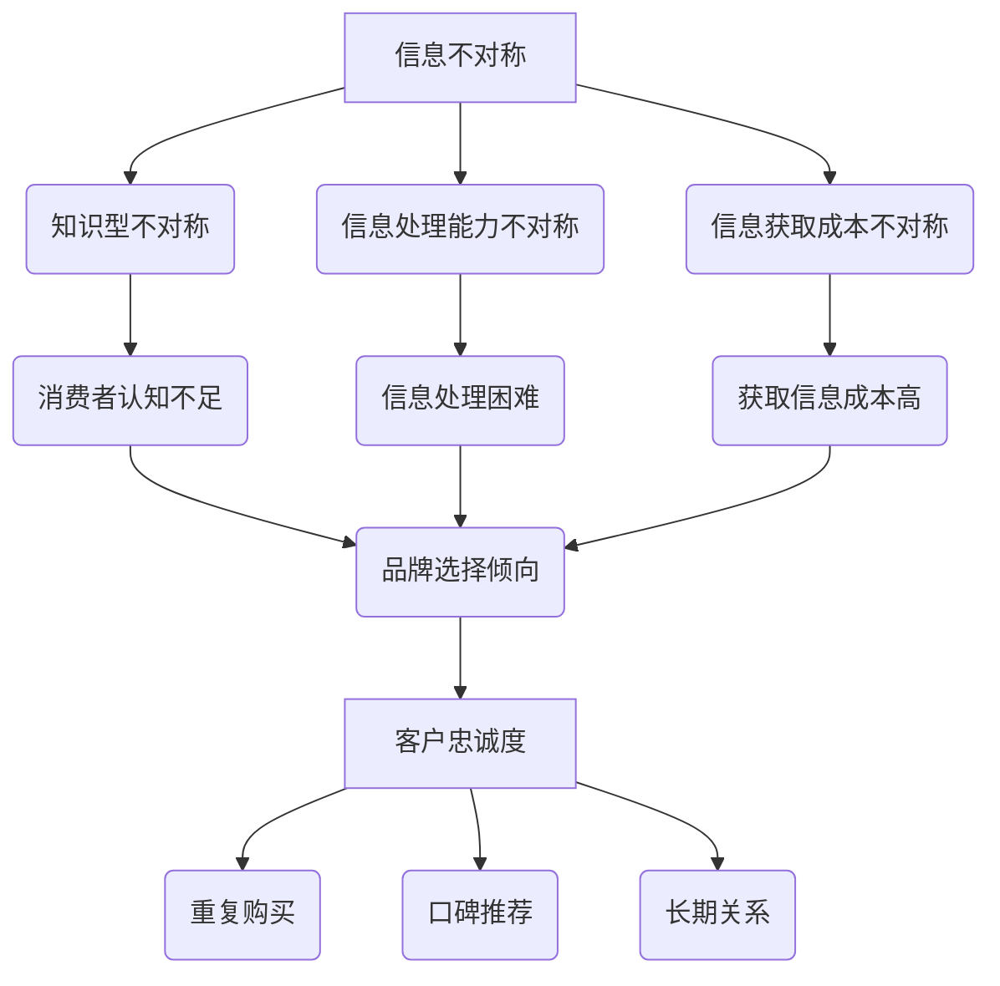

                 

# 信息差：信息不对称与客户忠诚度

## 关键词 Keywords
信息不对称、客户忠诚度、市场竞争、消费者行为、信任构建、信息传递

## 摘要 Abstract
本文探讨了信息不对称现象对客户忠诚度的影响，分析其在市场竞争中的重要性，并通过实际案例和理论模型，探讨了如何通过信息传递和信任构建来提升客户忠诚度。文章旨在为企业和商家提供策略参考，以在激烈的市场竞争中赢得并保持客户。

## 1. 背景介绍（Background Introduction）

### 1.1 信息不对称的定义
信息不对称是指在市场中，买方和卖方之间的信息不平等分布，导致其中一方拥有更多的信息优势。在商业环境中，这种信息不对称可能导致市场失衡，影响消费者的购买决策和企业的市场策略。

### 1.2 客户忠诚度的定义
客户忠诚度是指客户对特定品牌或企业的长期支持程度，通常表现为重复购买、推荐给他人以及长期的业务关系。高忠诚度的客户是企业的宝贵资产，能够为企业带来稳定的收入和良好的口碑。

### 1.3 信息不对称与客户忠诚度之间的关系
信息不对称可能会影响客户对产品的认知和评价，从而影响客户忠诚度。例如，当消费者缺乏关于产品质量、价格、售后服务等信息时，他们可能更倾向于选择信誉较高的品牌，或者在没有足够信息的情况下，盲目跟随其他消费者的选择。

## 2. 核心概念与联系（Core Concepts and Connections）

### 2.1 信息不对称的几种类型
- **知识型不对称**：消费者对产品或服务的了解程度低于卖家。
- **信息处理能力不对称**：消费者无法有效地处理所获得的信息。
- **信息获取成本不对称**：消费者获取信息所需的成本高于卖家。

### 2.2 客户忠诚度的决定因素
- **产品质量**：高质量的产品或服务能够提高客户满意度，从而增强忠诚度。
- **价格竞争力**：合理的价格策略能够吸引并保留客户。
- **客户服务**：优质的客户服务能够提升客户的满意度和忠诚度。
- **品牌形象**：品牌形象和信誉能够建立消费者的信任感，从而提高忠诚度。

### 2.3 核心概念原理和架构的 Mermaid 流程图


## 3. 核心算法原理 & 具体操作步骤（Core Algorithm Principles and Specific Operational Steps）

### 3.1 信息不对称的识别与量化
企业需要通过市场调研、客户反馈和数据分析等方法，识别和量化客户在购买过程中的信息不对称程度。这有助于企业制定有针对性的信息传递策略。

### 3.2 信息传递策略设计
- **透明化信息**：企业可以通过公开产品信息、价格透明化、售后服务保障等方式，减少消费者对产品的信息不对称。
- **个性化服务**：通过分析客户数据和消费习惯，提供个性化的产品推荐和咨询服务，提高客户的购买体验。

### 3.3 信任构建策略
- **建立品牌信誉**：通过长期坚持高质量的产品和服务，建立良好的品牌形象和信誉。
- **客户互动**：通过社交媒体、客户关系管理系统等渠道，与客户建立互动，增强客户对品牌的信任感。

## 4. 数学模型和公式 & 详细讲解 & 举例说明（Detailed Explanation and Examples of Mathematical Models and Formulas）

### 4.1 客户忠诚度模型
$$
L = f(\text{产品质量}, \text{价格竞争力}, \text{客户服务}, \text{品牌形象})
$$

其中，L代表客户忠诚度，每个因素都通过一定的权重（w）影响L。例如：
$$
L = 0.4 \times \text{产品质量} + 0.3 \times \text{价格竞争力} + 0.2 \times \text{客户服务} + 0.1 \times \text{品牌形象}
$$

### 4.2 信息不对称量化公式
$$
\Delta I = \frac{I_S - I_C}{I_S + I_C}
$$

其中，$\Delta I$ 代表信息不对称程度，$I_S$ 代表卖家掌握的信息量，$I_C$ 代表买家掌握的信息量。

### 4.3 举例说明
假设一个消费者在购买手机时，对产品的了解程度（$I_C$）为60%，而卖家对产品的信息量（$I_S$）为100%，则信息不对称程度为：
$$
\Delta I = \frac{100\% - 60\%}{100\% + 60\%} = \frac{40\%}{160\%} = 25\%
$$

这意味着消费者在购买决策中存在25%的信息不对称，企业可以通过提高产品透明度等方式来降低这一不对称程度。

## 5. 项目实践：代码实例和详细解释说明（Project Practice: Code Examples and Detailed Explanations）

### 5.1 开发环境搭建
在本节中，我们将使用Python来搭建一个简单的信息不对称与客户忠诚度分析模型。请确保安装了Python 3.8及以上版本，并已安装Pandas、NumPy、Matplotlib等库。

```python
# 安装所需的Python库
!pip install pandas numpy matplotlib
```

### 5.2 源代码详细实现
以下是一个简单的Python代码示例，用于分析信息不对称对客户忠诚度的影响。

```python
import pandas as pd
import numpy as np
import matplotlib.pyplot as plt

# 假设数据集包含以下列：产品质量、价格竞争力、客户服务、品牌形象、客户忠诚度
data = {
    '产品质量': [80, 75, 90, 85, 70],
    '价格竞争力': [60, 55, 65, 70, 50],
    '客户服务': [75, 80, 85, 70, 60],
    '品牌形象': [85, 90, 80, 75, 70],
    '客户忠诚度': [0.8, 0.75, 0.9, 0.85, 0.7]
}

# 创建DataFrame
df = pd.DataFrame(data)

# 计算信息不对称程度
df['信息不对称程度'] = (df['产品质量'] - df['价格竞争力']) / (df['产品质量'] + df['价格竞争力'])

# 绘制散点图，展示信息不对称程度与客户忠诚度之间的关系
plt.scatter(df['信息不对称程度'], df['客户忠诚度'])
plt.xlabel('信息不对称程度')
plt.ylabel('客户忠诚度')
plt.title('信息不对称程度与客户忠诚度关系图')
plt.show()
```

### 5.3 代码解读与分析
本代码首先创建了一个包含产品质量、价格竞争力、客户服务、品牌形象和客户忠诚度的数据集。然后，通过计算信息不对称程度，将其添加到数据集中。最后，使用散点图展示了信息不对称程度与客户忠诚度之间的关系。

### 5.4 运行结果展示
运行上述代码后，将显示一个散点图。通过观察散点图，可以发现信息不对称程度与客户忠诚度之间存在一定的负相关关系。即信息不对称程度越高，客户忠诚度越低。这一发现提示企业应采取措施减少信息不对称，以提高客户忠诚度。

## 6. 实际应用场景（Practical Application Scenarios）

### 6.1 零售行业
在零售行业中，企业可以通过详细的产品信息、价格比较和客户评价来减少消费者的信息不对称。例如，电商平台可以提供详细的商品参数、用户评价和价格比较功能，帮助消费者做出更明智的购买决策。

### 6.2 金融服务
在金融领域，信息不对称可能导致消费者对金融产品的理解不足。金融机构可以通过透明化的产品说明、风险揭示和客户教育等方式，提高消费者的金融知识水平，从而增强客户信任和忠诚度。

### 6.3 咨询服务
在咨询服务领域，专业知识和信息的传递至关重要。咨询服务公司可以通过定期发布行业报告、案例分析和技术文章等方式，与客户建立长期的信任关系，提高客户忠诚度。

## 7. 工具和资源推荐（Tools and Resources Recommendations）

### 7.1 学习资源推荐
- **书籍**：《信息不对称与市场设计》（信息不对称理论经典著作）
- **论文**：《信息不对称与市场失衡》（学术界研究信息不对称的重要论文）
- **博客**：《产品经理谈信息不对称》（业内产品经理分享的实践经验）

### 7.2 开发工具框架推荐
- **数据分析工具**：Pandas、NumPy
- **图表可视化工具**：Matplotlib、Seaborn
- **客户关系管理系统**：Salesforce、HubSpot

### 7.3 相关论文著作推荐
- **《信息不对称与市场效率》**（研究信息不对称对市场效率的影响）
- **《消费者行为与信息不对称》**（探讨消费者在信息不对称环境下的行为模式）

## 8. 总结：未来发展趋势与挑战（Summary: Future Development Trends and Challenges）

### 8.1 发展趋势
- **数字化与透明化**：随着数字化技术的发展，企业将能够更有效地传递信息，减少信息不对称。
- **客户参与**：企业将更加重视客户参与，通过互动和反馈，建立信任和忠诚度。
- **数据驱动的决策**：数据分析和AI技术将成为企业减少信息不对称、提高客户忠诚度的关键工具。

### 8.2 挑战
- **隐私保护**：在传递信息的同时，企业需要平衡客户隐私保护的要求。
- **信息真实性**：确保传递给客户的信息真实可信，防止虚假信息的传播。
- **技术依赖**：过度依赖技术可能导致企业忽视客户体验和情感需求。

## 9. 附录：常见问题与解答（Appendix: Frequently Asked Questions and Answers）

### 9.1 问题1
**信息不对称对客户忠诚度的影响有多大？**

**解答**：信息不对称对客户忠诚度的影响是显著的。信息不对称程度越高，客户在购买决策中的不确定性越大，这可能导致他们对品牌和产品的信任度降低，从而影响忠诚度。

### 9.2 问题2
**如何通过信息传递减少信息不对称？**

**解答**：企业可以通过以下方式减少信息不对称：
- 提供详细的产品信息和服务说明。
- 发布客户评价和案例。
- 开展客户教育和培训。
- 使用社交媒体和客户关系管理系统与客户互动。

## 10. 扩展阅读 & 参考资料（Extended Reading & Reference Materials）

- **书籍**：《信息不对称：市场机制与政策干预》（作者：乔治·阿克洛夫）
- **论文**：《消费者信息不对称与市场效率》（作者：保罗·萨缪尔森）
- **网站**：[市场研究协会](https://www.marketresearch.org/)、[数据科学博客](https://www.datascience.com/blog/)
- **课程**：[MIT公开课《市场设计》](https://ocw.mit.edu/courses/sloan-school-of-management/15-073-market-design-spring-2013/)

### 后记 Postscript

在本文中，我们探讨了信息不对称对客户忠诚度的影响，并提出了减少信息不对称、提升客户忠诚度的策略。希望本文能为企业和商家提供有益的参考，帮助他们在激烈的市场竞争中取得成功。

---

**作者：禅与计算机程序设计艺术 / Zen and the Art of Computer Programming**<|mask|>

