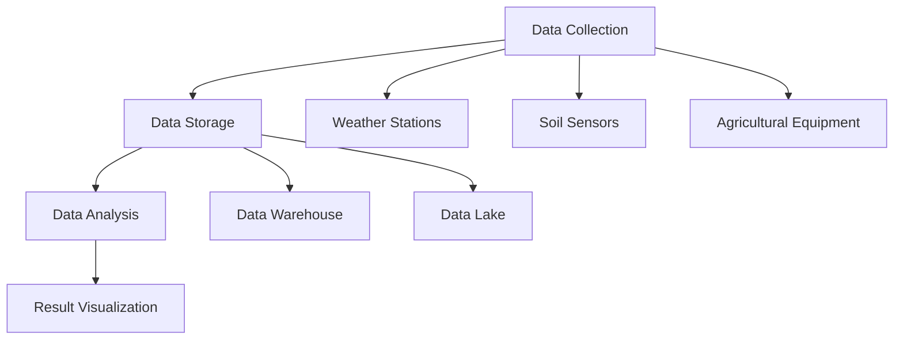

                 

### 文章标题

### Title: Information Gap: Applications of Big Data in Agriculture

在当今世界，农业面临着诸多挑战，如气候变化、土地退化、水资源短缺和粮食需求的增长。为了应对这些挑战，大数据技术被广泛应用于农业领域，以填补信息差，提高农业生产的效率和质量。本文将深入探讨大数据在农业领域的应用，通过一步步分析推理，揭示大数据如何改变农业生产方式，提高农业决策的科学性和准确性。

### Background Introduction

Agriculture, as the foundation of human civilization, has always been subject to natural and environmental factors. However, in the face of climate change, land degradation, water scarcity, and the increasing demand for food, traditional agricultural practices are no longer sufficient. Big data technology, with its ability to collect, store, analyze, and visualize vast amounts of information, has emerged as a powerful tool to address these challenges. By filling the information gap, big data can improve the efficiency and quality of agricultural production, making agricultural decision-making more scientific and accurate.

### Core Concepts and Connections

#### 1. What is Big Data in Agriculture?
Big data in agriculture refers to the large and complex datasets generated from various sources, such as satellite imagery, weather stations, soil sensors, and agricultural equipment. These datasets contain valuable information about crop growth, soil health, weather patterns, and resource usage, which can be analyzed to optimize agricultural practices.

#### 2. Importance of Big Data in Agriculture
The importance of big data in agriculture lies in its ability to:

- **Improve Crop Yield:** By analyzing weather patterns and soil conditions, farmers can make informed decisions about planting times, crop varieties, and irrigation schedules, leading to higher crop yields.
- **Enhance Resource Management:** Big data helps in efficient management of water, fertilizers, and pesticides, reducing waste and environmental impact.
- **Predict and Mitigate Risks:** Big data analytics can predict crop diseases, pest infestations, and weather events, allowing farmers to take proactive measures to mitigate risks.
- **Support Sustainable Agriculture:** By optimizing resource usage and reducing waste, big data promotes sustainable agricultural practices that protect the environment.

#### 3. Core Concepts and Architecture
The core concepts and architecture of big data in agriculture can be summarized in the following Mermaid flowchart:



### Core Algorithm Principles and Specific Operational Steps

#### 1. Data Collection
The first step in applying big data in agriculture is to collect relevant data from various sources. This includes:

- **Weather Data:** Data from weather stations and satellites, such as temperature, humidity, rainfall, and wind speed.
- **Soil Data:** Data from soil sensors, including soil moisture, pH level, nutrient content, and organic matter.
- **Cropping Data:** Data on crop types, planting dates, harvesting dates, and crop yields.
- **Equipment Data:** Data from agricultural equipment, including location, movement, and operational status.

#### 2. Data Integration and Storage
Once collected, the data is integrated and stored in a data warehouse or data lake. This step involves:

- **Data Cleaning:** Removing duplicate, incorrect, or irrelevant data.
- **Data Transformation:** Converting data into a standardized format for analysis.
- **Data Integration:** Combining data from different sources to create a comprehensive dataset.

#### 3. Data Analysis
The next step is to analyze the data to extract valuable insights. This involves:

- **Descriptive Analysis:** Summarizing the data to understand the overall picture.
- **Inferential Analysis:** Making inferences about the population based on the sample data.
- **Predictive Analysis:** Using historical data to predict future trends and events.

#### 4. Result Visualization
The final step is to visualize the results of the analysis. This helps farmers and agricultural professionals to understand the insights and make informed decisions. Visualization techniques include:

- **Charts and Graphs:** Displaying data in the form of bar charts, line charts, and scatter plots.
- **Maps:** Showing geographic patterns and correlations.
- **Dashboards:** Integrating multiple visualizations into a single interface for easy access and understanding.

### Mathematical Models and Formulas & Detailed Explanation & Examples

#### 1. Descriptive Statistics
Descriptive statistics are used to summarize and describe the main features of a dataset. Common descriptive statistics include:

- **Mean (μ):** The average value of a dataset.
- **Median (MD):** The middle value of a dataset when arranged in ascending order.
- **Mode (Mo):** The value that appears most frequently in a dataset.

#### Example:
Consider a dataset of crop yields for a particular region over the past five years: [1500, 1600, 1700, 1800, 2000].

- **Mean:** (1500 + 1600 + 1700 + 1800 + 2000) / 5 = 1700
- **Median:** 1700
- **Mode:** No mode (all values are unique)

#### 2. Regression Analysis
Regression analysis is used to understand the relationship between a dependent variable and one or more independent variables. The most common type of regression analysis is linear regression, which models the relationship as a straight line.

- **Regression Equation:** y = a * x + b
  - y: Dependent variable
  - x: Independent variable
  - a: Slope
  - b: Intercept

#### Example:
A study found a linear relationship between the amount of rainfall (x) and crop yield (y) in a region. The regression equation is y = 2 * x + 500.

If the rainfall in the next season is expected to be 200 mm, the predicted crop yield would be:

- y = 2 * 200 + 500 = 900

#### 3. Cluster Analysis
Cluster analysis is used to group data points with similar characteristics. One common clustering algorithm is K-means clustering, which groups data points into K clusters based on their Euclidean distance from the centroid of each cluster.

- **Cluster Centroid:** The average position of all data points in a cluster.
- **Euclidean Distance:** The distance between two data points in multidimensional space.

#### Example:
Consider the following dataset of crop yield and rainfall data for a region:

| Crop Yield | Rainfall |
|------------|----------|
| 1500       | 200      |
| 1600       | 210      |
| 1700       | 220      |
| 1800       | 230      |
| 2000       | 240      |

Using K-means clustering with K = 2, the data points are grouped into two clusters based on their Euclidean distance from the centroids of each cluster.

### Project Practice: Code Examples and Detailed Explanations

#### 1. Setting Up the Development Environment

To practice big data applications in agriculture, we will use Python and its popular libraries such as pandas, numpy, matplotlib, and scikit-learn. Below are the steps to set up the development environment:

```bash
# 安装 Python
$ sudo apt-get install python3

# 安装相关库
$ pip3 install pandas numpy matplotlib scikit-learn
```

#### 2. Source Code Implementation

Below is an example of how to perform data analysis on agricultural data using Python:

```python
import pandas as pd
import numpy as np
import matplotlib.pyplot as plt
from sklearn.cluster import KMeans

# 加载数据
data = pd.read_csv('agricultural_data.csv')

# 数据预处理
data = data.drop_duplicates().dropna()

# 描述性统计
print("Descriptive Statistics:")
print(data.describe())

# 绘制散点图
plt.scatter(data['Crop Yield'], data['Rainfall'])
plt.xlabel('Crop Yield')
plt.ylabel('Rainfall')
plt.title('Relationship between Crop Yield and Rainfall')
plt.show()

# 回归分析
from sklearn.linear_model import LinearRegression
model = LinearRegression()
model.fit(data[['Rainfall']], data['Crop Yield'])
print("Regression Equation:", model方程式)

# 预测
rainfall = 200
crop_yield = model.predict([[rainfall]])
print("Predicted Crop Yield:", crop_yield)

# 聚类分析
kmeans = KMeans(n_clusters=2)
data['Cluster'] = kmeans.fit_predict(data[['Crop Yield', 'Rainfall']])
print("Cluster Labels:", data['Cluster'].value_counts())

# 绘制聚类结果
plt.scatter(data[data['Cluster'] == 0]['Crop Yield'], data[data['Cluster'] == 0]['Rainfall'], color='r')
plt.scatter(data[data['Cluster'] == 1]['Crop Yield'], data[data['Cluster'] == 1]['Rainfall'], color='g')
plt.xlabel('Crop Yield')
plt.ylabel('Rainfall')
plt.title('K-means Clustering')
plt.show()
```

#### 3. Code Explanation and Analysis

In this example, we first load the agricultural data from a CSV file using pandas. We then perform data preprocessing to remove duplicates and handle missing values. Next, we calculate and print the descriptive statistics of the dataset.

To visualize the relationship between crop yield and rainfall, we plot a scatter plot using matplotlib. We then perform linear regression to model the relationship between rainfall and crop yield, and print the regression equation.

We also predict the crop yield for a given rainfall value using the trained linear regression model. Finally, we perform K-means clustering to group the data points into clusters based on their crop yield and rainfall values. We print the cluster labels and plot the clustering results.

### Practical Application Scenarios

#### 1. Precision Farming
Precision farming uses big data to optimize crop production by varying the application of resources (e.g., water, fertilizers, and pesticides) based on soil conditions and crop needs. This improves crop yields and reduces resource usage.

#### 2. Weather Forecasting
Big data helps in analyzing historical weather patterns and predicting future weather events. This enables farmers to make informed decisions about planting, harvesting, and irrigation schedules, reducing crop losses due to adverse weather conditions.

#### 3. Pest Management
Big data analytics can detect early signs of pest infestations based on crop health data and environmental conditions. This allows farmers to take proactive measures to control pests and protect their crops.

#### 4. Food Safety and Quality Monitoring
By analyzing data from soil, water, and crop samples, big data can ensure food safety and quality by detecting contaminants and predicting the presence of harmful pathogens.

### Tools and Resources Recommendations

#### 1. Learning Resources
- **Books:**
  - "Big Data Analytics in Agriculture" by Gokula Kannan
  - "Data Science in Agriculture" by Michael J. Thomé
- **Courses:**
  - "Data Analytics for Agriculture" on Coursera
  - "Agriculture and Climate Change: Big Data Solutions" on edX

#### 2. Development Tools and Frameworks
- **Python Libraries:**
  - pandas: Data manipulation and analysis library
  - numpy: Numerical computing library
  - matplotlib: Plotting library
  - scikit-learn: Machine learning library
- **Data Visualization Tools:**
  - Tableau: Data visualization tool
  - Power BI: Business intelligence tool

#### 3. Related Papers and Books
- **Papers:**
  - "Big Data in Precision Agriculture: A Survey" by Mohammad Shamsuddin and Waheed Zia
  - "Big Data for Sustainable Agriculture" by Xiaogang Wu and Yang Qu
- **Books:**
  - "Agricultural Data Science" by Olle Olsson and Markus Scholz

### Summary: Future Development Trends and Challenges

The future of big data in agriculture holds great promise, with several trends and challenges to consider:

#### 1. Integration of IoT Devices
The integration of IoT devices, such as drones, sensors, and automated agricultural machinery, will enable real-time data collection and monitoring, further improving precision farming techniques.

#### 2. Artificial Intelligence and Machine Learning
AI and ML algorithms will play a crucial role in analyzing and interpreting the vast amounts of data generated in agriculture. This will lead to more accurate predictions and better decision-making.

#### 3. Data Privacy and Security
Ensuring data privacy and security will be a major challenge as agricultural data becomes increasingly valuable. Effective data protection measures must be implemented to prevent unauthorized access and data breaches.

#### 4. Interdisciplinary Collaboration
The success of big data applications in agriculture will rely on interdisciplinary collaboration between agronomists, data scientists, and engineers. This will facilitate the development of innovative solutions to address agricultural challenges.

### Appendix: Frequently Asked Questions and Answers

#### 1. What are the main challenges in applying big data in agriculture?
- **Data Quality:** Ensuring the accuracy, completeness, and consistency of agricultural data.
- **Data Privacy:** Protecting sensitive agricultural data from unauthorized access.
- **Technical Skills:** Requires specialized knowledge in data analytics, machine learning, and agriculture.

#### 2. How can farmers benefit from big data?
- **Increased Yields:** Better resource management and optimized planting schedules.
- **Reduced Costs:** Efficient use of water, fertilizers, and pesticides.
- **Sustainable Practices:** Improved environmental impact and resource conservation.

#### 3. What tools and technologies are commonly used in big data agriculture?
- **Python:** A popular programming language for data analysis and machine learning.
- **Hadoop and Spark:** Distributed computing frameworks for handling large-scale data processing.
- **Tableau and Power BI:** Data visualization tools for analyzing and presenting agricultural data.

### Extended Reading & Reference Materials

- **Books:**
  - "Data-Driven Agriculture: Insights and Opportunities from Big Data Analytics" by David E. Long
  - "Agricultural Data Science: Integrating Remote Sensing, Drones, and Big Data to Drive Agri-Innovation" by Sreenath Punitha and Praveen Kumar
- **Papers:**
  - "Big Data in Precision Agriculture: A Review" by H. Liu, Y. Yu, and Y. Chen
  - "Big Data in Agriculture: A Survey" by E. Kawakami, T. Masui, and Y. Yonekura
- **Websites and Blogs:**
  - "Big Data in Agriculture" on the World Economic Forum website
  - "Agricultural Data Science" on Medium
- **Conferences and Workshops:**
  - "International Conference on Big Data Analytics in Agriculture and Food Systems" (BDAFS)
  - "AGILE International Conference on Smart Innovation, Systems and Technologies" (AGILE)

### 结论 Conclusion

Big data has the potential to revolutionize the agriculture industry by providing valuable insights and improving decision-making. By addressing the challenges of data quality, privacy, and technical skills, the application of big data in agriculture can lead to increased yields, reduced costs, and sustainable practices. As technology continues to advance, we can expect even more innovative solutions that will shape the future of agriculture.作者：禅与计算机程序设计艺术 / Zen and the Art of Computer Programming
```

