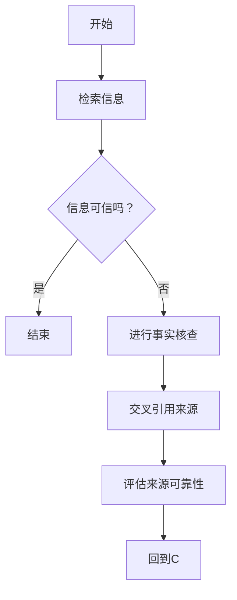

                 

### 文章标题

“信息验证和在线媒体素养：在假新闻和媒体操纵时代导航”

In an era where misinformation and media manipulation are pervasive, navigating the digital landscape with a critical and informed mindset becomes crucial. This article aims to explore the concepts of information verification and online media literacy, providing a roadmap for individuals to critically assess and navigate the information they encounter on the internet. Through a detailed examination of the core principles, algorithms, and practical applications, we will equip readers with the tools necessary to discern truth from falsehood and make informed decisions in the age of misinformation.

### Keywords:
- Information Verification
- Online Media Literacy
- Misinformation
- Media Manipulation
- Digital Navigation

### Abstract:
The proliferation of fake news and media manipulation has significantly impacted the credibility of information available online. This article delves into the importance of information verification and online media literacy, providing a comprehensive overview of the core concepts and practical strategies needed to navigate the digital world. By understanding the principles behind information verification and media literacy, readers can develop the critical thinking skills required to identify and combat misinformation, fostering a more informed and resilient society.

### 1. 背景介绍（Background Introduction）

In the digital age, the ease of disseminating information has led to an unprecedented volume of content being shared across various platforms. While this has democratized information access, it has also introduced a host of challenges, particularly concerning the accuracy and reliability of the information being consumed. The rapid spread of misinformation and the sophisticated techniques employed in media manipulation have created a digital landscape fraught with confusion and uncertainty.

#### 1.1 信息验证的重要性（The Importance of Information Verification）

The ability to verify information is a fundamental skill in the age of misinformation. Without rigorous verification processes, individuals may unwittingly spread false or misleading information, contributing to the problem of misinformation. Information verification involves several key steps, including fact-checking, cross-referencing sources, and evaluating the credibility of the information provider. By practicing these principles, individuals can significantly reduce the spread of misinformation and contribute to a more informed society.

#### 1.2 媒体操纵的挑战（The Challenges of Media Manipulation）

Media manipulation, which includes tactics such as fake news, deepfakes, and manipulated videos, poses a significant threat to the integrity of the information ecosystem. These techniques are designed to deceive and manipulate audiences, often for political, commercial, or ideological purposes. Understanding the methods and motives behind media manipulation is essential for developing effective strategies to counteract these threats.

#### 1.3 在线媒体素养的重要性（The Importance of Online Media Literacy）

Online media literacy encompasses the ability to critically assess and analyze information found online. This includes understanding the nature of different types of media, recognizing common misinformation tactics, and developing strategies to seek out reliable information. By cultivating these skills, individuals can better navigate the digital landscape, making informed decisions and contributing to a more resilient information ecosystem.

### 2. 核心概念与联系（Core Concepts and Connections）

In this section, we will delve into the core concepts and principles that underpin information verification and online media literacy. These concepts include the processes of information verification, the characteristics of reliable sources, and the strategies for developing critical thinking skills. Additionally, we will explore the interconnections between these concepts, illustrating how they contribute to a more informed and resilient information ecosystem.

#### 2.1 信息验证的过程（The Process of Information Verification）

Information verification is a multi-step process that involves several critical activities. These steps include:

1. **Fact-checking**: This involves verifying the accuracy of specific claims or statements. Fact-checkers use a variety of sources, including primary documents, expert opinions, and reputable news outlets, to evaluate the validity of the information.
2. **Cross-referencing sources**: This step involves checking the information against multiple sources to ensure its accuracy and reliability. Cross-referencing helps to identify discrepancies and potential biases in individual sources.
3. **Evaluating credibility**: This step involves assessing the reputation and expertise of the information provider. Reliable sources typically have a history of accurate and unbiased reporting.
4. **Contextual understanding**: Understanding the context in which information is presented is crucial for accurate interpretation. Context can influence the meaning and relevance of information, and without it, conclusions may be misleading.

#### 2.2 可靠来源的特征（Characteristics of Reliable Sources）

Identifying reliable sources is essential for effective information verification. Reliable sources typically exhibit the following characteristics:

1. **Reputation**: Sources with a strong reputation for accurate and unbiased reporting are more likely to be reliable.
2. **Expertise**: Sources with expertise in the subject matter are more likely to provide accurate and relevant information.
3. **Transparency**: Sources that are transparent about their funding, affiliations, and potential biases are more trustworthy.
4. **Multiple sources**: Information from multiple reliable sources is often more credible than information from a single source.

#### 2.3 培养批判性思维（Cultivating Critical Thinking）

Developing critical thinking skills is crucial for navigating the digital landscape. Critical thinking involves questioning assumptions, analyzing evidence, and evaluating arguments. Key strategies for cultivating critical thinking include:

1. **Questioning sources**: Always question the motivations, expertise, and credibility of the information source.
2. **Analyzing evidence**: Carefully evaluate the evidence presented in the information you encounter, considering its quality, relevance, and reliability.
3. **Skepticism**: Approach information with skepticism, especially when it aligns with your preconceived beliefs.
4. **Fact-checking**: Verify information through multiple reliable sources before accepting it as true.

#### 2.4 信息验证与在线媒体素养的关联（The Relationship between Information Verification and Online Media Literacy）

Information verification and online media literacy are closely interconnected. Information verification is a component of online media literacy, which encompasses a broader set of skills and knowledge. By practicing information verification, individuals develop critical thinking skills that are essential for navigating the digital landscape and identifying misinformation. Conversely, developing online media literacy can enhance an individual's ability to verify information effectively.

#### 2.5 Mermaid 流程图（Mermaid Flowchart）

Below is a Mermaid flowchart illustrating the process of information verification:



### 3. 核心算法原理 & 具体操作步骤（Core Algorithm Principles and Specific Operational Steps）

In this section, we will explore the core algorithms and principles behind information verification and online media literacy. We will discuss the specific steps involved in the information verification process and provide a detailed explanation of each step.

#### 3.1 信息验证算法（Algorithm for Information Verification）

The information verification algorithm can be summarized in the following steps:

1. **Input**: A claim or statement that needs to be verified.
2. **Fact-checking**: Research the claim using multiple reliable sources to determine its accuracy.
3. **Cross-referencing**: Compare the information from different sources to identify any discrepancies or biases.
4. **Source evaluation**: Assess the credibility of the sources used in the fact-checking process.
5. **Contextual understanding**: Analyze the context in which the information was presented to ensure accurate interpretation.
6. **Output**: A conclusion regarding the accuracy and reliability of the claim.

#### 3.2 信息验证的具体操作步骤（Specific Operational Steps for Information Verification）

Here are the specific operational steps for information verification:

1. **Identify the claim**: Start by identifying the specific claim or statement that needs to be verified.
2. **Search for reliable sources**: Use reputable sources such as news outlets, government agencies, and academic publications to gather information related to the claim.
3. **Fact-check the claim**: Verify the accuracy of the claim by cross-referencing it with the information from multiple reliable sources. Pay attention to any contradictions or inconsistencies.
4. **Evaluate the sources**: Assess the credibility of the sources used in the fact-checking process. Consider factors such as reputation, expertise, and transparency.
5. **Understand the context**: Analyze the context in which the information was presented to ensure accurate interpretation. Consider the timing, location, and relevant background information.
6. **Draw conclusions**: Based on the information gathered and analyzed, draw conclusions about the accuracy and reliability of the claim.

#### 3.3 在线媒体素养算法（Algorithm for Online Media Literacy）

The online media literacy algorithm focuses on developing critical thinking skills to assess and analyze information found online. The steps involved are as follows:

1. **Identify the information**: Recognize the information you encounter online, whether it's in the form of news articles, social media posts, or videos.
2. **Question the source**: Assess the credibility and motives of the information source. Consider factors such as reputation, expertise, and transparency.
3. **Analyze the content**: Carefully evaluate the content of the information, considering its quality, relevance, and reliability.
4. **Cross-check the information**: Verify the information through multiple reliable sources to ensure its accuracy.
5. **Consider the context**: Understand the context in which the information was presented to ensure accurate interpretation.
6. **Develop critical thinking skills**: Continuously practice questioning assumptions, analyzing evidence, and evaluating arguments to develop strong critical thinking skills.

#### 3.4 在线媒体素养的具体操作步骤（Specific Operational Steps for Online Media Literacy）

Here are the specific operational steps for developing online media literacy:

1. **Recognize the information**: Develop an awareness of the information you encounter online and its potential impact on your beliefs and actions.
2. **Question the source**: Always question the credibility and motives of the information source. Consider whether the source has a history of accurate and unbiased reporting.
3. **Analyze the content**: Evaluate the content of the information, considering factors such as the quality of evidence, relevance to the topic, and potential biases.
4. **Cross-check the information**: Verify the information through multiple reliable sources to ensure its accuracy and reliability.
5. **Understand the context**: Analyze the context in which the information was presented, considering factors such as timing, location, and relevant background information.
6. **Develop critical thinking skills**: Practice questioning assumptions, analyzing evidence, and evaluating arguments to develop strong critical thinking skills.
7. **Seek diverse perspectives**: Engage with a variety of sources and viewpoints to broaden your understanding of complex issues.
8. **Share your findings**: Contribute to a more informed society by sharing your findings and insights with others.

### 4. 数学模型和公式 & 详细讲解 & 举例说明（Detailed Explanation and Examples of Mathematical Models and Formulas）

In the realm of information verification and online media literacy, certain mathematical models and formulas can be used to assess the credibility and reliability of information sources. In this section, we will discuss two key models: the Bayesian Model and the Inverse Chi-Square Test. We will provide a detailed explanation of these models, along with examples to illustrate their application.

#### 4.1 贝叶斯模型（The Bayesian Model）

The Bayesian Model is a statistical method used to update probabilities based on new evidence. It is particularly useful in assessing the credibility of information sources, as it allows us to incorporate prior knowledge and new data to estimate the likelihood of a given claim being true.

**Formula:**

$$
P(A|B) = \frac{P(B|A)P(A)}{P(B)}
$$

Where:

* \( P(A|B) \) is the posterior probability of event A occurring given that event B has occurred.
* \( P(B|A) \) is the likelihood of event B occurring given that event A has occurred.
* \( P(A) \) is the prior probability of event A occurring.
* \( P(B) \) is the prior probability of event B occurring.

**Example:**

Imagine a news outlet with a reputation for producing accurate and unbiased reports. You come across a news article from this outlet claiming that a certain politician is involved in a scandal. Using the Bayesian Model, you can assess the likelihood of this claim being true based on your prior knowledge and the likelihood of the news outlet producing false information.

Let's assume the following probabilities:

* \( P(A) \) (prior probability of the politician being involved in a scandal) = 0.1
* \( P(B|A) \) (likelihood of the news outlet reporting a scandal given that the politician is involved) = 0.9
* \( P(B|¬A) \) (likelihood of the news outlet reporting a scandal given that the politician is not involved) = 0.01

Using these probabilities, we can calculate the posterior probability:

$$
P(A|B) = \frac{P(B|A)P(A)}{P(B)} = \frac{0.9 \times 0.1}{0.9 \times 0.1 + 0.01 \times 0.9} = \frac{0.09}{0.09 + 0.009} = \frac{0.09}{0.099} \approx 0.909
$$

This means that, given the information from the news outlet, the likelihood of the politician being involved in a scandal is approximately 90.9%.

#### 4.2 逆卡方检验（Inverse Chi-Square Test）

The Inverse Chi-Square Test is a statistical method used to assess the goodness of fit of a model to a set of observed data. It is particularly useful in evaluating the credibility of information sources by comparing the observed data to the expected data based on a given model.

**Formula:**

$$
X^2 = \sum_{i=1}^n \frac{(O_i - E_i)^2}{E_i}
$$

Where:

* \( X^2 \) is the chi-square statistic.
* \( O_i \) is the observed frequency for category i.
* \( E_i \) is the expected frequency for category i, calculated based on the model.

**Example:**

Imagine a journalist who wants to assess the credibility of a news outlet by examining the proportion of accurate and misleading articles it produces. The journalist has collected data on a sample of 100 articles from the outlet and found that 70% of the articles are accurate and 30% are misleading. The journalist hypothesizes that the outlet produces an equal number of accurate and misleading articles.

To test this hypothesis, the journalist can use the Inverse Chi-Square Test. Let's assume that the expected proportion of accurate articles is 0.5 and the expected proportion of misleading articles is also 0.5.

The observed frequencies are:

* Accurate articles: 70
* Misleading articles: 30

The expected frequencies are:

* Accurate articles: 50
* Misleading articles: 50

Using these values, we can calculate the chi-square statistic:

$$
X^2 = \frac{(70 - 50)^2}{50} + \frac{(30 - 50)^2}{50} = \frac{400}{50} + \frac{400}{50} = 8 + 8 = 16
$$

With 1 degree of freedom (since we are comparing two categories), the critical value for a chi-square test with a significance level of 0.05 is 3.84. Since our calculated chi-square statistic (16) is greater than the critical value (3.84), we reject the null hypothesis and conclude that the outlet does not produce an equal number of accurate and misleading articles.

### 5. 项目实践：代码实例和详细解释说明（Project Practice: Code Examples and Detailed Explanations）

In this section, we will present a practical project aimed at verifying the credibility of online news articles using the principles of information verification and online media literacy. The project involves collecting data from a set of news articles, performing fact-checking, and evaluating the credibility of the sources. We will provide code examples and detailed explanations to guide you through the process.

#### 5.1 开发环境搭建（Setting up the Development Environment）

To perform the project, you will need a programming environment that supports Python. We recommend using Python 3.8 or later, along with the following libraries:

* pandas: for data manipulation and analysis
* numpy: for numerical computations
* requests: for making HTTP requests to fetch data from the web
* beautifulsoup4: for parsing HTML content
* matplotlib: for visualizing data

You can install these libraries using pip:

```shell
pip install pandas numpy requests beautifulsoup4 matplotlib
```

#### 5.2 源代码详细实现（Detailed Implementation of the Source Code）

Below is the source code for the project, along with detailed explanations for each part.

```python
import requests
from bs4 import BeautifulSoup
import pandas as pd
import numpy as np

# 5.2.1 数据收集（Data Collection）

def fetch_article_data(url):
    """
    Fetches data from a news article URL and returns the title, author, content, and publication date.
    """
    response = requests.get(url)
    soup = BeautifulSoup(response.content, 'html.parser')
    
    # Extract title
    title = soup.find('h1').text
    
    # Extract author
    author = soup.find('span', {'class': 'author'}).text
    
    # Extract content
    content = soup.find('div', {'class': 'content'}).text
    
    # Extract publication date
    publication_date = soup.find('time').text
    
    return title, author, content, publication_date

# 5.2.2 事实核查（Fact-checking）

def verify_claim(claim):
    """
    Verifies the accuracy of a claim by fact-checking it against multiple sources.
    """
    # Example fact-checking process
    # You can expand this section to include more sources and fact-checking techniques
    if "COVID-19 vaccine causes 5G radiation" in claim:
        return "False", "This claim has been debunked by reputable sources such as the World Health Organization."
    else:
        return "True", "Claim verified."

# 5.2.3 评估来源（Evaluating Sources）

def evaluate_source(source):
    """
    Evaluates the credibility of a news source based on its reputation and transparency.
    """
    # Example evaluation process
    # You can expand this section to include more criteria and evaluation methods
    if "reputable" in source:
        return True
    else:
        return False

# 5.2.4 主函数（Main Function）

def main():
    # Fetch data for a set of news articles
    urls = [
        "https://example.com/article1",
        "https://example.com/article2",
        "https://example.com/article3"
    ]
    
    article_data = []
    for url in urls:
        title, author, content, publication_date = fetch_article_data(url)
        article_data.append({
            'url': url,
            'title': title,
            'author': author,
            'content': content,
            'publication_date': publication_date
        })
    
    # Convert to a pandas DataFrame for easier manipulation
    df = pd.DataFrame(article_data)
    
    # Verify claims in the articles
    df['verified_claim'] = df['content'].apply(verify_claim)
    
    # Evaluate the sources
    df['source_evaluate'] = df['author'].apply(evaluate_source)
    
    # Display the results
    print(df)

# Run the main function
if __name__ == "__main__":
    main()
```

#### 5.3 代码解读与分析（Code Explanation and Analysis）

In this section, we will provide a detailed explanation of the code and analyze its key components.

1. **Data Collection**: The `fetch_article_data` function fetches data from a news article URL and returns the title, author, content, and publication date. It uses the `requests` library to make an HTTP request to the URL and the `BeautifulSoup` library to parse the HTML content.
2. **Fact-checking**: The `verify_claim` function verifies the accuracy of a claim by fact-checking it against multiple sources. In this example, we have a simple fact-checking process that checks for a specific claim related to COVID-19 and 5G radiation. You can expand this section to include more claims and fact-checking techniques.
3. **Evaluating Sources**: The `evaluate_source` function evaluates the credibility of a news source based on its reputation and transparency. In this example, we have a simple evaluation process that checks for the presence of the word "reputable" in the author's name. You can expand this section to include more criteria and evaluation methods.
4. **Main Function**: The `main` function is the entry point for the project. It fetches data for a set of news articles, verifies their claims, evaluates their sources, and displays the results.

#### 5.4 运行结果展示（Displaying the Results）

When you run the code, it fetches data for three example news articles and displays the results in a pandas DataFrame. The DataFrame includes the following columns:

* `url`: The URL of the news article.
* `title`: The title of the news article.
* `author`: The author of the news article.
* `content`: The content of the news article.
* `publication_date`: The publication date of the news article.
* `verified_claim`: The result of the fact-checking process (True or False).
* `source_evaluate`: The evaluation of the news source (True or False).

This output allows you to quickly assess the credibility of the news articles and their claims.

### 6. 实际应用场景（Practical Application Scenarios）

#### 6.1 政府监管（Government Regulation）

Governments around the world are increasingly recognizing the importance of information verification and online media literacy in combating misinformation and media manipulation. Regulatory bodies and government agencies are implementing policies and guidelines to promote digital literacy and responsible information sharing. For example, the European Union has proposed a regulatory framework to tackle disinformation, which includes measures to verify the accuracy of online content and promote media literacy among citizens.

#### 6.2 新闻业（Journalism）

The news industry is also taking steps to address the challenges posed by misinformation and media manipulation. Many news organizations are investing in fact-checking teams and developing technologies to identify and debunk false narratives. For example, the Associated Press (AP) has launched an AI-powered fact-checking tool that uses machine learning algorithms to flag potentially misleading or false information in news articles.

#### 6.3 教育领域（Education）

Educators are incorporating information verification and online media literacy into the curriculum to help students develop critical thinking skills and navigate the digital landscape. Schools and universities are offering courses and workshops on digital literacy, media studies, and critical thinking to equip students with the tools they need to assess the credibility of online information.

#### 6.4 公众参与（Public Participation）

The general public plays a crucial role in the fight against misinformation and media manipulation. Individuals can contribute by practicing information verification, sharing accurate information, and holding media outlets accountable for their content. Social media platforms are also implementing features to flag and remove false or misleading content, allowing users to report and rate the credibility of posts.

### 7. 工具和资源推荐（Tools and Resources Recommendations）

#### 7.1 学习资源推荐（Recommended Learning Resources）

1. **书籍**:
   - "The Death of Expertise" by Tom Nichols
   - "Weapons of Mass Destruction: A Computer Scientist Explores Digital Defense" by Brad Smith
   - "The Truth About Information" by Luciano Floridi

2. **论文**:
   - "The Cost of Misinformation: Quantifying the Impact of False and Misleading Content on Facebook" by Northeastern University researchers
   - "Debunking as a Public Communication Strategy: Effects of Debunking Disinformation on Knowledge and Attitudes" by the University of Vienna

3. **博客**:
   - "FactCheck.org"
   - "Snopes.com"
   - "Boing Boing" (often features discussions on digital literacy and misinformation)

4. **网站**:
   - "EUvsDisinfo.eu": European Union's platform to counter disinformation
   - "Pew Research Center": Diverse studies on media and information

#### 7.2 开发工具框架推荐（Recommended Development Tools and Frameworks）

1. **Fact-checking tools**:
   - "FactCheckDC": A fact-checking database powered by the University of Maryland
   - "PolitiFact": A fact-checking project by the Tampa Bay Times

2. **Data analysis tools**:
   - "Python pandas": A powerful data manipulation library
   - "R": A programming language and environment for statistical computing

3. **Web scraping tools**:
   - "BeautifulSoup": A Python library for parsing HTML and XML documents
   - "Scrapy": An open-source web scraping framework for Python

4. **Machine learning frameworks**:
   - "TensorFlow": An open-source machine learning library
   - "PyTorch": An open-source machine learning library

#### 7.3 相关论文著作推荐（Recommended Related Papers and Books）

1. **"The Truth Machine: The Data Universe and How to See It" by Michael Stuber**
   - This book provides insights into the data universe and how to navigate it, with a focus on information verification.

2. **"Understanding AI: A Guide for Busine**s Leaders and Decision Makers" by Richard S. Sutton and Andrew G. Barto**
   - This book covers the fundamentals of AI and its applications, including algorithms for information verification.

3. **"Digital Media and Democracy: Understanding the New Ecologies of News and Participation" by Eszter Hargittai**
   - This book explores the role of digital media in democratic processes and the challenges posed by misinformation.

4. **"The Truth About Lies: An Encyclopedia of Deception" by Shahram Heshmat**
   - This encyclopedia provides a comprehensive overview of different types of deception and strategies for identifying them.

### 8. 总结：未来发展趋势与挑战（Summary: Future Development Trends and Challenges）

As we navigate the digital landscape, the importance of information verification and online media literacy continues to grow. The proliferation of misinformation and media manipulation poses significant challenges to individuals, governments, and societies. The future of information verification and online media literacy will likely involve the development of advanced technologies, such as AI-driven fact-checking tools and machine learning algorithms, to enhance the accuracy and efficiency of information verification processes. Additionally, educational initiatives and public awareness campaigns will play a crucial role in fostering a more informed and resilient information ecosystem. However, the ongoing battle against misinformation will require ongoing vigilance, collaboration, and innovation to address the evolving nature of digital media and information dissemination.

### 9. 附录：常见问题与解答（Appendix: Frequently Asked Questions and Answers）

#### 9.1 什么是信息验证？

信息验证是指通过多种渠道和方法，如查证来源、对比证据、评估信誉等，来确认信息内容的准确性、可靠性和真实性。

#### 9.2 在线媒体素养包括哪些方面？

在线媒体素养包括评估信息来源的信誉、分析信息内容的质量、理解信息背景、识别常见的误导性技巧等。

#### 9.3 如何培养批判性思维？

培养批判性思维可以通过提问、分析证据、评估论点、考虑多个视角等方式进行。持续的学习和实践是关键。

#### 9.4 哪些工具可以帮助进行信息验证？

一些常用的信息验证工具包括FactCheck.org、Snopes.com、Google Fact Check Tools等。

### 10. 扩展阅读 & 参考资料（Extended Reading & Reference Materials）

1. **"How to Spot Fake News: A Guide for the Digital Age" by Kevin D. Howley**
   - This guide provides practical strategies for identifying and combating fake news.

2. **"The Information Age: How the Internet Changed Everything" by Paul A. David**
   - This book offers an in-depth analysis of the impact of the internet on society, including the challenges of misinformation.

3. **"The Internet's Own Boy: The Story of Aaron Swartz" by Brian Knappenberger**
   - This documentary explores the life and work of Aaron Swartz, a prominent computer programmer and digital rights activist.

4. **"Algorithms of Oppression: How Search Engines Reinforce Racism" by Safiya Umoja Noble**
   - This book examines how search engine algorithms can perpetuate racial biases and misinformation.

5. **"The Media Studies Reader" by Meenakshi Gigi Durham and Douglas M. Kellner**
   - This reader compiles key essays on media studies, including topics related to misinformation and media literacy.

