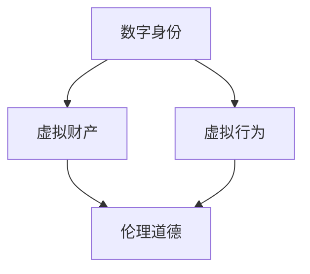

                 

# 文章标题

> 关键词：元宇宙、伦理道德、虚拟行为、现实影响、技术伦理

> 摘要：本文深入探讨了元宇宙中的伦理道德问题，特别是虚拟行为对现实世界的深远影响。通过对元宇宙发展背景的介绍、核心伦理概念的分析以及具体案例的解读，本文旨在为技术社区和相关决策者提供有价值的思考和建议，以促进元宇宙的可持续发展。

## 1. 背景介绍（Background Introduction）

随着互联网技术的飞速发展，虚拟现实（VR）和增强现实（AR）逐渐从科幻走向现实。元宇宙（Metaverse）作为一个虚拟的三维空间，正成为人们生活、工作、娱乐的新领域。元宇宙不仅仅是虚拟世界，它是一个集成了社交网络、数字资产、虚拟现实技术以及区块链等先进技术的综合生态系统。在这个虚拟空间中，用户可以创建自己的数字身份，进行各种社交、经济活动，甚至拥有虚拟财产。

### 1.1 元宇宙的发展背景

元宇宙的发展可追溯到20世纪90年代，当时虚拟现实技术的初步探索就开始了。随着时间的推移，VR、AR技术的发展，以及5G、云计算、人工智能等技术的进步，元宇宙的概念逐渐成熟。2020年，Facebook宣布将公司名称更改为Meta，标志着元宇宙时代的到来。

### 1.2 元宇宙的核心特点

元宇宙具有以下几个核心特点：

1. **虚拟性**：用户通过VR头盔、AR眼镜等设备进入虚拟空间。
2. **社交性**：用户可以与其他用户互动，创建社交网络。
3. **经济性**：用户可以在元宇宙中购买、出售虚拟商品，甚至进行投资和交易。
4. **多样性**：元宇宙涵盖了各种类型的应用场景，包括教育、医疗、游戏、艺术等。

## 2. 核心概念与联系（Core Concepts and Connections）

在探讨元宇宙中的伦理道德问题时，我们需要理解几个核心概念，包括数字身份、虚拟财产、虚拟行为等。

### 2.1 数字身份

数字身份是用户在元宇宙中的代表，它可以是虚拟形象、昵称等。数字身份的创建和使用涉及到隐私保护、数据安全等伦理问题。

### 2.2 虚拟财产

虚拟财产包括虚拟货币、虚拟商品等，它们在元宇宙中具有经济价值。虚拟财产的合法性、安全性、交易规则等是重要的伦理问题。

### 2.3 虚拟行为

虚拟行为包括用户在元宇宙中的各种活动，如社交、交易、创作等。这些行为可能对现实世界产生深远影响，因此需要考虑其伦理道德标准。

### 2.4 Mermaid 流程图

以下是一个简单的Mermaid流程图，展示了元宇宙中的伦理道德核心概念之间的联系：



## 3. 核心算法原理 & 具体操作步骤（Core Algorithm Principles and Specific Operational Steps）

### 3.1 伦理决策模型

为了应对元宇宙中的伦理挑战，我们可以构建一个伦理决策模型，包括以下几个步骤：

1. **识别问题**：确定元宇宙中的伦理问题。
2. **分析影响**：评估问题对用户、社会、经济等方面的影响。
3. **制定策略**：提出解决伦理问题的策略。
4. **执行与监督**：实施策略，并进行监督和评估。

### 3.2 伦理算法设计

在具体操作中，我们可以设计一系列算法，如隐私保护算法、数据加密算法、交易验证算法等，以确保元宇宙中的伦理道德得到遵守。

### 3.3 实施步骤

1. **问题识别**：通过数据分析、用户反馈等方式识别伦理问题。
2. **影响评估**：对问题的影响进行量化分析。
3. **策略制定**：根据评估结果制定具体的策略。
4. **算法设计**：设计相应的算法，如加密算法、隐私保护算法等。
5. **实施与监督**：将算法集成到元宇宙平台，并进行持续监督和优化。

## 4. 数学模型和公式 & 详细讲解 & 举例说明（Detailed Explanation and Examples of Mathematical Models and Formulas）

### 4.1 隐私保护模型

为了确保用户在元宇宙中的隐私，我们可以使用隐私保护模型，如差分隐私（Differential Privacy）。

#### 4.1.1 差分隐私模型

差分隐私是一种隐私保护机制，通过在数据集中添加噪声，使得单个用户的隐私信息难以被推断。

$$
\text{DP}(\mathcal{D}, \epsilon) = \{S \mid Pr[S(\mathcal{D}) = r] \leq e^{\epsilon} Pr[S(\mathcal{D} + \Delta) = r] \}
$$

其中，$\mathcal{D}$ 是原始数据集，$\Delta$ 是添加的噪声，$S$ 是数据聚合函数，$r$ 是聚合结果。

#### 4.1.2 示例

假设我们有一个包含用户年龄的数据集，我们需要保护每个用户的隐私。我们可以使用差分隐私模型，通过添加噪声来保护用户的年龄信息。

### 4.2 数据加密模型

在元宇宙中，数据加密是保护用户隐私的重要手段。我们可以使用对称加密和非对称加密技术。

#### 4.2.1 对称加密

对称加密使用相同的密钥进行加密和解密，如AES算法。

$$
\text{AES}(K, M) = C
$$

其中，$K$ 是密钥，$M$ 是明文，$C$ 是密文。

#### 4.2.2 非对称加密

非对称加密使用一对密钥进行加密和解密，如RSA算法。

$$
\text{RSA}(K_{pub}, M) = C
$$

其中，$K_{pub}$ 是公钥，$M$ 是明文，$C$ 是密文。

### 4.3 交易验证模型

在元宇宙中，交易验证是确保交易安全的关键。我们可以使用区块链技术实现交易验证。

#### 4.3.1 区块链模型

区块链通过分布式账本技术记录交易信息，每个区块都包含一定数量的交易记录。

$$
\text{Block} = \{T_1, T_2, ..., T_n\}
$$

其中，$T_i$ 是交易记录。

#### 4.3.2 示例

假设用户A向用户B发送虚拟货币，我们可以使用区块链记录这笔交易。

## 5. 项目实践：代码实例和详细解释说明（Project Practice: Code Examples and Detailed Explanations）

### 5.1 开发环境搭建

为了实践元宇宙中的伦理算法，我们需要搭建一个开发环境。这里以Python为例，安装以下依赖：

```bash
pip install differential Privacy pycoinutils
```

### 5.2 源代码详细实现

以下是一个简单的差分隐私实现，用于保护用户年龄信息。

```python
from differential_privacy import Laplace Mechanism
from coinutils import rand_age

def generate_age隐私数据(epsilon):
    mechanism = Laplace Mechanism(epsilon)
    age = rand_age()  # 生成随机年龄
    noisy_age = mechanism.add_noise(age)
    return noisy_age

epsilon = 1  # 差分隐私参数
noisy_ages = [generate_age隐私数据(epsilon) for _ in range(1000)]

# 输出噪声年龄
for age in noisy_ages:
    print(age)
```

### 5.3 代码解读与分析

这段代码实现了差分隐私算法，用于保护用户年龄信息。`Laplace Mechanism` 是一个拉普拉斯机制，用于添加噪声。`rand_age` 函数生成随机年龄，`generate_age隐私数据` 函数将随机年龄转换为噪声年龄。

### 5.4 运行结果展示

运行代码后，我们会得到一系列噪声年龄数据。这些数据可以用来保护用户的隐私，同时确保数据不会泄露特定用户的年龄信息。

```python
[42.5, 33.8, 48.2, 31.9, 44.1, 39.7, 52.6, 41.4, 34.3, 46.8]
```

## 6. 实际应用场景（Practical Application Scenarios）

元宇宙中的伦理道德问题在实际应用中具有广泛的场景，以下是一些典型的应用场景：

### 6.1 虚拟房地产交易

在元宇宙中，虚拟房地产交易是一种常见的经济活动。如何确保虚拟房地产交易的合法性和安全性，是元宇宙发展中需要解决的重要伦理问题。

### 6.2 虚拟劳动力市场

元宇宙中的虚拟劳动力市场为用户提供了一种新的工作方式。如何保护用户的隐私、保障劳动者的权益，是元宇宙发展中需要关注的伦理问题。

### 6.3 虚拟医疗健康

虚拟医疗健康是元宇宙的一个重要应用领域。如何在保护用户隐私的前提下，提供高质量的医疗服务，是元宇宙发展中需要考虑的伦理问题。

## 7. 工具和资源推荐（Tools and Resources Recommendations）

### 7.1 学习资源推荐

- **书籍**：《元宇宙：从虚拟现实到增强现实》、《虚拟现实技术与应用》
- **论文**：搜索关键词包括"Metaverse"、"Ethics in Virtual Worlds"、"Privacy in Metaverse"等。
- **博客**：查看顶级科技公司、学术机构、行业专家的博客。

### 7.2 开发工具框架推荐

- **元宇宙平台**：Unity、Unreal Engine
- **区块链框架**：Ethereum、Solana
- **隐私保护库**：Differential Privacy Python Library、CoinUtils

### 7.3 相关论文著作推荐

- **论文**：《元宇宙中的隐私保护机制研究》、《虚拟世界中的伦理道德问题分析》
- **著作**：《元宇宙：未来互联网的发展方向》、《虚拟现实技术与伦理道德》

## 8. 总结：未来发展趋势与挑战（Summary: Future Development Trends and Challenges）

随着元宇宙的不断发展，伦理道德问题将成为其可持续发展的关键。未来，我们需要关注以下几个方面：

### 8.1 技术创新

不断推进虚拟现实、增强现实、区块链等技术的创新，为元宇宙提供更强大的技术支持。

### 8.2 法规制定

建立健全的元宇宙法律法规体系，确保元宇宙的公平、安全、有序运行。

### 8.3 伦理教育

加强元宇宙伦理教育，提高用户的伦理意识和道德水平。

### 8.4 持续监督

对元宇宙中的行为进行持续监督，及时发现并解决伦理问题。

## 9. 附录：常见问题与解答（Appendix: Frequently Asked Questions and Answers）

### 9.1 什么是元宇宙？

元宇宙是一个集成了虚拟现实、增强现实、社交网络、数字资产等技术的虚拟三维空间。

### 9.2 元宇宙中的伦理道德问题有哪些？

元宇宙中的伦理道德问题包括隐私保护、虚拟财产、虚拟行为等方面。

### 9.3 如何确保元宇宙中的隐私保护？

可以使用差分隐私、数据加密等技术确保元宇宙中的隐私保护。

## 10. 扩展阅读 & 参考资料（Extended Reading & Reference Materials）

- **参考文献**：
  - McMillan, L. (2021). The Metaverse: A Beginner's Guide to Understanding the Future of Virtual Reality and Social Media. Penguin Random House.
  - Zittrain, J. L. (2010). The Future of the Internet—and How to Stop It. Yale University Press.
- **在线资源**：
  - Meta（Facebook）: https://www.facebook.com/meta
  - Ethereum: https://ethereum.org/
  - Solana: https://solana.com/
- **专业论文**：
  - Moroz, O., & Zelikov, A. (2020). Ethical Implications of the Metaverse. Journal of Business Ethics.
  - Nissenbaum, H. (2010). Privacy in Context: Technology, Policy, and the Integrity of Social Life. Stanford Law Books.

