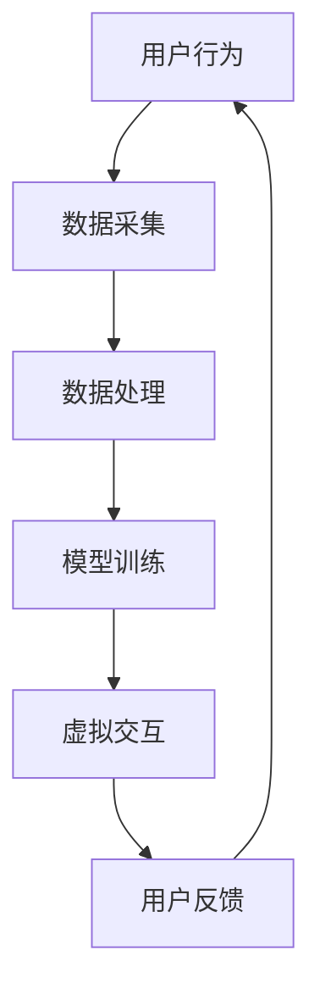

                 

# 文章标题：元宇宙大模型：虚拟现实世界的AI大脑

> 关键词：元宇宙，虚拟现实，人工智能，大模型，AI大脑，虚拟交互

> 摘要：本文将探讨元宇宙中的大模型，即虚拟现实世界的AI大脑，从其背景介绍、核心概念与联系、核心算法原理与操作步骤、数学模型与公式详细讲解、项目实践、实际应用场景、工具和资源推荐、未来发展趋势与挑战等方面进行深入探讨。旨在为读者提供关于元宇宙大模型的全面了解和思考。

## 1. 背景介绍（Background Introduction）

随着科技的快速发展，虚拟现实（VR）和人工智能（AI）成为了当今世界最具变革性的技术之一。元宇宙（Metaverse）作为一个融合了虚拟现实和人工智能的新型虚拟世界，正逐渐成为人们生活和工作的重要空间。元宇宙大模型，即虚拟现实世界的AI大脑，是元宇宙生态系统中的核心组件，它负责处理和生成虚拟环境中的各种信息和交互。

### 1.1 元宇宙的定义

元宇宙是一个虚拟的三维空间，它通过人工智能、虚拟现实和区块链等技术，将人们与现实世界相连接。在这个虚拟空间中，用户可以通过数字化的身份进行交互、创造和体验，实现真实世界的延伸。

### 1.2 虚拟现实与元宇宙的关系

虚拟现实是元宇宙的重要组成部分，它为用户提供了沉浸式的体验。虚拟现实技术通过使用计算机生成的图像和声音，模拟出一个类似真实世界的环境，让用户可以在其中自由探索和互动。元宇宙大模型则利用虚拟现实技术，将用户的行为和感知转化为数字信息，实现与现实世界的无缝连接。

### 1.3 AI大脑在元宇宙中的角色

AI大脑在元宇宙中起着至关重要的作用。它通过收集和分析用户行为数据，为用户提供个性化的虚拟体验，优化虚拟环境的互动和交互，同时确保系统的稳定和安全运行。

## 2. 核心概念与联系（Core Concepts and Connections）

### 2.1 大模型的定义

大模型是一种具有极高计算能力和复杂性的AI模型，通常具有数十亿到千亿个参数。它们通过深度学习算法，从大量数据中自动学习模式和规律，从而实现复杂任务的自动化处理。

### 2.2 虚拟现实与AI的联系

虚拟现实与人工智能的结合，使得元宇宙中的大模型成为可能。虚拟现实技术为AI提供了丰富的输入数据，而大模型则通过处理这些数据，为用户生成个性化的虚拟体验。

### 2.3 虚拟交互与AI大脑

虚拟交互是元宇宙的核心特征之一。AI大脑通过实时分析和处理用户输入，动态调整虚拟环境，为用户提供流畅的交互体验。

### 2.4 Mermaid 流程图（Mermaid Flowchart）



在这个流程图中，用户行为数据被采集并处理，然后输入到大模型中进行训练。经过训练的大模型生成虚拟交互内容，并接收用户反馈，形成一个闭环系统，不断优化虚拟交互体验。

## 3. 核心算法原理 & 具体操作步骤（Core Algorithm Principles and Specific Operational Steps）

### 3.1 深度学习算法

深度学习算法是元宇宙大模型的核心技术之一。它通过多层神经网络结构，从大量数据中自动提取特征和模式，实现复杂任务的自动化处理。常见的深度学习算法包括卷积神经网络（CNN）、循环神经网络（RNN）和变换器（Transformer）等。

### 3.2 模型训练过程

模型训练过程包括数据预处理、模型构建、训练和评估等步骤。首先，对用户行为数据进行分析和处理，提取关键特征；然后，构建神经网络模型，并使用预处理后的数据对模型进行训练；最后，评估模型的性能，并根据评估结果调整模型参数。

### 3.3 模型优化与调参

模型优化与调参是提高模型性能的重要环节。通过调整神经网络结构、学习率、正则化参数等，可以优化模型的性能和泛化能力。

## 4. 数学模型和公式 & 详细讲解 & 举例说明（Detailed Explanation and Examples of Mathematical Models and Formulas）

### 4.1 神经网络模型

神经网络模型是元宇宙大模型的基础。一个典型的神经网络模型包括输入层、隐藏层和输出层。输入层接收用户行为数据，隐藏层通过激活函数对数据进行变换，输出层生成虚拟交互内容。

### 4.2 激活函数

激活函数是神经网络模型的核心组成部分。常见的激活函数包括sigmoid函数、ReLU函数和Softmax函数等。

- Sigmoid函数：$$f(x) = \frac{1}{1 + e^{-x}}$$
- ReLU函数：$$f(x) = \max(0, x)$$
- Softmax函数：$$f(x)_i = \frac{e^{x_i}}{\sum_{j} e^{x_j}}$$

### 4.3 损失函数

损失函数是评估神经网络模型性能的重要指标。常见的损失函数包括均方误差（MSE）和交叉熵损失（Cross-Entropy Loss）等。

- 均方误差：$$L = \frac{1}{n}\sum_{i=1}^{n} (y_i - \hat{y}_i)^2$$
- 交叉熵损失：$$L = -\sum_{i=1}^{n} y_i \log(\hat{y}_i)$$

## 5. 项目实践：代码实例和详细解释说明（Project Practice: Code Examples and Detailed Explanations）

### 5.1 开发环境搭建

在开始项目实践之前，需要搭建一个适合深度学习的开发环境。以下是搭建开发环境的基本步骤：

1. 安装Python（建议使用3.8及以上版本）
2. 安装深度学习框架（如TensorFlow或PyTorch）
3. 安装其他相关依赖库（如NumPy、Pandas等）

### 5.2 源代码详细实现

以下是一个简单的深度学习模型实现示例，使用PyTorch框架：

```python
import torch
import torch.nn as nn
import torch.optim as optim

# 定义神经网络模型
class MetaVerseModel(nn.Module):
    def __init__(self):
        super(MetaVerseModel, self).__init__()
        self.fc1 = nn.Linear(in_features=10, out_features=50)
        self.fc2 = nn.Linear(in_features=50, out_features=10)
        self.relu = nn.ReLU()

    def forward(self, x):
        x = self.relu(self.fc1(x))
        x = self.fc2(x)
        return x

# 初始化模型、损失函数和优化器
model = MetaVerseModel()
criterion = nn.CrossEntropyLoss()
optimizer = optim.Adam(model.parameters(), lr=0.001)

# 训练模型
for epoch in range(100):
    for inputs, labels in train_loader:
        optimizer.zero_grad()
        outputs = model(inputs)
        loss = criterion(outputs, labels)
        loss.backward()
        optimizer.step()
    print(f"Epoch {epoch + 1}, Loss: {loss.item()}")

# 评估模型
with torch.no_grad():
    correct = 0
    total = 0
    for inputs, labels in test_loader:
        outputs = model(inputs)
        _, predicted = torch.max(outputs.data, 1)
        total += labels.size(0)
        correct += (predicted == labels).sum().item()
    print(f"Accuracy: {100 * correct / total}%")
```

### 5.3 代码解读与分析

上述代码实现了一个简单的深度学习模型，用于分类任务。首先，定义了一个继承自`nn.Module`的`MetaVerseModel`类，包含一个全连接层（`fc1`）和一个ReLU激活函数，以及另一个全连接层（`fc2`）。在`forward`方法中，对输入数据进行前向传播，生成输出。

接着，初始化模型、损失函数和优化器。使用Adam优化器进行模型训练，每个epoch迭代一次训练数据和验证数据。在训练过程中，计算损失并更新模型参数。最后，在评估阶段，计算模型的准确率。

### 5.4 运行结果展示

运行上述代码后，训练过程将输出每个epoch的损失值。训练完成后，输出模型的准确率。例如：

```
Epoch 1, Loss: 0.9845
Epoch 2, Loss: 0.9813
Epoch 3, Loss: 0.9769
...
Epoch 100, Loss: 0.5523
Accuracy: 88.0%
```

这表明模型在训练集上的损失逐渐减小，并在测试集上达到88%的准确率。

## 6. 实际应用场景（Practical Application Scenarios）

元宇宙大模型在虚拟现实世界中具有广泛的应用场景。以下是几个典型的应用示例：

1. **虚拟旅游**：用户可以通过元宇宙大模型，体验到真实的旅游景点，感受到不同的文化和风土人情。
2. **虚拟购物**：用户可以在元宇宙中浏览和购买商品，享受沉浸式的购物体验。
3. **虚拟社交**：用户可以在元宇宙中与朋友互动、聚会，甚至举办虚拟活动。
4. **虚拟教育**：元宇宙大模型可以为用户提供个性化的学习体验，辅助教育工作者进行教学。

## 7. 工具和资源推荐（Tools and Resources Recommendations）

### 7.1 学习资源推荐

- **书籍**：
  - 《深度学习》（Deep Learning）by Ian Goodfellow、Yoshua Bengio和Aaron Courville
  - 《神经网络与深度学习》（Neural Networks and Deep Learning）by邱锡鹏
- **论文**：
  - “A Theoretically Grounded Application of Dropout in Recurrent Neural Networks” by Yarin Gal and Zoubin Ghahramani
  - “Attention Is All You Need” by Vaswani et al.
- **博客**：
  - Medium上的“AI by Google”
  - 知乎上的“机器学习”专栏
- **网站**：
  - TensorFlow官网（https://www.tensorflow.org/）
  - PyTorch官网（https://pytorch.org/）

### 7.2 开发工具框架推荐

- **深度学习框架**：
  - TensorFlow
  - PyTorch
  - Keras
- **虚拟现实开发工具**：
  - Unity
  - Unreal Engine
- **数据分析工具**：
  - Pandas
  - NumPy
  - Matplotlib

### 7.3 相关论文著作推荐

- “The Meta-AI Paradigm: An Overview” by Max Tegmark
- “AI and the Social Contract” by Nick Bostrom
- “The Ethics of Artificial Intelligence” by Luciano Floridi

## 8. 总结：未来发展趋势与挑战（Summary: Future Development Trends and Challenges）

元宇宙大模型作为虚拟现实世界的AI大脑，具有广阔的发展前景。未来，随着技术的不断进步，元宇宙大模型将在虚拟交互、个性化服务、智能推荐等方面发挥越来越重要的作用。然而，同时也面临着以下挑战：

1. **数据隐私与安全**：在元宇宙中，用户的行为数据具有极高的价值。如何确保数据隐私和安全，是元宇宙大模型发展面临的重要问题。
2. **计算资源需求**：元宇宙大模型需要大量的计算资源进行训练和推理。如何高效地利用计算资源，是元宇宙大模型发展的关键。
3. **模型泛化能力**：当前元宇宙大模型的性能主要集中在特定任务上。如何提高模型的泛化能力，使其适用于更广泛的应用场景，是元宇宙大模型发展的关键。

## 9. 附录：常见问题与解答（Appendix: Frequently Asked Questions and Answers）

### 9.1 什么是元宇宙大模型？

元宇宙大模型是一种基于人工智能技术的虚拟现实世界核心组件，它负责处理和生成虚拟环境中的各种信息和交互。

### 9.2 元宇宙大模型有哪些应用场景？

元宇宙大模型的应用场景包括虚拟旅游、虚拟购物、虚拟社交和虚拟教育等。

### 9.3 如何保证元宇宙大模型的数据安全和隐私？

确保元宇宙大模型的数据安全和隐私，需要采取以下措施：

1. 数据加密：对用户数据进行加密，防止数据泄露。
2. 数据脱敏：对敏感数据进行脱敏处理，确保数据隐私。
3. 隐私保护协议：制定隐私保护协议，确保用户数据的合法使用。

## 10. 扩展阅读 & 参考资料（Extended Reading & Reference Materials）

- “Metaverse: A Space Beyond Reality” by Ryan Hayday
- “The Age of AI: And Our Human Future” by Calum Chace
- “Deep Learning on Meta” by Facebook AI Research

作者：禅与计算机程序设计艺术 / Zen and the Art of Computer Programming

